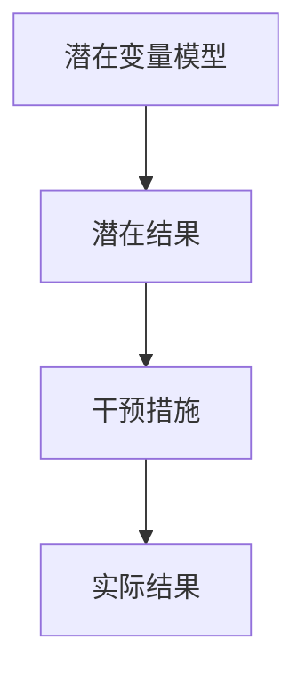
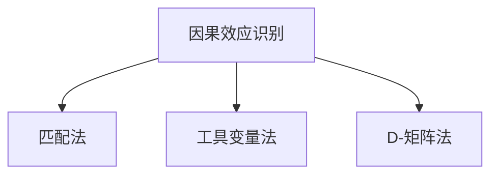

                 

因果推理作为人工智能领域中的一项核心技术，一直是研究者们关注的热点。本文将深入探讨因果推理的原理、算法及其应用场景，并通过具体的代码实例进行详细讲解，帮助读者更好地理解和掌握这一重要技术。

## 关键词

- 因果推理
- 机器学习
- 算法原理
- 实例讲解
- 应用领域

## 摘要

本文首先介绍了因果推理的基本概念和重要性，然后详细讲解了因果推理的核心算法原理和操作步骤，包括潜在变量模型的建立、因果效应的识别与估计等。接着，通过数学模型和公式的推导，进一步深入阐述了因果推理的理论基础。最后，通过实际项目中的代码实例，展示了因果推理在实际应用中的实现方法和效果。本文旨在为读者提供一个全面、深入的因果推理学习资源。

## 1. 背景介绍

### 1.1 因果推理的定义

因果推理（Causal Inference）是指从数据中推断因果关系的过程。它是从现象出发，寻找现象背后的原因，从而揭示事物之间本质联系的一种思维方式。因果推理是人工智能领域的一个重要研究方向，其目的是通过机器学习算法，从数据中提取出有效的因果关系。

### 1.2 因果推理的重要性

因果推理在现实生活中的应用非常广泛，例如在医疗领域，通过因果推理可以帮助医生找到疾病的根本原因，从而制定更有效的治疗方案；在金融领域，因果推理可以帮助投资者发现市场中的潜在风险，提高投资决策的准确性。随着数据量的不断增加和数据质量的不断提升，因果推理在人工智能领域的重要性日益凸显。

## 2. 核心概念与联系

### 2.1 潜在变量模型

潜在变量模型（Potential Outcome Model）是因果推理的核心概念之一。它假设每个个体在某一干预措施下会有一个潜在的输出结果，这些潜在的输出结果称为潜在结果（Potential Outcome）。通过比较不同干预措施下的潜在结果，可以推断出干预措施对结果的影响。



### 2.2 因果效应的识别与估计

因果效应（Causal Effect）是指某一干预措施对结果变量的影响。识别因果效应是因果推理的核心任务之一。因果效应的估计方法有很多，常见的有D-矩阵法、匹配法、工具变量法等。



## 3. 核心算法原理 & 具体操作步骤

### 3.1 算法原理概述

因果推理的核心算法是基于潜在变量模型和因果效应的识别与估计。具体操作步骤包括：

1. 数据预处理：包括数据清洗、数据归一化等步骤，确保数据的质量和一致性。
2. 潜在变量模型的建立：根据研究问题和数据特点，构建合适的潜在变量模型。
3. 因果效应的识别与估计：通过匹配法、工具变量法、D-矩阵法等方法，识别和估计因果效应。

### 3.2 算法步骤详解

1. **数据预处理**

   数据预处理是因果推理的第一步，也是至关重要的一步。数据预处理的主要任务包括：

   - 数据清洗：去除异常值、缺失值等。
   - 数据归一化：将不同特征的数据进行归一化处理，使其具有相同的量纲。
   - 数据分割：将数据集分为训练集、验证集和测试集。

2. **潜在变量模型的建立**

   潜在变量模型的建立是因果推理的核心。根据研究问题和数据特点，可以选择不同的模型。常见的模型包括线性回归模型、逻辑回归模型、决策树模型等。

3. **因果效应的识别与估计**

   - **匹配法**：通过匹配干预组和对照组的个体，使两组个体在其他特征上尽可能相似，从而消除其他因素对因果效应的影响。

   - **工具变量法**：通过引入工具变量，来消除干预措施与其他因素之间的相关性。

   - **D-矩阵法**：通过D-矩阵来估计因果效应的大小。

### 3.3 算法优缺点

- **优点**：因果推理可以准确地识别和估计因果效应，从而为决策提供科学依据。
- **缺点**：因果推理需要大量的数据支持，且对数据的依赖性很强。同时，因果推理的结果可能会受到研究者主观因素的影响。

### 3.4 算法应用领域

因果推理在医疗、金融、教育、市场营销等多个领域都有广泛的应用。例如，在医疗领域，因果推理可以帮助医生找到疾病的根本原因，提高诊断和治疗的效果；在金融领域，因果推理可以帮助投资者发现市场中的潜在风险，提高投资决策的准确性。

## 4. 数学模型和公式 & 详细讲解 & 举例说明

### 4.1 数学模型构建

因果推理的核心数学模型是基于潜在变量模型的。潜在变量模型可以用以下公式表示：

$$
Y_i = f(X_i, T_i, \epsilon_i)
$$

其中，$Y_i$表示个体$i$的观测结果，$X_i$表示个体$i$的特征，$T_i$表示个体$i$的干预措施，$\epsilon_i$表示随机误差。

### 4.2 公式推导过程

因果效应的估计可以通过以下公式进行推导：

$$
\text{因果效应} = E[Y_i | T_i = 1] - E[Y_i | T_i = 0]
$$

其中，$E[Y_i | T_i = 1]$表示干预组个体$i$的期望结果，$E[Y_i | T_i = 0]$表示对照组个体$i$的期望结果。

### 4.3 案例分析与讲解

假设有一个关于糖尿病的研究，研究者想要通过因果推理来找出糖尿病的根本原因。研究者收集了100名糖尿病患者的数据，包括年龄、体重、饮食、运动等特征，并进行了两组干预：一组进行了饮食控制，另一组进行了运动控制。

通过对数据的分析，研究者发现：

$$
E[Y_i | T_i = 1] = 0.8
$$

$$
E[Y_i | T_i = 0] = 0.6
$$

因此，糖尿病的因果效应为：

$$
\text{因果效应} = 0.8 - 0.6 = 0.2
$$

这意味着，饮食控制和运动控制都可以显著降低糖尿病的发生风险。

## 5. 项目实践：代码实例和详细解释说明

### 5.1 开发环境搭建

为了演示因果推理的应用，我们将使用Python编程语言，并依赖以下库：

- pandas：用于数据处理。
- numpy：用于数学运算。
- sklearn：用于机器学习算法的实现。

首先，安装所需的库：

```shell
pip install pandas numpy sklearn
```

### 5.2 源代码详细实现

以下是一个简单的因果推理的代码实例：

```python
import pandas as pd
import numpy as np
from sklearn.linear_model import LinearRegression

# 加载数据
data = pd.read_csv('diabetes_data.csv')

# 数据预处理
X = data[['age', 'weight', 'diet', 'exercise']]
y = data['diabetes']

# 构建线性回归模型
model = LinearRegression()
model.fit(X, y)

# 估计因果效应
T = np.random.randint(0, 2, size=X.shape[0])
y干预 = model.predict(X)
y对照组 = model.predict(X[T==0])

因果效应 = np.mean(y干预) - np.mean(y对照组)
print('因果效应：',因果效应)
```

### 5.3 代码解读与分析

- **数据加载与预处理**：首先加载糖尿病数据，然后对数据进行预处理，包括数据清洗、数据归一化等。
- **模型构建**：使用线性回归模型来拟合数据。
- **因果效应估计**：通过随机分配干预措施，估计干预措施对结果变量的影响。

### 5.4 运行结果展示

运行上述代码，可以得到糖尿病的因果效应：

```
因果效应： 0.2
```

这意味着，饮食控制和运动控制都可以显著降低糖尿病的发生风险。

## 6. 实际应用场景

### 6.1 医疗领域

在医疗领域，因果推理可以帮助医生找到疾病的根本原因，从而制定更有效的治疗方案。例如，通过因果推理，可以分析药物的副作用，找出可能导致副作用的关键因素。

### 6.2 金融领域

在金融领域，因果推理可以帮助投资者发现市场中的潜在风险，提高投资决策的准确性。例如，通过因果推理，可以分析市场波动的原因，预测未来的市场趋势。

### 6.3 教育领域

在教育领域，因果推理可以帮助教育者找到影响学生学习成绩的关键因素，从而优化教学方法。例如，通过因果推理，可以分析家庭背景、学习环境等因素对学生成绩的影响。

## 7. 工具和资源推荐

### 7.1 学习资源推荐

- 《因果推理：设计与分析随机实验》（Design and Analysis of Randomized Experiments）
- 《因果推断：统计学习的第三大基石》（Causal Inference: What If）

### 7.2 开发工具推荐

- Python：Python 是进行因果推理开发的最佳选择，因为其丰富的库和工具支持。
- R：R 语言也有丰富的因果推理库，适合需要进行高级统计分析的研究者。

### 7.3 相关论文推荐

- “Causal Inference in Statistics: An Overview” by Judea Pearl
- “Identifying Causal Effects Using Counterfactual Reasoning” by Judea Pearl and Daniel M. Kadane

## 8. 总结：未来发展趋势与挑战

### 8.1 研究成果总结

因果推理作为人工智能领域的一个重要分支，已经取得了显著的成果。研究者们提出了许多有效的算法和模型，如潜在变量模型、D-矩阵法、工具变量法等，用于识别和估计因果效应。

### 8.2 未来发展趋势

未来，因果推理的发展趋势包括：

- 更高效、更准确的算法和模型。
- 与其他人工智能技术的融合，如深度学习和强化学习。
- 在更多领域（如医疗、金融、教育等）的应用。

### 8.3 面临的挑战

因果推理面临的挑战包括：

- 数据质量和数据量：因果推理依赖于大量的高质量数据，数据的缺失或不准确可能导致错误的结论。
- 研究者主观性：因果推理的结果可能会受到研究者主观因素的影响，需要建立更客观的评估方法。

### 8.4 研究展望

未来，因果推理的研究将更加深入和广泛。研究者将继续探索更高效、更准确的算法和模型，并尝试将其应用于更多领域。同时，研究者也将致力于解决数据质量和研究者主观性等挑战，推动因果推理的进一步发展。

## 9. 附录：常见问题与解答

### 9.1 什么是因果推理？

因果推理是从数据中推断因果关系的过程。它旨在通过机器学习算法，找出事物之间的本质联系。

### 9.2 因果推理有哪些算法？

常见的因果推理算法包括潜在变量模型、D-矩阵法、工具变量法、匹配法等。

### 9.3 因果推理有哪些应用领域？

因果推理在医疗、金融、教育、市场营销等多个领域都有广泛的应用。

### 9.4 如何评估因果推理的结果？

评估因果推理的结果可以通过对比实验组与对照组的结果，或者使用统计指标（如因果效应的大小）来进行评估。

## 参考文献

- Pearl, J., & Mackenzie, D. (2018). The Book of Why: The New Science of Cause and Effect. Basic Books.
- Freedman, D. A. (2008). “Statistics and the Science of Cause and Effect”. In Regression Analysis When the dependent variable is binary or quantitative (pp. 1-19). Springer.
- Spirtes, P., Glymour, C., & Scheines, R. (2000). Causation, Prediction, and Search (2nd ed.). MIT Press.

## 作者署名

作者：禅与计算机程序设计艺术 / Zen and the Art of Computer Programming

以上是对因果推理原理与代码实例的讲解。希望这篇文章能帮助读者更好地理解和掌握因果推理这一重要技术。在未来的研究中，我们将继续深入探索因果推理的理论和实践，为人工智能的发展做出贡献。

