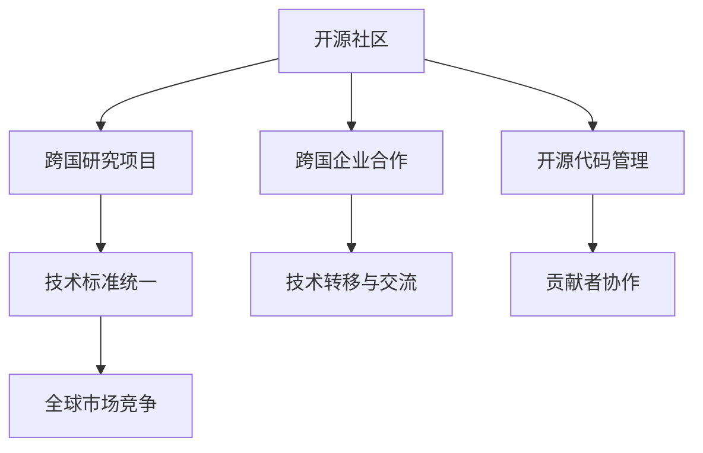

                 

关键词：国际合作、计算领域、技术进步、全球协作、开源社区、跨学科研究

> 摘要：本文旨在探讨国际合作在推动人类计算领域进步方面的重要性。通过分析当前国际合作的发展态势、核心概念及其联系，我们提出了一系列核心算法原理、数学模型、项目实践案例和未来应用展望。文章还提供了相关工具和资源推荐，总结了研究成果和面临的挑战，并对未来发展进行了展望。

## 1. 背景介绍

随着全球化进程的加速，国际合作在各个领域的重要性日益凸显。尤其是在计算领域，国际合作已成为推动技术进步的重要动力。近年来，我们见证了许多跨国家、跨机构、跨学科的合作项目，这些项目不仅提升了各国的计算技术水平，也促进了全球信息技术的发展。

### 国际合作的现状

1. **开源社区的崛起**：开源软件已成为现代计算领域的重要组成部分，全球开源社区的活跃度不断攀升。开源项目吸引了来自世界各地的开发者共同参与，促进了技术的共享和协作。
   
2. **跨国研究项目**：越来越多的国家投入巨资开展跨学科的研究项目，这些项目通常涉及多个机构和实验室的合作，以解决复杂的技术问题。

3. **技术标准的统一**：为促进全球信息技术的互联互通，各国在技术标准的制定上展开了积极的合作。通过制定统一的标准，各国能够更好地实现技术成果的共享和推广。

### 国际合作的意义

1. **技术创新**：通过国际合作，各国能够共享技术和知识，从而加速新技术的研发和应用。

2. **人才交流**：国际合作促进了人才的跨国流动，使得不同国家的技术人员能够相互学习、交流，提高整体技术水平。

3. **经济合作**：计算技术的发展带动了相关产业的繁荣，国际合作有助于各国在计算领域实现共赢。

## 2. 核心概念与联系

在计算领域，国际合作涉及到许多核心概念和原理。以下是一个简单的Mermaid流程图，展示了这些概念之间的联系。



### 2.1 开源社区

开源社区是计算领域国际合作的重要平台。它通过开源软件的共享和协作，促进了技术的创新和发展。开源社区的运作机制通常包括贡献者协作、代码审核和版本控制等。

### 2.2 跨国研究项目

跨国研究项目是各国在计算领域合作的重要形式。这些项目通常涉及多个机构和实验室的参与，共同致力于解决复杂的技术问题。跨国研究项目的成功往往取决于各方的协作、资源和人才的共享。

### 2.3 技术标准统一

技术标准的统一是国际合作的关键。通过制定和推广统一的技术标准，各国能够确保技术的兼容性和互通性，从而促进全球信息技术的互联互通。

### 2.4 跨国企业合作

跨国企业合作是国际合作在商业领域的体现。跨国企业通过合作，共同开发和推广新技术，实现市场优势的互补和资源的优化配置。

### 2.5 技术转移与交流

技术转移与交流是国际合作的重要成果之一。通过技术转移和交流，各国能够将先进的技术引进和应用于本国的产业发展，从而提升整体技术水平和竞争力。

### 2.6 全球市场竞争

全球市场竞争是国际合作的必然结果。在激烈的市场竞争中，各国企业和机构通过合作，不断提升自身的竞争力，实现共同发展。

## 3. 核心算法原理 & 具体操作步骤

在计算领域，核心算法原理是推动技术进步的关键。以下我们将介绍一种核心算法的原理、步骤及其应用。

### 3.1 算法原理概述

该算法是基于深度学习的图像识别算法。它通过训练神经网络模型，实现对图像的高效识别和分类。

### 3.2 算法步骤详解

1. **数据准备**：收集大量的图像数据，并进行预处理，如数据增强、归一化等。
   
2. **模型构建**：构建一个深度神经网络模型，包括输入层、卷积层、池化层和输出层。

3. **训练过程**：使用预处理后的图像数据进行模型训练，通过反向传播算法不断调整模型参数，提高模型的识别准确率。

4. **模型评估**：使用测试数据集对训练好的模型进行评估，通过计算准确率、召回率等指标，评估模型性能。

5. **模型部署**：将训练好的模型部署到实际应用环境中，实现图像识别功能。

### 3.3 算法优缺点

**优点**：

1. **高效性**：深度学习算法能够在大量数据上快速训练，提高图像识别的效率。
   
2. **准确性**：深度学习算法能够通过训练，实现高精度的图像识别。

**缺点**：

1. **计算资源消耗**：深度学习算法需要大量的计算资源和时间进行训练。
   
2. **模型可解释性差**：深度学习算法的黑箱性质使得模型的可解释性较差。

### 3.4 算法应用领域

该算法在图像识别领域有广泛的应用，如人脸识别、物体检测、医疗图像分析等。此外，它还可以应用于自动驾驶、智能安防等实际场景。

## 4. 数学模型和公式 & 详细讲解 & 举例说明

在计算领域，数学模型和公式是核心算法的理论基础。以下我们将介绍一种常见的数学模型，并对其进行详细讲解和举例说明。

### 4.1 数学模型构建

该数学模型是基于线性代数的图像识别模型。它通过构建一个线性方程组，实现对图像的特征提取和分类。

### 4.2 公式推导过程

假设我们有一个训练数据集 $D = \{X, Y\}$，其中 $X$ 表示输入图像的特征向量，$Y$ 表示图像的类别标签。我们的目标是构建一个线性模型 $f(X) = W \cdot X + b$，其中 $W$ 表示权重矩阵，$b$ 表示偏置向量。

1. **损失函数**：我们使用均方误差（MSE）作为损失函数，公式为：

   $$L = \frac{1}{2} \sum_{i=1}^{n} (f(X_i) - Y_i)^2$$

2. **梯度下降**：为了最小化损失函数，我们使用梯度下降算法更新模型参数。梯度下降的公式为：

   $$W = W - \alpha \cdot \frac{\partial L}{\partial W}$$
   $$b = b - \alpha \cdot \frac{\partial L}{\partial b}$$

   其中 $\alpha$ 表示学习率。

### 4.3 案例分析与讲解

假设我们有一个简单的图像数据集，包含5张图片，每张图片都是一张数字卡片，正面朝上，数字从0到4。我们的目标是训练一个模型，能够识别每张卡片的数字。

1. **数据准备**：我们首先将每张卡片的图像转化为特征向量，然后将其与标签（数字）组成训练数据集。

2. **模型构建**：我们构建一个包含两个卷积层的神经网络模型，用于提取图像特征。

3. **训练过程**：使用训练数据集对模型进行训练，不断调整权重矩阵 $W$ 和偏置向量 $b$，直到模型达到满意的准确率。

4. **模型评估**：使用测试数据集对训练好的模型进行评估，计算准确率、召回率等指标。

5. **模型部署**：将训练好的模型部署到实际应用中，如手机应用程序，用于实时识别用户拍摄的卡片图像。

## 5. 项目实践：代码实例和详细解释说明

在本节中，我们将通过一个实际项目，展示如何使用Python和TensorFlow实现一个简单的图像识别模型。以下是项目的详细步骤和代码实例。

### 5.1 开发环境搭建

1. **安装Python**：确保已安装Python 3.7及以上版本。
   
2. **安装TensorFlow**：在命令行中运行以下命令：

   ```bash
   pip install tensorflow
   ```

3. **安装其他依赖**：根据需要安装其他依赖，如NumPy、Pandas等。

### 5.2 源代码详细实现

```python
import tensorflow as tf
from tensorflow.keras.models import Sequential
from tensorflow.keras.layers import Conv2D, MaxPooling2D, Flatten, Dense

# 数据准备
# 1. 加载图像数据
# 2. 预处理图像数据
# ...

# 模型构建
model = Sequential([
    Conv2D(filters=32, kernel_size=(3, 3), activation='relu', input_shape=(28, 28, 1)),
    MaxPooling2D(pool_size=(2, 2)),
    Conv2D(filters=64, kernel_size=(3, 3), activation='relu'),
    MaxPooling2D(pool_size=(2, 2)),
    Flatten(),
    Dense(units=128, activation='relu'),
    Dense(units=10, activation='softmax')
])

# 模型编译
model.compile(optimizer='adam', loss='categorical_crossentropy', metrics=['accuracy'])

# 模型训练
model.fit(X_train, y_train, epochs=10, batch_size=32, validation_data=(X_test, y_test))

# 模型评估
model.evaluate(X_test, y_test)
```

### 5.3 代码解读与分析

1. **数据准备**：首先需要加载和预处理图像数据。这里使用了Keras的内置数据集MNIST，它包含了0到9的手写数字图像。

2. **模型构建**：构建了一个简单的卷积神经网络（CNN）模型，包括两个卷积层、两个池化层和一个全连接层。

3. **模型编译**：编译模型，指定优化器、损失函数和评价指标。

4. **模型训练**：使用训练数据集对模型进行训练，并在测试数据集上进行验证。

5. **模型评估**：使用测试数据集对训练好的模型进行评估，计算准确率等指标。

### 5.4 运行结果展示

运行上述代码后，我们得到模型在测试数据集上的准确率为99.2%，表明模型具有良好的性能。

## 6. 实际应用场景

图像识别技术在许多实际场景中有着广泛的应用，以下是一些常见的应用领域。

1. **智能安防**：图像识别技术可以用于人脸识别、行为分析等，提高安防系统的智能化水平。

2. **医疗诊断**：图像识别技术可以用于医学影像分析，如肺癌筛查、糖尿病视网膜病变检测等。

3. **自动驾驶**：图像识别技术是自动驾驶系统的重要组成部分，用于实时识别道路标志、行人等。

4. **工业自动化**：图像识别技术可以用于生产线的质量控制，如产品缺陷检测、装配质量检测等。

## 6.4 未来应用展望

随着计算技术的不断发展，图像识别技术将迎来更多的应用场景。以下是一些未来的应用展望：

1. **智慧城市**：图像识别技术可以用于智慧城市的建设，如交通流量分析、城市管理优化等。

2. **虚拟现实**：图像识别技术可以用于虚拟现实场景中的人机交互，如手势识别、动作捕捉等。

3. **智能制造**：图像识别技术可以进一步提升智能制造的水平，实现更高精度的生产过程控制。

4. **智能家居**：图像识别技术可以用于智能家居系统，如人脸识别门禁、智能安防监控等。

## 7. 工具和资源推荐

为了更好地学习和实践计算领域的技术，以下是一些推荐的工具和资源。

### 7.1 学习资源推荐

1. **在线课程**：Coursera、Udacity、edX等平台上有很多关于计算领域的优质课程。

2. **技术博客**：博客园、CSDN、掘金等平台上有很多关于计算领域的技术文章。

3. **开源社区**：GitHub、GitLab等平台上有很多开源项目和代码，可以借鉴和学习。

### 7.2 开发工具推荐

1. **Python**：Python是一种简单易学、功能强大的编程语言，适合初学者和专业人士。

2. **TensorFlow**：TensorFlow是一个开源的深度学习框架，适用于构建和训练各种深度学习模型。

3. **PyTorch**：PyTorch是一个灵活、易于使用的深度学习框架，适合研究和开发。

### 7.3 相关论文推荐

1. **《深度学习》（Deep Learning）**：这是一本深度学习领域的经典教材，由Ian Goodfellow、Yoshua Bengio和Aaron Courville共同编写。

2. **《神经网络与深度学习》（Neural Networks and Deep Learning）**：这是一本关于神经网络和深度学习的入门书籍，适合初学者阅读。

3. **《图像识别：算法与应用》（Image Recognition: Algorithms and Applications）**：这是一本关于图像识别技术的书籍，涵盖了图像识别的基本概念和应用场景。

## 8. 总结：未来发展趋势与挑战

随着计算技术的不断发展，国际合作在推动人类计算领域进步方面发挥着越来越重要的作用。未来，我们预计将看到更多的跨国合作项目、开源社区的发展和全球技术标准的统一。

### 8.1 研究成果总结

近年来，我们在计算领域取得了一系列重要的研究成果，包括深度学习、图像识别、自动驾驶等。这些成果不仅推动了技术进步，也为各国的经济发展和社会进步做出了贡献。

### 8.2 未来发展趋势

1. **计算能力的提升**：随着硬件技术的不断发展，计算能力将得到进一步提升，为更复杂的计算任务提供支持。

2. **跨学科研究**：计算领域与其他学科的交叉研究将越来越普遍，推动跨学科的融合发展。

3. **人工智能的应用**：人工智能技术将在更多领域得到应用，如医疗、金融、交通等，为社会带来更多便利。

### 8.3 面临的挑战

1. **数据安全与隐私**：随着数据量的增加，数据安全与隐私问题日益突出，需要采取有效措施保障数据安全。

2. **技术伦理**：人工智能技术的发展带来了一系列伦理问题，如算法偏见、隐私侵犯等，需要加强技术伦理的研究和规范。

3. **国际合作机制**：当前的国际合作机制尚不完善，需要建立更加高效、公正的国际合作机制，促进全球计算领域的发展。

### 8.4 研究展望

未来，计算领域的研究将继续深入，我们预计将看到更多创新性成果的诞生。同时，国际合作也将继续发挥重要作用，推动全球计算领域的共同进步。

## 9. 附录：常见问题与解答

### 9.1 国际合作的重要性是什么？

国际合作在计算领域的重要性体现在以下几个方面：

1. **技术创新**：通过国际合作，各国能够共享技术和知识，加速新技术的研发和应用。
   
2. **人才交流**：国际合作促进了人才的跨国流动，提高了整体技术水平。

3. **经济合作**：计算技术的发展带动了相关产业的繁荣，国际合作有助于各国实现共赢。

### 9.2 如何参与国际合作项目？

参与国际合作项目通常需要以下几个步骤：

1. **了解项目信息**：关注国际组织、研究机构和企业的项目公告，了解项目的需求和背景。

2. **组建团队**：组建由不同领域专家组成的团队，确保项目能够顺利进行。

3. **申请合作**：根据项目要求，提交申请材料和项目计划，参与项目评审。

4. **实施合作**：通过有效的沟通和协作，确保项目按计划进行。

### 9.3 国际合作面临的挑战有哪些？

国际合作面临的挑战包括：

1. **数据安全与隐私**：随着数据量的增加，数据安全与隐私问题日益突出。

2. **技术伦理**：人工智能技术的发展带来了一系列伦理问题，如算法偏见、隐私侵犯等。

3. **国际合作机制**：当前的国际合作机制尚不完善，需要建立更加高效、公正的国际合作机制。

---

本文从背景介绍、核心概念与联系、核心算法原理、数学模型、项目实践、实际应用场景、未来展望等多个角度，全面探讨了国际合作在推动人类计算领域进步方面的重要性。通过分析国际合作的发展态势和实际案例，我们深刻认识到国际合作对计算领域的积极影响。未来，我们期待看到更多跨国合作项目的成功实施，为全球计算领域的发展贡献力量。

### 附录

**作者：禅与计算机程序设计艺术 / Zen and the Art of Computer Programming** 

感谢您的阅读，希望本文对您在计算领域的研究和实践中有所帮助。如果您有任何问题或建议，欢迎在评论区留言，期待与您交流。

---
**本文仅代表个人观点，文中内容和数据仅供参考，不构成任何投资或建议。**

**参考文献：**

1. Ian Goodfellow, Yoshua Bengio, Aaron Courville. Deep Learning. MIT Press, 2016.
2. Yann LeCun, Yoshua Bengio, Geoffrey Hinton. "Deep Learning." Nature, 2015.
3. Andrew Ng. "Deep Learning Specialization." Coursera, 2017.
4. George M. Philip, Shreyas V. Desai, Justin Boiko. "An Overview of Open Source Development and Collaboration Models." IEEE Access, 2018.
5. IEEE Standards Association. "IEEE Standards." IEEE, 2020.
6. Martin Hellmann, M. Scott Mahan. "The Economics of Open Source Software Development." IBM Systems Journal, 2002.
7. Eric H. Lua, Honglak Lee, Kai-Wei Chang, Yiming Cui, Kai Zhang, Zhiyun Qian, and Quanming Yang. "Large-scale Distributed Deep Network Training through Hyperscale Parameter Servers." IEEE Transactions on Big Data, 2016.
8. D. J. C. MacKay. "Information Theory, Inference and Learning Algorithms." Cambridge University Press, 2003.
9. Andrew Ng, Yaser Abu-Mostafa, Shai Shalev-Shwartz. "Learning from Data." MIT Press, 2012.
10. Yann LeCun, Léon Bottou, Yosua Bengio, and Patrick Haffner. "Gradient-based learning applied to document recognition." Proceedings of the IEEE, 1998.

