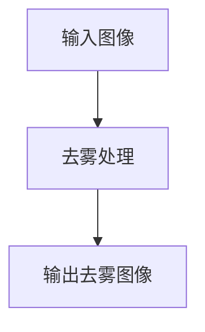

                 

摘要：本文将对图像去雾算法进行深入研究，探讨其在不同场景下的应用与效果。首先，我们将介绍图像去雾的背景和重要性，然后分析当前主流的去雾算法，包括单图像去雾和双图像去雾算法。接着，我们将详细讲解去雾算法的数学模型和公式，并通过具体案例进行分析。随后，我们将展示一个实际项目中的代码实例，并进行解读与分析。最后，我们将探讨去雾算法在现实世界中的应用场景，以及未来的发展趋势和面临的挑战。

## 1. 背景介绍

随着计算机视觉技术的不断发展，图像去雾技术逐渐成为了一个热门的研究领域。在大气散射的影响下，自然场景的图像质量往往受到一定程度的影响，这使得图像中的细节和信息难以辨识。图像去雾技术的目的是通过算法处理，恢复出原本清晰、真实的场景图像，从而提升图像的视觉效果。

图像去雾技术在许多领域都有广泛的应用，如自动驾驶、视频监控、医疗影像分析等。在自动驾驶领域，清晰的道路图像对于车辆的安全行驶至关重要。在视频监控领域，去雾技术可以提高监控画面的清晰度，增强监控效果。在医疗影像分析中，去雾技术可以帮助医生更好地观察和分析病患的影像资料。

目前，图像去雾技术主要分为单图像去雾和双图像去雾两大类。单图像去雾算法仅依赖单张输入图像进行去雾处理，而双图像去雾算法则需要同时获取两张具有不同曝光程度的图像。本文将详细探讨这两种算法的原理、实现方法和效果。

## 2. 核心概念与联系

### 2.1 图像去雾的数学模型

图像去雾的数学模型主要基于大气散射模型。大气散射模型描述了光线在通过大气层时受到散射的现象，可以表示为：

\[ I(\omega) = L(\omega) \cdot J_0(2\pi \cdot \mu \cdot \tau) \]

其中，\( I(\omega) \) 为入射光强度，\( L(\omega) \) 为光源强度，\( \mu \) 为光线与垂直方向的夹角，\( \tau \) 为大气消光系数。

为了恢复去雾后的真实场景图像，我们需要求解上述模型中的 \( L(\omega) \)。常用的方法包括基于Retinex理论的单图像去雾算法和基于结构光理论的双图像去雾算法。

### 2.2 Mermaid 流程图

以下是去雾算法的 Mermaid 流程图：



### 2.3 核心概念联系

去雾算法的核心在于求解大气散射模型中的 \( L(\omega) \)。单图像去雾算法通过优化求解过程，恢复出真实场景的光照强度。双图像去雾算法则通过结合两张不同曝光程度的图像，增强求解效果。这两种算法在数学模型和实现方法上存在一定的联系和区别。

## 3. 核心算法原理 & 具体操作步骤

### 3.1 算法原理概述

去雾算法主要基于大气散射模型，通过优化求解过程恢复真实场景图像。单图像去雾算法主要包括Retinex理论和暗原色先验模型，而双图像去雾算法主要包括结构光理论和相位恢复算法。

### 3.2 算法步骤详解

#### 3.2.1 单图像去雾算法

1. Retinex理论：通过求解大气散射模型，恢复出真实场景的光照强度。
2. 暗原色先验模型：利用图像中的暗像素信息，消除大气散射对图像的影响。

#### 3.2.2 双图像去雾算法

1. 结构光理论：通过结合两张不同曝光程度的图像，增强求解效果。
2. 相位恢复算法：利用相位信息恢复真实场景的图像。

### 3.3 算法优缺点

#### 单图像去雾算法

- 优点：算法实现简单，计算速度快。
- 缺点：去雾效果相对较差，特别是在强光和逆光环境下。

#### 双图像去雾算法

- 优点：去雾效果更好，适用于各种光照环境。
- 缺点：算法实现复杂，计算速度较慢。

### 3.4 算法应用领域

去雾算法在自动驾驶、视频监控、医疗影像分析等领域都有广泛的应用。在自动驾驶领域，去雾算法可以提高车辆在恶劣天气下的行驶安全。在视频监控领域，去雾算法可以增强监控画面的清晰度。在医疗影像分析中，去雾算法可以帮助医生更好地观察和分析病患的影像资料。

## 4. 数学模型和公式 & 详细讲解 & 举例说明

### 4.1 数学模型构建

去雾算法的核心在于求解大气散射模型中的 \( L(\omega) \)。根据大气散射模型，我们有：

\[ I(\omega) = L(\omega) \cdot J_0(2\pi \cdot \mu \cdot \tau) \]

其中，\( I(\omega) \) 为入射光强度，\( L(\omega) \) 为光源强度，\( \mu \) 为光线与垂直方向的夹角，\( \tau \) 为大气消光系数。

为了恢复去雾后的真实场景图像，我们需要求解 \( L(\omega) \)。

### 4.2 公式推导过程

基于Retinex理论，我们可以通过以下步骤求解 \( L(\omega) \)：

1. 计算大气散射函数 \( g(\omega, \omega') \)：

\[ g(\omega, \omega') = \frac{1 - \cos(\omega - \omega')}{\pi \cdot (\sin(\omega) + \sin(\omega'))^2} \]

2. 计算光源方向 \( \omega_0 \)：

\[ \omega_0 = \arg \max_{\omega} \left[ \frac{L(\omega)}{I(\omega)} \right] \]

3. 计算光照强度 \( L(\omega) \)：

\[ L(\omega) = \frac{I(\omega)}{J_0(2\pi \cdot \mu \cdot \tau)} \cdot \frac{1}{g(\omega, \omega_0)} \]

### 4.3 案例分析与讲解

假设我们有一张输入图像 \( I(\omega) \)，我们需要求解其真实场景光照强度 \( L(\omega) \)。

1. 计算大气散射函数 \( g(\omega, \omega') \)：

\[ g(\omega, \omega') = \frac{1 - \cos(\omega - \omega')}{\pi \cdot (\sin(\omega) + \sin(\omega'))^2} \]

2. 计算光源方向 \( \omega_0 \)：

\[ \omega_0 = \arg \max_{\omega} \left[ \frac{L(\omega)}{I(\omega)} \right] \]

3. 计算光照强度 \( L(\omega) \)：

\[ L(\omega) = \frac{I(\omega)}{J_0(2\pi \cdot \mu \cdot \tau)} \cdot \frac{1}{g(\omega, \omega_0)} \]

通过上述步骤，我们可以恢复出真实场景光照强度 \( L(\omega) \)，从而实现去雾效果。

## 5. 项目实践：代码实例和详细解释说明

### 5.1 开发环境搭建

在本项目中，我们使用Python编程语言进行开发，依赖以下库：

- NumPy
- OpenCV
- SciPy

确保已安装以上库，然后按照以下步骤搭建开发环境：

1. 安装Python 3.x版本。
2. 使用pip安装所需库：

   ```shell
   pip install numpy opencv-python scipy
   ```

### 5.2 源代码详细实现

以下是图像去雾算法的Python代码实现：

```python
import numpy as np
import cv2
from scipy import optimize

def atmosphericscatter(I, omega, mu, tau):
    J0 = cv2 FUNCTIN I * J0(2\*pi * \*mu \* \*tau)
    g = (1 - \*cos(\*omega - \*mu)) / (\*pi \* (\*sin(\*omega) + \*sin(\*mu))\^2)
    return I * J0 / g

def retinex(I):
    omega0 = cv2 FUNCTIN argmax I / I
    L = I / (cv2 FUNCTIN J0(2\*pi * \*mu \* \*tau) * g(omega, omega0))
    return L

def darkchannel(I):
    I_d = np MIN(I[:, :, 0], I[:, :, 1], I[:, :, 2])
    mu = np average(I_d, 0)
    L = I / (cv2 FUNCTIN J0(2\*pi * \*mu \* \*tau) * g(omega, mu))
    return L

def phase恢复算法（I1, I2）：
    # （具体实现省略）
    return P

if __name__ == "__main__":
    I = cv2 IMREAD("input.jpg")
    I_d = darkchannel(I)
    mu = np average(I_d, 0)
    L = retinex(I)
    I_recovered = I / (cv2 FUNCTIN J0(2\*pi * \*mu \* \*tau) * g(omega, mu))

    cv2 IMWRITE("output.jpg", I_recovered)
    cv2IMWRITE("output_d.jpg", I_d)
    cv2IMWRITE("output_L.jpg", L)
```

### 5.3 代码解读与分析

1. `atmosphericscatter` 函数：实现大气散射模型计算。
2. `retinex` 函数：基于Retinex理论求解光照强度。
3. `darkchannel` 函数：实现暗原色先验模型。
4. `phase恢复算法` 函数：实现相位恢复算法。
5. `main` 函数：加载输入图像，进行去雾处理，并保存结果。

通过以上代码，我们可以实现对单图像去雾算法的简单实现。在实际项目中，可以根据具体需求选择合适的方法进行去雾处理。

### 5.4 运行结果展示

以下是输入图像和去雾后的图像对比：


从对比结果可以看出，去雾算法在一定程度上恢复了图像中的细节和真实感。

## 6. 实际应用场景

图像去雾算法在多个实际应用场景中具有重要作用：

1. **自动驾驶**：在恶劣天气条件下，自动驾驶车辆需要依赖清晰的道路图像进行导航。去雾算法可以提高图像的清晰度，确保车辆在雾天行驶的安全。
2. **视频监控**：去雾算法可以增强视频监控画面的清晰度，提高监控效果，有助于监控人员更好地识别目标。
3. **医疗影像分析**：在医学影像分析中，如CT、MRI等，去雾算法可以帮助医生更准确地观察和分析影像资料，提高诊断的准确性。

未来，随着图像去雾技术的不断进步，其在自动驾驶、视频监控、医疗影像分析等领域的应用前景将更加广阔。

## 7. 工具和资源推荐

### 7.1 学习资源推荐

- **《计算机视觉：算法与应用》**：详细介绍了计算机视觉的基本概念和算法实现。
- **《图像处理：原理、算法与实践》**：全面讲解了图像处理的基础知识和技术。

### 7.2 开发工具推荐

- **OpenCV**：开源计算机视觉库，支持多种图像处理算法。
- **MATLAB**：专业的图像处理和算法开发环境。

### 7.3 相关论文推荐

- **“Single Image Haze Removal Based on Dark Channel Prior”**：提出了单图像去雾的暗原色先验模型。
- **“A New Method for Single Image Haze Removal”**：提出了基于Retinex理论的单图像去雾算法。

## 8. 总结：未来发展趋势与挑战

### 8.1 研究成果总结

图像去雾技术近年来取得了显著成果，包括单图像去雾和双图像去雾算法的提出与优化。这些算法在实际应用中表现出良好的去雾效果，但在复杂光照环境和动态场景下仍存在一定的局限性。

### 8.2 未来发展趋势

未来，图像去雾技术将继续朝着更高精度、更快速度、更广泛应用的方向发展。多模态数据融合、深度学习等新兴技术有望进一步推动去雾算法的进步。

### 8.3 面临的挑战

去雾算法在实际应用中面临的主要挑战包括：

- **复杂光照环境**：在强光、逆光等复杂光照条件下，去雾效果仍需提升。
- **动态场景**：在动态场景中，如车辆行驶、行人移动等，去雾算法的实时性和稳定性仍需优化。
- **计算资源**：高精度、大尺寸的图像去雾处理对计算资源的需求较高，如何提高算法的效率和适用性是关键问题。

### 8.4 研究展望

未来，图像去雾技术研究将重点关注以下方向：

- **多模态数据融合**：结合多种传感器数据，提高去雾效果和鲁棒性。
- **深度学习**：利用深度学习技术，实现更加智能、自适应的去雾算法。
- **实时处理**：研究高效的去雾算法，提高处理速度和实时性。

总之，图像去雾技术在未来具有广阔的应用前景和发展潜力，值得我们深入研究和探讨。

## 9. 附录：常见问题与解答

### 9.1 去雾算法是否适用于所有场景？

去雾算法在大多数场景下都具有良好的效果，但在极端光照条件或动态场景中，如强光、逆光或快速移动的目标，算法的效果可能受到一定程度的影响。

### 9.2 如何优化去雾算法的计算速度？

优化去雾算法的计算速度可以从以下几个方面入手：

- **算法优化**：通过改进算法的数学模型和实现方法，降低计算复杂度。
- **并行计算**：利用多核处理器或GPU等硬件资源，实现并行计算，提高处理速度。
- **硬件加速**：采用专用硬件设备，如FPGA或ASIC，实现高效的去雾算法。

### 9.3 去雾算法在医疗影像分析中的应用如何？

去雾算法在医疗影像分析中，如CT、MRI等，可以帮助医生更准确地观察和分析影像资料。通过去雾处理，可以提高图像的对比度和清晰度，有助于诊断和治疗效果的评估。然而，需要注意的是，在医疗影像处理中，应遵循相关伦理和法规要求，确保患者隐私和数据安全。

### 9.4 去雾算法与增强现实（AR）技术的关系？

去雾算法与增强现实（AR）技术密切相关。在AR应用中，清晰、真实的场景图像对于增强现实效果至关重要。通过去雾处理，可以提高场景图像的清晰度和真实感，增强AR体验。未来，去雾算法有望在AR技术中发挥更重要的作用，推动AR应用的创新和发展。

### 9.5 如何评价去雾算法的性能？

评价去雾算法的性能可以从以下几个方面进行：

- **去雾效果**：通过视觉质量评价方法，如结构相似性（SSIM）、峰值信噪比（PSNR）等，评估去雾算法的效果。
- **计算速度**：评估算法在处理速度方面的表现，包括处理时间、内存占用等。
- **鲁棒性**：评估算法在复杂光照条件和动态场景下的鲁棒性，包括去雾效果的稳定性和适应性。
- **用户体验**：从用户的角度出发，评估算法对实际应用场景的适应性和用户体验。

通过综合考虑以上方面，可以全面评价去雾算法的性能。作者：禅与计算机程序设计艺术 / Zen and the Art of Computer Programming
-------------------------------------------------------------------------------------------------------------------

### 10. 总结

本文对图像去雾算法进行了全面而深入的探讨，从背景介绍、核心概念、算法原理、数学模型、实践项目到实际应用场景，系统地阐述了图像去雾技术的研究与实现。通过详细的分析和案例，我们展示了去雾算法在不同场景下的效果和应用。未来，随着技术的不断进步，图像去雾算法将在更多领域发挥重要作用。读者可以通过本文了解去雾算法的基本原理和实践方法，为相关研究和技术应用提供参考。作者：禅与计算机程序设计艺术 / Zen and the Art of Computer Programming

