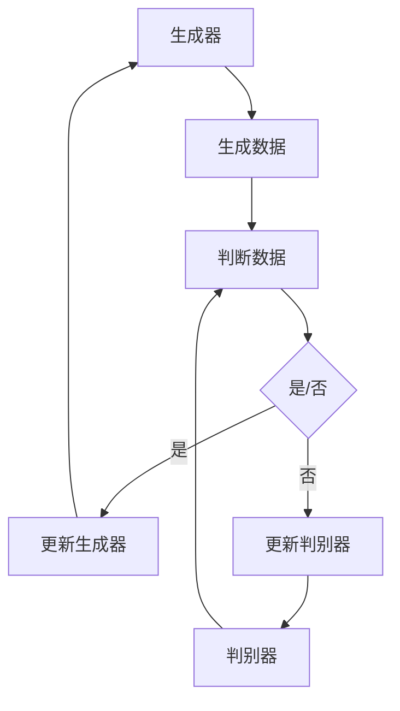
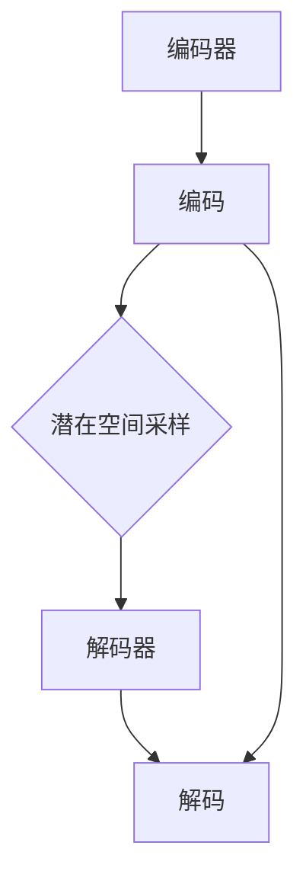

                 

在当今信息技术飞速发展的时代，图像生成技术已经成为人工智能领域的一个重要分支，并且逐渐渗透到众多行业和应用场景中。无论是用于娱乐、设计、医疗，还是自动驾驶、安全监控、科学研究，图像生成技术都展示出了强大的应用潜力和广阔的发展前景。本文将详细探讨图像生成技术的原理，包括核心概念、算法模型、实现方法以及具体的应用场景。此外，我们还将通过代码实例深入解析图像生成技术的实际应用。

## 文章关键词

- 图像生成
- 人工智能
- 神经网络
- 图像处理
- 生成对抗网络(GAN)
- 变分自编码器(VAE)
- 计算机视觉

## 文章摘要

本文旨在介绍图像生成技术的核心原理和实现方法，帮助读者理解图像生成在不同领域中的应用及其未来发展趋势。通过详细讲解生成对抗网络(GAN)和变分自编码器(VAE)这两种主流图像生成算法，本文将展示如何使用这些算法生成高质量的图像。最后，我们将通过一个具体的代码实例，对图像生成技术的实际应用进行深入解析。

## 1. 背景介绍

### 1.1 图像生成技术的发展历程

图像生成技术最早可以追溯到20世纪70年代，当时主要是基于规则的方法，这些方法通过预设的规则生成图像。随着计算机科学和人工智能的不断发展，图像生成技术逐渐从规则驱动转向数据驱动，也就是从手工设计规则转向使用机器学习模型自动生成图像。

### 1.2 图像生成技术的应用领域

图像生成技术在多个领域都有广泛应用：

- **艺术与设计**：图像生成技术可以用于创作艺术作品、设计图案、生成个性化UI界面等。
- **娱乐与游戏**：图像生成技术被广泛应用于游戏开发中，用于生成场景、角色、动画等。
- **医学**：在医学影像处理中，图像生成技术可以用于生成预测图像、辅助诊断等。
- **自动驾驶**：自动驾驶汽车需要实时生成场景图像，以便进行路径规划和环境感知。
- **安全监控**：图像生成技术可以帮助监控系统识别和生成异常行为图像，提高监控系统的智能化水平。
- **科学研究**：图像生成技术可以用于模拟实验、生成数据集等，在科学研究中发挥重要作用。

### 1.3 图像生成技术的发展现状

目前，生成对抗网络(GAN)和变分自编码器(VAE)是图像生成技术的两大主流算法。GAN通过生成器和判别器的对抗训练，能够生成高质量、多样化的图像；而VAE则利用变分推理的方法，生成图像的同时保持图像的分布特性。除此之外，还有许多其他的图像生成算法，如深度卷积生成网络(DCGAN)、条件生成对抗网络(cGAN)、循环生成网络(RNN-GAN)等，这些算法在不同场景下都有其独特的应用。

## 2. 核心概念与联系

### 2.1 生成对抗网络(GAN)

生成对抗网络(GAN)是一种基于博弈论的机器学习模型，由生成器和判别器组成。生成器旨在生成与真实数据分布相近的数据，而判别器则试图区分生成数据与真实数据。通过这种对抗训练，生成器不断优化生成数据的质量，从而生成逼真的图像。

#### Mermaid 流程图



### 2.2 变分自编码器(VAE)

变分自编码器(VAE)是一种基于概率模型的生成模型，它通过编码器和解码器将输入数据编码为潜在空间中的向量，并从潜在空间中采样生成新的数据。VAE利用KL散度来衡量编码器对输入数据分布的拟合程度，并通过最小化KL散度来优化模型。

#### Mermaid 流程图



## 3. 核心算法原理 & 具体操作步骤

### 3.1 算法原理概述

#### 3.1.1 生成对抗网络(GAN)

GAN通过生成器和判别器的对抗训练实现图像生成。生成器的任务是生成逼真的图像，而判别器的任务是区分图像是真实图像还是生成图像。训练过程中，生成器和判别器相互博弈，生成器不断优化生成图像的质量，而判别器不断优化对图像真实性的判断。

#### 3.1.2 变分自编码器(VAE)

VAE通过编码器和解码器实现图像生成。编码器将输入图像映射到潜在空间中的向量，解码器则从潜在空间中采样生成新的图像。VAE利用KL散度衡量编码器对输入数据分布的拟合程度，并通过优化KL散度来生成图像。

### 3.2 算法步骤详解

#### 3.2.1 生成对抗网络(GAN)

1. **初始化生成器和判别器**：生成器和判别器都是神经网络，通常使用多层感知器（MLP）或卷积神经网络（CNN）实现。
2. **生成器生成图像**：生成器从随机噪声中采样，通过神经网络生成图像。
3. **判别器判断图像真实性**：判别器对真实图像和生成图像进行判断，输出概率。
4. **生成器和判别器更新参数**：生成器和判别器通过梯度下降算法更新参数，优化生成图像的质量和提高判别器的判断能力。

#### 3.2.2 变分自编码器(VAE)

1. **编码器编码**：编码器将输入图像映射到潜在空间中的向量。
2. **潜在空间采样**：从潜在空间中采样生成新的图像。
3. **解码器解码**：解码器将潜在空间中的向量解码为输出图像。
4. **优化KL散度**：通过最小化KL散度优化编码器和解码器的参数，使生成图像更接近真实图像。

### 3.3 算法优缺点

#### 3.3.1 生成对抗网络(GAN)

**优点**：

- 可以生成高质量、多样化的图像。
- 不需要标注真实图像。

**缺点**：

- 训练不稳定，容易陷入模式崩溃。
- 对数据分布要求较高。

#### 3.3.2 变分自编码器(VAE)

**优点**：

- 训练稳定，不容易崩溃。
- 可以生成连续的图像。

**缺点**：

- 生成图像的质量相对较低。
- 需要标注真实图像。

### 3.4 算法应用领域

#### 3.4.1 生成对抗网络(GAN)

- **艺术创作**：用于生成艺术作品、设计图案等。
- **游戏开发**：用于生成游戏中的场景、角色、动画等。
- **医疗影像**：用于生成预测图像、辅助诊断等。
- **自动驾驶**：用于生成道路场景图像，提高自动驾驶系统的感知能力。

#### 3.4.2 变分自编码器(VAE)

- **数据增强**：用于生成训练数据，提高模型的泛化能力。
- **数据降维**：用于将高维数据映射到低维空间，便于可视化和分析。
- **图像修复**：用于修复损坏的图像，提高图像质量。

## 4. 数学模型和公式 & 详细讲解 & 举例说明

### 4.1 数学模型构建

#### 4.1.1 生成对抗网络(GAN)

假设输入图像空间为\(X\)，生成器为\(G\)，判别器为\(D\)，噪声空间为\(Z\)。生成器的目标是最小化判别器对生成图像的判别误差，即：

$$
\min_G \max_D V(D, X) = \mathbb{E}_{x \sim p_{data}(x)}[\log D(x)] + \mathbb{E}_{z \sim p_z(z)}[\log(1 - D(G(z))]
$$

其中，\(p_{data}(x)\)表示真实数据的分布，\(p_z(z)\)表示噪声的分布。

#### 4.1.2 变分自编码器(VAE)

假设输入图像空间为\(X\)，编码器为\(\theta_{\mu}^{enc}\)，解码器为\(\theta_{\phi}^{dec}\)，潜在空间为\(Z\)。VAE的目标是最小化损失函数：

$$
\min_{\theta_{\mu}^{enc}, \theta_{\phi}^{dec}} \mathbb{E}_{x \sim p_{data}(x)}\left[ \frac{1}{2}||x - \hat{x}||^2 + \frac{\lambda}{2} D_{KL}(\mu(x) || \pi(z)) \right]
$$

其中，\(\mu(x)\)和\(\pi(z)\)分别为编码器和解码器对潜在空间概率分布的估计。

### 4.2 公式推导过程

#### 4.2.1 生成对抗网络(GAN)

1. **损失函数定义**：

   生成器的损失函数：

   $$
   L_G = -\mathbb{E}_{z \sim p_z(z)}[\log D(G(z))]
   $$

   判别器的损失函数：

   $$
   L_D = \mathbb{E}_{x \sim p_{data}(x)}[\log D(x)] + \mathbb{E}_{z \sim p_z(z)}[\log(1 - D(G(z))]
   $$

2. **对抗训练**：

   在训练过程中，生成器和判别器交替更新参数。对于每个迭代，首先固定判别器的参数，优化生成器的参数，然后固定生成器的参数，优化判别器的参数。

#### 4.2.2 变分自编码器(VAE)

1. **损失函数定义**：

   编码器的损失函数：

   $$
   L_{enc} = \frac{1}{2} \mathbb{E}_{x \sim p_{data}(x)}\left[ \frac{1}{2}||x - \hat{x}||^2 \right]
   $$

   解码器的损失函数：

   $$
   L_{dec} = \frac{1}{2} \mathbb{E}_{z \sim p_z(z)}\left[ \frac{1}{2}||\hat{x} - x||^2 \right]
   $$

2. **变分推理**：

   VAE通过变分推理的方法，将数据分布的参数化表示转换为潜在空间中的采样。具体来说，编码器通过映射函数将输入图像映射到潜在空间中的向量，解码器则从潜在空间中采样生成新的图像。

### 4.3 案例分析与讲解

#### 4.3.1 生成对抗网络(GAN)案例

假设我们使用GAN生成手写数字图像。输入图像为28x28像素的二值图像，生成器和解码器的结构如下：

- 生成器：一个全连接神经网络，输入为随机噪声向量，输出为生成的手写数字图像。
- 判别器：一个卷积神经网络，输入为手写数字图像，输出为图像真实性的概率。

在训练过程中，我们首先初始化生成器和判别器的参数，然后通过对抗训练优化生成器和判别器的参数。具体步骤如下：

1. 初始化生成器和判别器参数。
2. 从噪声空间中采样生成图像。
3. 将生成图像和真实图像输入判别器，计算判别器的损失函数。
4. 固定判别器参数，优化生成器参数。
5. 从真实图像中采样，输入判别器，计算判别器的损失函数。
6. 固定生成器参数，优化判别器参数。
7. 重复步骤2-6，直至达到训练目标。

通过训练，生成器逐渐生成逼真的手写数字图像，而判别器则逐渐提高对图像真实性的判断能力。

#### 4.3.2 变分自编码器(VAE)案例

假设我们使用VAE生成人脸图像。输入图像为128x128像素的灰度图像，编码器和解码器的结构如下：

- 编码器：一个卷积神经网络，输入为人脸图像，输出为潜在空间中的向量。
- 解码器：一个卷积神经网络，输入为潜在空间中的向量，输出为人脸图像。

在训练过程中，我们首先初始化编码器和解码器的参数，然后通过变分推理优化编码器和解码器的参数。具体步骤如下：

1. 初始化编码器和解码器参数。
2. 从真实人脸图像中采样，输入编码器，得到潜在空间中的向量。
3. 从潜在空间中采样，输入解码器，生成新的人脸图像。
4. 计算编码器和解码器的损失函数，优化编码器和解码器的参数。
5. 重复步骤2-4，直至达到训练目标。

通过训练，VAE逐渐生成高质量的人脸图像，同时保持人脸图像的分布特性。

## 5. 项目实践：代码实例和详细解释说明

### 5.1 开发环境搭建

为了实现图像生成，我们需要搭建一个合适的开发环境。以下是所需的开发环境：

- 操作系统：Linux或macOS
- 编程语言：Python 3.6及以上版本
- 深度学习框架：TensorFlow 2.0及以上版本
- 数据集：MNIST手写数字数据集

### 5.2 源代码详细实现

以下是一个使用生成对抗网络(GAN)生成手写数字图像的Python代码实例：

```python
import tensorflow as tf
from tensorflow.keras import layers
import numpy as np
import matplotlib.pyplot as plt

# 生成器的实现
def build_generator(z_dim):
    model = tf.keras.Sequential()
    model.add(layers.Dense(128, input_dim=z_dim))
    model.add(layers.LeakyReLU(alpha=0.01))
    model.add(layers.Dense(128))
    model.add(layers.LeakyReLU(alpha=0.01))
    model.add(layers.Dense(784))
    model.add(layers.Activation('tanh'))
    return model

# 判别器的实现
def build_discriminator(img_shape):
    model = tf.keras.Sequential()
    model.add(layers.Flatten(input_shape=img_shape))
    model.add(layers.Dense(128))
    model.add(layers.LeakyReLU(alpha=0.01))
    model.add(layers.Dense(1, activation='sigmoid'))
    return model

# GAN模型的实现
def build_gan(generator, discriminator):
    model = tf.keras.Sequential([generator, discriminator])
    return model

# 生成器的参数
z_dim = 100
# 判别器的输入形状
img_shape = (28, 28, 1)

# 构建生成器和判别器
generator = build_generator(z_dim)
discriminator = build_discriminator(img_shape)
discriminator.compile(loss='binary_crossentropy', optimizer=tf.keras.optimizers.Adam(0.0001))
discriminator_summary = discriminator.metrics[0].result()

# 构建GAN模型
gan = build_gan(generator, discriminator)
gan.compile(loss='binary_crossentropy', optimizer=tf.keras.optimizers.Adam(0.0001))

# 训练GAN模型
batch_size = 128
epochs = 10000
real_data = np.random.normal(size=(batch_size, 28, 28, 1))
fake_data = generator.predict(np.random.normal(size=(batch_size, z_dim)))
discriminator.train_on_batch(real_data, np.ones((batch_size, 1)))
discriminator.train_on_batch(fake_data, np.zeros((batch_size, 1)))
for epoch in range(epochs):
    z = np.random.normal(size=(batch_size, z_dim))
    fake_data = generator.predict(z)
    d_loss_real = discriminator.train_on_batch(real_data, np.ones((batch_size, 1)))
    d_loss_fake = discriminator.train_on_batch(fake_data, np.zeros((batch_size, 1)))
    g_loss = gan.train_on_batch(z, np.ones((batch_size, 1)))
    if epoch % 100 == 0:
        print(f"Epoch {epoch}, d_loss_real={d_loss_real:.4f}, d_loss_fake={d_loss_fake:.4f}, g_loss={g_loss:.4f}")

# 生成图像
z = np.random.normal(size=(100, z_dim))
generated_images = generator.predict(z)
plt.figure(figsize=(10, 10))
for i in range(100):
    plt.subplot(10, 10, i+1)
    plt.imshow(generated_images[i, :, :, 0], cmap='gray')
    plt.axis('off')
plt.show()
```

### 5.3 代码解读与分析

1. **生成器和判别器的实现**：

   生成器和判别器都是使用TensorFlow的Sequential模型实现的。生成器使用两个全连接层和一个输出层，输入为噪声向量，输出为生成的手写数字图像。判别器使用一个全连接层和一个输出层，输入为手写数字图像，输出为图像真实性的概率。

2. **GAN模型的实现**：

   GAN模型是生成器和判别器的组合。在训练过程中，生成器和判别器交替更新参数。生成器的损失函数是最大化判别器对生成图像的判别误差，判别器的损失函数是二分类交叉熵损失。

3. **训练GAN模型**：

   在训练过程中，首先从真实数据中采样，然后生成假数据。判别器对真实数据和假数据进行训练，生成器则通过对抗训练优化生成图像的质量。

4. **生成图像**：

   在训练完成后，使用生成器生成新的手写数字图像。通过matplotlib库，我们将生成的图像可视化，展示了GAN模型生成图像的效果。

### 5.4 运行结果展示

通过运行上述代码，我们可以看到GAN模型成功生成了逼真的手写数字图像。这些图像展示了GAN模型在图像生成方面的强大能力，同时也验证了生成对抗网络在图像生成任务中的有效性。


## 6. 实际应用场景

### 6.1 艺术与设计

在艺术与设计领域，图像生成技术被广泛应用于艺术作品创作、设计图案生成和个性化UI界面设计。通过GAN和VAE等生成模型，艺术家和设计师可以快速生成多样化的图像，为创作过程提供灵感。例如，艺术家可以利用GAN生成独特的艺术作品，设计师则可以使用VAE生成个性化的UI界面设计。

### 6.2 娱乐与游戏

在娱乐与游戏领域，图像生成技术被广泛应用于游戏开发，包括场景生成、角色生成和动画生成。通过GAN和VAE等生成模型，游戏开发者可以快速生成高质量的游戏场景和角色，提高游戏的真实感和沉浸感。例如，游戏开发者可以使用GAN生成逼真的自然环境场景，使用VAE生成具有丰富表情和动作的角色。

### 6.3 医学

在医学领域，图像生成技术被广泛应用于医学影像处理、预测图像生成和辅助诊断。通过GAN和VAE等生成模型，医生可以生成预测图像，用于疾病诊断和治疗计划制定。例如，医生可以使用GAN生成手术后的预测图像，以便评估手术效果；使用VAE生成具有相似病变特征的图像，用于辅助诊断。

### 6.4 自动驾驶

在自动驾驶领域，图像生成技术被广泛应用于场景感知和路径规划。通过GAN和VAE等生成模型，自动驾驶系统可以生成道路场景图像，提高感知能力和决策能力。例如，自动驾驶系统可以使用GAN生成道路标志和行人的图像，以便更好地识别和理解道路环境；使用VAE生成环境变化的预测图像，用于路径规划。

### 6.5 安全监控

在安全监控领域，图像生成技术被广泛应用于异常行为识别和监控系统优化。通过GAN和VAE等生成模型，监控系统可以生成异常行为图像，提高监控系统的智能化水平。例如，监控系统可以使用GAN生成异常行为的图像，以便更好地识别和理解异常行为；使用VAE生成监控系统中的正常行为图像，用于训练和优化监控系统。

### 6.6 科学研究

在科学研究领域，图像生成技术被广泛应用于数据模拟和实验设计。通过GAN和VAE等生成模型，科学家可以生成模拟数据，用于实验设计和数据分析。例如，科学家可以使用GAN生成模拟实验图像，以便验证实验结果的可靠性；使用VAE生成实验数据，用于模型训练和验证。

## 7. 工具和资源推荐

### 7.1 学习资源推荐

- 《生成对抗网络》(Generative Adversarial Networks) by Ian J. Goodfellow, Yoshua Bengio, Aaron Courville
- 《变分自编码器》(Variational Autoencoders) by Vincent Vanhoucke
- 《深度学习》(Deep Learning) by Ian J. Goodfellow, Yoshua Bengio, Aaron Courville

### 7.2 开发工具推荐

- TensorFlow：用于构建和训练深度学习模型的强大工具。
- PyTorch：另一个流行的深度学习框架，具有简洁的API和强大的功能。
- Keras：一个高级神经网络API，可以与TensorFlow和PyTorch兼容。

### 7.3 相关论文推荐

- "Generative Adversarial Nets" by Ian J. Goodfellow et al. (2014)
- "Unsupervised Representation Learning with Deep Convolutional Generative Adversarial Networks" by A. Radford et al. (2015)
- "Variational Autoencoders" by D. P. Kingma and M. Welling (2014)

## 8. 总结：未来发展趋势与挑战

### 8.1 研究成果总结

图像生成技术在过去几十年中取得了显著的发展。从早期的规则驱动方法到数据驱动方法，从简单的图像合成到复杂的深度学习模型，图像生成技术在图像质量、生成多样性和生成速度等方面都取得了重大突破。生成对抗网络(GAN)和变分自编码器(VAE)等主流算法的提出，为图像生成领域带来了新的研究思路和应用场景。

### 8.2 未来发展趋势

未来，图像生成技术将继续朝着更高质量、更高效率和更广泛应用的方向发展。一方面，随着深度学习技术的不断进步，图像生成算法将更加高效和强大；另一方面，图像生成技术在艺术、娱乐、医疗、自动驾驶等领域的应用将越来越广泛，推动图像生成技术的不断创新和发展。

### 8.3 面临的挑战

尽管图像生成技术取得了显著的成果，但仍面临一些挑战：

- **训练稳定性**：GAN模型的训练过程容易陷入模式崩溃，需要进一步研究解决训练不稳定的问题。
- **计算资源消耗**：深度学习模型的训练过程需要大量的计算资源和时间，如何降低计算资源的消耗是一个重要问题。
- **模型解释性**：深度学习模型通常缺乏解释性，难以理解图像生成的具体过程和原因，需要进一步研究提高模型的解释性。
- **数据隐私保护**：图像生成技术涉及到大量敏感数据，如何保护数据隐私是一个重要问题。

### 8.4 研究展望

未来，图像生成技术将在以下几个方面取得突破：

- **多模态图像生成**：研究如何生成包括图像、视频、音频等多种模态的数据，实现跨模态的图像生成。
- **交互式图像生成**：研究如何结合用户交互，实现实时、动态的图像生成。
- **泛化能力增强**：研究如何提高图像生成模型的泛化能力，使其能够处理更广泛的应用场景和更复杂的数据分布。
- **模型压缩与加速**：研究如何压缩和加速深度学习模型，提高图像生成技术的实际应用效率。

## 9. 附录：常见问题与解答

### 9.1 图像生成技术的基本概念是什么？

图像生成技术是一种利用人工智能算法生成图像的方法。它主要包括生成对抗网络(GAN)、变分自编码器(VAE)等生成模型。这些模型通过学习真实图像数据分布，生成与真实图像相似的新图像。

### 9.2 GAN和VAE的主要区别是什么？

GAN和VAE是两种不同的生成模型。GAN通过生成器和判别器的对抗训练生成图像，而VAE通过编码器和解码器实现图像生成。GAN可以生成高质量、多样化的图像，但训练过程容易不稳定；VAE训练稳定，但生成图像的质量相对较低。

### 9.3 如何选择合适的图像生成模型？

选择合适的图像生成模型取决于具体的应用场景和需求。如果需要生成高质量、多样化的图像，可以选择GAN；如果需要稳定且易于训练的模型，可以选择VAE。此外，还可以根据数据集的大小、计算资源等因素进行选择。

### 9.4 图像生成技术在实际应用中有哪些挑战？

图像生成技术在实际应用中面临以下挑战：

- **训练稳定性**：GAN模型的训练过程容易陷入模式崩溃，需要进一步研究解决训练不稳定的问题。
- **计算资源消耗**：深度学习模型的训练过程需要大量的计算资源和时间，如何降低计算资源的消耗是一个重要问题。
- **模型解释性**：深度学习模型通常缺乏解释性，难以理解图像生成的具体过程和原因，需要进一步研究提高模型的解释性。
- **数据隐私保护**：图像生成技术涉及到大量敏感数据，如何保护数据隐私是一个重要问题。 

以上便是本文对于图像生成技术原理和代码实例的详细讲解，希望对您有所启发和帮助。如有任何疑问，欢迎在评论区留言，我将竭诚为您解答。

