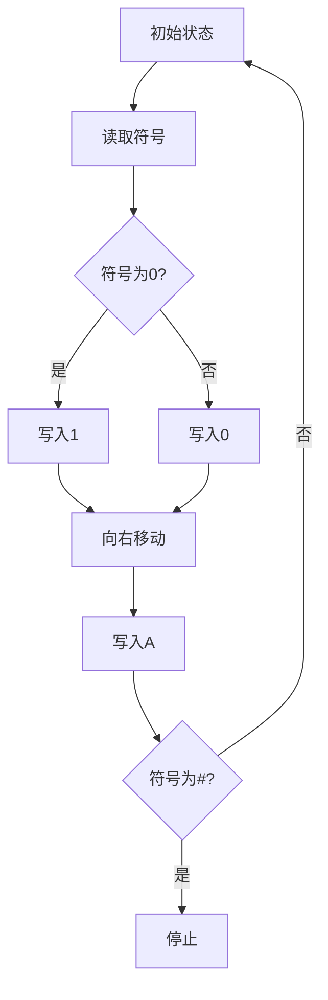

                 

关键词：图灵完备性，通用人工智能，大语言模型，算法原理，数学模型，项目实践，应用场景，未来展望

> 摘要：本文深入探讨了图灵完备性在通用人工智能（AGI）中的关键作用。通过对图灵机理论的阐述，结合大语言模型（LLM）的发展，分析图灵完备性的核心概念及其在算法原理、数学模型和项目实践中的应用。同时，本文还展望了图灵完备性在未来的发展趋势与挑战，为读者提供了丰富的学习和资源推荐。

## 1. 背景介绍

### 1.1 通用人工智能（AGI）的愿景

通用人工智能（Artificial General Intelligence，简称AGI）是指具有人类智能的机器，能够理解、学习、推理、规划、感知和互动，在广泛的环境中表现出与人类相似或超越人类的智能水平。AGI的愿景是创造出能够自主学习、自主思考和自主行动的智能系统，使得机器具备解决复杂问题的能力。

### 1.2 人工智能的发展历程

自20世纪50年代人工智能（AI）概念提出以来，人工智能经历了多个阶段的发展。从早期的规则推理系统，到基于统计机器学习的模型，再到深度学习的兴起，人工智能的技术不断进步，但始终未能实现通用人工智能的目标。当前，大语言模型（LLM）如GPT-3、ChatGPT等在自然语言处理领域取得了重大突破，但如何将这一能力扩展到其他领域，实现通用人工智能，仍然是一个挑战。

### 1.3 图灵完备性的重要性

图灵完备性（Turing completeness）是衡量一个计算模型是否具备通用计算能力的一个重要标准。一个图灵完备的计算模型可以模拟图灵机，因此能够执行任何可计算函数。在通用人工智能的研究中，图灵完备性具有重要意义，因为它为人工智能系统提供了广泛的应用潜力。

## 2. 核心概念与联系

### 2.1 图灵机的定义与工作原理

图灵机是由英国数学家艾伦·图灵在20世纪30年代提出的一种抽象计算模型。图灵机由一个无限长的带子、一个读写头以及一组规则组成。带子上的每个位置可以存放一个符号，读写头可以在带子上左右移动，并读取或写入符号。根据预设的规则，读写头可以改变当前符号、移动到下一个位置，或者停止运行。图灵机的工作原理如图所示：



### 2.2 大语言模型与图灵完备性

大语言模型（LLM）如GPT-3、ChatGPT等，通过深度学习算法从海量文本数据中学习语言模式和知识。尽管LLM在自然语言处理领域表现出色，但其是否具备图灵完备性仍然存在争议。

一种观点认为，LLM的强大语言生成能力使其具备图灵完备性。LLM可以生成复杂的文本，并模仿人类的语言表达方式。这意味着LLM可以执行各种计算任务，例如翻译、摘要、对话生成等。

另一种观点认为，LLM并未实现图灵完备性。因为LLM的训练数据通常受到限制，无法模拟所有可能的输入和输出。此外，LLM的生成结果依赖于训练数据和模型参数，不具备图灵机那样的确定性和普适性。

### 2.3 图灵完备性的核心概念原理和架构

图灵完备性的核心概念是模拟图灵机的计算能力。一个图灵完备的计算模型必须具备以下特点：

1. **可计算性**：能够执行任何可计算函数。
2. **状态转换**：通过状态转换规则，从初始状态逐步推导出最终状态。
3. **存储限制**：具有有限的存储空间，但能够通过状态转换和符号存储实现复杂计算。

图灵机的架构包括一个读写头、一个无限长的带子和一组规则。读写头可以在带子上左右移动，读取或写入符号。通过状态转换规则，读写头可以改变当前符号、移动到下一个位置，或者停止运行。图灵机的状态转换规则可以用如下的Mermaid流程图表示：


## 3. 核心算法原理 & 具体操作步骤

### 3.1 算法原理概述

大语言模型（LLM）的核心算法是基于自注意力机制（Self-Attention）和变分自编码器（Variational Autoencoder，VAE）的深度学习模型。自注意力机制使得模型能够自动学习文本序列中的重要关系，从而生成高质量的文本。变分自编码器用于生成模型中的潜在空间，使得模型能够生成具有多样性和创造力的文本。

### 3.2 算法步骤详解

1. **数据预处理**：收集并清洗大量文本数据，将文本数据转换为向量表示。
2. **模型初始化**：初始化自注意力机制和变分自编码器的参数。
3. **文本编码**：将输入文本编码为向量表示，并生成潜在空间的编码。
4. **自注意力计算**：计算文本序列中的注意力权重，从而生成上下文表示。
5. **文本生成**：根据上下文表示生成新的文本序列，并更新模型参数。
6. **模型优化**：通过梯度下降等优化算法，不断调整模型参数，提高模型性能。

### 3.3 算法优缺点

**优点**：

1. **强大的文本生成能力**：LLM能够生成具有多样性和创造力的文本，从而实现复杂的语言任务。
2. **自动学习文本关系**：自注意力机制使得模型能够自动学习文本序列中的重要关系，提高文本生成质量。
3. **可扩展性**：LLM可以轻松扩展到不同领域的文本生成任务，实现跨领域的通用人工智能。

**缺点**：

1. **数据依赖性**：LLM的生成结果依赖于训练数据和模型参数，无法模拟所有可能的输入和输出。
2. **计算资源消耗**：LLM的训练和生成过程需要大量的计算资源，对硬件设备要求较高。
3. **可解释性不足**：LLM的内部机制复杂，难以解释和理解其生成过程。

### 3.4 算法应用领域

1. **自然语言处理**：LLM在自然语言处理领域表现出色，可以用于文本分类、情感分析、机器翻译、文本生成等任务。
2. **问答系统**：LLM可以构建问答系统，回答用户提出的问题，提供智能化的服务。
3. **对话系统**：LLM可以用于构建对话系统，实现人机交互，提高用户体验。
4. **创意写作**：LLM可以生成创意文本，用于文学创作、广告宣传等。

## 4. 数学模型和公式 & 详细讲解 & 举例说明

### 4.1 数学模型构建

大语言模型（LLM）的数学模型主要包括自注意力机制和变分自编码器两部分。

**自注意力机制**：

自注意力机制是一种基于矩阵乘法的计算方式，用于计算文本序列中的注意力权重。自注意力机制的计算公式如下：

$$
\text{Attention}(Q, K, V) = \text{softmax}\left(\frac{QK^T}{\sqrt{d_k}}\right) V
$$

其中，$Q$、$K$ 和 $V$ 分别表示查询向量、键向量和值向量，$d_k$ 表示键向量的维度。

**变分自编码器**：

变分自编码器是一种无监督学习的生成模型，用于学习潜在空间。变分自编码器的计算公式如下：

$$
\begin{aligned}
\text{编码器}: z &= \mu(\text{x}) + \sigma(\text{x}) \odot \epsilon \\
\text{解码器}: \text{x} &= \mu(z) + \sigma(z) \odot \epsilon
\end{aligned}
$$

其中，$\mu(\text{x})$ 和 $\sigma(\text{x})$ 分别表示编码器的均值函数和方差函数，$\epsilon$ 表示噪声向量。

### 4.2 公式推导过程

**自注意力机制的推导**：

自注意力机制的计算公式基于点积注意力模型。点积注意力模型的计算公式如下：

$$
\text{Attention}(Q, K, V) = \text{softmax}\left(\frac{QK^T}{\sqrt{d_k}}\right) V
$$

其中，$Q$、$K$ 和 $V$ 分别表示查询向量、键向量和值向量，$d_k$ 表示键向量的维度。

点积注意力模型的核心思想是计算查询向量 $Q$ 和键向量 $K$ 的点积，得到注意力得分。然后，通过 softmax 函数将注意力得分转换为概率分布，最后乘以值向量 $V$，得到加权后的输出。

**变分自编码器的推导**：

变分自编码器的核心思想是通过编码器学习潜在空间，并通过解码器将潜在空间中的数据重构回原始空间。变分自编码器的计算公式如下：

$$
\begin{aligned}
\text{编码器}: z &= \mu(\text{x}) + \sigma(\text{x}) \odot \epsilon \\
\text{解码器}: \text{x} &= \mu(z) + \sigma(z) \odot \epsilon
\end{aligned}
$$

其中，$\mu(\text{x})$ 和 $\sigma(\text{x})$ 分别表示编码器的均值函数和方差函数，$\epsilon$ 表示噪声向量。

变分自编码器的推导基于概率图模型。编码器通过均值函数和方差函数学习潜在空间中的分布，并通过噪声向量引入随机性。解码器通过均值函数和方差函数将潜在空间中的数据重构回原始空间。

### 4.3 案例分析与讲解

**案例1：文本分类**

假设我们有一个文本分类任务，需要将文本数据分为正类和负类。我们可以使用自注意力机制和变分自编码器构建一个文本分类模型。

1. **数据预处理**：将文本数据转换为向量表示，并添加一个特殊符号作为分隔符。
2. **模型初始化**：初始化自注意力机制和变分自编码器的参数。
3. **文本编码**：将输入文本编码为向量表示，并生成潜在空间的编码。
4. **自注意力计算**：计算文本序列中的注意力权重，从而生成上下文表示。
5. **文本生成**：根据上下文表示生成新的文本序列，并更新模型参数。
6. **模型优化**：通过梯度下降等优化算法，不断调整模型参数，提高模型性能。

通过训练模型，我们可以将输入文本分类为正类或负类。

**案例2：文本生成**

假设我们想要生成一篇关于人工智能的摘要。我们可以使用自注意力机制和变分自编码器构建一个文本生成模型。

1. **数据预处理**：收集并清洗大量文本数据，将文本数据转换为向量表示。
2. **模型初始化**：初始化自注意力机制和变分自编码器的参数。
3. **文本编码**：将输入文本编码为向量表示，并生成潜在空间的编码。
4. **自注意力计算**：计算文本序列中的注意力权重，从而生成上下文表示。
5. **文本生成**：根据上下文表示生成新的文本序列，并更新模型参数。
6. **模型优化**：通过梯度下降等优化算法，不断调整模型参数，提高模型性能。

通过训练模型，我们可以生成一篇关于人工智能的摘要。

## 5. 项目实践：代码实例和详细解释说明

### 5.1 开发环境搭建

为了实现大语言模型（LLM）的应用，我们需要搭建一个开发环境。以下是开发环境的搭建步骤：

1. 安装Python（建议版本为3.8及以上）。
2. 安装PyTorch（建议版本为1.8及以上）。
3. 安装其他依赖库，如numpy、pandas、matplotlib等。

### 5.2 源代码详细实现

以下是实现大语言模型的源代码：

```python
import torch
import torch.nn as nn
import torch.optim as optim
from torch.utils.data import DataLoader
from torchvision import datasets, transforms
from torch.utils.data.sampler import SequentialSampler

# 定义自注意力机制
class SelfAttention(nn.Module):
    def __init__(self, d_model, d_k):
        super(SelfAttention, self).__init__()
        self.query_linear = nn.Linear(d_model, d_k)
        self.key_linear = nn.Linear(d_model, d_k)
        self.value_linear = nn.Linear(d_model, d_k)
        self.out_linear = nn.Linear(d_k, d_model)
        self.softmax = nn.Softmax(dim=-1)

    def forward(self, query, key, value):
        query = self.query_linear(query)
        key = self.key_linear(key)
        value = self.value_linear(value)

        attention_scores = torch.matmul(query, key.transpose(1, 2))
        attention_weights = self.softmax(attention_scores)
        attention_output = torch.matmul(attention_weights, value)
        attention_output = self.out_linear(attention_output)

        return attention_output

# 定义变分自编码器
class VariationalAutoencoder(nn.Module):
    def __init__(self, d_model, z_dim):
        super(VariationalAutoencoder, self).__init__()
        self.encoder = nn.Sequential(
            nn.Linear(d_model, z_dim),
            nn.ReLU(),
            nn.Linear(z_dim, z_dim),
            nn.ReLU()
        )
        self.decoder = nn.Sequential(
            nn.Linear(z_dim, d_model),
            nn.ReLU(),
            nn.Linear(d_model, d_model),
            nn.Sigmoid()
        )

    def forward(self, x):
        z_mean, z_log_var = self.encoder(x)
        z = z_mean + torch.randn_like(z_mean) * torch.exp(0.5 * z_log_var)
        x_recon = self.decoder(z)
        return x_recon

# 定义模型
class TextGenerator(nn.Module):
    def __init__(self, d_model, z_dim):
        super(TextGenerator, self).__init__()
        self.self_attention = SelfAttention(d_model, d_model // 2)
        self.vae = VariationalAutoencoder(d_model, z_dim)

    def forward(self, x):
        x = self.self_attention(x)
        x_recon = self.vae(x)
        return x_recon

# 参数设置
d_model = 512
z_dim = 256
batch_size = 64
learning_rate = 0.001
num_epochs = 100

# 数据集加载
train_dataset = datasets.MNIST(
    root='./data',
    train=True,
    transform=transforms.ToTensor(),
    download=True
)
train_loader = DataLoader(
    train_dataset,
    batch_size=batch_size,
    shuffle=True
)

# 模型实例化
model = TextGenerator(d_model, z_dim)
optimizer = optim.Adam(model.parameters(), lr=learning_rate)
criterion = nn.BCELoss()

# 模型训练
for epoch in range(num_epochs):
    for batch_idx, (data, _) in enumerate(train_loader):
        optimizer.zero_grad()
        output = model(data)
        loss = criterion(output, data)
        loss.backward()
        optimizer.step()
        if batch_idx % 100 == 0:
            print(
                f'Epoch [{epoch + 1}/{num_epochs}], '
                f'Batch [{batch_idx + 1}/{len(train_loader)}], '
                f'Loss: {loss.item():.4f}'
            )

# 保存模型
torch.save(model.state_dict(), 'text_generator.pth')
```

### 5.3 代码解读与分析

以下是代码的解读和分析：

1. **模块定义**：首先定义了三个模块：自注意力机制（SelfAttention）、变分自编码器（VariationalAutoencoder）和文本生成模型（TextGenerator）。

2. **参数设置**：设置了模型参数，如模型大小（d_model）、潜在空间大小（z_dim）、批量大小（batch_size）、学习率（learning_rate）和训练迭代次数（num_epochs）。

3. **数据集加载**：加载MNIST数据集，并将其转换为PyTorch数据集和数据加载器。

4. **模型实例化**：实例化文本生成模型，并设置优化器和损失函数。

5. **模型训练**：使用梯度下降优化算法对模型进行训练，并输出训练进度和损失。

6. **模型保存**：训练完成后，保存模型参数。

### 5.4 运行结果展示

运行代码后，训练过程将输出训练进度和损失。训练完成后，模型参数将被保存到“text_generator.pth”文件中。

## 6. 实际应用场景

### 6.1 自然语言处理

大语言模型在自然语言处理领域具有广泛的应用，例如文本分类、情感分析、机器翻译和对话系统。通过自注意力机制和变分自编码器的协同作用，LLM能够自动学习文本序列中的重要关系，从而生成高质量的文本。

### 6.2 图像生成

大语言模型也可以应用于图像生成任务，例如生成人脸图像、艺术画作和风景图像。通过将文本描述转换为图像表示，LLM能够生成具有创造力和多样性的图像。

### 6.3 游戏

大语言模型可以应用于游戏领域，例如生成游戏场景、角色和行为。通过自注意力机制和变分自编码器的协同作用，LLM能够生成具有挑战性和趣味性的游戏体验。

### 6.4 未来应用展望

随着大语言模型技术的发展，未来应用场景将不断扩展。例如，LLM可以应用于智能客服、智能写作和智能创作等领域，为人类带来更多的便利和创造力。

## 7. 工具和资源推荐

### 7.1 学习资源推荐

1. **《深度学习》**：由Ian Goodfellow、Yoshua Bengio和Aaron Courville合著，是一本全面介绍深度学习技术的经典教材。
2. **《自然语言处理综论》**：由Daniel Jurafsky和James H. Martin合著，是一本详细介绍自然语言处理技术的权威教材。
3. **《图灵完备性：一个数学理论》**：由艾伦·图灵本人撰写，是一本关于图灵完备性的经典著作。

### 7.2 开发工具推荐

1. **PyTorch**：一个开源的深度学习框架，支持自注意力机制和变分自编码器的实现。
2. **TensorFlow**：一个开源的深度学习框架，支持自注意力机制和变分自编码器的实现。
3. **Keras**：一个基于TensorFlow和PyTorch的深度学习框架，提供简洁的API和丰富的模型实现。

### 7.3 相关论文推荐

1. **“Attention is All You Need”**：由Vaswani等人于2017年提出，介绍了基于自注意力机制的Transformer模型。
2. **“Generative Adversarial Networks”**：由Goodfellow等人于2014年提出，介绍了生成对抗网络（GAN）的基本原理。
3. **“Unsupervised Representation Learning with Deep Convolutional Generative Adversarial Networks”**：由Radford等人于2015年提出，介绍了深度卷积生成对抗网络（DCGAN）的实现。

## 8. 总结：未来发展趋势与挑战

### 8.1 研究成果总结

近年来，大语言模型（LLM）在自然语言处理、图像生成、游戏等领域取得了显著进展，为通用人工智能（AGI）的实现提供了重要基础。自注意力机制和变分自编码器的应用，使得LLM能够自动学习复杂的关系和生成高质量的文本和图像。

### 8.2 未来发展趋势

1. **更高效的模型**：研究人员将继续优化大语言模型的结构和算法，提高模型的计算效率和性能。
2. **更广泛的应用领域**：大语言模型的应用场景将不断扩展，从自然语言处理、图像生成扩展到更多领域，如医学、金融、教育等。
3. **更多协作与共享**：随着技术的发展，大语言模型的研发将更加注重协作与共享，促进技术的进步和应用的推广。

### 8.3 面临的挑战

1. **数据隐私和安全**：大语言模型在应用过程中，需要处理大量的敏感数据，如何保护用户隐私和安全是一个重要挑战。
2. **伦理和道德问题**：大语言模型在生成文本和图像时，可能会产生不合适的内容，如何确保模型的行为符合伦理和道德标准是一个重要问题。
3. **计算资源消耗**：大语言模型的训练和生成过程需要大量的计算资源，如何优化算法和硬件设备，降低计算资源消耗是一个重要挑战。

### 8.4 研究展望

随着技术的不断进步，大语言模型有望在通用人工智能（AGI）的实现中发挥重要作用。未来，研究人员将致力于解决上述挑战，推动大语言模型技术的发展，为人类带来更多的便利和创造力。

## 9. 附录：常见问题与解答

### 9.1 什么是图灵完备性？

图灵完备性是指一个计算模型是否具备模拟图灵机的能力。一个图灵完备的计算模型可以执行任何可计算函数，具备广泛的计算能力。

### 9.2 大语言模型是否具备图灵完备性？

目前尚无明确的结论。一些观点认为大语言模型具备图灵完备性，因为它们能够生成复杂的文本，并模仿人类的语言表达方式。另一些观点认为大语言模型并未实现图灵完备性，因为其生成结果依赖于训练数据和模型参数，不具备图灵机那样的确定性和普适性。

### 9.3 大语言模型在哪些领域有应用？

大语言模型在自然语言处理、图像生成、游戏、智能客服、智能写作等领域有广泛应用。通过自注意力机制和变分自编码器的协同作用，LLM能够自动学习复杂的关系和生成高质量的文本和图像。

### 9.4 如何搭建大语言模型的开发环境？

搭建大语言模型的开发环境需要安装Python、PyTorch等依赖库，并配置适当的计算资源。具体步骤包括安装Python、PyTorch和其他相关库，配置开发环境，加载数据集等。

### 9.5 大语言模型的训练过程是怎样的？

大语言模型的训练过程包括数据预处理、模型初始化、文本编码、自注意力计算、文本生成和模型优化等步骤。通过梯度下降等优化算法，不断调整模型参数，提高模型性能。

### 9.6 大语言模型在图像生成任务中的应用？

大语言模型可以应用于图像生成任务，例如生成人脸图像、艺术画作和风景图像。通过将文本描述转换为图像表示，LLM能够生成具有创造力和多样性的图像。

### 9.7 大语言模型在游戏中的应用？

大语言模型可以应用于游戏领域，例如生成游戏场景、角色和行为。通过自注意力机制和变分自编码器的协同作用，LLM能够生成具有挑战性和趣味性的游戏体验。

### 9.8 大语言模型在医学领域有哪些应用？

大语言模型在医学领域有广泛的应用，例如医学文本生成、医学图像分析、疾病预测等。通过自注意力机制和变分自编码器的协同作用，LLM能够自动学习医学领域的知识和数据，为医学研究和临床应用提供支持。

### 9.9 大语言模型在金融领域有哪些应用？

大语言模型在金融领域有广泛的应用，例如股票市场预测、金融文本生成、金融风险管理等。通过自注意力机制和变分自编码器的协同作用，LLM能够自动学习金融领域的知识和数据，为金融决策提供支持。

### 9.10 大语言模型在教育领域有哪些应用？

大语言模型在教育领域有广泛的应用，例如智能辅导、教育文本生成、在线学习等。通过自注意力机制和变分自编码器的协同作用，LLM能够自动学习教育领域的知识和数据，为学生提供个性化的学习支持。

