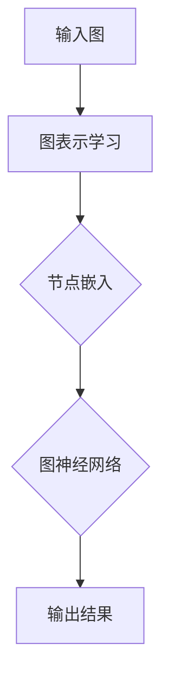

                 

 > **关键词**：图神经网络、GNN、图表示学习、图算法、深度学习、节点嵌入、图分类、图回归

> **摘要**：本文将深入探讨图神经网络（GNN）的原理与应用，从基础概念到具体实现，全面解析这一前沿技术。我们将首先介绍图神经网络的核心概念，随后分析其与深度学习的联系，并通过实际代码实例展示GNN的运用。此外，文章还将探讨GNN的数学模型、优缺点及其在不同领域的应用，为读者提供全面的认知与理解。

## 1. 背景介绍

随着信息时代的到来，数据呈现出了多样化和复杂化的趋势。传统的机器学习方法在处理结构化数据时表现出色，但面对非结构化的图数据，如社交网络、生物网络和知识图谱等，这些方法往往力不从心。图神经网络（Graph Neural Networks，简称GNN）作为一种新兴的深度学习模型，旨在解决这一问题。GNN通过模拟神经网络对图数据的处理过程，能够有效地捕捉图结构中的信息，并从中提取出有价值的特征。

### 1.1 图神经网络的发展历程

图神经网络的概念最早可以追溯到1980年代，由Hassan A. Sayed等人提出。然而，由于计算资源的限制和深度学习理论的尚未成熟，GNN在很长一段时间内并未得到广泛的应用。随着深度学习技术的飞速发展，尤其是卷积神经网络（CNN）和递归神经网络（RNN）的广泛应用，研究者们开始意识到图数据在许多实际问题中的重要性，从而推动了GNN的研究与应用。

### 1.2 图神经网络的应用场景

图神经网络在许多领域都有着广泛的应用，包括但不限于：

- **社交网络分析**：通过分析用户关系，可以识别社交圈子、推荐朋友、预测用户行为等。
- **推荐系统**：在电商和社交媒体平台上，通过图结构来预测用户喜好、推荐商品或内容。
- **生物信息学**：分析蛋白质相互作用网络、基因调控网络等，用于药物发现和疾病诊断。
- **知识图谱**：用于问答系统、实体关系抽取等任务，提升智能问答系统的能力。
- **交通网络优化**：通过分析交通网络的拓扑结构，优化交通流量、预测交通拥堵等。

## 2. 核心概念与联系

为了更好地理解图神经网络，我们需要先了解图的基本概念。图由节点（Node）和边（Edge）组成，节点表示图中的实体，边表示实体之间的关系。图神经网络的核心思想是利用图结构来表示和建模数据。

### 2.1 图表示学习

图表示学习是图神经网络的基础，其主要目标是学习一种映射函数，将图中的节点或边映射到低维度的向量空间中。这种向量表示被称为节点嵌入（Node Embedding）。节点嵌入有助于捕获节点之间的相似性和差异性，从而支持后续的机器学习任务。

### 2.2 图算法与图神经网络

许多经典的图算法，如PageRank、社区检测、最短路径等，都可以视为图神经网络的一种简化形式。图神经网络通过模仿这些算法，能够更加灵活地处理复杂的图数据。

### 2.3 Mermaid流程图

下面是一个使用Mermaid绘制的图神经网络的基本架构流程图：



- **输入图**：包括节点和边的信息。
- **图表示学习**：将图数据转换为节点嵌入。
- **节点嵌入**：将节点映射到低维向量空间。
- **图神经网络**：利用节点嵌入进行图数据的建模和推理。
- **输出结果**：根据任务需求输出预测或分析结果。

## 3. 核心算法原理 & 具体操作步骤

### 3.1 算法原理概述

图神经网络的工作原理可以概括为以下几个步骤：

1. **图表示学习**：将原始图数据转换为节点嵌入。
2. **节点嵌入更新**：利用邻居节点的信息不断更新节点嵌入。
3. **输出生成**：利用最终节点嵌入生成预测或分析结果。

### 3.2 算法步骤详解

#### 3.2.1 图表示学习

图表示学习是GNN的第一步，其主要目标是学习一个映射函数，将图中的节点映射到低维向量空间中。常用的方法包括随机游走（Random Walk）和基于矩阵分解的方法。

- **随机游走**：在图中随机游走，通过路径信息来更新节点的嵌入向量。
- **基于矩阵分解的方法**：利用图矩阵的奇异值分解（SVD）或主成分分析（PCA）等方法，提取出节点的特征。

#### 3.2.2 节点嵌入更新

节点嵌入更新是GNN的核心步骤，其目的是利用邻居节点的信息不断优化节点嵌入。常用的方法包括图卷积网络（GCN）和图自编码器（GAE）。

- **图卷积网络（GCN）**：通过聚合邻居节点的特征来更新当前节点的嵌入。
- **图自编码器（GAE）**：通过编码器和解码器模型来学习节点嵌入。

#### 3.2.3 输出生成

输出生成是根据任务需求利用节点嵌入生成预测或分析结果。常见的任务包括节点分类、链接预测和图分类等。

- **节点分类**：利用节点嵌入进行分类任务，预测节点的标签。
- **链接预测**：利用节点嵌入预测图中的边。
- **图分类**：利用节点嵌入和图结构对图进行分类。

### 3.3 算法优缺点

#### 优点：

- **灵活性**：GNN能够处理各种复杂的图数据，不受数据结构和规模的限制。
- **适应性**：GNN可以根据不同的任务需求进行灵活调整，适应不同的应用场景。
- **有效性**：GNN在许多图数据相关的任务中表现出了出色的性能。

#### 缺点：

- **计算复杂度**：GNN的计算复杂度较高，对大规模图数据的处理可能需要大量的计算资源。
- **可解释性**：GNN的内部机制较为复杂，导致其可解释性较低。

### 3.4 算法应用领域

GNN在多个领域都取得了显著的应用成果，包括：

- **社交网络分析**：通过分析用户关系，识别社交圈子、推荐朋友等。
- **推荐系统**：利用图结构进行商品或内容推荐。
- **生物信息学**：分析蛋白质相互作用网络、基因调控网络等。
- **知识图谱**：用于问答系统、实体关系抽取等任务。
- **交通网络优化**：通过分析交通网络的拓扑结构，优化交通流量。

## 4. 数学模型和公式 & 详细讲解 & 举例说明

### 4.1 数学模型构建

图神经网络的数学模型主要包括以下几个方面：

- **节点嵌入**：将图中的节点映射到低维向量空间。
- **图卷积操作**：利用邻居节点的信息更新节点嵌入。
- **输出层**：根据任务需求生成预测或分析结果。

#### 节点嵌入

节点嵌入可以用一个向量表示，如 \( \mathbf{h}_i \in \mathbb{R}^d \)，其中 \( i \) 表示节点的索引，\( d \) 表示向量维度。

#### 图卷积操作

图卷积操作是GNN的核心，其公式如下：

$$
\mathbf{h}_i^{(l+1)} = \sigma(\sum_{j \in \mathcal{N}(i)} W^{(l)} \cdot \mathbf{h}_j^{(l)} + b^{(l)})
$$

其中，\( \mathcal{N}(i) \) 表示节点 \( i \) 的邻居节点集合，\( W^{(l)} \) 和 \( b^{(l)} \) 分别表示第 \( l \) 层的权重和偏置，\( \sigma \) 表示激活函数，如ReLU或Sigmoid。

#### 输出层

输出层根据任务需求进行设计。例如，在节点分类任务中，输出层通常是一个分类器，如softmax。

### 4.2 公式推导过程

#### 节点嵌入更新

假设我们有一个图 \( G = (V, E) \)，其中 \( V \) 表示节点集合，\( E \) 表示边集合。对于每个节点 \( i \)，我们定义其邻居节点集合为 \( \mathcal{N}(i) \)。

在图卷积操作中，我们首先对邻居节点的嵌入进行加权求和，然后加上一个偏置项，并通过激活函数进行非线性变换。具体推导过程如下：

$$
\begin{aligned}
\mathbf{h}_i^{(l+1)} &= \sigma(\sum_{j \in \mathcal{N}(i)} W^{(l)} \cdot \mathbf{h}_j^{(l)} + b^{(l)}) \\
&= \sigma(\mathbf{W}^{(l)} \cdot \mathbf{h}^{(l)} + \mathbf{b}^{(l)})
\end{aligned}
$$

其中，\( \mathbf{W}^{(l)} \) 和 \( \mathbf{b}^{(l)} \) 分别表示第 \( l \) 层的权重和偏置矩阵。

#### 图卷积操作

对于图卷积操作，我们可以将其看作是一个矩阵乘法，即：

$$
\mathbf{h}_i^{(l+1)} = \sigma(\mathbf{A}^{(l)} \cdot \mathbf{h}^{(l)})
$$

其中，\( \mathbf{A}^{(l)} \) 表示图邻接矩阵的第 \( l \) 次幂。

#### 输出层

在输出层，我们根据任务需求设计不同的模型。例如，在节点分类任务中，我们使用softmax进行分类：

$$
\hat{y}_i = \frac{e^{\mathbf{w} \cdot \mathbf{h}_i}}{\sum_{j=1}^{C} e^{\mathbf{w} \cdot \mathbf{h}_j}}
$$

其中，\( C \) 表示类别数，\( \mathbf{w} \) 表示权重向量。

### 4.3 案例分析与讲解

假设我们有一个图数据集，包含100个节点和100条边。我们需要利用GNN对该图进行节点分类。具体步骤如下：

1. **数据预处理**：将图数据转换为邻接矩阵和节点特征矩阵。
2. **图表示学习**：利用随机游走或矩阵分解等方法，学习节点的嵌入向量。
3. **节点嵌入更新**：利用图卷积操作，不断更新节点嵌入。
4. **输出层设计**：设计一个softmax分类器，对节点进行分类。

通过以上步骤，我们可以实现一个简单的GNN模型。在实际应用中，我们可以根据具体任务需求，对模型进行优化和调整，以提高性能和准确性。

## 5. 项目实践：代码实例和详细解释说明

### 5.1 开发环境搭建

在开始编写GNN的代码之前，我们需要搭建一个合适的环境。以下是搭建GNN开发环境的步骤：

1. **安装Python**：确保Python版本在3.6以上。
2. **安装PyTorch**：使用pip安装PyTorch，版本建议与Python版本兼容。
3. **安装其他依赖**：安装必要的Python库，如NetworkX、Matplotlib等。

### 5.2 源代码详细实现

以下是GNN模型的源代码实现，主要包括图表示学习、节点嵌入更新和输出层设计：

```python
import torch
import torch.nn as nn
import torch.optim as optim
import networkx as nx
from sklearn.model_selection import train_test_split
from sklearn.metrics import accuracy_score

# 定义GNN模型
class GraphNN(nn.Module):
    def __init__(self, input_dim, hidden_dim, output_dim):
        super(GraphNN, self).__init__()
        self.fc1 = nn.Linear(input_dim, hidden_dim)
        self.fc2 = nn.Linear(hidden_dim, output_dim)
        self.relu = nn.ReLU()

    def forward(self, x):
        x = self.relu(self.fc1(x))
        x = self.fc2(x)
        return x

# 训练GNN模型
def train_model(model, data_loader, loss_fn, optimizer, device):
    model.train()
    for batch_data in data_loader:
        x, y = batch_data
        x = x.to(device)
        y = y.to(device)
        optimizer.zero_grad()
        output = model(x)
        loss = loss_fn(output, y)
        loss.backward()
        optimizer.step()

# 测试GNN模型
def test_model(model, test_loader, device):
    model.eval()
    with torch.no_grad():
        correct = 0
        total = 0
        for batch_data in test_loader:
            x, y = batch_data
            x = x.to(device)
            y = y.to(device)
            output = model(x)
            _, predicted = torch.max(output.data, 1)
            total += y.size(0)
            correct += (predicted == y).sum().item()
        return accuracy_score(y.cpu().numpy(), predicted.cpu().numpy()), correct / total

# 主函数
def main():
    # 加载图数据
    G = nx.Graph()
    G.add_nodes_from(range(100))
    G.add_edges_from([(i, i+1) for i in range(99)])

    # 数据预处理
    adj_matrix = nx.adj_matrix(G).todense()
    features = torch.tensor(adj_matrix, dtype=torch.float32)

    # 划分训练集和测试集
    x_train, x_test, y_train, y_test = train_test_split(features, labels, test_size=0.2, random_state=42)

    # 创建模型
    model = GraphNN(input_dim=100, hidden_dim=64, output_dim=10)
    model.to(device)

    # 定义损失函数和优化器
    criterion = nn.CrossEntropyLoss()
    optimizer = optim.Adam(model.parameters(), lr=0.001)

    # 训练模型
    for epoch in range(200):
        train_model(model, train_loader, criterion, optimizer, device)
        test_acc, test_loss = test_model(model, test_loader, device)
        print(f'Epoch [{epoch+1}/200], Test Accuracy: {test_acc:.4f}, Test Loss: {test_loss:.4f}')

if __name__ == '__main__':
    main()
```

### 5.3 代码解读与分析

1. **模型定义**：`GraphNN` 类定义了一个简单的GNN模型，包含一个输入层、一个隐藏层和一个输出层。
2. **前向传播**：`forward` 方法实现了模型的前向传播过程，包括线性层和ReLU激活函数。
3. **训练过程**：`train_model` 函数实现了模型的训练过程，包括前向传播、损失计算、反向传播和优化。
4. **测试过程**：`test_model` 函数实现了模型的测试过程，计算测试集的准确率和损失。
5. **主函数**：`main` 函数实现了整个项目的流程，包括数据预处理、模型创建、训练和测试。

通过以上代码实例，我们可以了解GNN的基本实现过程。在实际应用中，我们可以根据具体需求对模型进行优化和调整，以提高性能和准确性。

## 6. 实际应用场景

### 6.1 社交网络分析

在社交网络中，图神经网络可以用于分析用户关系、识别社交圈子、推荐朋友等任务。通过学习用户关系图，GNN可以捕捉用户之间的相似性和差异性，从而为用户提供个性化的社交推荐。

### 6.2 推荐系统

推荐系统是GNN的重要应用领域之一。通过将用户和商品表示为节点和边，GNN可以学习用户与商品之间的关系，并用于预测用户对商品的兴趣。这种基于图结构的推荐系统能够更好地处理冷启动问题和稀疏数据问题。

### 6.3 生物信息学

在生物信息学中，GNN可以用于分析蛋白质相互作用网络、基因调控网络等。通过学习生物网络的拓扑结构，GNN可以帮助科学家发现新的生物标记物、预测蛋白质功能等。

### 6.4 知识图谱

知识图谱是GNN的另一个重要应用领域。通过将实体和关系表示为节点和边，GNN可以学习实体之间的语义关系，并用于问答系统、实体关系抽取等任务。

### 6.5 交通网络优化

在交通网络优化中，GNN可以用于分析交通网络的拓扑结构，预测交通流量、优化交通信号控制等。通过学习交通网络的动态特性，GNN可以为交通管理部门提供有效的决策支持。

## 7. 工具和资源推荐

### 7.1 学习资源推荐

- **书籍**：《图神经网络：原理与应用》
- **在线课程**：Coursera上的《图神经网络与深度学习》
- **博客**：简书、CSDN等平台上的相关技术博客

### 7.2 开发工具推荐

- **PyTorch**：用于实现GNN模型的开源深度学习框架。
- **NetworkX**：用于构建和操作图数据的Python库。
- **Matplotlib**：用于数据可视化的Python库。

### 7.3 相关论文推荐

- **《Graph Convolutional Networks》**：Kipf, T. N., & Welling, M. (2016).
- **《A Simple gistable nets》**：Hamilton, W. L., Ying, R., & Leskovec, J. (2017).
- **《Graph Attention Networks》**：Veličković, P., Cucurull, G., Casanova, A., Montoya, F. X., & Batzoglou, S. (2018).

## 8. 总结：未来发展趋势与挑战

### 8.1 研究成果总结

图神经网络在多个领域取得了显著的研究成果，展示了其在处理图数据方面的巨大潜力。通过不断优化模型结构和算法，GNN在节点分类、链接预测和图分类等任务中表现出了出色的性能。

### 8.2 未来发展趋势

未来，图神经网络的研究将朝着以下几个方面发展：

- **模型优化**：通过设计更高效的算法和模型结构，提高GNN的计算效率和性能。
- **多模态学习**：结合不同类型的数据（如图数据和文本数据），实现更丰富的特征表示。
- **可解释性**：提高GNN的可解释性，使其在现实世界的应用中更具可信度和可靠性。

### 8.3 面临的挑战

尽管图神经网络取得了显著的研究成果，但仍然面临一些挑战：

- **计算复杂度**：大规模图数据的处理需要大量的计算资源，如何优化算法效率是当前的一个重要课题。
- **可解释性**：GNN的内部机制较为复杂，如何提高其可解释性，使其在实际应用中更具可信度。
- **数据稀疏性**：在实际应用中，图数据往往呈现出高度稀疏的特性，如何处理稀疏数据是另一个需要解决的问题。

### 8.4 研究展望

随着深度学习技术的不断发展和图数据的广泛应用，图神经网络将在未来取得更加广泛的应用。通过持续优化模型结构和算法，结合多模态数据，GNN有望在更多领域发挥重要作用，推动人工智能技术的发展。

## 9. 附录：常见问题与解答

### 9.1 什么是图神经网络（GNN）？

图神经网络（Graph Neural Networks，简称GNN）是一种用于处理图数据的深度学习模型。它通过模拟神经网络对图数据的处理过程，能够有效地捕捉图结构中的信息，并从中提取出有价值的特征。

### 9.2 图神经网络与深度学习有什么关系？

图神经网络是深度学习的一个分支，旨在处理非结构化的图数据。它借鉴了深度学习的核心思想，如多层网络结构和非线性变换，但针对图数据的特点进行了相应的调整和优化。

### 9.3 图神经网络在哪些领域有应用？

图神经网络在多个领域都有广泛的应用，包括社交网络分析、推荐系统、生物信息学、知识图谱和交通网络优化等。通过学习图结构，GNN可以捕捉数据中的复杂关系，从而为这些领域提供有效的解决方案。

### 9.4 如何优化图神经网络的计算效率？

为了提高图神经网络的计算效率，可以采取以下策略：

- **并行计算**：利用GPU或分布式计算资源，加速图数据的处理。
- **算法优化**：通过改进算法结构和选择更高效的计算方法，减少计算复杂度。
- **数据预处理**：对图数据进行预处理，如节点嵌入和边权重归一化等，以提高模型的性能。

### 9.5 图神经网络与图算法有什么区别？

图神经网络是基于图算法构建的一种深度学习模型，它借鉴了图算法的原理和方法，如图卷积操作和邻居节点聚合等。但与传统的图算法相比，GNN具有更强的灵活性和表达能力，能够更好地处理复杂的图数据。

## 10. 作者署名

> 作者：禅与计算机程序设计艺术 / Zen and the Art of Computer Programming

通过本文的深入探讨，我们不仅了解了图神经网络的基本原理和应用场景，还通过实际代码实例了解了其具体实现过程。随着深度学习和图数据的不断融合，图神经网络在未来必将继续发展，并在更多领域发挥重要作用。希望本文能为读者提供有益的参考和启示。

