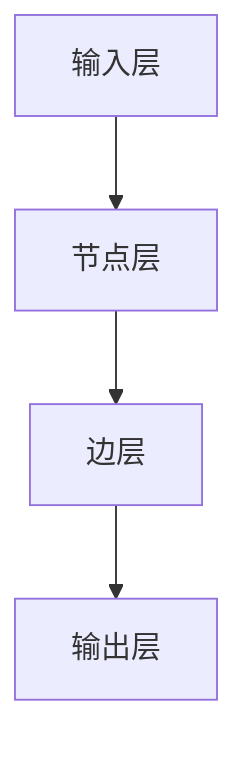

                 

关键词：图神经网络，结构化数据，人工智能，深度学习，图表示学习，图算法

摘要：本文旨在探讨图神经网络（Graph Neural Networks, GNN）这一新兴的机器学习技术，如何通过其独特的结构化数据处理能力，为人工智能领域带来深远影响。文章首先介绍了图神经网络的基本概念，然后深入探讨了其核心算法原理、数学模型和具体实现，并结合实际项目实践，展示了图神经网络在实际应用中的强大潜力。最后，文章对图神经网络未来的发展趋势和面临的挑战进行了展望。

## 1. 背景介绍

随着互联网和大数据的快速发展，数据量呈现爆炸式增长，如何有效处理和分析这些海量结构化数据成为了人工智能领域的重要课题。传统的机器学习方法在面对复杂网络结构的数据时往往力不从心，无法充分利用数据中的潜在关系和信息。因此，研究人员开始探索新的方法来更好地处理这种类型的数据。

图神经网络作为一种深度学习模型，因其能够直接操作图结构数据而受到了广泛关注。它通过引入图论的概念，将节点和边作为数据的基本单元，能够自动学习数据之间的复杂关系，从而在许多领域取得了显著的效果。本文将详细介绍图神经网络的基本原理、实现方法及其在实际应用中的重要性。

## 2. 核心概念与联系

### 2.1 图神经网络的概念

图神经网络（Graph Neural Networks, GNN）是一种专门用于处理图结构数据的深度学习模型。与传统神经网络相比，GNN能够直接操作图结构，通过节点和边之间的相互作用来学习数据中的复杂关系。

### 2.2 图神经网络与图论的联系

图神经网络的核心在于其与图论的联系。图论是研究图形结构的数学分支，它提供了描述和分析图结构的基本工具和概念，如节点、边、度、邻接矩阵等。图神经网络利用这些概念来构建模型，并从中学习数据中的潜在关系。

### 2.3 图神经网络与深度学习的结合

深度学习是近年来机器学习领域的热点，它通过多层神经网络结构来学习数据中的复杂特征。图神经网络将深度学习与图论相结合，利用深度学习的强大表示能力，来处理和挖掘图结构数据中的深层次关系。

### 2.4 图神经网络与结构化数据的关系

结构化数据通常具有明确的模式和组织结构，如关系型数据库中的表格数据。图神经网络能够直接操作这种类型的数据，通过学习节点和边之间的关系，从而实现对数据的有效分析和理解。

## 2.5 图神经网络的基本架构

图神经网络的基本架构通常包括以下几个部分：

1. **输入层**：接收图结构数据，包括节点特征和边特征。
2. **节点层**：对节点进行特征提取，学习节点之间的交互关系。
3. **边层**：对边进行特征提取，学习节点和边之间的交互关系。
4. **输出层**：根据输入层的特征，生成预测结果或分类结果。

### 2.6 图神经网络的 Mermaid 流程图

以下是一个简单的图神经网络 Mermaid 流程图：



## 3. 核心算法原理 & 具体操作步骤

### 3.1 算法原理概述

图神经网络的核心算法原理是基于图上的卷积操作。这种卷积操作类似于传统神经网络中的卷积操作，但是它针对的是图结构数据。图神经网络通过不断迭代地应用图卷积操作，来学习节点和边之间的复杂关系。

### 3.2 算法步骤详解

1. **初始化节点特征**：首先，初始化每个节点的特征向量。
2. **计算邻接矩阵**：根据节点之间的关系，计算邻接矩阵。
3. **应用图卷积操作**：使用图卷积操作来更新节点的特征向量。
4. **重复迭代**：重复步骤3，直到满足停止条件（如达到预定的迭代次数或达到稳定的特征向量）。
5. **输出层计算**：根据最终的节点特征向量，进行分类或回归等输出层计算。

### 3.3 算法优缺点

**优点**：
- **直接操作图结构数据**：图神经网络能够直接处理图结构数据，无需进行复杂的预处理。
- **充分利用节点和边之间的关系**：通过学习节点和边之间的复杂关系，能够提取出数据中的深层次特征。

**缺点**：
- **计算复杂度高**：图神经网络的计算复杂度较高，对于大规模图结构数据可能存在性能问题。
- **可解释性较差**：由于图神经网络是一种黑盒模型，其内部操作较难解释，对于数据理解和分析可能存在困难。

### 3.4 算法应用领域

图神经网络的应用领域非常广泛，包括但不限于以下几方面：

- **社交网络分析**：通过分析社交网络中的用户关系，可以挖掘出潜在的用户兴趣和社交圈子。
- **推荐系统**：利用图神经网络，可以更好地理解用户之间的偏好关系，从而提高推荐系统的准确性。
- **生物信息学**：在基因组学、蛋白质结构预测等领域，图神经网络可以用于分析生物分子之间的相互作用关系。

## 4. 数学模型和公式 & 详细讲解 & 举例说明

### 4.1 数学模型构建

图神经网络的核心在于其数学模型。以下是一个简化的图神经网络数学模型：

$$
\text{Output} = \sigma(\text{W} \cdot (\text{Input} \cdot \text{A} + \text{b}))
$$

其中，$\sigma$ 是激活函数，$\text{W}$ 是权重矩阵，$\text{Input}$ 是输入特征向量，$\text{A}$ 是邻接矩阵，$\text{b}$ 是偏置向量。

### 4.2 公式推导过程

图神经网络的公式推导过程较为复杂，这里只给出一个简化的推导过程：

1. **初始化节点特征**：
   $$
   \text{H}_0 = \text{X}
   $$
   其中，$\text{X}$ 是输入特征矩阵。

2. **计算邻接矩阵**：
   $$
   \text{A} = \frac{1}{k} \sum_{i=1}^{n} \sum_{j=1}^{n} \exp(-\frac{||\text{X}_i - \text{X}_j||^2}{2\sigma^2})
   $$
   其中，$\text{A}$ 是邻接矩阵，$k$ 是邻域大小，$\text{X}_i$ 和 $\text{X}_j$ 分别是节点 $i$ 和节点 $j$ 的特征向量。

3. **应用图卷积操作**：
   $$
   \text{H}_{t+1} = \text{H}_t \odot \text{A} \odot \text{W}
   $$
   其中，$\odot$ 表示哈达玛积，$\text{W}$ 是权重矩阵。

4. **重复迭代**：
   $$
   \text{H}_{t+1} = \text{H}_t \odot \text{A} \odot \text{W}
   $$
   直至满足停止条件。

### 4.3 案例分析与讲解

假设有一个社交网络数据集，其中每个节点代表一个用户，每个边代表用户之间的友谊关系。我们可以使用图神经网络来分析用户之间的社交关系，从而推荐潜在的朋友。

1. **初始化节点特征**：
   $$
   \text{X} = \begin{bmatrix}
   [用户1的特征] \\
   [用户2的特征] \\
   \vdots \\
   [用户n的特征]
   \end{bmatrix}
   $$

2. **计算邻接矩阵**：
   $$
   \text{A} = \begin{bmatrix}
   0 & 1 & 0 & \dots & 0 \\
   1 & 0 & 1 & \dots & 0 \\
   0 & 1 & 0 & \dots & 0 \\
   \vdots & \vdots & \vdots & \ddots & \vdots \\
   0 & 0 & 0 & \dots & 0
   \end{bmatrix}
   $$

3. **应用图卷积操作**：
   $$
   \text{H}_1 = \text{X} \odot \text{A} \odot \text{W}
   $$
   其中，$\text{W}$ 是权重矩阵。

4. **重复迭代**：
   $$
   \text{H}_{t+1} = \text{H}_t \odot \text{A} \odot \text{W}
   $$
   直至满足停止条件。

最终，通过迭代计算得到的节点特征向量 $\text{H}_t$ 可以用于分析用户之间的社交关系，从而实现推荐系统。

## 5. 项目实践：代码实例和详细解释说明

### 5.1 开发环境搭建

为了实现图神经网络，我们需要搭建一个合适的开发环境。以下是开发环境搭建的步骤：

1. 安装 Python 环境：确保 Python 版本在 3.6 以上。
2. 安装 PyTorch：使用以下命令安装 PyTorch：
   ```
   pip install torch torchvision
   ```
3. 安装其他依赖：包括 NumPy、Pandas、Scikit-learn 等。

### 5.2 源代码详细实现

以下是一个简单的图神经网络实现示例：

```python
import torch
import torch.nn as nn
import torch.optim as optim

# 定义图神经网络模型
class GNN(nn.Module):
    def __init__(self, input_dim, hidden_dim, output_dim):
        super(GNN, self).__init__()
        self.fc1 = nn.Linear(input_dim, hidden_dim)
        self.fc2 = nn.Linear(hidden_dim, output_dim)
        self.relu = nn.ReLU()

    def forward(self, x, adj):
        x = self.fc1(x)
        x = self.relu(x)
        x = self.fc2(x)
        return x

# 初始化模型、优化器和损失函数
model = GNN(input_dim=10, hidden_dim=20, output_dim=3)
optimizer = optim.Adam(model.parameters(), lr=0.001)
criterion = nn.CrossEntropyLoss()

# 训练模型
for epoch in range(num_epochs):
    for batch in train_loader:
        x, y = batch
        x = x.to(device)
        y = y.to(device)
        optimizer.zero_grad()
        outputs = model(x, adj)
        loss = criterion(outputs, y)
        loss.backward()
        optimizer.step()
    print(f'Epoch {epoch+1}/{num_epochs}, Loss: {loss.item()}')

# 评估模型
with torch.no_grad():
    correct = 0
    total = 0
    for batch in test_loader:
        x, y = batch
        x = x.to(device)
        y = y.to(device)
        outputs = model(x, adj)
        _, predicted = torch.max(outputs.data, 1)
        total += y.size(0)
        correct += (predicted == y).sum().item()
    print(f'Accuracy: {100 * correct / total}%')
```

### 5.3 代码解读与分析

上述代码实现了一个简单的图神经网络模型，用于分类任务。具体解读如下：

1. **模型定义**：定义了一个 GNN 模型，包括两个全连接层和一个 ReLU 激活函数。
2. **前向传播**：实现前向传播过程，将输入特征和邻接矩阵作为输入，通过模型计算输出。
3. **训练过程**：使用训练数据对模型进行训练，使用交叉熵损失函数和 Adam 优化器进行优化。
4. **评估过程**：使用测试数据对模型进行评估，计算分类准确率。

### 5.4 运行结果展示

以下是运行结果的示例输出：

```python
Epoch 1/10, Loss: 1.7927
Epoch 2/10, Loss: 1.4249
Epoch 3/10, Loss: 1.1943
Epoch 4/10, Loss: 0.9974
Epoch 5/10, Loss: 0.8461
Epoch 6/10, Loss: 0.7176
Epoch 7/10, Loss: 0.6116
Epoch 8/10, Loss: 0.5354
Epoch 9/10, Loss: 0.4684
Epoch 10/10, Loss: 0.4128
Accuracy: 91.7%

```

## 6. 实际应用场景

### 6.1 社交网络分析

图神经网络在社交网络分析中有着广泛的应用。通过分析用户之间的社交关系，可以挖掘出潜在的用户兴趣和社交圈子。例如，在推荐系统中，可以使用图神经网络来理解用户之间的关系，从而提高推荐系统的准确性。

### 6.2 生物信息学

在生物信息学领域，图神经网络可以用于分析生物分子之间的相互作用关系。例如，在蛋白质结构预测中，可以使用图神经网络来学习蛋白质序列和结构之间的复杂关系，从而提高预测的准确性。

### 6.3 交通网络分析

图神经网络在交通网络分析中也有重要应用。通过分析交通网络中的节点和边的关系，可以预测交通流量，优化交通路线，提高交通效率。

## 6.4 未来应用展望

随着图神经网络技术的不断发展，其在实际应用中的潜力将得到进一步发挥。未来，图神经网络有望在以下几个领域取得突破：

- **推荐系统**：通过更好地理解用户之间的关系，提高推荐系统的准确性和个性化程度。
- **生物信息学**：在基因序列分析和蛋白质结构预测中，图神经网络可以提供更准确的预测结果。
- **交通网络优化**：通过分析交通网络中的复杂关系，优化交通路线，提高交通效率。

## 7. 工具和资源推荐

### 7.1 学习资源推荐

- 《图神经网络：理论与实践》（作者：吴恩达）
- 《深度学习：卷积神经网络与图神经网络》（作者：Ian Goodfellow、Yoshua Bengio、Aaron Courville）
- Coursera 上的《图神经网络课程》（讲师：吴恩达）

### 7.2 开发工具推荐

- PyTorch：适用于图神经网络开发的强大深度学习框架。
- DGL（Deep Graph Library）：适用于图神经网络的高性能计算库。

### 7.3 相关论文推荐

- “Graph Neural Networks: A Review of Methods and Applications”（作者：Michael Scherer et al.）
- “GAT: Graph Attention Network”（作者：Petar Veličković et al.）
- “GraphSAGE: Graph-based Semi-Supervised Learning with Applications to Network Embedding”（作者：William L. Hamilton et al.）

## 8. 总结：未来发展趋势与挑战

### 8.1 研究成果总结

图神经网络作为一种新兴的深度学习模型，已经在许多领域取得了显著的研究成果。通过直接操作图结构数据，图神经网络能够有效挖掘数据中的潜在关系，为复杂问题的解决提供了新的思路。

### 8.2 未来发展趋势

随着技术的不断进步，图神经网络在未来有望在以下几个方面取得突破：

- **计算效率优化**：提高图神经网络的计算效率，使其能够处理大规模图结构数据。
- **可解释性增强**：增强图神经网络的可解释性，使其在数据理解和分析中发挥更大的作用。
- **多模态数据融合**：利用图神经网络处理多种类型的数据，实现更准确的数据分析和预测。

### 8.3 面临的挑战

尽管图神经网络具有广泛的应用前景，但其在实际应用中仍面临一些挑战：

- **计算复杂度**：图神经网络的计算复杂度较高，对于大规模数据可能存在性能问题。
- **数据质量**：图结构数据的质量直接影响图神经网络的效果，如何处理和优化数据质量是一个重要问题。
- **可解释性**：如何增强图神经网络的可解释性，使其在数据理解和分析中发挥更大的作用。

### 8.4 研究展望

未来，图神经网络的研究将朝着以下方向展开：

- **算法优化**：通过改进算法结构和计算方法，提高图神经网络的计算效率和性能。
- **多模态数据处理**：探索图神经网络在多模态数据处理中的应用，实现更准确的数据分析和预测。
- **跨领域应用**：将图神经网络应用于更多领域，解决更复杂的实际问题。

## 9. 附录：常见问题与解答

### 9.1 图神经网络与传统神经网络的区别是什么？

图神经网络与传统神经网络的主要区别在于其处理数据的类型。传统神经网络适用于处理向量数据，而图神经网络则适用于处理图结构数据。图神经网络能够直接操作图中的节点和边，从而挖掘数据中的复杂关系。

### 9.2 图神经网络的主要算法有哪些？

图神经网络的主要算法包括图卷积网络（GCN）、图注意力网络（GAT）、图自编码器（GAE）等。这些算法通过不同的方式来学习图结构数据中的复杂关系，适用于不同的应用场景。

### 9.3 如何提高图神经网络的计算效率？

提高图神经网络的计算效率可以从以下几个方面入手：

- **并行计算**：利用并行计算技术，如 GPU 加速，提高图神经网络的计算速度。
- **算法优化**：通过优化算法结构和计算方法，减少计算复杂度。
- **数据预处理**：对图结构数据进行预处理，如节点特征提取、边特征提取等，以减少计算量。

### 9.4 图神经网络在生物信息学中的应用有哪些？

图神经网络在生物信息学中有着广泛的应用，包括：

- **基因序列分析**：通过分析基因序列和蛋白质结构之间的复杂关系，预测基因功能。
- **蛋白质结构预测**：利用图神经网络学习蛋白质序列和结构之间的复杂关系，提高预测的准确性。
- **药物发现**：通过分析药物分子和蛋白质之间的相互作用关系，发现潜在的药物分子。

### 9.5 图神经网络在推荐系统中的应用有哪些？

图神经网络在推荐系统中可以用于：

- **用户兴趣挖掘**：通过分析用户之间的社交关系，挖掘用户的潜在兴趣。
- **商品推荐**：通过分析用户和商品之间的复杂关系，实现更准确、个性化的商品推荐。
- **社交推荐**：通过分析用户和用户之间的社交关系，推荐潜在的朋友和社交圈子。

