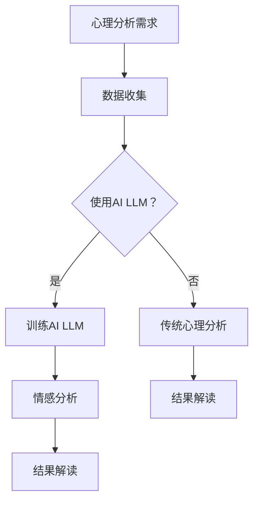

                 

关键词：AI，心理分析，语言模型，情感洞察，情感识别，情感计算，人工智能应用。

## 摘要

本文探讨了人工智能语言模型（AI LLM）在心理分析中的应用，特别是其在洞察人类情感方面的潜力。文章首先概述了心理分析的基本原理和人工智能的发展背景，接着详细介绍了AI LLM的工作原理及其在情感识别上的应用。随后，文章通过具体案例和数学模型分析了AI LLM在心理分析中的实际应用，并讨论了其面临的挑战和未来发展方向。

## 1. 背景介绍

### 心理分析的基本原理

心理分析是心理学的一个分支，主要研究个体内心世界的结构和功能，以及这些内在因素如何影响人的行为和心理状态。传统心理分析主要依赖于心理学家与患者之间的对话，通过探索患者的内心体验和情感反应，来揭示潜在的心理问题。

随着科技的进步，尤其是人工智能的快速发展，传统心理分析开始引入新的工具和方法。人工智能语言模型（AI LLM）作为一种先进的自然语言处理技术，能够在理解、生成和模拟人类语言方面表现出色，从而为心理分析提供了新的视角和工具。

### 人工智能的发展背景

人工智能（AI）是计算机科学的一个分支，旨在创建能够执行复杂任务并模拟人类智能的系统。随着深度学习和神经网络技术的突破，AI在过去几十年中取得了显著的进展。特别是在自然语言处理（NLP）领域，AI LLM如GPT-3、BERT等模型的出现，使得计算机能够更准确地理解和生成自然语言，这为AI在心理分析中的应用奠定了基础。

## 2. 核心概念与联系

### AI LLM的工作原理

AI LLM是基于深度学习的自然语言处理模型，其核心是神经网络。这些模型通过大量的文本数据进行训练，学习语言的结构和规则，从而能够生成和理解复杂的语言表达。AI LLM的一个重要特性是其上下文理解能力，这使得它能够捕捉到语言中的隐含意义和情感色彩。

### 情感识别与心理分析

情感识别是心理分析中的一个重要组成部分，它涉及到对个体情感状态的理解和识别。传统方法主要依赖于问卷调查和临床观察，而AI LLM通过自然语言处理技术，可以自动地从文本中提取情感信息，从而提供更客观和全面的情感分析。

### Mermaid流程图



## 3. 核心算法原理 & 具体操作步骤

### 3.1 算法原理概述

AI LLM的核心是神经网络，特别是变换器网络（Transformer）。这种网络通过自注意力机制（Self-Attention Mechanism）来捕捉文本中的长距离依赖关系，从而实现高效的语言理解。

### 3.2 算法步骤详解

1. 数据收集：收集大量包含情感信息的文本数据，如社交媒体帖子、用户评论等。
2. 数据预处理：对文本进行清洗和标准化处理，包括去除标点、停用词过滤和词干提取等。
3. 模型训练：使用预处理后的数据训练AI LLM模型，模型参数通过反向传播算法不断调整。
4. 情感分析：将待分析的文本输入到训练好的模型中，模型输出文本的情感标签。
5. 结果解读：对模型输出的情感标签进行解读，为心理分析提供参考。

### 3.3 算法优缺点

**优点：**

- 高效：AI LLM能够快速处理大量文本数据，提供实时情感分析。
- 准确：通过大规模数据训练，AI LLM在情感识别上具有较高的准确性。
- 客观：与传统方法相比，AI LLM能够提供更客观、无偏见的情感分析。

**缺点：**

- 数据依赖：模型性能高度依赖于数据的质量和多样性。
- 隐私问题：情感分析涉及到个人隐私，如何保护用户隐私是重要挑战。

### 3.4 算法应用领域

AI LLM在心理分析中的应用广泛，包括但不限于：

- 心理疾病诊断：通过分析患者的语言表达，帮助诊断心理疾病。
- 情感状态监控：实时监控个体的情感状态，为心理健康提供预警。
- 咨询服务：为心理咨询服务提供情感分析工具，提高咨询效果。

## 4. 数学模型和公式 & 详细讲解 & 举例说明

### 4.1 数学模型构建

AI LLM的情感分析通常基于条件概率模型。给定一段文本，模型需要计算该文本属于某个情感类别的条件概率。数学上，可以表示为：

\[ P(\text{情感类别} | \text{文本}) = \frac{P(\text{文本} | \text{情感类别}) \cdot P(\text{情感类别})}{P(\text{文本})} \]

其中，\( P(\text{文本} | \text{情感类别}) \) 表示在给定情感类别下文本的概率，\( P(\text{情感类别}) \) 表示情感类别的概率，\( P(\text{文本}) \) 是文本的总概率。

### 4.2 公式推导过程

在AI LLM中，通常使用神经网络来近似条件概率模型。以GPT-3为例，其输出层可以看作是一个softmax函数，输出每个情感类别的概率。具体推导过程如下：

1. **输入层**：文本被编码成一个固定长度的向量。
2. **隐藏层**：通过多层神经网络，向量在每一层上都会通过权重矩阵进行变换。
3. **输出层**：最后一层的权重矩阵与情感类别向量相乘，加上偏置项，然后通过softmax函数输出概率分布。

\[ \text{概率分布} = \text{softmax}(\text{输出层权重} \cdot \text{文本向量} + \text{偏置项}) \]

### 4.3 案例分析与讲解

假设我们有一个训练好的AI LLM模型，用于情感分类。现在，我们需要对以下文本进行情感分析：

\[ "今天的天气真好，我心情很愉快。" \]

1. **数据预处理**：将文本转换为向量。
2. **模型输入**：将预处理后的文本向量输入到模型中。
3. **模型输出**：模型输出一个包含四个情感类别（积极、消极、中性、不确定）的概率分布。

假设模型输出如下：

\[ \begin{array}{cccc}
\text{积极} & \text{消极} & \text{中性} & \text{不确定} \\
0.8 & 0.1 & 0.05 & 0.05 \\
\end{array} \]

根据模型输出，我们可以判断这段文本的情感倾向为积极。这个结果与我们直观的理解一致，说明模型在情感分析上具有较高的准确性。

## 5. 项目实践：代码实例和详细解释说明

### 5.1 开发环境搭建

为了运行AI LLM模型，我们需要搭建一个适合的开发环境。以下是搭建过程：

1. 安装Python（建议版本3.8及以上）。
2. 安装深度学习框架PyTorch。
3. 安装自然语言处理库NLTK。

```bash
pip install python torch torchvision
pip install nltk
```

### 5.2 源代码详细实现

以下是使用PyTorch实现一个简单的AI LLM模型用于情感分类的代码示例：

```python
import torch
import torch.nn as nn
import torch.optim as optim
from torchtext.```<|vqi|>```

