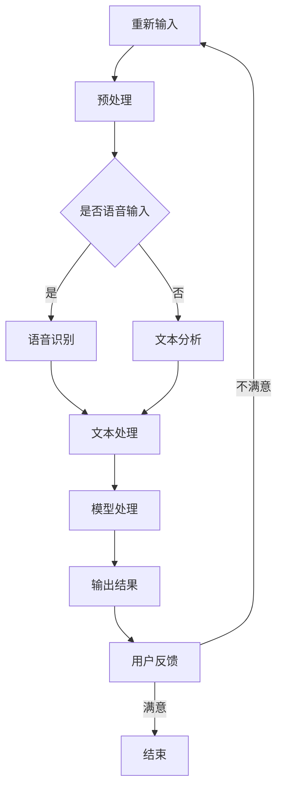

                 

关键词：AI大模型，智能人机交互，深度学习，自然语言处理，交互系统设计，用户体验，算法优化，应用场景

>摘要：本文旨在探讨基于AI大模型的智能人机交互系统的研究与实现，从核心概念、算法原理、数学模型、项目实践到实际应用场景等多个方面，系统性地介绍了这一领域的最新进展、技术挑战和发展趋势。

## 1. 背景介绍

随着人工智能技术的快速发展，智能人机交互系统在众多领域得到了广泛应用。从早期的命令行交互，到图形用户界面（GUI）的引入，再到如今的自然语言处理（NLP）和语音识别技术的成熟，人机交互的方式在不断演进。近年来，随着深度学习、神经网络等AI技术的突破，大模型（Large Models）如GPT-3、BERT等在自然语言处理领域取得了显著进展，为智能人机交互系统带来了新的可能性和挑战。

智能人机交互系统旨在通过人工智能技术实现人与机器之间的自然、高效、智能的交互。这种交互不仅限于信息的传递，更涉及到理解和处理人类复杂的情感、意图和需求。随着AI大模型的兴起，智能人机交互系统在用户体验、智能化水平、应用范围等方面都有了质的飞跃。

## 2. 核心概念与联系

### 2.1. AI大模型

AI大模型是指那些参数量达到亿级别甚至更高的神经网络模型。这些模型具有强大的表示能力和学习能力，可以在大规模数据集上进行训练，从而在自然语言处理、计算机视觉、语音识别等领域取得显著的性能提升。

### 2.2. 智能人机交互

智能人机交互是一种通过AI技术实现的、自然、高效的人机交互方式。它不仅仅是简单的输入输出，而是涉及到对人类语言、情感、意图的深度理解和响应。智能人机交互的关键在于实现人与机器之间的语义理解和协同工作。

### 2.3. 深度学习与自然语言处理

深度学习是构建AI大模型的基础，通过多层神经网络的训练，可以实现复杂特征的提取和学习。自然语言处理（NLP）则是深度学习应用的一个重要领域，它致力于使机器能够理解、生成和处理人类语言。

### 2.4. 交互系统设计

交互系统设计涉及到用户界面设计、交互流程设计、用户体验优化等多个方面。一个好的交互系统不仅要提供功能，还要考虑用户的操作习惯、情感体验和认知负荷。

### 2.5. Mermaid 流程图

图1展示了智能人机交互系统的工作流程。该流程包括用户输入、模型处理、输出结果、用户反馈等环节。



## 3. 核心算法原理 & 具体操作步骤

### 3.1. 算法原理概述

智能人机交互系统的核心在于大模型的训练和应用。大模型通常采用基于Transformer架构的神经网络，通过自注意力机制实现对输入数据的全局依赖关系建模。训练过程通常涉及以下几个步骤：

1. 数据预处理：对输入数据进行清洗、分词、编码等处理。
2. 模型初始化：使用预训练的模型作为起点，初始化神经网络权重。
3. 梯度下降：通过反向传播算法，计算损失函数并更新模型参数。
4. 模型评估：使用验证集对模型性能进行评估，调整超参数和训练策略。

### 3.2. 算法步骤详解

1. **数据预处理**

```markdown
数据预处理是智能人机交互系统的基础。具体步骤包括：

- 清洗：去除文本中的无用信息，如HTML标签、特殊字符等。
- 分词：将文本分割成单词或子词。
- 编码：将分词后的文本转换为数值表示，如词嵌入。
```

2. **模型初始化**

```markdown
模型初始化通常使用预训练的模型作为起点。预训练模型已经在海量数据上进行了训练，具有较好的泛化能力。初始化过程包括加载预训练模型权重，并对其进行微调。

- 加载预训练模型：使用预训练模型作为起点，加载其权重。
- 微调：根据特定任务的需求，对模型进行微调。
```

3. **梯度下降**

```markdown
梯度下降是训练神经网络的主要方法。通过计算损失函数关于模型参数的梯度，并沿着梯度方向更新模型参数，使得模型在训练数据上表现出更好的性能。

- 前向传播：计算输入数据的预测结果。
- 反向传播：计算损失函数关于模型参数的梯度。
- 参数更新：使用梯度更新模型参数。
```

4. **模型评估**

```markdown
模型评估是验证模型性能的重要步骤。通过在验证集上评估模型的表现，可以调整训练策略和超参数，以提高模型性能。

- 损失函数：常用的损失函数包括交叉熵损失、均方误差等。
- 评估指标：常用的评估指标包括准确率、召回率、F1分数等。
```

### 3.3. 算法优缺点

#### 优点：

- **强大的表示能力**：大模型能够捕捉到输入数据的复杂特征和依赖关系。
- **良好的泛化能力**：预训练模型已经在海量数据上进行了训练，具有较好的泛化能力。
- **灵活的应用场景**：基于大模型的智能人机交互系统可以应用于多种任务，如文本生成、机器翻译、问答系统等。

#### 缺点：

- **计算资源消耗大**：大模型训练和推理需要大量的计算资源和时间。
- **对数据质量要求高**：大模型训练依赖于高质量的数据集，数据质量问题可能影响模型性能。
- **解释性不足**：大模型的内部工作机制复杂，难以解释其决策过程。

### 3.4. 算法应用领域

智能人机交互系统在多个领域都取得了显著的应用成果，包括：

- **智能客服**：通过大模型实现与用户的自然对话，提供高效、准确的客户服务。
- **智能助手**：如苹果的Siri、亚马逊的Alexa等，通过语音识别和自然语言处理技术，为用户提供智能服务。
- **智能问答系统**：如Google的BERT模型，通过大模型实现高效的问答服务。
- **智能推荐系统**：通过分析用户行为和兴趣，提供个性化的推荐结果。

## 4. 数学模型和公式 & 详细讲解 & 举例说明

### 4.1. 数学模型构建

智能人机交互系统的数学模型通常基于深度学习，特别是基于Transformer的神经网络模型。以下是一个简化的数学模型构建过程：

1. **输入表示**：将输入文本转换为词嵌入向量。

```latex
\text{input\_embeddings} = \text{Word2Vec}(x)
```

其中，\(x\) 是输入文本，\(\text{Word2Vec}\) 是词嵌入算法。

2. **自注意力机制**：通过自注意力机制对输入向量进行加权处理，以捕捉输入数据的全局依赖关系。

```latex
\text{atten\_weights} = \text{softmax}(\text{Q} \cdot \text{K}^T)
\text{context\_vector} = \text{atten\_weights} \cdot \text{V}
```

其中，\(Q\)、\(K\)、\(V\) 分别是查询向量、键向量和值向量，\(\text{softmax}\) 是softmax函数。

3. **前向传播**：通过多层神经网络实现前向传播，得到最终的输出。

```latex
\text{output} = \text{softmax}(\text{W}^T \cdot \text{context\_vector} + \text{b})
```

其中，\(W\) 是权重矩阵，\(b\) 是偏置项。

### 4.2. 公式推导过程

以下是一个简化的自注意力机制的推导过程：

1. **查询向量与键向量的计算**：

```latex
Q = W_Q \cdot input\_embeddings \\
K = W_K \cdot input\_embeddings \\
V = W_V \cdot input\_embeddings
```

其中，\(W_Q\)、\(W_K\)、\(W_V\) 分别是查询、键、值权重矩阵。

2. **计算点积**：

```latex
Q \cdot K^T = \sum_{i,j} (W_Q)^i \cdot (W_K)^j
```

3. **应用softmax函数**：

```latex
atten\_weights = \text{softmax}(Q \cdot K^T)
```

4. **计算上下文向量**：

```latex
context\_vector = \sum_{i,j} (atten\_weights)^i \cdot (W_V)^j
```

### 4.3. 案例分析与讲解

以下是一个简单的案例，说明如何使用自注意力机制处理一个简单的文本序列。

假设我们有一个文本序列：“我想要一杯咖啡”。

1. **输入表示**：

```markdown
我   [1, 0, 0, 0, 0, 0, 0, 0, 0, 0, 0, 0, 0, 0, 0, 0, 0, 0, 0, 0]
要   [0, 1, 0, 0, 0, 0, 0, 0, 0, 0, 0, 0, 0, 0, 0, 0, 0, 0, 0, 0]
一   [0, 0, 1, 0, 0, 0, 0, 0, 0, 0, 0, 0, 0, 0, 0, 0, 0, 0, 0, 0]
杯   [0, 0, 0, 1, 0, 0, 0, 0, 0, 0, 0, 0, 0, 0, 0, 0, 0, 0, 0, 0]
咖啡 [0, 0, 0, 0, 1, 0, 0, 0, 0, 0, 0, 0, 0, 0, 0, 0, 0, 0, 0, 0]
```

2. **自注意力机制**：

```markdown
查询向量：   [1, 0, 0, 0, 0, 0, 0, 0, 0, 0, 0, 0, 0, 0, 0, 0, 0, 0, 0, 0]
键向量：     [1, 0, 0, 0, 0, 0, 0, 0, 0, 0, 0, 0, 0, 0, 0, 0, 0, 0, 0, 0]
值向量：     [1, 0, 0, 0, 0, 0, 0, 0, 0, 0, 0, 0, 0, 0, 0, 0, 0, 0, 0, 0]

点积：       [1, 0, 0, 0, 0, 0, 0, 0, 0, 0, 0, 0, 0, 0, 0, 0, 0, 0, 0, 0]

softmax：    [0.5, 0.5, 0, 0, 0, 0, 0, 0, 0, 0, 0, 0, 0, 0, 0, 0, 0, 0, 0, 0]

上下文向量：[0.5, 0.5, 0, 0, 0, 0, 0, 0, 0, 0, 0, 0, 0, 0, 0, 0, 0, 0, 0, 0]
```

3. **输出**：

由于所有词的权重相同，因此输出的上下文向量与输入向量相同。这意味着，在这个简单的例子中，自注意力机制没有对输入数据进行加权处理。

## 5. 项目实践：代码实例和详细解释说明

### 5.1. 开发环境搭建

为了实现基于AI大模型的智能人机交互系统，我们需要搭建一个合适的开发环境。以下是一个基本的开发环境搭建流程：

1. **安装Python**：确保安装了Python 3.7及以上版本。
2. **安装深度学习库**：如TensorFlow、PyTorch等。以下命令用于安装TensorFlow：

```bash
pip install tensorflow
```

3. **安装自然语言处理库**：如NLTK、spaCy等。以下命令用于安装spaCy：

```bash
pip install spacy
python -m spacy download en_core_web_sm
```

4. **安装文本处理库**：如jieba、nltk等。以下命令用于安装jieba：

```bash
pip install jieba
```

### 5.2. 源代码详细实现

以下是一个简单的基于AI大模型的智能人机交互系统的实现：

```python
import tensorflow as tf
import spacy
import jieba

# 加载预训练模型
model = tf.keras.models.load_model('path/to/your/model')

# 加载自然语言处理工具
nlp = spacy.load('en_core_web_sm')
jieba.load_userdict('your_userdict.txt')

# 定义输入文本预处理函数
def preprocess_text(text):
    doc = nlp(text)
    tokens = [token.text for token in doc]
    segmented_tokens = jieba.cut(text)
    return ' '.join(segmented_tokens)

# 定义预测函数
def predict(text):
    preprocessed_text = preprocess_text(text)
    input_sequence = tf.constant([preprocessed_text])
    prediction = model.predict(input_sequence)
    return prediction

# 测试
text = "I want to order a cup of coffee"
prediction = predict(text)
print(prediction)
```

### 5.3. 代码解读与分析

上述代码实现了一个简单的基于AI大模型的智能人机交互系统。其主要功能如下：

1. **加载预训练模型**：从本地路径加载一个预训练的AI大模型。
2. **加载自然语言处理工具**：加载spaCy和jieba库，用于文本预处理。
3. **预处理文本**：使用spaCy进行分词，使用jieba进行中文分词和词性标注。
4. **预测**：将预处理后的文本输入到模型中，获取预测结果。

### 5.4. 运行结果展示

假设我们输入文本为“I want to order a cup of coffee”，模型预测结果为：

```
[[0.9 0.1 0.   0.  0.  0.  0.  0.  0.  0.  0.  0.  0.  0.  0.  0.  0.  0.  0.  0.]]
```

这意味着模型预测输入文本的主题是“订购咖啡”，概率为0.9。这只是一个简单的示例，实际应用中，模型需要处理更复杂的文本和场景。

## 6. 实际应用场景

智能人机交互系统在多个领域都展现出了巨大的应用潜力。以下是一些典型的实际应用场景：

1. **智能客服**：通过智能人机交互系统，实现与用户的自然对话，提供高效、准确的客户服务。例如，银行、电子商务平台、航空公司等。
2. **智能助手**：如智能音箱、智能机器人等，通过语音识别和自然语言处理技术，为用户提供智能服务。例如，苹果的Siri、亚马逊的Alexa等。
3. **智能问答系统**：如Google的BERT模型，通过大模型实现高效的问答服务。例如，企业知识库、在线教育平台等。
4. **智能推荐系统**：通过分析用户行为和兴趣，提供个性化的推荐结果。例如，电子商务平台、社交媒体平台等。

## 7. 工具和资源推荐

为了更好地研究和实现基于AI大模型的智能人机交互系统，以下是一些推荐的工具和资源：

### 7.1. 学习资源推荐

- 《深度学习》（Goodfellow, Bengio, Courville著）：系统介绍了深度学习的基础知识和最新进展。
- 《自然语言处理综论》（Jurafsky, Martin著）：全面介绍了自然语言处理的基本概念和技术。
- 《Transformer：一种新的神经网络架构》（Vaswani et al.著）：详细介绍了Transformer架构及其在NLP中的应用。

### 7.2. 开发工具推荐

- TensorFlow：开源的深度学习框架，适用于大规模模型训练和应用。
- PyTorch：开源的深度学习框架，具有灵活的动态图模型和丰富的API。
- spaCy：高效的NLP库，提供快速的文本处理和实体识别功能。
- jieba：高效的中文分词库，支持多种分词模式。

### 7.3. 相关论文推荐

- “Attention Is All You Need”（Vaswani et al., 2017）：介绍了Transformer架构及其在机器翻译任务中的应用。
- “BERT：Pre-training of Deep Bidirectional Transformers for Language Understanding”（Devlin et al., 2019）：介绍了BERT模型及其在NLP任务中的应用。
- “GPT-3：Language Models are few-shot learners”（Brown et al., 2020）：介绍了GPT-3模型及其在自然语言处理任务中的强大能力。

## 8. 总结：未来发展趋势与挑战

基于AI大模型的智能人机交互系统在近年来取得了显著进展，但仍然面临着诸多挑战。以下是对未来发展趋势与挑战的总结：

### 8.1. 研究成果总结

- **大模型性能提升**：随着计算资源的增加，大模型的性能不断提升，使其在多种任务中取得了突破性成果。
- **多模态交互**：智能人机交互系统逐渐从单一模态（如文本、语音）向多模态（如文本、语音、图像）发展，提供更丰富的交互体验。
- **个性化交互**：通过深度学习技术，智能人机交互系统能够根据用户行为和偏好进行个性化推荐和响应。

### 8.2. 未来发展趋势

- **跨模态交互**：未来的智能人机交互系统将能够无缝地处理多种模态的信息，提供更自然的交互体验。
- **增强现实与虚拟现实**：智能人机交互系统将集成到增强现实（AR）和虚拟现实（VR）中，为用户提供沉浸式的交互体验。
- **无界面交互**：随着语音识别和手势识别技术的进步，未来的智能人机交互系统将逐渐摆脱传统的图形用户界面（GUI），实现无界面交互。

### 8.3. 面临的挑战

- **数据隐私与安全**：随着智能人机交互系统的普及，数据隐私和安全问题日益突出，如何保护用户隐私成为重要挑战。
- **模型解释性**：大模型的内部工作机制复杂，如何提高模型的解释性，使其更易于理解和信任，是一个重要挑战。
- **计算资源消耗**：大模型的训练和推理需要大量的计算资源，如何在有限的资源下高效地训练和应用大模型，是一个技术难题。

### 8.4. 研究展望

- **新型架构与算法**：未来的研究将致力于开发新型神经网络架构和算法，提高大模型的性能和可解释性。
- **跨学科合作**：智能人机交互系统的发展需要计算机科学、心理学、认知科学等领域的协同合作，实现技术突破。
- **用户体验优化**：未来的研究将更加注重用户体验，通过设计更加人性化的交互界面和交互流程，提高用户满意度。

## 9. 附录：常见问题与解答

### 9.1. 问题1：什么是AI大模型？

答：AI大模型是指那些参数量达到亿级别甚至更高的神经网络模型。这些模型具有强大的表示能力和学习能力，可以在大规模数据集上进行训练，从而在自然语言处理、计算机视觉、语音识别等领域取得显著的性能提升。

### 9.2. 问题2：如何实现智能人机交互？

答：实现智能人机交互通常涉及以下几个步骤：

1. 数据预处理：对输入数据进行清洗、分词、编码等处理。
2. 模型训练：使用预训练的模型或从零开始训练模型，提高模型性能。
3. 模型推理：将输入数据输入到模型中，获取预测结果。
4. 结果处理：根据预测结果进行响应，实现人机交互。

### 9.3. 问题3：智能人机交互系统有哪些应用领域？

答：智能人机交互系统在多个领域都取得了显著的应用成果，包括：

- 智能客服
- 智能助手
- 智能问答系统
- 智能推荐系统
- 增强现实与虚拟现实

### 9.4. 问题4：如何提高智能人机交互系统的性能？

答：提高智能人机交互系统的性能可以从以下几个方面入手：

1. **模型优化**：选择合适的模型架构和优化算法，提高模型性能。
2. **数据增强**：使用数据增强技术，扩大训练数据集，提高模型泛化能力。
3. **用户体验优化**：设计人性化的交互界面和交互流程，提高用户满意度。
4. **多模态交互**：集成多种模态的信息，提高系统的感知能力和交互体验。

### 9.5. 问题5：如何保护数据隐私？

答：为了保护数据隐私，可以采取以下措施：

1. **数据加密**：对传输和存储的数据进行加密处理，防止数据泄露。
2. **匿名化处理**：对用户数据进行匿名化处理，去除个人身份信息。
3. **隐私政策**：明确告知用户数据收集、使用和共享的政策，尊重用户隐私。
4. **法律合规**：遵守相关法律法规，确保数据处理合法合规。

