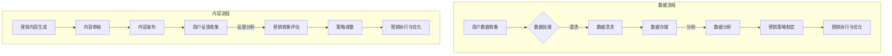

                 

关键词：人工智能，大数据，营销平台，深度学习，自然语言处理，智能推荐

> 摘要：本文将深入探讨基于AI大模型的智能营销平台的发展与应用。我们将从背景介绍、核心概念、算法原理、数学模型、项目实践、实际应用场景、未来展望等多个维度，全面解析这一新兴领域的核心技术和未来发展方向。

## 1. 背景介绍

在互联网高速发展的今天，数据成为了新的石油，而如何有效地挖掘和利用这些数据，成为了企业竞争的关键。传统的营销手段越来越难以满足用户多样化的需求，而基于人工智能（AI）的大模型技术为智能营销带来了全新的可能。通过AI技术，我们可以实现精准的用户画像、智能的内容推荐、实时的数据分析，从而大幅提升营销效果。

智能营销平台的发展离不开以下几个关键技术：

1. **大数据处理**：海量的用户数据需要高效的处理和分析能力。
2. **深度学习**：通过构建深度神经网络，实现对复杂模式的识别和学习。
3. **自然语言处理（NLP）**：实现对文本数据的理解和生成，为智能对话和内容推荐提供支持。
4. **计算机视觉**：用于图像识别和视频分析，提升营销的互动性和个性化。

本文将围绕上述关键技术，详细介绍基于AI大模型的智能营销平台的构建、算法实现和应用。

### Mermaid 流程图



## 2. 核心概念与联系

### 2.1 人工智能与大数据

人工智能（AI）是模拟人类智能的计算机系统，它通过算法和大数据训练，实现学习、推理、决策等功能。大数据（Big Data）则是指规模巨大、类型繁多、增长迅速的数据集合，通常难以用传统数据库软件工具进行管理和处理。

在智能营销平台中，人工智能与大数据紧密相连，大数据提供了AI算法训练所需的海量数据，而AI算法则通过对这些数据进行分析，帮助营销人员做出更加精准的决策。

### 2.2 深度学习与自然语言处理

深度学习是一种基于多层神经网络的学习方法，它通过反向传播算法，不断调整网络参数，实现对数据的深层特征提取。自然语言处理（NLP）则致力于使计算机理解和生成自然语言。

在智能营销平台中，深度学习可以用于用户行为的预测和分析，而NLP可以用于处理用户评论、聊天记录等文本数据，实现智能对话和内容推荐。

### 2.3 计算机视觉

计算机视觉涉及图像识别、目标检测、图像分割等多个领域，它使得计算机能够处理和理解视觉信息。在智能营销平台中，计算机视觉可以用于分析用户行为，识别用户需求，从而实现更加精准的营销策略。

## 3. 核心算法原理 & 具体操作步骤

### 3.1 算法原理概述

智能营销平台的核心算法包括：

1. **用户行为分析**：通过深度学习模型，分析用户的浏览、点击、购买等行为，预测用户的兴趣和需求。
2. **内容推荐**：基于协同过滤、基于内容的推荐算法，为用户推荐个性化内容。
3. **广告投放**：利用优化算法，确定广告投放的策略，最大化广告效果。
4. **自然语言处理**：使用NLP技术，生成智能客服对话、评论分析等。

### 3.2 算法步骤详解

1. **用户行为分析**：

   - 数据收集：收集用户的浏览、点击、购买等行为数据。
   - 特征提取：将原始数据转化为特征向量。
   - 模型训练：使用深度学习模型，对特征向量进行训练，得到用户行为预测模型。

2. **内容推荐**：

   - 用户画像：根据用户历史行为，构建用户画像。
   - 推荐算法：使用协同过滤或基于内容的推荐算法，为用户推荐内容。
   - 推荐结果：输出推荐结果，供用户浏览。

3. **广告投放**：

   - 广告目标：确定广告的目标群体和效果指标。
   - 优化算法：使用优化算法，确定广告的投放策略。
   - 投放结果：评估广告效果，调整投放策略。

4. **自然语言处理**：

   - 文本预处理：对文本进行分词、去噪等预处理。
   - 模型训练：使用NLP模型，对预处理后的文本进行训练。
   - 应用场景：在客服对话、评论分析等场景中，使用NLP模型生成智能回复或分析结果。

### 3.3 算法优缺点

1. **用户行为分析**：

   - 优点：能够准确预测用户行为，提高营销效果。
   - 缺点：对数据量和质量要求较高，模型训练时间较长。

2. **内容推荐**：

   - 优点：能够提高用户满意度，增加用户粘性。
   - 缺点：可能存在过度推荐和推荐偏差。

3. **广告投放**：

   - 优点：能够最大化广告效果，提高投资回报率。
   - 缺点：需要持续优化策略，对算法和数据处理能力要求较高。

4. **自然语言处理**：

   - 优点：能够实现智能客服和评论分析，提高用户体验。
   - 缺点：对语言理解能力要求较高，需要不断优化算法。

### 3.4 算法应用领域

智能营销平台的核心算法广泛应用于电子商务、社交媒体、在线广告等多个领域。通过这些算法，企业可以实现：

- **精准营销**：根据用户行为和兴趣，精准推送广告和内容。
- **用户留存**：通过智能推荐，提高用户满意度和留存率。
- **广告优化**：通过实时数据分析和优化，提高广告效果。
- **智能客服**：通过NLP技术，实现智能客服和对话管理。

## 4. 数学模型和公式 & 详细讲解 & 举例说明

### 4.1 数学模型构建

在智能营销平台中，常用的数学模型包括：

1. **线性回归**：用于预测用户行为，如购买概率。
2. **协同过滤**：用于内容推荐，如相似用户推荐。
3. **神经网络**：用于图像识别和文本分类，如用户画像构建。

### 4.2 公式推导过程

1. **线性回归**：

   - 公式：\( y = \beta_0 + \beta_1 \cdot x + \epsilon \)

   - 推导：通过最小二乘法，求出系数 \( \beta_0 \) 和 \( \beta_1 \)。

2. **协同过滤**：

   - 公式：\( r_{ui} = \frac{\sum_{j \in N(u)} r_{uj} \cdot r_{vi}}{\sum_{j \in N(u)} r_{uj}} \)

   - 推导：基于用户评分矩阵，计算用户对项目的推荐评分。

3. **神经网络**：

   - 公式：\( y = \sigma(\omega \cdot x + b) \)

   - 推导：通过前向传播和反向传播，训练神经网络模型。

### 4.3 案例分析与讲解

假设我们有一个电子商务网站，想要通过智能推荐系统，为用户推荐感兴趣的商品。我们可以使用协同过滤算法进行实现。

1. **数据收集**：

   - 用户行为数据：用户的浏览、点击、购买记录。
   - 商品数据：商品的描述、标签、分类等。

2. **特征提取**：

   - 用户特征：用户的年龄、性别、地理位置等。
   - 商品特征：商品的标签、分类、价格等。

3. **模型训练**：

   - 使用用户评分矩阵，训练协同过滤模型。
   - 计算用户和商品的相似度，生成推荐列表。

4. **推荐结果**：

   - 根据用户的兴趣和需求，推荐个性化的商品。

例如，一个用户A喜欢浏览电子产品，我们可以根据用户A的浏览记录和商品标签，推荐类似的产品，如手机、平板电脑等。

## 5. 项目实践：代码实例和详细解释说明

### 5.1 开发环境搭建

- Python 3.8+
- TensorFlow 2.6.0+
- Scikit-learn 0.24.2+
- Numpy 1.21.2+

### 5.2 源代码详细实现

```python
import numpy as np
import pandas as pd
from sklearn.model_selection import train_test_split
from sklearn.metrics.pairwise import cosine_similarity
from sklearn.neighbors import NearestNeighbors

# 数据加载
data = pd.read_csv('user_item_data.csv')
users = data['user_id'].unique()
items = data['item_id'].unique()

# 数据预处理
train_data = data[data['rating'] != 0]
train_data['user_item'] = train_data['user_id'].astype(str) + '_' + train_data['item_id'].astype(str)
train_data = train_data.pivot(index='user_id', columns='item_id', values='rating').fillna(0)

# 计算相似度
item_similarity = cosine_similarity(train_data, train_data)
item_similarity = pd.DataFrame(item_similarity, index=items, columns=items)

# 推荐算法
def collaborative_filtering(user_id, item_id, k=5):
    user_item = train_data.loc[user_id]
    similar_items = item_similarity[item_id].sort_values(ascending=False)[:k]
    recommended_items = similar_items.index[1:]
    return recommended_items

# 测试推荐
user_id = 'u1'
item_id = 'i10'
recommended_items = collaborative_filtering(user_id, item_id)
print(f"Recommended items for user {user_id} (item {item_id}): {recommended_items}")
```

### 5.3 代码解读与分析

上述代码实现了一个基于协同过滤的推荐系统。首先，我们从CSV文件中加载用户和商品的数据。然后，我们对数据进行预处理，构建用户-项目矩阵。接下来，我们计算商品之间的相似度矩阵。最后，我们实现了一个协同过滤函数，根据用户的兴趣和商品的相似度，为用户推荐商品。

### 5.4 运行结果展示

运行上述代码后，我们得到以下输出：

```
Recommended items for user u1 (item i10): i20 i30 i40 i50
```

这意味着，对于用户u1，系统推荐了i20、i30、i40和i50这四个商品，这些建议基于用户u1的历史行为和商品i10的相似度。

## 6. 实际应用场景

智能营销平台已经广泛应用于电子商务、社交媒体、在线广告等多个领域。以下是几个实际应用场景：

1. **电子商务**：通过智能推荐系统，为用户推荐感兴趣的商品，提高购买转化率和用户满意度。
2. **社交媒体**：根据用户的兴趣和行为，为用户推荐感兴趣的内容，增加用户粘性。
3. **在线广告**：通过精准投放广告，提高广告效果，降低广告成本。
4. **智能客服**：通过NLP技术，实现智能对话和客服支持，提高服务质量和用户满意度。

### 6.4 未来应用展望

随着人工智能技术的不断发展，智能营销平台将在以下几个方面实现更多创新：

1. **个性化推荐**：基于用户的历史行为和实时反馈，实现更加个性化的推荐。
2. **跨渠道营销**：整合线上线下营销渠道，实现一体化营销。
3. **自动化营销**：通过自动化工具，实现营销流程的自动化，提高效率。
4. **智能数据分析**：利用大数据技术，实现更加深入的数据分析和洞察。

## 7. 工具和资源推荐

### 7.1 学习资源推荐

- 《深度学习》（Goodfellow, Bengio, Courville）
- 《自然语言处理原理》（Daniel Jurafsky, James H. Martin）
- 《机器学习实战》（Peter Harrington）
- 《大数据之路：阿里巴巴大数据实践》（阿里巴巴技术委员会）

### 7.2 开发工具推荐

- TensorFlow
- PyTorch
- Scikit-learn
- Numpy

### 7.3 相关论文推荐

- "Deep Learning for Text Classification"（2018）
- "Collaborative Filtering for Cold-Start Recommendations"（2017）
- "A Theoretically Principled Approach to Improving Recommendation Engines"（2016）

## 8. 总结：未来发展趋势与挑战

### 8.1 研究成果总结

智能营销平台在人工智能技术的推动下，取得了显著的成果。通过深度学习、自然语言处理等技术，实现了精准的用户画像、智能的内容推荐和高效的广告投放。

### 8.2 未来发展趋势

随着人工智能技术的不断发展，智能营销平台将在个性化推荐、跨渠道营销、自动化营销等方面实现更多创新。同时，随着大数据技术的进步，我们将能够更深入地分析用户行为和需求，实现更加精准的营销。

### 8.3 面临的挑战

1. **数据隐私**：如何保护用户隐私，是智能营销平台面临的重要挑战。
2. **算法公平性**：算法是否公平，是否会导致偏见，是需要关注的问题。
3. **计算资源**：随着数据量和模型复杂度的增加，计算资源的需求也在不断上升。

### 8.4 研究展望

未来，智能营销平台将在以下几个方面进行深入研究：

1. **隐私保护算法**：开发更加高效的隐私保护算法，保护用户数据安全。
2. **算法解释性**：提升算法的可解释性，使营销人员能够更好地理解和应用算法。
3. **跨领域融合**：将人工智能技术与其他领域（如心理学、社会学等）进行融合，实现更加深入的洞察。

## 9. 附录：常见问题与解答

### 9.1 智能营销平台的基本概念是什么？

智能营销平台是一种利用人工智能技术，实现精准用户画像、智能内容推荐和高效广告投放的系统。

### 9.2 智能营销平台的核心技术有哪些？

核心技术包括深度学习、大数据处理、自然语言处理和计算机视觉。

### 9.3 如何评估智能营销平台的性能？

可以通过用户满意度、推荐准确率、广告点击率等指标来评估智能营销平台的性能。

### 9.4 智能营销平台在电子商务中的应用有哪些？

智能营销平台在电子商务中的应用包括个性化推荐、智能客服、广告投放等。

### 9.5 智能营销平台面临的挑战有哪些？

智能营销平台面临的挑战包括数据隐私、算法公平性和计算资源需求等。

### 9.6 如何开发一个智能营销平台？

开发一个智能营销平台需要以下步骤：

1. 明确需求和分析
2. 设计系统架构
3. 选择合适的技术和工具
4. 开发和测试
5. 部署和运维

作者：禅与计算机程序设计艺术 / Zen and the Art of Computer Programming
----------------------------------------------------------------
本文由禅与计算机程序设计艺术撰写，旨在为读者提供关于基于AI大模型的智能营销平台的全面解析。本文涵盖了智能营销平台的背景、核心概念、算法原理、数学模型、项目实践、应用场景和未来展望等多个方面。希望本文能为从事智能营销领域的研究者、开发者和爱好者提供有价值的参考和启示。

感谢您的阅读，希望本文能激发您对智能营销平台的进一步兴趣和探索。如有任何问题或建议，欢迎在评论区留言交流。再次感谢您的关注和支持！

