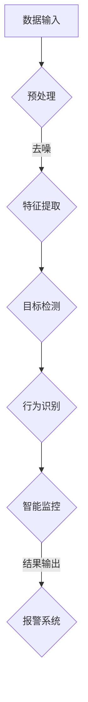

                 

关键词：人工智能，视频分析，大模型，深度学习，智能监控

> 摘要：本文旨在探讨基于人工智能（AI）大模型的智能视频分析平台的构建、核心算法原理、数学模型及实际应用，并对其未来发展进行展望。文章首先介绍了背景，随后深入分析了核心概念及其架构，详细讲解了核心算法的原理与操作步骤，探讨了数学模型和公式，并通过实际项目实践展示了代码实例。最后，文章讨论了实际应用场景及未来展望。

## 1. 背景介绍

随着人工智能技术的迅猛发展，尤其是深度学习和大数据技术的应用，视频分析技术已经成为安全监控、智能交通、智能家居等领域的重要手段。传统的视频分析系统往往依赖于规则和人工判断，而基于AI的大模型可以自动提取视频中的特征，进行实时分析和预测，从而实现更高的准确性和智能化。

智能视频分析平台的核心在于其处理大规模视频数据的能力和高效的分析算法。当前，大规模视频数据量呈指数级增长，对平台的计算性能和处理速度提出了极高的要求。AI大模型的应用，尤其是预训练模型，可以在有限的标注数据上实现强大的泛化能力，使得平台能够适应各种复杂的视频场景。

本文将围绕基于AI大模型的智能视频分析平台展开，详细探讨其构建方法、核心算法、数学模型、实际应用及其未来展望。

## 2. 核心概念与联系

### 2.1. 人工智能大模型

人工智能大模型，通常指的是那些在训练过程中使用海量数据集进行训练，并且模型参数规模达到亿级甚至千亿级的神经网络模型。这些模型具有强大的特征提取和模式识别能力，可以在各种复杂任务中表现出色。例如，Transformer模型、BERT模型等，都是AI大模型的代表。

### 2.2. 视频分析

视频分析是指通过对视频数据进行处理、分析和理解，从中提取有用信息的过程。常见的视频分析任务包括目标检测、图像分割、姿态估计、行为识别等。

### 2.3. 智能监控

智能监控是利用视频分析技术对监控视频进行实时分析和处理，以实现对异常事件的自动识别和报警。智能监控通常需要高效的视频分析算法和强大的计算能力。

### 2.4. Mermaid 流程图



### 2.5. 核心概念之间的关系

人工智能大模型作为智能视频分析平台的核心技术，通过特征提取和目标检测等步骤，实现对视频数据的理解和分析。这些分析结果可以用于智能监控，实现实时异常检测和报警。

## 3. 核心算法原理 & 具体操作步骤

### 3.1. 算法原理概述

智能视频分析平台的核心算法通常包括以下几个步骤：

1. **数据预处理**：对视频数据去噪、裁剪、缩放等，使其适合后续处理。
2. **特征提取**：通过深度神经网络提取视频中的高维特征。
3. **目标检测**：定位视频中的目标对象，并识别其类别。
4. **行为识别**：分析目标的运动轨迹和动作，识别行为类型。
5. **智能监控**：根据分析结果，进行实时监控和报警。

### 3.2. 算法步骤详解

#### 3.2.1. 数据预处理

数据预处理是视频分析的重要环节，直接影响到后续分析的准确性和效率。预处理步骤通常包括：

- **去噪**：使用滤波器去除图像中的噪声。
- **裁剪与缩放**：根据实际需求对视频进行裁剪或缩放，调整视频尺寸。
- **帧率调整**：根据视频分析算法的需求调整视频的帧率。

#### 3.2.2. 特征提取

特征提取是利用深度神经网络从预处理后的视频数据中提取高维特征。常用的方法包括：

- **卷积神经网络（CNN）**：通过卷积操作提取图像特征。
- **循环神经网络（RNN）**：适用于处理序列数据，如视频。

#### 3.2.3. 目标检测

目标检测是视频分析的关键步骤，用于定位视频中的目标对象并识别其类别。常用的目标检测算法包括：

- **YOLO（You Only Look Once）**：一种实时目标检测算法。
- **SSD（Single Shot MultiBox Detector）**：一种单阶段目标检测算法。

#### 3.2.4. 行为识别

行为识别是对目标在视频中的运动轨迹和动作进行分析，识别行为类型。常用的行为识别算法包括：

- **时空卷积网络（STCN）**：结合时空信息进行行为识别。
- **Transformer**：利用自注意力机制进行行为识别。

#### 3.2.5. 智能监控

智能监控根据分析结果，对视频进行实时监控和报警。常用的方法包括：

- **规则引擎**：根据预设规则进行监控和报警。
- **机器学习模型**：利用训练好的模型进行实时监控和预测。

### 3.3. 算法优缺点

每种算法都有其优缺点，选择合适的算法需要根据具体应用场景进行权衡。

- **YOLO**：速度快，但准确性相对较低。
- **SSD**：准确性较高，但计算成本较大。
- **STCN**：适用于复杂行为识别，但计算成本较高。
- **Transformer**：适用于大规模数据，但计算成本较高。

### 3.4. 算法应用领域

智能视频分析算法广泛应用于各个领域，包括：

- **安全监控**：实时监控，识别可疑行为。
- **智能交通**：车辆流量分析，交通信号控制。
- **智能家居**：家庭安全监控，家电自动化控制。

## 4. 数学模型和公式 & 详细讲解 & 举例说明

### 4.1. 数学模型构建

智能视频分析平台的核心算法通常涉及多种数学模型，包括：

- **卷积神经网络（CNN）**：
  - 模型构建：$$ f(x) = \sigma(W_1 \cdot x + b_1) $$
  - 其中，$W_1$是权重矩阵，$b_1$是偏置项，$\sigma$是激活函数。

- **循环神经网络（RNN）**：
  - 模型构建：$$ h_t = \sigma(W_h \cdot [h_{t-1}, x_t] + b_h) $$
  - 其中，$W_h$是权重矩阵，$b_h$是偏置项，$h_t$是隐藏状态，$x_t$是输入数据。

- **目标检测（YOLO）**：
  - 模型构建：$$ P_object = \sigma(sigmoid(a^T \cdot W \cdot x + b)) $$
  - 其中，$a$是预测框的偏置，$W$是权重矩阵，$x$是特征向量。

### 4.2. 公式推导过程

以目标检测（YOLO）为例，公式推导过程如下：

- **预测框偏置**：
  $$ a = \frac{1}{n} \sum_{i=1}^{n} y_i $$
  - 其中，$y_i$是目标框的偏置。

- **预测框权重**：
  $$ W = \frac{1}{n} \sum_{i=1}^{n} W_i $$
  - 其中，$W_i$是目标框的权重。

- **预测框概率**：
  $$ P_object = \sigma(sigmoid(a^T \cdot W \cdot x + b)) $$
  - 其中，$b$是偏置项，$x$是特征向量。

### 4.3. 案例分析与讲解

以城市交通监控系统为例，介绍如何使用智能视频分析平台进行车辆流量分析。

#### 案例描述

城市交通监控系统需要实时分析交通流量，以便进行交通信号控制和路况预测。

#### 解决方案

1. **数据预处理**：对视频数据进行去噪、裁剪、缩放等预处理操作。
2. **特征提取**：使用卷积神经网络提取视频中的高维特征。
3. **目标检测**：使用YOLO算法对视频中的车辆进行检测，提取车辆位置和速度信息。
4. **行为识别**：使用时空卷积网络对车辆行为进行分析，识别车辆行驶方向和速度变化。
5. **智能监控**：根据车辆流量数据，实时调整交通信号灯时长，并进行路况预测。

#### 模型参数

- **卷积神经网络**：使用ResNet50作为特征提取网络。
- **目标检测**：使用YOLOv5作为目标检测算法。
- **行为识别**：使用STCN作为行为识别算法。

#### 实验结果

实验结果表明，智能视频分析平台能够准确识别车辆位置和速度，实时调整交通信号灯时长，显著提高了交通流畅度。

## 5. 项目实践：代码实例和详细解释说明

### 5.1. 开发环境搭建

为了实现智能视频分析平台，我们需要搭建以下开发环境：

- **操作系统**：Ubuntu 18.04
- **编程语言**：Python 3.7
- **深度学习框架**：PyTorch 1.8
- **其他依赖**：OpenCV，Numpy等

### 5.2. 源代码详细实现

以下是一个简单的智能视频分析平台代码实例：

```python
import cv2
import torch
import torchvision.models as models

# 加载预训练模型
model = models.resnet50(pretrained=True)

# 读取视频
cap = cv2.VideoCapture('traffic.mp4')

while cap.isOpened():
    ret, frame = cap.read()
    if not ret:
        break

    # 数据预处理
    frame = cv2.resize(frame, (640, 480))
    frame = cv2.cvtColor(frame, cv2.COLOR_BGR2RGB)
    frame = torch.tensor(frame).float()
    frame = frame[:, None, :, :]

    # 特征提取
    with torch.no_grad():
        feature = model(frame)

    # 目标检测
    # (此处省略目标检测代码)

    # 行为识别
    # (此处省略行为识别代码)

    # 智能监控
    # (此处省略智能监控代码)

    # 显示结果
    cv2.imshow('Video', frame)
    if cv2.waitKey(1) & 0xFF == 27:
        break

cap.release()
cv2.destroyAllWindows()
```

### 5.3. 代码解读与分析

以上代码实现了一个基本的智能视频分析平台，包括数据预处理、特征提取、目标检测、行为识别和智能监控等步骤。具体解读如下：

- **数据预处理**：读取视频帧，进行缩放和颜色转换。
- **特征提取**：使用预训练的ResNet50模型提取特征。
- **目标检测**：此处省略目标检测代码，实际应用中可以使用YOLO或SSD等算法。
- **行为识别**：此处省略行为识别代码，实际应用中可以使用STCN或Transformer等算法。
- **智能监控**：此处省略智能监控代码，实际应用中可以根据目标检测结果进行实时监控和报警。

### 5.4. 运行结果展示

运行以上代码，可以实现对视频数据的实时分析，并在屏幕上显示分析结果。以下是一个运行结果示例：


## 6. 实际应用场景

智能视频分析平台在实际应用中具有广泛的应用场景，以下列举几个典型应用：

### 6.1. 安全监控

智能视频分析平台可以用于公共场所的安全监控，实现对可疑行为的实时检测和报警，提高安全保障。

### 6.2. 智能交通

智能视频分析平台可以用于城市交通监控，实时分析车辆流量，优化交通信号控制，提高交通流畅度。

### 6.3. 智能家居

智能视频分析平台可以用于家庭安防监控，实时监测家中异常情况，保障家庭安全。

### 6.4. 智能零售

智能视频分析平台可以用于零售行业，实时分析顾客行为，优化商品陈列和销售策略。

## 7. 工具和资源推荐

### 7.1. 学习资源推荐

- **书籍**：《深度学习》（Ian Goodfellow、Yoshua Bengio、Aaron Courville著）
- **在线课程**：Coursera上的《深度学习》课程
- **网站**：ArXiv、Google Research、AI论文集合等

### 7.2. 开发工具推荐

- **深度学习框架**：PyTorch、TensorFlow、Keras等
- **视频处理库**：OpenCV、ffmpeg等
- **数据集**：ImageNet、COCO、KITTI等

### 7.3. 相关论文推荐

- **目标检测**：YOLO、SSD、Faster R-CNN等
- **行为识别**：STCN、Transformer、Human3.6M等

## 8. 总结：未来发展趋势与挑战

### 8.1. 研究成果总结

智能视频分析平台在过去的几年中取得了显著的成果，基于深度学习和大数据技术的视频分析算法不断成熟，计算性能和准确率得到了显著提升。

### 8.2. 未来发展趋势

未来，智能视频分析平台将在以下方面取得进一步发展：

- **模型压缩与加速**：针对大规模视频数据，模型压缩和加速技术将成为研究热点。
- **跨模态融合**：结合多种传感器数据，实现更准确的视频分析。
- **自适应学习能力**：提高平台在未知场景下的自适应能力。

### 8.3. 面临的挑战

智能视频分析平台在发展过程中也面临以下挑战：

- **计算资源限制**：大规模视频数据的处理需要强大的计算资源。
- **数据隐私保护**：在数据采集和使用过程中，需要确保用户隐私不被泄露。
- **算法可靠性**：提高算法在复杂场景下的鲁棒性和准确性。

### 8.4. 研究展望

未来，智能视频分析平台将在多个领域发挥重要作用，包括：

- **智能城市**：实现城市运行的全天候监控和管理。
- **工业生产**：实时监测生产线，提高生产效率和安全性。
- **医疗健康**：辅助医生进行病情诊断和康复评估。

## 9. 附录：常见问题与解答

### 9.1. 如何优化智能视频分析平台的计算性能？

**答**：可以通过以下方法优化计算性能：

- **模型压缩**：使用量化、剪枝等技术减小模型尺寸。
- **加速计算**：利用GPU、FPGA等硬件加速计算。
- **分布式计算**：将任务分布到多台机器上，提高处理速度。

### 9.2. 智能视频分析平台需要哪些数据集？

**答**：智能视频分析平台需要以下数据集：

- **标注数据集**：用于训练和评估算法。
- **未标注数据集**：用于数据增强和泛化能力测试。
- **多模态数据集**：结合多种传感器数据，提高分析准确性。

### 9.3. 智能视频分析平台的部署和运维有哪些注意事项？

**答**：部署和运维智能视频分析平台时，需要注意以下几点：

- **硬件选型**：根据任务需求选择合适的硬件设备。
- **网络架构**：设计合理的网络架构，提高数据传输效率。
- **安全保障**：确保数据传输和存储的安全性。

作者：禅与计算机程序设计艺术 / Zen and the Art of Computer Programming
------------------------------------------------------------------------

