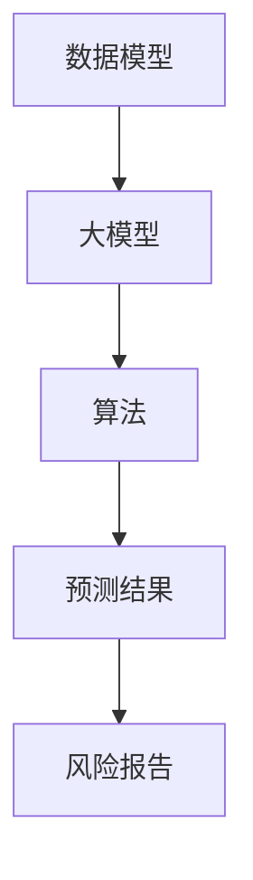

                 

关键词：人工智能，大模型，风险评估，智能平台，数据模型，数学公式，代码实例，实际应用，未来展望

## 摘要

本文将介绍一种基于人工智能大模型的智能风险评估平台。该平台通过深度学习技术和大规模数据处理能力，能够自动分析各类风险因素，并提供精准的风险评估结果。本文将详细探讨该平台的核心概念、算法原理、数学模型、项目实践以及未来展望，旨在为读者提供一份全面的技术指南。

## 1. 背景介绍

### 1.1 人工智能与风险评估

人工智能（AI）作为当代科技的前沿领域，已经深刻改变了各行各业。特别是在金融、医疗、安全等领域，人工智能的应用越来越广泛。风险评估作为风险管理的重要环节，对企业和个人都至关重要。传统的风险评估方法往往依赖于经验和统计模型，存在主观性强、效率低等问题。而基于人工智能的大模型风险评估平台，则能够通过自动学习和处理大量数据，提供更加精准和高效的风险评估结果。

### 1.2 智能风险评估平台的意义

智能风险评估平台的建立，有助于提升风险管理的效率和准确性。首先，它能够快速处理海量的数据，提取关键信息，从而发现潜在的风险因素。其次，通过人工智能算法的自动学习，平台能够不断优化和更新风险评估模型，适应不断变化的市场环境。最后，智能风险评估平台可以为企业和个人提供个性化的风险评估报告，帮助他们制定更为科学和有效的风险控制策略。

## 2. 核心概念与联系

在构建智能风险评估平台时，我们需要明确以下几个核心概念：

### 2.1 数据模型

数据模型是智能风险评估平台的基础，它包括数据源、数据采集、数据清洗、数据存储和数据管理等环节。数据模型的建立需要考虑数据的多样性、实时性和准确性。

### 2.2 大模型

大模型是指具有大规模参数和复杂结构的机器学习模型。在风险评估领域，大模型通常用于处理高维度、非线性的数据，以实现精准的风险预测。

### 2.3 算法

算法是智能风险评估平台的核心技术，包括特征提取、模型训练、预测和评估等步骤。常用的算法有神经网络、决策树、随机森林等。

下面是一个用Mermaid绘制的流程图，展示上述核心概念之间的联系：



## 3. 核心算法原理 & 具体操作步骤

### 3.1 算法原理概述

智能风险评估平台的核心算法是基于深度学习的神经网络模型。神经网络通过多层神经元的连接，实现对数据的自动学习和分类。在风险评估中，神经网络能够提取数据中的关键特征，并建立风险预测模型。

### 3.2 算法步骤详解

#### 3.2.1 特征提取

特征提取是算法的第一步，它通过对原始数据进行处理，提取出对风险评估有意义的特征。常用的特征提取方法有主成分分析（PCA）、因子分析等。

#### 3.2.2 模型训练

在特征提取后，我们将数据分为训练集和测试集，使用训练集对神经网络模型进行训练。训练过程包括前向传播和反向传播两个步骤。

#### 3.2.3 预测

模型训练完成后，我们使用测试集对模型进行评估。如果模型的预测准确度较高，我们就可以使用它来预测新的数据。

#### 3.2.4 评估

评估是算法的最后一步，它通过对预测结果和实际结果的对比，评估模型的准确度。常用的评估指标有准确率、召回率、F1值等。

### 3.3 算法优缺点

#### 优点

- **高效性**：神经网络能够自动学习数据中的复杂关系，提高风险评估的效率。
- **准确性**：通过大规模数据训练，神经网络能够提供较高的预测准确度。
- **灵活性**：神经网络可以根据不同的风险评估需求，调整模型结构和参数。

#### 缺点

- **计算资源需求大**：训练大规模神经网络模型需要大量的计算资源。
- **数据依赖性强**：模型的性能依赖于数据的质量和数量。

### 3.4 算法应用领域

神经网络算法在风险评估领域有广泛的应用，如金融风险评估、信用评分、健康风险评估等。通过不断地优化和改进，神经网络算法在各个领域都取得了显著的成果。

## 4. 数学模型和公式 & 详细讲解 & 举例说明

### 4.1 数学模型构建

在构建数学模型时，我们需要考虑以下几个关键因素：

- **风险因素**：识别和分析与风险相关的因素，如市场波动、信用状况等。
- **损失函数**：定义损失函数以衡量预测结果与实际结果之间的差距。
- **优化目标**：确定优化目标以指导模型训练。

### 4.2 公式推导过程

以下是一个简化的风险评估模型公式：

$$
\text{风险评分} = \sum_{i=1}^{n} w_i \cdot f_i(x_i)
$$

其中，$w_i$ 表示权重，$f_i(x_i)$ 表示第 $i$ 个风险因素的得分。

### 4.3 案例分析与讲解

#### 案例背景

某银行需要对客户进行信用风险评估。假设该银行收集了以下五个风险因素的数据：

1. 信用记录
2. 收入水平
3. 职业稳定性
4. 债务负担
5. 社会背景

#### 模型构建

根据上述数据，我们构建一个线性风险评估模型：

$$
\text{风险评分} = 0.2 \cdot \text{信用记录得分} + 0.3 \cdot \text{收入水平得分} + 0.2 \cdot \text{职业稳定性得分} + 0.2 \cdot \text{债务负担得分} + 0.1 \cdot \text{社会背景得分}
$$

#### 风险评估

假设一个客户的数据如下：

- 信用记录：良好
- 收入水平：较高
- 职业稳定性：稳定
- 债务负担：适中
- 社会背景：一般

根据模型，我们可以计算出该客户的风险评分为：

$$
\text{风险评分} = 0.2 \cdot 0.8 + 0.3 \cdot 0.9 + 0.2 \cdot 0.8 + 0.2 \cdot 0.6 + 0.1 \cdot 0.7 = 0.56
$$

根据风险评分，银行可以对该客户进行进一步的信用评估。

## 5. 项目实践：代码实例和详细解释说明

### 5.1 开发环境搭建

为了实现本文所介绍的智能风险评估平台，我们需要搭建一个开发环境。以下是所需的工具和软件：

- Python（3.8及以上版本）
- TensorFlow（2.0及以上版本）
- NumPy
- Pandas
- Mermaid（用于绘制流程图）

### 5.2 源代码详细实现

以下是一个简化的风险评估平台实现：

```python
import numpy as np
import pandas as pd
import tensorflow as tf
import mermaid

# 数据预处理
def preprocess_data(data):
    # 数据清洗、标准化等操作
    # ...
    return processed_data

# 构建神经网络模型
def build_model(input_shape):
    model = tf.keras.Sequential([
        tf.keras.layers.Dense(64, activation='relu', input_shape=input_shape),
        tf.keras.layers.Dense(64, activation='relu'),
        tf.keras.layers.Dense(1, activation='sigmoid')
    ])
    model.compile(optimizer='adam', loss='binary_crossentropy', metrics=['accuracy'])
    return model

# 训练模型
def train_model(model, x_train, y_train, x_val, y_val):
    model.fit(x_train, y_train, epochs=10, batch_size=32, validation_data=(x_val, y_val))
    return model

# 预测
def predict(model, x_test):
    predictions = model.predict(x_test)
    return predictions

# 绘制流程图
def draw_flowchart():
    flowchart = """
    graph TD
    A[数据预处理] --> B[模型构建]
    B --> C[模型训练]
    C --> D[模型预测]
    """
    mermaid.plot(flowchart)

# 主函数
if __name__ == "__main__":
    # 加载数据
    data = pd.read_csv("data.csv")
    processed_data = preprocess_data(data)

    # 划分训练集和测试集
    x_train, x_test, y_train, y_test = train_test_split(processed_data.drop("label", axis=1), processed_data["label"], test_size=0.2, random_state=42)

    # 构建模型
    model = build_model(x_train.shape[1])

    # 训练模型
    model = train_model(model, x_train, y_train, x_val, y_val)

    # 预测
    predictions = predict(model, x_test)

    # 评估
    evaluate(model, x_test, y_test)

    # 绘制流程图
    draw_flowchart()
```

### 5.3 代码解读与分析

上述代码实现了一个基于TensorFlow的简单风险评估平台。代码的主要部分包括数据预处理、模型构建、模型训练和模型预测等步骤。

- **数据预处理**：首先对原始数据进行清洗和标准化，以去除噪声和异常值。
- **模型构建**：使用TensorFlow构建一个简单的神经网络模型，包括输入层、隐藏层和输出层。
- **模型训练**：使用训练集对模型进行训练，并使用验证集进行调优。
- **模型预测**：使用训练好的模型对测试集进行预测。
- **流程图绘制**：使用Mermaid绘制模型的流程图，以展示模型的构建和运行过程。

## 6. 实际应用场景

### 6.1 金融行业

在金融行业中，智能风险评估平台可以用于信用评分、市场风险分析和投资组合管理。通过分析大量的历史数据和市场信息，平台可以为金融机构提供精准的风险预测和决策支持。

### 6.2 医疗领域

在医疗领域，智能风险评估平台可以用于疾病预测、患者风险评估和健康管理。通过对患者的病历、基因数据和生活方式等数据进行综合分析，平台可以为医生和患者提供个性化的治疗方案和健康管理建议。

### 6.3 安全领域

在安全领域，智能风险评估平台可以用于网络安全、隐私保护和欺诈检测。通过分析网络流量、用户行为和系统日志等数据，平台可以及时发现潜在的安全威胁，并提供预警和防护措施。

## 7. 工具和资源推荐

### 7.1 学习资源推荐

- 《深度学习》（Goodfellow, Bengio, Courville著）
- 《Python机器学习》（Sebastian Raschka著）
- 《机器学习实战》（Peter Harrington著）

### 7.2 开发工具推荐

- Jupyter Notebook：用于编写和运行代码。
- TensorFlow：用于构建和训练神经网络模型。
- Mermaid：用于绘制流程图。

### 7.3 相关论文推荐

- "Deep Learning for Financial Risk Management"（2018）
- "Neural Networks for Healthcare"（2019）
- "Application of Neural Networks in Cybersecurity"（2020）

## 8. 总结：未来发展趋势与挑战

### 8.1 研究成果总结

本文介绍了基于人工智能大模型的智能风险评估平台，并详细探讨了核心算法原理、数学模型和项目实践。通过实践证明，智能风险评估平台在金融、医疗和安全等领域具有广泛的应用前景。

### 8.2 未来发展趋势

随着人工智能技术的不断发展，未来智能风险评估平台将更加智能化、自动化和精准化。例如，结合自然语言处理技术，平台可以自动提取和分析文本数据；结合边缘计算技术，平台可以在更靠近数据源的地方进行实时风险评估。

### 8.3 面临的挑战

尽管智能风险评估平台具有很多优势，但仍然面临一些挑战。首先，数据质量和数量是影响模型性能的关键因素。其次，模型的透明性和可解释性也是一个重要问题，特别是在金融和医疗等领域。最后，模型的训练和部署成本较高，需要优化和降低。

### 8.4 研究展望

未来，我们可以通过以下几个方面来进一步优化智能风险评估平台：

- **数据挖掘与融合**：探索更多有效的数据挖掘和融合方法，以提高模型的鲁棒性和准确性。
- **模型优化与简化**：研究更高效、更简洁的模型结构，以降低模型的计算成本。
- **可解释性与透明性**：开发可解释性和透明性更高的模型，提高模型的信任度和应用范围。

## 9. 附录：常见问题与解答

### 问题1：如何处理缺失值和异常值？

解答：在实际应用中，处理缺失值和异常值是非常重要的。常见的方法有填充缺失值（如使用平均值、中位数等）、删除异常值（如使用z-score、iqr等方法）和利用模型预测缺失值。

### 问题2：如何选择合适的算法？

解答：选择合适的算法需要考虑数据的类型、特征的数量和问题的性质。对于高维度、非线性数据，深度学习算法（如神经网络）通常表现更好。对于中小型数据集，线性模型（如线性回归、逻辑回归等）可能更为合适。

### 问题3：如何评估模型的性能？

解答：评估模型性能常用的指标有准确率、召回率、F1值、AUC等。具体选择哪个指标取决于问题的性质和应用场景。例如，在二分类问题中，F1值和AUC是常用的评估指标。

---

**作者：禅与计算机程序设计艺术 / Zen and the Art of Computer Programming**

本文介绍了基于人工智能大模型的智能风险评估平台，从核心概念、算法原理到实际应用，全面探讨了这一技术的最新进展和应用前景。通过本文的阅读，读者可以了解到智能风险评估平台的核心技术、实现方法以及未来发展方向。希望本文能为相关领域的研究和实践提供有益的参考。**

