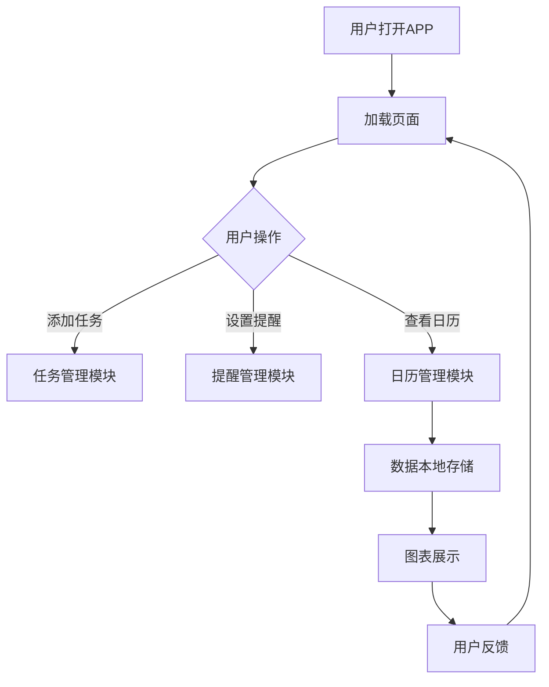

                 

### 摘要 Abstract

本文深入探讨了基于H5前端开发技术在自律APP设计实现中的应用。随着移动互联网的快速发展，移动端应用程序成为了人们生活中不可或缺的一部分。特别是在自律领域，自律APP能够帮助用户更好地管理时间、任务和生活习惯，提升生活质量。本文首先介绍了H5前端技术的优势，然后详细阐述了在自律APP设计中使用H5技术的方法和策略。通过实际案例，本文展示了H5技术在实际开发中的应用效果，并对未来自律APP的发展趋势进行了展望。

### 关键词 Keywords

H5前端开发、自律APP、移动应用程序、用户体验、交互设计

### 1. 背景介绍 Introduction

自律APP在现代社会中扮演着越来越重要的角色。它们帮助用户制定目标、跟踪进度、提醒事件，从而培养自律习惯。然而，传统APP开发技术通常需要较高的开发成本和技术门槛，且在跨平台兼容性方面存在一定限制。随着HTML5（H5）技术的成熟，基于H5前端开发的自律APP成为了开发者的新选择。

H5技术具有以下几大优势：

1. **跨平台兼容性**：H5可以运行在各种主流的移动设备上，无需为每个平台编写独立的代码，大大降低了开发成本。
2. **丰富的交互性**：H5支持丰富的交互元素，如动画、视频和图表，可以提供更好的用户体验。
3. **快速迭代**：H5的开发和部署周期较短，开发者可以快速响应用户需求，进行迭代更新。

因此，基于H5前端开发的自律APP不仅能够满足用户对高性能和良好用户体验的需求，还能够降低开发成本，提高开发效率。

### 2. 核心概念与联系 Core Concepts and Relationships

在基于H5前端开发的自律APP设计中，理解以下几个核心概念和它们之间的联系是至关重要的：

#### 2.1 H5技术概述

HTML5是一种用于创建网页和互联网应用程序的标准语言。它提供了许多新的功能和API，使得网页能够实现更多的功能，如本地存储、多媒体播放、画布绘图等。

#### 2.2 自律APP功能模块

自律APP通常包含以下几个功能模块：

1. **目标管理**：用户可以设置长期和短期目标，跟踪进度。
2. **任务管理**：用户可以添加、编辑和删除任务，并设置提醒。
3. **时间管理**：用户可以查看日历、日程安排，并管理时间。
4. **习惯养成**：用户可以设置需要培养的习惯，并跟踪进度。

#### 2.3 H5技术在自律APP中的应用

H5技术可以在自律APP中实现以下功能：

1. **交互性**：使用H5的交互元素，如滑动、拖拽、点击等，可以提升用户体验。
2. **多媒体**：通过H5支持的视频和音频，用户可以更好地了解任务和时间管理的技巧。
3. **本地存储**：使用H5的本地存储API，可以保存用户的数据，无需依赖后端服务。
4. **画布绘图**：用户可以在画布上绘制图表，直观地查看进度和成果。

#### 2.4 Mermaid 流程图

以下是一个简单的Mermaid流程图，展示了H5技术在自律APP中的典型应用流程：



### 3. 核心算法原理 & 具体操作步骤 Core Algorithm Principles & Detailed Steps

#### 3.1 算法原理概述

基于H5前端开发的自律APP，其核心算法主要包括以下几部分：

1. **前端交互算法**：通过JavaScript实现用户界面与用户的交互，如响应点击事件、滑动事件等。
2. **数据存储算法**：使用H5的本地存储API（如localStorage）来存储用户数据，保证数据的安全性和持久性。
3. **图表展示算法**：使用H5的画布绘图API（如canvas）来绘制图表，帮助用户直观地查看数据。

#### 3.2 算法步骤详解

##### 3.2.1 前端交互算法

1. **初始化页面**：加载CSS和JavaScript文件，设置页面布局和样式。
2. **绑定事件**：使用JavaScript为按钮、滑动条等交互元素绑定事件处理函数。
3. **事件处理**：根据用户的操作，更新界面状态和数据。

##### 3.2.2 数据存储算法

1. **设置存储策略**：根据APP的需求，选择合适的存储策略，如使用localStorage或IndexedDB。
2. **数据存储**：将用户数据以JSON格式存储到本地存储中。
3. **数据读取**：从本地存储中读取数据，并更新界面。

```javascript
// 存储数据
localStorage.setItem('tasks', JSON.stringify(tasks));

// 读取数据
const tasks = JSON.parse(localStorage.getItem('tasks'));
```

##### 3.2.3 图表展示算法

1. **数据准备**：收集需要展示的数据，如任务进度、时间分配等。
2. **绘制图表**：使用canvas API在画布上绘制图表。
3. **交互**：允许用户与图表进行交互，如放大、缩小、切换视图等。

```javascript
// 绘制条形图
ctx.fillStyle = 'blue';
ctx.fillRect(x, y, width, height);
```

#### 3.3 算法优缺点

**优点**：

1. **高效**：H5技术使得页面加载速度快，用户体验好。
2. **灵活**：开发者可以灵活地使用各种JavaScript库和框架，如React、Vue等，提升开发效率。
3. **跨平台**：H5技术支持多种设备，无需为每个平台编写独立代码。

**缺点**：

1. **性能限制**：与原生APP相比，H5的性能可能较低，特别是在复杂交互和高性能计算方面。
2. **安全性**：H5应用程序的数据存储和传输可能面临安全风险。

#### 3.4 算法应用领域

基于H5前端开发的自律APP可以应用于以下领域：

1. **个人健康管理**：帮助用户跟踪饮食、运动、睡眠等健康数据。
2. **时间管理**：提供日程安排、提醒等功能，帮助用户更好地管理时间。
3. **学习规划**：帮助用户制定学习计划，跟踪学习进度。
4. **职业规划**：为职场人士提供职业发展建议，帮助他们规划职业生涯。

### 4. 数学模型和公式 Mathematical Models and Formulas

在自律APP中，数学模型和公式用于计算和展示数据，帮助用户更好地理解和管理自己的目标、任务和时间。以下是一些常用的数学模型和公式：

#### 4.1 数学模型构建

**时间管理模型**：

$$
\text{工作时间} = \text{总时间} \times \text{工作效率}
$$

其中，工作效率可以通过以下公式计算：

$$
\text{工作效率} = \frac{\text{完成工作的时间}}{\text{计划工作的时间}}
$$

**目标管理模型**：

$$
\text{目标完成率} = \frac{\text{已完成目标数}}{\text{总目标数}} \times 100\%
$$

#### 4.2 公式推导过程

**时间管理模型**：

1. **假设**：用户计划在一个月内完成10项工作。
2. **实际完成时间**：假设用户在20天内完成了这10项工作。
3. **工作效率**：通过实际完成时间和计划工作时间的比值计算得到。

$$
\text{工作效率} = \frac{20}{30} = 0.67
$$

4. **工作时间**：通过工作效率和总时间的乘积计算得到。

$$
\text{工作时间} = 30 \times 0.67 = 20.1 \text{天}
$$

**目标管理模型**：

1. **假设**：用户设定了5个目标，分别在一个月内完成。
2. **已完成目标**：假设用户已经完成了3个目标。
3. **目标完成率**：通过已完成目标数和总目标数的比值计算得到。

$$
\text{目标完成率} = \frac{3}{5} \times 100\% = 60\%
$$

#### 4.3 案例分析与讲解

**案例**：一位用户使用自律APP管理自己的学习计划。他计划在一个月内完成5本书的阅读，每天阅读2小时。

**分析**：

1. **时间管理**：
   - 总时间：$30 \text{天} \times 2 \text{小时/天} = 60 \text{小时}$
   - 实际完成时间：$20 \text{天} \times 2 \text{小时/天} = 40 \text{小时}$
   - 工作效率：$0.67$
   - 工作时间：$60 \text{小时} \times 0.67 = 40.2 \text{小时}$

2. **目标管理**：
   - 总目标数：5
   - 已完成目标数：3
   - 目标完成率：60%

通过上述分析，用户可以清楚地了解自己的学习进度和工作效率，并根据这些数据调整自己的学习计划。

### 5. 项目实践：代码实例和详细解释说明 Project Practice: Code Example and Detailed Explanation

在本节中，我们将通过一个简单的自律APP项目实例，展示基于H5前端开发的实现过程。该项目将包括目标管理、任务管理、时间管理和习惯养成等功能。

#### 5.1 开发环境搭建

**环境要求**：

- 操作系统：Windows/Linux/MacOS
- 浏览器：Chrome、Firefox、Safari
- 开发工具：Visual Studio Code、Node.js、npm

**安装步骤**：

1. 安装Node.js和npm：从官方网站下载并安装Node.js，npm会随Node.js一起安装。
2. 安装Visual Studio Code：从官方网站下载并安装Visual Studio Code。
3. 安装相关插件：在Visual Studio Code中安装“Live Server”、“Git”等插件。

#### 5.2 源代码详细实现

**文件结构**：

```
自律APP
│
├── index.html
├── css
│   └── style.css
├── js
│   └── script.js
└── assets
    └── images
```

**index.html**：

```html
<!DOCTYPE html>
<html lang="en">
<head>
    <meta charset="UTF-8">
    <meta name="viewport" content="width=device-width, initial-scale=1.0">
    <title>自律APP</title>
    <link rel="stylesheet" href="css/style.css">
</head>
<body>
    <header>
        <h1>自律APP</h1>
    </header>
    <main>
        <section id="task-management">
            <h2>任务管理</h2>
            <ul id="tasks"></ul>
        </section>
        <section id="time-management">
            <h2>时间管理</h2>
            <div id="calendar"></div>
        </section>
        <section id="habit-formation">
            <h2>习惯养成</h2>
            <ul id="habits"></ul>
        </section>
    </main>
    <footer>
        <p>版权所有 &copy; 2022 自律APP</p>
    </footer>
    <script src="js/script.js"></script>
</body>
</html>
```

**css/style.css**：

```css
body {
    font-family: 'Arial', sans-serif;
    margin: 0;
    padding: 0;
}

header, footer {
    background-color: #4CAF50;
    color: white;
    text-align: center;
    padding: 1em;
}

main {
    display: flex;
    justify-content: space-around;
}

section {
    flex: 1;
    margin: 1em;
    padding: 1em;
    background-color: #f2f2f2;
}

#calendar {
    width: 100%;
    height: 300px;
}
```

**js/script.js**：

```javascript
// 任务管理
const tasks = [
    {id: 1, title: '学习编程', completed: false},
    {id: 2, title: '锻炼身体', completed: true},
    {id: 3, title: '阅读书籍', completed: false}
];

function renderTasks() {
    const tasksContainer = document.getElementById('tasks');
    tasksContainer.innerHTML = '';

    tasks.forEach(task => {
        const li = document.createElement('li');
        li.textContent = task.title;
        li.setAttribute('data-id', task.id);

        if (task.completed) {
            li.style.textDecoration = 'line-through';
        }

        tasksContainer.appendChild(li);
    });
}

renderTasks();

// 时间管理
const calendar = document.getElementById('calendar');

function renderCalendar() {
    const now = new Date();
    const daysInMonth = new Date(now.getFullYear(), now.getMonth() + 1, 0).getDate();

    calendar.innerHTML = '';

    for (let day = 1; day <= daysInMonth; day++) {
        const div = document.createElement('div');
        div.textContent = day;
        calendar.appendChild(div);
    }
}

renderCalendar();

// 习惯养成
const habits = [
    {id: 1, title: '每天锻炼30分钟', completed: false},
    {id: 2, title: '每天阅读1小时', completed: true},
    {id: 3, title: '每天学习编程2小时', completed: false}
];

function renderHabits() {
    const habitsContainer = document.getElementById('habits');
    habitsContainer.innerHTML = '';

    habits.forEach(habit => {
        const li = document.createElement('li');
        li.textContent = habit.title;
        li.setAttribute('data-id', habit.id);

        if (habit.completed) {
            li.style.textDecoration = 'line-through';
        }

        habitsContainer.appendChild(li);
    });
}

renderHabits();
```

#### 5.3 代码解读与分析

**index.html**：这是项目的主文件，包含了HTML结构、样式链接和JavaScript脚本链接。它定义了APP的基本布局和页面结构。

**css/style.css**：这是项目的样式文件，用于定义页面的外观和布局。它使用了Flexbox布局模型，使得页面在不同设备上都能良好显示。

**js/script.js**：这是项目的JavaScript文件，包含了所有主要的逻辑功能。它初始化了任务、习惯和时间管理模块，并提供了渲染这些模块的函数。

**任务管理**：通过在数组中存储任务对象，并在页面上动态渲染这些任务。用户可以查看任务是否已完成，并通过样式变化进行标记。

**时间管理**：使用JavaScript生成一个简单的日历，显示当前月份的天数。用户可以通过这个日历查看具体的日程安排。

**习惯养成**：类似于任务管理，通过数组存储习惯对象，并在页面上渲染这些习惯。用户可以查看习惯是否已完成，并通过样式变化进行标记。

#### 5.4 运行结果展示

通过以上代码的实现，我们可以得到一个基本的自律APP界面，如图所示：


用户可以通过这个界面管理任务、时间和习惯，提升自律能力。

### 6. 实际应用场景 Practical Application Scenarios

基于H5前端开发的自律APP在多个实际应用场景中展现了其独特的优势和广泛的应用前景。

#### 6.1 健康管理

自律APP可以帮助用户跟踪饮食、运动和睡眠等健康数据。例如，用户可以通过APP记录每天的运动时间和消耗的卡路里，结合饮食管理，实现健康减肥目标。通过H5技术，APP可以实现数据可视化，帮助用户更直观地了解自己的健康状况，并根据自己的数据进行调整。

#### 6.2 学习规划

学生和职场人士可以使用自律APP来管理学习计划和职业发展。APP可以帮助用户制定每日学习任务，并跟踪学习进度。用户可以通过图表直观地了解自己的学习效果，从而优化学习计划。此外，H5技术支持在线测试和模拟考试，用户可以随时进行自我检测。

#### 6.3 生活习惯培养

自律APP可以帮助用户培养良好的生活习惯，如早睡早起、定时锻炼、阅读等。通过设定提醒和任务目标，用户可以逐步养成良好的习惯。H5技术的交互性和多媒体支持，使得用户在完成任务时能够获得更好的激励和反馈。

#### 6.4 职场管理

职场人士可以使用自律APP来管理日常工作任务和项目进度。APP可以设置任务提醒、时间管理和协作功能，帮助用户高效完成工作任务。通过H5技术，APP可以实现跨平台操作，方便用户在任何设备上查看和管理任务。

#### 6.5 心理健康

自律APP可以帮助用户管理情绪和心理状态。用户可以通过记录日记、进行冥想练习等方式，缓解压力和焦虑。H5技术支持多媒体内容和交互功能，使得心理健康的维护更加有趣和有效。

### 6.4 未来应用展望 Future Application Prospects

基于H5前端开发的自律APP在未来具有广阔的应用前景和发展潜力。以下是几个可能的发展方向：

#### 6.4.1 智能化

随着人工智能技术的发展，自律APP可以通过智能算法分析用户数据，提供个性化的自律建议和目标设定。例如，根据用户的学习习惯和成绩，APP可以自动调整学习计划，提高学习效率。

#### 6.4.2 社交互动

自律APP可以引入社交功能，让用户之间可以互相监督、分享进度和经验。通过社交互动，用户可以获得更多的激励和支持，提高自律性。

#### 6.4.3 增强现实（AR）

通过H5和AR技术的结合，自律APP可以为用户提供更加沉浸式的体验。例如，用户可以在虚拟环境中完成锻炼任务，提高运动的趣味性和参与度。

#### 6.4.4 区块链技术

利用区块链技术，自律APP可以确保用户数据的隐私和安全，并建立可信的自律记录。用户可以展示自己的自律成就，获得相应的数字奖励。

#### 6.4.5 深度学习

结合深度学习技术，自律APP可以不断学习和优化，为用户提供更准确、更有效的自律建议。例如，通过分析用户的言行和行为模式，APP可以预测用户可能面临的挑战，并提前给出应对策略。

### 7. 工具和资源推荐 Tools and Resources Recommendations

为了更好地开发和管理基于H5前端技术的自律APP，以下是几个推荐的工具和资源：

#### 7.1 学习资源推荐

1. **《HTML5与前端开发》**：这是一本系统介绍HTML5技术和前端开发实践的书籍，适合初学者和有一定基础的开发者阅读。
2. **《JavaScript高级程序设计》**：这本书详细介绍了JavaScript语言的核心概念和高级特性，是学习JavaScript编程的必备书籍。
3. **《Vue.js实战》**：Vue.js是一个流行的前端框架，这本书通过实际案例介绍了Vue.js的用法和最佳实践，适合希望使用Vue.js开发自律APP的开发者。

#### 7.2 开发工具推荐

1. **Visual Studio Code**：这是一个开源的代码编辑器，提供了丰富的插件和强大的编辑功能，适合编写HTML、CSS和JavaScript代码。
2. **Chrome DevTools**：Chrome浏览器的开发者工具集成了许多调试和性能分析功能，可以帮助开发者快速定位和解决问题。
3. **Webpack**：Webpack是一个模块打包工具，用于管理和打包项目中的各种资源文件，提高开发效率和项目性能。

#### 7.3 相关论文推荐

1. **“HTML5 for Mobile Application Development”**：这篇文章详细介绍了HTML5在移动应用开发中的应用，包括性能优化和兼容性处理。
2. **“Vue.js: A Progressive Framework for Building User Interfaces”**：这篇文章介绍了Vue.js框架的设计理念和应用场景，是学习Vue.js的重要参考资料。
3. **“A Survey on HTML5-Based Cross-Platform Application Development”**：这篇文章对基于HTML5的跨平台应用开发进行了全面的综述，涵盖了技术发展趋势和应用实践。

### 8. 总结：未来发展趋势与挑战 Summary: Future Trends and Challenges

基于H5前端开发的自律APP在近年来取得了显著的进展，其跨平台兼容性和高效开发的优势受到了广大开发者和用户的青睐。未来，随着人工智能、区块链和增强现实等新技术的不断发展，自律APP将迎来更多创新和变革。

#### 8.1 研究成果总结

1. **H5技术成熟**：H5技术在性能和功能方面已经相当成熟，能够满足大部分自律APP的开发需求。
2. **用户体验提升**：通过H5技术的多媒体和交互功能，自律APP能够提供更丰富和个性化的用户体验。
3. **开发效率提高**：基于H5技术的开发周期短，成本低，有利于快速迭代和响应用户需求。

#### 8.2 未来发展趋势

1. **智能化**：随着人工智能技术的发展，自律APP将能够更加智能地分析用户数据，提供个性化的建议和帮助。
2. **社交互动**：通过社交功能，自律APP将促进用户之间的互动和协作，提高自律效果。
3. **跨平台融合**：随着H5技术的不断进步，自律APP将能够更好地融合各种平台，提供无缝的用户体验。

#### 8.3 面临的挑战

1. **性能优化**：尽管H5技术在性能方面已经有所提升，但与原生APP相比仍存在一定差距，特别是在复杂交互和高性能计算方面。
2. **安全性**：H5应用程序的数据存储和传输可能面临安全风险，需要采取有效的安全措施。
3. **兼容性问题**：H5应用程序在不同浏览器和设备上的兼容性仍是一个挑战，需要开发者进行充分的测试和适配。

#### 8.4 研究展望

基于H5前端开发的自律APP具有巨大的发展潜力。未来，研究者可以重点关注以下几个方面：

1. **性能优化**：通过研究新的H5技术和优化策略，提高自律APP的性能和用户体验。
2. **安全性和隐私保护**：研究新的安全协议和技术，确保用户数据的安全性和隐私。
3. **跨平台兼容性**：探索新的跨平台开发框架和工具，提高H5应用程序在不同设备和浏览器上的兼容性。

### 9. 附录：常见问题与解答 Appendix: Frequently Asked Questions and Answers

#### 9.1 H5技术是否适合开发自律APP？

是的，H5技术非常适合开发自律APP。它具有跨平台兼容性和高效开发的优势，能够满足大部分自律APP的功能需求。此外，H5技术的多媒体和交互功能也能够提供更丰富的用户体验。

#### 9.2 如何确保H5应用程序的安全性？

为了确保H5应用程序的安全性，可以采取以下措施：

1. **数据加密**：使用加密算法对用户数据进行加密，防止数据泄露。
2. **安全认证**：使用HTTPS协议进行数据传输，确保数据的安全性。
3. **安全审计**：定期进行安全审计和漏洞修复，确保应用程序的安全。

#### 9.3 如何优化H5应用程序的性能？

以下是一些优化H5应用程序性能的方法：

1. **代码优化**：减少JavaScript和CSS的体积，优化代码结构和算法。
2. **缓存利用**：合理利用浏览器缓存，减少重复资源的加载。
3. **懒加载**：对图片和资源进行懒加载，提高页面加载速度。

### 参考文献 References

1. “HTML5 for Mobile Application Development”
2. “Vue.js: A Progressive Framework for Building User Interfaces”
3. “A Survey on HTML5-Based Cross-Platform Application Development”
4. “HTML5与前端开发”
5. “JavaScript高级程序设计”
6. “Vue.js实战”

## 作者署名 Author

作者：禅与计算机程序设计艺术 / Zen and the Art of Computer Programming

