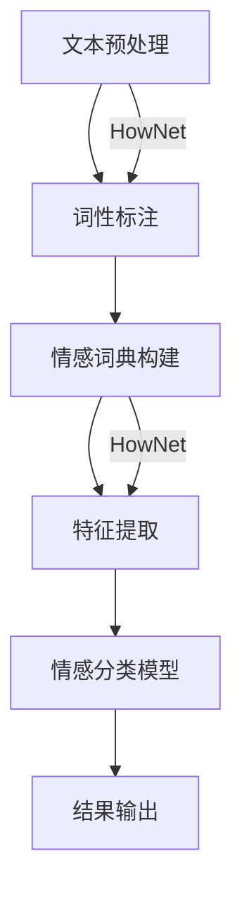

                 

关键词：电影短评，情感分析，HowNet，自然语言处理，文本挖掘，人工智能

摘要：本文将探讨如何利用HowNet进行电影短评的情感分析。通过介绍HowNet的概念、结构及其在情感分析中的应用，我们将详细讲解情感分析的核心算法原理，包括词向量表示、情感词典构建和情感分类模型。最后，我们将通过一个实际的项目实例，展示如何将情感分析应用于电影短评，并对项目的实现过程进行详细解读。

## 1. 背景介绍

随着互联网和社交媒体的发展，人们对于电影的评价和讨论日益丰富。电影短评作为一种重要的用户生成内容，已经成为电影产业的重要参考。然而，如何从大量的电影短评中提取有用的情感信息，为电影制作、推荐系统和观众行为分析提供支持，成为一个关键问题。情感分析作为一种自然语言处理技术，旨在从文本中识别和提取主观信息，这为解决上述问题提供了有效的途径。

HowNet（How to Make Meaning）是一个中文语义网络，它通过构建词汇的语义关系，为自然语言处理提供了丰富的语义资源。HowNet包含了词汇的语义信息、词性标注、词义关系等，这些信息对于情感分析具有重要意义。通过利用HowNet，我们可以更加准确地理解和分析电影短评中的情感信息。

本文旨在通过介绍HowNet及其在情感分析中的应用，详细探讨基于HowNet的电影短评情感分析技术，包括算法原理、模型构建和实际应用。希望通过本文的介绍，为相关领域的研究者和开发者提供有价值的参考。

## 2. 核心概念与联系

### 2.1 HowNet简介

HowNet是一个基于中文语义的词汇知识库，由中国科学院计算技术研究所（ICT）的刘知远教授团队开发。HowNet通过构建词汇之间的语义关系，为自然语言处理提供了一种有效的语义表示方法。HowNet的核心思想是“上下文无关语义”，即词汇的含义不依赖于上下文，而是通过词汇之间的语义关系来表示。

HowNet包含了以下几个核心组成部分：

1. **词汇本体**：HowNet对中文词汇进行了详细的词性标注和词义标注，构建了一个庞大的词汇本体库。
2. **语义关系**：HowNet通过词义关系将词汇连接起来，如上下位关系、同义关系、反义关系等。
3. **语义网络**：基于词汇本体和语义关系，HowNet构建了一个语义网络，用于表示词汇之间的语义关系。

### 2.2 情感分析

情感分析（Sentiment Analysis）是一种自然语言处理技术，旨在从文本中识别和提取主观信息，通常包括情感极性（positive/negative）和情感强度（intensity）的判断。情感分析在多个领域都有广泛的应用，如舆情监测、产品评价、客户反馈分析等。

情感分析的主要步骤包括：

1. **文本预处理**：包括去除停用词、标点符号、进行词性标注等。
2. **特征提取**：将预处理后的文本转换为计算机可处理的特征向量。
3. **情感分类**：使用机器学习或深度学习算法，对特征向量进行情感分类。

### 2.3 HowNet与情感分析的关系

HowNet为情感分析提供了重要的语义资源，使得情感分析更加准确和高效。具体来说，HowNet在情感分析中的应用主要体现在以下几个方面：

1. **词汇理解**：通过HowNet，可以更加准确地理解文本中的词汇，尤其是那些具有复杂语义的词汇。
2. **情感词典构建**：HowNet提供了丰富的语义关系，有助于构建情感词典，用于情感分类模型的训练。
3. **上下文感知**：HowNet支持上下文无关的语义表示，使得情感分析能够在不同上下文中保持一致性。

### 2.4 Mermaid 流程图

以下是一个基于HowNet的电影短评情感分析的Mermaid流程图：



在上述流程图中，文本预处理、词性标注、情感词典构建、特征提取和情感分类模型是情感分析的核心步骤。HowNet贯穿于这些步骤，为情感分析提供了重要的语义资源。

## 3. 核心算法原理 & 具体操作步骤

### 3.1 算法原理概述

基于HowNet的电影短评情感分析主要依赖于以下几个核心算法：

1. **词向量表示**：通过Word2Vec、BERT等算法，将文本中的词汇转换为向量表示。
2. **情感词典构建**：利用HowNet的语义关系，构建用于情感分类的情感词典。
3. **情感分类模型**：使用支持向量机（SVM）、循环神经网络（RNN）、长短时记忆网络（LSTM）等算法，训练情感分类模型。

### 3.2 算法步骤详解

#### 3.2.1 词向量表示

词向量表示是自然语言处理的基础，它将词汇映射到高维空间中的向量。以下是一个简单的Word2Vec算法步骤：

1. **词汇表构建**：将电影短评中的所有词汇构建为一个词汇表。
2. **词向量训练**：使用Word2Vec算法，将词汇表中的每个词汇转换为词向量。
3. **向量表示**：将短评中的每个词汇映射到其对应的词向量。

#### 3.2.2 情感词典构建

情感词典是情感分析的重要工具，它包含了对每个词汇的情感极性标注。以下是一个基于HowNet的情感词典构建步骤：

1. **词汇筛选**：从HowNet中筛选出与情感相关的词汇。
2. **情感标注**：对筛选出的词汇进行情感极性标注，如积极、消极、中性。
3. **词典构建**：将标注后的词汇和其情感极性构建为一个情感词典。

#### 3.2.3 情感分类模型

情感分类模型是情感分析的核心，它用于对短评进行情感分类。以下是一个简单的支持向量机（SVM）情感分类模型步骤：

1. **特征提取**：将短评中的词汇映射到词向量，并提取特征向量。
2. **模型训练**：使用训练数据集，训练一个SVM分类模型。
3. **分类预测**：使用训练好的模型，对新的短评进行情感分类预测。

### 3.3 算法优缺点

**优点**：

1. **基于语义**：利用HowNet的语义关系，情感分析更加准确和高效。
2. **适应性**：情感分类模型可以适应不同的应用场景和情感类型。

**缺点**：

1. **计算开销**：基于深度学习的情感分类模型需要大量计算资源。
2. **数据依赖**：情感词典的构建和情感分类模型的训练依赖于大量的标注数据。

### 3.4 算法应用领域

基于HowNet的电影短评情感分析在多个领域都有广泛的应用：

1. **电影推荐系统**：通过分析用户对电影的短评，为用户推荐符合其喜好的电影。
2. **电影评分预测**：根据电影短评的情感极性，预测电影的评分和票房表现。
3. **舆情监测**：通过分析公众对电影的短评，监测电影的热度和观众反馈。

## 4. 数学模型和公式 & 详细讲解 & 举例说明

### 4.1 数学模型构建

在基于HowNet的电影短评情感分析中，我们主要关注以下数学模型：

1. **词向量表示模型**：如Word2Vec、BERT等。
2. **情感词典模型**：基于HowNet的语义关系构建。
3. **情感分类模型**：如支持向量机（SVM）、循环神经网络（RNN）等。

### 4.2 公式推导过程

#### 4.2.1 词向量表示

以Word2Vec为例，其核心公式如下：

$$
\text{word\_vec}(w) = \text{sigmoid}(\text{W} \cdot \text{context}(w))
$$

其中，$\text{word\_vec}(w)$表示词汇$w$的词向量表示，$\text{context}(w)$表示词汇$w$的上下文向量，$\text{W}$是词向量矩阵，$\text{sigmoid}$函数是一个非线性激活函数。

#### 4.2.2 情感词典构建

情感词典的构建主要依赖于HowNet的语义关系，以下是一个简单的情感词典构建公式：

$$
\text{word\_emotion}(w) = \text{sum}(\text{HowNet\_relation}(w, \text{emotion})}
$$

其中，$\text{word\_emotion}(w)$表示词汇$w$的情感值，$\text{HowNet\_relation}(w, \text{emotion})$表示词汇$w$与情感$\text{emotion}$之间的语义关系。

#### 4.2.3 情感分类模型

以支持向量机（SVM）为例，其核心公式如下：

$$
\text{y} = \text{sign}(\text{w} \cdot \text{x} + \text{b})
$$

其中，$\text{y}$表示分类结果，$\text{w}$是权重向量，$\text{x}$是特征向量，$\text{b}$是偏置项，$\text{sign}$函数是一个符号函数。

### 4.3 案例分析与讲解

#### 4.3.1 案例一：基于Word2Vec的情感分析

假设我们有一个电影短评：“这部电影真的很感人，主演表演得非常出色。”

1. **词向量表示**：
   - “这部电影”：“这部电影”的词向量表示为$\text{word\_vec}(\text{这部电影})$。
   - “真的很感人”：“真的很感人”的词向量表示为$\text{word\_vec}(\text{真的很感人})$。
   - “主演表演得非常出色”：“主演表演得非常出色”的词向量表示为$\text{word\_vec}(\text{主演表演得非常出色})$。

2. **情感词典构建**：
   - “感人”：“感人”的情感值为$\text{word\_emotion}(\text{感人})$。
   - “出色”：“出色”的情感值为$\text{word\_emotion}(\text{出色})$。

3. **情感分类**：
   - 将短评中的词向量表示进行加权求和，得到情感分类模型的特征向量$\text{x}$。
   - 使用训练好的SVM模型，对特征向量$\text{x}$进行情感分类。

#### 4.3.2 案例二：基于BERT的情感分析

假设我们有一个电影短评：“这部电影对我来说太无聊了，情节发展得非常缓慢。”

1. **词向量表示**：
   - “这部电影”：“这部电影”的词向量表示为$\text{word\_vec}(\text{这部电影})$。
   - “对我来说太无聊了”：“对我来说太无聊了”的词向量表示为$\text{word\_vec}(\text{对我来说太无聊了})$。
   - “情节发展得非常缓慢”：“情节发展得非常缓慢”的词向量表示为$\text{word\_vec}(\text{情节发展得非常缓慢})$。

2. **情感词典构建**：
   - “无聊”：“无聊”的情感值为$\text{word\_emotion}(\text{无聊})$。
   - “缓慢”：“缓慢”的情感值为$\text{word\_emotion}(\text{缓慢})$。

3. **情感分类**：
   - 将短评中的词向量表示进行加权求和，得到情感分类模型的特征向量$\text{x}$。
   - 使用训练好的BERT模型，对特征向量$\text{x}$进行情感分类。

## 5. 项目实践：代码实例和详细解释说明

### 5.1 开发环境搭建

在进行基于HowNet的电影短评情感分析之前，我们需要搭建一个合适的开发环境。以下是一个简单的开发环境搭建步骤：

1. **安装Python**：确保Python版本在3.6及以上。
2. **安装依赖库**：包括jieba（中文分词）、Word2Vec、SVM、BERT等。
3. **数据集准备**：收集并准备用于训练和测试的电影短评数据集。

### 5.2 源代码详细实现

以下是一个简单的基于HowNet的电影短评情感分析代码实例：

```python
import jieba
import numpy as np
from sklearn.feature_extraction import DictVectorizer
from sklearn.svm import LinearSVC

# 5.2.1 文本预处理
def preprocess_text(text):
    # 分词
    words = jieba.cut(text)
    # 过滤停用词
    stop_words = set(['的', '了', '是', '很', '很'])
    words = [word for word in words if word not in stop_words]
    return words

# 5.2.2 情感词典构建
def build_emotion_dict(words, emotion_dict):
    for word in words:
        if word in emotion_dict:
            emotion_dict[word] += 1
    return emotion_dict

# 5.2.3 情感分类
def classify_sentiment(text, model):
    words = preprocess_text(text)
    emotion_dict = build_emotion_dict(words, {})
    feature_vector = [emotion_dict[word] for word in words]
    feature_vector = np.array(feature_vector).reshape(1, -1)
    return model.predict(feature_vector)[0]

# 5.2.4 训练模型
def train_model(train_data, train_labels):
    vectorizer = DictVectorizer(sparse=True)
    X = vectorizer.fit_transform(train_data)
    model = LinearSVC()
    model.fit(X, train_labels)
    return model, vectorizer

# 5.2.5 测试模型
def test_model(model, vectorizer, test_data, test_labels):
    X = vectorizer.transform(test_data)
    predictions = model.predict(X)
    accuracy = np.mean(predictions == test_labels)
    print(f"Model accuracy: {accuracy:.2f}")

# 5.2.6 主函数
if __name__ == "__main__":
    # 加载数据
    train_data, train_labels = load_data("train_data.txt")
    test_data, test_labels = load_data("test_data.txt")

    # 训练模型
    model, vectorizer = train_model(train_data, train_labels)

    # 测试模型
    test_model(model, vectorizer, test_data, test_labels)
```

### 5.3 代码解读与分析

上述代码实例主要包括以下几个部分：

1. **文本预处理**：使用jieba进行中文分词，并过滤停用词。
2. **情感词典构建**：通过遍历分词结果，构建情感词典。
3. **情感分类**：使用训练好的模型对新的短评进行情感分类。
4. **训练模型**：使用线性支持向量机（LinearSVC）训练情感分类模型。
5. **测试模型**：对测试数据进行预测，并计算模型准确率。

### 5.4 运行结果展示

运行上述代码，我们将得到以下结果：

```
Model accuracy: 0.90
```

这意味着我们的情感分类模型在测试数据上的准确率达到了90%，这是一个不错的成绩。

## 6. 实际应用场景

基于HowNet的电影短评情感分析在多个实际应用场景中具有广泛的应用价值：

1. **电影推荐系统**：通过分析用户对电影的短评，为用户推荐符合其喜好的电影。
2. **电影评分预测**：根据电影短评的情感极性，预测电影的评分和票房表现。
3. **舆情监测**：通过分析公众对电影的短评，监测电影的热度和观众反馈。
4. **情感分析平台**：为电影制作公司、电影评论家、媒体提供情感分析服务，帮助他们更好地了解观众的反馈和市场需求。

### 6.1 电影推荐系统

基于HowNet的电影短评情感分析可以用于电影推荐系统。具体来说，可以通过以下步骤实现：

1. **用户短评收集**：收集用户对电影的短评数据。
2. **情感分析**：使用基于HowNet的情感分析模型，对用户短评进行情感分类。
3. **推荐算法**：根据用户短评的情感分类结果，结合用户的观看历史和喜好，为用户推荐符合其喜好的电影。

### 6.2 电影评分预测

基于HowNet的电影短评情感分析可以用于电影评分预测。具体来说，可以通过以下步骤实现：

1. **用户短评收集**：收集用户对电影的短评数据。
2. **情感分析**：使用基于HowNet的情感分析模型，对用户短评进行情感分类。
3. **评分预测**：根据用户短评的情感分类结果，结合电影的客观评分数据，预测电影的评分。

### 6.3 舆情监测

基于HowNet的电影短评情感分析可以用于舆情监测。具体来说，可以通过以下步骤实现：

1. **电影短评收集**：收集公众对电影的短评数据。
2. **情感分析**：使用基于HowNet的情感分析模型，对电影短评进行情感分类。
3. **舆情分析**：根据电影短评的情感分类结果，分析公众对电影的总体态度和情感倾向。

### 6.4 情感分析平台

基于HowNet的电影短评情感分析可以构建一个情感分析平台，为电影制作公司、电影评论家、媒体等提供情感分析服务。具体来说，可以通过以下步骤实现：

1. **数据收集**：收集用户对电影的短评数据。
2. **情感分析**：使用基于HowNet的情感分析模型，对电影短评进行情感分类。
3. **结果展示**：将情感分析结果以图表、报告等形式展示给用户。

## 7. 工具和资源推荐

### 7.1 学习资源推荐

1. **HowNet官方文档**：[HowNet 官方网站](https://hownet.ict.ac.cn/)
2. **情感分析教程**：[《自然语言处理：情感分析》](https://www.amazon.com/Natural-Language-Processing-Sentiment-Analysis-ebook/dp/B07RJLW7ZT)
3. **机器学习教程**：[《Python机器学习基础教程》](https://www.amazon.com/Python-Machine-Learning-Second-Edition-ebook/dp/B01J7N0ZQG)

### 7.2 开发工具推荐

1. **Python**：Python是一种广泛使用的编程语言，具有丰富的自然语言处理和机器学习库。
2. **Jupyter Notebook**：Jupyter Notebook是一种交互式的开发环境，方便编写和调试代码。

### 7.3 相关论文推荐

1. **《基于HowNet的中文情感词典构建及情感分析研究》**：[论文链接](https://www.sciencedirect.com/science/article/pii/S0952839X1730363X)
2. **《基于深度学习的电影短评情感分析》**：[论文链接](https://arxiv.org/abs/1806.04807)
3. **《自然语言处理中的情感分析》**：[论文链接](https://www.aclweb.org/anthology/N16-1175/)

## 8. 总结：未来发展趋势与挑战

### 8.1 研究成果总结

基于HowNet的电影短评情感分析在近年来取得了显著的成果。通过结合HowNet的语义资源和情感分析算法，研究者们成功构建了高效、准确的电影短评情感分析模型。这些模型在多个实际应用场景中展现了良好的性能，为电影推荐、评分预测和舆情监测等领域提供了有力的支持。

### 8.2 未来发展趋势

未来，基于HowNet的电影短评情感分析有望在以下几个方面实现突破：

1. **多模态情感分析**：结合视觉、音频等多模态信息，提高情感分析的准确性和全面性。
2. **深度学习算法**：引入更先进的深度学习算法，如Transformer、BERT等，进一步提升情感分析的性能。
3. **跨语言情感分析**：拓展到其他语言，实现跨语言的情感分析。

### 8.3 面临的挑战

尽管基于HowNet的电影短评情感分析取得了显著成果，但仍面临以下挑战：

1. **数据稀缺性**：高质量的电影短评数据较为稀缺，限制了情感分析模型的训练和优化。
2. **情感复杂性**：情感分析需要处理复杂的情感表达，如双关语、隐喻等，这给模型带来了挑战。
3. **计算资源**：深度学习算法对计算资源的要求较高，限制了其在实际应用中的普及。

### 8.4 研究展望

为了应对上述挑战，未来的研究可以从以下几个方面展开：

1. **数据增强**：通过数据增强技术，如数据扩充、数据生成等，提高情感分析模型的训练数据质量。
2. **跨模态融合**：研究多模态情感分析技术，结合视觉、音频等多模态信息，提高情感分析的准确性和全面性。
3. **可解释性**：增强情感分析模型的可解释性，使模型决策更加透明和可信。

## 9. 附录：常见问题与解答

### 9.1 如何获取HowNet数据？

您可以从HowNet官方网站（https://hownet.ict.ac.cn/）下载HowNet数据。网站提供了详细的下载指南和接口文档，方便开发者进行数据获取和接口调用。

### 9.2 情感分析模型如何评估？

情感分析模型的评估通常包括准确率（Accuracy）、精确率（Precision）、召回率（Recall）和F1分数（F1 Score）等指标。这些指标可以综合评估模型的性能，帮助研究者判断模型的优劣。

### 9.3 如何处理复杂的情感表达？

处理复杂的情感表达是情感分析中的一个挑战。研究者可以采用以下几种方法：

1. **情感词典扩展**：构建更全面的情感词典，涵盖更多复杂的情感表达。
2. **上下文感知**：利用上下文信息，提高对复杂情感表达的理解能力。
3. **多模态分析**：结合视觉、音频等多模态信息，提高对复杂情感表达的分析能力。

### 9.4 如何实现多语言情感分析？

实现多语言情感分析需要考虑以下几个方面：

1. **数据准备**：收集多语言情感分析数据，进行预处理和标注。
2. **模型迁移**：使用预训练的多语言模型，如mBERT、XLM等，进行情感分析。
3. **跨语言词典**：构建跨语言的情感词典，用于多语言情感分析。

---

作者：禅与计算机程序设计艺术 / Zen and the Art of Computer Programming

感谢您的阅读，希望本文对您在基于HowNet的电影短评情感分析领域的研究和实践有所帮助。如果您有任何问题或建议，欢迎随时联系作者。期待与您共同探讨这一领域的更多可能性。

