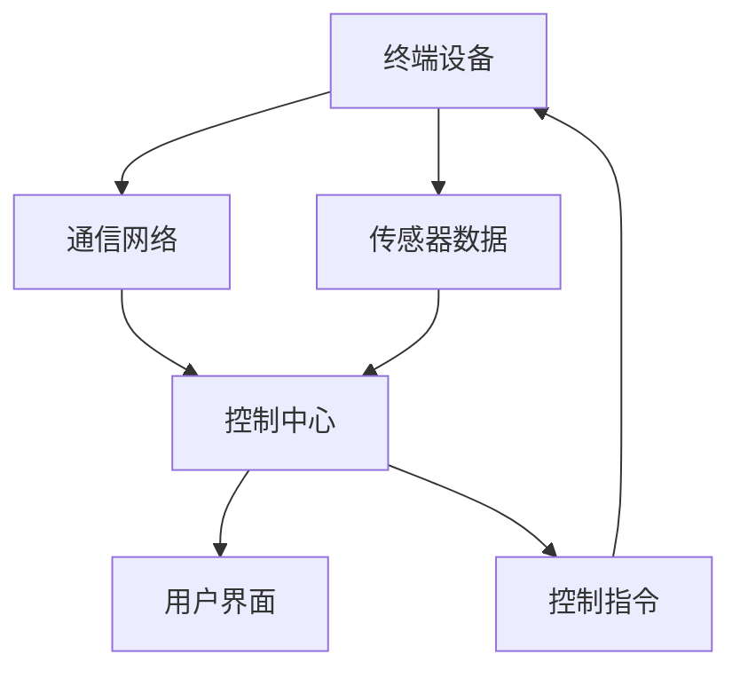

                 

关键词：智能家居，Java，无线通信，物联网，协议，安全性，自动化

> 摘要：本文将探讨基于Java的智能家居设计，重点介绍Java在无线智能家居通信技术中的应用。通过对智能家居系统的架构、核心概念、算法原理以及数学模型等方面进行深入分析，本文旨在为读者提供一份全面的技术指南，帮助他们更好地理解并应用Java在智能家居领域的重要性。

## 1. 背景介绍

随着物联网（IoT）技术的飞速发展，智能家居成为了一个备受关注和快速增长的领域。智能家居系统通过将各种家居设备互联，使得家庭生活更加便捷和智能化。而Java作为一种成熟、稳定的编程语言，在智能家居领域有着广泛的应用前景。本文将介绍如何利用Java来设计和实现无线智能家居通信技术，包括系统架构、协议选择、安全性设计以及具体实现等。

### 1.1 智能家居系统的组成

智能家居系统通常由以下几个部分组成：

1. **终端设备**：包括各种传感器、执行器、智能家电等，它们是智能家居系统的数据来源和执行者。
2. **通信网络**：用于连接终端设备和控制中心，通常采用无线通信技术，如Wi-Fi、Zigbee、蓝牙等。
3. **控制中心**：接收终端设备发送的数据，进行数据处理和指令发送，可以是一个独立的硬件设备，也可以是安装在智能手机或计算机上的应用程序。
4. **用户界面**：用于用户与智能家居系统交互，通常包括手机应用、Web界面等。

### 1.2 Java在智能家居中的优势

Java具有以下几个方面的优势，使其成为智能家居设计的理想选择：

1. **跨平台性**：Java可以运行在多种操作系统上，包括Windows、Linux和macOS，这使得智能家居系统能够更加灵活地部署。
2. **安全性**：Java提供了丰富的安全特性，如安全沙箱、加密算法等，可以保证系统数据的安全传输和存储。
3. **开发效率**：Java有大量的开发工具和库，可以大大提高开发效率和代码质量。
4. **社区支持**：Java有着庞大的开发者社区，可以方便地获取技术支持和资源。

## 2. 核心概念与联系

在智能家居设计中，我们需要理解以下几个核心概念：

1. **物联网协议**：物联网协议是连接各种设备和系统的桥梁，如MQTT、CoAP等。
2. **数据格式**：用于数据传输和存储的格式，如JSON、XML等。
3. **设备通信**：终端设备与控制中心之间的通信机制。
4. **用户交互**：用户与智能家居系统之间的交互方式。

下面是一个简化的智能家居系统架构的Mermaid流程图：



### 2.1 物联网协议

物联网协议是实现设备之间通信的基础。常用的物联网协议包括：

1. **MQTT**：一种轻量级的消息队列协议，适用于低带宽、不可靠的通信环境。
2. **CoAP**：一种面向资源的协议，适用于资源受限的设备。
3. **HTTP/REST**：基于Web的协议，适用于Web服务。

### 2.2 数据格式

数据格式是数据传输和存储的重要部分。常用的数据格式包括：

1. **JSON**：一种轻量级的数据交换格式，易于阅读和编写。
2. **XML**：一种用于数据存储和传输的标记语言，适用于复杂的数据结构。

### 2.3 设备通信

设备通信是指终端设备与控制中心之间的通信。常见的通信方式包括：

1. **轮询**：控制中心定期向终端设备发送请求，获取数据。
2. **发布/订阅**：终端设备发布数据到主题，控制中心订阅相应的主题，实时接收数据。

### 2.4 用户交互

用户交互是指用户与智能家居系统之间的交互。常见的交互方式包括：

1. **手机应用**：通过手机上的应用程序，用户可以远程控制家居设备。
2. **Web界面**：通过Web浏览器，用户可以在任何设备上访问智能家居系统。

## 3. 核心算法原理 & 具体操作步骤

### 3.1 算法原理概述

在智能家居设计中，核心算法通常用于以下几个方面：

1. **数据采集和处理**：对终端设备采集的数据进行处理，如滤波、去噪等。
2. **决策和控制**：根据处理后的数据，生成控制指令，发送给终端设备。
3. **异常检测和报警**：监控系统的运行状态，发现异常时发出报警。

### 3.2 算法步骤详解

以数据采集和处理为例，算法步骤如下：

1. **初始化**：设置采样率、滤波参数等。
2. **数据采集**：从传感器获取数据。
3. **数据滤波**：使用滤波算法，如低通滤波，去除噪声。
4. **数据处理**：对滤波后的数据进行处理，如特征提取、阈值判断等。
5. **决策生成**：根据处理结果，生成控制指令。
6. **指令发送**：将控制指令发送给终端设备。

### 3.3 算法优缺点

每种算法都有其优缺点，需要根据具体应用场景进行选择。例如：

1. **低通滤波**：能有效去除高频噪声，但可能会引入延迟。
2. **特征提取**：可以提高决策准确性，但可能增加计算量。

### 3.4 算法应用领域

核心算法可以应用于各种智能家居场景，如：

1. **环境监测**：监测空气质量、温度、湿度等。
2. **安全监控**：监控家庭安全，如入侵报警。
3. **智能控制**：自动调节家居设备，如空调、灯光等。

## 4. 数学模型和公式 & 详细讲解 & 举例说明

### 4.1 数学模型构建

在智能家居设计中，常用的数学模型包括：

1. **传感器模型**：描述传感器的工作原理和特性。
2. **控制模型**：描述系统如何根据传感器数据生成控制指令。
3. **优化模型**：描述系统如何优化资源使用，提高效率。

### 4.2 公式推导过程

以控制模型为例，假设有一个控制系统，其输入为传感器数据 $x(t)$，输出为控制指令 $u(t)$。控制模型可以用以下公式表示：

$$
u(t) = f(x(t))
$$

其中，$f(x(t))$ 是一个函数，描述了如何根据 $x(t)$ 生成 $u(t)$。

### 4.3 案例分析与讲解

以智能家居中的灯光控制为例，假设我们需要根据环境亮度自动调节灯光的亮度。环境亮度由传感器测量，控制指令是灯光的亮度设置。

1. **传感器模型**：环境亮度 $L(t)$ 与传感器输出 $x(t)$ 之间的关系可以表示为：

$$
L(t) = k_1 \cdot x(t) + k_2
$$

其中，$k_1$ 和 $k_2$ 是常数。

2. **控制模型**：灯光亮度 $u(t)$ 与环境亮度 $L(t)$ 之间的关系可以表示为：

$$
u(t) = \frac{L(t)}{L_{\text{max}}}
$$

其中，$L_{\text{max}}$ 是灯光的最大亮度。

3. **优化模型**：为了节省能源，我们希望灯光亮度在满足需求的同时尽量低。因此，我们可以定义一个优化目标函数：

$$
\min \sum_{t} (u(t) - L(t))^2
$$

通过优化算法，如梯度下降法，我们可以找到最优的灯光亮度设置。

## 5. 项目实践：代码实例和详细解释说明

### 5.1 开发环境搭建

在开始项目实践之前，我们需要搭建开发环境。以下是基本的开发环境搭建步骤：

1. **安装Java开发工具包（JDK）**：从Oracle官方网站下载JDK，并按照提示进行安装。
2. **安装集成开发环境（IDE）**：推荐使用Eclipse或IntelliJ IDEA作为开发环境。
3. **安装相关库和依赖**：使用Maven或Gradle来管理项目依赖，安装所需的库，如Java MQTT客户端库。

### 5.2 源代码详细实现

以下是一个简单的智能家居项目示例，展示了如何使用Java实现一个基于MQTT协议的灯光控制系统。

```java
import org.eclipse.paho.client.mqttv3.MqttClient;
import org.eclipse.paho.client.mqttv3.MqttConnectOptions;
import org.eclipse.paho.client.mqttv3.MqttException;
import org.eclipse.paho.client.mqttv3.MqttMessage;

public class LightControlSystem {

    private MqttClient client;
    private String brokerUrl = "tcp://localhost:1883";
    private String topic = "home/room1/light";

    public LightControlSystem() {
        try {
            client = new MqttClient(brokerUrl, "LightControl");
        } catch (MqttException e) {
            e.printStackTrace();
        }
    }

    public void connect() {
        MqttConnectOptions options = new MqttConnectOptions();
        options.setAutomaticReconnect(true);
        options.setKeepAliveInterval(60);

        try {
            client.connect(options);
        } catch (MqttException e) {
            e.printStackTrace();
        }
    }

    public void setLightBrightness(int brightness) {
        MqttMessage message = new MqttMessage();
        message.setPayload(String.valueOf(brightness).getBytes());
        try {
            client.publish(topic, message);
        } catch (MqttException e) {
            e.printStackTrace();
        }
    }

    public static void main(String[] args) {
        LightControlSystem system = new LightControlSystem();
        system.connect();

        // 设置灯光亮度为50%
        system.setLightBrightness(50);
    }
}
```

### 5.3 代码解读与分析

1. **MqttClient**：创建MQTT客户端实例。
2. **connect()**：连接到MQTT代理服务器。
3. **setLightBrightness()**：发布灯光亮度设置到MQTT主题。

### 5.4 运行结果展示

通过运行上述代码，我们可以将灯光亮度设置为50%。具体结果取决于实际的环境亮度和传感器数据。

## 6. 实际应用场景

### 6.1 环境监测

智能家居系统可以实时监测家庭环境，如温度、湿度、空气质量等。根据监测结果，系统可以自动调节家居设备，如空调、加湿器、空气净化器等，以保持室内环境舒适。

### 6.2 安全监控

智能家居系统可以集成摄像头、门磁传感器等设备，实时监控家庭安全。一旦发现异常，系统可以立即发出警报，并通过手机应用程序通知用户。

### 6.3 智能控制

智能家居系统可以自动控制家居设备，如灯光、窗帘、电视等。用户可以通过手机应用程序或语音助手远程控制家居设备，实现智能化的家庭生活。

## 7. 未来应用展望

随着技术的不断进步，智能家居系统将更加智能化、自动化。以下是一些未来应用展望：

### 7.1 人工智能

人工智能技术可以进一步提升智能家居系统的智能化水平。通过学习用户行为和偏好，系统可以提供更加个性化的服务。

### 7.2 5G通信

5G通信技术的普及将使得智能家居系统的数据传输速度和稳定性得到大幅提升，为智能家居系统的广泛应用提供基础。

### 7.3 增强现实（AR）

增强现实技术可以使得智能家居系统更加直观、易于操作。通过AR眼镜，用户可以直观地看到家居设备的运行状态和操作指南。

## 8. 工具和资源推荐

### 8.1 学习资源推荐

1. **《Java核心技术》**：一本全面的Java编程入门书籍。
2. **《MQTT协议详解》**：一本关于MQTT协议的详细教程。

### 8.2 开发工具推荐

1. **Eclipse**：一款功能强大的集成开发环境（IDE）。
2. **IntelliJ IDEA**：一款性能卓越的Java开发工具。

### 8.3 相关论文推荐

1. **"An Overview of IoT Protocols"**：一篇关于物联网协议的综述。
2. **"Smart Home Security: Challenges and Opportunities"**：一篇关于智能家居安全的研究论文。

## 9. 总结：未来发展趋势与挑战

随着物联网技术的不断发展，智能家居系统将变得更加智能化、自动化。然而，也面临着一些挑战，如数据安全、隐私保护、系统稳定性等。未来的智能家居设计需要充分考虑这些问题，并采取相应的技术措施。

## 10. 附录：常见问题与解答

### 10.1 如何选择物联网协议？

选择物联网协议时，需要考虑以下因素：

1. **通信环境**：如果环境不稳定，选择MQTT等轻量级协议。
2. **数据量**：如果数据量较大，选择CoAP等面向资源的协议。
3. **兼容性**：选择广泛支持且兼容性好的协议，如MQTT。

### 10.2 如何保证智能家居系统的安全性？

为了保证智能家居系统的安全性，可以采取以下措施：

1. **加密通信**：使用加密算法确保数据在传输过程中的安全。
2. **身份验证**：对设备进行身份验证，防止未经授权的访问。
3. **访问控制**：设置访问权限，限制对敏感数据的访问。

### 10.3 如何优化智能家居系统的性能？

优化智能家居系统的性能可以从以下几个方面入手：

1. **减少通信频率**：避免不必要的通信，减少系统负载。
2. **优化算法**：选择高效的控制算法，提高系统响应速度。
3. **硬件升级**：升级硬件设备，提高系统的处理能力。

---

作者：禅与计算机程序设计艺术 / Zen and the Art of Computer Programming

