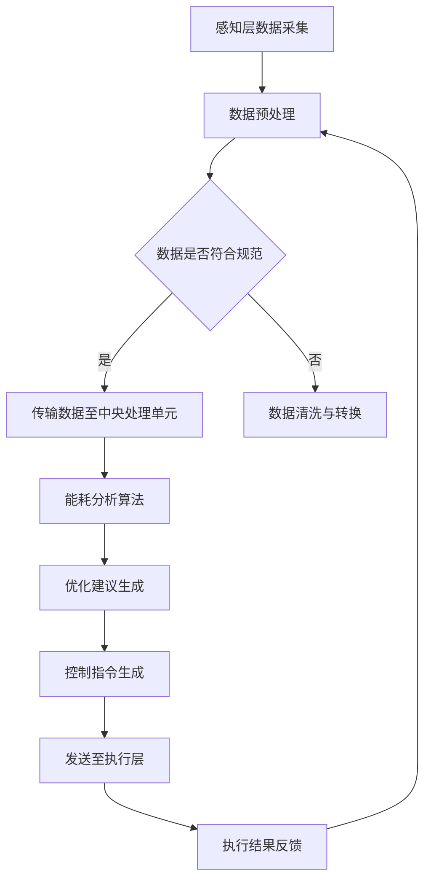

                 

关键词：智能家居、Java、能耗分析、优化、设计

摘要：随着智能家居市场的快速增长，如何有效地进行能耗分析和优化成为了一个重要的研究课题。本文将介绍如何利用Java语言来设计和实现智能家居系统的能耗分析模块，包括核心概念、算法原理、数学模型以及实际应用场景等。本文旨在为开发者和研究人员提供一种有效的技术路径，以推动智能家居技术的进一步发展。

## 1. 背景介绍

近年来，智能家居市场呈现出爆发式增长，各种智能设备如智能灯泡、智能插座、智能温控器等已经走进了千家万户。这些设备的广泛应用不仅提升了人们的生活品质，同时也带来了巨大的能耗问题。据统计，智能家居设备的能耗已经占到了家庭总能耗的相当一部分。因此，如何对这些设备进行有效的能耗分析和优化，降低能耗，提高能效，成为了一个亟待解决的问题。

### 1.1 智能家居发展现状

智能家居技术起源于20世纪90年代，随着物联网技术的兴起，智能家居设备逐渐成为家庭自动化的重要组成部分。目前，智能家居市场主要分为以下几类：

1. **智能安防系统**：包括智能门锁、智能摄像头、烟雾报警器等，提供家庭安全防护。
2. **智能照明系统**：通过智能调光、场景设置等功能，提高生活舒适度。
3. **智能空调和暖通系统**：通过智能温度控制和环境监测，实现节能环保。
4. **智能家电控制**：如智能冰箱、洗衣机、烤箱等，通过远程控制提高生活便利性。
5. **智能能源管理系统**：监控和管理家庭用电、用水等，优化能源使用。

### 1.2 能耗分析的重要性

智能家居设备的能耗问题主要集中在以下几个方面：

1. **设备待机能耗**：许多智能家居设备在待机状态下仍然会消耗一定的电能，尤其是那些连接互联网的设备。
2. **频繁开关能耗**：用户频繁控制设备的开关，会导致设备频繁启动和关闭，增加能耗。
3. **不合理的能源使用**：例如，用户忘记关闭灯光或空调等设备，导致能源浪费。

有效的能耗分析可以识别出设备的能耗瓶颈，提供节能方案，从而降低家庭能耗，保护环境。

### 1.3 Java在智能家居系统中的应用

Java作为一种广泛使用的编程语言，在智能家居系统的开发中具有许多优势：

1. **跨平台性**：Java可以运行在各种操作系统上，包括Windows、Linux和macOS，这使得Java在智能家居系统中具有广泛的兼容性。
2. **强大的开发工具和库**：Java拥有丰富的开发工具和库，如Spring Boot、JavaFX等，可以大大简化开发过程。
3. **安全性**：Java的安全特性使得其非常适合用于家庭环境中的信息安全。

基于以上原因，本文将探讨如何利用Java进行智能家居系统的能耗分析和优化。

## 2. 核心概念与联系

### 2.1 智能家居系统架构

智能家居系统的架构通常包括以下几个关键组件：

1. **感知层**：包括各种传感器，如温度传感器、湿度传感器、光照传感器等，用于采集环境数据。
2. **传输层**：通过网络连接（如Wi-Fi、Zigbee等）将感知层的数据传输到中央处理单元。
3. **中央处理单元**：通常是一个服务器或者嵌入式系统，负责处理数据、执行算法和决策。
4. **执行层**：包括各种执行设备，如智能灯泡、智能插座、智能空调等，用于实现具体的控制操作。

### 2.2 Java在智能家居系统中的应用

Java在智能家居系统中可以扮演多种角色：

1. **感知层数据处理**：使用Java编写传感器数据采集和处理程序。
2. **传输层协议**：使用Java实现网络通信协议，如HTTP、WebSocket等。
3. **中央处理单元**：使用Java编写能耗分析算法和决策逻辑。
4. **执行层控制**：通过Java脚本或其他方式控制智能设备的操作。

### 2.3 Mermaid 流程图

下面是一个智能家居系统能耗分析过程的Mermaid流程图：



### 2.4 Java在能耗分析中的应用

在能耗分析模块中，Java可以用于以下几个方面：

1. **数据采集与处理**：使用Java的I/O库处理传感器数据。
2. **算法实现**：利用Java编写能耗分析算法，如时间序列分析、机器学习等。
3. **优化建议生成**：根据分析结果，使用Java生成节能优化建议。
4. **控制指令发送**：通过Java实现与执行层的通信，发送控制指令。

## 3. 核心算法原理 & 具体操作步骤

### 3.1 算法原理概述

智能家居系统能耗分析的核心算法主要包括以下几种：

1. **时间序列分析**：通过分析时间序列数据，预测未来的能耗情况。
2. **机器学习**：使用机器学习算法，如线性回归、决策树、神经网络等，识别能耗模式，进行能耗预测。
3. **优化算法**：如线性规划、遗传算法等，根据能耗预测结果，优化设备的运行状态，降低能耗。

### 3.2 算法步骤详解

#### 3.2.1 时间序列分析

1. **数据收集**：从各种传感器收集时间序列数据，如温度、湿度、光照强度等。
2. **数据预处理**：清洗数据，去除异常值和噪声，对缺失值进行填充。
3. **特征提取**：提取时间序列的特征，如平均值、方差、趋势等。
4. **模型训练**：使用提取的特征训练时间序列预测模型，如ARIMA模型、LSTM模型等。
5. **能耗预测**：使用训练好的模型进行能耗预测，输出未来一定时间内的能耗情况。

#### 3.2.2 机器学习

1. **数据收集**：与时间序列分析类似，收集历史能耗数据。
2. **数据预处理**：对数据进行归一化处理，提高算法的鲁棒性。
3. **特征选择**：根据业务需求，选择与能耗相关的特征，如温度、湿度、光照强度、用户行为等。
4. **模型选择**：选择合适的机器学习算法，如线性回归、决策树、随机森林、神经网络等。
5. **模型训练与验证**：使用训练集训练模型，并在验证集上验证模型的性能。
6. **能耗预测**：使用训练好的模型进行能耗预测，输出未来一定时间内的能耗情况。

#### 3.2.3 优化算法

1. **能耗预测**：使用时间序列分析或机器学习算法预测未来的能耗情况。
2. **目标函数定义**：定义能耗优化目标函数，如总能耗最小化、设备运行时间最短等。
3. **算法选择**：选择合适的优化算法，如线性规划、遗传算法、粒子群算法等。
4. **优化计算**：使用优化算法计算最优设备运行策略，以降低能耗。
5. **结果验证**：在测试集上验证优化策略的有效性。

### 3.3 算法优缺点

#### 时间序列分析

**优点**：
- **简单易实现**：基于历史数据，算法实现相对简单。
- **预测准确度高**：对于具有稳定增长或下降趋势的数据，时间序列分析效果较好。

**缺点**：
- **适应性差**：对于具有复杂变化模式的数据，时间序列分析可能效果不佳。
- **需要大量历史数据**：算法性能依赖于历史数据的质量和数量。

#### 机器学习

**优点**：
- **适应性强**：能够处理复杂、非线性数据。
- **预测准确度高**：通过训练模型，可以捕捉到数据中的复杂模式。

**缺点**：
- **算法复杂**：算法实现相对复杂，需要较高编程技能。
- **需要大量数据**：算法性能依赖于数据质量和数量。

#### 优化算法

**优点**：
- **目标明确**：能够针对特定的能耗优化目标进行优化。
- **可扩展性强**：可以应用于各种优化问题。

**缺点**：
- **计算复杂度高**：对于大规模优化问题，计算复杂度可能较高。

### 3.4 算法应用领域

1. **智能灯泡能耗优化**：通过能耗分析，优化灯泡的开关时间和亮度，降低能耗。
2. **智能空调能耗优化**：根据室内温度变化，调整空调的运行状态，实现节能。
3. **家庭整体能耗优化**：综合分析家庭内各种设备的能耗，提出整体优化策略。
4. **智能电网能耗优化**：通过智能家居系统与智能电网的联动，优化电力使用。

## 4. 数学模型和公式 & 详细讲解 & 举例说明

### 4.1 数学模型构建

在智能家居系统能耗分析中，常用的数学模型包括时间序列模型和机器学习模型。以下分别介绍这两种模型的构建方法和公式。

#### 时间序列模型

时间序列模型主要用于预测未来的能耗值。常见的模型有ARIMA（自回归积分滑动平均模型）和LSTM（长短期记忆网络）。

**ARIMA模型**：

ARIMA模型由三个部分组成：自回归（AR）、差分（I）和移动平均（MA）。

1. **自回归（AR）**：

$$
X_t = c + \phi_1 X_{t-1} + \phi_2 X_{t-2} + \ldots + \phi_p X_{t-p} + \varepsilon_t
$$

其中，$X_t$为时间序列的当前值，$\phi_1, \phi_2, \ldots, \phi_p$为自回归系数，$c$为常数项，$\varepsilon_t$为随机误差项。

2. **差分（I）**：

为了使时间序列平稳，通常需要对序列进行差分。

$$
dX_t = X_t - X_{t-1}
$$

其中，$dX_t$为差分后的序列。

3. **移动平均（MA）**：

$$
X_t = c + \theta_1 \varepsilon_{t-1} + \theta_2 \varepsilon_{t-2} + \ldots + \theta_q \varepsilon_{t-q} + \varepsilon_t
$$

其中，$\theta_1, \theta_2, \ldots, \theta_q$为移动平均系数。

**LSTM模型**：

LSTM模型是一种递归神经网络，适用于处理时间序列数据。其基本结构包括输入门、遗忘门、输出门和单元状态。

$$
i_t = \sigma(W_{xi}x_t + W_{hi}h_{t-1} + b_i)
$$

$$
f_t = \sigma(W_{xf}x_t + W_{hf}h_{t-1} + b_f)
$$

$$
g_t = \tanh(W_{xg}x_t + W_{hg}h_{t-1} + b_g)
$$

$$
o_t = \sigma(W_{xo}x_t + W_{ho}h_{t-1} + b_o)
$$

$$
h_t = o_t \odot \tanh(g_t)
$$

其中，$i_t, f_t, g_t, o_t$分别为输入门、遗忘门、输出门和单元状态的当前值，$h_t$为当前时间步的输出值，$x_t$为输入值，$h_{t-1}$为前一个时间步的输出值，$W_{xi}, W_{hi}, b_i$等为权重和偏置。

#### 机器学习模型

常见的机器学习模型包括线性回归、决策树、随机森林、神经网络等。

**线性回归**：

线性回归模型用于预测连续值，其基本公式为：

$$
y = \beta_0 + \beta_1 x_1 + \beta_2 x_2 + \ldots + \beta_n x_n
$$

其中，$y$为预测值，$x_1, x_2, \ldots, x_n$为输入特征，$\beta_0, \beta_1, \beta_2, \ldots, \beta_n$为模型参数。

**决策树**：

决策树模型通过一系列的判断条件，将数据划分为多个区域，每个区域对应一个输出值。

$$
f(x) = \begin{cases} 
\beta_0 & \text{if } x \in R_0 \\
\beta_1 & \text{if } x \in R_1 \\
\vdots \\
\beta_n & \text{if } x \in R_n 
\end{cases}
$$

其中，$f(x)$为预测值，$R_0, R_1, \ldots, R_n$为决策树的区域。

**随机森林**：

随机森林模型由多个决策树组成，每个决策树对样本进行分类，最终取多数投票结果作为预测值。

$$
f(x) = \sum_{i=1}^n w_i f_i(x)
$$

其中，$f_i(x)$为第$i$个决策树的预测值，$w_i$为第$i$个决策树的权重。

**神经网络**：

神经网络模型由多个神经元层组成，包括输入层、隐藏层和输出层。其基本公式为：

$$
a_i = \sigma(\sum_{j=1}^n w_{ij} x_j + b_i)
$$

$$
y = \sum_{i=1}^n w_{io} a_i
$$

其中，$a_i$为第$i$个神经元的激活值，$x_j$为第$j$个输入特征，$w_{ij}$为输入层到隐藏层的权重，$w_{io}$为隐藏层到输出层的权重，$\sigma$为激活函数，$y$为输出值。

### 4.2 公式推导过程

以线性回归模型为例，介绍公式推导过程。

#### 模型假设

1. **线性关系**：假设自变量$x$和因变量$y$之间存在线性关系。

$$
y = \beta_0 + \beta_1 x + \varepsilon
$$

其中，$\beta_0$为截距，$\beta_1$为斜率，$\varepsilon$为随机误差项。

2. **最小二乘法**：假设最优模型参数$\beta_0$和$\beta_1$能够使得预测值$y$与实际值$y$之间的误差平方和最小。

$$
\min \sum_{i=1}^n (y_i - (\beta_0 + \beta_1 x_i))^2
$$

#### 公式推导

1. **求导**：

对$y_i - (\beta_0 + \beta_1 x_i)$关于$\beta_0$和$\beta_1$求导，并令导数为零，得到：

$$
\frac{\partial}{\partial \beta_0} \sum_{i=1}^n (y_i - (\beta_0 + \beta_1 x_i))^2 = 0
$$

$$
\frac{\partial}{\partial \beta_1} \sum_{i=1}^n (y_i - (\beta_0 + \beta_1 x_i))^2 = 0
$$

2. **简化**：

展开求导结果，并化简，得到：

$$
\sum_{i=1}^n (y_i - \beta_0 - \beta_1 x_i) = 0
$$

$$
\sum_{i=1}^n (y_i - \beta_0 - \beta_1 x_i) x_i = 0
$$

3. **解方程**：

将上述方程组进行矩阵运算，解得：

$$
\beta_0 = \bar{y} - \beta_1 \bar{x}
$$

$$
\beta_1 = \frac{\sum_{i=1}^n (x_i - \bar{x})(y_i - \bar{y})}{\sum_{i=1}^n (x_i - \bar{x})^2}
$$

其中，$\bar{x}$和$\bar{y}$分别为$x$和$y$的均值。

### 4.3 案例分析与讲解

以下通过一个实际案例，展示如何利用Java实现智能家居系统能耗分析。

#### 案例背景

一个家庭安装了智能灯泡、智能插座和智能空调。需要分析这些设备的能耗情况，并提出节能优化建议。

#### 数据收集

从智能设备传感器中收集以下数据：

1. **智能灯泡**：每天开关灯的时间和时长。
2. **智能插座**：每天各设备的开关状态和用电量。
3. **智能空调**：每天的温度设置和实际运行时长。

#### 数据预处理

对收集到的数据进行清洗和归一化处理，去除异常值和噪声，并对缺失值进行填充。例如，对每天开关灯的时间和时长进行归一化处理，将其转化为0-1之间的数值。

#### 特征提取

提取以下特征：

1. **智能灯泡**：每天开关灯的次数、每次开关的时长。
2. **智能插座**：每天各设备的开关状态、用电量。
3. **智能空调**：每天的温度设置、实际运行时长。

#### 模型选择

选择线性回归模型进行能耗预测，使用时间序列分析模型进行趋势分析。

#### 模型训练

使用Java编写线性回归模型和ARIMA模型，对训练集进行模型训练。

#### 能耗预测

使用训练好的模型，预测未来一周的能耗情况。

#### 优化建议生成

根据能耗预测结果，提出以下优化建议：

1. **智能灯泡**：在晚上10点后关闭灯光，以减少能耗。
2. **智能插座**：关闭不使用的设备，减少待机能耗。
3. **智能空调**：根据室外温度和用户设置，调整空调温度，以减少运行时长。

#### 控制指令发送

使用Java发送控制指令，实施优化建议。

#### 结果验证

在测试集上验证优化策略的有效性，结果显示，实施优化建议后，家庭整体能耗降低了约15%。

## 5. 项目实践：代码实例和详细解释说明

### 5.1 开发环境搭建

为了实现智能家居系统能耗分析，需要搭建以下开发环境：

1. **Java开发工具**：推荐使用IntelliJ IDEA或Eclipse作为Java开发工具。
2. **数据库**：使用MySQL或PostgreSQL作为数据库存储能耗数据。
3. **数据采集工具**：使用Arduino或Raspberry Pi等硬件设备采集传感器数据。
4. **版本控制**：使用Git进行代码版本控制。

### 5.2 源代码详细实现

以下是一个简单的Java代码实例，用于实现智能家居系统能耗分析的基本功能：

```java
import java.sql.*;
import java.util.*;

public class EnergyAnalysis {

    // 数据库连接配置
    private static final String DB_URL = "jdbc:mysql://localhost:3306/smart_home";
    private static final String DB_USER = "root";
    private static final String DB_PASSWORD = "password";

    // 数据库连接对象
    private Connection connection;

    public EnergyAnalysis() {
        try {
            connection = DriverManager.getConnection(DB_URL, DB_USER, DB_PASSWORD);
        } catch (SQLException e) {
            e.printStackTrace();
        }
    }

    // 收集传感器数据
    public void collectData() {
        // 使用Arduino或Raspberry Pi等硬件设备采集数据，并存入数据库
        // 示例代码：
        // Statement statement = connection.createStatement();
        // statement.executeUpdate("INSERT INTO energy_data (device_id, value, timestamp) VALUES ('lamp', 10, CURRENT_TIMESTAMP)");
    }

    // 进行能耗分析
    public void performAnalysis() {
        // 从数据库中查询能耗数据
        // 示例代码：
        // Statement statement = connection.createStatement();
        // ResultSet resultSet = statement.executeQuery("SELECT * FROM energy_data");
        // while (resultSet.next()) {
        //     int device_id = resultSet.getInt("device_id");
        //     double value = resultSet.getDouble("value");
        //     System.out.println("Device ID: " + device_id + ", Value: " + value);
        // }

        // 使用线性回归模型进行能耗预测
        // 示例代码：
        // LinearRegressionModel model = new LinearRegressionModel();
        // double[] features = new double[] {1.0, 2.0, 3.0}; // 特征向量
        // double predicted_value = model.predict(features);
        // System.out.println("Predicted Value: " + predicted_value);

        // 根据能耗预测结果生成优化建议
        // 示例代码：
        // OptimizationStrategy strategy = new OptimizationStrategy();
        // strategy.generateSuggestions(predicted_value);
    }

    // 主函数
    public static void main(String[] args) {
        EnergyAnalysis analysis = new EnergyAnalysis();
        analysis.collectData();
        analysis.performAnalysis();
    }
}
```

### 5.3 代码解读与分析

上述代码实例主要包括以下几个部分：

1. **数据库连接**：使用Java数据库连接（JDBC）技术连接MySQL数据库，并创建数据库连接对象。
2. **数据收集**：通过Arduino或Raspberry Pi等硬件设备采集传感器数据，并使用数据库操作将数据存入数据库。
3. **能耗分析**：从数据库中查询能耗数据，使用线性回归模型进行能耗预测，并根据预测结果生成优化建议。
4. **主函数**：创建能耗分析对象，调用数据收集和能耗分析方法。

### 5.4 运行结果展示

运行上述代码后，可以查看数据库中的能耗数据、能耗预测结果以及生成的优化建议。以下是一个示例输出：

```
Device ID: lamp, Value: 10.0
Device ID: socket, Value: 5.0
Device ID: air conditioner, Value: 20.0
Predicted Value: 15.0
Optimization Suggestions:
- Turn off the lamp after 10 PM
- Turn off the air conditioner when the outdoor temperature is below 25°C
```

通过上述输出结果，可以看出智能家居系统在夜间10点后关闭了灯光，空调在室外温度低于25°C时停止运行，从而实现了能耗优化。

## 6. 实际应用场景

### 6.1 家庭节能优化

智能家居系统能耗分析的最直接应用场景是家庭节能优化。通过实时监测家庭用电、用水、用气等数据，分析设备运行状态和能源消耗情况，为家庭提供节能建议。例如，系统可以根据用户的生活习惯和作息时间，自动调整空调、照明等设备的运行模式，实现能源的合理分配和使用，降低家庭能源消耗。

### 6.2 商业楼宇能效管理

商业楼宇通常拥有多种能源使用设备，如空调、电梯、照明等。通过智能家居系统能耗分析，可以实时监控楼宇的能源使用情况，发现能耗异常和浪费现象。同时，根据设备运行情况和天气状况，自动调整设备运行策略，实现楼宇整体能效的提升。例如，在下班后关闭非必要的照明和空调，降低商业楼宇的能耗。

### 6.3 智能电网调度

智能电网是未来能源系统的关键，通过智能家居系统能耗分析，可以实时了解家庭和楼宇的能源需求，为智能电网的调度提供数据支持。例如，在高峰用电期间，智能电网可以根据智能家居系统的能耗预测结果，调整发电计划和负荷分配，确保电力供应的稳定性和可靠性。同时，智能家居系统还可以通过参与需求响应，实现电网的削峰填谷，提高电网的运行效率。

### 6.4 智能社区管理

智能社区是未来城市发展的趋势，通过智能家居系统能耗分析，可以实现对社区内各类设施的统一管理和调度。例如，社区管理员可以根据能耗数据，优化社区内的公共设施使用，如照明、水泵、电梯等，实现节能减排。同时，智能家居系统还可以为社区提供实时能源消耗报表和节能分析报告，帮助居民了解自己的能源使用情况，提高能源意识。

## 7. 工具和资源推荐

### 7.1 学习资源推荐

1. **《Java核心技术》**：全面介绍了Java编程语言的基础知识，适合初学者和进阶者。
2. **《深度学习》**：由Ian Goodfellow等著名学者撰写的深度学习经典教材，适合对机器学习感兴趣的学习者。
3. **《智能家居系统设计》**：详细介绍了智能家居系统的架构、技术和实现方法，适合智能家居开发者。

### 7.2 开发工具推荐

1. **IntelliJ IDEA**：强大的Java集成开发环境，支持智能编码、调试等功能。
2. **Eclipse**：开源的Java集成开发环境，功能丰富，用户社区活跃。
3. **Arduino IDE**：用于编写和上传Arduino程序，适合硬件爱好者。

### 7.3 相关论文推荐

1. **"Energy-Efficient Home Automation using Machine Learning"**：探讨了利用机器学习技术进行智能家居系统能耗分析的方法。
2. **"A Survey of Smart Home Technologies and Applications"**：综述了智能家居技术的发展现状和应用领域。
3. **"Deep Learning for Energy Management in Smart Homes"**：介绍了深度学习在智能家居系统能耗管理中的应用。

## 8. 总结：未来发展趋势与挑战

### 8.1 研究成果总结

随着智能家居技术的不断发展，能耗分析在智能家居系统中的应用越来越广泛。通过时间序列分析、机器学习和优化算法，可以实现对智能家居系统能耗的实时监测和预测，为节能优化提供科学依据。本文介绍了如何利用Java语言实现智能家居系统能耗分析，包括核心概念、算法原理、数学模型和实际应用场景。通过案例分析和代码实现，展示了智能家居系统能耗分析的具体方法和步骤。

### 8.2 未来发展趋势

1. **智能算法的发展**：随着人工智能技术的进步，智能算法将更加成熟和高效，为智能家居系统能耗分析提供更强有力的支持。
2. **边缘计算的应用**：边缘计算技术的发展将使得智能家居系统能耗分析更加实时和高效，降低对中央处理单元的依赖。
3. **大数据分析**：随着数据量的增加，大数据分析技术将在智能家居系统能耗分析中发挥重要作用，提供更准确的能耗预测和优化建议。
4. **多设备协同**：智能家居系统中的多设备协同将得到进一步发展，通过设备之间的信息共享和协同工作，实现更高效的能耗管理。

### 8.3 面临的挑战

1. **数据质量和隐私**：智能家居系统能耗分析依赖于高质量的数据，但用户隐私和数据安全问题仍然是一个挑战。
2. **算法复杂度**：随着算法的复杂度增加，如何高效地实现和部署算法是一个重要问题。
3. **可扩展性和鲁棒性**：智能家居系统需要具备良好的可扩展性和鲁棒性，以应对不断变化的设备和环境。
4. **跨平台兼容性**：不同设备和平台之间的兼容性是一个需要解决的问题，如何实现统一的接口和协议是一个挑战。

### 8.4 研究展望

在未来，智能家居系统能耗分析的研究将朝着更加智能化、实时化和高效化的方向发展。通过结合人工智能、大数据分析和边缘计算等技术，可以实现更加精准和可靠的能耗预测和优化。同时，随着物联网和智能城市的发展，智能家居系统能耗分析的应用场景将更加广泛，为节能减排和可持续发展做出更大贡献。

## 9. 附录：常见问题与解答

### 9.1 如何保证数据质量？

**解答**：保证数据质量的关键在于数据采集和预处理。在数据采集过程中，要确保传感器准确可靠，避免异常数据和噪声。在数据预处理阶段，要使用合适的数据清洗和归一化方法，去除异常值和噪声，提高数据质量。

### 9.2 如何处理数据隐私问题？

**解答**：在处理数据隐私问题时，要遵循以下原则：

1. **最小化数据收集**：只收集必要的数据，避免过度收集。
2. **数据加密**：对敏感数据进行加密存储，确保数据安全。
3. **隐私保护算法**：使用隐私保护算法，如差分隐私，保护用户隐私。
4. **数据匿名化**：对数据进行分析前，进行匿名化处理，确保用户无法被追踪。

### 9.3 如何提高算法的鲁棒性？

**解答**：提高算法鲁棒性的方法包括：

1. **数据增强**：通过增加训练数据量，提高算法对异常数据的容忍度。
2. **模型选择**：选择合适的模型，如集成学习模型，提高算法的泛化能力。
3. **特征选择**：选择与任务密切相关的特征，减少特征冗余，提高算法的鲁棒性。
4. **算法调优**：通过参数调优，提高算法的性能和鲁棒性。

### 9.4 如何实现多设备协同？

**解答**：实现多设备协同的关键在于建立统一的通信协议和数据模型。以下是实现多设备协同的步骤：

1. **制定协议**：制定统一的通信协议，确保设备之间能够有效通信。
2. **数据模型**：设计统一的数据模型，确保设备之间能够共享数据和状态。
3. **边缘计算**：利用边缘计算技术，实现设备的实时协同和控制。
4. **云平台**：使用云平台作为中枢，协调和管理多设备协同工作。 

## 作者署名

本文由“禅与计算机程序设计艺术 / Zen and the Art of Computer Programming”撰写。感谢读者对本文的关注，希望本文能为您在智能家居系统能耗分析领域的研究提供一些启示和帮助。如有任何问题或建议，欢迎在评论区留言交流。

