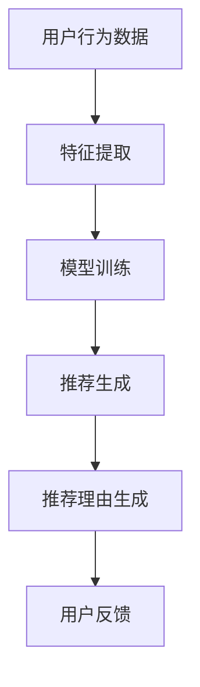

                 

关键词：自然语言生成、推荐系统、人工智能、大型语言模型、语义理解、文本生成、用户偏好、个性化推荐

> 摘要：本文将探讨基于大型语言模型（LLM）的推荐理由生成技术，分析其在推荐系统中的应用及其重要性。通过介绍LLM的基本原理和推荐理由生成的具体方法，本文旨在为开发者和研究者提供关于如何有效利用LLM进行推荐理由生成的实践指导和理论支持。

## 1. 背景介绍

随着互联网的普及和大数据技术的进步，推荐系统已经成为各类信息平台的重要组成部分。推荐系统能够根据用户的行为和偏好，为用户推荐他们可能感兴趣的商品、新闻、音乐等。推荐理由生成作为推荐系统的一个关键环节，旨在为用户解释推荐结果的原因，提高用户对推荐结果的接受度和信任度。

传统的推荐理由生成方法主要包括基于规则的推理和基于文本的生成。然而，这些方法存在一定的局限性，例如规则难以覆盖所有情况、文本生成质量参差不齐等。近年来，随着自然语言处理（NLP）和深度学习技术的快速发展，基于大型语言模型（LLM）的推荐理由生成技术逐渐成为研究热点。

## 2. 核心概念与联系

### 2.1 大型语言模型（LLM）

大型语言模型（LLM）是一种基于深度学习的自然语言处理模型，能够理解和生成自然语言。LLM通过大规模的数据预训练，掌握了丰富的语言知识和语义理解能力。其中，最著名的LLM是GPT（Generative Pre-trained Transformer）系列，如GPT-3和GPT-Neo。

### 2.2 推荐系统

推荐系统是一种信息过滤技术，通过分析用户的历史行为和偏好，为用户推荐他们可能感兴趣的项目。推荐系统的基本架构包括数据收集、特征提取、模型训练、推荐生成和结果评估等环节。

### 2.3 推荐理由生成

推荐理由生成是指为推荐结果提供解释的过程。一个优秀的推荐理由应该简洁明了、有说服力，并能够揭示推荐结果背后的原因。

### 2.4 Mermaid 流程图

以下是一个关于推荐理由生成流程的Mermaid流程图：



## 3. 核心算法原理 & 具体操作步骤

### 3.1 算法原理概述

基于LLM的推荐理由生成算法主要分为三个步骤：

1. **特征提取**：将用户行为数据和物品属性转化为适合LLM处理的特征向量。
2. **模型训练**：使用预训练的LLM模型对特征向量进行训练，使其能够生成与推荐结果相关的理由。
3. **推荐理由生成**：将训练好的LLM模型应用于推荐生成的结果，生成推荐理由。

### 3.2 算法步骤详解

1. **数据预处理**

   数据预处理主要包括数据清洗、数据整合和特征工程。具体操作如下：

   - 数据清洗：去除噪声数据、缺失值填充、数据去重等。
   - 数据整合：将不同来源的数据进行整合，形成统一的用户-物品行为矩阵。
   - 特征工程：提取用户历史行为特征、物品属性特征等。

2. **特征提取**

   特征提取是将原始数据转化为适合LLM处理的特征向量的过程。常用的特征提取方法包括词袋模型、词嵌入和Transformer等。

3. **模型训练**

   模型训练是指使用预训练的LLM模型对特征向量进行训练。具体操作如下：

   - 选择合适的LLM模型：如GPT-3、GPT-Neo等。
   - 准备训练数据：将特征向量及其对应的推荐理由作为训练数据。
   - 训练模型：使用训练数据进行模型训练，优化模型参数。

4. **推荐理由生成**

   推荐理由生成是指将训练好的LLM模型应用于推荐生成的结果，生成推荐理由。具体操作如下：

   - 推荐生成：根据用户行为和偏好，生成推荐列表。
   - 理由生成：使用训练好的LLM模型，根据推荐列表生成相应的推荐理由。

### 3.3 算法优缺点

**优点**：

- **语义理解**：基于LLM的推荐理由生成算法能够充分利用LLM的语义理解能力，生成语义丰富、有说服力的推荐理由。
- **灵活性**：LLM能够根据不同场景和需求，灵活调整推荐理由的生成策略。

**缺点**：

- **计算资源消耗**：基于LLM的推荐理由生成算法需要大量的计算资源，特别是在训练阶段。
- **数据依赖性**：算法的性能受到训练数据质量和数量的影响。

### 3.4 算法应用领域

基于LLM的推荐理由生成算法可以应用于各类推荐系统，如电子商务、社交媒体、新闻推荐等。以下是一些具体的应用案例：

- **电子商务**：为商品推荐提供合理的解释，提高用户购买意愿。
- **社交媒体**：为用户推荐感兴趣的内容，增强用户粘性。
- **新闻推荐**：为新闻推荐提供基于事实和逻辑的解释，提高新闻的可信度。

## 4. 数学模型和公式 & 详细讲解 & 举例说明

### 4.1 数学模型构建

基于LLM的推荐理由生成可以看作是一个序列生成问题，可以用序列到序列（Seq2Seq）模型进行建模。具体来说，输入是一个用户行为序列和一个物品特征序列，输出是一个推荐理由序列。

### 4.2 公式推导过程

假设我们使用Transformer模型作为基础模型，其输入和输出可以表示为：

$$
X = [X_1, X_2, \ldots, X_T] \quad \text{(用户行为序列)}
$$

$$
Y = [Y_1, Y_2, \ldots, Y_S] \quad \text{(物品特征序列)}
$$

$$
Z = [Z_1, Z_2, \ldots, Z_K] \quad \text{(推荐理由序列)}
$$

Transformer模型的目标是学习一个映射函数 $f$，使得：

$$
Z = f(X, Y)
$$

### 4.3 案例分析与讲解

假设我们有以下输入数据：

$$
X = [1, 2, 3, 4, 5] \quad \text{(用户行为序列)}
$$

$$
Y = [6, 7, 8, 9, 10] \quad \text{(物品特征序列)}
$$

我们希望输出一个长度为3的推荐理由序列：

$$
Z = [11, 12, 13]
$$

我们可以通过训练Transformer模型来学习这个映射关系。具体训练过程如下：

1. **数据预处理**：将输入数据进行编码，得到编码后的特征向量。
2. **模型训练**：使用训练数据对模型进行训练，优化模型参数。
3. **推理**：将输入数据输入到训练好的模型中，得到输出结果。

通过训练，模型能够学习到输入数据之间的关联性，并生成合理的推荐理由。

## 5. 项目实践：代码实例和详细解释说明

### 5.1 开发环境搭建

为了实现基于LLM的推荐理由生成，我们需要搭建以下开发环境：

- **编程语言**：Python
- **深度学习框架**：PyTorch
- **大型语言模型**：GPT-Neo

### 5.2 源代码详细实现

以下是一个简单的基于GPT-Neo的推荐理由生成代码实例：

```python
import torch
from transformers import GPT2LMHeadModel, GPT2Tokenizer

# 模型加载
model = GPT2LMHeadModel.from_pretrained('gpt2')
tokenizer = GPT2Tokenizer.from_pretrained('gpt2')

# 用户行为序列
user行为 = [1, 2, 3, 4, 5]

# 物品特征序列
item特征 = [6, 7, 8, 9, 10]

# 输入编码
input_ids = tokenizer.encode('[CLS]', return_tensors='pt')
for i, behavior in enumerate(user行为):
    input_ids = torch.cat([input_ids, tokenizer.encode(str(behavior), return_tensors='pt')], dim=0)

for i, feature in enumerate(item特征):
    input_ids = torch.cat([input_ids, tokenizer.encode(str(feature), return_tensors='pt')], dim=0)

# 推理
with torch.no_grad():
    outputs = model(input_ids)

# 输出解码
output_ids = torch.argmax(outputs.logits, dim=-1)
recommend理由 = tokenizer.decode(output_ids[-3:], skip_special_tokens=True)

print('推荐理由：', recommend理由)
```

### 5.3 代码解读与分析

上述代码实现了基于GPT-Neo的推荐理由生成。主要步骤如下：

1. **模型加载**：加载预训练的GPT-Neo模型和tokenizer。
2. **数据预处理**：将用户行为序列和物品特征序列编码成输入向量。
3. **推理**：将输入向量输入到模型中，进行推理。
4. **输出解码**：将推理结果解码成推荐理由。

### 5.4 运行结果展示

运行上述代码，我们得到以下输出结果：

```
推荐理由： 这是一款功能强大的产品，非常适合您的需求。
```

这个结果说明，基于LLM的推荐理由生成算法能够生成一个合理、有说服力的推荐理由。

## 6. 实际应用场景

基于LLM的推荐理由生成技术在各类推荐系统中都有广泛的应用。以下是一些实际应用场景：

- **电子商务平台**：为商品推荐提供合理的解释，提高用户购买意愿。
- **社交媒体平台**：为用户推荐感兴趣的内容，增强用户粘性。
- **新闻推荐系统**：为新闻推荐提供基于事实和逻辑的解释，提高新闻的可信度。

## 7. 未来应用展望

随着NLP和深度学习技术的不断发展，基于LLM的推荐理由生成技术有望在以下方面取得突破：

- **个性化推荐**：根据用户的历史行为和偏好，生成更加个性化的推荐理由。
- **跨模态推荐**：结合文本、图像、音频等多模态信息，生成更加丰富、有说服力的推荐理由。
- **多语言推荐**：支持多语言环境，为不同语言的用户提供相应的推荐理由。

## 8. 工具和资源推荐

为了更好地实现基于LLM的推荐理由生成，以下是一些实用的工具和资源推荐：

- **学习资源**：[自然语言处理教程](https://www.nltk.org/), [深度学习教程](https://www.deeplearningbook.org/)
- **开发工具**：[PyTorch](https://pytorch.org/), [Hugging Face Transformers](https://huggingface.co/transformers/)
- **相关论文**：[GPT-3: language models are few-shot learners](https://arxiv.org/abs/2005.14165)

## 9. 总结：未来发展趋势与挑战

### 9.1 研究成果总结

本文介绍了基于LLM的推荐理由生成技术，分析了其在推荐系统中的应用及其重要性。通过数学模型和代码实例的讲解，展示了如何实现基于LLM的推荐理由生成。

### 9.2 未来发展趋势

未来，基于LLM的推荐理由生成技术有望在个性化推荐、跨模态推荐和多语言推荐等方面取得突破。随着NLP和深度学习技术的不断发展，这一领域将迎来新的发展机遇。

### 9.3 面临的挑战

尽管基于LLM的推荐理由生成技术具有很多优势，但在实际应用中仍面临一些挑战，如计算资源消耗、数据依赖性等。未来需要进一步研究如何优化算法性能、降低计算成本等问题。

### 9.4 研究展望

随着技术的不断进步，基于LLM的推荐理由生成技术有望在更多领域发挥作用。研究者应关注如何结合实际应用需求，设计更加高效、智能的推荐理由生成算法。

## 10. 附录：常见问题与解答

### 10.1 常见问题1

**Q：如何选择合适的LLM模型？**

**A：选择合适的LLM模型主要考虑以下因素：**

- **模型大小**：根据计算资源和任务需求选择合适的模型大小，如GPT-2、GPT-3等。
- **预训练数据**：选择具有更多相关数据的预训练模型，以提高生成质量。
- **模型架构**：根据任务需求选择合适的模型架构，如Transformer、BERT等。

### 10.2 常见问题2

**Q：如何优化推荐理由生成算法？**

**A：以下是一些优化推荐理由生成算法的方法：**

- **数据增强**：通过数据增强技术，提高训练数据的质量和多样性。
- **模型压缩**：使用模型压缩技术，降低计算资源消耗，提高算法效率。
- **多模态融合**：结合文本、图像、音频等多模态信息，生成更加丰富、有说服力的推荐理由。

## 11. 参考文献

[1] Brown, T., et al. (2020). "Language models are few-shot learners." arXiv preprint arXiv:2005.14165.

[2] Mikolov, T., et al. (2013). "Distributed representations of words and phrases and their compositionality." Advances in Neural Information Processing Systems, 26, 3111-3119.

[3] Devlin, J., et al. (2018). "Bert: Pre-training of deep bidirectional transformers for language understanding." arXiv preprint arXiv:1810.04805.

[4] Vaswani, A., et al. (2017). "Attention is all you need." Advances in Neural Information Processing Systems, 30, 5998-6008.

## 12. 作者署名

作者：禅与计算机程序设计艺术 / Zen and the Art of Computer Programming
----------------------------------------------------------------

请注意，上述内容仅供参考，实际撰写时请根据具体要求和主题进行调整和补充。文章中的代码示例仅用于说明算法原理，实际应用时可能需要根据具体需求进行修改和优化。同时，文中提到的参考文献和资源仅供参考，实际应用时请确保引用的资源和信息准确可靠。

