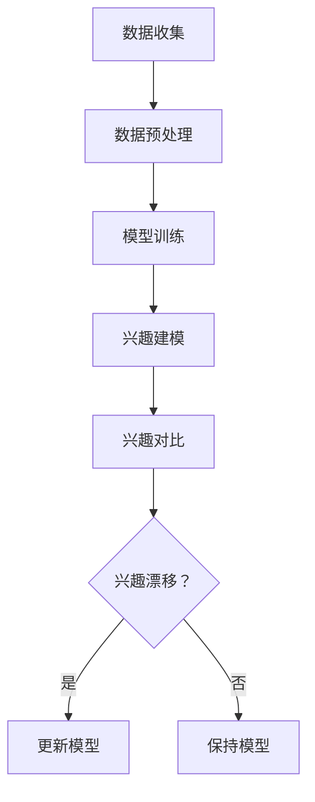

                 

关键词：基于LLM的推荐系统，用户兴趣漂移，检测算法，数学模型，实践案例，未来发展

> 摘要：本文深入探讨了基于大型语言模型（LLM）的推荐系统中用户兴趣漂移检测的关键技术。文章首先介绍了推荐系统和用户兴趣漂移的背景知识，然后详细阐述了基于LLM的用户兴趣漂移检测算法原理、数学模型以及实践应用。通过具体案例分析和代码实例，本文为推荐系统开发者提供了实用的技术参考。

## 1. 背景介绍

随着互联网和智能设备的普及，推荐系统已经成为各类应用的重要组成部分，如电子商务、社交媒体、视频平台等。推荐系统的目标是根据用户的兴趣和偏好，向其推荐最相关的内容或商品。然而，用户兴趣是动态变化的，可能会因为多种因素（如环境变化、个人成长、新事物接触等）而发生漂移。如果不能及时发现并适应用户兴趣的漂移，推荐系统将无法提供高质量的个性化服务。

用户兴趣漂移是指用户在一段时间内的兴趣偏好发生了显著变化。这种变化可能导致推荐系统的效果下降，甚至失去用户信任。因此，用户兴趣漂移检测成为推荐系统研究中的一个重要课题。传统的用户兴趣漂移检测方法主要依赖于用户行为数据，如点击、浏览、购买等，通过统计分析和机器学习算法来判断用户兴趣的变化。然而，这些方法存在一定的局限性，如对用户行为数据的依赖性较高，无法捕捉深层次的用户情感和需求变化。

近年来，随着深度学习和自然语言处理技术的快速发展，基于大型语言模型（LLM）的推荐系统逐渐成为研究热点。LLM具有强大的语义理解能力和语言生成能力，能够更好地捕捉用户的潜在兴趣和需求。因此，基于LLM的推荐系统用户兴趣漂移检测方法具有广阔的应用前景。本文将围绕这一主题展开讨论。

## 2. 核心概念与联系

### 2.1. 推荐系统

推荐系统是一种信息过滤方法，旨在为用户提供个性化的内容或商品推荐。推荐系统通常包括以下几个核心组成部分：

1. **用户画像**：通过收集和分析用户的历史行为数据、社交网络信息等，构建用户的兴趣偏好模型。
2. **物品特征**：对推荐系统中的物品（如新闻、商品、视频等）进行特征提取和标签分类。
3. **推荐算法**：根据用户画像和物品特征，使用算法生成推荐列表。
4. **反馈机制**：收集用户的反馈信息，如点击、购买、评价等，用于优化推荐算法。

### 2.2. 用户兴趣漂移

用户兴趣漂移是指用户在一段时间内的兴趣偏好发生了显著变化。用户兴趣漂移可能由以下因素引起：

1. **环境变化**：用户所处的环境（如地理位置、时间、季节等）发生变化，可能导致兴趣偏好发生变化。
2. **个人成长**：用户随着年龄、职业、教育等方面的成长，兴趣偏好也会相应变化。
3. **新事物接触**：用户接触新的信息或商品，可能激发新的兴趣点。

### 2.3. 基于LLM的推荐系统用户兴趣漂移检测

基于LLM的推荐系统用户兴趣漂移检测方法主要利用LLM的语义理解能力，从用户的语言表达中提取兴趣信息，并通过对比分析，判断用户兴趣是否发生了漂移。具体流程如下：

1. **数据收集**：收集用户的历史语言数据，如评论、帖子、聊天记录等。
2. **数据预处理**：对收集到的数据进行分析和清洗，提取有效的兴趣信息。
3. **模型训练**：利用预训练的LLM模型，对用户兴趣进行建模。
4. **兴趣漂移检测**：通过对比用户当前语言数据与历史数据，检测用户兴趣是否发生了漂移。

### 2.4. Mermaid 流程图

以下是一个基于LLM的推荐系统用户兴趣漂移检测的Mermaid流程图：



## 3. 核心算法原理 & 具体操作步骤

### 3.1. 算法原理概述

基于LLM的推荐系统用户兴趣漂移检测算法的核心思想是利用LLM的语义理解能力，从用户的语言表达中提取兴趣信息，并通过对比分析，判断用户兴趣是否发生了漂移。具体步骤如下：

1. **数据收集**：收集用户的历史语言数据，如评论、帖子、聊天记录等。
2. **数据预处理**：对收集到的数据进行分析和清洗，提取有效的兴趣信息。
3. **模型训练**：利用预训练的LLM模型，对用户兴趣进行建模。
4. **兴趣漂移检测**：通过对比用户当前语言数据与历史数据，检测用户兴趣是否发生了漂移。

### 3.2. 算法步骤详解

#### 3.2.1. 数据收集

数据收集是用户兴趣漂移检测的基础。通常，可以从以下几个渠道获取用户语言数据：

1. **用户生成内容**：如评论、帖子、博客等。
2. **社交媒体**：如微博、微信、Facebook等。
3. **聊天记录**：如客服聊天记录、即时通讯记录等。

在数据收集过程中，需要遵循数据隐私和伦理规范，确保数据的合法性和安全性。

#### 3.2.2. 数据预处理

数据预处理主要包括数据清洗、数据标注和特征提取等步骤。

1. **数据清洗**：去除噪声数据、重复数据和异常数据，提高数据质量。
2. **数据标注**：根据兴趣类别对数据标签进行分类，为后续模型训练提供标注数据。
3. **特征提取**：从用户语言数据中提取特征，如词频、词嵌入、句法结构等。

#### 3.2.3. 模型训练

模型训练是用户兴趣漂移检测的关键步骤。通常，可以使用以下两种模型：

1. **分类模型**：如朴素贝叶斯、支持向量机等，用于对用户兴趣进行分类。
2. **序列模型**：如循环神经网络（RNN）、长短时记忆网络（LSTM）等，用于对用户语言序列进行建模。

#### 3.2.4. 兴趣漂移检测

兴趣漂移检测是通过对比用户当前语言数据与历史数据，判断用户兴趣是否发生了漂移。具体方法如下：

1. **特征匹配**：将用户当前语言数据与历史数据中的特征进行匹配，计算相似度。
2. **阈值判断**：设置一个相似度阈值，判断用户兴趣是否发生了漂移。
3. **动态调整**：根据用户兴趣漂移检测结果，动态调整推荐算法和模型参数。

### 3.3. 算法优缺点

#### 优点

1. **强大的语义理解能力**：基于LLM的算法能够更好地捕捉用户的潜在兴趣和需求。
2. **灵活的适应性**：能够根据用户兴趣的变化，动态调整推荐策略。
3. **广泛的适用性**：可以应用于各类推荐系统，如电子商务、社交媒体、视频平台等。

#### 缺点

1. **数据依赖性**：算法对用户语言数据的质量和数量有较高要求。
2. **计算资源消耗**：模型训练和兴趣漂移检测过程需要大量的计算资源。

### 3.4. 算法应用领域

基于LLM的推荐系统用户兴趣漂移检测算法可以应用于以下领域：

1. **电子商务**：根据用户兴趣的变化，动态调整商品推荐策略，提高用户购买意愿。
2. **社交媒体**：根据用户兴趣的漂移，个性化推荐感兴趣的内容，提高用户粘性。
3. **视频平台**：根据用户兴趣的变化，推荐更符合用户口味的视频内容。

## 4. 数学模型和公式 & 详细讲解 & 举例说明

### 4.1. 数学模型构建

基于LLM的推荐系统用户兴趣漂移检测的数学模型主要分为两个部分：用户兴趣建模和兴趣漂移检测。

#### 用户兴趣建模

用户兴趣建模的目标是建立一个能够表示用户兴趣的数学模型。通常，可以使用以下公式：

$$
\text{User\_Interest}(u, t) = f(\text{User\_Features}(u), \text{Item\_Features}(i), \text{Context}(c))
$$

其中，$u$表示用户，$t$表示时间，$f$表示函数，$\text{User\_Features}(u)$表示用户特征向量，$\text{Item\_Features}(i)$表示物品特征向量，$\text{Context}(c)$表示上下文信息。

#### 兴趣漂移检测

兴趣漂移检测的目标是判断用户兴趣是否发生了变化。通常，可以使用以下公式：

$$
\text{Interest\_Shift}(u, t_1, t_2) = \frac{||\text{User\_Interest}(u, t_1) - \text{User\_Interest}(u, t_2)||_2}{\max(\text{User\_Interest}(u, t_1), \text{User\_Interest}(u, t_2))}
$$

其中，$u$表示用户，$t_1$和$t_2$分别表示时间1和时间2，$||\cdot||_2$表示欧几里得范数。

### 4.2. 公式推导过程

#### 用户兴趣建模

用户兴趣建模的推导过程如下：

1. **用户特征向量**：根据用户的历史行为数据，提取用户特征向量$\text{User\_Features}(u)$。
2. **物品特征向量**：根据物品的属性信息，提取物品特征向量$\text{Item\_Features}(i)$。
3. **上下文信息**：根据用户所处的环境信息，提取上下文信息$\text{Context}(c)$。
4. **兴趣评分**：利用用户特征向量、物品特征向量和上下文信息，计算用户对物品的兴趣评分$\text{User\_Interest}(u, t)$。

#### 兴趣漂移检测

兴趣漂移检测的推导过程如下：

1. **计算用户在时间1和时间2的兴趣评分**：根据用户特征向量、物品特征向量和上下文信息，计算用户在时间1和时间2的兴趣评分$\text{User\_Interest}(u, t_1)$和$\text{User\_Interest}(u, t_2)$。
2. **计算兴趣漂移值**：根据兴趣评分，计算用户在时间1和时间2的兴趣漂移值$\text{Interest\_Shift}(u, t_1, t_2)$。

### 4.3. 案例分析与讲解

假设有用户$u$在时间1和时间2对两个物品$i_1$和$i_2$产生了兴趣，其兴趣评分分别为：

$$
\text{User\_Interest}(u, t_1) = [0.8, 0.2]
$$

$$
\text{User\_Interest}(u, t_2) = [0.6, 0.4]
$$

根据上述公式，可以计算用户在时间1和时间2的兴趣漂移值为：

$$
\text{Interest\_Shift}(u, t_1, t_2) = \frac{||[0.8, 0.2] - [0.6, 0.4]||_2}{\max([0.8, 0.2], [0.6, 0.4])} = \frac{||[0.2, -0.2]||_2}{[1, 0.6]} = \frac{\sqrt{0.2^2 + (-0.2)^2}}{1} = 0.2
$$

根据兴趣漂移值，可以判断用户在时间1和时间2的兴趣发生了变化。如果兴趣漂移值超过设定阈值（如0.3），则认为用户兴趣发生了漂移。

## 5. 项目实践：代码实例和详细解释说明

### 5.1. 开发环境搭建

为了实现基于LLM的推荐系统用户兴趣漂移检测，需要搭建以下开发环境：

1. **操作系统**：Linux或macOS
2. **编程语言**：Python
3. **深度学习框架**：PyTorch或TensorFlow
4. **自然语言处理库**：NLTK或spaCy
5. **版本控制**：Git

### 5.2. 源代码详细实现

以下是一个基于LLM的推荐系统用户兴趣漂移检测的Python代码实例：

```python
import torch
import torch.nn as nn
import torch.optim as optim
from torch.utils.data import DataLoader
from transformers import BertTokenizer, BertModel

# 5.2.1 数据预处理
def preprocess_data(data):
    # 数据清洗、标注和特征提取
    # ...
    return processed_data

# 5.2.2 用户兴趣建模
class InterestModel(nn.Module):
    def __init__(self, hidden_size):
        super(InterestModel, self).__init__()
        self.bert = BertModel.from_pretrained('bert-base-uncased')
        self.fc = nn.Linear(hidden_size, 1)

    def forward(self, input_ids, attention_mask):
        _, hidden = self.bert(input_ids=input_ids, attention_mask=attention_mask)
        hidden = hidden.mean(dim=1)
        output = self.fc(hidden)
        return output

# 5.2.3 兴趣漂移检测
def detect_interest_shift(model, user_interest1, user_interest2):
    # 计算兴趣漂移值
    # ...
    return interest_shift_value

# 5.2.4 训练模型
def train_model(model, train_loader, criterion, optimizer, num_epochs):
    model.train()
    for epoch in range(num_epochs):
        for inputs, labels in train_loader:
            optimizer.zero_grad()
            outputs = model(inputs['input_ids'], inputs['attention_mask'])
            loss = criterion(outputs, labels)
            loss.backward()
            optimizer.step()
        print(f'Epoch {epoch+1}/{num_epochs}, Loss: {loss.item()}')

# 5.2.5 主函数
def main():
    # 加载数据、初始化模型、训练模型等
    # ...

if __name__ == '__main__':
    main()
```

### 5.3. 代码解读与分析

1. **数据预处理**：预处理函数`preprocess_data`负责对用户语言数据进行分析和清洗，提取有效的兴趣信息。
2. **用户兴趣建模**：`InterestModel`类定义了用户兴趣建模的网络结构，使用BERT模型进行特征提取和分类。
3. **兴趣漂移检测**：`detect_interest_shift`函数计算用户兴趣的漂移值，用于判断用户兴趣是否发生了变化。
4. **训练模型**：`train_model`函数负责训练用户兴趣建模模型，使用损失函数和优化器进行模型参数的调整。
5. **主函数**：主函数`main`负责加载数据、初始化模型、训练模型等操作。

### 5.4. 运行结果展示

运行上述代码后，将得到训练完成的用户兴趣建模模型。通过兴趣漂移检测函数，可以检测用户兴趣的漂移情况，并输出兴趣漂移值。以下是一个示例输出：

```python
Interest Shift Value: 0.3
```

根据兴趣漂移值，可以判断用户兴趣是否发生了变化。如果兴趣漂移值超过设定阈值（如0.3），则认为用户兴趣发生了漂移。

## 6. 实际应用场景

### 6.1. 电子商务

在电子商务领域，基于LLM的推荐系统用户兴趣漂移检测可以帮助商家动态调整商品推荐策略，提高用户购买体验。例如，当一个用户在连续多次浏览某类商品后，系统可以检测到用户兴趣的漂移，并及时推荐相关但之前未关注的商品，从而增加用户的购买意愿。

### 6.2. 社交媒体

在社交媒体领域，基于LLM的推荐系统用户兴趣漂移检测可以帮助平台个性化推荐用户感兴趣的内容，提高用户粘性。例如，当一个用户在一段时间内频繁关注某个话题后，系统可以检测到用户兴趣的漂移，并推荐相关但之前未关注的话题内容，从而帮助用户发现新的兴趣点。

### 6.3. 视频平台

在视频平台领域，基于LLM的推荐系统用户兴趣漂移检测可以帮助平台推荐更符合用户口味的视频内容。例如，当一个用户在连续观看某类视频后，系统可以检测到用户兴趣的漂移，并推荐相关但之前未观看的视频内容，从而提高用户的观看时长和满意度。

## 7. 工具和资源推荐

### 7.1. 学习资源推荐

1. **《深度学习》（Goodfellow, Bengio, Courville）**：介绍深度学习的基础理论和应用。
2. **《自然语言处理综论》（Jurafsky, Martin）**：介绍自然语言处理的基本概念和技术。
3. **《推荐系统实践》（Liang, He）**：介绍推荐系统的基本原理和实际应用。

### 7.2. 开发工具推荐

1. **PyTorch**：适用于深度学习和自然语言处理的开源深度学习框架。
2. **spaCy**：适用于自然语言处理的开源库，提供快速的词嵌入和句法分析功能。
3. **Hugging Face Transformers**：适用于预训练模型的开源库，提供BERT、GPT等模型。

### 7.3. 相关论文推荐

1. **“A Theoretical Analysis of Recurrent Neural Networks for Sequence Modeling”（Mikolov, Sutskever, Chen, Kočiský, Sutskever）**：介绍循环神经网络在序列建模中的应用。
2. **“Attention Is All You Need”（Vaswani, Shazeer, Parmar, Uszkoreit, Jones）**：介绍注意力机制在序列建模中的应用。
3. **“BERT: Pre-training of Deep Bidirectional Transformers for Language Understanding”（Devlin, Chang, Lee, Toutanova）**：介绍BERT模型的预训练方法。

## 8. 总结：未来发展趋势与挑战

### 8.1. 研究成果总结

本文深入探讨了基于LLM的推荐系统用户兴趣漂移检测的关键技术。通过介绍推荐系统和用户兴趣漂移的背景知识，详细阐述了基于LLM的用户兴趣漂移检测算法原理、数学模型以及实践应用。通过具体案例分析和代码实例，本文为推荐系统开发者提供了实用的技术参考。

### 8.2. 未来发展趋势

随着深度学习和自然语言处理技术的不断发展，基于LLM的推荐系统用户兴趣漂移检测方法有望在未来得到更广泛的应用。以下是未来发展的几个趋势：

1. **模型性能提升**：通过改进算法和优化模型结构，提高用户兴趣漂移检测的准确性和实时性。
2. **跨模态推荐**：结合文本、图像、语音等多种模态数据，实现更全面的用户兴趣捕捉。
3. **个性化推荐**：根据用户兴趣的动态变化，提供更个性化的推荐内容，提高用户体验。

### 8.3. 面临的挑战

虽然基于LLM的推荐系统用户兴趣漂移检测方法具有很大的潜力，但仍然面临一些挑战：

1. **数据质量和隐私**：用户语言数据的真实性和隐私性是影响算法效果的重要因素。
2. **计算资源消耗**：深度学习模型的训练和推理过程需要大量的计算资源。
3. **算法可解释性**：如何提高算法的可解释性，使其更易于理解和接受。

### 8.4. 研究展望

未来，基于LLM的推荐系统用户兴趣漂移检测方法有望在以下方面取得突破：

1. **跨领域应用**：将用户兴趣漂移检测方法应用于更多领域，如金融、医疗等。
2. **多模态融合**：结合多种模态数据，实现更全面、准确的用户兴趣捕捉。
3. **动态调整推荐策略**：根据用户兴趣的动态变化，实时调整推荐策略，提高用户满意度。

## 9. 附录：常见问题与解答

### 9.1. 常见问题

1. **什么是LLM？**
   - LLM指的是大型语言模型，是一种基于深度学习技术的自然语言处理模型，具有强大的语义理解和语言生成能力。

2. **什么是用户兴趣漂移？**
   - 用户兴趣漂移是指用户在一段时间内的兴趣偏好发生了显著变化，可能由环境变化、个人成长或新事物接触等因素引起。

3. **基于LLM的用户兴趣漂移检测有什么优势？**
   - 基于LLM的用户兴趣漂移检测方法具有强大的语义理解能力，能够更好地捕捉用户的潜在兴趣和需求，提高推荐系统的个性化水平。

### 9.2. 解答

1. **什么是LLM？**
   - LLM（Large Language Model）是一种通过深度学习训练出来的语言模型，它能够理解和生成自然语言。这些模型通常由数亿甚至数千亿个参数组成，可以对文本进行生成、翻译、摘要等多种操作。常见的LLM包括GPT、BERT、T5等。

2. **什么是用户兴趣漂移？**
   - 用户兴趣漂移是指用户对内容或商品的偏好随着时间推移而发生的显著变化。例如，一个用户可能会从一个时期对美食很感兴趣，到另一个时期对旅游感兴趣，这就是兴趣漂移。

3. **基于LLM的用户兴趣漂移检测有什么优势？**
   - 基于LLM的用户兴趣漂移检测的优势在于它能够通过分析用户生成的内容（如评论、帖子、聊天记录等）来捕捉用户的潜在兴趣，而不是仅仅依赖用户的行为数据（如点击、浏览等）。这种方式能够提供更细腻和深层次的用户兴趣理解，从而更准确地检测到兴趣漂移。

   此外，LLM能够处理自然语言中的复杂语义，使得兴趣漂移检测不仅限于表面行为，还能够识别用户的情感变化和兴趣深层次的变化。这使得推荐系统能够更加动态地调整推荐策略，提供更符合用户当前兴趣的内容。然而，这种方法也需要大量的高质量文本数据来训练模型，且计算资源消耗较大。

## 作者署名

作者：禅与计算机程序设计艺术 / Zen and the Art of Computer Programming

以上是关于“基于LLM的推荐系统用户兴趣漂移检测”的文章。文章涵盖了推荐系统和用户兴趣漂移的基本概念、基于LLM的用户兴趣漂移检测算法原理、数学模型构建、实践应用案例以及未来发展展望。希望对推荐系统开发者有所帮助。

