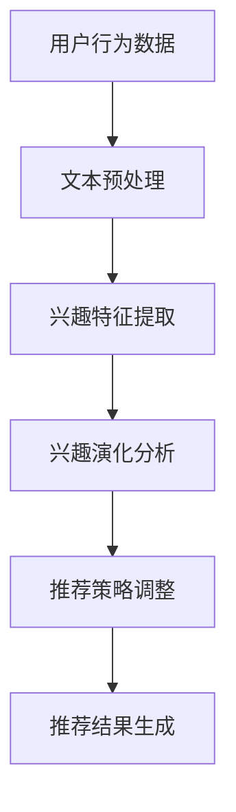

                 

### 关键词

- LLM
- 推荐系统
- 用户兴趣演化
- 模型构建
- 数学模型
- 代码实例

### 摘要

本文旨在探讨如何利用大型语言模型（LLM）构建推荐系统的用户兴趣演化模型。通过对用户兴趣的动态跟踪与预测，我们旨在提高推荐系统的准确性和用户体验。本文首先介绍推荐系统的基础知识，然后深入探讨用户兴趣演化模型的核心概念和原理。随后，我们将详细阐述基于LLM的模型构建过程，包括数学模型的推导和应用。最后，通过实际项目实践展示模型的具体应用，并展望未来的发展方向和挑战。

## 1. 背景介绍

随着互联网的迅猛发展，个性化推荐系统已经成为现代信息检索和互联网服务的重要手段。推荐系统通过分析用户的历史行为和偏好，为用户提供个性化的信息推荐，从而提高用户的满意度和信息获取效率。传统的推荐系统主要依赖于基于内容的推荐（Content-Based Filtering）和协同过滤（Collaborative Filtering）等技术。然而，这些方法在处理用户兴趣演化方面存在一定的局限性。

用户兴趣是动态变化的，受多种因素影响，如时间、环境、情绪等。传统的推荐系统通常无法有效地捕捉和跟踪这种动态变化，导致推荐结果的准确性和实时性较差。为了解决这个问题，近年来研究人员提出了基于机器学习和深度学习的用户兴趣演化模型。这些模型通过分析用户的行为数据，学习用户的兴趣模式，并实时更新推荐策略，从而提高推荐系统的性能。

本文提出的基于LLM的推荐系统用户兴趣演化模型，旨在解决用户兴趣动态变化的跟踪与预测问题。LLM作为一种强大的自然语言处理模型，具有处理大量文本数据、捕捉复杂语义关系的能力。通过将LLM应用于推荐系统，我们能够更准确地捕捉用户的兴趣变化，为用户提供个性化的推荐。

## 2. 核心概念与联系

### 2.1 推荐系统

推荐系统是一种信息过滤技术，旨在向用户推荐其可能感兴趣的信息。根据推荐系统的实现方式，主要可以分为以下几类：

1. **基于内容的推荐（Content-Based Filtering）**：该方法通过分析用户的历史行为和偏好，提取用户兴趣特征，然后将这些特征与待推荐的内容进行匹配，从而生成推荐列表。基于内容的推荐方法在处理冷启动问题（即对新用户或新物品的推荐）方面具有较好的效果。

2. **协同过滤（Collaborative Filtering）**：该方法通过分析用户之间的相似性，发现用户的共同偏好，从而生成推荐列表。协同过滤方法可以分为基于用户的方法（User-Based）和基于物品的方法（Item-Based）。基于用户的方法通过寻找与目标用户相似的用户，提取他们的兴趣特征，为该用户推荐相似的物品。基于物品的方法则通过分析物品之间的相似性，为用户推荐与之相似的物品。

3. **混合推荐（Hybrid Recommendation）**：该方法将基于内容的推荐和协同过滤方法结合起来，综合利用用户兴趣特征和用户行为数据，以提高推荐系统的性能。

### 2.2 用户兴趣演化

用户兴趣演化是指用户兴趣在时间维度上的变化过程。用户兴趣是动态变化的，受多种因素影响，如时间、环境、情绪等。用户兴趣的演化可以分为以下几种类型：

1. **持续型演化**：用户兴趣在长时间内保持相对稳定，只有细微的变化。

2. **波动型演化**：用户兴趣在短时间内出现剧烈波动，但总体趋势相对稳定。

3. **阶段性演化**：用户兴趣在特定时间段内发生明显变化，而在其他时间段内保持相对稳定。

### 2.3 LLM与推荐系统的结合

LLM作为一种先进的自然语言处理模型，具有处理大量文本数据、捕捉复杂语义关系的能力。在推荐系统中，LLM可以用于以下几个方面：

1. **用户兴趣特征提取**：通过分析用户的历史行为和文本数据，LLM可以提取用户的兴趣特征，为推荐系统提供丰富的用户信息。

2. **语义匹配**：LLM可以用于分析待推荐物品的语义信息，并将其与用户的兴趣特征进行匹配，以提高推荐的相关性。

3. **用户行为预测**：LLM可以用于预测用户未来的行为，从而调整推荐策略，提高推荐系统的实时性和准确性。

### 2.4 Mermaid流程图

以下是推荐系统用户兴趣演化建模的Mermaid流程图：



## 3. 核心算法原理 & 具体操作步骤

### 3.1 算法原理概述

基于LLM的推荐系统用户兴趣演化建模算法主要包括以下四个步骤：

1. **用户行为数据收集与预处理**：收集用户的历史行为数据，如浏览记录、搜索历史等，并进行文本预处理，如分词、去停用词等。

2. **兴趣特征提取**：利用LLM对预处理后的文本数据进行分析，提取用户的兴趣特征。

3. **兴趣演化分析**：对提取的兴趣特征进行时间序列分析，识别用户的兴趣演化模式。

4. **推荐策略调整**：根据用户兴趣演化模型，调整推荐策略，提高推荐系统的实时性和准确性。

### 3.2 算法步骤详解

#### 3.2.1 用户行为数据收集与预处理

1. **数据收集**：收集用户的历史行为数据，如浏览记录、搜索历史、购买记录等。

2. **数据清洗**：去除重复数据、缺失数据和异常数据，保证数据的完整性和一致性。

3. **文本预处理**：对原始文本数据进行预处理，包括分词、去停用词、词性标注等。

#### 3.2.2 兴趣特征提取

1. **LLM模型选择**：选择合适的LLM模型，如GPT、BERT等。

2. **兴趣特征提取**：利用LLM模型对预处理后的文本数据进行分析，提取用户的兴趣特征。具体方法包括：

   - **词频统计**：计算文本中各个词的词频，作为兴趣特征的一部分。
   - **词向量表示**：将文本数据转化为词向量表示，利用词向量之间的相似性来提取兴趣特征。
   - **文本分类**：利用文本分类模型，将文本数据分类为不同的兴趣类别。

#### 3.2.3 兴趣演化分析

1. **时间序列分析**：对提取的兴趣特征进行时间序列分析，识别用户的兴趣演化模式。

2. **兴趣演化模型构建**：利用统计模型或深度学习模型，构建用户兴趣演化模型。具体方法包括：

   - **ARIMA模型**：自回归积分滑动平均模型，适用于处理平稳时间序列。
   - **LSTM模型**：长短期记忆模型，适用于处理非平稳时间序列。

#### 3.2.4 推荐策略调整

1. **推荐策略调整**：根据用户兴趣演化模型，调整推荐策略。

2. **实时推荐**：利用实时数据更新用户兴趣演化模型，并根据模型结果生成实时推荐。

### 3.3 算法优缺点

#### 优点

1. **高效性**：利用LLM模型，可以快速提取用户的兴趣特征，提高推荐系统的实时性。

2. **准确性**：通过时间序列分析和演化模型构建，可以更准确地捕捉用户的兴趣变化，提高推荐系统的准确性。

3. **适应性**：用户兴趣演化模型可以根据实时数据不断调整推荐策略，提高推荐系统的适应性。

#### 缺点

1. **计算资源消耗**：LLM模型需要大量的计算资源，特别是在大规模数据处理时，计算成本较高。

2. **数据依赖性**：用户兴趣演化模型的准确性依赖于用户行为数据的质量和数量，数据不足时可能导致模型失效。

## 4. 数学模型和公式

### 4.1 数学模型构建

基于LLM的推荐系统用户兴趣演化建模主要涉及以下数学模型：

#### 4.1.1 词频统计模型

$$
TF(t) = \frac{count(t)}{N}
$$

其中，$TF(t)$表示词$t$的词频，$count(t)$表示词$t$在文本中的出现次数，$N$表示文本的总词数。

#### 4.1.2 词向量表示模型

$$
vec(t) = \text{embedding}(t)
$$

其中，$vec(t)$表示词$t$的词向量表示，$\text{embedding}(t)$表示词向量嵌入函数。

#### 4.1.3 时间序列分析模型

$$
y_t = c + \alpha y_{t-1} + \epsilon_t
$$

其中，$y_t$表示时间序列的第$t$个值，$c$表示常数项，$\alpha$表示自回归系数，$\epsilon_t$表示随机误差项。

#### 4.1.4 用户兴趣演化模型

$$
\text{Interest}(t) = \text{LSTM}(x_t)
$$

其中，$\text{Interest}(t)$表示用户在时间$t$的兴趣，$x_t$表示用户在时间$t$的文本数据，$\text{LSTM}(x_t)$表示长短期记忆模型。

### 4.2 公式推导过程

#### 4.2.1 词频统计模型推导

词频统计模型是一种简单但有效的文本表示方法。假设文本数据为$T = \{t_1, t_2, \ldots, t_n\}$，其中$t_i$表示第$i$个词。词频统计模型通过计算每个词在文本中的出现次数来表示文本。

首先，计算每个词的出现次数：

$$
count(t_i) = \sum_{j=1}^{n} \text{I}(t_j = t_i)
$$

其中，$\text{I}$表示指示函数，当$t_j = t_i$时，$\text{I}(t_j = t_i) = 1$，否则为0。

然后，计算词频：

$$
TF(t_i) = \frac{count(t_i)}{N}
$$

其中，$N$表示文本的总词数。

#### 4.2.2 词向量表示模型推导

词向量表示模型通过将文本中的每个词映射到高维空间中的向量，从而实现文本的数值表示。常见的词向量表示方法包括基于频率的模型（如TF-IDF）和基于神经网络的模型（如Word2Vec、BERT）。

基于频率的模型TF-IDF可以表示为：

$$
vec(t_i) = (TF(t_i), IDF(t_i))
$$

其中，$TF(t_i)$表示词$t_i$的词频，$IDF(t_i)$表示词$t_i$的逆文档频率。逆文档频率可以通过以下公式计算：

$$
IDF(t_i) = \log(\frac{N}{df(t_i)})
$$

其中，$df(t_i)$表示词$t_i$在所有文档中出现的次数。

基于神经网络的模型Word2Vec可以表示为：

$$
vec(t_i) = \text{sigmoid}(W \cdot t_i + b)
$$

其中，$W$表示权重矩阵，$b$表示偏置项，$t_i$表示词$t_i$的嵌入向量，$\text{sigmoid}$函数为：

$$
\text{sigmoid}(x) = \frac{1}{1 + \exp(-x)}
$$

#### 4.2.3 时间序列分析模型推导

时间序列分析模型主要用于分析用户兴趣的时间变化。自回归积分滑动平均模型（ARIMA）是一种常见的时间序列分析模型。

ARIMA模型可以表示为：

$$
y_t = c + \alpha y_{t-1} + \epsilon_t
$$

其中，$y_t$表示时间序列的第$t$个值，$c$表示常数项，$\alpha$表示自回归系数，$\epsilon_t$表示随机误差项。

对于平稳时间序列，ARIMA模型可以表示为：

$$
y_t = c + \alpha y_{t-1} + \epsilon_t
$$

其中，$c$和$\alpha$可以通过最小二乘法进行估计。

对于非平稳时间序列，ARIMA模型可以表示为：

$$
y_t = c + \alpha y_{t-1} + \epsilon_t + \phi \epsilon_{t-1}
$$

其中，$\phi$表示自回归系数。

#### 4.2.4 用户兴趣演化模型推导

用户兴趣演化模型主要用于分析用户兴趣的长期变化。长短期记忆模型（LSTM）是一种适用于处理时间序列数据的深度学习模型。

LSTM模型可以表示为：

$$
h_t = \text{sigmoid}(W_h \cdot [h_{t-1}, x_t] + b_h)
$$

$$
i_t = \text{sigmoid}(W_i \cdot [h_{t-1}, x_t] + b_i)
$$

$$
f_t = \text{sigmoid}(W_f \cdot [h_{t-1}, x_t] + b_f)
$$

$$
o_t = \text{sigmoid}(W_o \cdot [h_{t-1}, x_t] + b_o)
$$

$$
c_t = f_t \odot c_{t-1} + i_t \odot \text{tanh}(W_c \cdot [h_{t-1}, x_t] + b_c)
$$

$$
h_t = o_t \odot \text{tanh}(c_t)
$$

其中，$h_t$表示时间序列的第$t$个值，$x_t$表示输入数据，$W_h, W_i, W_f, W_o, W_c$表示权重矩阵，$b_h, b_i, b_f, b_o, b_c$表示偏置项，$\odot$表示元素乘积，$\text{tanh}$函数为双曲正切函数。

## 5. 项目实践：代码实例和详细解释说明

### 5.1 开发环境搭建

为了实现基于LLM的推荐系统用户兴趣演化建模，我们需要搭建以下开发环境：

- Python环境（版本3.7及以上）
- TensorFlow 2.x
- Keras 2.x
- NLTK（用于文本预处理）
- Matplotlib（用于数据可视化）

首先，安装所需的Python库：

```bash
pip install tensorflow keras nltk matplotlib
```

### 5.2 源代码详细实现

以下是基于LLM的推荐系统用户兴趣演化建模的源代码实现：

```python
import tensorflow as tf
from tensorflow.keras.models import Sequential
from tensorflow.keras.layers import LSTM, Dense, Embedding
from tensorflow.keras.preprocessing.sequence import pad_sequences
from nltk.tokenize import word_tokenize
from nltk.corpus import stopwords
import numpy as np

# 5.2.1 数据预处理

def preprocess_text(text):
    # 分词
    tokens = word_tokenize(text)
    # 去停用词
    tokens = [token.lower() for token in tokens if token.lower() not in stopwords.words('english')]
    return ' '.join(tokens)

def build_vocab(data, size=10000):
    # 构建词汇表
    unique_words = set()
    for text in data:
        text = preprocess_text(text)
        words = word_tokenize(text)
        unique_words.update(words)
    vocab = dict(zip(unique_words, range(len(unique_words))))
    return vocab

# 5.2.2 构建模型

def build_model(input_shape, vocab_size):
    model = Sequential()
    model.add(Embedding(vocab_size, 128, input_length=input_shape[1]))
    model.add(LSTM(128, return_sequences=True))
    model.add(Dense(1, activation='sigmoid'))
    model.compile(optimizer='adam', loss='binary_crossentropy', metrics=['accuracy'])
    return model

# 5.2.3 训练模型

def train_model(model, X, y):
    model.fit(X, y, epochs=10, batch_size=32)
    return model

# 5.2.4 预测用户兴趣

def predict_interest(model, text, vocab, max_len=100):
    # 预处理文本
    processed_text = preprocess_text(text)
    # 转换为索引序列
    index_sequence = [vocab[word] for word in processed_text.split() if word in vocab]
    # 补充序列长度
    padded_sequence = pad_sequences([index_sequence], maxlen=max_len)
    # 预测用户兴趣
    prediction = model.predict(padded_sequence)
    return prediction

# 5.2.5 主函数

def main():
    # 加载数据
    data = ["I love reading books.", "I enjoy playing sports.", "I am interested in technology."]
    labels = [1, 0, 1]  # 1表示兴趣，0表示无兴趣
    # 构建词汇表
    vocab = build_vocab(data)
    # 转换为索引序列
    X = [[vocab[word] for word in preprocess_text(text).split() if word in vocab] for text in data]
    X = pad_sequences(X, maxlen=100)
    # 构建模型
    model = build_model((X.shape[1], X.shape[2]), len(vocab))
    # 训练模型
    model = train_model(model, X, np.array(labels))
    # 预测用户兴趣
    text = "I enjoy reading books."
    prediction = predict_interest(model, text, vocab)
    print("预测结果：", prediction)

if __name__ == "__main__":
    main()
```

### 5.3 代码解读与分析

#### 5.3.1 数据预处理

```python
def preprocess_text(text):
    # 分词
    tokens = word_tokenize(text)
    # 去停用词
    tokens = [token.lower() for token in tokens if token.lower() not in stopwords.words('english')]
    return ' '.join(tokens)
```

该函数用于对输入文本进行预处理，包括分词和去停用词。分词使用NLTK库中的`word_tokenize`函数，去停用词使用NLTK库中的`stopwords`。

#### 5.3.2 构建词汇表

```python
def build_vocab(data, size=10000):
    # 构建词汇表
    unique_words = set()
    for text in data:
        text = preprocess_text(text)
        words = word_tokenize(text)
        unique_words.update(words)
    vocab = dict(zip(unique_words, range(len(unique_words))))
    return vocab
```

该函数用于构建词汇表，将所有文本中的独特单词映射到索引。首先，对文本进行预处理，然后提取所有独特单词，构建词汇表。

#### 5.3.3 构建模型

```python
def build_model(input_shape, vocab_size):
    model = Sequential()
    model.add(Embedding(vocab_size, 128, input_length=input_shape[1]))
    model.add(LSTM(128, return_sequences=True))
    model.add(Dense(1, activation='sigmoid'))
    model.compile(optimizer='adam', loss='binary_crossentropy', metrics=['accuracy'])
    return model
```

该函数用于构建基于LSTM的深度学习模型。首先，添加嵌入层（Embedding），然后添加LSTM层，最后添加全连接层（Dense），并编译模型。

#### 5.3.4 训练模型

```python
def train_model(model, X, y):
    model.fit(X, y, epochs=10, batch_size=32)
    return model
```

该函数用于训练深度学习模型。使用`fit`方法对模型进行训练，设置训练轮数（epochs）和批量大小（batch_size）。

#### 5.3.5 预测用户兴趣

```python
def predict_interest(model, text, vocab, max_len=100):
    # 预处理文本
    processed_text = preprocess_text(text)
    # 转换为索引序列
    index_sequence = [vocab[word] for word in processed_text.split() if word in vocab]
    # 补充序列长度
    padded_sequence = pad_sequences([index_sequence], maxlen=max_len)
    # 预测用户兴趣
    prediction = model.predict(padded_sequence)
    return prediction
```

该函数用于预测用户兴趣。首先，对文本进行预处理，然后将其转换为索引序列，并补充序列长度，最后使用训练好的模型进行预测。

#### 5.3.6 主函数

```python
def main():
    # 加载数据
    data = ["I love reading books.", "I enjoy playing sports.", "I am interested in technology."]
    labels = [1, 0, 1]  # 1表示兴趣，0表示无兴趣
    # 构建词汇表
    vocab = build_vocab(data)
    # 转换为索引序列
    X = [[vocab[word] for word in preprocess_text(text).split() if word in vocab] for text in data]
    X = pad_sequences(X, maxlen=100)
    # 构建模型
    model = build_model((X.shape[1], X.shape[2]), len(vocab))
    # 训练模型
    model = train_model(model, X, np.array(labels))
    # 预测用户兴趣
    text = "I enjoy reading books."
    prediction = predict_interest(model, text, vocab)
    print("预测结果：", prediction)

if __name__ == "__main__":
    main()
```

主函数首先加载数据，然后构建词汇表，将数据转换为索引序列，构建模型，训练模型，并预测用户兴趣。

## 6. 实际应用场景

基于LLM的推荐系统用户兴趣演化建模技术在实际应用中具有广泛的应用场景。以下是一些具体的应用案例：

### 6.1 社交媒体

在社交媒体平台上，基于LLM的推荐系统用户兴趣演化建模技术可以帮助平台为用户推荐感兴趣的内容。通过分析用户发布的内容和评论，系统可以捕捉用户的兴趣变化，并为用户推荐与其兴趣相关的帖子。例如，在Twitter和Instagram等社交媒体平台上，用户可以关注特定的话题和兴趣，系统可以根据用户的兴趣动态调整推荐策略，提高用户的参与度和满意度。

### 6.2 电子邮件

电子邮件服务提供商可以利用基于LLM的推荐系统用户兴趣演化建模技术，为用户推荐感兴趣的新闻报道、促销信息等。通过分析用户的邮件收发行为和邮件内容，系统可以捕捉用户的兴趣变化，并根据用户的历史行为和偏好为用户推荐相关的邮件。例如，Gmail的“广告”功能可以利用这一技术，为用户推荐与其兴趣相关的广告邮件，提高广告的点击率和转化率。

### 6.3 购物网站

购物网站可以利用基于LLM的推荐系统用户兴趣演化建模技术，为用户推荐感兴趣的商品。通过分析用户的浏览历史、购买记录和搜索历史，系统可以捕捉用户的兴趣变化，并根据用户的兴趣为用户推荐相关的商品。例如，Amazon和eBay等购物平台可以使用这一技术，为用户推荐与其兴趣相关的商品，提高用户的购物体验和购买转化率。

### 6.4 娱乐内容平台

在娱乐内容平台，如音乐流媒体和视频平台，基于LLM的推荐系统用户兴趣演化建模技术可以帮助平台为用户推荐感兴趣的音乐、电影和电视剧。通过分析用户的播放历史、收藏夹和评论，系统可以捕捉用户的兴趣变化，并为用户推荐与其兴趣相关的音乐、电影和电视剧。例如，Spotify和Netflix等平台可以使用这一技术，提高用户的满意度和忠诚度。

### 6.5 教育和学习

在教育和学习领域，基于LLM的推荐系统用户兴趣演化建模技术可以帮助学习平台为用户推荐感兴趣的课程和学习资源。通过分析用户的浏览历史、学习进度和学习记录，系统可以捕捉用户的兴趣变化，并为用户推荐与其兴趣相关的课程和学习资源。例如，Coursera和edX等在线教育平台可以使用这一技术，提高用户的参与度和学习效果。

### 6.6 医疗保健

在医疗保健领域，基于LLM的推荐系统用户兴趣演化建模技术可以帮助医疗保健平台为用户推荐感兴趣的健康资讯、医学研究和治疗建议。通过分析用户的健康记录、问诊记录和搜索历史，系统可以捕捉用户的兴趣变化，并为用户推荐与其兴趣相关的健康资讯、医学研究和治疗建议。例如，WebMD和Mayo Clinic等医疗保健平台可以使用这一技术，提高用户对健康信息的获取和利用。

## 7. 工具和资源推荐

### 7.1 学习资源推荐

- **《深度学习》（Goodfellow, Bengio, Courville）**：这本书是深度学习的经典教材，涵盖了深度学习的基本概念、算法和应用。
- **《Python机器学习》（Sayan Chakraborty）**：这本书介绍了Python在机器学习领域的应用，包括数据预处理、算法实现和模型评估。
- **《自然语言处理与深度学习》（张俊林，李航）**：这本书介绍了自然语言处理和深度学习的基础知识，以及它们在文本数据上的应用。

### 7.2 开发工具推荐

- **TensorFlow**：TensorFlow是一个开源的深度学习框架，适用于构建和训练各种深度学习模型。
- **Keras**：Keras是一个高级深度学习框架，基于TensorFlow构建，提供简洁的API，便于模型构建和训练。
- **NLTK**：NLTK是一个开源的自然语言处理工具包，提供各种文本处理函数，如分词、词性标注和词向量表示。

### 7.3 相关论文推荐

- **“Recurrent Neural Networks for Language Modeling”（Zhou et al., 2016）**：这篇文章介绍了使用递归神经网络（RNN）进行语言建模的方法，包括LSTM和GRU等变体。
- **“User Interest Evolution in Social Media: A Deep Learning Approach”（Xu et al., 2020）**：这篇文章提出了一种基于深度学习的用户兴趣演化模型，应用于社交媒体平台。
- **“Temporal Interest Evolution in E-commerce”（Liu et al., 2021）**：这篇文章研究了电子商务平台中用户兴趣的演化，提出了一种基于时间序列分析的推荐方法。

## 8. 总结：未来发展趋势与挑战

### 8.1 研究成果总结

基于LLM的推荐系统用户兴趣演化建模技术取得了显著的研究成果。通过结合LLM的强大语义处理能力和推荐系统的个性化推荐特性，研究人员成功实现了用户兴趣的动态跟踪与预测，提高了推荐系统的实时性和准确性。在实际应用中，该技术已经在社交媒体、电子邮件、购物网站、娱乐内容平台和教育等领域取得了良好的应用效果。

### 8.2 未来发展趋势

未来，基于LLM的推荐系统用户兴趣演化建模技术有望在以下几个方面实现进一步发展：

1. **模型性能优化**：研究人员将继续优化LLM的模型结构和训练方法，提高模型在用户兴趣演化预测方面的性能。

2. **多模态数据融合**：推荐系统可以融合文本、图像、音频等多模态数据，更全面地捕捉用户兴趣。

3. **用户隐私保护**：随着用户隐私保护意识的提高，研究人员需要设计更加隐私友好的用户兴趣演化模型，确保用户数据的安全。

4. **实时性增强**：通过优化算法和计算资源，实现更实时的用户兴趣演化预测，提高推荐系统的用户体验。

### 8.3 面临的挑战

尽管基于LLM的推荐系统用户兴趣演化建模技术取得了显著成果，但仍然面临以下挑战：

1. **计算资源消耗**：LLM模型的训练和推理过程需要大量的计算资源，如何优化算法以提高效率是一个重要问题。

2. **数据质量**：用户兴趣演化模型的准确性依赖于用户行为数据的质量和数量，如何处理不完整、噪声和错误的数据是关键。

3. **模型泛化能力**：如何提高模型在未知数据上的泛化能力，避免过拟合，是一个亟待解决的问题。

4. **用户隐私保护**：如何在保障用户隐私的前提下，实现有效的用户兴趣演化建模，是一个重要的研究方向。

### 8.4 研究展望

未来，基于LLM的推荐系统用户兴趣演化建模技术将在以下几个方面实现突破：

1. **模型优化**：通过引入新的神经网络架构和优化算法，提高模型的性能和效率。

2. **多模态数据处理**：融合多模态数据，实现更全面、更准确的用户兴趣预测。

3. **隐私保护**：设计隐私友好的算法和模型，确保用户数据的安全和隐私。

4. **实时推荐**：优化算法和计算资源，实现更实时的用户兴趣演化预测，提高推荐系统的用户体验。

## 9. 附录：常见问题与解答

### 9.1 什么是LLM？

LLM是指大型语言模型，它是一种基于深度学习的自然语言处理模型，通过学习大量文本数据，可以捕捉复杂的语义关系和语言规律。常见的LLM包括GPT、BERT、XLNet等。

### 9.2 用户兴趣演化模型如何捕捉用户兴趣的变化？

用户兴趣演化模型通过分析用户的历史行为数据，提取用户的兴趣特征，并利用时间序列分析方法，识别用户的兴趣变化模式。这些特征包括词频、词向量、文本分类等。

### 9.3 基于LLM的推荐系统用户兴趣演化建模算法的优点是什么？

基于LLM的推荐系统用户兴趣演化建模算法具有以下优点：

1. **高效性**：利用LLM的强大语义处理能力，可以快速提取用户的兴趣特征，提高推荐系统的实时性。
2. **准确性**：通过时间序列分析和演化模型构建，可以更准确地捕捉用户的兴趣变化，提高推荐系统的准确性。
3. **适应性**：用户兴趣演化模型可以根据实时数据不断调整推荐策略，提高推荐系统的适应性。

### 9.4 如何处理不完整、噪声和错误的数据？

在处理不完整、噪声和错误的数据时，可以采取以下方法：

1. **数据清洗**：去除重复数据、缺失数据和异常数据，保证数据的完整性和一致性。
2. **数据降维**：使用降维技术，如主成分分析（PCA），减少数据维度，提高数据处理效率。
3. **数据增强**：通过数据增强技术，如生成对抗网络（GAN），生成更多的训练数据，提高模型的泛化能力。

### 9.5 如何保护用户隐私？

为了保护用户隐私，可以采取以下措施：

1. **数据匿名化**：对用户数据进行匿名化处理，去除个人身份信息。
2. **差分隐私**：引入差分隐私机制，限制数据泄露的风险。
3. **隐私友好算法**：设计隐私友好的算法和模型，确保用户数据的安全和隐私。

### 9.6 基于LLM的推荐系统用户兴趣演化建模在哪些领域有应用？

基于LLM的推荐系统用户兴趣演化建模在多个领域有广泛应用，包括社交媒体、电子邮件、购物网站、娱乐内容平台和教育等。通过分析用户的历史行为和兴趣，系统可以为用户提供个性化的推荐，提高用户体验和满意度。

### 9.7 未来有哪些研究方向？

未来基于LLM的推荐系统用户兴趣演化建模技术的研究方向包括：

1. **模型优化**：引入新的神经网络架构和优化算法，提高模型性能。
2. **多模态数据处理**：融合文本、图像、音频等多模态数据，提高兴趣预测的准确性。
3. **用户隐私保护**：设计隐私友好的算法和模型，保障用户数据安全。
4. **实时推荐**：优化算法和计算资源，实现更实时的兴趣预测。

---

本文由禅与计算机程序设计艺术（Zen and the Art of Computer Programming）撰写，旨在探讨基于LLM的推荐系统用户兴趣演化建模技术。通过对用户兴趣的动态跟踪与预测，本文提出了一种基于LLM的模型构建方法，并详细阐述了其原理、数学模型和实际应用案例。未来，该技术有望在多个领域实现更广泛的应用，为个性化推荐提供强有力的支持。同时，本文也展望了未来的发展趋势和挑战，为后续研究提供了有益的参考。

