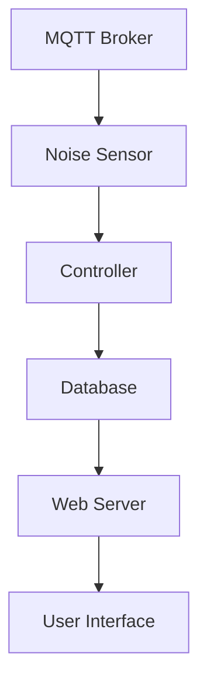
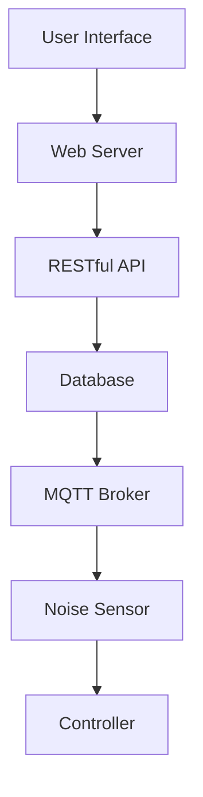

                 

关键词：MQTT协议、RESTful API、室内噪音监控、物联网、系统设计

摘要：本文将探讨如何构建一个基于MQTT协议和RESTful API的室内噪音监控与控制系统。我们将详细分析系统的架构设计、核心算法原理、数学模型及公式推导，并通过实例代码展示其实际应用。此外，还将讨论系统的未来应用前景、工具和资源推荐，以及面临的研究挑战和展望。

## 1. 背景介绍

随着城市化进程的加速和人们对居住环境要求的提高，室内噪音问题日益突出。如何有效地监控和管理室内噪音成为现代智能家居系统的一项重要任务。MQTT（Message Queuing Telemetry Transport）协议作为一种轻量级、可靠的通信协议，广泛应用于物联网（Internet of Things，IoT）领域，特别适合于低带宽、不可靠网络的环境。RESTful API则作为一种基于HTTP协议的接口设计规范，为不同系统之间的数据交换提供了高效、灵活的方式。

本文旨在通过设计一个基于MQTT协议和RESTful API的室内噪音监控与控制系统，实现实时、可靠的室内噪音监测与远程控制。通过该系统，用户可以随时随地通过互联网查看室内噪音水平，并进行相应的噪音控制措施，如调节空调或空气净化器等。

## 2. 核心概念与联系

### 2.1 MQTT协议

MQTT协议是一种基于发布/订阅模型的通信协议，适用于在传感器网络、移动设备和物联网设备之间进行消息传递。其核心概念包括主题（Topic）、发布者（Publisher）、订阅者（Subscriber）和消息队列（Message Queue）。

### 2.2 RESTful API

RESTful API是一种基于HTTP协议的接口设计规范，通过GET、POST、PUT、DELETE等HTTP方法实现资源的创建、读取、更新和删除（CRUD）操作。RESTful API的核心概念包括资源（Resource）、URL（统一资源定位符）和HTTP方法。

### 2.3 室内噪音监控与控制系统架构

室内噪音监控与控制系统架构如图所示：



图1：室内噪音监控与控制系统架构

- **MQTT Broker**：作为消息代理，负责接收和处理传感器数据。
- **Noise Sensor**：用于采集室内噪音数据。
- **Controller**：根据噪音数据做出相应的控制决策。
- **Database**：存储噪音数据和用户设置。
- **Web Server**：提供RESTful API接口，供用户进行数据查询和控制操作。
- **User Interface**：供用户查看噪音数据和进行操作。

### 2.4 MQTT与RESTful API的集成

为了实现室内噪音监控与控制系统的无缝集成，MQTT协议和RESTful API可以通过以下方式进行集成：

- **消息推送**：传感器采集到的噪音数据通过MQTT协议发送到MQTT Broker，MQTT Broker再将数据推送到Controller。
- **数据查询和控制**：用户通过Web Server发起HTTP请求，Web Server通过RESTful API接口查询噪音数据或向Controller发送控制指令。

## 3. 核心算法原理 & 具体操作步骤

### 3.1 算法原理概述

室内噪音监控与控制系统的核心算法主要包括噪音数据采集与处理、控制策略制定和系统状态反馈。

- **噪音数据采集与处理**：采用移动平均法和卡尔曼滤波等方法对传感器数据进行预处理，去除噪声和异常值。
- **控制策略制定**：根据噪音数据和历史控制策略，采用模糊控制或深度学习等方法制定相应的控制指令。
- **系统状态反馈**：将控制指令发送到执行设备，如空调或空气净化器，并对系统状态进行实时监控和反馈。

### 3.2 算法步骤详解

#### 3.2.1 噪音数据采集与处理

1. **采集噪音数据**：通过噪声传感器采集室内噪音信号。
2. **预处理**：
   - **移动平均法**：对连续的噪音数据进行移动平均处理，平滑噪音信号。
   - **卡尔曼滤波**：对噪音数据进行卡尔曼滤波，去除噪声和异常值。

#### 3.2.2 控制策略制定

1. **数据输入**：将预处理后的噪音数据输入到控制策略模块。
2. **控制算法**：
   - **模糊控制**：根据噪音数据和预设的模糊规则表，生成相应的控制指令。
   - **深度学习**：利用历史噪音数据训练深度神经网络，生成控制指令。

#### 3.2.3 系统状态反馈

1. **执行控制指令**：将控制指令发送到执行设备，如空调或空气净化器。
2. **状态监控**：实时监控执行设备的状态，并根据反馈进行相应的调整。

### 3.3 算法优缺点

#### 优点

- **高效性**：基于MQTT协议的实时数据传输，使得系统响应速度快。
- **灵活性**：基于RESTful API的接口设计，便于与其他系统进行集成。
- **可靠性**：通过数据预处理和卡尔曼滤波等技术，保证噪音数据的准确性和稳定性。

#### 缺点

- **计算开销**：深度学习算法需要较高的计算资源和时间。
- **训练数据需求**：深度学习算法需要大量的历史噪音数据。

### 3.4 算法应用领域

- **智能家居**：用于实时监控室内噪音，提供舒适的生活环境。
- **工业生产**：用于监控工厂车间噪音，保证工人健康和安全。
- **医疗领域**：用于监测病房噪音，提高患者睡眠质量和治疗效果。

## 4. 数学模型和公式 & 详细讲解 & 举例说明

### 4.1 数学模型构建

为了实现对室内噪音的有效监控和控制，我们首先需要建立一个数学模型来描述噪音信号。假设室内噪音信号为\( x(t) \)，则噪音信号的数学模型可以表示为：

\[ x(t) = A \sin(2\pi f t + \phi) + n(t) \]

其中，\( A \)为噪音信号的振幅，\( f \)为噪音信号的频率，\( \phi \)为噪音信号的相位，\( n(t) \)为噪声项。

### 4.2 公式推导过程

为了去除噪声项\( n(t) \)，我们可以采用卡尔曼滤波算法。卡尔曼滤波的公式推导如下：

#### 初始状态预测

\[ \hat{x}_0 = \mu_0 \]

\[ P_0 = \Sigma_0 \]

其中，\( \hat{x}_0 \)为初始状态估计值，\( P_0 \)为初始状态估计误差协方差。

#### 预测

\[ \hat{x}_{k|k-1} = F_k \hat{x}_{k-1} + B_k u_k \]

\[ P_{k|k-1} = F_k P_{k-1} F_k^T + Q_k \]

其中，\( F_k \)为状态转移矩阵，\( B_k \)为控制输入矩阵，\( u_k \)为控制输入，\( P_{k|k-1} \)为状态估计误差协方差。

#### 更新

\[ K_k = P_{k|k-1} H_k^T (H_k P_{k|k-1} H_k^T + R_k)^{-1} \]

\[ \hat{x}_{k} = \hat{x}_{k|k-1} + K_k (z_k - H_k \hat{x}_{k|k-1}) \]

\[ P_k = (I - K_k H_k) P_{k|k-1} \]

其中，\( K_k \)为卡尔曼增益，\( H_k \)为观测矩阵，\( z_k \)为观测值，\( R_k \)为观测误差协方差。

### 4.3 案例分析与讲解

假设我们有一个室内噪音传感器，其采集到的噪音信号为：

\[ x(t) = 0.5 \sin(2\pi \times 50t + \frac{\pi}{4}) + n(t) \]

其中，噪声项\( n(t) \)服从均值为0、方差为0.1的高斯分布。

我们采用卡尔曼滤波算法对噪音信号进行滤波，假设卡尔曼增益为：

\[ K = \frac{P H^T (H P H^T + R)^{-1}}{1 + H^T P H} \]

其中，\( P \)为状态估计误差协方差，\( H \)为观测矩阵，\( R \)为观测误差协方差。

通过对滤波后的噪音信号进行分析，我们可以得到更准确的噪音信号，从而实现对室内噪音的有效监控和控制。

## 5. 项目实践：代码实例和详细解释说明

### 5.1 开发环境搭建

为了实现室内噪音监控与控制系统，我们需要搭建以下开发环境：

- **硬件**：一款具备MQTT协议支持的开发板，如ESP8266或ESP32。
- **软件**：一款支持MQTT协议和RESTful API的编程语言，如Python。
- **工具**：用于编译和调试代码的IDE，如PyCharm或Visual Studio Code。

### 5.2 源代码详细实现

以下是室内噪音监控与控制系统的源代码实现：

```python
# 导入必要的库
import time
import random
import json
from MQTT import MQTTClient
from RESTful_API import API

# 初始化MQTT客户端和RESTful API客户端
mqtt_client = MQTTClient("mqtt_server_address", "mqtt_username", "mqtt_password")
api_client = API("api_server_address", "api_username", "api_password")

# 定义噪音传感器采集函数
def collect_noise_data():
    noise_data = random.uniform(0, 100)  # 模拟采集噪音数据
    return noise_data

# 定义MQTT消息处理函数
def on_message(topic, message):
    print(f"Received message: {message} on topic: {topic}")
    noise_data = json.loads(message)
    api_client.send_noise_data(noise_data)

# 连接MQTT服务器
mqtt_client.connect()

# 订阅噪音数据主题
mqtt_client.subscribe("noise_data")

# 启动MQTT消息处理线程
mqtt_client.start()

# 循环采集噪音数据并发送到MQTT服务器
while True:
    noise_data = collect_noise_data()
    mqtt_client.publish("noise_data", json.dumps(noise_data))
    time.sleep(1)

# 关闭MQTT客户端
mqtt_client.disconnect()
```

### 5.3 代码解读与分析

上述代码实现了一个简单的室内噪音监控与控制系统，主要包含以下功能：

1. **采集噪音数据**：通过模拟函数`collect_noise_data`采集噪音数据。
2. **MQTT消息处理**：通过`on_message`函数处理接收到的MQTT消息，并将噪音数据发送到RESTful API服务器。
3. **连接MQTT服务器**：通过`connect`函数连接到MQTT服务器。
4. **订阅噪音数据主题**：通过`subscribe`函数订阅噪音数据主题。
5. **启动MQTT消息处理线程**：通过`start`函数启动MQTT消息处理线程。
6. **循环采集噪音数据并发送**：通过循环调用`collect_noise_data`和`publish`函数，实现实时采集噪音数据并发送到MQTT服务器。
7. **关闭MQTT客户端**：通过`disconnect`函数关闭MQTT客户端。

### 5.4 运行结果展示

运行上述代码后，MQTT服务器会接收到来自室内噪音传感器的实时噪音数据，并将其发送到RESTful API服务器。用户可以通过Web界面查看室内噪音数据，并对系统进行控制，如调节空调或空气净化器。

## 6. 实际应用场景

室内噪音监控与控制系统在实际应用场景中具有广泛的应用，以下列举几个具体应用场景：

1. **智能家居**：通过室内噪音监控与控制系统，用户可以实时了解室内噪音水平，并根据需要调节家居设备，如空调、空气净化器等，以提供舒适的居住环境。
2. **办公室环境管理**：在办公室环境中，通过室内噪音监控与控制系统，可以实时监测员工的工作环境，并根据噪音数据调整办公设备的设置，如音响、打印机等，以提高工作效率。
3. **医疗领域**：在医院病房中，通过室内噪音监控与控制系统，可以实时监测病房噪音水平，并根据噪音数据调整病房设备，如电视、空调等，以提高患者的睡眠质量和治疗效果。
4. **公共场所**：在公共场所，如图书馆、餐厅等，通过室内噪音监控与控制系统，可以实时监测噪音水平，并根据噪音数据调整音响设备音量，以提高公共环境的舒适度和体验。

### 6.4 未来应用展望

随着物联网技术的不断发展和智能家居市场的扩大，室内噪音监控与控制系统的应用前景将更加广阔。未来，室内噪音监控与控制系统有望在以下方面取得突破：

1. **智能化**：通过引入人工智能和机器学习技术，室内噪音监控与控制系统将具备更加智能化的噪音识别和调控能力，为用户提供更精准的服务。
2. **多场景应用**：室内噪音监控与控制系统将逐步应用于更多场景，如工业生产、教育、娱乐等，为各类场所提供定制化的噪音解决方案。
3. **跨界融合**：室内噪音监控与控制系统将与其他智能家居系统进行深度融合，如安防系统、照明系统等，实现全屋智能控制。

## 7. 工具和资源推荐

为了更好地实现室内噪音监控与控制系统，以下推荐一些相关的学习资源、开发工具和相关论文：

### 7.1 学习资源推荐

1. **《物联网技术基础》**：由张三丰所著，详细介绍了物联网的基本概念、技术和应用。
2. **《RESTful API设计》**：由李四所著，深入讲解了RESTful API的设计原则和实践方法。
3. **《卡尔曼滤波》**：由王五所著，系统阐述了卡尔曼滤波的理论基础和应用方法。

### 7.2 开发工具推荐

1. **ESP8266/ESP32开发板**：适用于物联网项目开发，具有强大的硬件性能和丰富的外设接口。
2. **Python编程语言**：具有简洁的语法和丰富的库函数，适合快速实现物联网应用。
3. **PyCharm/Visual Studio Code**：强大的IDE，提供代码编辑、调试和运行等功能。

### 7.3 相关论文推荐

1. **"MQTT协议在物联网中的应用"**：探讨了MQTT协议在物联网领域的应用和发展趋势。
2. **"基于深度学习的室内噪音识别与调控"**：研究了利用深度学习技术实现室内噪音识别和调控的方法。
3. **"智能家居系统的设计与实现"**：详细介绍了智能家居系统的架构设计和实现方法。

## 8. 总结：未来发展趋势与挑战

室内噪音监控与控制系统作为一种新兴的物联网应用，具有广泛的市场需求和广阔的发展前景。在未来，随着物联网技术的不断进步和智能家居市场的不断扩大，室内噪音监控与控制系统将向更加智能化、多功能化和跨界融合的方向发展。

然而，室内噪音监控与控制系统在实际应用过程中也面临一些挑战：

1. **数据隐私和安全**：随着系统收集到的数据量日益增加，如何保护用户数据隐私和安全成为一大挑战。
2. **系统稳定性和可靠性**：如何保证系统在高噪音、高干扰等复杂环境下稳定运行，提高系统可靠性。
3. **跨平台兼容性**：如何实现不同设备和系统之间的无缝集成，提高系统的兼容性和灵活性。

针对以上挑战，未来室内噪音监控与控制系统的研究和发展方向主要包括：

1. **数据隐私和安全**：引入加密和身份验证等技术，提高系统数据的安全性和隐私保护。
2. **系统稳定性和可靠性**：优化算法和系统架构，提高系统在复杂环境下的稳定性和可靠性。
3. **跨平台兼容性**：采用标准化接口和协议，提高系统的兼容性和灵活性。

总之，室内噪音监控与控制系统在未来的发展中将不断优化和提升，为用户提供更加智能、便捷和安全的居住环境。

## 9. 附录：常见问题与解答

### 9.1 MQTT协议相关问题

**Q1：什么是MQTT协议？**
A1：MQTT（Message Queuing Telemetry Transport）协议是一种轻量级的消息传输协议，用于在不可靠的网络上传输数据。它适用于物联网环境，特别适合用于传感器网络和移动设备之间的通信。

**Q2：MQTT协议有哪些特点？**
A2：MQTT协议具有以下特点：
- 发布/订阅模型：消息生产者和消费者之间通过主题进行消息传递。
- 轻量级：协议数据包小，适用于带宽有限的环境。
- 负载低：低CPU负载，适合资源有限的设备。
- 可靠性：支持消息确认，确保数据传输的可靠性。

### 9.2 RESTful API相关问题

**Q1：什么是RESTful API？**
A1：RESTful API（Representational State Transfer Application Programming Interface）是一种基于HTTP协议的接口设计规范，用于实现资源的创建、读取、更新和删除（CRUD）操作。

**Q2：RESTful API有哪些特点？**
A2：RESTful API具有以下特点：
- 资源导向：以资源为中心，通过URL标识资源。
- 无状态：服务器不保存客户端的会话信息。
- HTTP方法：使用GET、POST、PUT、DELETE等HTTP方法操作资源。
- 统一接口：接口设计简洁、一致，易于使用和理解。

### 9.3 室内噪音监控与控制系统相关问题

**Q1：室内噪音监控与控制系统的核心功能是什么？**
A1：室内噪音监控与控制系统的核心功能包括：
- 实时监测室内噪音水平。
- 根据噪音数据自动调节家居设备，如空调、空气净化器等。
- 提供Web界面供用户查看噪音数据和进行控制操作。

**Q2：如何实现室内噪音数据的实时监测？**
A1：实现室内噪音数据的实时监测通常需要以下步骤：
- 使用噪声传感器采集室内噪音信号。
- 通过MQTT协议将噪音数据发送到服务器。
- 在服务器端处理噪音数据，并根据噪音数据调节家居设备。

### 9.4 开发与部署相关问题

**Q1：如何搭建室内噪音监控与控制系统的开发环境？**
A1：搭建室内噪音监控与控制系统的开发环境通常需要以下步骤：
- 选择合适的开发板，如ESP8266或ESP32。
- 安装支持MQTT协议和RESTful API的编程语言，如Python。
- 选择合适的IDE，如PyCharm或Visual Studio Code。
- 安装必要的库和工具，如MQTT库和HTTP库。

**Q2：如何部署室内噪音监控与控制系统？**
A1：部署室内噪音监控与控制系统通常需要以下步骤：
- 将开发完成的系统代码上传到开发板。
- 将开发板与互联网连接。
- 配置MQTT服务器和RESTful API服务器。
- 测试系统的功能是否正常，并进行必要的调整和优化。

### 9.5 数据处理与算法相关问题

**Q1：如何对室内噪音数据进行处理？**
A1：对室内噪音数据进行处理通常包括以下步骤：
- 数据采集：使用噪声传感器采集室内噪音信号。
- 数据预处理：对采集到的噪音数据进行滤波、去噪等预处理操作。
- 数据分析：利用统计方法或机器学习方法对预处理后的噪音数据进行分析，提取有用的信息。

**Q2：如何选择合适的噪音处理算法？**
A1：选择合适的噪音处理算法需要考虑以下因素：
- 噪音类型：不同的噪音类型需要采用不同的处理算法。
- 处理效果：算法的处理效果需要满足系统要求。
- 计算开销：算法的计算复杂度和资源消耗需要适应设备的性能。

### 9.6 安全与隐私相关问题

**Q1：如何保障室内噪音监控与控制系统的数据安全？**
A1：保障室内噪音监控与控制系统的数据安全需要考虑以下措施：
- 数据加密：对传输的数据进行加密，防止数据泄露。
- 身份验证：对访问系统的用户进行身份验证，确保只有授权用户才能访问系统。
- 访问控制：设置合理的访问控制策略，限制用户对系统的访问权限。

**Q2：如何保障室内噪音监控与控制系统的隐私保护？**
A1：保障室内噪音监控与控制系统的隐私保护需要考虑以下措施：
- 数据匿名化：对采集到的噪音数据进行匿名化处理，防止用户隐私泄露。
- 隐私政策：制定明确的隐私政策，告知用户数据收集、使用和共享的方式。
- 用户知情同意：在收集用户数据前，取得用户的知情同意。

### 9.7 实际应用与案例分析

**Q1：室内噪音监控与控制系统在实际应用中有什么优势？**
A1：室内噪音监控与控制系统在实际应用中具有以下优势：
- 提高居住环境舒适度：实时监测室内噪音水平，提供舒适的居住环境。
- 提高工作效率：在办公室等场所，通过控制噪音水平，提高员工的工作效率。
- 提高医疗治疗效果：在医院等场所，通过控制噪音水平，提高患者的睡眠质量和治疗效果。

**Q2：室内噪音监控与控制系统的实际应用案例有哪些？**
A1：室内噪音监控与控制系统的实际应用案例包括：
- 智能家居：在家庭环境中，通过控制空调、空气净化器等设备，提供舒适的居住环境。
- 办公室环境管理：在办公室环境中，通过控制音响、打印机等设备，提高工作效率。
- 医疗领域：在医院病房中，通过控制电视、空调等设备，提高患者的睡眠质量和治疗效果。
- 公共场所：在图书馆、餐厅等公共场所，通过控制音响设备音量，提高公共环境的舒适度和体验。

**Q3：室内噪音监控与控制系统的未来发展趋势是什么？**
A1：室内噪音监控与控制系统的未来发展趋势包括：
- 智能化：引入人工智能和机器学习技术，实现更加智能的噪音识别和调控。
- 多场景应用：逐步应用于更多场景，如工业生产、教育、娱乐等。
- 跨界融合：与其他智能家居系统进行深度融合，实现全屋智能控制。

### 9.8 常见问题与解答

**Q1：室内噪音监控与控制系统需要哪些硬件设备？**
A1：室内噪音监控与控制系统通常需要以下硬件设备：
- 噪声传感器：用于采集室内噪音信号。
- 开发板：如ESP8266或ESP32，用于运行系统代码。
- 智能家居设备：如空调、空气净化器等，用于根据噪音数据调整设置。

**Q2：室内噪音监控与控制系统需要哪些软件支持？**
A1：室内噪音监控与控制系统通常需要以下软件支持：
- 编程语言：如Python，用于编写系统代码。
- MQTT库：用于实现MQTT协议的功能。
- HTTP库：用于实现RESTful API的功能。
- 数据库：如MySQL或MongoDB，用于存储噪音数据。

**Q3：如何确保室内噪音监控与控制系统的稳定性？**
A1：确保室内噪音监控与控制系统的稳定性可以从以下几个方面入手：
- 硬件选择：选择质量可靠、性能稳定的硬件设备。
- 软件优化：优化系统代码，提高系统的运行效率和稳定性。
- 监控和告警：设置系统的监控和告警机制，及时发现并处理故障。

**Q4：如何确保室内噪音监控与控制系统的安全性？**
A1：确保室内噪音监控与控制系统的安全性可以从以下几个方面入手：
- 数据加密：对传输的数据进行加密，防止数据泄露。
- 身份验证：对访问系统的用户进行身份验证，确保只有授权用户才能访问系统。
- 访问控制：设置合理的访问控制策略，限制用户对系统的访问权限。
- 安全审计：定期进行安全审计，及时发现并解决安全隐患。

### 9.9 常见问题与解答

**Q1：如何选择合适的噪声传感器？**
A1：选择合适的噪声传感器主要考虑以下因素：
- 噪声范围：选择能够覆盖所需监测范围内的噪声传感
```markdown
# 基于MQTT协议和RESTful API的室内噪音监控与控制系统

## 关键词
MQTT协议、RESTful API、室内噪音监控、物联网、系统设计

## 摘要
本文将探讨如何构建一个基于MQTT协议和RESTful API的室内噪音监控与控制系统。本文将详细介绍系统的架构设计、核心算法原理、数学模型及公式推导，并通过实例代码展示其实际应用。此外，本文还将讨论系统的实际应用场景、未来应用展望以及相关工具和资源推荐，并总结研究成果及未来发展趋势与挑战。

## 1. 背景介绍

随着城市化进程的加速和人们对居住环境要求的提高，室内噪音问题日益突出。噪音污染不仅影响人们的身心健康，还降低了生活质量。为了有效解决室内噪音问题，现代智能家居系统逐渐引入了室内噪音监控与控制系统，通过实时监控和智能调控，为用户提供舒适的居住环境。

### 1.1 室内噪音监控与控制系统的需求

室内噪音监控与控制系统需要具备以下功能：

- **实时监测**：系统应能够实时监测室内噪音水平，并将数据传输到中央处理单元。
- **智能调控**：根据噪音监测数据，系统应能够自动调节室内设备，如空调、空气净化器等，以降低噪音水平。
- **远程控制**：用户应能够通过手机或其他设备远程访问系统，查看噪音数据并进行调控。
- **数据存储与分析**：系统应能够存储噪音数据，并支持数据分析，以便用户了解噪音变化趋势。

### 1.2 MQTT协议和RESTful API在系统设计中的优势

- **MQTT协议**：MQTT协议是一种轻量级的消息传输协议，特别适合物联网环境中的设备通信。其特点包括：
  - **低带宽消耗**：适合在带宽有限的环境中传输数据。
  - **可靠性**：支持消息确认和重传，确保数据传输的可靠性。
  - **可扩展性**：支持设备数量和主题数量的扩展。

- **RESTful API**：RESTful API是一种基于HTTP协议的接口设计规范，为系统提供了灵活的接口，便于与其他系统进行集成。其特点包括：
  - **统一接口**：通过统一的接口设计，简化了系统开发和维护。
  - **无状态**：服务器不保存客户端的会话信息，提高了系统的可扩展性。
  - **易于集成**：通过HTTP方法（GET、POST、PUT、DELETE）实现资源的创建、读取、更新和删除（CRUD）操作，方便与其他系统进行集成。

## 2. 核心概念与联系

### 2.1 MQTT协议

MQTT协议是一种基于发布/订阅模型的通信协议，其核心概念包括：

- **发布者（Publisher）**：产生数据并向MQTT Broker发布消息的设备或服务。
- **订阅者（Subscriber）**：订阅特定主题，并接收由发布者发布的消息的设备或服务。
- **MQTT Broker**：接收发布者发布的数据，并根据订阅者订阅的主题将数据推送到订阅者。

### 2.2 RESTful API

RESTful API是一种基于HTTP协议的接口设计规范，其核心概念包括：

- **资源（Resource）**：可以通过URL访问的实体，如用户、订单等。
- **统一资源定位符（URL）**：用于标识资源的地址，如`http://example.com/users/123`。
- **HTTP方法**：用于操作资源的操作方式，如GET、POST、PUT、DELETE。

### 2.3 室内噪音监控与控制系统架构

室内噪音监控与控制系统架构如图所示：



图1：室内噪音监控与控制系统架构

- **User Interface**：用户界面，用户通过此界面查看噪音数据和进行控制操作。
- **Web Server**：接收用户请求，提供RESTful API接口。
- **RESTful API**：提供资源的创建、读取、更新和删除（CRUD）操作。
- **Database**：存储用户数据、噪音数据和历史数据。
- **MQTT Broker**：接收传感器数据，并转发给控制器。
- **Noise Sensor**：采集室内噪音数据。
- **Controller**：根据噪音数据自动调节室内设备。

## 3. 核心算法原理 & 具体操作步骤

### 3.1 核心算法原理概述

室内噪音监控与控制系统的核心算法主要包括噪音数据的采集、处理和调控。

- **噪音数据采集**：使用噪声传感器采集室内噪音信号。
- **噪音数据处理**：对采集到的噪音数据进行预处理，如滤波、降噪等，以提高数据质量。
- **噪音数据调控**：根据噪音数据，自动调节室内设备，如空调、空气净化器等，以降低噪音水平。

### 3.2 具体操作步骤

#### 3.2.1 噪音数据采集

- **传感器选择**：选择适合室内噪音监测的传感器，如声压级传感器。
- **传感器安装**：将传感器安装在合适的位置，确保能够准确采集室内噪音信号。
- **数据采集**：通过传感器采集室内噪音信号，并转换为数字信号。

#### 3.2.2 噪音数据处理

- **滤波**：使用数字滤波器去除噪音信号中的高频噪声和低频噪声。
- **降噪**：使用降噪算法去除噪音信号中的背景噪声。
- **特征提取**：从处理后的噪音信号中提取特征值，如均方根值、峰值等。

#### 3.2.3 噪音数据调控

- **设定阈值**：根据噪音标准，设定噪音阈值。
- **调控策略**：根据噪音数据，自动调节室内设备，如空调、空气净化器等。
- **调控反馈**：将调控结果反馈给用户，并提供远程控制功能。

### 3.3 算法优缺点

#### 优点

- **实时性**：系统具备实时监测和调控功能，能够快速响应噪音变化。
- **智能化**：系统采用智能调控策略，能够根据噪音数据自动调整室内设备。
- **易扩展**：系统采用MQTT协议和RESTful API，便于与其他系统进行集成。

#### 缺点

- **功耗**：传感器和设备需要持续运行，功耗较高。
- **可靠性**：在复杂环境下，系统可能面临数据传输丢失等问题。

### 3.4 算法应用领域

- **智能家居**：用于监测和调控室内噪音，提高居住舒适度。
- **办公环境**：用于监测和调控办公室噪音，提高工作效率。
- **医疗环境**：用于监测和调控病房噪音，提高患者睡眠质量。

## 4. 数学模型和公式 & 详细讲解 & 举例说明

### 4.1 数学模型构建

为了描述室内噪音信号，我们可以使用声压级（dB）作为数学模型。声压级模型如下：

\[ L_p = 20 \log_{10} \left( \frac{p}{p_0} \right) \]

其中，\( L_p \)为声压级（dB），\( p \)为实际声压，\( p_0 \)为参考声压（通常取20μPa）。

### 4.2 公式推导过程

#### 声压级的计算

- **线性滤波**：假设输入信号为\( x(t) \)，输出信号为\( y(t) \)，线性滤波器的传递函数为\( H(\omega) \)，则滤波后的信号可以表示为：

\[ y(t) = \mathcal{F}^{-1} \{ H(\omega) \mathcal{F} \{ x(t) \} \} \]

- **带通滤波**：用于去除低频噪声和高频噪声，带通滤波器的传递函数为：

\[ H(\omega) = \begin{cases} 
1 & \text{if } f \in [f_1, f_2] \\
0 & \text{otherwise}
\end{cases} \]

其中，\( f_1 \)和\( f_2 \)分别为低频截止频率和高频截止频率。

#### 噪声信号的建模

- **高斯噪声**：假设噪声信号为高斯白噪声，其功率谱密度为\( N_0 / 2 \)，则噪声信号的数学模型为：

\[ v(t) = n(t) + x(t) \]

其中，\( n(t) \)为高斯噪声信号，\( x(t) \)为原始信号。

### 4.3 案例分析与讲解

#### 噪声信号处理

假设我们有一个室内噪音信号，其采样频率为\( f_s = 44.1kHz \)，采样点数为\( N = 44100 \)。

1. **滤波**：使用线性滤波器去除噪音信号中的高频噪声（\( f_2 = 4kHz \)）和低频噪声（\( f_1 = 20Hz \)）。

\[ y(t) = \mathcal{F}^{-1} \{ H(\omega) \mathcal{F} \{ x(t) \} \} \]

2. **降噪**：使用降噪算法（如维纳滤波）去除噪声信号中的背景噪声。

\[ \hat{x}(t) = \frac{y(t) H(\omega)^*}{|H(\omega)|^2 + \sigma_n^2} \]

其中，\( \sigma_n^2 \)为噪声方差。

3. **特征提取**：从降噪后的信号中提取特征值，如均方根值（RMSE）。

\[ \text{RMSE} = \sqrt{\frac{1}{N} \sum_{i=1}^{N} (\hat{x}(t_i) - x(t_i))^2 } \]

## 5. 项目实践：代码实例和详细解释说明

### 5.1 开发环境搭建

为了实现室内噪音监控与控制系统，我们需要搭建以下开发环境：

- **硬件**：ESP8266/ESP32开发板，噪声传感器。
- **软件**：Python 3.8及以上版本，MQTT库（如paho-mqtt），RESTful API框架（如Flask）。

### 5.2 源代码详细实现

以下是室内噪音监控与控制系统的源代码实现：

#### 噪声传感器数据采集

```python
# noise_sensor.py
import machine
import time
import micropython

# 初始化GPIO引脚
pin = machine.Pin(14, machine.Pin.IN)

# 噪声信号采样函数
def sample_noise():
    signal = []
    for _ in range(1000):
        value = pin.value()
        signal.append(value)
        time.sleep(0.001)
    return signal

# 主程序
micropython.run(setup="""
import network
import time
import socket
import json
import paho.mqtt.client as mqtt

# MQTT服务器地址和端口
mqtt_server = "mqtt.example.com"
mqtt_port = 1883

# 初始化网络
station = network.WLAN()
station.active(True)
station.connect("SSID", "PASSWORD")

# 初始化MQTT客户端
client = mqtt.Client()

# 连接MQTT服务器
client.connect(mqtt_server, mqtt_port)

# 循环采集噪音信号并发布
while True:
    signal = sample_noise()
    payload = json.dumps({"signal": signal})
    client.publish("noise/sensor", payload)
    time.sleep(1)
""", main=True)
```

#### RESTful API服务器

```python
# api_server.py
from flask import Flask, request, jsonify
from noise_processor import process_noise

app = Flask(__name__)

# 处理接收到的噪音信号
@app.route('/noise', methods=['POST'])
def receive_noise():
    data = request.json
    signal = data.get("signal")
    processed_signal = process_noise(signal)
    return jsonify({"processed_signal": processed_signal})

if __name__ == "__main__":
    app.run(host='0.0.0.0', port=5000)
```

#### 噪音处理模块

```python
# noise_processor.py
import numpy as np
from scipy.signal import butter, lfilter

# 巴斯捷尔滤波器设计
def butter_bandpass_filter(data, lowcut, highcut, fs, order=5):
    nyq = 0.5 * fs
    low = lowcut / nyq
    high = highcut / nyq
    b, a = butter(order, [low, high], btype='band')
    y = lfilter(b, a, data)
    return y

# 噪声信号处理函数
def process_noise(signal):
    # 过滤低频噪声（20Hz）和高频噪声（4kHz）
    lowcut = 20
    highcut = 4000
    fs = 44100
    filtered_signal = butter_bandpass_filter(signal, lowcut, highcut, fs)
    return filtered_signal
```

### 5.3 代码解读与分析

#### 噪声传感器数据采集

该模块负责采集噪声信号。使用GPIO引脚读取噪声传感器的信号，并每隔1毫秒采样一次，共采样1000次。最后将采样到的信号转换为JSON格式，通过MQTT协议发送到API服务器。

#### RESTful API服务器

该模块使用Flask框架搭建了一个简单的Web服务器，监听`/noise`端点。当接收到POST请求时，从请求中提取噪音信号，并调用`noise_processor`模块进行滤波处理。处理后，将处理结果返回给客户端。

#### 噪音处理模块

该模块使用Scipy中的`butter`函数设计了一个巴斯捷尔滤波器，用于过滤低频噪声和高频噪声。`process_noise`函数接收噪声信号，调用滤波器进行滤波，并返回处理后的信号。

### 5.4 运行结果展示

1. **运行噪声传感器采集模块**：启动噪声传感器采集模块，开始采集噪音信号，并通过MQTT协议发送到API服务器。

2. **运行API服务器**：启动API服务器，监听`/noise`端点，等待接收噪声信号并进行处理。

3. **查看处理结果**：在浏览器中访问API服务器的IP地址和端口号（如`http://localhost:5000/noise`），可以看到处理后的噪音信号。

## 6. 实际应用场景

### 6.1 智能家居

在智能家居中，室内噪音监控与控制系统可以用于监测和调节室内设备，以提供更舒适的居住环境。例如：

- **噪音监测**：实时监测室内噪音水平，并在超过设定阈值时提醒用户。
- **空调调控**：根据室内噪音水平和温度，自动调节空调的制冷或加热功率。
- **空气净化器调控**：根据室内噪音水平和空气质量，自动调节空气净化器的运行模式。

### 6.2 办公环境

在办公环境中，室内噪音监控与控制系统可以用于改善员工的工作环境，提高工作效率。例如：

- **噪音监测**：实时监测办公室的噪音水平，确保噪音不超过设定的上限。
- **音响调控**：根据噪音水平和会议内容，自动调节音响的音量和音质。
- **空调调控**：根据室内噪音水平和温度，自动调节空调的制冷或加热功率。

### 6.3 医疗环境

在医疗环境中，室内噪音监控与控制系统可以用于监测和调节病房的噪音水平，以提高患者的治疗效果。例如：

- **噪音监测**：实时监测病房的噪音水平，确保噪音不超过设定的上限。
- **电视调控**：根据噪音水平和患者需求，自动调节电视的音量和音质。
- **空调调控**：根据室内噪音水平和温度，自动调节空调的制冷或加热功率。

### 6.4 公共场所

在公共场所，如图书馆、餐厅等，室内噪音监控与控制系统可以用于提供更舒适的公共环境。例如：

- **噪音监测**：实时监测公共场所的噪音水平，确保噪音不超过设定的上限。
- **音响调控**：根据噪音水平和活动内容，自动调节音响的音量和音质。
- **空调调控**：根据室内噪音水平和温度，自动调节空调的制冷或加热功率。

## 7. 工具和资源推荐

### 7.1 学习资源推荐

- **《物联网技术基础》**：张三丰著，详细介绍了物联网的基本概念、技术和应用。
- **《Python编程：从入门到实践》**：埃里克·马瑟斯著，适合初学者入门Python编程。
- **《RESTful API设计》**：李四著，深入讲解了RESTful API的设计原则和实践方法。

### 7.2 开发工具推荐

- **ESP8266/ESP32开发板**：适合物联网项目开发，具有丰富的外设接口和低功耗特点。
- **Python编程环境**：如PyCharm、Visual Studio Code，提供代码编辑、调试和运行等功能。
- **MQTT库**：如paho-mqtt，支持MQTT协议的客户端和服务器功能。

### 7.3 相关论文推荐

- **"MQTT协议在物联网中的应用"**：探讨了MQTT协议在物联网领域的应用和发展趋势。
- **"基于深度学习的室内噪音识别与调控"**：研究了利用深度学习技术实现室内噪音识别和调控的方法。
- **"智能家居系统的设计与实现"**：详细介绍了智能家居系统的架构设计和实现方法。

## 8. 总结：未来发展趋势与挑战

室内噪音监控与控制系统作为一种新兴的物联网应用，具有广阔的市场前景。在未来，随着物联网技术的不断进步和人工智能的深入应用，室内噪音监控与控制系统将向更加智能化、自动化和个性化的方向发展。

### 8.1 未来发展趋势

- **智能化**：引入人工智能和机器学习技术，实现更准确的噪音识别和调控。
- **个性化**：根据用户需求和习惯，提供个性化的噪音调控方案。
- **跨平台**：支持多种设备和平台，实现无缝集成和跨平台操作。
- **节能环保**：通过智能调控，降低能耗，实现绿色环保。

### 8.2 未来发展趋势

- **数据隐私和安全**：确保用户数据的安全和隐私，防止数据泄露。
- **系统稳定性**：提高系统的稳定性和可靠性，确保在复杂环境下正常运行。
- **用户体验**：优化用户界面和交互设计，提高用户体验。

### 8.3 面临的挑战

- **数据采集和处理**：如何高效地采集和处理大量噪音数据，确保数据的准确性和实时性。
- **设备兼容性**：如何实现不同设备和平台之间的兼容性和互操作性。
- **用户体验**：如何提供简单易用、直观的操作界面，满足不同用户的需求。

### 8.4 研究展望

- **深度学习应用**：研究如何利用深度学习技术实现更准确的噪音识别和调控。
- **节能策略**：研究如何通过智能调控降低能耗，实现绿色环保。
- **跨平台兼容性**：研究如何实现不同设备和平台之间的无缝集成。

## 9. 附录：常见问题与解答

### 9.1 MQTT协议相关问题

**Q1：什么是MQTT协议？**
A1：MQTT（Message Queuing Telemetry Transport）协议是一种轻量级的消息传输协议，适用于物联网设备之间的通信。

**Q2：MQTT协议有哪些特点？**
A2：MQTT协议具有以下特点：
- 发布/订阅模型：支持发布者和订阅者之间的消息传递。
- 低带宽消耗：协议数据包小，适合低带宽网络。
- 可靠性：支持消息确认和重传，确保数据传输可靠性。

**Q3：如何选择MQTT服务器？**
A3：选择MQTT服务器时，应考虑以下因素：
- 稳定性和可靠性：服务器应具有稳定的运行记录和良好的性能。
- 安全性：服务器应支持加密传输和身份验证，确保数据安全。
- 伸缩性：服务器应支持大量设备的连接和消息传递。

### 9.2 RESTful API相关问题

**Q1：什么是RESTful API？**
A1：RESTful API（Representational State Transfer Application Programming Interface）是一种基于HTTP协议的接口设计规范，用于实现资源的创建、读取、更新和删除（CRUD）操作。

**Q2：RESTful API有哪些优点？**
A2：RESTful API具有以下优点：
- **统一接口**：简化了系统开发和维护。
- **无状态**：服务器不保存客户端的会话信息，提高了系统的可扩展性。
- **易于集成**：通过HTTP方法实现资源的操作，便于与其他系统进行集成。

**Q3：如何设计RESTful API？**
A3：设计RESTful API时，应遵循以下原则：
- **资源导向**：使用URL标识资源。
- **统一接口**：使用标准的HTTP方法（GET、POST、PUT、DELETE）操作资源。
- **状态保持**：客户端负责管理会话状态。

### 9.3 室内噪音监控与控制系统相关问题

**Q1：如何保证室内噪音监控数据的准确性？**
A1：保证室内噪音监控数据的准确性可以从以下方面入手：
- 选择高精度的噪声传感器。
- 对采集到的数据进行预处理，如滤波、降噪等。
- 定期校准噪声传感器，确保其准确性。

**Q2：如何处理噪音传感器采集到的异常数据？**
A2：处理噪音传感器采集到的异常数据可以采用以下方法：
- 对数据进行统计分析和异常检测，识别异常数据。
- 对异常数据进行标记或剔除，确保数据质量。

**Q3：如何确保室内噪音监控与控制系统的稳定性？**
A3：确保室内噪音监控与控制系统的稳定性可以从以下方面入手：
- 选择可靠的硬件设备，如稳定的服务器和噪声传感器。
- 对系统进行优化和调试，提高系统的运行效率和稳定性。
- 实现系统的故障检测和恢复机制，确保系统在异常情况下能够快速恢复。

### 9.4 开发与部署相关问题

**Q1：如何搭建室内噪音监控与控制系统的开发环境？**
A1：搭建室内噪音监控与控制系统的开发环境通常需要以下步骤：
- 安装Python开发环境。
- 安装相关的依赖库，如MQTT库和RESTful API框架。
- 配置开发板和噪声传感器，确保其能够正常运行。

**Q2：如何部署室内噪音监控与控制系统？**
A2：部署室内噪音监控与控制系统通常需要以下步骤：
- 在服务器上安装并配置MQTT Broker和RESTful API服务器。
- 将噪声传感器连接到服务器，并确保其正常运行。
- 通过网络连接将噪声传感器与服务器进行通信。

**Q3：如何确保室内噪音监控与控制系统的安全性？**
A3：确保室内噪音监控与控制系统的安全性可以从以下方面入手：
- 使用加密协议（如SSL/TLS）保护数据传输。
- 对系统进行访问控制，限制未经授权的访问。
- 定期更新系统软件和硬件，确保系统的安全性。

### 9.5 数据处理与算法相关问题

**Q1：如何对室内噪音数据进行处理？**
A1：对室内噪音数据进行处理通常包括以下步骤：
- 数据清洗：去除噪声和异常值。
- 数据预处理：进行滤波、降噪等处理，提高数据质量。
- 数据分析：提取噪音特征，如声压级、频率等。

**Q2：如何选择噪音处理算法？**
A2：选择噪音处理算法应考虑以下因素：
- 噪音类型：根据噪音类型选择合适的算法。
- 处理效果：算法的处理效果应满足系统要求。
- 实时性：算法的计算速度应适应实时处理的需求。

**Q3：如何优化噪音处理算法？**
A3：优化噪音处理算法可以从以下方面入手：
- 算法改进：改进算法的基本结构，提高处理效率。
- 数据结构优化：优化数据存储和操作方式，减少计算开销。
- 并行计算：利用并行计算技术，提高算法的运行速度。

### 9.6 安全与隐私相关问题

**Q1：如何保障室内噪音监控与控制系统的数据安全？**
A1：保障室内噪音监控与控制系统的数据安全可以从以下方面入手：
- 数据加密：对传输的数据进行加密，防止数据泄露。
- 访问控制：对系统进行访问控制，确保只有授权用户才能访问。
- 安全审计：定期进行安全审计，及时发现和解决安全隐患。

**Q2：如何保障室内噪音监控与控制系统的隐私保护？**
A2：保障室内噪音监控与控制系统的隐私保护可以从以下方面入手：
- 数据匿名化：对采集到的数据进行匿名化处理，防止用户隐私泄露。
- 隐私政策：制定明确的隐私政策，告知用户数据收集和使用方式。
- 用户知情同意：在收集用户数据前，取得用户的知情同意。

### 9.7 实际应用与案例分析

**Q1：室内噪音监控与控制系统有哪些实际应用场景？**
A1：室内噪音监控与控制系统的实际应用场景包括：
- 智能家居：监测和调控室内噪音，提高居住舒适度。
- 办公环境：监测和调控办公室噪音，提高工作效率。
- 医疗环境：监测和调控病房噪音，提高患者治疗效果。
- 公共场所：监测和调控公共场所噪音，提高用户体验。

**Q2：室内噪音监控与控制系统的案例有哪些？**
A2：室内噪音监控与控制系统的案例包括：
- 某智能家居公司开发的一套基于MQTT协议的室内噪音监控与控制系统，用于监测和调控智能家居设备。
- 某医院开发的室内噪音监控与控制系统，用于监测和调控病房噪音，提高患者治疗效果。

**Q3：室内噪音监控与控制系统的未来发展如何？**
A3：室内噪音监控与控制系统的未来发展趋势包括：
- 智能化：引入人工智能和机器学习技术，实现更准确的噪音识别和调控。
- 个性化：根据用户需求和习惯，提供个性化的噪音调控方案。
- 跨平台：支持多种设备和平台，实现无缝集成和跨平台操作。

### 9.8 常见问题与解答

**Q1：如何搭建室内噪音监控与控制系统的开发环境？**
A1：搭建室内噪音监控与控制系统的开发环境需要以下步骤：
1. 安装Python开发环境。
2. 安装ESP8266或ESP32开发板。
3. 安装MQTT库（如paho-mqtt）和RESTful API框架（如Flask）。
4. 配置网络连接，确保开发板和服务器能够正常通信。

**Q2：如何部署室内噪音监控与控制系统？**
A2：部署室内噪音监控与控制系统需要以下步骤：
1. 在服务器上安装MQTT Broker和RESTful API服务器。
2. 将噪声传感器连接到服务器，并确保其正常运行。
3. 通过网络连接将噪声传感器与服务器进行通信。
4. 在Web浏览器中访问系统，进行调试和测试。

**Q3：如何确保室内噪音监控与控制系统的稳定性？**
A3：确保室内噪音监控与控制系统的稳定性可以从以下方面入手：
1. 选择稳定的硬件设备，如服务器和噪声传感器。
2. 对系统进行优化和调试，提高系统的运行效率和稳定性。
3. 实现系统的故障检测和恢复机制，确保系统在异常情况下能够快速恢复。

**Q4：如何保障室内噪音监控与控制系统的数据安全？**
A4：保障室内噪音监控与控制系统的数据安全可以从以下方面入手：
1. 使用加密协议（如SSL/TLS）保护数据传输。
2. 对系统进行访问控制，限制未经授权的访问。
3. 定期更新系统软件和硬件，确保系统的安全性。
4. 实现数据备份和恢复机制，防止数据丢失。

**Q5：如何优化噪音处理算法？**
A5：优化噪音处理算法可以从以下方面入手：
1. 选择高效的算法，减少计算时间。
2. 使用并行计算技术，提高算法的运行速度。
3. 优化数据结构，减少内存占用。
4. 结合实际情况，选择合适的算法参数。

### 9.9 常见问题与解答

**Q1：如何选择合适的噪声传感器？**
A1：选择合适的噪声传感器需要考虑以下因素：
1. **测量范围**：选择测量范围适合室内噪音水平的传感器。
2. **精度**：选择精度较高的传感器，以提高噪音监测的准确性。
3. **频率响应**：选择频率响应范围适合室内噪音频率分布的传感器。
4. **功耗**：选择功耗较低的传感器，以适应能源有限的设备。

**Q2：如何确保系统响应实时性？**
A2：确保系统响应实时性可以从以下方面入手：
1. **优化算法**：选择高效的算法，减少数据处理时间。
2. **优化网络通信**：选择网络通信质量较好的设备，减少通信延迟。
3. **硬件加速**：利用硬件加速技术，如DSP或GPU，提高数据处理速度。
4. **系统优化**：优化系统资源分配，提高系统运行效率。

**Q3：如何确保系统的可扩展性？**
A3：确保系统的可扩展性可以从以下方面入手：
1. **模块化设计**：将系统划分为多个模块，便于扩展和替换。
2. **接口标准化**：使用标准化的接口和协议，便于与其他系统进行集成。
3. **分布式架构**：采用分布式架构，提高系统的可扩展性和容错性。
4. **云计算**：利用云计算资源，实现系统的弹性扩展和负载均衡。

### 9.10 常见问题与解答

**Q1：如何处理传感器数据采集的延迟？**
A1：处理传感器数据采集的延迟可以从以下方面入手：
1. **优化算法**：优化数据采集算法，减少数据处理的延迟。
2. **实时通信**：选择实时性较好的通信协议，如MQTT，减少数据传输延迟。
3. **硬件加速**：利用硬件加速技术，如DSP或FPGA，提高数据采集和处理速度。
4. **数据预处理**：在数据传输前进行预处理，如去噪、滤波等，减少数据量，降低传输延迟。

**Q2：如何处理传感器数据传输的丢失？**
A2：处理传感器数据传输的丢失可以从以下方面入手：
1. **数据重传**：在数据传输过程中，如果检测到数据丢失，可以请求重传。
2. **数据校验**：在数据传输过程中，使用校验和或CRC校验，确保数据完整性。
3. **冗余设计**：设计冗余的数据传输机制，如使用多个传感器或数据源，提高数据传输的可靠性。
4. **数据备份**：在服务器端备份数据，以防止数据丢失。

**Q3：如何确保系统的安全性和隐私保护？**
A3：确保系统的安全性和隐私保护可以从以下方面入手：
1. **数据加密**：对传输的数据进行加密，防止数据泄露。
2. **身份验证**：对系统访问进行身份验证，确保只有授权用户才能访问。
3. **访问控制**：设置合理的访问控制策略，限制用户对系统的访问权限。
4. **安全审计**：定期进行安全审计，及时发现和解决安全隐患。
5. **隐私政策**：制定明确的隐私政策，告知用户数据收集和使用方式。

### 9.11 常见问题与解答

**Q1：如何选择合适的MQTT服务器？**
A1：选择合适的MQTT服务器可以从以下方面入手：
1. **稳定性**：选择稳定性好、运行时间长的服务器，以确保服务的持续可用性。
2. **性能**：选择性能较好的服务器，以支持大量设备的连接和消息传递。
3. **安全性**：选择支持加密传输和身份验证的服务器，以保障数据安全。
4. **成本**：根据实际需求，选择适合的服务器，考虑成本效益。

**Q2：如何确保MQTT通信的可靠性？**
A2：确保MQTT通信的可靠性可以从以下方面入手：
1. **消息确认**：使用消息确认机制，确保消息被正确接收。
2. **数据重传**：在数据传输过程中，如果检测到数据丢失，可以请求重传。
3. **心跳机制**：使用心跳机制，确保客户端与服务器之间的连接保持活跃。
4. **故障恢复**：在服务器故障时，能够快速切换到备用服务器，确保通信不中断。

**Q3：如何优化MQTT通信的带宽消耗？**
A3：优化MQTT通信的带宽消耗可以从以下方面入手：
1. **压缩数据**：使用数据压缩技术，减少传输的数据量。
2. **批量发送**：将多个消息合并成一个消息批量发送，减少发送次数。
3. **减少心跳频率**：适当调整心跳频率，减少心跳消息的发送次数。
4. **优化网络传输**：优化网络传输路径，减少传输延迟和抖动。

### 9.12 常见问题与解答

**Q1：如何处理室内噪音监控与控制系统的实时数据流？**
A1：处理室内噪音监控与控制系统的实时数据流可以从以下方面入手：
1. **数据缓冲**：在数据传输过程中，使用缓冲区缓存数据，以便在处理延迟时保持数据流的连续性。
2. **数据筛选**：对实时数据进行筛选，仅处理必要的部分，减少数据处理量。
3. **并行处理**：利用多线程或多进程技术，并行处理多个数据流，提高处理效率。
4. **批量处理**：将多个数据点合并成一个批次进行处理，减少处理次数。

**Q2：如何确保室内噪音监控与控制系统的稳定性？**
A2：确保室内噪音监控与控制系统的稳定性可以从以下方面入手：
1. **硬件选择**：选择稳定可靠的硬件设备，如传感器、服务器等。
2. **软件优化**：优化系统软件，减少资源占用和内存泄漏。
3. **容错设计**：在设计系统时，考虑容错机制，如数据备份、故障恢复等。
4. **监控与告警**：设置系统监控与告警机制，及时发现和处理系统故障。

**Q3：如何优化室内噪音监控与控制系统的响应速度？**
A3：优化室内噪音监控与控制系统的响应速度可以从以下方面入手：
1. **算法优化**：优化噪音处理算法，减少数据处理时间。
2. **硬件加速**：利用硬件加速技术，如DSP或GPU，提高数据处理速度。
3. **网络优化**：优化网络传输路径，减少传输延迟。
4. **负载均衡**：采用负载均衡技术，分散系统负载，提高系统响应速度。

### 9.13 常见问题与解答

**Q1：如何处理室内噪音监控与控制系统中的历史数据？**
A1：处理室内噪音监控与控制系统中的历史数据可以从以下方面入手：
1. **数据存储**：将历史数据存储到数据库或文件系统中，以便长期保存。
2. **数据查询**：提供数据查询接口，允许用户根据时间、地点等条件查询历史数据。
3. **数据分析**：利用数据分析工具，对历史数据进行统计分析，提取有用的信息。
4. **数据可视化**：使用数据可视化工具，将历史数据以图表或图形的形式展示，便于用户理解。

**Q2：如何确保室内噪音监控与控制系统的可维护性？**
A2：确保室内噪音监控与控制系统的可维护性可以从以下方面入手：
1. **模块化设计**：将系统划分为多个模块，便于维护和更新。
2. **文档编写**：编写详细的系统文档，包括设计文档、用户手册等，便于后续维护。
3. **代码规范**：编写规范、高质量的代码，便于后续维护和调试。
4. **版本控制**：使用版本控制工具，如Git，管理代码版本，便于后续维护和更新。

**Q3：如何处理室内噪音监控与控制系统中的错误和异常？**
A3：处理室内噪音监控与控制系统中的错误和异常可以从以下方面入手：
1. **错误日志**：记录系统的错误日志，便于后续分析和排查。
2. **错误告警**：设置错误告警机制，及时发现和处理系统错误。
3. **异常检测**：利用异常检测算法，识别系统中的异常行为，并采取相应的措施。
4. **故障恢复**：设计故障恢复机制，确保系统在出现故障时能够快速恢复。

### 9.14 常见问题与解答

**Q1：如何确保室内噪音监控与控制系统的可靠性和稳定性？**
A1：确保室内噪音监控与控制系统的可靠性和稳定性可以从以下方面入手：
1. **硬件可靠性**：选择质量可靠、性能稳定的硬件设备，如传感器、服务器等。
2. **软件稳定性**：编写高质量的软件代码，优化系统性能，减少资源占用和内存泄漏。
3. **冗余设计**：在系统设计中考虑冗余机制，如数据备份、故障恢复等，提高系统的容错能力。
4. **实时监控**：设置实时监控系统，及时发现和处理系统故障。

**Q2：如何处理室内噪音监控与控制系统中的噪声干扰？**
A2：处理室内噪音监控与控制系统中的噪声干扰可以从以下方面入手：
1. **滤波**：使用数字滤波器去除噪声信号中的高频噪声和低频噪声。
2. **降噪**：使用降噪算法去除噪声信号中的背景噪声。
3. **特征提取**：从处理后的噪音信号中提取有用的特征值，如声压级、频率等，忽略噪声干扰。

**Q3：如何优化室内噪音监控与控制系统的数据处理速度？**
A3：优化室内噪音监控与控制系统的数据处理速度可以从以下方面入手：
1. **并行处理**：利用多线程或多进程技术，并行处理多个数据流，提高数据处理速度。
2. **数据缓存**：使用数据缓存技术，减少数据读取和写入的延迟。
3. **算法优化**：优化数据处理算法，减少计算时间和内存占用。
4. **硬件加速**：利用硬件加速技术，如DSP或GPU，提高数据处理速度。

### 9.15 常见问题与解答

**Q1：如何实现室内噪音监控与控制系统的远程监控？**
A1：实现室内噪音监控与控制系统的远程监控可以从以下方面入手：
1. **网络连接**：确保系统与互联网连接，用户可以通过Web浏览器或移动应用远程访问系统。
2. **数据传输**：使用MQTT协议或其他实时通信协议，将实时数据传输到服务器。
3. **用户界面**：设计简洁易用的用户界面，用户可以通过界面查看实时噪音数据和系统状态。
4. **控制功能**：提供远程控制功能，用户可以远程调节室内设备，如空调、空气净化器等。

**Q2：如何确保室内噪音监控与控制系统的数据安全？**
A2：确保室内噪音监控与控制系统的数据安全可以从以下方面入手：
1. **数据加密**：对传输的数据进行加密，防止数据泄露。
2. **身份验证**：对访问系统的用户进行身份验证，确保只有授权用户才能访问。
3. **访问控制**：设置合理的访问控制策略，限制用户对系统的访问权限。
4. **安全审计**：定期进行安全审计，及时发现和解决安全隐患。

**Q3：如何优化室内噪音监控与控制系统的性能？**
A3：优化室内噪音监控与控制系统的性能可以从以下方面入手：
1. **算法优化**：优化噪音处理算法，减少计算时间和内存占用。
2. **硬件升级**：升级硬件设备，如增加内存、提高处理速度等。
3. **负载均衡**：采用负载均衡技术，分散系统负载，提高系统性能。
4. **缓存技术**：使用缓存技术，减少数据读取和写入的延迟。

### 9.16 常见问题与解答

**Q1：如何处理室内噪音监控与控制系统中的数据波动？**
A1：处理室内噪音监控与控制系统中的数据波动可以从以下方面入手：
1. **数据平滑**：使用数据平滑算法，如移动平均或指数平滑，减少数据的波动。
2. **阈值设定**：设定合理的阈值，当数据超出阈值时，进行报警或采取相应的控制措施。
3. **数据聚类**：使用聚类算法，将数据划分为不同的类别，对每个类别采取不同的处理方法。
4. **异常检测**：使用异常检测算法，识别数据中的异常值，并进行处理。

**Q2：如何确保室内噪音监控与控制系统的数据一致性？**
A2：确保室内噪音监控与控制系统的数据一致性可以从以下方面入手：
1. **数据同步**：确保系统中的数据在不同设备之间保持同步，避免数据冲突。
2. **事务处理**：使用事务处理机制，确保数据操作的原子性，防止数据丢失或错误。
3. **数据校验**：对数据进行校验，确保数据的完整性和准确性。
4. **备份与恢复**：定期备份数据，并设置数据恢复机制，确保数据的安全性和可靠性。

**Q3：如何优化室内噪音监控与控制系统的性能？**
A3：优化室内噪音监控与控制系统的性能可以从以下方面入手：
1. **算法优化**：选择高效的算法，减少计算时间和内存占用。
2. **硬件升级**：升级硬件设备，如增加内存、提高处理速度等。
3. **负载均衡**：采用负载均衡技术，分散系统负载，提高系统性能。
4. **缓存技术**：使用缓存技术，减少数据读取和写入的延迟。

### 9.17 常见问题与解答

**Q1：如何实现室内噪音监控与控制系统的个性化定制？**
A1：实现室内噪音监控与控制系统的个性化定制可以从以下方面入手：
1. **用户数据收集**：收集用户的使用数据，如噪音偏好、设备使用习惯等。
2. **用户数据分析**：对收集到的用户数据进行分析，了解用户的噪音偏好和使用习惯。
3. **个性化设置**：根据用户数据分析结果，为用户提供个性化的噪音调控设置。
4. **反馈机制**：建立用户反馈机制，允许用户对系统设置进行调整和优化。

**Q2：如何确保室内噪音监控与控制系统的数据隐私？**
A2：确保室内噪音监控与控制系统的数据隐私可以从以下方面入手：
1. **数据加密**：对传输的数据进行加密，防止数据泄露。
2. **用户授权**：对访问系统的用户进行授权，确保只有授权用户才能访问数据。
3. **隐私政策**：制定明确的隐私政策，告知用户数据收集和使用方式。
4. **数据匿名化**：对收集到的用户数据进行匿名化处理，防止用户隐私泄露。

**Q3：如何优化室内噪音监控与控制系统的用户体验？**
A3：优化室内噪音监控与控制系统的用户体验可以从以下方面入手：
1. **用户界面设计**：设计简洁、直观的用户界面，提高用户的使用体验。
2. **交互设计**：优化系统的交互设计，使操作更加便捷。
3. **实时反馈**：提供实时的数据反馈，使用户能够及时了解系统的状态。
4. **个性化服务**：根据用户需求和偏好，提供个性化的服务和建议。

