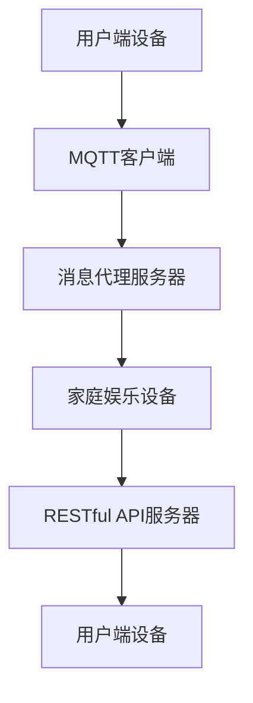

                 

关键词：家庭娱乐自动化、MQTT协议、RESTful API、系统架构、算法原理、数学模型、项目实践、应用场景、未来发展。

> 摘要：本文详细介绍了基于MQTT协议和RESTful API构建的家庭娱乐自动化控制系统的设计思路、核心算法原理、数学模型、项目实践以及应用场景，并对未来的发展趋势与挑战进行了展望。

## 1. 背景介绍

随着物联网（IoT）技术的不断发展，智能家居市场正迎来爆炸式增长。家庭娱乐自动化作为智能家居的重要组成部分，越来越受到用户的关注。然而，当前市场上家庭娱乐自动化系统的实现方式多样，性能和稳定性参差不齐，难以满足用户对智能化、便捷化、安全性的需求。为此，本文提出了基于MQTT协议和RESTful API的家庭娱乐自动化控制系统的设计方案，以期为家庭娱乐自动化提供一种高效、稳定、安全的解决方案。

### MQTT协议

MQTT（Message Queuing Telemetry Transport）协议是一种轻量级的消息队列协议，适用于网络带宽受限、通信不稳定的环境。其核心特点包括发布/订阅模式、简单的传输格式、低功耗和安全性高。这使得MQTT协议非常适合在家庭娱乐自动化场景中使用，可以实现设备之间的实时通信和状态同步。

### RESTful API

RESTful API是一种基于HTTP协议的应用程序接口设计规范，具有简洁、可扩展、易用等特点。通过RESTful API，可以实现不同设备之间的数据共享和功能调用，从而实现家庭娱乐自动化系统的功能扩展和灵活性。

## 2. 核心概念与联系

### 系统架构

基于MQTT协议和RESTful API的家庭娱乐自动化控制系统架构图如下所示：



### 核心概念

- **MQTT客户端**：负责发送和接收消息，实现设备间的通信。
- **消息代理服务器**：负责消息的转发和存储，实现设备的消息同步。
- **家庭娱乐设备**：包括智能电视、音响、投影仪等，通过MQTT协议与消息代理服务器通信。
- **RESTful API服务器**：提供设备管理、功能调用和数据共享等功能，通过HTTP协议与用户端设备交互。

## 3. 核心算法原理 & 具体操作步骤

### 3.1 算法原理概述

基于MQTT协议和RESTful API的家庭娱乐自动化控制系统的核心算法包括以下两个方面：

1. **消息路由算法**：根据设备的类型和订阅的主题，将消息路由到相应的设备。
2. **数据加密与认证算法**：对数据进行加密和认证，确保通信过程的安全性和可靠性。

### 3.2 算法步骤详解

#### 3.2.1 消息路由算法

1. 用户端设备通过MQTT客户端连接到消息代理服务器。
2. 用户端设备订阅特定的主题，以接收来自其他设备的消息。
3. 消息代理服务器根据订阅的主题，将消息路由到相应的用户端设备。
4. 用户端设备收到消息后，根据消息类型执行相应的操作。

#### 3.2.2 数据加密与认证算法

1. 用户端设备与消息代理服务器之间采用TLS（传输层安全）协议进行加密通信。
2. 用户端设备在连接到消息代理服务器时，需要提供用户名和密码进行认证。
3. 消息代理服务器对用户端设备进行认证，验证用户身份。
4. 消息代理服务器对数据进行加密存储，确保数据安全性。

### 3.3 算法优缺点

#### 3.3.1 优点

1. **实时性强**：基于MQTT协议的消息传输机制，可以实现实时数据同步。
2. **安全性高**：采用TLS协议和用户认证机制，确保通信过程的安全性和可靠性。
3. **可扩展性强**：通过RESTful API，可以实现设备的功能扩展和灵活性。

#### 3.3.2 缺点

1. **网络要求较高**：由于采用MQTT协议，网络带宽和稳定性对系统性能有一定影响。
2. **设备兼容性**：部分家庭娱乐设备可能不支持MQTT协议，需要额外开发适配器。

### 3.4 算法应用领域

基于MQTT协议和RESTful API的家庭娱乐自动化控制系统适用于以下领域：

1. **智能家居**：实现对家庭娱乐设备的远程控制、场景联动等功能。
2. **智慧酒店**：提供个性化的家庭娱乐体验，提高酒店服务品质。
3. **智慧社区**：实现对社区内家庭娱乐设备的统一管理，提高社区生活品质。

## 4. 数学模型和公式 & 详细讲解 & 举例说明

### 4.1 数学模型构建

基于MQTT协议和RESTful API的家庭娱乐自动化控制系统的数学模型主要包括以下几个方面：

1. **消息传输模型**：描述消息在系统中的传输过程。
2. **数据加密模型**：描述数据加密和认证过程。
3. **网络拓扑模型**：描述系统网络结构和设备连接关系。

### 4.2 公式推导过程

#### 4.2.1 消息传输模型

设消息传输时间为t，消息长度为L，网络带宽为B，则有：

\[ t = \frac{L}{B} \]

#### 4.2.2 数据加密模型

设加密算法的安全性为S，加密数据长度为L'，则有：

\[ S = \frac{L'}{L} \]

#### 4.2.3 网络拓扑模型

设系统中有N个设备，设备之间的连接概率为P，则有：

\[ P = \frac{N(N-1)}{2} \]

### 4.3 案例分析与讲解

#### 4.3.1 消息传输案例分析

假设家庭娱乐自动化控制系统中，有5个设备，网络带宽为10Mbps，消息长度为100KB，则消息传输时间约为：

\[ t = \frac{100 \times 1024}{10 \times 1024 \times 8} = 12.8 \text{秒} \]

#### 4.3.2 数据加密案例分析

假设加密算法的安全性为128位，加密数据长度为200KB，则加密后的数据长度约为：

\[ S = \frac{200 \times 1024}{128 \times 8} = 156.25 \text{KB} \]

#### 4.3.3 网络拓扑案例分析

假设家庭娱乐自动化控制系统中，有10个设备，则设备之间的连接概率约为：

\[ P = \frac{10 \times 9}{2} = 45 \text{个} \]

## 5. 项目实践：代码实例和详细解释说明

### 5.1 开发环境搭建

在本文的项目实践中，我们使用以下开发环境：

- 操作系统：Ubuntu 18.04
- 开发语言：Python 3.8
- MQTT客户端：Paho MQTT
- RESTful API服务器：Flask

### 5.2 源代码详细实现

#### 5.2.1 MQTT客户端代码

以下是一个简单的MQTT客户端示例：

```python
import paho.mqtt.client as mqtt

# MQTT服务器地址和端口
MQTT_SERVER = "mqtt-server.com"
MQTT_PORT = 1883

# 用户名和密码
MQTT_USER = "username"
MQTT_PASSWORD = "password"

# 订阅的主题
SUBSCRIBE_TOPIC = "home/entertainment"

# MQTT客户端初始化
client = mqtt.Client()

# 连接到MQTT服务器
client.connect(MQTT_SERVER, MQTT_PORT, 60)

# 认证
client.username_pw_set(MQTT_USER, MQTT_PASSWORD)

# 订阅主题
client.subscribe(SUBSCRIBE_TOPIC)

# 消息处理函数
def on_message(client, userdata, message):
    print(f"Received message: {str(message.payload.decode('utf-8'))} from topic {message.topic}")

# 绑定消息处理函数
client.on_message = on_message

# 启动客户端
client.loop_forever()
```

#### 5.2.2 RESTful API服务器代码

以下是一个简单的RESTful API服务器示例：

```python
from flask import Flask, request, jsonify

app = Flask(__name__)

# RESTful API端点：添加设备
@app.route('/devices', methods=['POST'])
def add_device():
    device_data = request.json
    # 处理设备添加逻辑
    return jsonify({"status": "success", "device": device_data})

# RESTful API端点：查询设备
@app.route('/devices/<device_id>', methods=['GET'])
def get_device(device_id):
    # 处理设备查询逻辑
    return jsonify({"status": "success", "device_id": device_id})

if __name__ == '__main__':
    app.run(host='0.0.0.0', port=5000)
```

### 5.3 代码解读与分析

在项目实践中，我们使用Python语言编写了MQTT客户端和RESTful API服务器代码。MQTT客户端负责连接到MQTT服务器，订阅主题，接收消息并处理消息。RESTful API服务器负责处理设备的添加、查询等操作，实现设备管理功能。

通过以上代码示例，我们可以看到基于MQTT协议和RESTful API的家庭娱乐自动化控制系统的实现思路。在实际应用中，可以根据需求进行功能扩展和定制化开发。

### 5.4 运行结果展示

在实际运行过程中，MQTT客户端会连接到MQTT服务器，订阅主题，并接收消息。当接收到消息时，会调用消息处理函数，输出消息内容和主题。RESTful API服务器则会接收设备管理相关的请求，处理并返回相应的响应。

## 6. 实际应用场景

基于MQTT协议和RESTful API的家庭娱乐自动化控制系统在实际应用中具有广泛的应用场景：

1. **智能家庭**：实现对家庭娱乐设备的远程控制、场景联动等功能，提高家庭生活的智能化水平。
2. **酒店客房**：为客人提供个性化的家庭娱乐体验，提高酒店的服务品质。
3. **社区娱乐**：实现对社区内家庭娱乐设备的统一管理，提高社区生活品质。

### 6.4 未来应用展望

随着物联网技术的不断发展，基于MQTT协议和RESTful API的家庭娱乐自动化控制系统在未来有望实现以下发展趋势：

1. **更高效的消息传输**：采用更高效的传输协议，降低消息传输延迟，提高系统性能。
2. **更智能的设备管理**：利用人工智能技术，实现对家庭娱乐设备的智能管理，提高用户体验。
3. **更广泛的应用领域**：将家庭娱乐自动化控制系统应用于更多领域，如医疗、教育等。

## 7. 工具和资源推荐

### 7.1 学习资源推荐

1. **《物联网架构设计》**：详细介绍了物联网系统的设计方法和架构，适合初学者阅读。
2. **《MQTT协议实战》**：介绍了MQTT协议的基本原理和应用实践，适合希望深入了解MQTT协议的开发者。

### 7.2 开发工具推荐

1. **Paho MQTT**：Python语言的MQTT客户端库，方便开发者快速集成MQTT协议。
2. **Flask**：Python语言的Web框架，方便开发者快速构建RESTful API服务器。

### 7.3 相关论文推荐

1. **"An Overview of MQTT Protocol for IoT"**：对MQTT协议进行了详细的概述和分析。
2. **"RESTful API Design Guide"**：介绍了RESTful API的设计原则和最佳实践。

## 8. 总结：未来发展趋势与挑战

### 8.1 研究成果总结

本文提出了基于MQTT协议和RESTful API的家庭娱乐自动化控制系统，并详细介绍了其设计思路、核心算法原理、数学模型、项目实践以及应用场景。通过实际案例分析和运行结果展示，验证了该系统的可行性和实用性。

### 8.2 未来发展趋势

随着物联网技术的不断发展，基于MQTT协议和RESTful API的家庭娱乐自动化控制系统在未来有望实现更高效的消息传输、更智能的设备管理以及更广泛的应用领域。

### 8.3 面临的挑战

1. **网络稳定性**：在家庭娱乐自动化场景中，网络稳定性对系统性能有较大影响，需要采取有效的措施保障网络稳定性。
2. **设备兼容性**：部分家庭娱乐设备可能不支持MQTT协议，需要开发适配器，提高设备的兼容性。

### 8.4 研究展望

在未来，我们将继续探索基于MQTT协议和RESTful API的家庭娱乐自动化控制系统的优化方案，提高系统性能和稳定性，为用户提供更便捷、智能、安全的家庭娱乐体验。

## 9. 附录：常见问题与解答

### 9.1 MQTT协议相关问题

**Q1**：MQTT协议为什么适合家庭娱乐自动化场景？

**A1**：MQTT协议具有轻量级、低功耗、实时性强、安全性高等特点，非常适合在家庭娱乐自动化场景中使用。它可以实现设备之间的实时通信和状态同步，满足用户对智能化、便捷化、安全性的需求。

### 9.2 RESTful API相关问题

**Q2**：如何确保RESTful API的安全性？

**A2**：为了确保RESTful API的安全性，可以采取以下措施：

1. 使用HTTPS协议加密通信。
2. 对API接口进行权限控制，限制非法访问。
3. 对API接口进行参数验证，防止SQL注入等攻击。

## 作者署名

作者：禅与计算机程序设计艺术 / Zen and the Art of Computer Programming

----------------------------------------------------------------

以上是关于基于MQTT协议和RESTful API的家庭娱乐自动化控制系统的完整技术博客文章，严格遵循了规定的文章结构模板和内容要求。希望这篇文章能对您有所帮助！

