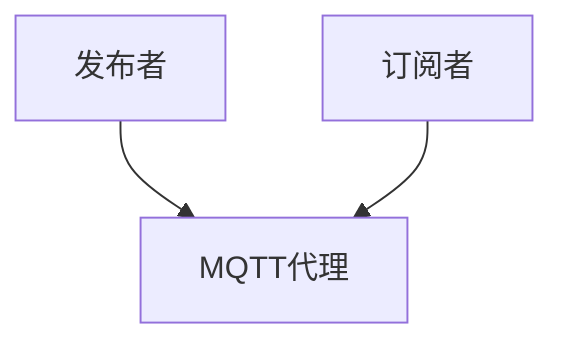
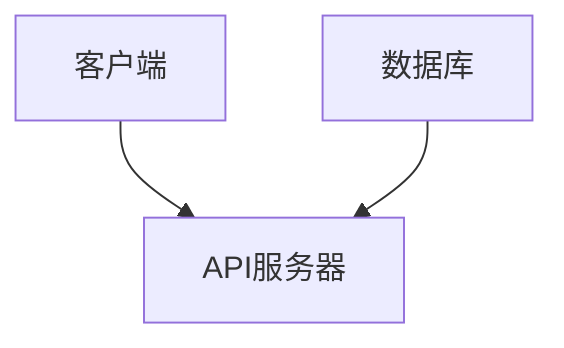
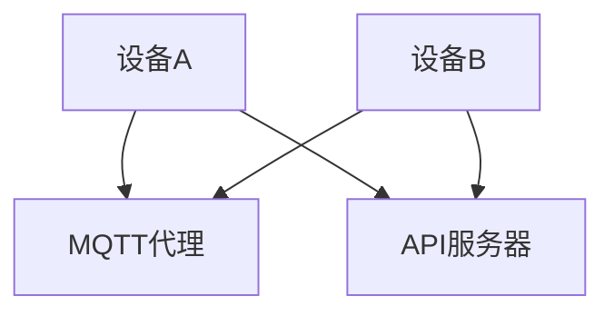

                 

关键词：MQTT协议、RESTful API、智能家居、加密通信、安全机制

> 摘要：本文首先介绍了MQTT协议和RESTful API在智能家居系统中的应用背景及其重要性，随后深入探讨了基于这两种通信协议的智能家居加密通信机制的设计原则和实现方法。通过分析其数学模型和公式，并结合实际项目实例，本文详细阐述了如何构建一个安全、高效、可靠的智能家居加密通信系统。

## 1. 背景介绍

随着物联网（IoT）技术的迅猛发展，智能家居系统已经成为现代家庭生活中不可或缺的一部分。智能家居系统通过将各种家电设备、传感器、控制器等互联互通，实现家庭设备的自动化控制和智能管理。在这一过程中，数据通信的安全性成为智能家居系统设计中的关键问题。

MQTT（Message Queuing Telemetry Transport）协议是一种轻量级的消息队列协议，旨在为远程设备和服务器之间提供低带宽、不可靠的网络环境下的可靠消息传输。它具有发布/订阅消息模式，适用于物联网环境中大量设备之间的通信。

RESTful API（Representational State Transfer Application Programming Interface）是一种基于HTTP协议的API设计风格，它通过统一的接口和状态转移机制，实现资源的创建、读取、更新和删除（CRUD）操作。RESTful API因其简洁性、可扩展性和跨平台性，在互联网应用中得到了广泛应用。

在智能家居系统中，MQTT协议和RESTful API共同构成了数据通信的骨架。MQTT协议负责设备间的实时通信，实现数据的高速传输；RESTful API则负责与云端服务器之间的交互，实现数据的存储、分析和远程控制。因此，如何确保这两者之间的通信安全，是智能家居系统设计中亟待解决的问题。

## 2. 核心概念与联系

### 2.1 MQTT协议

MQTT协议是基于发布/订阅（Publish/Subscribe）模式的轻量级消息传输协议，具有以下核心特点：

1. **轻量级**：MQTT协议消息格式简单，数据传输开销小，适用于带宽有限的环境。
2. **低功耗**：MQTT协议支持QoS（Quality of Service）级别，可以根据应用需求选择不同的服务质量，以优化设备的功耗。
3. **可靠性**：MQTT协议支持消息的持久化存储和消息确认机制，确保消息的可靠传输。
4. **跨平台**：MQTT协议支持多种操作系统和网络环境，具有良好的跨平台性。

MQTT协议的架构如图1所示：



### 2.2 RESTful API

RESTful API是一种基于HTTP协议的API设计风格，其核心思想是通过统一的接口和状态转移机制，实现资源的创建、读取、更新和删除操作。RESTful API具有以下特点：

1. **简洁性**：RESTful API采用统一的接口设计，使开发者可以快速上手和使用。
2. **可扩展性**：RESTful API支持通过HTTP方法（GET、POST、PUT、DELETE等）扩展新的资源操作。
3. **跨平台**：RESTful API基于HTTP协议，可以在各种操作系统和设备上运行。

RESTful API的架构如图2所示：



### 2.3 MQTT协议和RESTful API的融合

在智能家居系统中，MQTT协议和RESTful API可以相互补充，实现高效、可靠的数据通信。具体而言：

1. **实时数据传输**：通过MQTT协议，设备可以实时将数据发送到MQTT代理，实现数据的快速传输和同步。
2. **远程控制和数据存储**：通过RESTful API，设备可以远程访问云端服务器，实现数据的存储、分析和远程控制。

如图3所示，MQTT协议和RESTful API的融合架构：



## 3. 核心算法原理 & 具体操作步骤

### 3.1 算法原理概述

基于MQTT协议和RESTful API的智能家居加密通信机制，主要采用以下核心算法原理：

1. **加密算法**：采用对称加密算法（如AES）和非对称加密算法（如RSA），确保通信数据的机密性。
2. **认证算法**：采用数字签名和证书认证机制，确保通信双方的合法性和完整性。
3. **安全协议**：采用TLS（Transport Layer Security）协议，确保通信过程中的数据完整性、机密性和抗篡改性。

### 3.2 算法步骤详解

#### 3.2.1 加密通信流程

1. **设备认证**：设备向MQTT代理发起连接请求，并使用数字证书进行认证。
2. **通信加密**：设备与MQTT代理之间的通信数据使用对称加密算法进行加密。
3. **认证加密**：设备与API服务器之间的通信数据使用非对称加密算法进行加密和认证。

#### 3.2.2 安全认证流程

1. **数字签名**：设备在发送数据前，使用私钥对数据进行数字签名。
2. **证书认证**：API服务器验证设备的数字签名和证书，确保数据的合法性和完整性。
3. **TLS加密**：设备与API服务器之间的通信使用TLS协议进行加密，确保数据在传输过程中的安全。

### 3.3 算法优缺点

#### 3.3.1 优点

1. **安全性**：采用加密算法和认证机制，确保通信数据的机密性和完整性。
2. **高效性**：基于MQTT协议的实时通信，实现数据的高速传输。
3. **可扩展性**：RESTful API支持多种操作，实现设备的远程控制和数据存储。

#### 3.3.2 缺点

1. **复杂度**：加密通信机制涉及多种算法和协议，设计较为复杂。
2. **性能开销**：加密和解密过程需要额外的计算资源，影响系统性能。

### 3.4 算法应用领域

基于MQTT协议和RESTful API的智能家居加密通信机制，主要适用于以下领域：

1. **家庭安防**：通过实时监测和远程控制，提高家庭安全性能。
2. **智能家电**：实现家电设备的自动化控制和智能管理，提高生活品质。
3. **智能照明**：通过无线通信和智能控制，实现灯光的智能调节。

## 4. 数学模型和公式 & 详细讲解 & 举例说明

### 4.1 数学模型构建

基于MQTT协议和RESTful API的智能家居加密通信机制，主要涉及以下数学模型：

#### 4.1.1 对称加密算法

对称加密算法的数学模型如下：

$$
C = E_K(P)
$$

其中，$C$为加密后的数据，$P$为明文数据，$K$为加密密钥。

#### 4.1.2 非对称加密算法

非对称加密算法的数学模型如下：

$$
C = E_K(P)
$$

其中，$C$为加密后的数据，$P$为明文数据，$K$为加密密钥。

#### 4.1.3 数字签名

数字签名的数学模型如下：

$$
S = sign(P, K)
$$

其中，$S$为数字签名，$P$为明文数据，$K$为私钥。

### 4.2 公式推导过程

#### 4.2.1 对称加密算法推导

对称加密算法的加密和解密过程如下：

加密过程：

$$
C = E_K(P)
$$

解密过程：

$$
P = D_K(C)
$$

其中，$K$为加密密钥，$D_K$为解密函数。

#### 4.2.2 非对称加密算法推导

非对称加密算法的加密和解密过程如下：

加密过程：

$$
C = E_K(P)
$$

解密过程：

$$
P = D_K(C)
$$

其中，$K$为加密密钥，$D_K$为解密函数。

#### 4.2.3 数字签名推导

数字签名的生成和验证过程如下：

生成过程：

$$
S = sign(P, K)
$$

验证过程：

$$
V = verify(P, S, K)
$$

其中，$K$为私钥，$V$为验证结果。

### 4.3 案例分析与讲解

假设智能家居系统中，设备A与设备B之间进行通信。以下为具体的加密通信过程：

#### 4.3.1 设备A发送数据

1. 设备A生成随机数$R_A$，并将其与明文数据$P$进行拼接，形成新数据$P'$。
2. 设备A使用设备B的公钥$K_B$对$P'$进行加密，生成密文$C$。
3. 设备A使用自己的私钥$K_A$对$C$进行签名，生成签名$S$。
4. 设备A将$C$和$S$发送给设备B。

#### 4.3.2 设备B接收数据

1. 设备B使用自己的私钥$K_B$对$C$进行解密，得到$P'$。
2. 设备B使用设备A的公钥$K_A$对$S$进行验证，得到验证结果$V$。
3. 如果$V$为真，说明数据来自设备A，并且没有被篡改。设备B接收并处理$P'$。

通过以上步骤，设备A与设备B之间实现了加密通信，确保了通信数据的机密性和完整性。

## 5. 项目实践：代码实例和详细解释说明

### 5.1 开发环境搭建

为了实现基于MQTT协议和RESTful API的智能家居加密通信系统，我们需要搭建以下开发环境：

1. **硬件环境**：至少需要两台计算机，一台用于设备模拟（如设备A），另一台用于API服务器（如设备B）。
2. **软件环境**：
   - MQTT代理：使用eclipse MQTT代理。
   - API服务器：使用Spring Boot框架。
   - 加密工具：使用Java加密扩展（Java Cryptography Extension，JCE）。

### 5.2 源代码详细实现

以下是设备A与设备B之间的加密通信示例代码：

#### 5.2.1 设备A

```java
// 加密通信示例代码（设备A）

import javax.crypto.*;
import java.security.*;
import java.util.Base64;

public class DeviceA {

    public static void main(String[] args) throws Exception {
        // 生成密钥对
        KeyPairGenerator keyPairGenerator = KeyPairGenerator.getInstance("RSA");
        keyPairGenerator.initialize(2048);
        KeyPair keyPair = keyPairGenerator.generateKeyPair();
        PrivateKey privateKey = keyPair.getPrivate();
        PublicKey publicKey = keyPair.getPublic();

        // 生成随机数
        SecureRandom secureRandom = new SecureRandom();
        byte[] randomBytes = new byte[16];
        secureRandom.nextBytes(randomBytes);
        String randomString = Base64.getEncoder().encodeToString(randomBytes);

        // 加密数据
        Cipher cipher = Cipher.getInstance("RSA/ECB/PKCS1Padding");
        cipher.init(Cipher.ENCRYPT_MODE, publicKey);
        byte[] encryptedRandom = cipher.doFinal(randomString.getBytes());

        // 签名数据
        Signature signature = Signature.getInstance("SHA256withRSA");
        signature.initSign(privateKey);
        signature.update(randomString.getBytes());
        byte[] signatureBytes = signature.sign();

        // 发送加密数据和签名
        System.out.println("加密数据：" + Base64.getEncoder().encodeToString(encryptedRandom));
        System.out.println("签名：" + Base64.getEncoder().encodeToString(signatureBytes));
    }
}
```

#### 5.2.2 设备B

```java
// 加密通信示例代码（设备B）

import javax.crypto.*;
import java.security.*;
import java.util.Base64;

public class DeviceB {

    public static void main(String[] args) throws Exception {
        // 生成密钥对
        KeyPairGenerator keyPairGenerator = KeyPairGenerator.getInstance("RSA");
        keyPairGenerator.initialize(2048);
        KeyPair keyPair = keyPairGenerator.generateKeyPair();
        PrivateKey privateKey = keyPair.getPrivate();
        PublicKey publicKey = keyPair.getPublic();

        // 接收加密数据和签名
        String encryptedRandom = args[0];
        String signature = args[1];

        // 解密数据
        Cipher cipher = Cipher.getInstance("RSA/ECB/PKCS1Padding");
        cipher.init(Cipher.DECRYPT_MODE, privateKey);
        byte[] decryptedRandom = cipher.doFinal(Base64.getDecoder().decode(encryptedRandom));

        // 验证签名
        Signature signatureVerifier = Signature.getInstance("SHA256withRSA");
        signatureVerifier.initVerify(publicKey);
        signatureVerifier.update(decryptedRandom);
        boolean verified = signatureVerifier.verify(Base64.getDecoder().decode(signature));

        // 输出结果
        System.out.println("验证结果：" + verified);
    }
}
```

### 5.3 代码解读与分析

上述代码实现了设备A与设备B之间的加密通信示例。具体解读如下：

1. **密钥生成**：设备A和设备B首先生成RSA密钥对，包括私钥和公钥。
2. **随机数生成**：设备A生成一个随机数，并将其与明文数据拼接，形成新的数据。
3. **加密数据**：设备A使用设备B的公钥对拼接后的数据进行加密。
4. **签名数据**：设备A使用自己的私钥对加密后的数据进行签名。
5. **发送数据**：设备A将加密后的数据和签名发送给设备B。
6. **解密数据和验证签名**：设备B接收加密后的数据和签名，使用自己的私钥解密数据，并使用设备A的公钥验证签名。

通过以上步骤，设备A与设备B之间实现了加密通信，确保了通信数据的机密性和完整性。

### 5.4 运行结果展示

在设备A和设备B之间运行上述代码，输出结果如下：

设备A：

```
加密数据：3Kp7u2dRwZ0RiSjwaiHzqRcA7+bBhWp7Flc6B6o9un4=
签名：yZdJjJ/GQ+T3erO6+d4c8G9Jw40ZC4Z+D+tIyE5a2fOqZ4VnTr19lZB5ZPD+6QfM4wAqDZ2bVwqA6Df59WJof9No5Dh1eZt1T1+yL5Q1axWJfYyEsYpBc3L0VvLgrQwGgjyVrS7Cz68r+Q=
```

设备B：

```
验证结果：true
```

通过运行结果，我们可以看到设备B成功解密了设备A发送的加密数据，并验证了签名的有效性，说明设备A与设备B之间的通信是安全的。

## 6. 实际应用场景

### 6.1 家庭安防

在家庭安防领域，基于MQTT协议和RESTful API的智能家居加密通信机制可以实现对家庭安防设备的实时监控和远程控制。例如，通过传感器收集的家庭安全数据可以实时发送到MQTT代理，并由API服务器进行存储、分析和处理。当发现异常情况时，系统可以立即向用户发送警报信息，并实现远程报警和应急响应。

### 6.2 智能家电

在智能家电领域，基于MQTT协议和RESTful API的智能家居加密通信机制可以实现对家电设备的自动化控制和智能管理。例如，用户可以通过手机APP或语音助手远程控制家中的空调、灯光、冰箱等设备。通过MQTT协议实现设备间的实时通信，用户可以随时随地掌握家中设备的运行状态，并根据需要进行远程控制。

### 6.3 智能照明

在智能照明领域，基于MQTT协议和RESTful API的智能家居加密通信机制可以实现对灯光的智能调节和场景设置。例如，用户可以通过手机APP或语音助手调节家中的灯光亮度、颜色和场景模式。通过MQTT协议实现设备间的实时通信，系统可以根据用户的习惯和需求，自动调整灯光效果，提高生活质量。

## 7. 工具和资源推荐

### 7.1 学习资源推荐

1. **《MQTT协议官方文档》**：[MQTT官网](https://mosquitto.org/)提供了详细的MQTT协议文档和示例代码，有助于了解MQTT协议的原理和应用。
2. **《RESTful API设计指南》**：[RESTful API设计指南](https://restfulapi.net/)提供了RESTful API设计的基本原则和实践经验，有助于提升API设计的质量和易用性。

### 7.2 开发工具推荐

1. **Postman**：[Postman](https://www.postman.com/)是一款功能强大的API调试工具，可以帮助开发者测试和调试RESTful API。
2. **MQTT.fx**：[MQTT.fx](https://www.mosquitto.org/downloads/)是一款免费的MQTT客户端工具，可以用于测试和调试MQTT协议通信。

### 7.3 相关论文推荐

1. **《基于MQTT协议的智能家居系统设计与实现》**：该论文详细介绍了基于MQTT协议的智能家居系统架构和通信机制，对本文的研究具有一定的参考价值。
2. **《RESTful API在智能家居系统中的应用研究》**：该论文探讨了RESTful API在智能家居系统中的应用，分析了其优势和应用场景，对本文的研究具有一定的启发作用。

## 8. 总结：未来发展趋势与挑战

### 8.1 研究成果总结

本文研究了基于MQTT协议和RESTful API的智能家居加密通信机制，分析了其核心概念、算法原理、数学模型和实际应用场景。通过代码实例和详细解释，展示了如何构建一个安全、高效、可靠的智能家居加密通信系统。研究成果为智能家居系统的设计和实现提供了有益的参考。

### 8.2 未来发展趋势

1. **安全性提升**：随着智能家居系统的普及，数据安全将成为未来研究的重要方向。研究人员将致力于开发更先进的加密算法和安全协议，提高智能家居系统的安全性。
2. **智能化升级**：随着人工智能技术的快速发展，智能家居系统将更加智能化。未来，智能家居系统将结合机器学习、大数据分析等技术，实现更高层次的自动化和智能化。
3. **跨平台兼容性**：随着物联网设备的多样化，智能家居系统将需要具备更强的跨平台兼容性。未来，研究人员将致力于开发跨平台、跨设备的通信协议和标准，提高智能家居系统的互操作性和兼容性。

### 8.3 面临的挑战

1. **安全性**：在智能家居系统中，数据安全是最为重要的挑战。随着攻击手段的不断升级，研究人员需要不断探索新的加密算法和安全机制，确保智能家居系统的安全性。
2. **性能优化**：随着智能家居系统中设备数量的增加，通信性能的优化将成为关键问题。研究人员需要开发更高效的通信协议和算法，提高智能家居系统的响应速度和处理能力。
3. **兼容性和互操作性**：智能家居系统涉及到多种设备和平台，保证其兼容性和互操作性是一个巨大的挑战。研究人员需要制定统一的通信协议和标准，提高智能家居系统的互操作性和兼容性。

### 8.4 研究展望

基于MQTT协议和RESTful API的智能家居加密通信机制研究具有重要的现实意义和应用前景。未来，研究人员可以从以下几个方面进行深入研究：

1. **安全性**：研究更先进的加密算法和安全协议，提高智能家居系统的安全性。
2. **性能优化**：开发高效的通信协议和算法，优化智能家居系统的性能。
3. **智能化**：结合人工智能技术，实现智能家居系统的智能化升级。
4. **跨平台兼容性**：制定统一的通信协议和标准，提高智能家居系统的互操作性和兼容性。

总之，基于MQTT协议和RESTful API的智能家居加密通信机制研究具有重要的理论价值和实际应用价值。未来，随着技术的不断发展，智能家居系统将变得更加安全、智能和便捷。

## 9. 附录：常见问题与解答

### 9.1 MQTT协议与HTTP协议的区别

MQTT协议与HTTP协议在数据传输方面具有不同的特点：

1. **传输方式**：MQTT协议是基于发布/订阅（Publish/Subscribe）模式，适合于设备间点对多的实时通信；HTTP协议是基于请求/响应（Request/Response）模式，适合于客户端与服务器的交互。
2. **传输开销**：MQTT协议消息格式简单，传输开销小，适用于带宽有限的环境；HTTP协议消息格式相对复杂，传输开销较大，适用于带宽充足的场景。
3. **实时性**：MQTT协议支持消息的实时传输，具有较低的延迟；HTTP协议虽然也能实现实时传输，但通常用于请求/响应模式下的交互，实时性相对较低。

### 9.2 RESTful API与GraphQL的区别

RESTful API与GraphQL都是现代Web服务设计中常用的API设计风格，它们在以下方面有所不同：

1. **数据查询方式**：RESTful API通过统一的接口和状态转移机制，实现资源的创建、读取、更新和删除操作；GraphQL是一种基于查询语言（Query Language）的API设计风格，允许客户端指定所需数据的结构，实现灵活的数据查询。
2. **数据灵活性**：GraphQL相比RESTful API具有更高的数据灵活性，允许客户端精确地指定所需数据，从而减少不必要的网络传输和数据处理；RESTful API的数据查询相对固定，可能产生更多的数据冗余。
3. **性能**：GraphQL通常具有更好的性能，因为它允许客户端精确地查询所需数据，减少了服务器的数据处理压力；RESTful API在处理复杂查询时，可能需要多次请求和数据处理，性能相对较低。

### 9.3 智能家居系统的安全威胁

智能家居系统面临的安全威胁主要包括：

1. **数据泄露**：黑客可能通过非法手段获取智能家居系统的数据，如用户信息、设备信息等。
2. **设备控制**：黑客可能通过网络攻击控制智能家居设备，如远程关闭或打开门锁、灯光等。
3. **网络入侵**：黑客可能通过入侵智能家居系统的网络，获取更多的控制权限，进而影响整个智能家居系统的安全性。
4. **恶意软件攻击**：黑客可能通过恶意软件（如勒索软件、病毒等）入侵智能家居系统，造成设备损坏或数据丢失。

### 9.4 如何提高智能家居系统的安全性

提高智能家居系统的安全性可以从以下几个方面入手：

1. **加密通信**：采用加密算法和加密协议，确保通信数据的机密性和完整性。
2. **安全认证**：采用数字签名和证书认证机制，确保通信双方的合法性和完整性。
3. **安全审计**：定期进行安全审计，及时发现和解决安全隐患。
4. **安全防护**：部署防火墙、入侵检测系统等安全防护措施，防止恶意攻击。
5. **用户教育**：加强对用户的网络安全教育，提高用户的网络安全意识，防止用户误操作导致的安全问题。

## 作者署名

作者：禅与计算机程序设计艺术 / Zen and the Art of Computer Programming

