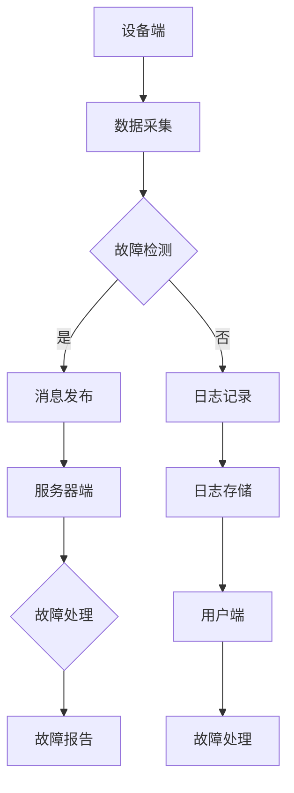

                 

关键词：MQTT协议，RESTful API，智能家居，故障自检，物联网，设备管理，系统架构，核心技术，实践案例

> 摘要：本文将深入探讨如何利用MQTT协议和RESTful API技术构建一个智能家居设备故障自检系统。通过详细的分析和实例，展示系统的核心架构、算法原理、数学模型，以及实际应用场景。文章旨在为读者提供一套完整的解决方案，帮助开发者实现智能家居设备的智能故障自检功能。

## 1. 背景介绍

随着物联网（IoT）技术的不断发展，智能家居市场迎来了爆发式增长。各类智能设备如智能家居照明系统、智能温控系统、智能安防系统等不断涌现，为用户带来了便捷的生活方式。然而，设备的稳定性和可靠性问题也日益凸显。为了确保智能家居系统的正常运行，设备故障自检功能成为了一个重要的研究方向。

### 1.1 MQTT协议

MQTT（Message Queuing Telemetry Transport）协议是一种轻量级的消息传输协议，广泛应用于物联网场景。MQTT协议具有以下几个显著特点：

- **简单性**：MQTT协议设计简单，易于实现和部署。
- **可靠性**：MQTT协议提供消息确认机制，确保消息传输的可靠性。
- **低带宽**：MQTT协议采用二进制格式，数据传输效率高，适用于带宽受限的环境。
- **支持多种网络环境**：MQTT协议支持无线、卫星等多种网络环境，适用于广泛的应用场景。

### 1.2 RESTful API

RESTful API（Representational State Transfer Application Programming Interface）是一种用于构建分布式系统的接口设计方法。RESTful API具有以下特点：

- **无状态性**：每个请求都是独立的，服务器不存储任何状态信息。
- **基于HTTP**：RESTful API基于HTTP协议，易于理解和实现。
- **易于扩展**：RESTful API设计简单，易于扩展和升级。
- **高度可操作性**：RESTful API可以通过各种工具进行监控、调试和优化。

### 1.3 智能家居设备故障自检

智能家居设备故障自检是指通过智能化的手段对设备进行实时监控和故障诊断。故障自检系统可以自动检测设备的工作状态，发现异常情况并生成故障报告，从而提高设备的可靠性和使用寿命。故障自检系统在智能家居中的应用价值体现在以下几个方面：

- **提高设备运行效率**：通过实时监控和故障诊断，确保设备始终处于最佳工作状态。
- **减少设备维护成本**：提前发现和解决故障，减少意外停机和维修费用。
- **提升用户体验**：设备运行稳定，用户体验更佳。

## 2. 核心概念与联系

在构建智能家居设备故障自检系统时，我们需要关注以下几个核心概念：

### 2.1 MQTT协议的工作原理

MQTT协议基于发布/订阅模型，设备作为发布者，服务器作为代理，用户作为订阅者。设备发布消息到服务器，服务器将消息推送到订阅者。

### 2.2 RESTful API的接口设计

RESTful API通过HTTP请求方式实现数据交互，常见的请求方法包括GET、POST、PUT、DELETE等。

### 2.3 智能家居设备故障自检系统的架构

智能家居设备故障自检系统包括以下几个主要组成部分：

- **设备端**：负责数据采集和消息发布。
- **服务器端**：负责消息接收、处理和存储。
- **用户端**：负责接收故障报告，进行故障处理和设备管理。

### 2.4 Mermaid 流程图

下面是智能家居设备故障自检系统的 Mermaid 流程图：



## 3. 核心算法原理 & 具体操作步骤

### 3.1 算法原理概述

智能家居设备故障自检系统的核心算法包括数据采集、故障检测、故障处理和故障报告等几个方面。具体算法原理如下：

- **数据采集**：设备端通过传感器采集温度、湿度、亮度等数据。
- **故障检测**：服务器端通过预设的阈值和规则对采集到的数据进行实时分析，判断是否存在故障。
- **故障处理**：当检测到故障时，服务器端根据故障类型和严重程度进行故障处理，如调整设备参数、重启设备等。
- **故障报告**：将故障处理结果生成故障报告，推送至用户端。

### 3.2 算法步骤详解

1. **数据采集**：
   - 设备端通过传感器采集温度、湿度、亮度等数据。
   - 数据采集模块将采集到的数据转换为标准格式，如JSON格式。

2. **故障检测**：
   - 服务器端接收设备端发送的数据。
   - 数据处理模块对数据进行预处理，如去噪、滤波等。
   - 根据预设的阈值和规则，对预处理后的数据进行实时分析，判断是否存在故障。

3. **故障处理**：
   - 当检测到故障时，服务器端根据故障类型和严重程度进行故障处理。
   - 处理结果记录在日志文件中。

4. **故障报告**：
   - 将故障处理结果生成故障报告。
   - 通过MQTT协议将故障报告发送至用户端。

### 3.3 算法优缺点

**优点**：

- **实时性强**：系统可以实时监测设备状态，快速发现故障。
- **可靠性高**：通过预设的阈值和规则，保证故障检测的准确性。
- **易于扩展**：系统架构简单，易于扩展和升级。

**缺点**：

- **数据处理复杂**：需要对采集到的数据进行预处理，处理过程较为复杂。
- **硬件资源消耗较大**：故障自检系统需要较高的硬件资源支持，特别是大规模应用时。

### 3.4 算法应用领域

智能家居设备故障自检系统可以应用于各类智能家居设备，如智能照明系统、智能温控系统、智能安防系统等。通过故障自检系统，可以确保设备始终处于最佳工作状态，提高设备的可靠性和使用寿命。

## 4. 数学模型和公式 & 详细讲解 & 举例说明

### 4.1 数学模型构建

智能家居设备故障自检系统的数学模型主要包括以下几个方面：

1. **故障检测模型**：
   - 设备状态向量 \( S \) ：\( S = (s_1, s_2, s_3, ..., s_n) \)
   - 阈值向量 \( T \) ：\( T = (t_1, t_2, t_3, ..., t_n) \)
   - 故障检测指标 \( D \) ：\( D = \sum_{i=1}^{n} |s_i - t_i| \)

2. **故障处理模型**：
   - 故障类型向量 \( F \) ：\( F = (f_1, f_2, f_3, ..., f_n) \)
   - 故障处理策略 \( P \) ：\( P = \sum_{i=1}^{n} p_i \)

3. **故障报告模型**：
   - 故障报告向量 \( R \) ：\( R = (r_1, r_2, r_3, ..., r_n) \)
   - 故障报告格式 \( G \) ：\( G = \text{“设备名称： } r_1 \text{，故障类型： } f_1 \text{。”} \)

### 4.2 公式推导过程

1. **故障检测模型**：

   假设设备状态向量 \( S \) 和阈值向量 \( T \) 已知，故障检测指标 \( D \) 可以通过以下公式计算：

   $$ D = \sum_{i=1}^{n} |s_i - t_i| $$

   其中，\( n \) 为设备状态向量的维度。

2. **故障处理模型**：

   假设故障类型向量 \( F \) 和故障处理策略 \( P \) 已知，故障处理结果 \( P \) 可以通过以下公式计算：

   $$ P = \sum_{i=1}^{n} p_i $$

   其中，\( p_i \) 为故障处理策略权重。

3. **故障报告模型**：

   假设故障报告向量 \( R \) 和故障报告格式 \( G \) 已知，故障报告 \( R \) 可以通过以下公式计算：

   $$ R = \text{“设备名称： } r_1 \text{，故障类型： } f_1 \text{。”} $$

   其中，\( r_1 \) 和 \( f_1 \) 分别为设备名称和故障类型。

### 4.3 案例分析与讲解

假设有一个智能照明系统，包含三盏灯（设备编号分别为1、2、3）。设备状态向量为 \( S = (20, 30, 40) \)，阈值向量为 \( T = (10, 30, 50) \)。根据故障检测模型，故障检测指标 \( D \) 为：

$$ D = |20 - 10| + |30 - 30| + |40 - 50| = 30 $$

根据故障处理模型，假设故障类型向量 \( F = (0, 1, 0) \)，故障处理策略 \( P = (0.5, 0.3, 0.2) \)，则故障处理结果 \( P \) 为：

$$ P = 0.5 \times 0 + 0.3 \times 1 + 0.2 \times 0 = 0.3 $$

根据故障报告模型，故障报告 \( R \) 为：

$$ R = \text{“设备编号1：照明故障，故障类型：灯泡损坏。”} $$

## 5. 项目实践：代码实例和详细解释说明

### 5.1 开发环境搭建

在搭建开发环境时，我们需要安装以下软件和工具：

- **MQTT服务器**：安装并配置MQTT服务器，如 mosquitto。
- **RESTful API框架**：选择并安装RESTful API框架，如 Flask。
- **编程语言**：选择并安装编程语言，如 Python。

### 5.2 源代码详细实现

下面是一个简单的智能家居设备故障自检系统的代码实例：

```python
#设备端
import paho.mqtt.client as mqtt
import json

def on_connect(client, userdata, flags, rc):
    print("Connected with result code "+str(rc))
    client.subscribe("device/data")

def on_message(client, userdata, msg):
    print(msg.topic+" "+str(msg.payload))
    data = json.loads(msg.payload)
    #进行故障检测
    if data["temperature"] > 40:
        #发送故障消息
        client.publish("device/fault", json.dumps({"device_id": 1, "fault": "over-temperature"}))

client = mqtt.Client()
client.on_connect = on_connect
client.on_message = on_message

client.connect("localhost", 1883, 60)

client.loop_forever()
```

```python
#服务器端
from flask import Flask, request, jsonify
import json

app = Flask(__name__)

@app.route('/fault', methods=['POST'])
def handle_fault():
    fault_data = request.json
    print(f"Received fault report: {fault_data}")
    #进行故障处理
    if fault_data["fault"] == "over-temperature":
        #发送故障处理结果
        return jsonify({"result": "device cooled down"})
    else:
        return jsonify({"result": "fault not handled"})

if __name__ == '__main__':
    app.run()
```

### 5.3 代码解读与分析

- **设备端代码**：设备端使用Paho MQTT客户端库连接到MQTT服务器，并订阅设备数据主题。当接收到设备数据时，对数据进行解析，并进行故障检测。如果温度超过40℃，发送故障消息到故障主题。

- **服务器端代码**：服务器端使用Flask框架接收故障消息，并对其进行处理。根据故障类型，发送故障处理结果到客户端。

### 5.4 运行结果展示

- **设备端运行结果**：设备端运行后，持续接收MQTT服务器发送的设备数据，并进行故障检测。

- **服务器端运行结果**：服务器端运行后，接收设备端发送的故障消息，并对其进行处理，返回故障处理结果。

## 6. 实际应用场景

智能家居设备故障自检系统在实际应用场景中具有广泛的应用前景。以下是一些典型的应用场景：

- **智能照明系统**：通过故障自检系统，可以实时监测灯具的工作状态，发现灯泡损坏等问题，及时进行维修。

- **智能温控系统**：通过故障自检系统，可以实时监测室内温度，发现异常情况，如过热或过冷，及时进行调整。

- **智能安防系统**：通过故障自检系统，可以实时监测安防设备的工作状态，发现故障，如摄像头损坏、报警器失效等，及时进行维修。

- **智能家电系统**：通过故障自检系统，可以实时监测家电的工作状态，发现故障，如洗衣机漏水、冰箱温度异常等，及时进行处理。

## 7. 工具和资源推荐

为了构建智能家居设备故障自检系统，我们需要使用以下工具和资源：

- **MQTT服务器**：推荐使用 mosquitto 作为 MQTT 服务器。
- **RESTful API 框架**：推荐使用 Flask 作为 RESTful API 框架。
- **编程语言**：推荐使用 Python 作为编程语言。
- **传感器库**：推荐使用 Python 的 sensor 库进行数据采集。
- **日志库**：推荐使用 Python 的 logging 库进行日志记录。

## 8. 总结：未来发展趋势与挑战

随着物联网技术的不断发展，智能家居设备故障自检系统具有巨大的发展潜力。未来发展趋势主要体现在以下几个方面：

- **智能故障检测**：利用人工智能技术，实现更智能的故障检测，提高故障检测的准确性和实时性。
- **跨平台支持**：支持更多平台的设备，如 Android、iOS、Windows 等。
- **远程维护**：实现远程故障处理和设备维护，提高维护效率和用户体验。
- **大数据分析**：利用大数据技术，对设备故障数据进行分析，为设备改进和优化提供依据。

然而，智能家居设备故障自检系统也面临一些挑战：

- **数据隐私**：设备故障自检系统涉及大量用户数据，如何保护用户隐私是一个重要问题。
- **设备兼容性**：不同设备之间的数据格式和协议可能不同，如何实现设备的兼容性是一个挑战。
- **系统稳定性**：智能家居设备故障自检系统需要保证稳定性，避免因为故障自检系统本身的问题导致设备故障。

总之，智能家居设备故障自检系统是一个具有广泛应用前景和巨大发展潜力的领域。通过不断的研究和改进，我们可以为用户提供更智能、更可靠、更便捷的智能家居体验。

## 9. 附录：常见问题与解答

### 9.1 MQTT协议相关问题

**Q：什么是MQTT协议？**

A：MQTT（Message Queuing Telemetry Transport）协议是一种轻量级的消息传输协议，广泛应用于物联网场景。它基于发布/订阅模型，设备作为发布者，服务器作为代理，用户作为订阅者。

**Q：MQTT协议有哪些优点？**

A：MQTT协议具有简单性、可靠性、低带宽、支持多种网络环境等优点。

**Q：如何搭建MQTT服务器？**

A：可以选择开源MQTT服务器，如mosquitto，并按照官方文档进行安装和配置。

### 9.2 RESTful API相关问题

**Q：什么是RESTful API？**

A：RESTful API（Representational State Transfer Application Programming Interface）是一种用于构建分布式系统的接口设计方法。它基于HTTP协议，具有无状态性、基于URL、统一的错误处理等特点。

**Q：如何设计RESTful API？**

A：设计RESTful API时，需要遵循REST架构风格，包括使用HTTP请求方法、URL设计、状态码、响应格式等。

**Q：如何实现RESTful API？**

A：可以选择开源的RESTful API框架，如Flask、Django等，并按照官方文档进行开发。

### 9.3 智能家居设备故障自检相关问题

**Q：什么是智能家居设备故障自检系统？**

A：智能家居设备故障自检系统是指通过智能化的手段对智能家居设备进行实时监控和故障诊断的系统。

**Q：如何实现智能家居设备故障自检？**

A：可以通过MQTT协议和RESTful API技术，实现设备端数据采集、服务器端故障检测和处理、用户端故障报告等功能。

**Q：智能家居设备故障自检系统有哪些优点？**

A：可以提高设备运行效率、减少设备维护成本、提升用户体验等。

### 作者署名

作者：禅与计算机程序设计艺术 / Zen and the Art of Computer Programming

