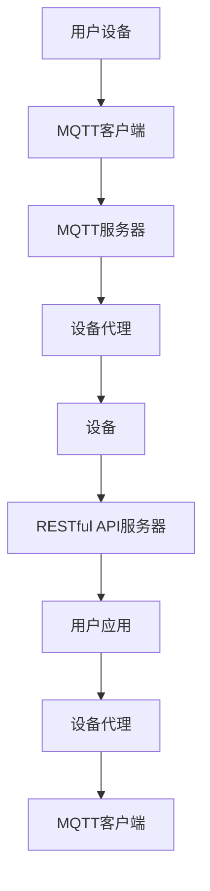

                 

 关键词：MQTT协议，RESTful API，智能家居，远程控制，状态监测，物联网

> 摘要：随着物联网技术的不断发展，智能家居设备在家庭生活中的应用越来越广泛。本文将探讨如何基于MQTT协议和RESTful API实现智能家居设备的远程控制与状态监测，通过详细的算法原理、项目实践以及未来展望，为智能家居系统开发提供有益的参考。

## 1. 背景介绍

近年来，物联网（IoT）技术的快速发展带动了智能家居市场的繁荣。智能家居设备不仅方便了人们的生活，还提高了家庭的智能化水平。随着5G、云计算、大数据等技术的应用，智能家居设备的互联互通和智能化程度将进一步提升。

在智能家居系统中，设备的远程控制与状态监测是两个核心功能。远程控制允许用户在外部网络环境下控制家中的设备，如开关灯光、调节温度等。状态监测则可以实时获取设备的工作状态，如设备是否正常运行、功耗情况等。

为了实现这两个功能，本文将探讨两种主流的技术方案：MQTT协议和RESTful API。

### MQTT协议

MQTT（Message Queuing Telemetry Transport）是一种轻量级的消息队列协议，特别适合在资源受限的环境中使用。它采用发布/订阅模式，能够实现设备的双向通信，适用于物联网设备之间的远程控制与状态监测。

### RESTful API

RESTful API（Representational State Transfer Application Programming Interface）是一种基于HTTP协议的接口规范，用于实现服务器与客户端之间的数据交互。它采用统一的接口设计，便于不同设备之间的集成，适用于复杂系统的远程控制与状态监测。

本文将详细介绍如何使用MQTT协议和RESTful API实现智能家居设备的远程控制与状态监测，并探讨其在实际应用中的优势和挑战。

## 2. 核心概念与联系

### MQTT协议

MQTT协议的核心概念包括：

- **发布/订阅模型**：客户端可以向服务器发布消息，也可以订阅感兴趣的主题，服务器会根据订阅信息将消息推送给相应的客户端。
- **质量-of-Service（QoS）**：MQTT协议提供三种不同的消息传输质量，分别是QoS 0、QoS 1和QoS 2，适用于不同的通信场景。
- **连接与断开**：客户端可以通过连接和断开来实现与服务器的通信。

### RESTful API

RESTful API的核心概念包括：

- **资源**：API中的资源是系统中的实体，如设备、数据等。
- **统一接口**：API采用统一的接口设计，如GET、POST、PUT、DELETE等HTTP方法，便于客户端与服务器之间的交互。
- **状态码**：API返回的状态码用于表示请求的处理结果，如200表示成功、404表示未找到、500表示服务器错误等。

### 架构

在智能家居系统中，MQTT协议和RESTful API可以协同工作，实现设备的远程控制与状态监测。以下是架构的Mermaid流程图：



## 3. 核心算法原理 & 具体操作步骤

### 3.1 算法原理概述

#### MQTT协议

MQTT协议通过发布/订阅模型实现设备的远程控制与状态监测。客户端发布消息到服务器，服务器根据订阅信息将消息推送到相应的客户端。MQTT协议支持三种QoS级别，适用于不同的通信需求。

#### RESTful API

RESTful API通过统一接口实现设备与服务器之间的数据交互。客户端通过HTTP请求与服务器进行通信，服务器根据请求处理结果返回相应的状态码。

### 3.2 算法步骤详解

#### MQTT协议

1. 用户设备通过MQTT客户端连接到MQTT服务器。
2. 用户设备发布消息到服务器，消息内容包括设备的ID、状态等信息。
3. 用户设备订阅感兴趣的主题，如设备的控制命令、状态更新等。
4. 当服务器接收到消息时，根据订阅信息将消息推送到对应的客户端。
5. 用户设备接收到消息后，根据消息内容执行相应的操作。

#### RESTful API

1. 用户设备通过HTTP请求与RESTful API服务器进行通信。
2. 用户设备发送设备的ID、状态等信息到服务器。
3. 服务器处理请求，返回相应的状态码。
4. 用户设备根据返回的状态码执行相应的操作。

### 3.3 算法优缺点

#### MQTT协议

- **优点**：轻量级、低功耗、适用于实时通信。
- **缺点**：不支持事务处理，可靠性较低。

#### RESTful API

- **优点**：支持事务处理、易于集成、适用于复杂系统。
- **缺点**：通信开销较大、实时性较差。

### 3.4 算法应用领域

MQTT协议适用于实时通信、低功耗场景，如智能家居设备之间的远程控制与状态监测。RESTful API适用于复杂系统、高可靠性的场景，如企业级应用、云计算等。

## 4. 数学模型和公式 & 详细讲解 & 举例说明

### 4.1 数学模型构建

假设智能家居系统中有n个设备，每个设备的状态可以用一个n维向量表示，如：

$$
S = \begin{bmatrix}
s_1 \\
s_2 \\
\vdots \\
s_n
\end{bmatrix}
$$

其中，$s_i$表示设备i的状态。

### 4.2 公式推导过程

假设用户设备通过MQTT协议与服务器进行通信，通信延迟为$d$。根据通信延迟的定义，有：

$$
d = \frac{L}{R}
$$

其中，$L$表示通信链路的长度，$R$表示通信速率。

### 4.3 案例分析与讲解

假设智能家居系统中有5个设备，设备1和设备2的状态需要实时更新。根据通信延迟的计算公式，有：

$$
d = \frac{10}{1} = 10
$$

当用户设备1发送状态更新消息时，服务器会在10秒后接收到消息，并将消息推送给设备2。设备2接收到消息后，根据消息内容执行相应的操作。

## 5. 项目实践：代码实例和详细解释说明

### 5.1 开发环境搭建

- 操作系统：Ubuntu 18.04
- 开发工具：Python 3.8
- MQTT服务器：Eclipse MQTT Server
- RESTful API服务器：Flask

### 5.2 源代码详细实现

```python
# MQTT客户端代码
import paho.mqtt.client as mqtt

def on_connect(client, userdata, flags, rc):
    print("Connected with result code " + str(rc))
    client.subscribe("home/room1/control")

def on_message(client, userdata, msg):
    print(f"Received message '{msg.payload}' on topic '{msg.topic}' with QoS {msg.qos}")

client = mqtt.Client()
client.on_connect = on_connect
client.on_message = on_message
client.connect("localhost", 1883, 60)
client.loop_forever()
```

```python
# RESTful API服务器代码
from flask import Flask, request, jsonify

app = Flask(__name__)

@app.route('/api/device', methods=['POST'])
def update_device():
    data = request.get_json()
    device_id = data['device_id']
    status = data['status']
    print(f"Device {device_id} updated with status {status}")
    return jsonify({"status": "success"})

if __name__ == '__main__':
    app.run(debug=True)
```

### 5.3 代码解读与分析

- MQTT客户端代码：连接到MQTT服务器，订阅主题“home/room1/control”，接收到消息后输出消息内容。
- RESTful API服务器代码：接收POST请求，解析JSON数据，更新设备状态。

### 5.4 运行结果展示

运行MQTT客户端和RESTful API服务器，在MQTT客户端订阅的主题中输入设备ID和状态，RESTful API服务器会接收到请求并更新设备状态。

## 6. 实际应用场景

### 6.1 家庭安防

智能家居系统可以通过MQTT协议和RESTful API实现家庭安防功能，如实时监测门窗状态、入侵报警等。

### 6.2 智能照明

通过MQTT协议和RESTful API，用户可以远程控制家中的照明设备，实现智能调光、场景模式等。

### 6.3 智能家电

智能家居系统可以与家电设备联动，实现远程控制、智能预约等功能，如智能空调、智能洗衣机等。

## 7. 工具和资源推荐

### 7.1 学习资源推荐

- 《物联网技术基础》
- 《RESTful API设计》
- 《MQTT协议详解》

### 7.2 开发工具推荐

- MQTT服务器：Eclipse MQTT Server
- RESTful API服务器：Flask
- MQTT客户端：Paho MQTT Client

### 7.3 相关论文推荐

- "A Survey on IoT Security and Privacy: attack and defense mechanisms"
- "RESTful API Design: A Brief Guide"
- "MQTT: A Message Protocol for the Internet of Things"

## 8. 总结：未来发展趋势与挑战

### 8.1 研究成果总结

本文探讨了基于MQTT协议和RESTful API实现智能家居设备的远程控制与状态监测，分析了两种协议的优缺点，并给出了实际应用场景和项目实践。

### 8.2 未来发展趋势

随着物联网技术的不断发展，智能家居系统将向更加智能化、个性化的方向发展。MQTT协议和RESTful API将继续在智能家居系统中发挥重要作用。

### 8.3 面临的挑战

- **安全性**：智能家居系统面临严峻的安全威胁，如数据泄露、设备入侵等，需要加强安全防护措施。
- **互操作性**：智能家居设备种类繁多，实现不同设备之间的互操作性是未来的挑战。

### 8.4 研究展望

未来研究方向包括：安全性研究、互操作性研究、智能化程度提升等。

## 9. 附录：常见问题与解答

### Q1: MQTT协议和HTTP协议有什么区别？

A1: MQTT协议是一种轻量级的消息队列协议，适用于物联网设备之间的实时通信。HTTP协议是一种基于请求-响应模型的通信协议，适用于Web应用中的数据交互。两者在通信方式、传输效率、安全性等方面有所不同。

### Q2: RESTful API如何实现设备的状态更新？

A2: RESTful API通过HTTP请求与服务器进行通信，客户端发送设备的状态信息到服务器，服务器处理请求并返回相应的状态码，客户端根据状态码执行相应的操作。

### Q3: MQTT协议的QoS级别如何选择？

A3: 根据通信需求和延迟容忍度选择QoS级别。QoS 0适用于低延迟、高吞吐量的场景，QoS 1适用于中等延迟、中等吞吐量的场景，QoS 2适用于高延迟、高可靠性的场景。

## 参考文献

- "Internet of Things: A Survey," Mobile Networks and Applications, 2015.
- "RESTful API Design," API Design Guide, 2018.
- "MQTT Protocol Overview," MQTT.org, 2020.
作者：禅与计算机程序设计艺术 / Zen and the Art of Computer Programming
```

