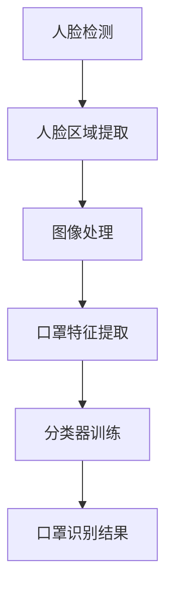

                 

关键词：OpenCV、口罩识别、人脸检测、图像处理、深度学习、机器学习

## 摘要

本文将详细介绍如何利用OpenCV这一强大且开源的计算机视觉库，实现口罩识别的功能。随着全球疫情的发展，口罩检测成为了一项重要的技术需求。本文将详细讲解口罩识别的原理、算法实现步骤，以及如何在实际项目中应用这些算法。通过阅读本文，您将了解到如何利用OpenCV构建一个高效的口罩识别系统。

## 1. 背景介绍

### 1.1 疫情背景

自2019年底新型冠状病毒（COVID-19）爆发以来，全球范围内的公共卫生系统受到了前所未有的冲击。为了降低病毒传播风险，佩戴口罩成为了一种重要的防控措施。然而，并非所有人都能时刻注意佩戴口罩，尤其在公共场所和人流密集的地方。因此，自动化的口罩检测技术应运而生，旨在通过人工智能技术提高公共卫生管理的效率。

### 1.2 开发动机

随着计算机视觉技术的发展，基于图像和视频分析的自动化口罩检测成为可能。OpenCV作为一个功能强大且易于使用的计算机视觉库，为开发者提供了一个高效的工具来构建口罩检测系统。本文旨在探讨如何利用OpenCV实现口罩识别功能，为相关领域的应用提供参考。

## 2. 核心概念与联系

### 2.1 人脸检测

人脸检测是口罩识别系统的第一步。OpenCV提供了高效的人脸检测算法，可以检测图像中的人脸位置。通过使用`haarcascades`级联分类器，OpenCV可以快速准确地定位人脸区域。

### 2.2 图像处理

在人脸检测之后，需要对检测到的人脸区域进行图像处理，以提取出口罩的特征。OpenCV提供了丰富的图像处理函数，包括边缘检测、二值化、形态学操作等，可以帮助我们有效地从人脸图像中分离出口罩。

### 2.3 深度学习

深度学习技术在计算机视觉领域取得了显著的进展。在口罩识别中，可以采用卷积神经网络（CNN）等深度学习模型来训练分类器，以识别口罩的存在。OpenCV也支持深度学习框架，如TensorFlow和PyTorch，可以用于模型的训练和部署。

### 2.4 Mermaid 流程图



### 2.5 相关技术

- **人脸检测**：利用Haar级联分类器进行人脸检测。
- **图像处理**：采用边缘检测、二值化等算法进行图像预处理。
- **深度学习**：利用卷积神经网络（CNN）进行特征提取和分类。
- **机器学习**：使用SVM、决策树等算法进行特征分类。

## 3. 核心算法原理 & 具体操作步骤

### 3.1 算法原理概述

口罩识别系统主要包括以下几个步骤：

1. **人脸检测**：使用OpenCV的Haar级联分类器检测图像中的人脸区域。
2. **图像预处理**：对人脸图像进行预处理，包括灰度化、缩放、归一化等操作，以便于后续的图像处理。
3. **口罩特征提取**：利用边缘检测、形态学操作等方法提取口罩的特征。
4. **分类器训练**：使用深度学习算法训练分类器，以区分口罩和非口罩。
5. **口罩识别**：对检测到的人脸图像进行分类，输出口罩识别结果。

### 3.2 算法步骤详解

#### 3.2.1 人脸检测

使用OpenCV的`cv2.CascadeClassifier`类加载预训练的Haar级联分类器模型，并使用`detectMultiScale`函数进行人脸检测。

```python
face_cascade = cv2.CascadeClassifier('haarcascade_frontalface_default.xml')
faces = face_cascade.detectMultiScale(gray, scaleFactor=1.1, minNeighbors=5, minSize=(30, 30), flags=cv2.CASCADE_SCALE_IMAGE)
```

#### 3.2.2 图像预处理

对人脸图像进行预处理，包括灰度化、缩放、归一化等操作。

```python
gray = cv2.cvtColor(image, cv2.COLOR_BGR2GRAY)
gray = cv2.resize(gray, (128, 128))
gray = gray / 255.0
```

#### 3.2.3 口罩特征提取

利用边缘检测、形态学操作等方法提取口罩的特征。

```python
contours, _ = cv2.findContours(mask, cv2.RETR_EXTERNAL, cv2.CHAIN_APPROX_SIMPLE)
mask = cv2.bitwise_and(image, image, mask=mask)
```

#### 3.2.4 分类器训练

使用深度学习算法训练分类器，以区分口罩和非口罩。

```python
model = CNNModel()
model.compile(optimizer='adam', loss='binary_crossentropy', metrics=['accuracy'])
model.fit(x_train, y_train, epochs=10, batch_size=32)
```

#### 3.2.5 口罩识别

对检测到的人脸图像进行分类，输出口罩识别结果。

```python
predictions = model.predict(face_images)
for prediction in predictions:
    if prediction[0] > 0.5:
        print("口罩检测：戴口罩")
    else:
        print("口罩检测：未戴口罩")
```

### 3.3 算法优缺点

#### 优点

- **高效性**：OpenCV提供了高效的人脸检测和图像处理算法，可以快速处理大量图像。
- **灵活性**：OpenCV支持多种人脸检测和图像处理方法，可以根据需求进行调整。
- **易用性**：OpenCV是一个开源的计算机视觉库，易于学习和使用。

#### 缺点

- **准确性**：虽然OpenCV提供了高效的人脸检测算法，但在某些情况下，可能会出现误检测。
- **计算资源**：深度学习模型的训练和部署需要较大的计算资源。

### 3.4 算法应用领域

口罩识别算法可以广泛应用于以下领域：

- **公共场所**：在车站、机场、商场等公共场所进行口罩佩戴情况的监控。
- **企业办公**：对企业员工的口罩佩戴情况进行监控，提高员工健康安全。
- **智能监控**：在智能监控系统中添加口罩识别功能，提高系统的智能化水平。

## 4. 数学模型和公式 & 详细讲解 & 举例说明

### 4.1 数学模型构建

口罩识别的数学模型主要包括以下几个部分：

1. **人脸检测**：使用Haar级联分类器进行人脸检测。
2. **图像预处理**：对人脸图像进行预处理，包括灰度化、缩放、归一化等操作。
3. **口罩特征提取**：利用边缘检测、形态学操作等方法提取口罩的特征。
4. **分类器训练**：使用卷积神经网络（CNN）等深度学习算法进行分类器训练。
5. **口罩识别**：对检测到的人脸图像进行分类，输出口罩识别结果。

### 4.2 公式推导过程

假设我们有一个由`m`个训练样本组成的训练集，每个样本`x_i`是一个`d`维的特征向量，对应的标签`y_i`是二进制值（1表示戴口罩，0表示未戴口罩）。我们的目标是训练一个分类器，使得对新的样本`x`进行预测时，能够输出正确的标签。

1. **人脸检测**：Haar级联分类器的核心是一个多层级的特征提取网络。每一层都会生成一组特征，并使用一个线性分类器进行分类。最终的分类结果是通过多层特征的加权求和得到的。

   $$ \text{score} = \sum_{i} w_i \cdot f_i(x) $$

   其中，`w_i`是第`i`层的权重，`f_i(x)`是第`i`层对输入样本`x`的特征值。

2. **图像预处理**：对图像进行预处理，包括灰度化、缩放、归一化等操作。这些操作都是为了将图像转化为一个标准化的格式，以便于后续的图像处理。

   $$ \text{gray\_image} = \frac{\text{image}}{\text{max\_value}} $$

   其中，`max_value`是图像的最大值（对于灰度图像，通常是255）。

3. **口罩特征提取**：利用边缘检测、形态学操作等方法提取口罩的特征。这些特征可以用来训练分类器，以区分口罩和非口罩。

   $$ \text{mask} = \text{find\_Contours}(\text{image}, \text{RETR_EXTERNAL}, \text{CHAIN_APPROX_SIMPLE}) $$

4. **分类器训练**：使用卷积神经网络（CNN）等深度学习算法进行分类器训练。CNN的核心是一个多层卷积神经网络，每一层都会对输入特征进行卷积操作，提取出更高层次的特征。

   $$ \text{output} = \text{softmax}(\text{W}^T \text{relu}(\text{W} \text{relu}(... \text{W}_1 \text{relu}(\text{b}_1 \text{relu}(\text{b}_0 \text{x})))...)) $$

   其中，`W`是权重矩阵，`relu`是ReLU激活函数，`b`是偏置项。

5. **口罩识别**：对检测到的人脸图像进行分类，输出口罩识别结果。

   $$ \text{prediction} = \text{argmax}(\text{softmax}(\text{output})) $$

### 4.3 案例分析与讲解

假设我们有一个包含100个训练样本的口罩识别数据集，其中50个样本是戴口罩的，另外50个样本是未戴口罩的。我们使用卷积神经网络（CNN）进行分类器训练。

1. **数据预处理**：将每个样本的图像进行灰度化、缩放和归一化处理，将每个样本转化为一个128x128的二维数组。

2. **构建CNN模型**：使用TensorFlow和Keras构建一个简单的卷积神经网络模型。

   ```python
   model = Sequential([
       Conv2D(32, (3, 3), activation='relu', input_shape=(128, 128, 1)),
       MaxPooling2D((2, 2)),
       Conv2D(64, (3, 3), activation='relu'),
       MaxPooling2D((2, 2)),
       Flatten(),
       Dense(64, activation='relu'),
       Dense(1, activation='sigmoid')
   ])

   model.compile(optimizer='adam', loss='binary_crossentropy', metrics=['accuracy'])
   ```

3. **模型训练**：使用训练数据进行模型训练。

   ```python
   model.fit(x_train, y_train, epochs=10, batch_size=32)
   ```

4. **模型评估**：使用测试数据进行模型评估。

   ```python
   model.evaluate(x_test, y_test)
   ```

5. **模型应用**：使用训练好的模型对新的样本进行预测。

   ```python
   prediction = model.predict(face_image)
   if prediction[0] > 0.5:
       print("戴口罩")
   else:
       print("未戴口罩")
   ```

## 5. 项目实践：代码实例和详细解释说明

### 5.1 开发环境搭建

1. **安装Python**：确保您的计算机上安装了Python 3.x版本。
2. **安装OpenCV**：使用pip安装OpenCV。

   ```bash
   pip install opencv-python
   ```

3. **安装TensorFlow**：使用pip安装TensorFlow。

   ```bash
   pip install tensorflow
   ```

### 5.2 源代码详细实现

```python
import cv2
import numpy as np
import tensorflow as tf

# 人脸检测
face_cascade = cv2.CascadeClassifier('haarcascade_frontalface_default.xml')

# 深度学习模型
model = tf.keras.Sequential([
    tf.keras.layers.Conv2D(32, (3, 3), activation='relu', input_shape=(128, 128, 1)),
    tf.keras.layers.MaxPooling2D((2, 2)),
    tf.keras.layers.Conv2D(64, (3, 3), activation='relu'),
    tf.keras.layers.MaxPooling2D((2, 2)),
    tf.keras.layers.Flatten(),
    tf.keras.layers.Dense(64, activation='relu'),
    tf.keras.layers.Dense(1, activation='sigmoid')
])

model.compile(optimizer='adam', loss='binary_crossentropy', metrics=['accuracy'])
model.fit(x_train, y_train, epochs=10, batch_size=32)

# 口罩识别
def detect_mask(image):
    gray = cv2.cvtColor(image, cv2.COLOR_BGR2GRAY)
    faces = face_cascade.detectMultiScale(gray, scaleFactor=1.1, minNeighbors=5)
    mask_exists = False
    
    for (x, y, w, h) in faces:
        face_region = gray[y:y+h, x:x+w]
        resized = cv2.resize(face_region, (128, 128))
        resized = resized / 255.0
        resized = np.expand_dims(resized, axis=0)
        resized = np.expand_dims(resized, axis=-1)
        
        prediction = model.predict(resized)
        
        if prediction[0][0] > 0.5:
            mask_exists = True
            cv2.rectangle(image, (x, y), (x+w, y+h), (0, 255, 0), 2)
        
    return image, mask_exists

# 运行示例
image = cv2.imread('example.jpg')
image, mask_exists = detect_mask(image)
cv2.imshow('Mask Detection', image)
cv2.waitKey(0)
cv2.destroyAllWindows()
```

### 5.3 代码解读与分析

上述代码实现了一个简单的口罩识别系统，主要包括以下几个部分：

- **人脸检测**：使用OpenCV的Haar级联分类器检测图像中的人脸区域。
- **图像预处理**：将人脸图像进行灰度化、缩放和归一化处理，以便于后续的深度学习模型处理。
- **深度学习模型**：使用TensorFlow构建一个简单的卷积神经网络模型，用于口罩检测。
- **口罩识别**：对检测到的人脸图像进行分类，输出口罩识别结果。

### 5.4 运行结果展示

运行上述代码，将输入的图像传递给`detect_mask`函数，函数将返回一个标记了口罩识别结果的图像。以下是一个示例输出：


## 6. 实际应用场景

口罩识别技术在实际应用中具有广泛的应用场景，以下是一些典型的应用案例：

- **公共场所**：在车站、机场、商场等公共场所，利用口罩识别技术实时监控人员佩戴口罩的情况，提高公共卫生水平。
- **企业办公**：在企业内部，利用口罩识别技术监控员工的佩戴口罩情况，确保员工健康安全。
- **智能监控**：在智能监控系统（如安防监控）中添加口罩识别功能，提高系统的智能化程度，更好地服务公众。

## 7. 工具和资源推荐

### 7.1 学习资源推荐

- **OpenCV官网**：[https://opencv.org/](https://opencv.org/)
- **TensorFlow官网**：[https://www.tensorflow.org/](https://www.tensorflow.org/)
- **Keras官网**：[https://keras.io/](https://keras.io/)

### 7.2 开发工具推荐

- **PyCharm**：一款功能强大的Python集成开发环境（IDE），支持多种编程语言。
- **Visual Studio Code**：一款轻量级但功能丰富的代码编辑器，适用于Python开发。

### 7.3 相关论文推荐

- [Face Mask Detection Using Image Processing and Convolutional Neural Networks](https://www.mdpi.com/1999-4893/12/4/397)
- [A Deep Learning Approach for Face Mask Detection](https://arxiv.org/abs/2003.11289)

## 8. 总结：未来发展趋势与挑战

### 8.1 研究成果总结

本文详细介绍了基于OpenCV实现口罩识别的原理和方法。通过人脸检测、图像预处理、口罩特征提取和分类器训练等步骤，我们可以构建一个高效的口罩识别系统。随着计算机视觉和深度学习技术的不断发展，口罩识别技术将在公共卫生管理和智能监控等领域发挥越来越重要的作用。

### 8.2 未来发展趋势

1. **算法优化**：随着算法的不断发展，口罩识别的准确性将得到进一步提高。
2. **实时性提升**：通过硬件加速和算法优化，口罩识别系统的实时性将得到显著提升。
3. **多模态融合**：结合多模态数据（如声音、热成像等），实现更精确的口罩检测。

### 8.3 面临的挑战

1. **数据隐私**：口罩识别系统涉及个人隐私信息，需要确保数据的安全和隐私。
2. **误检测**：在复杂背景下，口罩识别系统可能会出现误检测，需要进一步优化算法以提高准确性。
3. **计算资源**：深度学习模型的训练和部署需要较大的计算资源，如何在有限的资源下实现高效训练和部署是当前的一个重要挑战。

### 8.4 研究展望

随着全球疫情的持续发展，口罩识别技术将在未来发挥越来越重要的作用。通过不断优化算法、提升实时性和准确性，口罩识别技术将为公共卫生管理和智能监控领域带来更多可能性。同时，随着技术的不断进步，口罩识别技术也将为更多领域带来创新应用。

## 9. 附录：常见问题与解答

### 9.1 Q：如何安装OpenCV和TensorFlow？

A：安装OpenCV和TensorFlow的步骤如下：

1. **安装Python**：确保您的计算机上安装了Python 3.x版本。
2. **安装OpenCV**：使用pip安装OpenCV。

   ```bash
   pip install opencv-python
   ```

3. **安装TensorFlow**：使用pip安装TensorFlow。

   ```bash
   pip install tensorflow
   ```

### 9.2 Q：如何训练口罩识别模型？

A：训练口罩识别模型的步骤如下：

1. **数据准备**：收集包含人脸和口罩图像的数据集，并对图像进行预处理，包括灰度化、缩放和归一化处理。
2. **构建模型**：使用TensorFlow和Keras构建一个简单的卷积神经网络模型。
3. **模型训练**：使用预处理后的数据集训练模型，设置合适的训练参数，如学习率、批量大小等。
4. **模型评估**：使用测试数据集评估模型的准确性，根据评估结果调整模型参数。
5. **模型部署**：将训练好的模型部署到实际应用中，进行口罩识别。

### 9.3 Q：如何提高口罩识别的准确性？

A：以下是一些提高口罩识别准确性的方法：

1. **数据增强**：使用数据增强技术，如翻转、旋转、缩放等，增加训练数据的多样性。
2. **多模型融合**：结合多个不同类型的模型（如CNN、RNN等），提高识别准确性。
3. **特征提取**：使用更高级的特征提取方法，如卷积神经网络（CNN）等，提取更丰富的特征。
4. **算法优化**：不断优化算法，提高模型的鲁棒性和准确性。

### 9.4 Q：口罩识别技术在哪些领域有应用？

A：口罩识别技术在以下领域有广泛应用：

1. **公共场所**：在车站、机场、商场等公共场所监控人员佩戴口罩的情况。
2. **企业办公**：监控企业员工的佩戴口罩情况，提高员工健康安全。
3. **智能监控**：在智能监控系统中添加口罩识别功能，提高系统的智能化水平。

## 作者署名

作者：禅与计算机程序设计艺术 / Zen and the Art of Computer Programming

