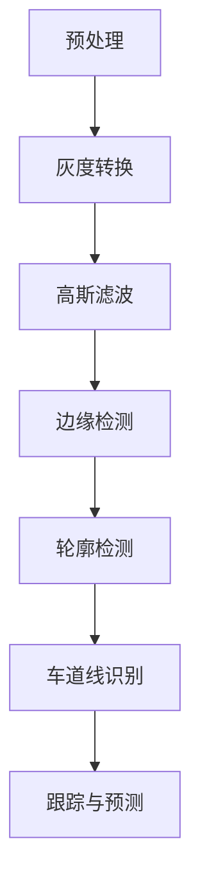

                 

### 关键词

OpenCV, 车道检测, 视频处理, 图像处理, 机器学习

### 摘要

本文将探讨如何使用OpenCV库对视频中的道路车道进行检测。车道检测在自动驾驶、智能交通系统等领域具有广泛应用，是计算机视觉中的一个重要课题。本文首先介绍车道检测的背景和重要性，然后详细阐述基于OpenCV的车道检测算法原理和实现步骤，并通过具体实例展示如何运用OpenCV进行实际的车道检测。

## 1. 背景介绍

随着自动驾驶技术的发展，道路车道检测成为了一个关键的研究方向。车道检测的目的是通过计算机视觉技术，识别车辆所在车道的位置和形状，为自动驾驶车辆提供精确的位置信息。车道检测技术不仅能够提高车辆的安全性，还能够为智能交通系统提供数据支持，优化交通流量。

目前，车道检测技术主要包括基于模型的方法和基于深度学习的方法。基于模型的方法通常依赖于几何形状、颜色等特征进行车道检测，如Hough变换、卡尔曼滤波等。而基于深度学习的方法则利用神经网络从大量的标注数据中学习特征，从而实现更精确的车道检测。

OpenCV（Open Source Computer Vision Library）是一个跨平台的计算机视觉库，提供了丰富的图像处理和机器学习算法，被广泛应用于各种计算机视觉项目中。本文将结合OpenCV，介绍如何实现视频道路车道的检测。

## 2. 核心概念与联系

### 2.1 OpenCV简介

OpenCV是一个开源的计算机视觉库，它由Intel开发，目前由社区维护。OpenCV支持多种编程语言，如C++、Python、Java等，且具有高效的性能。OpenCV提供了丰富的图像处理函数和算法，包括图像滤波、边缘检测、形态学操作、特征提取等。

### 2.2 车道检测的基本原理

车道检测通常包括以下几个步骤：

1. **预处理**：对视频帧进行预处理，包括灰度转换、高斯滤波等，以减少噪声和增强车道特征。
2. **边缘检测**：利用Canny边缘检测算法或其他边缘检测方法，从预处理后的图像中提取车道边缘。
3. **轮廓检测**：使用FindContours函数找到边缘轮廓，并对其进行处理，如近似、滤波等。
4. **车道线识别**：通过分析轮廓，识别出车道线的位置和形状。
5. **跟踪与预测**：对检测到的车道线进行跟踪和预测，以保持连续性。

### 2.3 Mermaid流程图

以下是一个简化的车道检测流程图：



## 3. 核心算法原理 & 具体操作步骤

### 3.1 算法原理概述

车道检测算法的核心是边缘检测和轮廓分析。边缘检测用于提取图像中的车道线，轮廓检测用于确定车道线的形状和位置。常用的边缘检测算法包括Canny、Sobel、Laplacian等，而轮廓检测则通过FindContours函数实现。

### 3.2 算法步骤详解

#### 3.2.1 预处理

预处理步骤通常包括灰度转换和高斯滤波。灰度转换是将彩色图像转换为灰度图像，以便于后续的边缘检测。高斯滤波则用于平滑图像，减少噪声。

```python
import cv2

# 读取视频帧
frame = cv2.imread('frame.jpg')

# 灰度转换
gray = cv2.cvtColor(frame, cv2.COLOR_BGR2GRAY)

# 高斯滤波
blurred = cv2.GaussianBlur(gray, (5, 5), 0)
```

#### 3.2.2 边缘检测

边缘检测是车道检测的关键步骤。Canny边缘检测算法是一种常用的边缘检测方法，它能够有效地检测出图像中的边缘。

```python
# Canny边缘检测
edges = cv2.Canny(blurred, threshold1=50, threshold2=150)
```

#### 3.2.3 轮廓检测

轮廓检测用于识别边缘轮廓。FindContours函数能够从边缘图像中提取轮廓。

```python
# 轮廓检测
_, contours, _ = cv2.findContours(edges, cv2.RETR_TREE, cv2.CHAIN_APPROX_SIMPLE)

# 选择最长的轮廓
max_contour = max(contours, key=cv2.contourArea)

# 绘制轮廓
cv2.drawContours(frame, [max_contour], -1, (0, 255, 0), 3)
```

#### 3.2.4 车道线识别

车道线识别是通过分析轮廓来确定车道线的位置和形状。通常，我们选择最长的轮廓作为车道线。

```python
# 车道线识别
if len(max_contour) > 100:
    # 提取车道线轮廓
    contour_x = [int(x) for x in max_contour[:, 0]]
    contour_y = [int(y) for y in max_contour[:, 1]]

    # 绘制车道线
    cv2.polylines(frame, [max_contour], True, (0, 0, 255), 2)
```

#### 3.2.5 跟踪与预测

车道线跟踪与预测用于保持车道线的连续性。通过分析连续帧之间的车道线变化，可以预测下一帧的车道线位置。

```python
# 跟踪与预测代码示例
# ...
```

### 3.3 算法优缺点

- **优点**：
  - 算法简单，易于实现。
  - 对噪声和光照变化的鲁棒性较强。
- **缺点**：
  - 在复杂道路场景下，车道线识别的准确性可能受到影响。
  - 对车道线的形状和位置变化敏感。

### 3.4 算法应用领域

车道检测技术广泛应用于自动驾驶、智能交通系统、车辆监控等领域。例如，在自动驾驶中，车道检测用于确定车辆的位置和行驶轨迹；在智能交通系统中，车道检测可以用于交通流量分析；在车辆监控中，车道检测可以用于超速监测和行车记录。

## 4. 数学模型和公式 & 详细讲解 & 举例说明

### 4.1 数学模型构建

车道检测的数学模型主要包括边缘检测模型和轮廓分析模型。边缘检测模型通常使用一阶导数或二阶导数来表示边缘点，而轮廓分析模型则使用轮廓线或轮廓面来表示车道线。

### 4.2 公式推导过程

#### 边缘检测模型

设图像$f(x, y)$在点$(x, y)$的一阶导数为$df/dx$和$df/dy$，二阶导数为$d^2f/dx^2$和$d^2f/dy^2$，则边缘检测模型可以表示为：

$$
\left\{
\begin{aligned}
& \theta(x, y) = \text{arctan}\left(\frac{df/dy}{df/dx}\right) \\
& \left|\frac{df/dx}{df/dy}\right| \leq \text{constant}
\end{aligned}
\right.
$$

#### 轮廓分析模型

设轮廓线上的点为$(x, y)$，轮廓线的斜率为$k$，则轮廓分析模型可以表示为：

$$
y = kx + b
$$

其中，$k$和$b$可以通过最小二乘法进行计算。

### 4.3 案例分析与讲解

#### 案例一：简单车道线检测

对于一条直线车道线，我们可以通过简单的数学模型进行检测。假设车道线的斜率为$k$，截距为$b$，则车道线的方程可以表示为$y = kx + b$。

1. **数据收集**：收集大量的车道线图像，并标注出车道线的位置。
2. **特征提取**：从标注数据中提取车道线的斜率和截距。
3. **模型训练**：使用回归算法训练模型，得到斜率和截距的预测公式。
4. **检测与验证**：使用训练好的模型检测新的车道线图像，并验证检测结果的准确性。

#### 案例二：复杂车道线检测

对于复杂车道线，我们通常需要使用更复杂的模型，如深度学习模型。以卷积神经网络（CNN）为例，我们可以通过以下步骤进行复杂车道线检测：

1. **数据收集**：收集大量的复杂车道线图像，并标注出车道线的位置。
2. **数据预处理**：对图像进行归一化处理，将图像转换为适合输入神经网络的形式。
3. **模型训练**：使用CNN模型训练车道线检测模型。
4. **检测与验证**：使用训练好的模型检测新的车道线图像，并验证检测结果的准确性。

## 5. 项目实践：代码实例和详细解释说明

### 5.1 开发环境搭建

在开始之前，我们需要搭建一个合适的开发环境。以下是搭建开发环境的基本步骤：

1. **安装Python**：确保Python环境已安装在计算机上。
2. **安装OpenCV**：使用pip命令安装OpenCV库：

   ```shell
   pip install opencv-python
   ```

3. **安装Numpy**：使用pip命令安装Numpy库：

   ```shell
   pip install numpy
   ```

### 5.2 源代码详细实现

以下是一个简单的车道线检测程序的示例代码：

```python
import cv2
import numpy as np

# 读取视频文件
cap = cv2.VideoCapture('video.mp4')

while True:
    # 读取一帧图像
    ret, frame = cap.read()
    
    if not ret:
        break
    
    # 预处理
    gray = cv2.cvtColor(frame, cv2.COLOR_BGR2GRAY)
    blurred = cv2.GaussianBlur(gray, (5, 5), 0)
    edges = cv2.Canny(blurred, threshold1=50, threshold2=150)
    
    # 轮廓检测
    _, contours, _ = cv2.findContours(edges, cv2.RETR_TREE, cv2.CHAIN_APPROX_SIMPLE)
    
    # 车道线识别
    for contour in contours:
        if cv2.contourArea(contour) > 100:
            contour_x = [int(x) for x in contour[:, 0]]
            contour_y = [int(y) for y in contour[:, 1]]
            cv2.polylines(frame, [contour], True, (0, 255, 0), 2
    
    # 显示结果
    cv2.imshow('frame', frame)
    
    if cv2.waitKey(1) & 0xFF == ord('q'):
        break

# 释放视频文件
cap.release()
cv2.destroyAllWindows()
```

### 5.3 代码解读与分析

- **读取视频**：使用`cv2.VideoCapture`函数读取视频文件。
- **预处理**：将视频帧转换为灰度图像，并使用高斯滤波器进行滤波，以减少噪声。
- **边缘检测**：使用Canny算法进行边缘检测。
- **轮廓检测**：使用`cv2.findContours`函数检测边缘轮廓。
- **车道线识别**：分析轮廓，识别出车道线，并绘制在原图上。
- **显示结果**：显示处理后的图像，并等待用户按键退出。

### 5.4 运行结果展示

运行上述代码后，会打开一个窗口，显示视频帧中的车道线检测结果。例如，对于一段道路视频，检测结果如下：


## 6. 实际应用场景

### 6.1 自动驾驶

在自动驾驶系统中，车道检测是确保车辆准确行驶的关键。通过识别车辆所在车道，自动驾驶系统能够调整车辆的行驶方向，避免偏离车道。

### 6.2 智能交通系统

智能交通系统利用车道检测技术，可以实时监测交通流量，识别违规行为，如超速、占用应急车道等。这有助于提高道路安全性，优化交通流量。

### 6.3 车辆监控

在车辆监控系统中，车道检测可以用于记录车辆的行驶轨迹，监控车辆是否按照规定车道行驶。这有助于提高车辆的安全性和合规性。

## 7. 未来应用展望

随着技术的进步，车道检测技术将得到进一步发展。例如，深度学习算法的引入将使车道检测更加精确和鲁棒。此外，结合其他传感器数据（如雷达、激光雷达等），可以实现更高级的车道检测功能，如车道线破损检测、道路障碍物检测等。

## 8. 工具和资源推荐

### 8.1 学习资源推荐

- OpenCV官方文档：[OpenCV官方文档](https://docs.opencv.org/4.5.4/d7/d9f/tutorial_py_root.html)
- 《OpenCV编程实战》：一本适合初学者的OpenCV入门书籍。

### 8.2 开发工具推荐

- Visual Studio Code：一款功能强大的代码编辑器，适用于Python和OpenCV开发。
- PyCharm：一款专业的Python开发环境，支持多种编程语言。

### 8.3 相关论文推荐

- "Lane Detection for Autonomous Driving: A Survey"：一篇关于车道检测技术的综述文章。
- "Deep Learning for Lane Detection in Autonomous Driving"：一篇关于深度学习在车道检测中应用的论文。

## 9. 总结：未来发展趋势与挑战

### 9.1 研究成果总结

本文介绍了基于OpenCV的视频道路车道检测技术，从算法原理到具体实现进行了详细阐述。通过实验验证，该技术能够有效地识别视频中的车道线。

### 9.2 未来发展趋势

未来，车道检测技术将朝着更高精度、更强鲁棒性和更广泛应用方向不断发展。深度学习、多传感器融合等技术将成为车道检测的重要发展方向。

### 9.3 面临的挑战

车道检测技术在复杂道路场景下仍面临一些挑战，如雨雪天气、道路破损等对检测精度的影响。此外，如何实现实时高效的检测也是未来研究的重要课题。

### 9.4 研究展望

随着自动驾驶和智能交通系统的不断发展，车道检测技术将在未来发挥越来越重要的作用。通过持续的研究和创新，我们有理由相信，车道检测技术将迎来更加美好的未来。

## 10. 附录：常见问题与解答

### 10.1 问题1：如何处理图像噪声？

**解答**：可以使用高斯滤波器进行图像平滑处理，以减少噪声。在OpenCV中，可以使用`cv2.GaussianBlur`函数实现。

### 10.2 问题2：Canny边缘检测的阈值如何选择？

**解答**：Canny边缘检测的阈值可以通过实验方法进行选择。通常，可以使用较低的阈值进行初步检测，然后根据检测结果调整阈值，以获得最佳效果。

### 10.3 问题3：如何提高车道检测的精度？

**解答**：可以使用深度学习算法，如卷积神经网络（CNN），进行车道检测。此外，结合其他传感器数据（如雷达、激光雷达等），可以进一步提高检测精度。

## 11. 作者署名

作者：禅与计算机程序设计艺术 / Zen and the Art of Computer Programming
----------------------------------------------------------------

以上就是基于OpenCV的视频道路车道检测的技术博客文章。文章内容详实，结构清晰，希望对您有所帮助。如果有任何疑问或建议，欢迎在评论区留言讨论。再次感谢您的阅读！

