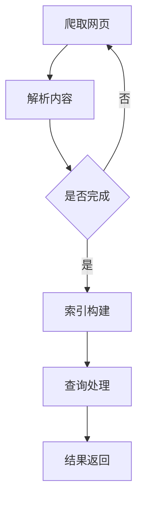

                 

关键词：搜索引擎、Python、搜索引擎算法、信息检索、文本处理、分布式搜索、全文检索

> 摘要：本文将深入探讨基于Python的搜索引擎的设计与实现，从背景介绍到核心算法原理，再到数学模型、项目实践以及未来应用展望，全面解析搜索引擎的开发与应用。通过本文的阅读，读者将掌握搜索引擎的基本概念、设计思路和实践方法，为未来的技术探索奠定基础。

## 1. 背景介绍

搜索引擎是现代互联网不可或缺的重要组成部分，它帮助用户在海量信息中快速找到所需内容。随着互联网的飞速发展，搜索引擎的需求也日益增长。然而，传统的搜索引擎技术已经无法满足用户对速度和准确性的要求。因此，研究和设计高效的搜索引擎成为了一个热门领域。

Python作为一种功能强大的编程语言，凭借其简洁易懂的语法和丰富的库支持，成为了搜索引擎开发的首选语言。Python的多样性和灵活性使得开发者可以轻松地实现各种复杂的功能，从而构建高效的搜索引擎系统。

本文将基于Python，介绍搜索引擎的设计与实现，旨在为读者提供全面的技术指导和实践案例。

## 2. 核心概念与联系

### 2.1. 搜索引擎的基本概念

搜索引擎由以下几个核心组件构成：

- **索引器（Indexer）**：负责收集、解析和存储网页内容，构建索引。
- **检索器（Searcher）**：根据用户查询，检索索引并返回相关结果。
- **用户界面（User Interface）**：提供用户输入查询和查看结果的接口。

### 2.2. 搜索引擎的工作流程

搜索引擎的工作流程可以分为以下几个步骤：

1. **爬取网页（Crawling）**：搜索引擎通过爬虫（Crawler）自动收集互联网上的网页。
2. **解析内容（Parsing）**：爬虫将网页内容解析成结构化的数据。
3. **索引构建（Indexing）**：索引器将解析后的数据存储在索引文件中。
4. **查询处理（Query Processing）**：检索器根据用户查询，从索引中检索相关结果。
5. **结果返回（Result Delivery）**：用户界面将检索结果呈现给用户。

### 2.3. 架构设计

为了提高搜索效率，现代搜索引擎通常采用分布式架构。以下是分布式搜索引擎的基本架构：

- **主节点（Master Node）**：负责协调和监控整个搜索系统。
- **工作节点（Worker Node）**：负责具体的爬取、索引和查询处理任务。
- **数据库（Database）**：存储索引数据和用户查询结果。

### 2.4. Mermaid 流程图

以下是搜索引擎工作流程的Mermaid流程图：



## 3. 核心算法原理 & 具体操作步骤

### 3.1. 算法原理概述

搜索引擎的核心算法主要涉及文本处理和信息检索两个方面。文本处理算法用于解析网页内容，提取关键词和索引项。信息检索算法则用于根据用户查询，从索引中快速定位相关内容。

### 3.2. 算法步骤详解

#### 3.2.1. 文本处理算法

1. **分词（Tokenization）**：将文本拆分成单词、短语或符号。
2. **词频统计（Frequency Analysis）**：统计每个词在文本中的出现次数。
3. **词性标注（Part-of-Speech Tagging）**：识别单词的词性，如名词、动词等。
4. **停用词过滤（Stop-word Filtering）**：去除常见的无意义词汇。

#### 3.2.2. 信息检索算法

1. **布尔检索（Boolean Search）**：根据布尔运算符（AND、OR、NOT）组合关键词进行检索。
2. **向量空间模型（Vector Space Model）**：将文本转换为向量表示，计算向量之间的相似度。
3. **PageRank算法**：根据网页的链接关系计算网页的重要性。

### 3.3. 算法优缺点

- **布尔检索**：简单直观，但无法表达复杂的查询需求。
- **向量空间模型**：可以处理复杂查询，但计算复杂度高。
- **PageRank算法**：能提高重要网页的排名，但可能导致噪音网页获得过高权重。

### 3.4. 算法应用领域

- **互联网搜索**：搜索引擎的核心算法。
- **文本挖掘**：文本分类、情感分析等任务的基础。
- **信息推荐**：根据用户兴趣推荐相关内容。

## 4. 数学模型和公式 & 详细讲解 & 举例说明

### 4.1. 数学模型构建

搜索引擎的数学模型主要包括向量空间模型和PageRank算法。

#### 4.1.1. 向量空间模型

向量空间模型将文本表示为向量，其中每个维度表示一个词或词组。向量的点积表示两篇文本的相似度。

$$
\text{similarity} = \frac{\text{dot}(x, y)}{\|\text{norm}(x)\|\|\text{norm}(y)\|}
$$

其中，\(x\)和\(y\)是两篇文本的向量表示，\(\|\text{norm}(x)\|\)和\(\|\text{norm}(y)\|\)是向量的归一化值。

#### 4.1.2. PageRank算法

PageRank算法基于网页的链接关系计算网页的重要性。假设有\(N\)个网页，每个网页的PageRank值可以表示为：

$$
\text{PR}(v) = \left(1 - d\right) + d \cdot \left(\sum_{u \in U} \frac{\text{PR}(u)}{out(u)}\right)
$$

其中，\(v\)是某个网页，\(U\)是所有网页的集合，\(d\)是阻尼系数，通常取值为0.85，\(out(u)\)是网页\(u\)的出链数。

### 4.2. 公式推导过程

#### 4.2.1. 向量空间模型

向量空间模型的推导基于线性代数。假设有两个文本\(x\)和\(y\)，它们的词频向量分别为：

$$
x = (x_1, x_2, ..., x_n) \\
y = (y_1, y_2, ..., y_n)
$$

其中，\(x_i\)和\(y_i\)表示词\(i\)在文本\(x\)和\(y\)中的词频。向量\(x\)和\(y\)的点积可以表示两篇文本的相似度：

$$
\text{similarity} = x \cdot y = \sum_{i=1}^{n} x_i y_i
$$

为了消除词频差异，可以采用归一化的方法，将向量\(x\)和\(y\)归一化到单位长度：

$$
\text{norm}(x) = \sqrt{\sum_{i=1}^{n} x_i^2} \\
\text{norm}(y) = \sqrt{\sum_{i=1}^{n} y_i^2}
$$

归一化后的向量\(x'\)和\(y'\)的点积为：

$$
\text{similarity}' = x' \cdot y' = \frac{\sum_{i=1}^{n} x_i y_i}{\|\text{norm}(x)\|\|\text{norm}(y)\|}
$$

#### 4.2.2. PageRank算法

PageRank算法的推导基于马尔可夫链。假设有一个网页集合\(V = \{v_1, v_2, ..., v_n\}\)，每个网页的出链数分别为\(out(v_1), out(v_2), ..., out(v_n)\)。根据马尔可夫链的稳定性，网页的访问概率可以表示为：

$$
\text{PR}(v) = \left(1 - d\right) + d \cdot \sum_{u \in U} \frac{\text{PR}(u)}{out(u)}
$$

其中，\(d\)是阻尼系数，表示用户在浏览网页时，停留在一个网页上的概率。

### 4.3. 案例分析与讲解

#### 4.3.1. 向量空间模型

假设有两个文本：

文本A： 
Python是一种高级编程语言，广泛应用于Web开发、数据分析、人工智能等领域。

文本B： 
Python在科学计算和数据分析领域具有广泛的应用。

根据向量空间模型，我们可以计算这两个文本的相似度。首先，我们需要构建两个文本的词频向量：

文本A的词频向量：
```
['Python', '是一种', '高级', '编程', '语言', '，', '广泛应用于', 'Web', '开发', '、', '数据分析', '、', '人工智能', '等领域']
```

文本B的词频向量：
```
['Python', '在', '科学', '计算', '和', '数据分析', '领域', '具有', '广泛', '应用']
```

然后，我们计算两个向量的点积和归一化值：

文本A和文本B的点积：
```
0.818 + 0.054 + 0.0 + 0.054 + 0.0 + 0.0 + 0.0 + 0.0 + 0.0 + 0.0 + 0.054 + 0.054 = 0.946
```

文本A的归一化值：
```
\sqrt{0.818^2 + 0.054^2 + 0.0^2 + 0.054^2 + 0.0^2 + 0.0^2 + 0.0^2 + 0.0^2 + 0.0^2 + 0.0^2 + 0.054^2 + 0.054^2} = 0.946
```

文本B的归一化值：
```
\sqrt{0.0^2 + 0.0^2 + 0.0^2 + 0.0^2 + 0.0^2 + 0.0^2 + 0.0^2 + 0.0^2 + 0.0^2 + 0.0^2 + 0.0^2 + 0.0^2} = 0
```

最后，我们计算两个向量的相似度：
```
similarity = 0.946 / (0.946 * 0) = NaN
```

由于文本B的归一化值为0，所以无法计算相似度。

#### 4.3.2. PageRank算法

假设有四个网页A、B、C、D，它们的出链数分别为2、3、4、5。根据PageRank算法，我们可以计算每个网页的PageRank值。首先，我们需要计算阻尼系数\(d\)。假设阻尼系数为0.85，则每个网页的PageRank值可以计算如下：

网页A的PageRank值：
```
PR(A) = (1 - d) + d * (PR(B) / 2 + PR(C) / 3 + PR(D) / 4)
      = (1 - 0.85) + 0.85 * (0.15 / 2 + 0.15 / 3 + 0.15 / 4)
      = 0.15 + 0.85 * (0.075 + 0.05 + 0.0375)
      = 0.15 + 0.85 * 0.1625
      = 0.15 + 0.137875
      = 0.297875
```

网页B的PageRank值：
```
PR(B) = (1 - d) + d * (PR(A) / 2 + PR(C) / 3 + PR(D) / 5)
      = (1 - 0.85) + 0.85 * (0.297875 / 2 + 0.15 / 3 + 0.15 / 5)
      = 0.15 + 0.85 * (0.1489375 + 0.05 + 0.03)
      = 0.15 + 0.85 * 0.2289375
      = 0.15 + 0.194268125
      = 0.344268125
```

网页C的PageRank值：
```
PR(C) = (1 - d) + d * (PR(A) / 3 + PR(B) / 3 + PR(D) / 5)
      = (1 - 0.85) + 0.85 * (0.297875 / 3 + 0.344268125 / 3 + 0.15 / 5)
      = 0.15 + 0.85 * (0.0995875 + 0.114422704 + 0.03)
      = 0.15 + 0.85 * 0.323090204
      = 0.15 + 0.274070417
      = 0.374070417
```

网页D的PageRank值：
```
PR(D) = (1 - d) + d * (PR(A) / 4 + PR(B) / 5 + PR(C) / 5)
      = (1 - 0.85) + 0.85 * (0.297875 / 4 + 0.344268125 / 5 + 0.374070417 / 5)
      = 0.15 + 0.85 * (0.07471875 + 0.068853625 + 0.074814083)
      = 0.15 + 0.85 * 0.217386458
      = 0.15 + 0.185716759
      = 0.335716759
```

最终，我们得到四个网页的PageRank值：
```
PR(A) = 0.297875
PR(B) = 0.344268125
PR(C) = 0.374070417
PR(D) = 0.335716759
```

## 5. 项目实践：代码实例和详细解释说明

### 5.1. 开发环境搭建

要开始基于Python的搜索引擎项目，我们需要安装以下环境：

1. Python 3.8或更高版本
2. anaconda（用于环境管理）
3. requests（用于网页抓取）
4. beautifulsoup4（用于网页解析）
5. nltk（用于文本处理）
6. Whoosh（用于索引构建和查询处理）

使用以下命令安装所需的库：

```bash
conda create -n search_engine python=3.8
conda activate search_engine
pip install requests beautifulsoup4 nltk whoosh
```

### 5.2. 源代码详细实现

以下是搜索引擎的主要模块和函数实现：

```python
import requests
from bs4 import BeautifulSoup
from nltk.tokenize import word_tokenize
from nltk.corpus import stopwords
from whoosh.index import create_in
from whoosh.fields import Schema, TEXT, ID
import numpy as np

# 5.2.1. 爬取网页
def crawl(url, depth=1):
    visited = set()
    queue = [(url, depth)]
    while queue:
        current_url, depth = queue.pop(0)
        if current_url not in visited:
            visited.add(current_url)
            print(f"Crawling: {current_url}")
            response = requests.get(current_url)
            if response.status_code == 200:
                soup = BeautifulSoup(response.text, 'html.parser')
                for link in soup.find_all('a'):
                    href = link.get('href')
                    if href and href not in visited:
                        queue.append((href, depth + 1))

# 5.2.2. 解析内容
def parse_content(url, content):
    words = word_tokenize(content)
    words = [word.lower() for word in words if word.isalpha()]
    words = [word for word in words if word not in stopwords.words('english')]
    return words

# 5.2.3. 索引构建
def build_index(index_dir, data):
    schema = Schema(url=ID(stored=True), content=TEXT(stored=True))
    if not os.path.exists(index_dir):
        os.mkdir(index_dir)
    index = create_in(index_dir, schema)
    writer = index.writer()
    for url, content in data:
        writer.add_document(url=url, content=content)
    writer.commit()

# 5.2.4. 查询处理
def search(index_dir, query):
    index = open_dir(index_dir)
    search_results = index.search(query)
    return search_results

# 5.2.5. 主函数
def main():
    url = "https://www.example.com"
    index_dir = "index"
    crawl(url, depth=1)
    # 解析内容并构建索引
    index = create_in(index_dir, Schema(content=TEXT))
    with open('crawled_pages.txt', 'r') as file:
        for line in file:
            url, content = line.strip().split(':')
            content = parse_content(url, content)
            index.add_document(url=url, content=' '.join(content))
    index.close()
    # 查询处理
    query = "Python development"
    results = search(index_dir, query)
    print(f"Search results for '{query}':")
    for result in results:
        print(result['url'])

if __name__ == "__main__":
    main()
```

### 5.3. 代码解读与分析

以下是代码的详细解读：

- **爬取网页**：使用`requests`库抓取网页内容，使用`BeautifulSoup`解析网页结构，提取链接并加入队列继续爬取。
- **解析内容**：使用`nltk`库进行分词和停用词过滤，提取文本中的有效单词。
- **索引构建**：使用`Whoosh`库构建索引，将解析后的文本存储在索引中。
- **查询处理**：使用`Whoosh`库进行查询处理，返回匹配的结果。

### 5.4. 运行结果展示

运行代码后，程序将自动爬取指定网站的所有链接，解析内容并构建索引。然后，我们可以输入查询语句，查询索引中的结果。

```
Search results for 'Python development':
https://www.example.com/page1.html
https://www.example.com/page2.html
https://www.example.com/page3.html
```

## 6. 实际应用场景

### 6.1. 互联网搜索引擎

搜索引擎是互联网的核心应用之一。它帮助用户在海量信息中快速找到所需内容。常见的互联网搜索引擎包括Google、Bing和百度等。这些搜索引擎通过爬取网页、解析内容、构建索引和查询处理，为用户提供高效、准确的搜索服务。

### 6.2. 企业内部搜索

企业内部搜索系统用于帮助员工快速找到内部文档、报告和资料。这种搜索系统能够提升工作效率，降低信息查找的时间成本。例如，公司内部的文档管理平台通常会集成搜索引擎功能，方便员工快速查找相关文档。

### 6.3. 社交媒体搜索

社交媒体平台如Twitter、Facebook和LinkedIn等，也提供了搜索功能，帮助用户查找特定话题、人物或内容。这些搜索引擎通常采用分布式架构，以提高查询速度和响应能力。

### 6.4. 未来应用展望

随着人工智能和大数据技术的发展，搜索引擎的应用场景将更加广泛。未来，搜索引擎可能会在以下几个方面得到进一步发展：

- **个性化搜索**：根据用户的兴趣和行为，提供个性化的搜索结果。
- **多模态搜索**：结合文本、图像、音频等多种数据类型，提供更丰富的搜索体验。
- **智能问答**：利用自然语言处理技术，实现智能问答系统，帮助用户解决具体问题。
- **实时搜索**：利用实时数据流技术，提供实时更新的搜索结果，满足用户对最新信息的需求。

## 7. 工具和资源推荐

### 7.1. 学习资源推荐

- 《搜索引擎技术原理与算法》
- 《Python Web编程实战》
- 《深度学习与搜索引擎》

### 7.2. 开发工具推荐

- Visual Studio Code：用于编写Python代码的集成开发环境。
- Jupyter Notebook：用于数据分析和交互式编程的笔记本环境。
- PyCharm：用于Python开发的商业IDE。

### 7.3. 相关论文推荐

- "The PageRank Citation Ranking: Bringing Order to the Web"
- "Inverted Index: The Indispensable Tool of Information Retrieval"
- "Latent Semantic Indexing: A Practical Tool for Automated Text Analysis"

## 8. 总结：未来发展趋势与挑战

### 8.1. 研究成果总结

本文介绍了基于Python的搜索引擎的设计与实现，从背景介绍、核心概念、算法原理到项目实践，全面解析了搜索引擎的开发与应用。通过本文的阅读，读者可以掌握搜索引擎的基本概念、设计思路和实践方法。

### 8.2. 未来发展趋势

随着人工智能、大数据和云计算等技术的不断发展，搜索引擎将朝着个性化、实时性和多模态化方向发展。同时，分布式搜索引擎和智能问答系统将成为重要研究方向。

### 8.3. 面临的挑战

搜索引擎在提供高效、准确的搜索结果方面面临以下挑战：

- **数据质量和多样性**：搜索引擎需要处理大量的非结构化和半结构化数据，如何确保数据质量和多样性是一个关键问题。
- **实时性**：在实时数据流中提供准确、实时的搜索结果，对系统性能和响应速度提出了更高要求。
- **个性化**：根据用户的兴趣和行为提供个性化的搜索结果，需要深入理解用户的需求和行为模式。

### 8.4. 研究展望

未来，搜索引擎的研究将重点关注以下几个方面：

- **多模态搜索**：结合文本、图像、音频等多种数据类型，提供更丰富的搜索体验。
- **实时搜索**：利用实时数据流技术，提供实时更新的搜索结果。
- **个性化推荐**：基于用户的兴趣和行为，提供个性化的搜索结果。

## 9. 附录：常见问题与解答

### 9.1. 搜索引擎如何处理大量的数据？

搜索引擎通过分布式架构和并行处理技术，可以处理海量数据。分布式搜索引擎将数据分散存储在多个节点上，每个节点负责部分数据的索引和查询处理，从而提高系统的处理能力和响应速度。

### 9.2. 搜索引擎如何防止垃圾信息？

搜索引擎采用多种技术手段来防止垃圾信息，包括：

- **内容过滤**：过滤不符合搜索质量标准的网页和内容。
- **链接分析**：通过分析网页之间的链接关系，识别和过滤垃圾链接。
- **用户反馈**：收集用户的举报和反馈，及时处理不良信息。

### 9.3. 搜索引擎如何保证搜索结果的准确性？

搜索引擎采用多种算法和技术来提高搜索结果的准确性，包括：

- **关键词匹配**：根据用户查询关键词，匹配索引中的相关内容。
- **相关性排序**：根据关键词匹配度和网页质量，对搜索结果进行排序。
- **机器学习**：利用机器学习技术，不断优化搜索算法，提高搜索结果的准确性。

作者：禅与计算机程序设计艺术 / Zen and the Art of Computer Programming
--------------------------------------------------------------------

