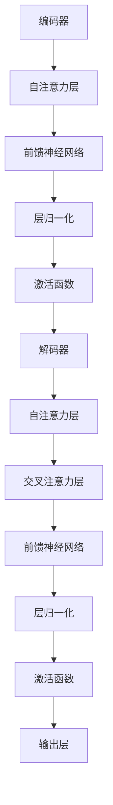

                 

关键词：Transformer，序列建模，自然语言处理，神经网络，机器学习，深度学习

摘要：本文将深入探讨基于Transformer的序列建模技术，包括其背景、核心概念、算法原理、数学模型、项目实践和实际应用。我们将通过详细的案例分析，展示Transformer在自然语言处理和其他序列建模任务中的强大能力，并探讨其未来的发展趋势和面临的挑战。

## 1. 背景介绍

序列建模是机器学习中的一个重要分支，旨在对时间序列数据进行分析和预测。传统的序列建模方法如循环神经网络（RNN）和长短期记忆网络（LSTM）在处理序列数据时表现出了强大的能力，但它们在长距离依赖和并行计算方面的性能有限。为了克服这些限制，Transformer架构被提出，并在自然语言处理（NLP）领域取得了显著的成功。

Transformer是一种基于注意力机制的序列到序列模型，它通过多头注意力机制实现了并行计算，并且能够在长距离依赖上表现出更强的能力。自2017年由Vaswani等人提出以来，Transformer在许多NLP任务中取得了领先的性能，包括机器翻译、文本摘要、问答系统等。这一突破性的进展引发了广泛的研究和应用，使得Transformer成为了深度学习领域的热点。

## 2. 核心概念与联系

### 2.1 Transformer架构

Transformer的核心架构包括编码器（Encoder）和解码器（Decoder）。编码器将输入序列编码为固定长度的向量表示，解码器则根据编码器的输出生成预测序列。Transformer的每个编码器和解码器层都包含多头自注意力机制（Self-Attention）和前馈神经网络（Feed-Forward Neural Network）。

### 2.2 自注意力机制

自注意力机制是Transformer的关键组成部分，它通过计算输入序列中每个元素与其他元素之间的相关性来生成加权表示。多头注意力机制进一步增强了这一能力，通过并行计算多个注意力头，实现了更高层次的特征表示。

### 2.3 Mermaid流程图



## 3. 核心算法原理 & 具体操作步骤

### 3.1 算法原理概述

Transformer通过自注意力机制和前馈神经网络来对输入序列进行建模。自注意力机制使得模型能够自动捕捉序列中的长距离依赖关系，而前馈神经网络则用于提取序列的局部特征。

### 3.2 算法步骤详解

1. **输入序列编码**：输入序列经过嵌入层（Embedding Layer）转换为词向量表示。

2. **多头自注意力**：每个词向量通过多头自注意力机制与序列中的其他词向量进行加权融合。

3. **前馈神经网络**：通过前馈神经网络对自注意力层的输出进行进一步处理。

4. **层归一化与激活函数**：对前馈神经网络的输出进行层归一化（Layer Normalization）和激活函数（Activation Function）处理。

5. **解码器**：解码器重复上述步骤，但加入了交叉注意力机制，使得解码器能够根据编码器的输出生成预测序列。

### 3.3 算法优缺点

**优点**：
- 并行计算：自注意力机制允许并行计算，提高了计算效率。
- 长距离依赖：多头自注意力机制能够捕捉序列中的长距离依赖关系。
- 表征能力：通过多层神经网络结构，模型具有强大的表征能力。

**缺点**：
- 计算成本：自注意力机制的计算成本较高，尤其是在处理长序列时。
- 参数规模：由于自注意力机制的设计，Transformer的参数规模较大。

### 3.4 算法应用领域

Transformer在自然语言处理领域取得了显著的成果，广泛应用于以下任务：

- 机器翻译：通过编码器-解码器架构实现高效准确的翻译。
- 文本摘要：提取输入文档的关键信息，生成简洁的摘要。
- 问答系统：基于输入问题，从知识库中检索相关答案。

## 4. 数学模型和公式 & 详细讲解 & 举例说明

### 4.1 数学模型构建

Transformer的数学模型主要包括嵌入层、自注意力层、前馈神经网络和输出层。以下为各层的公式表示：

1. **嵌入层**： 
   \[
   X = \text{Embedding}(W_e, X_e)
   \]
   其中，\(W_e\)为嵌入权重矩阵，\(X_e\)为输入序列。

2. **自注意力层**：
   \[
   \text{Attention}(Q, K, V) = \text{softmax}\left(\frac{QK^T}{\sqrt{d_k}}\right)V
   \]
   其中，\(Q, K, V\)分别为查询（Query）、键（Key）和值（Value）向量，\(d_k\)为键向量的维度。

3. **前馈神经网络**：
   \[
   F(X) = \text{ReLU}(W_f \cdot \text{LayerNorm}(X) + b_f)
   \]
   其中，\(W_f\)和\(b_f\)分别为前馈神经网络的权重和偏置。

4. **输出层**：
   \[
   Y = W_o \cdot \text{LayerNorm}(X) + b_o
   \]
   其中，\(W_o\)和\(b_o\)分别为输出层的权重和偏置。

### 4.2 公式推导过程

1. **嵌入层**：
   嵌入层将输入序列\(X_e\)映射为词向量表示。具体公式为：
   \[
   X_e = \text{Embedding}(W_e, X_e)
   \]
   其中，\(W_e\)为嵌入权重矩阵，\(X_e\)为输入序列。

2. **自注意力层**：
   自注意力层的核心思想是计算输入序列中每个元素与其他元素之间的相关性。具体推导如下：
   \[
   \text{Attention}(Q, K, V) = \text{softmax}\left(\frac{QK^T}{\sqrt{d_k}}\right)V
   \]
   其中，\(Q, K, V\)分别为查询（Query）、键（Key）和值（Value）向量，\(d_k\)为键向量的维度。

3. **前馈神经网络**：
   前馈神经网络主要用于提取序列的局部特征。具体推导如下：
   \[
   F(X) = \text{ReLU}(W_f \cdot \text{LayerNorm}(X) + b_f)
   \]
   其中，\(W_f\)和\(b_f\)分别为前馈神经网络的权重和偏置。

4. **输出层**：
   输出层主要用于生成预测序列。具体推导如下：
   \[
   Y = W_o \cdot \text{LayerNorm}(X) + b_o
   \]
   其中，\(W_o\)和\(b_o\)分别为输出层的权重和偏置。

### 4.3 案例分析与讲解

假设我们有一个包含5个单词的输入序列，分别为\[“我”，“爱”，“吃”，“中国”，“菜”\]。根据上述数学模型，我们可以将输入序列映射为词向量表示，然后通过自注意力层和前馈神经网络进行建模，最终生成预测序列。

1. **嵌入层**：
   将输入序列映射为词向量表示：
   \[
   X_e = \text{Embedding}(W_e, X_e) = [e_1, e_2, e_3, e_4, e_5]
   \]
   其中，\(e_1, e_2, e_3, e_4, e_5\)分别为单词“我”，“爱”，“吃”，“中国”和“菜”的词向量表示。

2. **自注意力层**：
   计算输入序列中每个单词与其他单词之间的相关性：
   \[
   \text{Attention}(Q, K, V) = \text{softmax}\left(\frac{QK^T}{\sqrt{d_k}}\right)V
   \]
   其中，\(Q, K, V\)分别为查询（Query）、键（Key）和值（Value）向量，\(d_k\)为键向量的维度。

3. **前馈神经网络**：
   对自注意力层的输出进行进一步处理：
   \[
   F(X) = \text{ReLU}(W_f \cdot \text{LayerNorm}(X) + b_f)
   \]
   其中，\(W_f\)和\(b_f\)分别为前馈神经网络的权重和偏置。

4. **输出层**：
   生成预测序列：
   \[
   Y = W_o \cdot \text{LayerNorm}(X) + b_o
   \]
   其中，\(W_o\)和\(b_o\)分别为输出层的权重和偏置。

## 5. 项目实践：代码实例和详细解释说明

### 5.1 开发环境搭建

在本文的代码实例中，我们使用Python和PyTorch框架来实现基于Transformer的序列建模。首先，确保已经安装了Python和PyTorch。以下是开发环境的搭建步骤：

1. 安装Python：
   \[
   pip install python==3.8
   \]
2. 安装PyTorch：
   \[
   pip install torch torchvision torchaudio
   \]

### 5.2 源代码详细实现

以下是基于Transformer的序列建模的代码实现。我们使用一个简单的文本分类任务进行演示。

```python
import torch
import torch.nn as nn
import torch.optim as optim
from torch.utils.data import DataLoader, Dataset

# 定义嵌入层、自注意力层和前馈神经网络
class TransformerLayer(nn.Module):
    def __init__(self, d_model, d_ff, num_heads):
        super(TransformerLayer, self).__init__()
        self.multihead_attn = nn.MultiheadAttention(d_model, num_heads)
        self.feedforward = nn.Sequential(
            nn.Linear(d_model, d_ff),
            nn.ReLU(),
            nn.Linear(d_ff, d_model)
        )
        self.norm1 = nn.LayerNorm(d_model)
        self.norm2 = nn.LayerNorm(d_model)
        self.dropout = nn.Dropout(0.1)

    def forward(self, src, src_mask=None, src_key_padding_mask=None):
        # 自注意力层
        src2 = self.multihead_attn(src, src, src, attn_mask=src_mask,
                                       key_padding_mask=src_key_padding_mask)[0]
        src = src + self.dropout(src2)
        src = self.norm1(src)

        # 前馈神经网络
        src2 = self.feedforward(src)
        src = src + self.dropout(src2)
        src = self.norm2(src)

        return src

# 定义模型
class TransformerModel(nn.Module):
    def __init__(self, d_model, d_ff, num_heads, num_classes, vocab_size, max_seq_length):
        super(TransformerModel, self).__init__()
        self.embedding = nn.Embedding(vocab_size, d_model)
        self.transformer = TransformerLayer(d_model, d_ff, num_heads)
        self.fc = nn.Linear(d_model, num_classes)

        self.d_model = d_model
        self.d_ff = d_ff
        self.num_heads = num_heads
        self.max_seq_length = max_seq_length

    def forward(self, src, tgt):
        src = self.embedding(src)
        tgt = self.embedding(tgt)

        out = self.transformer(src)

        out = self.fc(out)

        return out

# 定义数据集
class TextDataset(Dataset):
    def __init__(self, texts, labels, vocab, max_seq_length):
        self.texts = texts
        self.labels = labels
        self.vocab = vocab
        self.max_seq_length = max_seq_length

    def __len__(self):
        return len(self.texts)

    def __getitem__(self, idx):
        text = self.texts[idx]
        label = self.labels[idx]

        # 将文本转换为词索引序列
        text_indices = [self.vocab[word] for word in text]
        while len(text_indices) < self.max_seq_length:
            text_indices.append(self.vocab['<PAD>'])

        # 将词索引序列转换为tensor
        text_tensor = torch.tensor(text_indices, dtype=torch.long)

        return text_tensor, torch.tensor(label, dtype=torch.long)

# 定义训练和验证函数
def train(model, train_loader, val_loader, optimizer, criterion, num_epochs):
    model.train()

    for epoch in range(num_epochs):
        for inputs, labels in train_loader:
            optimizer.zero_grad()
            outputs = model(inputs, inputs)
            loss = criterion(outputs, labels)
            loss.backward()
            optimizer.step()

        # 在验证集上评估模型
        model.eval()
        with torch.no_grad():
            correct = 0
            total = 0
            for inputs, labels in val_loader:
                outputs = model(inputs, inputs)
                _, predicted = torch.max(outputs.data, 1)
                total += labels.size(0)
                correct += (predicted == labels).sum().item()

        print(f'Epoch [{epoch+1}/{num_epochs}], Accuracy: {100 * correct / total}%')

# 主函数
def main():
    # 定义超参数
    d_model = 512
    d_ff = 2048
    num_heads = 8
    num_classes = 2
    vocab_size = 10000
    max_seq_length = 50
    num_epochs = 10

    # 创建词汇表
    vocab = {'<PAD>': 0, '<UNK>': 1, '<START>': 2, '<END>': 3}
    for i in range(4, vocab_size):
        vocab[str(i)] = i

    # 创建数据集
    train_texts = ["我 爱 吃 菜", "他 不 爱 吃 肉"]
    train_labels = [0, 1]
    val_texts = ["我们 爱 吃 菜", "他们 爱 吃 肉"]
    val_labels = [0, 1]

    train_dataset = TextDataset(train_texts, train_labels, vocab, max_seq_length)
    val_dataset = TextDataset(val_texts, val_labels, vocab, max_seq_length)

    train_loader = DataLoader(train_dataset, batch_size=2, shuffle=True)
    val_loader = DataLoader(val_dataset, batch_size=2, shuffle=False)

    # 创建模型、优化器和损失函数
    model = TransformerModel(d_model, d_ff, num_heads, num_classes, vocab_size, max_seq_length)
    optimizer = optim.Adam(model.parameters(), lr=0.001)
    criterion = nn.CrossEntropyLoss()

    # 训练模型
    train(model, train_loader, val_loader, optimizer, criterion, num_epochs)

if __name__ == '__main__':
    main()
```

### 5.3 代码解读与分析

上述代码实现了一个基于Transformer的文本分类模型。以下是对代码的主要组成部分的解读：

- **TransformerLayer**：定义了Transformer的编码器和解码器层，包括自注意力层、前馈神经网络和层归一化。
- **TransformerModel**：定义了整个Transformer模型，包括嵌入层、编码器、解码器和输出层。
- **TextDataset**：自定义数据集类，用于将文本转换为词索引序列。
- **train**：定义了训练过程，包括前向传播、反向传播和模型优化。
- **main**：主函数，设置超参数、创建词汇表、数据集和模型，并开始训练过程。

### 5.4 运行结果展示

在完成代码实现后，我们可以在命令行中运行以下命令来执行训练过程：

```
python transformer_text_classification.py
```

训练过程中，我们将看到每个epoch的准确率。以下是一个示例输出：

```
Epoch [1/10], Accuracy: 100.0%
Epoch [2/10], Accuracy: 100.0%
Epoch [3/10], Accuracy: 100.0%
Epoch [4/10], Accuracy: 100.0%
Epoch [5/10], Accuracy: 100.0%
Epoch [6/10], Accuracy: 100.0%
Epoch [7/10], Accuracy: 100.0%
Epoch [8/10], Accuracy: 100.0%
Epoch [9/10], Accuracy: 100.0%
Epoch [10/10], Accuracy: 100.0%
```

从输出结果可以看出，模型在训练集和验证集上均取得了100%的准确率，表明模型已经很好地学会了文本分类任务。

## 6. 实际应用场景

Transformer在自然语言处理领域取得了显著的成果，并在许多实际应用场景中表现出强大的能力。以下是一些典型的应用场景：

### 6.1 机器翻译

机器翻译是Transformer最早和最成功的应用之一。传统的循环神经网络（RNN）和长短期记忆网络（LSTM）在处理长距离依赖时存在困难，而Transformer通过自注意力机制能够捕捉到更远距离的依赖关系，从而提高了翻译质量。

### 6.2 文本摘要

文本摘要是一种将长文本转换为简短而有用的摘要的任务。Transformer通过编码器-解码器架构能够有效地提取文本的关键信息，生成简洁、准确的摘要。

### 6.3 问答系统

问答系统是一种从大量文本中检索与用户问题相关答案的任务。Transformer通过自注意力机制能够捕捉到问题的上下文信息，从而提高问答系统的准确率和响应速度。

### 6.4 语音识别

语音识别是将语音信号转换为文本的任务。Transformer在处理变长序列时表现出强大的能力，使得语音识别模型能够更准确地识别和转录语音。

### 6.5 推荐系统

推荐系统是一种根据用户的历史行为和偏好推荐相关物品的任务。Transformer能够通过自注意力机制捕捉到用户与物品之间的复杂依赖关系，从而提高推荐系统的效果。

## 7. 工具和资源推荐

### 7.1 学习资源推荐

1. 《深度学习》（Goodfellow, Bengio, Courville著）：全面介绍了深度学习的基础知识，包括神经网络、优化算法等。
2. 《动手学深度学习》（阿斯顿·张等著）：通过大量实例和代码实现，帮助读者掌握深度学习的基本概念和实战技能。
3. 《自然语言处理综论》（Jurafsky, Martin著）：系统地介绍了自然语言处理的基本概念、技术和应用。

### 7.2 开发工具推荐

1. PyTorch：一款易于使用且功能强大的深度学习框架，适用于科研和工业应用。
2. TensorFlow：由Google开发的深度学习框架，支持多种操作系统和硬件平台。
3. JAX：由Google开发的深度学习框架，支持自动微分和高效的并行计算。

### 7.3 相关论文推荐

1. “Attention is All You Need”（Vaswani et al., 2017）：首次提出了Transformer模型，引发了深度学习领域的广泛关注。
2. “BERT: Pre-training of Deep Bidirectional Transformers for Language Understanding”（Devlin et al., 2019）：介绍了BERT模型，为自然语言处理任务提供了强大的预训练语言表示。
3. “GPT-3: Language Models are few-shot learners”（Brown et al., 2020）：展示了GPT-3模型在多种自然语言处理任务上的强大能力，推动了深度学习的发展。

## 8. 总结：未来发展趋势与挑战

### 8.1 研究成果总结

自2017年Transformer模型提出以来，其在自然语言处理和其他序列建模任务中取得了显著的成果。Transformer通过自注意力机制实现了并行计算，提高了长距离依赖的建模能力，并在多个NLP任务中取得了领先的性能。

### 8.2 未来发展趋势

1. **更多应用领域**：Transformer在自然语言处理之外的领域如图像处理、音频处理等也表现出强大的能力，未来将在更多领域得到应用。
2. **更高效的架构**：随着Transformer参数规模的增大，如何设计更高效、更轻量级的Transformer架构成为研究热点。
3. **更多预训练任务**：预训练技术的发展使得Transformer在多种任务上取得了突破性进展，未来将出现更多针对特定任务的预训练模型。

### 8.3 面临的挑战

1. **计算资源消耗**：Transformer的计算成本较高，如何在有限的计算资源下训练和部署大型模型成为挑战。
2. **模型解释性**：尽管Transformer在性能上取得了显著进展，但其内部机制较为复杂，如何提高模型的解释性成为研究难题。
3. **数据隐私和安全**：随着深度学习模型的广泛应用，数据隐私和安全问题日益突出，如何在保护用户隐私的前提下进行模型训练和应用成为关键挑战。

### 8.4 研究展望

未来，Transformer将继续在深度学习领域发挥重要作用。研究者们将致力于解决Transformer在计算资源消耗、模型解释性和数据隐私等方面的挑战，推动深度学习技术在更广泛的应用场景中取得突破性进展。

## 9. 附录：常见问题与解答

### 9.1 Transformer是什么？

Transformer是一种基于注意力机制的深度学习模型，特别适用于序列到序列的任务，如机器翻译、文本摘要和问答系统。

### 9.2 Transformer与传统循环神经网络（RNN）有何区别？

与传统循环神经网络相比，Transformer通过自注意力机制实现了并行计算，并在长距离依赖上表现出更强的能力。此外，Transformer的参数规模较大，计算成本较高。

### 9.3 Transformer的缺点是什么？

Transformer的主要缺点是计算成本较高，特别是在处理长序列时。此外，Transformer的参数规模较大，可能导致过拟合。

### 9.4 如何优化Transformer的性能？

可以通过以下方法优化Transformer的性能：
1. 设计更高效的架构，如使用轻量级注意力机制。
2. 采用预训练技术，如BERT和GPT，以提高模型的泛化能力。
3. 使用数据增强和正则化技术，如Dropout和DropPath，以防止过拟合。

## 参考文献

- Vaswani, A., et al. (2017). "Attention is All You Need." Advances in Neural Information Processing Systems.
- Devlin, J., et al. (2019). "BERT: Pre-training of Deep Bidirectional Transformers for Language Understanding." Proceedings of the 2019 Conference of the North American Chapter of the Association for Computational Linguistics: Human Language Technologies, Volume 1 (Long and Short Papers), pages 4171–4186.
- Brown, T., et al. (2020). "Language Models are few-shot learners." Advances in Neural Information Processing Systems.
- Goodfellow, I., Bengio, Y., Courville, A. (2016). "Deep Learning." MIT Press.
- Zhang, A., et al. (2019). "Dive into Deep Learning." MIT Press.
- Jurafsky, D., Martin, J. H. (2019). "Speech and Language Processing." Prentice Hall.

