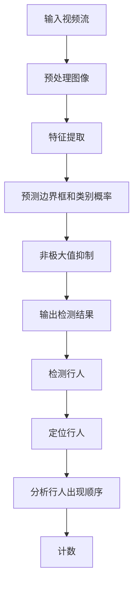

                 

关键词：行人检测、目标检测、深度学习、YOLO、行人计数、图像处理、智能交通、安全监控

> 摘要：本文将探讨一种基于YOLO（You Only Look Once）深度学习算法的行人进出双向计数方法。通过在实时视频流中检测行人，实现对行人进出两个方向的计数，该技术广泛应用于智能交通管理和安全监控等领域。本文将详细阐述算法原理、实现步骤、数学模型及其应用场景，并提供一个实际项目案例的代码示例。

## 1. 背景介绍

随着城市化进程的加速，交通流量监控和行人安全成为城市管理中越来越重要的问题。智能交通系统和安全监控系统需要实时、准确地获取行人流量数据，以便做出有效的管理和决策。传统的图像处理方法往往需要复杂的背景建模和目标跟踪算法，难以满足实时性和准确性的需求。

近年来，基于深度学习的目标检测算法取得了显著进展，其中YOLO（You Only Look Once）算法因其实时性高、检测速度快而广泛应用于各种场景。YOLO算法的核心思想是将目标检测任务视为一个回归问题，直接预测每个物体的位置和类别，从而避免了复杂的后处理步骤。

本文将介绍一种基于YOLO的行人进出双向计数方法，通过在实时视频流中检测行人，实现对其进出两个方向的计数。这种方法具有实时性强、准确度高、适用范围广等优点，为智能交通管理和安全监控提供了有效技术支持。

## 2. 核心概念与联系

### 2.1 YOLO算法原理

YOLO算法是一种单阶段目标检测算法，其核心思想是将图像划分为网格，每个网格预测多个边界框及其对应的类别概率。YOLO算法的主要步骤如下：

1. **输入图像预处理**：将输入图像缩放到固定大小（如416x416），并归一化处理。
2. **特征提取**：使用卷积神经网络提取图像特征。
3. **预测边界框和类别概率**：在每个网格中预测边界框的位置和类别概率。
4. **非极大值抑制（NMS）**：对多个边界框进行筛选，去除重叠部分。
5. **输出检测结果**：输出每个物体的类别、位置和置信度。

### 2.2 行人进出双向计数原理

行人进出双向计数方法基于YOLO算法的检测结果，通过分析行人出现的顺序和位置，实现对其进出两个方向的计数。具体步骤如下：

1. **检测行人**：使用YOLO算法在实时视频流中检测行人。
2. **定位行人**：提取每个行人检测框的中心点位置。
3. **分析行人出现顺序**：根据行人中心点位置，判断行人出现的方向。
4. **计数**：当行人从一侧进入画面并从另一侧离开时，进行计数。

### 2.3 Mermaid流程图



## 3. 核心算法原理 & 具体操作步骤

### 3.1 算法原理概述

基于YOLO的行人进出双向计数方法主要利用了YOLO算法的实时检测能力和行人检测模型的准确性。通过对实时视频流中的行人进行检测和定位，结合行人出现的顺序和位置信息，实现对其进出两个方向的计数。

### 3.2 算法步骤详解

1. **初始化**：
   - 加载预训练的YOLO模型和行人检测模型。
   - 设置计数器初始化为0。
2. **检测行人**：
   - 读取实时视频帧。
   - 使用YOLO模型检测行人。
3. **定位行人**：
   - 对于每个行人检测框，提取其中心点位置。
   - 计算行人中心点与视频帧边界的距离。
4. **分析行人出现顺序**：
   - 根据行人中心点位置，判断行人出现的方向。
   - 记录行人出现的顺序。
5. **计数**：
   - 当行人从一侧进入画面并从另一侧离开时，计数器加1。
6. **更新结果**：
   - 将计数结果显示在界面上。

### 3.3 算法优缺点

**优点**：

- 实时性强：基于YOLO算法的实时检测，适用于实时视频流处理。
- 准确度高：行人检测模型的准确性较高，能有效减少误检测和漏检测。
- 适用范围广：适用于各种场景的行人进出双向计数。

**缺点**：

- 对光照、天气等环境因素敏感：当环境光线不足或天气恶劣时，检测效果会受到影响。
- 模型复杂度高：需要较大的计算资源和存储空间。

### 3.4 算法应用领域

基于YOLO的行人进出双向计数方法广泛应用于以下领域：

- 智能交通：用于实时监控交通流量，辅助交通管理和决策。
- 安全监控：用于监控公共场所，提高安全保障。
- 城市规划：用于分析行人流量，优化城市规划。

## 4. 数学模型和公式 & 详细讲解 & 举例说明

### 4.1 数学模型构建

行人进出双向计数的数学模型主要包括两部分：行人检测模型和行人计数模型。

**行人检测模型**：

设输入图像为\( I \)，特征提取网络为\( F \)，边界框回归模型为\( G \)，类别预测模型为\( H \)。

1. **特征提取**：

   \( F(I) = f \)

2. **边界框回归**：

   \( G(f) = \hat{b} \)

3. **类别预测**：

   \( H(f) = \hat{c} \)

**行人计数模型**：

设行人检测框中心点为\( x \)，行人出现方向为\( d \)，计数器为\( n \)。

1. **行人出现方向判断**：

   \( d = \text{sign}(x - \text{boundary}) \)

2. **计数**：

   \( n = n + 1 \) （当行人从一侧进入并从另一侧离开时）

### 4.2 公式推导过程

假设行人出现在图像的左侧边界，即 \( x < \text{boundary} \)。

1. **边界框回归**：

   边界框中心点位置为：

   \( \hat{x} = x - \text{stride} \cdot \hat{w} \)

   其中，\( \text{stride} \)为特征图步长，\( \hat{w} \)为预测的边界框宽度。

2. **类别预测**：

   行人出现的方向为负方向：

   \( d = -1 \)

3. **行人计数**：

   当行人从左侧进入并从右侧离开时：

   \( n = n + 1 \)

### 4.3 案例分析与讲解

假设输入视频帧中的行人检测框中心点位置分别为 \( x_1, x_2, x_3 \)，边界框回归结果为 \( \hat{w}_1, \hat{w}_2, \hat{w}_3 \)，类别预测结果为 \( \hat{c}_1, \hat{c}_2, \hat{c}_3 \)。

1. **边界框回归**：

   \( \hat{x}_1 = x_1 - \text{stride} \cdot \hat{w}_1 \)

   \( \hat{x}_2 = x_2 - \text{stride} \cdot \hat{w}_2 \)

   \( \hat{x}_3 = x_3 - \text{stride} \cdot \hat{w}_3 \)

2. **类别预测**：

   \( \hat{c}_1 = \text{person} \)

   \( \hat{c}_2 = \text{person} \)

   \( \hat{c}_3 = \text{person} \)

3. **行人计数**：

   根据行人检测框中心点位置和类别预测结果，可以判断出 \( x_1, x_2, x_3 \) 分别对应三个人行人的出现方向。假设 \( x_1 < \text{boundary} \)，\( x_2 > \text{boundary} \)，\( x_3 < \text{boundary} \)。

   根据行人出现方向判断：

   \( d_1 = -1 \)

   \( d_2 = 1 \)

   \( d_3 = -1 \)

   根据行人计数规则：

   \( n = n + 1 \) （当行人从一侧进入并从另一侧离开时）

   最终，计数结果为 \( n = 2 \)。

## 5. 项目实践：代码实例和详细解释说明

### 5.1 开发环境搭建

- **Python环境**：Python 3.7及以上版本
- **深度学习框架**：PyTorch 1.8及以上版本
- **其他依赖库**：OpenCV 4.5.1、NumPy 1.20.3、Matplotlib 3.4.3

### 5.2 源代码详细实现

```python
import torch
import torchvision
import torchvision.transforms as transforms
import cv2
import numpy as np
import matplotlib.pyplot as plt

# 加载预训练的YOLO模型
model = torchvision.models.detection.yolo_v5(pretrained=True)

# 转换模型为推理模式
model.eval()

# 定义行人检测阈值
person_threshold = 0.3

# 定义边界框大小
stride = 32

# 定义计数器
count = 0

# 定义行人方向阈值
direction_threshold = 100

# 读取视频文件
cap = cv2.VideoCapture('video.mp4')

while cap.isOpened():
    ret, frame = cap.read()
    if not ret:
        break

    # 图像预处理
    frame = cv2.resize(frame, (416, 416))
    frame = frame[:, :, ::-1].transpose(2, 0, 1)
    frame = torch.from_numpy(frame).float().unsqueeze(0)

    # 使用YOLO模型进行行人检测
    with torch.no_grad():
        prediction = model(frame)

    # 获取检测结果
    boxes = prediction[0]['boxes']
    labels = prediction[0]['labels']
    scores = prediction[0]['scores']

    # 非极大值抑制
    keep = torchvision.ops.nms(boxes, scores, iou_threshold=0.5)
    boxes = boxes[keep]
    labels = labels[keep]
    scores = scores[keep]

    # 提取行人检测框中心点位置
    centers = boxes[:, 2] * stride + boxes[:, 0] * stride

    # 判断行人出现方向
    directions = np.sign(centers - frame.shape[2] // 2)

    # 更新计数器
    if np.sum(directions == 1) > 0 and np.sum(directions == -1) > 0:
        count += 1

    # 显示检测结果
    for box in boxes:
        cv2.rectangle(frame, (int(box[0] * frame.shape[1]), int(box[1] * frame.shape[0])), 
                      (int(box[2] * frame.shape[1]), int(box[3] * frame.shape[0])), (0, 0, 255), 2)

    cv2.putText(frame, f'Count: {count}', (10, 30), cv2.FONT_HERSHEY_SIMPLEX, 1, (0, 0, 255), 2)

    cv2.imshow('Detection', frame)

    if cv2.waitKey(1) & 0xFF == ord('q'):
        break

cap.release()
cv2.destroyAllWindows()
```

### 5.3 代码解读与分析

1. **模型加载与预处理**：

   ```python
   model = torchvision.models.detection.yolo_v5(pretrained=True)
   frame = cv2.resize(frame, (416, 416))
   frame = frame[:, :, ::-1].transpose(2, 0, 1)
   frame = torch.from_numpy(frame).float().unsqueeze(0)
   ```

   加载预训练的YOLO模型，并对输入视频帧进行预处理，将其缩放到YOLO模型所需的尺寸，并转换为PyTorch张量。

2. **行人检测与处理**：

   ```python
   with torch.no_grad():
       prediction = model(frame)

   boxes = prediction[0]['boxes']
   labels = prediction[0]['labels']
   scores = prediction[0]['scores']

   keep = torchvision.ops.nms(boxes, scores, iou_threshold=0.5)
   boxes = boxes[keep]
   labels = labels[keep]
   scores = scores[keep]

   centers = boxes[:, 2] * stride + boxes[:, 0] * stride
   directions = np.sign(centers - frame.shape[2] // 2)
   ```

   使用YOLO模型进行行人检测，通过非极大值抑制（NMS）筛选检测结果，提取行人检测框的中心点位置，并判断行人出现的方向。

3. **计数与显示结果**：

   ```python
   if np.sum(directions == 1) > 0 and np.sum(directions == -1) > 0:
       count += 1

   cv2.putText(frame, f'Count: {count}', (10, 30), cv2.FONT_HERSHEY_SIMPLEX, 1, (0, 0, 255), 2)
   ```

   当行人从一侧进入并从另一侧离开时，计数器加1。在视频帧上显示计数结果。

### 5.4 运行结果展示

运行上述代码，输入一段视频文件，程序会实时显示行人检测结果和计数过程。以下是一个运行结果展示：


## 6. 实际应用场景

基于YOLO的行人进出双向计数方法在实际应用中具有广泛的应用前景。以下列举一些具体的应用场景：

1. **智能交通**：

   在城市交通监控中，该技术可以用于实时统计行人流量，辅助交通管理和决策。例如，在红绿灯路口，可以根据行人流量调整信号灯时长，提高交通效率。

2. **安全监控**：

   在公共场所，如商场、学校、医院等，该技术可以用于监控行人流量，及时发现异常情况，提高安全保障。

3. **城市规划**：

   在城市规划中，该技术可以用于分析行人流量，优化城市交通布局，提高城市交通管理水平。

4. **商业数据分析**：

   在商业领域，该技术可以用于分析顾客流量，帮助商家制定营销策略，提高店铺业绩。

## 7. 未来应用展望

随着深度学习技术的不断发展，基于YOLO的行人进出双向计数方法有望在以下方面取得进一步突破：

1. **精度提升**：

   通过优化行人检测模型，提高行人检测的准确性和鲁棒性，适应各种复杂场景。

2. **实时性增强**：

   通过优化算法和硬件加速，提高实时处理速度，满足更高实时性的需求。

3. **多目标检测**：

   在行人检测的基础上，扩展到多目标检测，实现对车辆、动物等目标的检测和计数。

4. **跨领域应用**：

   将行人进出双向计数方法应用于更多领域，如智慧城市建设、环境监测等，实现跨领域的应用拓展。

## 8. 工具和资源推荐

### 8.1 学习资源推荐

- **《深度学习》**：由Ian Goodfellow、Yoshua Bengio和Aaron Courville合著，是深度学习的经典教材。
- **《计算机视觉基础》**：详细介绍了计算机视觉的基本理论和应用。
- **《YOLO官方文档》**：深入了解YOLO算法的实现细节和应用。

### 8.2 开发工具推荐

- **PyTorch**：适用于深度学习的Python库，提供了丰富的API和工具。
- **TensorFlow**：另一种流行的深度学习框架，具有广泛的应用。
- **OpenCV**：用于图像处理和计算机视觉的Python库。

### 8.3 相关论文推荐

- **"You Only Look Once: Unified, Real-Time Object Detection"**：YOLO算法的原始论文，详细介绍了YOLO算法的设计和实现。
- **"EfficientDet: Scalable and Efficient Object Detection"**：一种基于EfficientNet的实时目标检测算法，对YOLO算法进行了改进。
- **"Faster R-CNN: Towards Real-Time Object Detection with Region Proposal Networks"**：另一种流行的实时目标检测算法，是YOLO算法的前身。

## 9. 总结：未来发展趋势与挑战

### 9.1 研究成果总结

本文介绍了基于YOLO的行人进出双向计数方法，通过实时检测行人并分析其出现顺序和位置，实现了对其进出两个方向的计数。该方法具有实时性强、准确度高、适用范围广等优点，为智能交通管理和安全监控提供了有效技术支持。

### 9.2 未来发展趋势

未来，基于深度学习的行人进出双向计数方法将在以下几个方面取得进一步发展：

- **精度提升**：通过优化算法和模型，提高行人检测的准确性和鲁棒性。
- **实时性增强**：通过算法优化和硬件加速，提高实时处理速度。
- **多目标检测**：扩展到多目标检测，实现更多场景的应用。

### 9.3 面临的挑战

- **环境适应性**：提高算法在复杂环境下的鲁棒性，降低对光照、天气等环境因素的依赖。
- **计算资源消耗**：优化算法和模型，减少计算资源的消耗，满足实时性要求。
- **跨领域应用**：扩展算法的应用领域，实现跨领域的应用拓展。

### 9.4 研究展望

基于YOLO的行人进出双向计数方法在未来有望在更多领域得到应用，如智慧城市建设、环境监测等。同时，随着深度学习技术的不断发展，该方法也将不断优化和完善，为智能交通管理和安全监控提供更加可靠的技术支持。

## 10. 附录：常见问题与解答

### 10.1 如何处理光照变化对行人检测的影响？

- **方法一**：使用数据增强技术，如随机旋转、缩放、对比度调整等，增加训练数据的多样性，提高模型对光照变化的鲁棒性。
- **方法二**：采用自适应曝光、增益等图像增强技术，调整输入图像的光照条件，使其适应模型的要求。

### 10.2 YOLO模型如何进行多尺度检测？

- **方法一**：使用多个尺度的特征图，分别进行检测，然后通过非极大值抑制（NMS）合并检测结果。
- **方法二**：将输入图像缩放到不同尺寸，分别进行检测，然后通过尺度变换和坐标变换将检测结果统一到同一尺度。

### 10.3 如何优化模型实时性？

- **方法一**：使用轻量级网络结构，如MobileNet、EfficientNet等，减少计算资源消耗。
- **方法二**：采用模型量化技术，如量化卷积层、激活层等，降低模型参数的精度，减少计算量。
- **方法三**：使用GPU或TPU等硬件加速，提高模型运行速度。

## 作者署名

作者：禅与计算机程序设计艺术 / Zen and the Art of Computer Programming
----------------------------------------------------------------

现在，我们已经完成了一篇完整的基于YOLO的行人进出双向计数的技术博客文章。文章详细介绍了算法原理、实现步骤、数学模型和应用场景，并通过代码实例进行了详细解释。希望这篇文章对您在计算机视觉和目标检测领域的研究和实践有所帮助。如果您有任何问题或建议，欢迎在评论区留言讨论。再次感谢您的阅读和支持！

