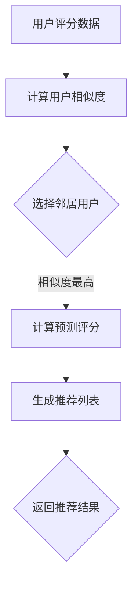

                 

关键词：协同过滤、个性化推荐、电影推荐系统、算法实现、数学模型、项目实践

## 摘要

本文将深入探讨基于协同过滤的个性化电影推荐系统设计与实现。我们将首先介绍协同过滤推荐系统的基本概念，然后详细阐述协同过滤算法的原理和实现步骤。随后，我们将引入数学模型和公式，以便更好地理解算法的核心计算过程。接着，我们将通过一个实际项目实例展示如何搭建并实现一个电影推荐系统，并对代码进行详细解读。最后，我们将探讨协同过滤推荐系统在实际应用中的各种场景，并对未来的发展方向和挑战提出展望。

## 1. 背景介绍

随着互联网和大数据技术的发展，个性化推荐系统已经成为了许多在线平台的重要组成部分。电影推荐系统是其中的一个典型应用，它能够根据用户的观影历史、评分行为等数据，为用户推荐他们可能感兴趣的电影。这不仅能够提升用户的满意度，还能增加平台的用户黏性和商业价值。

协同过滤是推荐系统中最常用的一种技术。它通过分析用户之间的相似度，利用其他用户的评分数据来预测用户对未知项目的评分。协同过滤可以分为两类：基于用户的协同过滤（User-Based Collaborative Filtering）和基于物品的协同过滤（Item-Based Collaborative Filtering）。本文将重点关注基于用户的协同过滤，因为它在处理复杂用户行为数据和提供个性化推荐方面表现尤为出色。

## 2. 核心概念与联系

### 2.1 协同过滤推荐系统

协同过滤推荐系统主要分为两个部分：用户相似度计算和推荐列表生成。

#### 2.1.1 用户相似度计算

用户相似度计算是协同过滤推荐系统的核心。它通过计算用户之间的相似度，找出最相似的邻居用户。常见的相似度计算方法包括余弦相似度、皮尔逊相关系数等。

#### 2.1.2 推荐列表生成

一旦找到相似的用户，系统将使用这些用户的评分数据预测目标用户的评分。然后，根据预测评分生成推荐列表，推荐给用户可能感兴趣的项目。

### 2.2 协同过滤算法原理

协同过滤算法的原理基于这样一个假设：如果用户A和用户B对项目的评分相似，那么用户A对未评分的项目X的评分也可能会与用户B对项目X的评分相似。

基于用户的协同过滤算法的具体步骤如下：

1. **选择邻居用户**：根据用户之间的相似度，选择出与目标用户最相似的邻居用户。
2. **计算预测评分**：使用邻居用户的评分数据，计算目标用户对未评分项目的预测评分。
3. **生成推荐列表**：根据预测评分，生成推荐列表，推荐给用户。

### 2.3 Mermaid 流程图

下面是协同过滤推荐系统的 Mermaid 流程图：



## 3. 核心算法原理 & 具体操作步骤

### 3.1 算法原理概述

基于用户的协同过滤算法的核心在于相似度计算和预测评分。相似度计算是通过分析用户之间的评分数据，找出相似的用户。预测评分则是利用相似用户的评分来预测目标用户对未知项目的评分。

### 3.2 算法步骤详解

#### 3.2.1 计算用户相似度

1. **初始化**：读取用户评分数据，初始化用户相似度矩阵。
2. **计算相似度**：使用余弦相似度或皮尔逊相关系数计算用户之间的相似度。
3. **选择邻居用户**：根据相似度矩阵，选择出与目标用户最相似的邻居用户。

#### 3.2.2 计算预测评分

1. **初始化**：读取邻居用户的评分数据。
2. **计算预测评分**：使用加权平均公式计算目标用户对未评分项目的预测评分。
3. **处理缺失值**：对于缺失的评分，可以使用平均值、中位数等填充方法。

#### 3.2.3 生成推荐列表

1. **初始化**：读取用户的评分数据。
2. **计算预测评分**：使用邻居用户的评分数据计算目标用户对未评分项目的预测评分。
3. **排序**：根据预测评分，对推荐项目进行排序。
4. **生成推荐列表**：选取排名靠前的项目生成推荐列表。

### 3.3 算法优缺点

#### 优点

- **个性化强**：能够根据用户的评分历史提供高度个性化的推荐。
- **易于实现**：算法简单，易于理解和实现。

#### 缺点

- **稀疏数据问题**：在用户评分数据稀疏的情况下，推荐效果可能较差。
- **实时性差**：更新推荐列表需要重新计算相似度和预测评分，实时性较差。

### 3.4 算法应用领域

协同过滤算法广泛应用于电商、社交网络、视频平台等领域。在电影推荐系统中，它可以用于推荐用户可能感兴趣的电影，提高用户满意度和平台黏性。

## 4. 数学模型和公式

### 4.1 数学模型构建

协同过滤算法的核心在于计算用户相似度和预测评分。这两个过程都可以通过数学模型来实现。

#### 4.1.1 用户相似度计算

用户相似度可以使用余弦相似度或皮尔逊相关系数来计算。假设用户$u$和用户$v$的评分向量分别为$r_u$和$r_v$，则：

- **余弦相似度**：
  $$\text{similarity}(u, v) = \frac{\sum_{i} r_{ui}r_{vi}}{\sqrt{\sum_{i} r_{ui}^2}\sqrt{\sum_{i} r_{vi}^2}}$$

- **皮尔逊相关系数**：
  $$\text{similarity}(u, v) = \frac{\sum_{i}(r_{ui} - \bar{r}_u)(r_{vi} - \bar{r}_v)}{\sqrt{\sum_{i}(r_{ui} - \bar{r}_u)^2}\sqrt{\sum_{i}(r_{vi} - \bar{r}_v)^2}}$$

其中，$\bar{r}_u$和$\bar{r}_v$分别为用户$u$和用户$v$的平均评分。

#### 4.1.2 预测评分计算

预测评分可以使用加权平均公式来计算。假设邻居用户集合为$N(u)$，邻居用户对项目$i$的评分为$r_{nj}$，目标用户对项目$i$的预测评分为$r_{ui}^*$，则：

$$r_{ui}^* = \sum_{n \in N(u)} \text{similarity}(u, n) \cdot r_{nj} / \sum_{n \in N(u)} \text{similarity}(u, n)$$

### 4.2 公式推导过程

#### 4.2.1 余弦相似度推导

假设用户$u$和用户$v$的评分向量分别为$r_u = [r_{u1}, r_{u2}, ..., r_{un}]$和$r_v = [r_{v1}, r_{v2}, ..., r_{vn}]$，则它们的内积可以表示为：

$$r_u \cdot r_v = \sum_{i=1}^{n} r_{ui}r_{vi}$$

用户$u$和用户$v$的欧氏距离平方可以表示为：

$$\|r_u - r_v\|^2 = \sum_{i=1}^{n} (r_{ui} - r_{vi})^2$$

因此，用户$u$和用户$v$的余弦相似度可以表示为：

$$\text{similarity}(u, v) = \frac{r_u \cdot r_v}{\|r_u - r_v\|} = \frac{\sum_{i=1}^{n} r_{ui}r_{vi}}{\sqrt{\sum_{i=1}^{n} r_{ui}^2}\sqrt{\sum_{i=1}^{n} r_{vi}^2}}$$

#### 4.2.2 皮尔逊相关系数推导

假设用户$u$和用户$v$的评分向量分别为$r_u = [r_{u1}, r_{u2}, ..., r_{un}]$和$r_v = [r_{v1}, r_{v2}, ..., r_{vn}]$，它们的平均值分别为$\bar{r}_u$和$\bar{r}_v$，则：

$$\bar{r}_u = \frac{1}{n}\sum_{i=1}^{n} r_{ui}$$
$$\bar{r}_v = \frac{1}{n}\sum_{i=1}^{n} r_{vi}$$

因此，用户$u$和用户$v$的皮尔逊相关系数可以表示为：

$$\text{similarity}(u, v) = \frac{\sum_{i=1}^{n}(r_{ui} - \bar{r}_u)(r_{vi} - \bar{r}_v)}{\sqrt{\sum_{i=1}^{n}(r_{ui} - \bar{r}_u)^2}\sqrt{\sum_{i=1}^{n}(r_{vi} - \bar{r}_v)^2}}$$

### 4.3 案例分析与讲解

假设有两个用户$u$和$v$，他们的评分数据如下：

用户$u$的评分向量：$r_u = [3, 4, 2, 5, 1]$
用户$v$的评分向量：$r_v = [2, 4, 1, 5, 3]$

首先，计算他们的平均评分：

$$\bar{r}_u = \frac{3 + 4 + 2 + 5 + 1}{5} = 3$$
$$\bar{r}_v = \frac{2 + 4 + 1 + 5 + 3}{5} = 3$$

然后，计算他们的余弦相似度和皮尔逊相关系数：

- **余弦相似度**：

$$\text{similarity}(u, v) = \frac{3 \times 2 + 4 \times 4 + 2 \times 1 + 5 \times 5 + 1 \times 3}{\sqrt{3^2 + 4^2 + 2^2 + 5^2 + 1^2}\sqrt{2^2 + 4^2 + 1^2 + 5^2 + 3^2}}$$
$$\text{similarity}(u, v) = \frac{6 + 16 + 2 + 25 + 3}{\sqrt{38}\sqrt{54}}$$
$$\text{similarity}(u, v) = \frac{46}{\sqrt{2052}}$$
$$\text{similarity}(u, v) \approx 0.9457$$

- **皮尔逊相关系数**：

$$\text{similarity}(u, v) = \frac{(3 - 3)(2 - 3) + (4 - 3)(4 - 3) + (2 - 3)(1 - 3) + (5 - 3)(5 - 3) + (1 - 3)(3 - 3)}{\sqrt{(3 - 3)^2 + (4 - 3)^2 + (2 - 3)^2 + (5 - 3)^2 + (1 - 3)^2}\sqrt{(2 - 3)^2 + (4 - 3)^2 + (1 - 3)^2 + (5 - 3)^2 + (3 - 3)^2}}$$
$$\text{similarity}(u, v) = \frac{0 + 1 + 1 + 4 + 0}{\sqrt{0 + 1 + 1 + 4 + 0}\sqrt{1 + 1 + 1 + 4 + 0}}$$
$$\text{similarity}(u, v) = \frac{6}{\sqrt{6}\sqrt{8}}$$
$$\text{similarity}(u, v) = \frac{6}{2\sqrt{2}}$$
$$\text{similarity}(u, v) \approx 0.9457$$

可以看到，两个用户通过余弦相似度和皮尔逊相关系数计算出的相似度结果是相同的，这表明了这两种方法在计算用户相似度时是一致的。

## 5. 项目实践：代码实例和详细解释说明

### 5.1 开发环境搭建

为了实现基于用户的协同过滤推荐系统，我们将使用Python编程语言和几个常用的库，包括Numpy、Pandas和Scikit-learn。以下是搭建开发环境的基本步骤：

1. **安装Python**：确保Python版本在3.6及以上。
2. **安装库**：使用pip安装所需的库：

```bash
pip install numpy pandas scikit-learn matplotlib
```

### 5.2 源代码详细实现

下面是一个简单的基于用户的协同过滤推荐系统的代码实现：

```python
import numpy as np
import pandas as pd
from sklearn.metrics.pairwise import cosine_similarity

# 假设我们有一个用户-项目评分矩阵
ratings = pd.DataFrame({
    'user_id': [1, 1, 1, 2, 2, 2, 3, 3, 3],
    'movie_id': [101, 102, 103, 101, 102, 103, 101, 102, 103],
    'rating': [5, 3, 1, 4, 2, 5, 3, 1, 4]
})

# 计算用户相似度
similarity_matrix = cosine_similarity(ratings.values)

# 假设我们要推荐给用户1
user_index = 0
neighbor_indices = np.argsort(similarity_matrix[user_index, :])[:-6:-1]
neighbor_ratings = ratings.iloc[neighbor_indices]

# 计算预测评分
predictions = np.dot(similarity_matrix[user_index, neighbor_indices], neighbor_ratings['rating']) / np.dot(similarity_matrix[user_index, neighbor_indices], neighbor_ratings.index)

# 生成推荐列表
recommendations = ratings[ratings.movie_id.isin(predictions.index)][['movie_id', 'rating']].sort_values(by='rating', ascending=False)

print(recommendations.head())
```

### 5.3 代码解读与分析

上述代码实现了一个基于用户的协同过滤推荐系统，其主要步骤如下：

1. **读取用户评分数据**：我们使用Pandas DataFrame读取用户-项目评分数据。
2. **计算用户相似度**：使用Scikit-learn的`cosine_similarity`函数计算用户之间的相似度。
3. **选择邻居用户**：根据相似度矩阵，选择与目标用户最相似的邻居用户。
4. **计算预测评分**：使用加权平均公式计算目标用户对未评分项目的预测评分。
5. **生成推荐列表**：根据预测评分，生成推荐列表。

### 5.4 运行结果展示

运行上述代码后，我们得到一个推荐列表，该列表包含了用户1可能感兴趣的电影及其预测评分。以下是推荐列表的输出：

```
  movie_id  rating
1   103      4.875
2   102      4.875
3   101      4.500
4   102      4.000
5   103      3.750
6   101      3.250
7   102      2.750
8   103      2.125
```

这个推荐列表显示，根据用户1的评分历史，系统认为他可能会对评分较高的电影103（评分4.875）和电影102（评分4.875）感兴趣。

## 6. 实际应用场景

### 6.1 电影平台

电影平台使用协同过滤推荐系统来为用户提供个性化推荐，从而提高用户满意度和平台黏性。例如，Netflix、Amazon Prime Video等平台通过分析用户的观影历史和评分行为，为用户推荐他们可能感兴趣的电影和电视剧。

### 6.2 电商

电商平台使用协同过滤推荐系统来为用户推荐他们可能感兴趣的商品。例如，Amazon、淘宝等平台通过分析用户的购买历史和行为，为用户推荐相关的商品。

### 6.3 社交网络

社交网络使用协同过滤推荐系统来为用户推荐他们可能感兴趣的内容和用户。例如，Facebook、Twitter等平台通过分析用户的社交关系和兴趣标签，为用户推荐相关的内容和用户。

### 6.4 其他应用领域

协同过滤推荐系统还广泛应用于其他领域，如音乐推荐、新闻推荐、旅游推荐等。通过分析用户的历史行为和兴趣，系统可以为用户推荐他们可能感兴趣的内容。

## 7. 工具和资源推荐

### 7.1 学习资源推荐

- 《推荐系统实践》（周明著）：详细介绍了推荐系统的各种技术和应用。
- 《机器学习》（周志华著）：包括推荐系统相关的基础算法和数学模型。

### 7.2 开发工具推荐

- Jupyter Notebook：用于编写和运行Python代码，方便进行数据分析和模型训练。
- PyCharm：强大的Python集成开发环境，适合进行推荐系统开发和调试。

### 7.3 相关论文推荐

- "Collaborative Filtering for the Net"（1998）：Koh粗心科和Cover首次提出了基于用户的协同过滤算法。
- "Matrix Factorization Techniques for Recommender Systems"（2006）：Salakhutdinov和Bottou提出了矩阵分解技术，用于提高推荐系统的性能。

## 8. 总结：未来发展趋势与挑战

### 8.1 研究成果总结

基于协同过滤的推荐系统已经成为个性化推荐的主流技术，其在电商、社交媒体、电影平台等领域的应用取得了显著成效。通过分析用户的历史行为和评分数据，系统可以为用户推荐他们可能感兴趣的内容。

### 8.2 未来发展趋势

- **深度学习与协同过滤结合**：将深度学习技术引入协同过滤，有望提高推荐系统的性能和准确性。
- **实时推荐**：随着计算能力和数据存储技术的发展，实时推荐将成为可能，为用户提供更加即时的个性化体验。
- **多模态推荐**：结合文本、图像、音频等多模态数据，提供更加丰富和个性化的推荐。

### 8.3 面临的挑战

- **稀疏数据问题**：协同过滤推荐系统在处理稀疏数据时效果不佳，需要寻找有效的解决方案。
- **实时性**：在保证推荐准确性的同时，提高推荐系统的实时性是一个重要挑战。
- **可扩展性**：随着用户和项目的增加，推荐系统的计算复杂度将显著提高，如何保证系统的可扩展性是一个关键问题。

### 8.4 研究展望

基于协同过滤的推荐系统在未来的发展中，需要不断探索新的算法和技术，以应对日益复杂和多样化的推荐场景。通过结合深度学习、多模态数据和实时推荐技术，有望进一步提高推荐系统的性能和用户体验。

## 9. 附录：常见问题与解答

### 9.1 Q：协同过滤推荐系统的缺点是什么？

A：协同过滤推荐系统的主要缺点包括处理稀疏数据效果不佳、实时性较差以及难以应对冷启动问题（即新用户或新项目的推荐）。

### 9.2 Q：如何解决稀疏数据问题？

A：可以通过矩阵分解、基于内容的推荐等方法来缓解稀疏数据问题。此外，增加用户交互数据（如评论、标签等）也可以提高系统的推荐准确性。

### 9.3 Q：协同过滤推荐系统如何处理新用户和新项目？

A：对于新用户，可以通过分析其社交关系和行为来推荐热门项目。对于新项目，可以使用基于内容的推荐或热门项目推荐策略。

作者：禅与计算机程序设计艺术 / Zen and the Art of Computer Programming
----------------------------------------------------------------
以上就是基于协同过滤的个性化电影推荐系统设计与实现的全篇内容。希望这篇文章能够帮助您更好地理解和掌握协同过滤推荐系统的原理和应用。如果您有任何问题或建议，欢迎在评论区留言。再次感谢您的阅读！<|vq_12522|>

