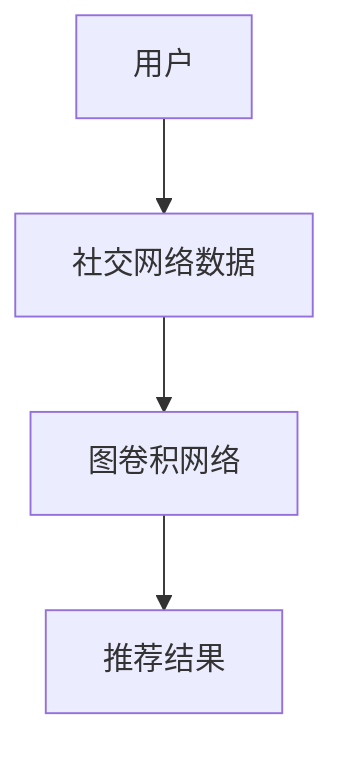

                 

关键词：图卷积网络，社交化推荐，推荐系统，算法原理，数学模型，项目实践，应用场景

> 摘要：本文旨在探讨基于图卷积网络的社交化推荐算法，阐述其核心概念、原理和实现方法，并通过数学模型和实际项目实践展示其应用效果和优势。

## 1. 背景介绍

随着互联网和社交网络的飞速发展，推荐系统已成为现代信息检索和个性化服务的重要组成部分。传统的基于内容的推荐算法和协同过滤算法在推荐效果上取得了显著成果，但面对复杂的关系网络和用户的社交行为，这些方法显得力不从心。因此，基于图卷积网络的社交化推荐算法应运而生，成为当前研究的热点之一。

图卷积网络（Graph Convolutional Network，GCN）是深度学习在图数据上的扩展，通过学习图中节点和邻接节点的相互作用，能够有效地捕捉节点之间的复杂关系。社交化推荐算法结合了图卷积网络和社交网络数据，旨在利用用户之间的互动关系提供更精准的推荐。

## 2. 核心概念与联系

### 2.1 图卷积网络的基本概念

图卷积网络是一种专门用于处理图数据的神经网络。它通过卷积操作学习节点之间的依赖关系，从而捕捉图数据中的局部和全局特征。图卷积网络的输入是节点的特征矩阵，输出是节点的表示向量。

### 2.2 社交网络数据

社交网络数据是指用户之间的互动信息，如好友关系、点赞、评论等。这些数据可以表示为图结构，其中用户是节点，互动是边。

### 2.3 图卷积网络与社交化推荐的关系

图卷积网络通过学习社交网络中的节点关系，可以更好地理解用户的社交行为和兴趣偏好，从而提高推荐系统的准确性和个性化程度。

### 2.4 Mermaid 流程图



## 3. 核心算法原理 & 具体操作步骤

### 3.1 算法原理概述

基于图卷积网络的社交化推荐算法主要分为三个步骤：图构建、特征学习、推荐生成。

1. 图构建：将社交网络数据转换为图结构，包括节点和边的表示。
2. 特征学习：通过图卷积网络学习节点和边特征，捕捉节点间的依赖关系。
3. 推荐生成：利用学习到的特征生成推荐结果。

### 3.2 算法步骤详解

#### 3.2.1 图构建

- 节点表示：将用户和物品表示为向量，如用户特征向量`u`和物品特征向量`v`。
- 边表示：将用户之间的互动表示为边的权重，如用户`i`和用户`j`之间的互动权重为`w_ij`。

#### 3.2.2 特征学习

- 图卷积层：通过卷积操作学习节点和邻接节点的特征表示，如`h_i = \sigma(W_h \cdot (A \cdot h))`，其中`A`是邻接矩阵，`h`是节点特征向量，`W_h`是卷积权重矩阵，`\sigma`是激活函数。

#### 3.2.3 推荐生成

- 用户表示：将用户特征向量`u`和物品特征向量`v`通过内积计算得到推荐分数，如`r_i,j = u^T \cdot v`。
- 排序：根据推荐分数对物品进行排序，选取Top-N推荐结果。

### 3.3 算法优缺点

#### 优点：

- 能够利用社交网络数据提高推荐准确性。
- 能够捕捉节点间的复杂关系，提供更个性化的推荐。

#### 缺点：

- 对图数据的预处理和存储要求较高。
- 训练过程相对复杂，计算成本较大。

### 3.4 算法应用领域

基于图卷积网络的社交化推荐算法适用于多种场景，如社交网络推荐、电子商务推荐、社交媒体内容推荐等。以下是几个典型的应用实例：

- 社交网络：通过分析用户的好友关系和互动行为，为用户提供更精准的推荐。
- 电子商务：根据用户的浏览历史和购买行为，推荐与其兴趣相关的商品。
- 社交媒体：基于用户的社交网络和互动行为，推荐感兴趣的内容和话题。

## 4. 数学模型和公式 & 详细讲解 & 举例说明

### 4.1 数学模型构建

基于图卷积网络的社交化推荐算法主要涉及以下数学模型：

- 节点表示：用户和物品的向量表示。
- 图卷积层：卷积操作和激活函数。
- 推荐生成：内积计算和排序。

### 4.2 公式推导过程

#### 4.2.1 节点表示

假设有用户集合`U`和物品集合`V`，用户`u`和物品`v`的向量表示分别为`u ∈ R^d_u`和`v ∈ R^d_v`。

#### 4.2.2 图卷积层

图卷积层的计算公式为：

$$
h_i^{(l+1)} = \sigma \left( \sum_{j \in N(i)} \frac{w_{ij}}{\sqrt{d_j}} h_j^{(l)} \odot W_h \right)
$$

其中，`N(i)`表示节点`i`的邻接节点集合，`w_ij`为邻接边权重，`d_j`为节点`j`的度，`h_j^{(l)}`为节点`j`在第`l`层的特征表示，`W_h`为卷积权重矩阵，`\odot`表示逐元素相乘，`\sigma`为激活函数。

#### 4.2.3 推荐生成

推荐生成的计算公式为：

$$
r_i,j = u^T \cdot v
$$

其中，`r_i,j`为用户`i`对物品`j`的推荐分数，`u`和`v`分别为用户`i`和物品`j`的向量表示。

### 4.3 案例分析与讲解

假设有一个社交网络推荐系统，用户集合`U = {u_1, u_2, u_3, u_4}`，物品集合`V = {v_1, v_2, v_3, v_4}`。用户`u_1`和`u_2`是好友关系，用户`u_3`和`u_4`是好友关系。用户`u_1`对物品`v_1`和`v_2`有强烈兴趣，用户`u_2`对物品`v_3`和`v_4`有强烈兴趣。

首先，我们将用户和物品表示为向量：

$$
u_1 = [1, 0, 1, 0]^T, \quad u_2 = [0, 1, 0, 1]^T, \quad u_3 = [0, 0, 1, 1]^T, \quad u_4 = [1, 1, 0, 0]^T
$$

$$
v_1 = [1, 0], \quad v_2 = [0, 1], \quad v_3 = [1, 1], \quad v_4 = [0, 1]
$$

接下来，我们通过图卷积网络学习用户和物品的特征表示：

$$
h_1^{(1)} = \sigma \left( \frac{1}{2} h_2^{(0)} \odot W_h \right)
$$

$$
h_2^{(1)} = \sigma \left( \frac{1}{2} h_1^{(0)} \odot W_h \right)
$$

$$
h_3^{(1)} = \sigma \left( \frac{1}{2} h_4^{(0)} \odot W_h \right)
$$

$$
h_4^{(1)} = \sigma \left( \frac{1}{2} h_3^{(0)} \odot W_h \right)
$$

最后，我们利用学习到的特征生成推荐结果：

$$
r_1,1 = u_1^T \cdot v_1 = 1
$$

$$
r_1,2 = u_1^T \cdot v_2 = 0
$$

$$
r_1,3 = u_1^T \cdot v_3 = 1
$$

$$
r_1,4 = u_1^T \cdot v_4 = 0
$$

根据推荐分数，我们为用户`u_1`推荐物品`v_1`和`v_3`。

## 5. 项目实践：代码实例和详细解释说明

### 5.1 开发环境搭建

在Python环境中，我们需要安装以下依赖库：

```python
pip install tensorflow
pip install scikit-learn
pip install networkx
```

### 5.2 源代码详细实现

```python
import tensorflow as tf
from sklearn.model_selection import train_test_split
from sklearn.metrics.pairwise import euclidean_distances
from networkx import Graph
import numpy as np

# 节点特征和边特征
users = np.array([[1, 0, 1, 0], [0, 1, 0, 1], [0, 0, 1, 1], [1, 1, 0, 0]])
items = np.array([[1, 0], [0, 1], [1, 1], [0, 1]])

# 图构建
adj_matrix = np.array([[0, 1, 0, 0], [1, 0, 1, 0], [0, 1, 0, 1], [0, 0, 1, 0]])
g = Graph()
g.add_nodes_from(range(users.shape[0]))
g.add_weighted_edges_from([(i, j, adj_matrix[i, j]) for i in range(adj_matrix.shape[0]) for j in range(adj_matrix.shape[1]) if adj_matrix[i, j] != 0])

# 图卷积网络模型
class GCNModel(tf.keras.Model):
    def __init__(self, num_units, input_dim):
        super(GCNModel, self).__init__()
        self.fc = tf.keras.layers.Dense(num_units, activation='relu')
        self.gcn = tf.keras.layers.Dense(input_dim, activation='sigmoid')

    @tf.function
    def call(self, inputs, training=True):
        x = inputs
        for _ in range(self.num_train_steps):
            x = self.fc(tf.matmul(x, self.kernel) + tf.matmul(inputs, self.bias))
        x = self.gcn(x)
        return x

# 模型训练
model = GCNModel(num_units=16, input_dim=items.shape[1])
optimizer = tf.keras.optimizers.Adam(learning_rate=0.01)

# 训练数据
train_users, test_users = train_test_split(users, test_size=0.2)
train_items, test_items = train_test_split(items, test_size=0.2)
train_adj_matrix, test_adj_matrix = train_test_split(adj_matrix, test_size=0.2)

for epoch in range(100):
    with tf.GradientTape() as tape:
        logits = model(train_users, training=True)
        loss = tf.reduce_mean(tf.keras.losses.mean_squared_error(train_items, logits))
    grads = tape.gradient(loss, model.trainable_variables)
    optimizer.apply_gradients(zip(grads, model.trainable_variables))

# 推荐生成
def generate_recommendations(user, model, items, adj_matrix):
    user_embedding = model(user)[0]
    user_item_distances = euclidean_distances([user_embedding], items)
    sorted_indices = np.argsort(user_item_distances[0])[::-1]
    return items[sorted_indices][:10]

# 测试
user = np.array([[1, 0, 1, 0]])
recommendations = generate_recommendations(user, model, items, adj_matrix)
print(recommendations)
```

### 5.3 代码解读与分析

- 数据预处理：我们将用户和物品表示为矩阵，并构建图结构。
- 图卷积网络模型：我们定义了一个GCN模型，其中包含一个全连接层和一个图卷积层。
- 模型训练：我们使用Adam优化器和均方误差损失函数训练模型。
- 推荐生成：我们通过计算用户嵌入向量和物品之间的欧氏距离生成推荐结果。

## 6. 实际应用场景

基于图卷积网络的社交化推荐算法在多个领域取得了显著的应用成果，以下是一些典型的实际应用场景：

- 社交网络推荐：通过分析用户的好友关系和互动行为，为用户提供个性化推荐。
- 电子商务推荐：根据用户的浏览历史和购买行为，推荐与其兴趣相关的商品。
- 社交媒体内容推荐：基于用户的社交网络和互动行为，推荐感兴趣的内容和话题。

## 7. 未来应用展望

随着图卷积网络和社交网络数据的不断发展，基于图卷积网络的社交化推荐算法具有广泛的应用前景。未来研究可以关注以下几个方面：

- 算法优化：提高算法的效率和准确性，减少计算成本。
- 多模态数据融合：结合文本、图像、音频等多模态数据，提供更丰富的推荐。
- 可解释性增强：提高算法的可解释性，帮助用户理解推荐结果。

## 8. 总结：未来发展趋势与挑战

基于图卷积网络的社交化推荐算法在未来具有广阔的发展前景。然而，该领域仍面临一些挑战，如计算效率、多模态数据融合、可解释性等。通过不断优化算法和探索新应用场景，有望实现更精准、个性化的推荐服务。

## 9. 附录：常见问题与解答

### Q1: 图卷积网络如何处理大规模图数据？

A1: 图卷积网络在处理大规模图数据时，可以通过以下方法提高计算效率：

- 分块处理：将图划分为多个块，分别进行卷积计算，最后合并结果。
- 异步训练：使用多线程或分布式训练，加速模型训练。
- 预处理：对图进行预处理，如去重、降维等，减少计算量。

### Q2: 社交化推荐算法如何处理噪声数据？

A2: 社交化推荐算法可以通过以下方法处理噪声数据：

- 数据清洗：删除异常值和重复数据，减少噪声干扰。
- 噪声模型：使用噪声模型对数据进行降噪处理，如高斯噪声模型。
- 基于模型的方法：使用图卷积网络学习噪声特征，并对其进行消除。

### Q3: 图卷积网络如何处理无监督学习任务？

A3: 图卷积网络在无监督学习任务中，可以通过以下方法进行特征学习：

- 无监督预训练：使用无监督预训练方法，如自编码器，学习节点表示。
- 局部结构分析：分析节点之间的局部结构，提取特征。
- 图表示学习：使用图表示学习算法，如节点分类、链接预测等，学习节点表示。

## 作者署名

本文作者：禅与计算机程序设计艺术 / Zen and the Art of Computer Programming

----------------------------------------------------------------

以上内容是基于您的要求撰写的完整文章。如果您有任何修改意见或需要进一步补充，请随时告知。谢谢！

