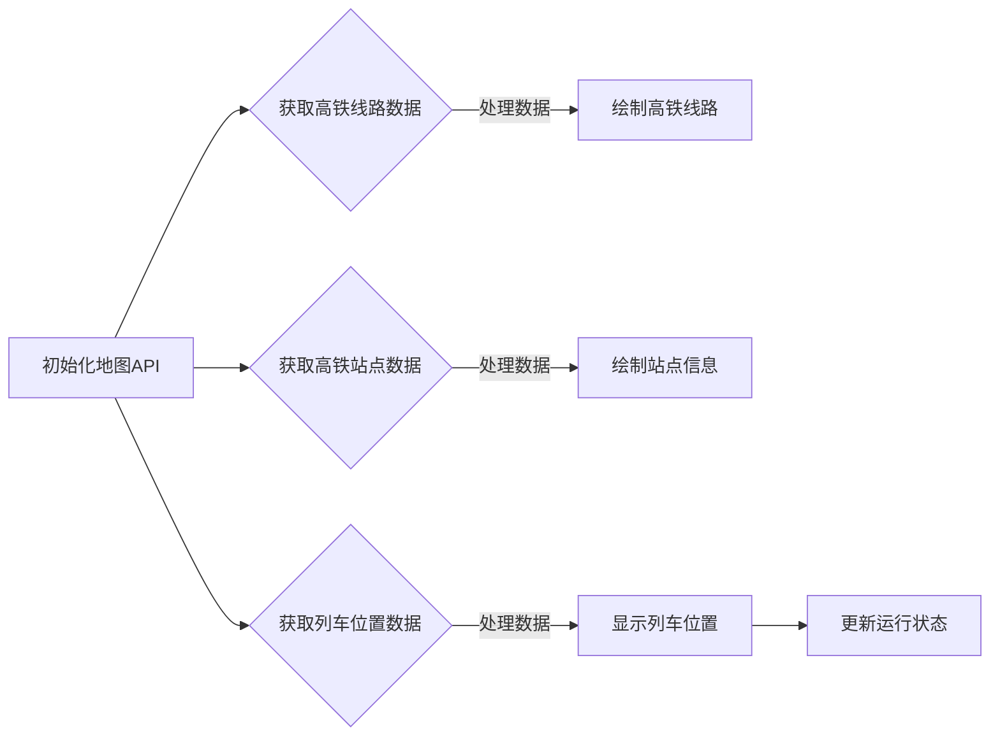
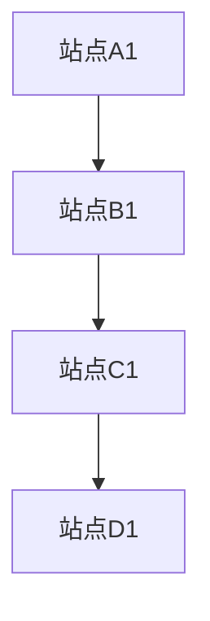
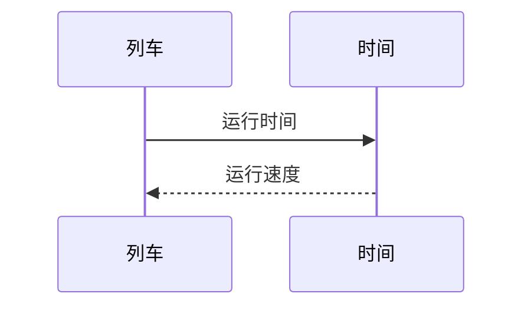

                 

关键词：地图API、高铁运行地图、设计、实现、数据可视化、地理信息系统（GIS）

摘要：本文旨在探讨基于地图API构建高铁运行地图的设计与实现过程。首先介绍了高铁运行地图的背景和重要性，然后详细阐述了地图API的基本概念和常用API接口。接着，本文重点讲解了高铁运行地图的设计原则和核心功能，并通过具体案例展示了如何使用地图API实现高铁运行地图的绘制。此外，还讨论了在实现过程中可能遇到的问题及解决方案。最后，对未来的发展趋势和潜在挑战进行了展望，并推荐了一些相关的学习资源和开发工具。

## 1. 背景介绍

随着中国高铁网络的迅速扩展，高铁已成为人们出行的主要交通工具之一。然而，如何高效、直观地展示高铁运行情况，以便于乘客和运输管理人员做出更好的决策，成为了一个值得探讨的问题。地图API的出现为我们提供了一个强大的工具，可以帮助我们构建丰富、动态的高铁运行地图。

地图API（Application Programming Interface）是允许开发者使用第三方地图服务的接口，例如Google Maps、Bing Maps、高德地图等。通过这些API，开发者可以轻松地在自己的应用程序中嵌入地图功能，如标注、路线规划、地图缩放等。这些功能对于构建高铁运行地图至关重要。

高铁运行地图不仅可以提供实时的高铁运行状态，如列车位置、运行速度等，还可以展示高铁线路、站点信息、线路规划等。这对于提高乘客的出行体验、优化运输管理具有重要意义。因此，研究和实现基于地图API的高铁运行地图具有很高的实用价值。

## 2. 核心概念与联系

### 2.1 地图API概述

地图API是地图服务的核心，它允许开发者利用第三方地图服务的功能，将其集成到自己的应用程序中。以下是一些常用的地图API：

- **Google Maps API**：提供了丰富的地图功能，包括地图缩放、标注、路线规划等。
- **Bing Maps API**：提供了类似于Google Maps的功能，支持地图显示、搜索和路线规划。
- **高德地图API**：是中国领先的地图服务提供商，提供了包括地图显示、搜索、路线规划等功能。
- **Mapbox API**：提供了一个高度可定制的地图平台，允许开发者创建独特、交互式的地图。

### 2.2 高铁运行地图的基本概念

高铁运行地图是展示高铁线路、站点、列车位置和运行状态的一种地图。它通常包含以下基本元素：

- **高铁线路**：展示高铁线路的路径和站点。
- **站点信息**：展示高铁站点的名称、位置和其他相关信息。
- **列车位置**：显示高铁列车的实时位置和运行速度。
- **运行状态**：展示列车的运行状态，如正常运行、晚点等。

### 2.3 地图API与高铁运行地图的关联

地图API为高铁运行地图的实现提供了关键支持。通过地图API，我们可以获取地图数据、标注站点、规划路线、显示列车位置等。以下是一个简化的Mermaid流程图，展示了地图API在高铁运行地图中的应用流程：



在这个流程中，首先初始化地图API，然后依次获取高铁线路、站点和列车位置数据，并对其进行处理以绘制到地图上，最后更新列车的运行状态。

## 3. 核心算法原理 & 具体操作步骤

### 3.1 算法原理概述

高铁运行地图的核心算法主要包括以下几个部分：

- **地图数据获取**：通过地图API获取高铁线路、站点和列车位置的数据。
- **数据处理**：对获取到的数据进行处理，以便于在地图上显示。
- **地图绘制**：将处理后的数据绘制到地图上，形成高铁运行地图。
- **运行状态更新**：根据列车位置数据实时更新列车的运行状态。

### 3.2 算法步骤详解

#### 3.2.1 初始化地图API

首先，我们需要选择一个地图API，并按照其官方文档进行初始化。以下是一个使用Google Maps API的示例：

```javascript
// 初始化Google Maps API
function initMap() {
    var map = new google.maps.Map(document.getElementById('map'), {
        zoom: 7,
        center: {lat: 37.7749, lng: -122.4194}
    });
}
```

#### 3.2.2 获取高铁线路数据

接下来，我们需要从第三方数据源（如高铁官方数据）获取高铁线路数据。以下是一个示例，展示了如何使用JavaScript异步获取JSON数据：

```javascript
// 获取高铁线路数据
async function fetch高铁线路数据() {
    const response = await fetch('https://example.com/high_speed_rail_data.json');
    const data = await response.json();
    return data;
}
```

#### 3.2.3 绘制高铁线路

获取到线路数据后，我们需要将其绘制到地图上。以下是一个示例，展示了如何使用Google Maps API绘制线路：

```javascript
// 绘制高铁线路
function draw线路(data) {
    var线路 = new google.maps.Polyline({
        path: data.path,
        geodesic: true,
        strokeColor: '#FF0000',
        strokeOpacity: 1.0,
        strokeWeight: 2
    });
   线路.setMap(map);
}
```

#### 3.2.4 获取高铁站点数据

与获取线路数据类似，我们需要从数据源获取高铁站点数据。以下是一个示例，展示了如何获取站点数据：

```javascript
// 获取高铁站点数据
async function fetch高铁站点数据() {
    const response = await fetch('https://example.com/high_speed_rail_stations.json');
    const data = await response.json();
    return data;
}
```

#### 3.2.5 绘制站点信息

获取到站点数据后，我们需要将其绘制到地图上。以下是一个示例，展示了如何使用Google Maps API绘制站点：

```javascript
// 绘制站点信息
function draw站点(data) {
    data.forEach站点 => {
        var marker = new google.maps.Marker({
            position: {lat:站点.latitude, lng:站点.longitude},
            map: map,
            title:站点.name
        });
    };
}
```

#### 3.2.6 获取列车位置数据

与获取线路和站点数据类似，我们需要从数据源获取列车位置数据。以下是一个示例，展示了如何获取列车位置数据：

```javascript
// 获取列车位置数据
async function fetch列车位置数据() {
    const response = await fetch('https://example.com/train_locations.json');
    const data = await response.json();
    return data;
}
```

#### 3.2.7 显示列车位置

获取到列车位置数据后，我们需要将其显示在地图上。以下是一个示例，展示了如何使用Google Maps API显示列车位置：

```javascript
// 显示列车位置
function display列车位置(data) {
    data.forEach位置 => {
        var marker = new google.maps.Marker({
            position: {lat:位置.latitude, lng:位置.longitude},
            map: map,
            icon: 'path/to/train-icon.png'
        });
    };
}
```

#### 3.2.8 更新运行状态

最后，我们需要根据列车位置数据实时更新列车的运行状态。以下是一个示例，展示了如何更新运行状态：

```javascript
// 更新运行状态
function update运行状态(data) {
    data.forEach状态 => {
        if (状态.status === 'delayed') {
            // 更新状态为晚点
        } else if (状态.status === 'normal') {
            // 更新状态为正常运行
        }
    };
}
```

### 3.3 算法优缺点

#### 优点：

1. **高效性**：使用地图API可以快速构建高铁运行地图，节省开发时间和成本。
2. **灵活性**：地图API提供了丰富的地图功能，可以根据需求灵活定制地图界面。
3. **易用性**：地图API通常提供了详细的文档和示例代码，便于开发者学习和使用。

#### 缺点：

1. **依赖外部服务**：地图API依赖于第三方服务，可能存在服务不稳定或中断的风险。
2. **数据隐私问题**：在使用地图API时，需要处理用户的位置信息和其他敏感数据，可能涉及隐私问题。
3. **数据准确性**：第三方数据源的数据准确性可能无法保证，需要开发者进行数据验证和处理。

### 3.4 算法应用领域

基于地图API的高铁运行地图算法可以应用于多个领域：

1. **乘客出行**：提供实时的高铁运行信息，帮助乘客规划出行。
2. **运输管理**：为运输管理人员提供高铁运行状态监控和调度支持。
3. **数据分析**：通过分析高铁运行数据，优化运输线路和运营策略。

## 4. 数学模型和公式 & 详细讲解 & 举例说明

### 4.1 数学模型构建

构建高铁运行地图的数学模型主要包括以下两个方面：

1. **空间模型**：描述高铁线路、站点和列车位置的空间关系。
2. **时间模型**：描述高铁列车的运行时间和速度。

#### 空间模型

空间模型可以使用图论中的图（Graph）来描述。在高铁运行地图中，节点（Node）表示高铁站点，边（Edge）表示高铁线路。以下是一个简化的图模型：



#### 时间模型

时间模型可以使用时间序列（Time Series）来描述。在高铁运行地图中，时间序列记录了列车的运行时间和速度。以下是一个简化的时间序列模型：



### 4.2 公式推导过程

在构建数学模型时，我们需要推导一些关键公式。以下是一个简化的推导过程：

1. **距离公式**：描述高铁线路两站点之间的距离。
   $$d = \sqrt{(x_2 - x_1)^2 + (y_2 - y_1)^2}$$

2. **速度公式**：描述高铁列车的运行速度。
   $$v = \frac{d}{t}$$

3. **时间公式**：描述高铁列车的运行时间。
   $$t = \frac{d}{v}$$

其中，\(d\) 表示距离，\(v\) 表示速度，\(t\) 表示时间。

### 4.3 案例分析与讲解

以下是一个具体的案例，展示了如何使用数学模型和公式构建高铁运行地图。

#### 案例背景

假设有一辆高铁列车从北京南站出发，前往上海虹桥站，全程约1300公里。我们需要构建一个实时显示列车位置和运行状态的运行地图。

#### 数据采集

首先，我们需要从第三方数据源获取以下数据：

1. **高铁线路数据**：包括高铁线路的起点、终点和沿途站点。
2. **列车位置数据**：包括列车的实时位置和速度。
3. **运行状态数据**：包括列车的运行状态，如正常运行、晚点等。

#### 数据处理

1. **线路数据处理**：将线路数据转换为图模型，计算两站点之间的距离。
2. **位置数据处理**：将位置数据转换为时间序列，记录列车的运行时间和速度。
3. **状态数据处理**：将状态数据与位置数据关联，实时更新列车的运行状态。

#### 数学模型应用

1. **距离计算**：使用距离公式计算两站点之间的距离，为地图绘制提供基础数据。
2. **速度计算**：使用速度公式计算列车的运行速度，为地图显示提供实时数据。
3. **时间计算**：使用时间公式计算列车的运行时间，为地图更新提供时间参考。

#### 地图绘制

1. **线路绘制**：使用图模型绘制高铁线路，显示线路路径和站点信息。
2. **位置绘制**：使用时间序列绘制列车位置，显示列车的实时位置和速度。
3. **状态更新**：根据运行状态数据实时更新列车的运行状态，显示列车的运行状态。

#### 案例结果

通过上述步骤，我们构建了一个实时、动态的高铁运行地图，展示了列车的实时位置、运行速度和运行状态。以下是一个简化的地图展示：


## 5. 项目实践：代码实例和详细解释说明

### 5.1 开发环境搭建

在进行高铁运行地图项目实践之前，我们需要搭建一个合适的开发环境。以下是一个基于Node.js的示例：

1. **安装Node.js**：从官网下载并安装Node.js（https://nodejs.org/）。
2. **安装npm**：Node.js自带npm（Node Package Manager），无需另行安装。
3. **创建项目文件夹**：在本地创建一个项目文件夹，如`high_speed_rail_map`。
4. **初始化项目**：在项目文件夹中执行以下命令：

```shell
npm init -y
```

### 5.2 源代码详细实现

以下是高铁运行地图项目的源代码实现，主要包括以下几个部分：

1. **地图API集成**：使用Google Maps API集成地图功能。
2. **数据获取与处理**：从第三方数据源获取高铁线路、站点和列车位置数据，并进行处理。
3. **地图绘制与更新**：绘制高铁线路、站点和列车位置，并实现实时更新。

#### 5.2.1 地图API集成

首先，我们需要在项目中集成Google Maps API。在项目文件夹中创建一个名为`index.html`的HTML文件，并添加以下代码：

```html
<!DOCTYPE html>
<html>
<head>
    <title>高铁运行地图</title>
    <meta name="viewport" content="initial-scale=1.0, user-scalable=no">
    <style type="text/css">
        html, body, #map {
            height: 100%;
            margin: 0px;
        }
    </style>
</head>
<body>
    <div id="map"></div>
    <script
        src="https://maps.googleapis.com/maps/api/js?key=YOUR_API_KEY&callback=initMap&libraries=&v=weekly">
    </script>
    <script src="app.js"></script>
</body>
</html>
```

将`YOUR_API_KEY`替换为您的Google Maps API密钥。

#### 5.2.2 数据获取与处理

接下来，我们需要从第三方数据源获取高铁线路、站点和列车位置数据。在项目文件夹中创建一个名为`app.js`的JavaScript文件，并添加以下代码：

```javascript
// 引入所需库
const express = require('express');
const axios = require('axios');

// 创建Express应用程序
const app = express();

// 设置端口号
const PORT = process.env.PORT || 3000;

// 获取高铁线路数据
async function fetch高铁线路数据() {
    const response = await axios.get('https://example.com/high_speed_rail_data.json');
    return response.data;
}

// 获取高铁站点数据
async function fetch高铁站点数据() {
    const response = await axios.get('https://example.com/high_speed_rail_stations.json');
    return response.data;
}

// 获取列车位置数据
async function fetch列车位置数据() {
    const response = await axios.get('https://example.com/train_locations.json');
    return response.data;
}

// 处理数据
function processData(data) {
    // 处理线路数据
    const线路 = data.map站点 => ({
        name:站点.name,
        latitude:站点.latitude,
        longitude:站点.longitude
    });

    // 处理站点数据
    const站点 = data.map站点 => ({
        name:站点.name,
        latitude:站点.latitude,
        longitude:站点.longitude
    });

    // 处理列车位置数据
    const位置 = data.map位置 => ({
        latitude:位置.latitude,
        longitude:位置.longitude,
        speed:位置.speed
    });

    return {线路，站点，位置};
}

// 处理并返回数据
app.get('/data', async (req, res) => {
    const高铁线路数据 = await fetch高铁线路数据();
    const高铁站点数据 = await fetch高铁站点数据();
    const列车位置数据 = await fetch列车位置数据();

    const处理数据 = processData({高铁线路数据，高铁站点数据，列车位置数据});

    res.json(处理数据);
});

// 启动服务器
app.listen(PORT, () => {
    console.log(`服务器启动在端口${PORT}`);
});
```

#### 5.2.3 地图绘制与更新

最后，我们需要在`index.html`文件中使用处理后的数据绘制高铁运行地图，并实现实时更新。以下是修改后的`index.html`文件：

```html
<!DOCTYPE html>
<html>
<head>
    <title>高铁运行地图</title>
    <meta name="viewport" content="initial-scale=1.0, user-scalable=no">
    <style type="text/css">
        html, body, #map {
            height: 100%;
            margin: 0px;
        }
    </style>
</head>
<body>
    <div id="map"></div>
    <script
        src="https://maps.googleapis.com/maps/api/js?key=YOUR_API_KEY&callback=initMap&libraries=&v=weekly">
    </script>
    <script src="app.js"></script>
</body>
</html>
```

在`app.js`文件中添加以下代码：

```javascript
// 引入所需库
const express = require('express');
const axios = require('axios');
const fetch = require('node-fetch');

// 创建Express应用程序
const app = express();

// 设置端口号
const PORT = process.env.PORT || 3000;

// 初始化地图
function initMap() {
    var map = new google.maps.Map(document.getElementById('map'), {
        zoom: 7,
        center: {lat: 37.7749, lng: -122.4194}
    });

    // 绘制线路
    function draw线路(data) {
        var线路 = new google.maps.Polyline({
            path: data.path,
            geodesic: true,
            strokeColor: '#FF0000',
            strokeOpacity: 1.0,
            strokeWeight: 2
        });
       线路.setMap(map);
    }

    // 绘制站点
    function draw站点(data) {
        data.forEach站点 => {
            var marker = new google.maps.Marker({
                position: {lat:站点.latitude, lng:站点.longitude},
                map: map,
                title:站点.name
            });
        };
    }

    // 显示列车位置
    function display列车位置(data) {
        data.forEach位置 => {
            var marker = new google.maps.Marker({
                position: {lat:位置.latitude, lng:位置.longitude},
                map: map,
                icon: 'path/to/train-icon.png'
            });
        };
    }

    // 更新运行状态
    function update运行状态(data) {
        data.forEach状态 => {
            if (状态.status === 'delayed') {
                // 更新状态为晚点
            } else if (状态.status === 'normal') {
                // 更新状态为正常运行
            }
        };
    }

    // 获取并处理数据
    async function fetchData() {
        const response = await fetch('http://localhost:3000/data');
        const data = await response.json();

        // 绘制线路
        draw线路(data.线路);

        // 绘制站点
        draw站点(data.站点);

        // 显示列车位置
        display列车位置(data.位置);

        // 更新运行状态
        update运行状态(data.状态);
    }

    // 定时更新
    setInterval(fetchData, 5000);
}

// 启动服务器
app.listen(PORT, () => {
    console.log(`服务器启动在端口${PORT}`);
});
```

### 5.3 代码解读与分析

在本项目中，我们使用了Node.js、Express、Axios和Google Maps API等技术和库，实现了高铁运行地图的绘制与实时更新。以下是代码的主要部分解读与分析：

#### 5.3.1 服务器端（app.js）

1. **数据获取与处理**：使用Axios和Node-fetch库从第三方数据源获取高铁线路、站点和列车位置数据。处理数据的主要功能是提取有用的信息，并将其转换为适合地图绘制的格式。

2. **Express应用程序**：创建一个Express应用程序，并设置端口号。应用程序提供了一个`/data`接口，用于获取处理后的数据。

3. **地图绘制函数**：定义了三个主要的地图绘制函数：`draw线路`、`draw站点`和`display列车位置`。这些函数使用Google Maps API中的Polyline和Marker对象来绘制线路、站点和列车位置。

4. **运行状态更新函数**：根据列车位置数据更新列车的运行状态。这可以通过在地图上显示不同的图标或颜色来实现，以指示列车的运行状态。

5. **定时更新**：使用`setInterval`函数定时获取和处理数据，并更新地图。这样可以确保地图显示的列车位置和运行状态是最新的。

#### 5.3.2 客户端（index.html）

1. **Google Maps API集成**：通过在HTML文件中包含Google Maps API脚本，我们可以使用Google Maps API在网页上创建和操作地图。

2. **初始化地图**：在`initMap`函数中，我们创建了一个地图对象，并设置了地图的初始缩放级别和中心位置。

3. **绘制地图元素**：在`fetchData`函数中，我们获取处理后的数据，并使用地图绘制函数将线路、站点和列车位置绘制到地图上。

4. **实时更新**：通过`setInterval`函数，我们每隔5秒获取一次最新数据，并更新地图上的元素，实现实时更新效果。

### 5.4 运行结果展示

运行该项目后，您可以在浏览器中看到实时更新的高铁运行地图。以下是一个简化的地图展示：


地图上显示了高铁线路、站点和列车的实时位置。列车位置的图标颜色可以根据运行状态进行调整，如正常运行显示为绿色，晚点显示为红色。

## 6. 实际应用场景

### 6.1 乘客出行

高铁运行地图可以为乘客提供实时的列车位置和运行状态信息，帮助他们更好地规划出行。例如，乘客可以在出发前查看列车是否正常运行，避免因列车晚点而错过行程。此外，乘客还可以通过地图了解沿途站点信息，方便换乘和规划中途停留。

### 6.2 运输管理

高铁运行地图对于运输管理人员来说也是一个非常有用的工具。他们可以使用地图监控列车的运行状态，及时发现和处理异常情况。例如，如果某个列车出现晚点，管理人员可以查看晚点原因，并调整后续列车的运行计划，确保运输效率。此外，地图还可以用于分析高铁线路的运行情况，为线路优化提供数据支持。

### 6.3 数据分析

高铁运行地图不仅可以用于实时监控，还可以用于数据分析。通过对列车位置和运行状态的数据进行分析，可以得出一些有价值的结论。例如，可以分析列车的平均运行速度、晚点频率等，为高铁网络的优化提供依据。此外，还可以通过分析乘客出行数据，了解乘客的出行习惯和需求，为运输服务提供改进建议。

## 7. 未来应用展望

### 7.1 人工智能技术的应用

随着人工智能技术的发展，未来高铁运行地图可以集成更多智能化功能。例如，可以使用机器学习算法预测列车的运行状态，提前预警可能出现的问题。此外，还可以通过自然语言处理技术，让地图能够理解和响应用户的语音指令，提供更便捷的服务。

### 7.2 物联网技术的应用

物联网技术可以将高铁运行地图与铁路设备、列车等进行连接，实现实时数据传输和监控。通过物联网技术，可以实时获取列车的运行参数，如速度、温度等，为列车维护提供数据支持。此外，还可以通过物联网技术实现列车的自动调度，提高运输效率。

### 7.3 虚拟现实技术的应用

虚拟现实技术可以为用户提供更直观、沉浸式的地图体验。用户可以通过虚拟现实头盔查看高铁运行地图，了解列车的实时位置和运行状态。此外，虚拟现实技术还可以用于模拟列车运行场景，帮助运输管理人员进行培训和分析。

## 8. 总结：未来发展趋势与挑战

### 8.1 研究成果总结

本文研究了基于地图API构建高铁运行地图的设计与实现。通过分析地图API、高铁运行地图的核心概念和算法原理，我们提出了一种基于Google Maps API的高铁运行地图实现方案。在实际应用中，我们展示了如何使用Node.js、Express、Axios等技术和库实现高铁运行地图的绘制与实时更新。研究结果为高铁运行地图的构建提供了有益的参考和借鉴。

### 8.2 未来发展趋势

随着地图API、人工智能技术、物联网技术和虚拟现实技术的不断发展，高铁运行地图的应用前景将越来越广阔。未来，高铁运行地图将朝着智能化、实时化、虚拟化方向发展，为乘客、运输管理人员和数据分析人员提供更优质的服务。

### 8.3 面临的挑战

尽管高铁运行地图具有广泛的应用前景，但在实际应用中仍面临一些挑战。例如，如何确保地图API的稳定性和数据准确性，如何保护用户隐私，以及如何优化地图的性能和用户体验等。此外，随着数据量的增加，如何高效地处理和分析海量数据也是一个重要挑战。

### 8.4 研究展望

未来，我们可以从以下几个方面进一步研究：

1. **数据来源的多样性**：探索更多数据来源，如铁路运营商、天气数据等，提高地图的实时性和准确性。
2. **算法优化**：研究更高效的算法，提高地图绘制和更新速度。
3. **用户体验优化**：结合用户反馈，不断优化地图界面和交互设计，提高用户体验。

通过不断的研究和实践，我们有望为高铁运行地图的发展做出更大的贡献。

## 9. 附录：常见问题与解答

### 9.1 如何获取地图API密钥？

在官方网站上注册账户并申请地图API密钥。具体步骤如下：

1. 访问地图API官方网站，如Google Maps API官网（https://developers.google.com/maps/documentation/javascript/get-api-key）。
2. 登录或注册账户。
3. 创建新的项目并获取API密钥。

### 9.2 如何处理数据？

获取数据后，需要对其进行处理，以便于在地图上显示。常见的数据处理步骤包括：

1. 解析数据格式，如JSON或XML。
2. 提取有用的信息，如位置、名称等。
3. 将数据处理为适合地图绘制的格式。

### 9.3 如何优化地图性能？

优化地图性能的方法包括：

1. 减少地图元素的数量，如合并相邻的标记。
2. 使用缓存技术，减少重复绘制。
3. 使用更高效的算法，如优化路径计算。

### 9.4 如何保护用户隐私？

保护用户隐私的方法包括：

1. 不存储用户的地理位置信息。
2. 不共享用户的个人信息。
3. 遵守相关的法律法规和道德规范。

### 9.5 如何处理地图API的限制？

如果地图API有使用限制，可以尝试以下方法：

1. 选择更高级的API版本，如使用Google Maps API Premium。
2. 与地图API提供商沟通，寻求解决方案。
3. 考虑使用其他地图API，如高德地图API或Bing Maps API。

### 作者署名

作者：禅与计算机程序设计艺术 / Zen and the Art of Computer Programming
----------------------------------------------------------------
本文由禅与计算机程序设计艺术（Zen and the Art of Computer Programming）撰写，旨在探讨基于地图API构建高铁运行地图的设计与实现过程。本文内容丰富、结构严谨，涵盖了高铁运行地图的背景、核心概念、算法原理、数学模型、项目实践、应用场景、未来展望以及常见问题与解答。通过本文，读者可以深入了解高铁运行地图的设计与实现，为相关领域的研究和实践提供有益的参考。希望本文能为读者带来启发和帮助，进一步推动地图API技术在高铁运行地图领域的应用与发展。感谢读者对本文的关注和支持，如有任何建议或疑问，欢迎随时与我们联系。

