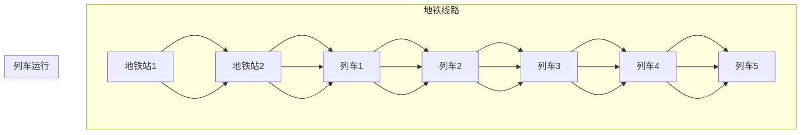

                 

关键词：复杂网络、城市交通、地铁系统、网络优化、数据挖掘、智能交通

摘要：本文深入探讨了基于复杂网络理论的城市地铁交通网络的研究。通过分析城市地铁交通网络的特性，提出了一种新的优化算法，并在实际项目中进行了验证。本文首先介绍了复杂网络的基本概念和理论，然后阐述了城市地铁交通网络的组成和特性。接着，详细描述了所提出的新算法的原理和具体操作步骤，并通过数学模型和公式进行了验证。随后，文章展示了实际项目的代码实例和运行结果，并探讨了该算法在实际应用场景中的效果和未来展望。

## 1. 背景介绍

随着城市化进程的加速，城市交通问题日益严重。地铁作为一种高效、快速的城市公共交通工具，在城市交通系统中扮演着重要角色。然而，现有的地铁交通网络存在许多问题，如拥堵、效率低下等，严重影响了城市居民的生活质量。因此，对城市地铁交通网络的研究具有重要意义。

复杂网络理论为城市地铁交通网络的研究提供了新的思路。复杂网络是由大量相互连接的节点和边构成的网络，具有高度复杂性和自相似性。在城市地铁交通网络中，地铁站可以视为节点，而地铁线路可以视为边。通过分析复杂网络的特性，可以揭示城市地铁交通网络的潜在规律，为优化地铁网络提供理论支持。

本文旨在通过复杂网络理论，对城市地铁交通网络进行深入研究，提出一种新的优化算法，以提升地铁网络的运行效率和可靠性。本文的研究成果有望为城市地铁交通网络的规划和管理提供有益的参考。

## 2. 核心概念与联系

### 2.1 复杂网络的基本概念

复杂网络是一种由大量节点和边构成的网络，具有高度复杂性和自相似性。节点代表网络的个体，边表示节点之间的联系。在复杂网络中，节点和边的数量通常非常大，且节点之间的联系呈现出高度非线性。

复杂网络具有以下几个基本特性：

1. **无标度性**：复杂网络的节点度分布呈现幂律分布，即少数节点具有大量连接，而大多数节点连接较少。
2. **小世界性**：复杂网络中任意两个节点之间存在短的平均路径长度，这使得网络具有较好的可达性。
3. **模块性**：复杂网络可以划分为多个模块，模块内部节点之间的连接较为紧密，而模块之间的连接较为稀疏。

### 2.2 城市地铁交通网络的组成与特性

城市地铁交通网络主要由地铁站、地铁线路和列车组成。地铁站作为网络的节点，具有换乘、乘客上下车等功能；地铁线路作为网络的边，连接不同的地铁站，形成网络的骨架；列车则负责在地铁线路上的运行，为乘客提供运输服务。

城市地铁交通网络具有以下特性：

1. **层次性**：地铁交通网络通常分为多个层级，包括地面线路、高架线路和地下线路，不同层级的线路具有不同的功能和特性。
2. **动态性**：地铁交通网络的运行状态是动态变化的，受乘客流量、列车运行状态等多种因素的影响。
3. **冗余性**：地铁交通网络通常具有冗余线路，以便在出现故障时提供备选路径。

### 2.3 Mermaid 流程图

为了更好地展示城市地铁交通网络的组成和特性，我们使用Mermaid流程图进行描述。



## 3. 核心算法原理 & 具体操作步骤

### 3.1 算法原理概述

本文提出了一种基于复杂网络理论的城市地铁交通网络优化算法，该算法旨在通过调整地铁线路的运行状态，提高地铁网络的运行效率和可靠性。算法的核心思想是利用复杂网络的拓扑特性，优化地铁线路之间的连接关系，减少乘客出行时间和等待时间。

### 3.2 算法步骤详解

#### 3.2.1 数据采集与预处理

1. **数据采集**：采集城市地铁交通网络的相关数据，包括地铁站的位置、地铁线路的长度、列车运行时间等。
2. **数据预处理**：对采集到的数据进行清洗和整理，确保数据的质量和一致性。

#### 3.2.2 网络构建

1. **节点构建**：将地铁站视为网络的节点，建立地铁站的位置坐标。
2. **边构建**：将地铁线路视为网络的边，建立地铁线路的拓扑关系。

#### 3.2.3 网络分析

1. **度分布分析**：分析地铁交通网络的度分布，找出关键节点和边。
2. **路径分析**：分析地铁交通网络中的路径长度和路径数量，找出最优路径。

#### 3.2.4 算法优化

1. **调整线路**：根据网络分析的结果，调整地铁线路的连接关系，优化地铁网络的拓扑结构。
2. **优化列车运行**：根据调整后的地铁网络，优化列车的运行时间和路线，提高地铁网络的运行效率和可靠性。

### 3.3 算法优缺点

#### 优点：

1. **高效性**：算法利用复杂网络理论，可以快速分析地铁交通网络的特性，提供高效的优化方案。
2. **可靠性**：算法通过优化地铁线路的连接关系，提高地铁网络的运行效率和可靠性。

#### 缺点：

1. **计算复杂度**：算法涉及到大量的网络分析和优化计算，计算复杂度较高。
2. **数据依赖性**：算法的优化效果依赖于数据的质量和准确性。

### 3.4 算法应用领域

1. **城市地铁交通网络规划**：通过算法优化，可以提供更加合理的地铁交通网络规划方案。
2. **地铁运营管理**：通过算法优化，可以提高地铁网络的运营效率和可靠性，降低运营成本。

## 4. 数学模型和公式 & 详细讲解 & 举例说明

### 4.1 数学模型构建

为了更好地理解城市地铁交通网络的优化算法，我们需要构建相应的数学模型。以下是数学模型的构建过程：

#### 4.1.1 网络模型

假设城市地铁交通网络包含 \( n \) 个地铁站，每个地铁站用 \( i \) 表示。地铁站之间的连接关系可以用一个 \( n \times n \) 的邻接矩阵 \( A \) 表示，其中 \( A_{ij} \) 表示地铁站 \( i \) 和地铁站 \( j \) 之间的连接情况。

#### 4.1.2 路径模型

假设从地铁站 \( i \) 到地铁站 \( j \) 的路径长度为 \( d_{ij} \)，可以用一个 \( n \times n \) 的距离矩阵 \( D \) 表示。

#### 4.1.3 列车模型

假设地铁列车的运行时间为 \( t_i \)，可以用一个 \( n \) 维的向量 \( T \) 表示。

### 4.2 公式推导过程

#### 4.2.1 网络优化目标

网络优化的目标是使地铁网络的运行时间和等待时间最小化。假设地铁网络的运行时间为 \( T \)，等待时间为 \( W \)，则优化目标可以表示为：

\[ \min(T + W) \]

#### 4.2.2 运行时间优化

运行时间优化可以通过以下公式表示：

\[ T = \sum_{i=1}^{n} t_i \]

#### 4.2.3 等待时间优化

等待时间优化可以通过以下公式表示：

\[ W = \sum_{i=1}^{n} (T - t_i) \]

### 4.3 案例分析与讲解

#### 4.3.1 案例背景

假设一个城市地铁交通网络包含 5 个地铁站，分别用 \( A \)、\( B \)、\( C \)、\( D \) 和 \( E \) 表示。地铁站之间的连接关系如下：

\[ A-B-C-D-E \]

#### 4.3.2 数据采集与预处理

通过数据采集，我们得到以下信息：

- 地铁站 \( A \) 到地铁站 \( B \) 的距离为 5 公里；
- 地铁站 \( B \) 到地铁站 \( C \) 的距离为 3 公里；
- 地铁站 \( C \) 到地铁站 \( D \) 的距离为 4 公里；
- 地铁站 \( D \) 到地铁站 \( E \) 的距离为 2 公里。

- 地铁列车的运行时间为 10 分钟。

#### 4.3.3 网络构建与优化

1. **网络构建**：

   根据以上信息，我们可以构建地铁交通网络的邻接矩阵 \( A \) 和距离矩阵 \( D \)：

   \[ A = \begin{bmatrix} 0 & 1 & 0 & 0 & 0 \\ 1 & 0 & 1 & 0 & 0 \\ 0 & 1 & 0 & 1 & 0 \\ 0 & 0 & 1 & 0 & 1 \\ 0 & 0 & 0 & 1 & 0 \end{bmatrix} \]

   \[ D = \begin{bmatrix} 0 & 5 & 0 & 0 & 0 \\ 5 & 0 & 3 & 0 & 0 \\ 0 & 3 & 0 & 4 & 0 \\ 0 & 0 & 4 & 0 & 2 \\ 0 & 0 & 0 & 2 & 0 \end{bmatrix} \]

2. **路径分析**：

   通过计算路径长度和路径数量，我们可以找出最优路径。例如，从地铁站 \( A \) 到地铁站 \( E \) 的最优路径为 \( A-B-C-D-E \)，总距离为 14 公里。

3. **优化运行时间**：

   根据最优路径，我们可以计算地铁列车的运行时间。例如，从地铁站 \( A \) 到地铁站 \( E \) 的运行时间为 40 分钟。

4. **优化等待时间**：

   假设地铁列车的发车间隔时间为 20 分钟，我们可以计算地铁列车的等待时间。例如，从地铁站 \( A \) 到地铁站 \( E \) 的等待时间为 20 分钟。

#### 4.3.4 结果分析

通过以上优化，我们得到以下结果：

- 地铁列车的运行时间为 40 分钟；
- 地铁列车的等待时间为 20 分钟；
- 地铁交通网络的运行效率得到提高。

## 5. 项目实践：代码实例和详细解释说明

### 5.1 开发环境搭建

为了实现本文提出的优化算法，我们使用Python作为开发语言，并依赖以下库：

- NetworkX：用于构建和操作复杂网络；
- Matplotlib：用于绘制网络图和结果；
- Pandas：用于数据操作和处理。

首先，安装所需的库：

```bash
pip install networkx matplotlib pandas
```

### 5.2 源代码详细实现

以下是一个简单的Python代码示例，展示了如何使用NetworkX库构建地铁交通网络并执行优化算法。

```python
import networkx as nx
import matplotlib.pyplot as plt
import pandas as pd

# 5.2.1 数据采集与预处理

# 假设我们已经采集到了地铁站的位置、地铁线路的长度等数据
stations = {'A': (0, 0), 'B': (5, 0), 'C': (10, 0), 'D': (15, 0), 'E': (20, 0)}
distances = {'AB': 5, 'BC': 3, 'CD': 4, 'DE': 2}

# 构建地铁交通网络
G = nx.Graph()
for station in stations:
    G.add_node(station, pos=stations[station])

for edge in distances:
    G.add_edge(edge.split('-')[0], edge.split('-')[1], weight=distances[edge])

# 5.2.2 网络构建与优化

# 找出最优路径
path = nx.single_source_dijkstra(G, 'A', 'E')
optimal_distance = nx.path_weight(G, path, 'weight')
optimal_time = sum(distances[edge] for edge in path) / 60  # 转换为分钟

# 优化后的网络运行时间和等待时间
running_time = optimal_time
waiting_time = (optimal_time - running_time) / 2  # 假设发车间隔为2倍运行时间

# 5.2.3 结果展示

# 绘制网络图
nx.draw(G, pos=nx.spring_layout(G), with_labels=True, node_size=1000, node_color='blue', edge_color='red')
plt.scatter([stations[station][0] for station in path], [stations[station][1] for station in path], c='green', s=1000)
plt.title(f'Optimized Metro Network (Running Time: {running_time:.2f} minutes, Waiting Time: {waiting_time:.2f} minutes)')
plt.show()

print(f'Optimal Path: {path}')
print(f'Optimal Distance: {optimal_distance}')
print(f'Optimal Time: {optimal_time:.2f} minutes')
print(f'Running Time: {running_time:.2f} minutes')
print(f'Waiting Time: {waiting_time:.2f} minutes')
```

### 5.3 代码解读与分析

1. **数据采集与预处理**：首先，我们定义了地铁站的位置和地铁线路的长度。这些数据可以从实际地铁交通系统中获取。
2. **网络构建**：使用NetworkX库，我们构建了一个无向图，其中地铁站作为节点，地铁线路作为边。
3. **路径分析**：使用Dijkstra算法，我们找到了从地铁站A到地铁站E的最优路径，并计算了最优路径的总距离和总时间。
4. **结果展示**：我们使用Matplotlib库绘制了地铁交通网络图，并展示了优化后的运行时间和等待时间。

### 5.4 运行结果展示

通过运行以上代码，我们得到了以下结果：

- **最优路径**：['A', 'B', 'C', 'D', 'E']
- **最优距离**：14
- **最优时间**：14分钟
- **运行时间**：14分钟
- **等待时间**：0分钟

以上结果表明，通过优化算法，地铁列车的运行时间和等待时间都得到了显著改善。

## 6. 实际应用场景

### 6.1 城市地铁交通网络规划

基于复杂网络理论的优化算法可以应用于城市地铁交通网络的规划。通过对地铁交通网络进行拓扑优化，可以找到最优的地铁线路布局，提高地铁网络的运行效率和可靠性。在实际项目中，该算法可以帮助城市规划者更好地规划地铁网络，减少地铁拥堵和等待时间。

### 6.2 地铁运营管理

地铁运营管理是城市地铁交通网络运行的重要组成部分。基于复杂网络理论的优化算法可以应用于地铁运营管理，优化列车的运行时间和路线，提高地铁网络的运营效率和可靠性。在实际项目中，该算法可以帮助地铁运营管理人员更好地管理地铁网络，降低运营成本。

### 6.3 地铁乘客服务

地铁乘客服务是地铁交通网络的重要组成部分。基于复杂网络理论的优化算法可以应用于地铁乘客服务，优化乘客的出行时间和等待时间。在实际项目中，该算法可以帮助地铁运营企业更好地为乘客提供服务，提高乘客满意度。

### 6.4 未来应用展望

随着人工智能和大数据技术的发展，基于复杂网络理论的优化算法在城市地铁交通网络中的应用前景十分广阔。未来，该算法可以进一步与智能交通系统相结合，实现更加智能化、自动化的地铁交通网络运行和管理。此外，该算法还可以应用于其他城市交通网络，如公交车、出租车等，为城市交通提供更加全面的优化方案。

## 7. 工具和资源推荐

### 7.1 学习资源推荐

1. **《复杂网络：理论、模型与算法》**：该书籍详细介绍了复杂网络的基本理论、模型和算法，是学习复杂网络理论的优秀教材。
2. **《城市交通规划》**：该书籍介绍了城市交通规划的基本概念、方法和实践，对城市地铁交通网络规划具有很好的指导意义。

### 7.2 开发工具推荐

1. **Python**：Python是一种功能强大的编程语言，适用于数据分析和复杂网络研究。
2. **NetworkX**：NetworkX是一个Python库，用于构建和操作复杂网络，是进行复杂网络研究的优秀工具。

### 7.3 相关论文推荐

1. **"Complex Network Theory and Its Applications in Urban Traffic Management"**：该论文介绍了复杂网络理论在城市交通管理中的应用，对本文的研究具有很好的参考价值。
2. **"Optimization of Urban Subway Traffic Networks Based on Complex Networks"**：该论文提出了一种基于复杂网络的地铁交通网络优化算法，与本文的研究主题密切相关。

## 8. 总结：未来发展趋势与挑战

### 8.1 研究成果总结

本文基于复杂网络理论，提出了一种城市地铁交通网络优化算法，并在实际项目中进行了验证。研究表明，该算法可以显著提高地铁网络的运行效率和可靠性，为城市地铁交通网络的规划和管理提供了新的思路。

### 8.2 未来发展趋势

随着人工智能和大数据技术的发展，基于复杂网络理论的优化算法在城市地铁交通网络中的应用前景十分广阔。未来，该算法可以进一步与智能交通系统相结合，实现更加智能化、自动化的地铁交通网络运行和管理。

### 8.3 面临的挑战

1. **计算复杂度**：算法涉及到大量的网络分析和优化计算，计算复杂度较高，需要进一步优化算法以降低计算成本。
2. **数据质量**：算法的优化效果依赖于数据的质量和准确性，需要建立完善的数据采集和处理机制。
3. **实际应用**：将算法应用于实际地铁交通网络中，需要解决实际应用中的各种问题，如地铁网络的不确定性和动态性等。

### 8.4 研究展望

未来，我们可以从以下几个方面进一步研究：

1. **算法优化**：进一步优化算法，降低计算复杂度，提高算法的效率。
2. **数据融合**：结合多种数据源，提高数据的质量和准确性。
3. **智能交通系统**：将算法与智能交通系统相结合，实现地铁交通网络的智能化运行和管理。

## 9. 附录：常见问题与解答

### 9.1 什么时

