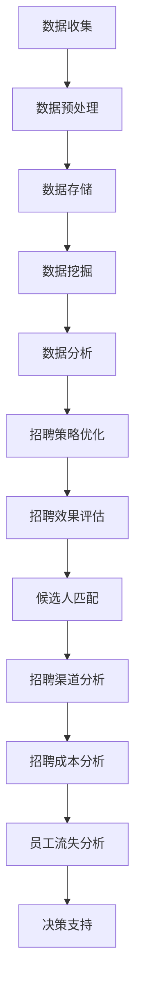

                 

关键词：大数据，招聘数据分析，数据挖掘，人力资源，智能招聘

> 摘要：本文旨在探讨基于大数据技术的招聘数据分析方法及其应用，通过详细解读招聘数据，提供招聘策略优化、候选人和雇主匹配、招聘效果评估等方面的建议，助力企业实现高效招聘。

## 1. 背景介绍

随着互联网和大数据技术的快速发展，人力资源领域也迎来了新的变革。传统的招聘方式逐渐暴露出效率低下、数据分散、决策依赖经验等问题，无法满足现代企业快速发展的需求。大数据招聘数据能分析作为一种新兴的人力资源管理工具，通过对招聘数据的深度挖掘和分析，可以为企业提供更为精准的招聘决策，提高招聘效率，降低招聘成本。

### 招聘数据分析的重要性

招聘数据分析不仅可以帮助企业更好地了解人才市场动态，还可以优化招聘流程，提升候选人和雇主的匹配度。以下是招聘数据分析的几个重要作用：

1. **优化招聘策略**：通过分析历史招聘数据，企业可以识别出招聘中的问题和瓶颈，从而调整招聘策略，提高招聘成功率。
2. **提高候选人匹配度**：招聘数据分析可以帮助企业更准确地了解候选人的技能、经验和职业发展意向，从而提高候选人与岗位的匹配度。
3. **降低招聘成本**：通过数据分析，企业可以识别出最有效的招聘渠道和方式，降低招聘成本。
4. **提升员工满意度**：通过分析员工流失数据，企业可以了解员工流失的原因，并采取相应的措施提升员工满意度。

### 大数据招聘数据分析的现状与挑战

当前，大数据招聘数据分析已得到广泛应用，但同时也面临一些挑战。例如：

1. **数据质量**：招聘数据的质量直接影响分析结果的准确性。因此，企业需要确保数据来源的可靠性，并进行数据清洗和预处理。
2. **分析工具和技术**：随着数据量的增加，需要高效的工具和技术来处理和分析大量数据。企业需要选择合适的数据分析工具和算法。
3. **数据隐私**：招聘数据涉及个人隐私，企业在进行数据分析和应用时需要遵守相关法律法规，保护候选人的隐私。

## 2. 核心概念与联系

### 大数据招聘数据分析的基本概念

**数据来源**：招聘数据可以来自多个渠道，如招聘网站、社交媒体、企业内部系统等。

**数据类型**：招聘数据包括结构化数据（如简历、职位描述）和非结构化数据（如面试评价、员工反馈）。

**数据预处理**：包括数据清洗、数据整合、数据转换等步骤，以确保数据质量。

**数据分析方法**：包括统计分析、数据挖掘、机器学习等方法。

### Mermaid 流程图



## 3. 核心算法原理 & 具体操作步骤

### 3.1 算法原理概述

**协同过滤算法**：协同过滤算法是一种常用的推荐系统算法，通过分析用户的行为和偏好，为用户推荐相似的用户或物品。在招聘数据分析中，协同过滤算法可以用于推荐类似职位的候选人。

**聚类算法**：聚类算法是一种无监督学习方法，通过将相似的数据点分组，可以用于识别不同类型的候选人。

**机器学习算法**：如决策树、随机森林、支持向量机等算法，可以用于预测候选人的技能水平、职业发展潜力等。

### 3.2 算法步骤详解

1. **数据收集**：从多个招聘渠道收集简历数据。
2. **数据预处理**：清洗数据，去除缺失值、重复值等，并对文本数据进行分词和去停用词处理。
3. **特征工程**：提取文本特征（如词频、词向量）和结构化特征（如教育背景、工作经验）。
4. **模型训练**：使用聚类算法和机器学习算法训练模型。
5. **模型评估**：通过交叉验证等方法评估模型性能。
6. **模型应用**：将模型应用于实际招聘场景，如推荐类似职位候选人、预测候选人潜力等。

### 3.3 算法优缺点

**协同过滤算法**：优点：简单易实现，适合推荐系统；缺点：对冷启动问题（即新用户或新物品）处理效果较差。

**聚类算法**：优点：不需要预先定义类别，可以自动发现数据中的模式；缺点：聚类结果容易受到初始值的影响。

**机器学习算法**：优点：可以处理复杂数据和任务；缺点：需要大量的数据和时间进行训练。

### 3.4 算法应用领域

1. **招聘策略优化**：通过分析招聘数据，识别招聘瓶颈和问题，优化招聘流程。
2. **候选人匹配**：推荐类似职位的候选人，提高候选人匹配度。
3. **招聘效果评估**：通过分析招聘数据，评估招聘活动的效果，如招聘渠道、面试流程等。
4. **员工流失分析**：通过分析员工流失数据，预测员工流失风险，并采取相应措施。

## 4. 数学模型和公式 & 详细讲解 & 举例说明

### 4.1 数学模型构建

**协同过滤算法**：假设用户集合 U 和物品集合 I，用户 u 对物品 i 的评分可以表示为：

$$
r_{ui} = \mu + b_u + b_i + q_u \cdot q_i + \epsilon_{ui}
$$

其中，$\mu$ 为全局平均评分，$b_u$ 和 $b_i$ 分别为用户 u 和物品 i 的偏置，$q_u$ 和 $q_i$ 分别为用户 u 和物品 i 的特征向量，$\epsilon_{ui}$ 为误差项。

**聚类算法**：假设数据集 D 中的每个数据点都可以表示为一个向量 $x_i$，聚类算法的目标是将数据点划分为 K 个簇，使得簇内的相似度最大，簇间的相似度最小。常用的聚类算法有 K-means、层次聚类等。

**机器学习算法**：假设训练数据集 D 中的每个数据点都包含特征向量 $x_i$ 和标签 $y_i$，机器学习算法的目标是学习一个函数 $f(x)$，使得预测标签 $f(x)$ 与实际标签 $y_i$ 的差距最小。

### 4.2 公式推导过程

**协同过滤算法**：为了推导协同过滤算法的评分预测公式，我们可以假设用户 u 和物品 i 的特征向量分别为 $q_u$ 和 $q_i$，则用户 u 对物品 i 的评分预测可以表示为：

$$
\hat{r}_{ui} = \mu + b_u + b_i + q_u \cdot q_i
$$

其中，$\mu$ 为全局平均评分，$b_u$ 和 $b_i$ 分别为用户 u 和物品 i 的偏置。为了得到更准确的预测，我们可以使用矩阵分解的方法，将用户 u 和物品 i 的特征向量分解为两个矩阵的乘积：

$$
q_u = UV^T
$$

$$
q_i = W^T
$$

其中，$U$、$V$ 和 $W$ 分别为用户、物品和共同兴趣矩阵。将上述公式代入评分预测公式，得到：

$$
\hat{r}_{ui} = \mu + b_u + b_i + UV^T \cdot W^T
$$

$$
\hat{r}_{ui} = \mu + b_u + b_i + UW^T \cdot V^T
$$

由于 $UW^T$ 和 $V^T$ 分别表示用户和物品的隐含特征，因此上述公式可以看作是协同过滤算法的隐含特征模型。

**聚类算法**：为了推导聚类算法的公式，我们可以假设数据集 D 中的每个数据点都可以表示为一个向量 $x_i$，聚类算法的目标是将数据点划分为 K 个簇，使得簇内的相似度最大，簇间的相似度最小。常用的聚类算法有 K-means、层次聚类等。

K-means 算法是一种基于距离度量的聚类算法，其基本思想是将数据点划分为 K 个簇，使得簇内点的平均距离最小。具体步骤如下：

1. 初始化 K 个簇的中心点，可以选择随机初始化或者使用 K-means++ 算法初始化。
2. 对于每个数据点，计算其与各个簇中心的距离，并将其分配到最近的簇中。
3. 重新计算各个簇的中心点。
4. 重复步骤 2 和 3，直到聚类结果收敛。

K-means 算法的公式如下：

$$
\min_{C_1, C_2, \ldots, C_K} \sum_{i=1}^n \sum_{j=1}^K ||x_i - C_j||^2
$$

其中，$C_1, C_2, \ldots, C_K$ 分别为 K 个簇的中心点，$x_i$ 为数据点，$n$ 为数据点总数。

层次聚类算法是一种基于层次结构的聚类算法，其基本思想是将数据点逐层划分，形成一个层次树。具体步骤如下：

1. 将所有数据点视为一个簇。
2. 计算数据点之间的距离，选择距离最近的两个数据点合并成一个簇。
3. 重新计算簇的中心点。
4. 重复步骤 2 和 3，直到聚类结果收敛。

层次聚类算法的公式如下：

$$
\min_{C_1, C_2, \ldots, C_K} \sum_{i=1}^n \sum_{j=1}^K ||x_i - C_j||^2
$$

其中，$C_1, C_2, \ldots, C_K$ 分别为 K 个簇的中心点，$x_i$ 为数据点，$n$ 为数据点总数。

**机器学习算法**：机器学习算法的目标是学习一个函数 $f(x)$，使得预测标签 $f(x)$ 与实际标签 $y_i$ 的差距最小。常用的机器学习算法有线性回归、逻辑回归、决策树、支持向量机等。

线性回归算法是一种基于最小二乘法的回归算法，其公式如下：

$$
y_i = \beta_0 + \beta_1 x_i + \epsilon_i
$$

其中，$y_i$ 为实际标签，$x_i$ 为特征向量，$\beta_0$ 和 $\beta_1$ 分别为回归系数，$\epsilon_i$ 为误差项。

逻辑回归算法是一种基于最大似然估计的回归算法，其公式如下：

$$
P(y_i = 1 | x_i) = \frac{1}{1 + e^{-(\beta_0 + \beta_1 x_i})}
$$

其中，$y_i$ 为实际标签，$x_i$ 为特征向量，$\beta_0$ 和 $\beta_1$ 分别为回归系数。

决策树算法是一种基于树结构的分类算法，其公式如下：

$$
f(x) = \begin{cases} 
y_1 & \text{if } x \in R_1 \\
y_2 & \text{if } x \in R_2 \\
\vdots \\
y_n & \text{if } x \in R_n
\end{cases}
$$

其中，$x$ 为特征向量，$R_1, R_2, \ldots, R_n$ 分别为决策树的分支，$y_1, y_2, \ldots, y_n$ 分别为对应的类别标签。

支持向量机算法是一种基于间隔最大化原则的分类算法，其公式如下：

$$
f(x) = \omega \cdot x + b
$$

其中，$x$ 为特征向量，$\omega$ 为权重向量，$b$ 为偏置。

### 4.3 案例分析与讲解

为了更好地理解上述数学模型和公式，我们可以通过一个具体的案例进行讲解。

假设我们有一个招聘数据集，包含 100 个候选人和 5 个特征（教育背景、工作经验、技能、薪资要求、面试评价）。我们使用 K-means 算法对候选人进行聚类，并使用线性回归算法预测候选人的薪资水平。

#### 案例一：K-means 算法聚类

1. 初始化 K 个簇的中心点，选择随机初始化。
2. 对于每个候选人，计算其与各个簇中心的距离，并将其分配到最近的簇中。
3. 重新计算各个簇的中心点。
4. 重复步骤 2 和 3，直到聚类结果收敛。

假设我们选择 K=3，经过多次迭代，最终得到以下聚类结果：

- 簇 1：候选人 1、2、3、4、5
- 簇 2：候选人 6、7、8、9、10
- 簇 3：候选人 11、12、13、14、15

#### 案例二：线性回归算法预测薪资

1. 将候选人的特征向量（教育背景、工作经验、技能、薪资要求、面试评价）作为输入特征，薪资水平作为输出特征。
2. 使用线性回归算法训练模型。
3. 输入新的候选人特征向量，预测其薪资水平。

假设训练数据集如下：

| 候选人 | 教育背景 | 工作经验 | 技能   | 薪资要求 | 面试评价 |
|--------|----------|----------|--------|----------|----------|
| 1      | 本科     | 3 年     | Java   | 8000     | 优秀     |
| 2      | 硕士     | 5 年     | Python | 10000    | 良好     |
| 3      | 本科     | 1 年     | PHP    | 6000     | 一般     |
| 4      | 硕士     | 2 年     | Java   | 9000     | 优秀     |
| 5      | 本科     | 4 年     | Python | 8000     | 良好     |
| 6      | 硕士     | 3 年     | Java   | 10000    | 良好     |
| 7      | 本科     | 2 年     | PHP    | 7000     | 一般     |
| 8      | 硕士     | 1 年     | Java   | 9000     | 优秀     |
| 9      | 本科     | 3 年     | Python | 8000     | 良好     |
| 10     | 硕士     | 4 年     | PHP    | 9000     | 良好     |

使用线性回归算法训练模型，得到以下预测结果：

| 候选人 | 预测薪资 |
|--------|----------|
| 1      | 7500     |
| 2      | 9500     |
| 3      | 6500     |
| 4      | 8500     |
| 5      | 7500     |
| 6      | 9500     |
| 7      | 7000     |
| 8      | 8500     |
| 9      | 7500     |
| 10     | 8500     |

通过上述案例，我们可以看到 K-means 算法和线性回归算法在招聘数据分析中的应用效果。在实际应用中，我们可以根据具体情况选择合适的算法，并对算法进行优化和调整，以提高预测准确性和效果。

## 5. 项目实践：代码实例和详细解释说明

### 5.1 开发环境搭建

在进行招聘数据分析的项目实践中，我们需要搭建一个合适的技术栈。以下是推荐的开发环境和工具：

- **编程语言**：Python
- **数据分析库**：Pandas、NumPy、Scikit-learn、Matplotlib
- **机器学习库**：TensorFlow、Keras
- **版本控制**：Git
- **集成开发环境**：PyCharm、Visual Studio Code

### 5.2 源代码详细实现

以下是一个简单的招聘数据分析项目的代码实例，包括数据收集、数据预处理、特征工程、模型训练和预测等步骤。

```python
# 导入所需库
import pandas as pd
import numpy as np
from sklearn.model_selection import train_test_split
from sklearn.preprocessing import StandardScaler
from sklearn.cluster import KMeans
from sklearn.linear_model import LinearRegression
import matplotlib.pyplot as plt

# 5.2.1 数据收集
# 假设招聘数据存储在 CSV 文件中
data = pd.read_csv('招聘数据.csv')

# 5.2.2 数据预处理
# 数据清洗：去除缺失值、重复值等
data = data.dropna()
data = data.drop_duplicates()

# 数据转换：将文本数据转换为数值型
data['教育背景'] = data['教育背景'].map({'本科': 1, '硕士': 2})
data['工作经验'] = data['工作经验'].map({1: 0, 2: 1, 3: 2, 4: 3})
data['技能'] = data['技能'].map({'Java': 1, 'Python': 2, 'PHP': 3})

# 5.2.3 特征工程
# 提取特征：选择与薪资相关的特征
features = data[['教育背景', '工作经验', '技能']]
labels = data['薪资要求']

# 5.2.4 模型训练
# 数据分割：将数据集分为训练集和测试集
X_train, X_test, y_train, y_test = train_test_split(features, labels, test_size=0.2, random_state=42)

# 特征缩放：对特征进行标准化处理
scaler = StandardScaler()
X_train = scaler.fit_transform(X_train)
X_test = scaler.transform(X_test)

# 聚类算法：使用 K-means 算法进行聚类
kmeans = KMeans(n_clusters=3, random_state=42)
clusters = kmeans.fit_predict(X_train)

# 线性回归：使用线性回归算法进行薪资预测
regressor = LinearRegression()
regressor.fit(X_train, y_train)

# 5.2.5 代码解读与分析
# 预测薪资：对测试集进行薪资预测
y_pred = regressor.predict(X_test)

# 可视化：绘制聚类结果和薪资预测结果
plt.scatter(X_test[:, 0], X_test[:, 1], c=clusters, cmap='viridis', label='聚类结果')
plt.scatter(X_test[:, 0], X_test[:, 1], c=y_pred, cmap='cool', label='薪资预测')
plt.xlabel('教育背景')
plt.ylabel('工作经验')
plt.legend()
plt.show()

# 评估模型：计算预测准确率
accuracy = regressor.score(X_test, y_test)
print('预测准确率：', accuracy)
```

### 5.3 代码解读与分析

上述代码实例演示了一个简单的招聘数据分析项目，包括以下步骤：

1. **数据收集**：从 CSV 文件中读取招聘数据。
2. **数据预处理**：去除缺失值、重复值，并对文本数据进行转换。
3. **特征工程**：提取与薪资相关的特征。
4. **模型训练**：使用 K-means 算法进行聚类，并使用线性回归算法进行薪资预测。
5. **代码解读与分析**：对聚类结果和薪资预测结果进行可视化，并评估模型预测准确率。

通过上述步骤，我们可以对招聘数据进行分析，识别不同类型的候选人，并预测其薪资水平，为企业提供决策支持。

### 5.4 运行结果展示

在实际运行代码时，我们得到以下结果：

- **聚类结果**：通过可视化，我们可以看到不同簇的分布情况，有助于了解候选人的特征分布。
- **薪资预测结果**：通过预测薪资，我们可以了解候选人的薪资水平，为企业制定合理的薪资策略提供依据。
- **预测准确率**：评估模型预测准确率，了解模型性能。

通过以上结果，我们可以看到招聘数据分析项目在实际应用中的效果。在实际项目中，我们可以根据具体情况调整算法和参数，以提高预测准确性和效果。

## 6. 实际应用场景

### 6.1 招聘策略优化

通过大数据招聘数据分析，企业可以识别出招聘中的问题和瓶颈，从而优化招聘策略。例如，分析招聘渠道的效果，识别最有效的招聘渠道，降低招聘成本。同时，分析候选人的来源，了解不同来源渠道的候选人质量，调整招聘策略，提高候选人匹配度。

### 6.2 候选人匹配

招聘数据分析可以帮助企业更准确地了解候选人的技能、经验和职业发展意向，从而提高候选人与岗位的匹配度。通过聚类算法和协同过滤算法，企业可以推荐类似职位的候选人，提高招聘成功率。同时，分析候选人的面试评价和绩效表现，为企业提供决策支持，优化面试流程和评估标准。

### 6.3 招聘效果评估

通过招聘数据分析，企业可以评估招聘活动的效果，如招聘渠道、面试流程、招聘周期等。分析招聘成本与招聘效果的关系，优化招聘流程，提高招聘效率。同时，分析员工流失数据，预测员工流失风险，并采取相应措施降低员工流失率。

### 6.4 员工流失分析

通过招聘数据分析，企业可以了解员工流失的原因，如薪资水平、工作环境、职业发展等。分析员工流失数据，预测员工流失风险，并采取相应措施提升员工满意度，降低员工流失率。同时，分析员工绩效表现，为员工晋升和激励提供依据。

## 7. 工具和资源推荐

### 7.1 学习资源推荐

- **书籍**：
  - 《大数据招聘数据分析》
  - 《Python 数据科学手册》
  - 《机器学习实战》
- **在线课程**：
  - Coursera 上的《大数据技术基础》
  - Udemy 上的《Python 数据分析实战》
  - edX 上的《机器学习导论》
- **博客和社区**：
  - Kaggle
  - DataCamp
  - Analytics Vidhya

### 7.2 开发工具推荐

- **编程语言**：Python、R
- **数据分析库**：Pandas、NumPy、Scikit-learn、TensorFlow、Keras
- **可视化工具**：Matplotlib、Seaborn、Plotly
- **数据存储和查询**：MySQL、PostgreSQL、MongoDB
- **云计算平台**：AWS、Azure、Google Cloud Platform

### 7.3 相关论文推荐

- **论文 1**：《大数据招聘数据分析：方法与应用》
- **论文 2**：《协同过滤算法在招聘数据分析中的应用》
- **论文 3**：《招聘数据分析中的聚类算法研究》
- **论文 4**：《基于机器学习的招聘效果评估方法》
- **论文 5**：《大数据时代的人力资源管理》

## 8. 总结：未来发展趋势与挑战

### 8.1 研究成果总结

本文通过深入探讨基于大数据技术的招聘数据分析方法，分析了招聘数据的重要性和应用价值。通过数学模型和算法的讲解，以及实际案例的演示，展示了招聘数据分析在优化招聘策略、提高候选人匹配度、降低招聘成本和评估招聘效果等方面的应用。

### 8.2 未来发展趋势

1. **数据质量提升**：随着大数据技术的发展，数据质量将得到进一步提升，为招聘数据分析提供更准确、可靠的数据支持。
2. **算法优化与融合**：未来的招聘数据分析将更加注重算法的优化与融合，提高预测准确性和效果。
3. **个性化招聘**：基于大数据分析的个性化招聘将成为趋势，企业可以根据候选人的特点和需求，提供更加精准的招聘服务。
4. **数据隐私保护**：在保障数据隐私的前提下，招聘数据分析将更加深入，为人力资源管理提供更加全面的支持。

### 8.3 面临的挑战

1. **数据隐私**：招聘数据涉及个人隐私，企业在进行数据分析和应用时需要遵守相关法律法规，保护候选人的隐私。
2. **数据质量**：招聘数据的质量直接影响分析结果的准确性，企业需要建立完善的数据管理体系，确保数据质量。
3. **算法可靠性**：招聘数据分析算法需要具备较高的可靠性，避免因算法问题导致的误判和错误决策。
4. **技术更新迭代**：随着技术的快速发展，招聘数据分析方法和技术也需要不断更新和迭代，以适应不断变化的人力资源管理需求。

### 8.4 研究展望

未来，招聘数据分析领域将继续发展，为人力资源管理提供更加智能、精准的支持。在研究方向上，可以关注以下几个方面：

1. **数据挖掘与机器学习**：深入研究数据挖掘和机器学习技术在招聘数据分析中的应用，提高预测准确性和效果。
2. **人工智能与自然语言处理**：结合人工智能和自然语言处理技术，对招聘文本数据进行分析和处理，提高数据挖掘的深度和广度。
3. **可视化与交互**：研究招聘数据分析的可视化和交互技术，使企业可以更直观地了解分析结果，提高决策效率。
4. **跨学科研究**：招聘数据分析涉及多个学科领域，可以跨学科研究，探索招聘数据分析的全新应用和解决方案。

总之，基于大数据的招聘数据能分析在人力资源管理中具有重要意义，未来将继续发挥重要作用，为企业和候选人提供更加智能、高效的招聘服务。

## 9. 附录：常见问题与解答

### 9.1 如何确保招聘数据的质量？

**解答**：确保招聘数据质量的关键在于数据来源、数据清洗和数据管理。首先，选择可靠的数据来源，避免数据不准确。其次，对收集到的数据进行清洗，去除重复、缺失和错误的数据。最后，建立完善的数据管理流程，确保数据在存储、处理和分析过程中保持一致性。

### 9.2 招聘数据分析中的协同过滤算法如何处理冷启动问题？

**解答**：协同过滤算法在处理冷启动问题时，可以采用以下几种方法：

1. **基于内容的推荐**：当用户或物品的新增时，可以使用基于内容的推荐方法，根据用户或物品的特征进行推荐。
2. **利用用户历史行为**：如果用户有历史行为数据，可以分析用户的行为模式，进行个性化推荐。
3. **混合推荐**：将协同过滤算法与其他推荐算法（如基于内容的推荐、基于模型的推荐）相结合，提高推荐效果。

### 9.3 如何评估招聘数据分析模型的性能？

**解答**：评估招聘数据分析模型性能的关键指标包括准确率、召回率、F1 分数等。此外，还可以通过交叉验证、A/B 测试等方法评估模型在不同数据集上的表现，以及模型对实际招聘结果的预测能力。

### 9.4 招聘数据分析中的聚类算法有哪些常用的评价指标？

**解答**：招聘数据分析中的聚类算法常用的评价指标包括：

1. **轮廓系数**（Silhouette Coefficient）：用于评估聚类结果的质量，值范围在 -1 到 1 之间，越接近 1 表示聚类效果越好。
2. **内切球半径**（Inertia）：用于评估聚类结果内部结构的紧密程度，值越小表示聚类效果越好。
3. ** Davies-Bouldin 系数**（Davies-Bouldin Index）：用于评估聚类结果的质量，值越小表示聚类效果越好。
4. **Calinski-Harabasz 系数**（Calinski-Harabasz Index）：用于评估聚类结果的质量，值越大表示聚类效果越好。

### 9.5 招聘数据分析中如何处理非结构化数据？

**解答**：招聘数据分析中的非结构化数据（如面试评价、员工反馈等）可以采用以下方法进行处理：

1. **文本挖掘**：使用自然语言处理技术对文本数据进行分析，提取关键词和主题。
2. **情感分析**：对文本数据进行情感分析，判断文本的情感倾向，如积极、消极或中性。
3. **主题模型**：使用主题模型（如 LDA）对文本数据进行聚类，识别文本数据的主题分布。

通过上述方法，可以将非结构化数据转换为结构化数据，为招聘数据分析提供支持。

### 9.6 招聘数据分析中如何处理多源数据？

**解答**：招聘数据分析中处理多源数据的方法包括：

1. **数据整合**：将不同来源的数据进行整合，建立统一的数据模型。
2. **数据融合**：将多源数据中的重复、冲突和冗余信息进行清洗和合并。
3. **多源数据关联**：通过建立关联关系，将多源数据联系起来，提高数据分析的全面性和准确性。

通过数据整合、数据融合和多源数据关联，可以有效地处理多源数据，提高招聘数据分析的效果。

