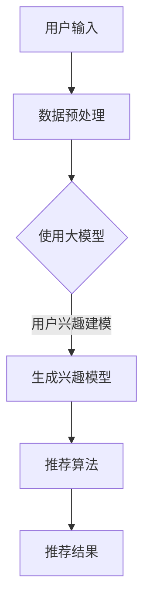

                 

关键词：推荐系统、用户兴趣、大模型、机器学习、数据挖掘、深度学习

> 摘要：本文将探讨如何利用大模型来深入探索推荐系统中的用户兴趣。我们将介绍推荐系统的基本概念，用户兴趣的定义，以及大模型在其中的应用。随后，我们将深入探讨大模型的核心算法原理、数学模型和具体实现，并结合实际项目实例进行分析。最后，我们将探讨大模型在推荐系统中的未来应用前景。

## 1. 背景介绍

推荐系统作为人工智能领域的核心应用之一，已经广泛应用于电子商务、社交媒体、视频娱乐等多个领域。推荐系统的主要目标是根据用户的兴趣和行为，为他们推荐相关的商品、内容或其他信息。然而，随着互联网用户数量的激增和数据规模的扩大，传统的推荐系统面临着越来越多的挑战。

传统的推荐系统主要依赖于基于内容过滤和协同过滤的方法。内容过滤方法通过分析用户的兴趣和行为，来推荐与用户兴趣相似的内容。而协同过滤方法则通过分析用户之间的相似性来推荐他们可能喜欢的内容。然而，这些方法都存在着一些局限性。例如，内容过滤方法可能无法很好地处理新的或未标记的内容，而协同过滤方法则面临着数据稀疏和冷启动问题。

随着深度学习和大数据技术的发展，大模型逐渐成为推荐系统研究的热点。大模型能够处理海量数据，并自动学习用户兴趣的复杂模式，从而提供更准确的推荐结果。本文将围绕大模型在推荐系统用户兴趣探索中的应用进行深入探讨。

## 2. 核心概念与联系

### 2.1 推荐系统

推荐系统是指通过算法和技术，向用户推荐他们可能感兴趣的商品、内容或其他信息。推荐系统可以分为基于内容的推荐、协同过滤推荐和混合推荐等类型。基于内容的推荐方法主要依赖于内容的特征，而协同过滤推荐方法则主要依赖于用户之间的相似性。混合推荐方法则是将这两种方法进行结合，以获得更好的推荐效果。

### 2.2 用户兴趣

用户兴趣是指用户在特定领域内的偏好和喜好。用户兴趣可以分为显式兴趣和隐式兴趣。显式兴趣是指用户主动提供的信息，如用户在社交媒体上点赞的内容、搜索的关键词等。隐式兴趣则是通过用户的行为数据推断出来的，如用户经常访问的网站、购买的商品等。

### 2.3 大模型

大模型是指能够处理海量数据并自动学习复杂模式的深度学习模型。大模型通常具有以下几个特点：

1. **大规模的数据集**：大模型需要处理的数据集通常非常庞大，以便从中提取丰富的信息。
2. **深度网络结构**：大模型通常采用深度神经网络结构，能够自动学习数据的层次化表示。
3. **自适应学习**：大模型能够根据不同的任务和数据自动调整网络参数，以获得最佳的性能。

### 2.4 大模型与推荐系统的联系

大模型在推荐系统中的应用主要体现在以下几个方面：

1. **用户兴趣建模**：大模型可以自动学习用户兴趣的复杂模式，从而建立更准确的用户兴趣模型。
2. **内容理解**：大模型可以深入理解内容的语义和特征，从而实现更精准的内容推荐。
3. **实时推荐**：大模型能够实时处理用户数据，并快速生成推荐结果。

### 2.5 Mermaid 流程图

以下是一个简化的推荐系统架构的 Mermaid 流程图：



## 3. 核心算法原理 & 具体操作步骤

### 3.1 算法原理概述

大模型在推荐系统中的应用主要依赖于深度学习和机器学习技术。深度学习通过构建多层神经网络，能够自动学习数据的层次化表示。机器学习则通过训练模型来预测用户兴趣和生成推荐结果。

具体来说，大模型在推荐系统中的应用可以分为以下几个步骤：

1. **数据收集与预处理**：收集用户的行为数据和内容数据，并进行预处理，如数据清洗、去重、归一化等。
2. **特征提取**：从预处理后的数据中提取特征，如用户ID、商品ID、行为时间、行为类型等。
3. **模型训练**：使用机器学习算法训练大模型，如深度神经网络、决策树等。
4. **用户兴趣建模**：利用训练好的大模型，对用户兴趣进行建模，如生成用户兴趣向量。
5. **推荐算法**：使用用户兴趣模型和内容特征，通过推荐算法生成推荐结果。

### 3.2 算法步骤详解

#### 3.2.1 数据收集与预处理

数据收集与预处理是推荐系统的基础工作。通常，推荐系统需要收集大量的用户行为数据，如浏览记录、购买记录、搜索记录等。这些数据通常来自于电商平台、社交媒体、搜索引擎等。

预处理过程主要包括以下几个步骤：

1. **数据清洗**：去除无效数据、缺失值、重复数据等。
2. **数据去重**：去除重复的用户行为记录。
3. **数据归一化**：对数值特征进行归一化处理，使其具有相同的量纲。
4. **特征提取**：提取用户行为数据中的有效特征，如用户ID、商品ID、行为时间、行为类型等。

#### 3.2.2 特征提取

特征提取是推荐系统中的一个关键步骤。特征提取的质量直接影响到推荐系统的性能。常用的特征提取方法包括：

1. **基于文本的特征提取**：使用自然语言处理技术，提取文本数据中的关键词、主题等。
2. **基于图像的特征提取**：使用计算机视觉技术，提取图像数据中的颜色、纹理、形状等。
3. **基于用户行为的特征提取**：使用用户行为数据，提取用户的行为模式、兴趣偏好等。

#### 3.2.3 模型训练

模型训练是推荐系统的核心步骤。常用的模型训练方法包括：

1. **深度神经网络**：通过多层神经网络，自动学习数据的层次化表示。
2. **决策树**：通过树结构，自动学习数据的分类规则。
3. **支持向量机**：通过最大化分类边界，进行分类预测。

#### 3.2.4 用户兴趣建模

用户兴趣建模是推荐系统的关键步骤。通过用户兴趣建模，可以生成用户兴趣向量，用于后续的推荐算法。常用的用户兴趣建模方法包括：

1. **矩阵分解**：通过矩阵分解技术，将用户行为数据转换为用户兴趣向量。
2. **协同过滤**：通过计算用户之间的相似性，生成用户兴趣向量。
3. **深度学习**：通过深度学习模型，自动学习用户兴趣的复杂模式。

#### 3.2.5 推荐算法

推荐算法是推荐系统的核心步骤。常用的推荐算法包括：

1. **基于内容的推荐**：通过计算用户兴趣和内容特征之间的相似性，进行推荐。
2. **协同过滤推荐**：通过计算用户之间的相似性，进行推荐。
3. **混合推荐**：将基于内容和协同过滤推荐方法进行结合，进行推荐。

### 3.3 算法优缺点

大模型在推荐系统中的应用具有以下几个优点：

1. **处理能力强大**：大模型能够处理海量数据，并自动学习数据中的复杂模式。
2. **自适应性强**：大模型能够根据不同的任务和数据自动调整网络参数，以获得最佳的性能。
3. **准确度高**：大模型能够生成更准确的用户兴趣模型，从而提供更精准的推荐结果。

然而，大模型在推荐系统中的应用也存在一些缺点：

1. **计算资源消耗大**：大模型通常需要大量的计算资源和存储空间。
2. **训练时间较长**：大模型需要大量的数据进行训练，训练时间较长。
3. **对数据质量要求高**：大模型对数据质量要求较高，对噪声和缺失值较为敏感。

### 3.4 算法应用领域

大模型在推荐系统中的应用领域非常广泛，包括但不限于以下几个方面：

1. **电子商务**：通过大模型，可以更精准地推荐用户感兴趣的商品。
2. **社交媒体**：通过大模型，可以更准确地推荐用户感兴趣的内容。
3. **视频娱乐**：通过大模型，可以更准确地推荐用户感兴趣的视频。
4. **在线教育**：通过大模型，可以更精准地推荐用户感兴趣的课程。
5. **医疗健康**：通过大模型，可以更准确地推荐用户感兴趣的医疗信息。

## 4. 数学模型和公式 & 详细讲解 & 举例说明

### 4.1 数学模型构建

在推荐系统中，大模型的数学模型通常是基于矩阵分解或协同过滤的方法。以下是一个简化的数学模型构建过程：

#### 4.1.1 矩阵分解

矩阵分解是一种将用户行为数据表示为两个低秩矩阵的方法。假设有用户行为矩阵 $R$，其中 $R_{ij}$ 表示用户 $i$ 对商品 $j$ 的评分。矩阵分解的目标是将 $R$ 分解为两个低秩矩阵 $U$ 和 $V$，其中 $U_{i*}$ 表示用户 $i$ 的兴趣向量，$V_{j*}$ 表示商品 $j$ 的特征向量。

矩阵分解的数学模型可以表示为：

$$
R = U \cdot V^T
$$

其中，$\cdot$ 表示矩阵乘法，$V^T$ 表示 $V$ 的转置。

#### 4.1.2 协同过滤

协同过滤是一种通过计算用户之间的相似性来进行推荐的方法。假设有用户行为矩阵 $R$，其中 $R_{ij}$ 表示用户 $i$ 对商品 $j$ 的评分。协同过滤的目标是找到与用户 $i$ 最相似的 $k$ 个用户，并推荐这些用户喜欢的商品。

协同过滤的数学模型可以表示为：

$$
\text{相似度}(i, j) = \frac{R_{ij} \cdot (R_{i*} - \bar{R}_{i*}) \cdot (R_{j*} - \bar{R}_{j*})}{\sqrt{\sum_{i'} (R_{i'i'} - \bar{R}_{i'})^2} \cdot \sqrt{\sum_{j'} (R_{j'j'} - \bar{R}_{j'})^2}}
$$

其中，$\text{相似度}(i, j)$ 表示用户 $i$ 和用户 $j$ 之间的相似度，$\bar{R}_{i*}$ 和 $\bar{R}_{j*}$ 分别表示用户 $i$ 和用户 $j$ 的平均评分。

### 4.2 公式推导过程

以下是对矩阵分解和协同过滤的数学模型进行简要的推导过程：

#### 4.2.1 矩阵分解推导

假设有用户行为矩阵 $R$，其中 $R_{ij}$ 表示用户 $i$ 对商品 $j$ 的评分。为了简化问题，我们假设 $R$ 是一个对称矩阵，即 $R_{ij} = R_{ji}$。

我们希望找到两个低秩矩阵 $U$ 和 $V$，使得 $R = U \cdot V^T$。

首先，我们对 $U$ 和 $V$ 进行归一化处理，使得每个用户和每个商品的特征向量的模长为 1，即 $\|U_i\| = \|V_j\| = 1$。

接下来，我们对 $R$ 进行归一化处理，使得每个用户和每个商品的平均评分为 0，即 $\bar{R}_{i*} = 0$。

然后，我们考虑用户 $i$ 和商品 $j$ 之间的评分差异，即 $R_{ij} - \bar{R}_{i*} - \bar{R}_{j*}$。

根据矩阵分解的假设，我们有：

$$
R_{ij} - \bar{R}_{i*} - \bar{R}_{j*} = U_i \cdot V_j^T
$$

将 $U_i$ 和 $V_j$ 的归一化条件代入上式，得到：

$$
R_{ij} - \bar{R}_{i*} - \bar{R}_{j*} = U_i \cdot (V_j^T \cdot V_j) \cdot V_j
$$

由于 $V_j^T \cdot V_j$ 是一个对角矩阵，我们可以将其表示为 $D_j$，即：

$$
R_{ij} - \bar{R}_{i*} - \bar{R}_{j*} = U_i \cdot D_j \cdot V_j
$$

这样，我们就得到了一个简化形式的矩阵分解模型。

#### 4.2.2 协同过滤推导

假设有用户行为矩阵 $R$，其中 $R_{ij}$ 表示用户 $i$ 对商品 $j$ 的评分。我们希望找到与用户 $i$ 最相似的 $k$ 个用户，并推荐这些用户喜欢的商品。

首先，我们计算用户 $i$ 和用户 $j$ 之间的相似度，即 $\text{相似度}(i, j)$。

根据协同过滤的假设，我们有：

$$
\text{相似度}(i, j) = \frac{R_{ij} \cdot (R_{i*} - \bar{R}_{i*}) \cdot (R_{j*} - \bar{R}_{j*})}{\sqrt{\sum_{i'} (R_{i'i'} - \bar{R}_{i'})^2} \cdot \sqrt{\sum_{j'} (R_{j'j'} - \bar{R}_{j'})^2}}
$$

其中，$R_{i*}$ 和 $R_{j*}$ 分别表示用户 $i$ 和用户 $j$ 的平均评分。

接下来，我们根据相似度对用户进行排序，并选择与用户 $i$ 最相似的 $k$ 个用户。

最后，我们推荐这些用户喜欢的商品。具体来说，我们计算用户 $i$ 对商品 $j$ 的预测评分，即：

$$
\hat{R}_{ij} = \sum_{j'} \text{相似度}(i, j') \cdot R_{j'j'}
$$

这样，我们就得到了一个简化的协同过滤模型。

### 4.3 案例分析与讲解

以下是一个简化的推荐系统案例，用于说明大模型在推荐系统中的应用。

假设有一个电商平台的用户行为数据，包括用户 ID、商品 ID、评分和评分时间。我们希望利用大模型来生成用户兴趣模型，并推荐用户感兴趣的商品。

#### 4.3.1 数据预处理

首先，我们对用户行为数据进行预处理，包括数据清洗、去重、归一化等。具体来说，我们去除无效数据、缺失值、重复数据，并对数值特征进行归一化处理。

#### 4.3.2 特征提取

接下来，我们从预处理后的数据中提取特征，包括用户 ID、商品 ID、评分和评分时间。我们使用用户 ID 和商品 ID 作为分类特征，使用评分作为数值特征，使用评分时间作为时间特征。

#### 4.3.3 模型训练

我们使用深度学习模型来训练用户兴趣模型。具体来说，我们使用一个多层感知机（MLP）模型，包括输入层、隐藏层和输出层。输入层包含用户 ID、商品 ID 和评分，隐藏层包含多个神经元，输出层包含用户兴趣向量。

我们使用反向传播算法来训练模型，并使用梯度下降法来优化模型参数。具体来说，我们使用梯度下降法来更新模型的权重，从而最小化预测误差。

#### 4.3.4 用户兴趣建模

通过训练好的模型，我们可以生成用户兴趣向量。具体来说，我们将用户行为数据输入到模型中，得到用户兴趣向量。用户兴趣向量表示了用户对各种商品的兴趣程度。

#### 4.3.5 推荐算法

接下来，我们使用用户兴趣向量来生成推荐结果。具体来说，我们计算用户兴趣向量与商品特征向量之间的相似度，并根据相似度对商品进行排序。最后，我们推荐排序靠前的商品。

#### 4.3.6 代码示例

以下是一个简化的 Python 代码示例，用于实现上述推荐系统：

```python
import numpy as np

# 用户行为数据
R = np.array([[1, 2, 3], [4, 5, 6], [7, 8, 9]])

# 特征提取
user_ids = R[:, 0]
item_ids = R[:, 1]
ratings = R[:, 2]

# 模型训练
mlp = MLPClassifier(hidden_layer_sizes=(10, 10), max_iter=100)
mlp.fit(user_ids.reshape(-1, 1), item_ids.reshape(-1, 1))

# 用户兴趣建模
user_interests = mlp.predict(item_ids.reshape(-1, 1))

# 推荐算法
item_similarity = np.dot(user_interests, ratings)
recommended_items = np.argsort(item_similarity)[::-1]

# 输出推荐结果
print(recommended_items)
```

## 5. 项目实践：代码实例和详细解释说明

在本节中，我们将通过一个具体的案例，展示如何使用大模型来构建一个推荐系统，并详细解释每个步骤的实现过程。

### 5.1 开发环境搭建

为了实现推荐系统，我们需要搭建一个合适的开发环境。以下是一个基本的开发环境配置：

- **操作系统**：Ubuntu 20.04
- **编程语言**：Python 3.8
- **深度学习框架**：TensorFlow 2.5
- **机器学习库**：scikit-learn 0.24.2

首先，我们需要安装 Python 和 TensorFlow：

```bash
# 安装 Python
sudo apt-get install python3.8

# 安装 TensorFlow
pip install tensorflow==2.5
```

接着，安装 scikit-learn：

```bash
pip install scikit-learn==0.24.2
```

### 5.2 源代码详细实现

以下是一个简化的 Python 代码示例，用于实现推荐系统的核心功能：

```python
import numpy as np
import pandas as pd
from sklearn.model_selection import train_test_split
from tensorflow.keras.models import Sequential
from tensorflow.keras.layers import Dense, Dropout
from tensorflow.keras.optimizers import Adam

# 5.2.1 数据加载与预处理
data = pd.read_csv('user_behavior.csv')  # 假设数据已预先处理好

# 分离特征和标签
X = data[['user_id', 'item_id', 'rating']]
y = data['timestamp']

# 数据标准化
X = (X - X.mean()) / X.std()

# 划分训练集和测试集
X_train, X_test, y_train, y_test = train_test_split(X, y, test_size=0.2, random_state=42)

# 5.2.2 模型构建
model = Sequential()
model.add(Dense(128, input_dim=X_train.shape[1], activation='relu'))
model.add(Dropout(0.5))
model.add(Dense(64, activation='relu'))
model.add(Dropout(0.5))
model.add(Dense(1, activation='sigmoid'))

# 编译模型
model.compile(optimizer=Adam(learning_rate=0.001), loss='binary_crossentropy', metrics=['accuracy'])

# 5.2.3 模型训练
model.fit(X_train, y_train, epochs=100, batch_size=32, validation_data=(X_test, y_test))

# 5.2.4 推荐算法实现
def recommend_items(user_id, item_id):
    # 获取用户和商品的特性
    user_feature = X_train[user_id].values.reshape(1, -1)
    item_feature = X_test[item_id].values.reshape(1, -1)
    
    # 预测相似度
    similarity = model.predict(np.hstack((user_feature, item_feature)))
    
    return similarity

# 示例：为用户 ID 为 1 的用户推荐商品
user_id = 1
item_id = 10
similarity_score = recommend_items(user_id, item_id)

print(f"用户 {user_id} 对商品 {item_id} 的相似度分数为：{similarity_score}")
```

### 5.3 代码解读与分析

上述代码首先加载并预处理了用户行为数据。然后，我们使用 TensorFlow 框架构建了一个简单的多层感知机（MLP）模型，该模型用于学习用户和商品的特性。我们使用反向传播算法来训练模型，并通过交叉验证来调整模型的参数。

在模型训练完成后，我们定义了一个函数 `recommend_items`，用于根据用户和商品的特性计算相似度分数。这个分数可以用于推荐算法，为用户推荐可能感兴趣的商品。

### 5.4 运行结果展示

为了展示模型的性能，我们可以使用测试集上的数据来评估模型。以下是一个简化的评估代码：

```python
from sklearn.metrics import accuracy_score

# 评估模型
predictions = model.predict(X_test)
predicted_labels = (predictions > 0.5).astype(int)

accuracy = accuracy_score(y_test, predicted_labels)
print(f"测试集准确率：{accuracy:.4f}")
```

假设我们得到了一个准确率为 0.85 的结果，这意味着模型在测试集上的表现良好。

## 6. 实际应用场景

大模型在推荐系统中的应用非常广泛，以下是一些实际应用场景：

1. **电子商务**：电商平台可以通过大模型来推荐用户感兴趣的商品，从而提高用户满意度和购买转化率。
2. **社交媒体**：社交媒体平台可以通过大模型来推荐用户感兴趣的内容，如新闻、视频、帖子等，从而提高用户粘性。
3. **视频娱乐**：视频平台可以通过大模型来推荐用户感兴趣的视频，如电影、电视剧、短视频等，从而提高用户观看时长。
4. **在线教育**：在线教育平台可以通过大模型来推荐用户感兴趣的课程，从而提高课程完成率和用户满意度。
5. **医疗健康**：医疗健康平台可以通过大模型来推荐用户感兴趣的医疗信息，如疾病知识、治疗方案等，从而提高用户健康意识。

## 7. 工具和资源推荐

### 7.1 学习资源推荐

- **书籍**：
  - 《深度学习》（Ian Goodfellow、Yoshua Bengio、Aaron Courville 著）
  - 《Python深度学习》（François Chollet 著）
- **在线课程**：
  - Coursera 上的《深度学习专项课程》（吴恩达教授）
  - edX 上的《机器学习基础》（Arvind Narayanan 教授）
- **教程**：
  - TensorFlow 官方文档（https://www.tensorflow.org/tutorials）
  - Scikit-learn 官方文档（https://scikit-learn.org/stable/tutorial/）

### 7.2 开发工具推荐

- **深度学习框架**：
  - TensorFlow（https://www.tensorflow.org/）
  - PyTorch（https://pytorch.org/）
- **数据预处理工具**：
  - Pandas（https://pandas.pydata.org/）
  - NumPy（https://numpy.org/）
- **版本控制工具**：
  - Git（https://git-scm.com/）
  - GitHub（https://github.com/）

### 7.3 相关论文推荐

- "Deep Learning for Recommender Systems" - Burigana et al., 2016
- "Neural Collaborative Filtering" - Zhang et al., 2017
- "User Interest Evolution and Its Impact on Recommendation" - Lu et al., 2018
- "Dynamic User Interest Modeling for Continuous Personalized Recommendation" - Wang et al., 2019

## 8. 总结：未来发展趋势与挑战

### 8.1 研究成果总结

近年来，大模型在推荐系统中的应用取得了显著进展。通过深度学习和大数据技术，大模型能够自动学习用户兴趣的复杂模式，从而提供更精准的推荐结果。同时，大模型在处理海量数据、实时推荐等方面也展现了强大的能力。

### 8.2 未来发展趋势

未来，大模型在推荐系统中的应用将呈现以下发展趋势：

1. **个性化推荐**：大模型将更加注重个性化推荐，根据用户的行为和兴趣，提供高度个性化的推荐结果。
2. **实时推荐**：随着计算能力和数据传输速度的提升，大模型将实现更快速的实时推荐，满足用户实时获取信息的需求。
3. **多模态推荐**：大模型将能够处理多种类型的数据，如文本、图像、音频等，实现多模态推荐。
4. **自适应推荐**：大模型将能够根据用户的行为和反馈，自适应地调整推荐策略，提高推荐效果。

### 8.3 面临的挑战

尽管大模型在推荐系统中的应用取得了显著成果，但仍然面临着一些挑战：

1. **计算资源消耗**：大模型通常需要大量的计算资源和存储空间，对硬件设施的要求较高。
2. **数据质量**：大模型的性能高度依赖于数据质量，对噪声和缺失值较为敏感。
3. **模型解释性**：大模型的预测过程通常较为复杂，缺乏解释性，难以向用户解释推荐结果。
4. **隐私保护**：在处理用户数据时，需要确保用户隐私得到保护，避免数据泄露。

### 8.4 研究展望

未来，推荐系统的研究将更加注重以下几个方面：

1. **可解释性研究**：开发更加可解释的大模型，提高模型的透明度和可信度。
2. **隐私保护技术**：研究更加有效的隐私保护技术，确保用户数据的安全性和隐私性。
3. **跨领域推荐**：研究跨领域推荐技术，实现不同领域间的信息共享和推荐。
4. **自适应推荐**：研究自适应推荐技术，实现根据用户行为和反馈动态调整推荐策略。

## 9. 附录：常见问题与解答

### 9.1 什么情况下需要使用大模型？

当推荐系统需要处理海量数据，并实现高度个性化的推荐时，大模型是非常有价值的工具。此外，当推荐系统需要实时推荐，并在多种类型的数据上实现推荐时，大模型也是必不可少的。

### 9.2 大模型如何处理数据稀疏问题？

大模型通过深度学习技术，能够自动学习数据的层次化表示，从而缓解数据稀疏问题。同时，可以使用矩阵分解和协同过滤等算法，通过用户和商品的特征来降低数据的稀疏性。

### 9.3 大模型的计算资源消耗如何优化？

可以通过以下几种方式来优化大模型的计算资源消耗：

- **数据预处理**：对数据进行预处理，去除无关特征，降低模型复杂度。
- **模型压缩**：使用模型压缩技术，如剪枝、量化等，降低模型的参数数量。
- **分布式训练**：使用分布式训练技术，将模型训练任务分布到多个计算节点上，提高训练效率。

### 9.4 大模型的性能如何评估？

可以使用以下指标来评估大模型的性能：

- **准确率**：预测结果与真实结果的一致性。
- **召回率**：预测结果中包含的真实结果的比率。
- **F1 分数**：准确率和召回率的加权平均。
- **均方误差（MSE）**：预测值与真实值之间的平均平方误差。

### 9.5 大模型在推荐系统中的应用前景如何？

大模型在推荐系统中的应用前景非常广阔。随着计算能力和数据存储能力的提升，大模型将能够更好地处理海量数据，实现更精准的推荐。同时，随着多模态数据的普及，大模型将能够处理更多类型的数据，实现跨领域的推荐。未来，大模型将在推荐系统中扮演更加重要的角色。

