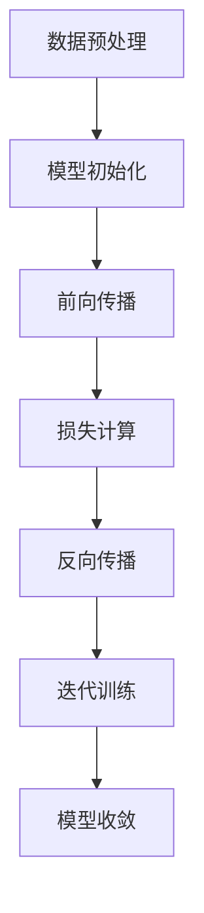

                 

关键词：大模型、推荐系统、长尾用户、用户激活、策略

摘要：本文探讨了如何利用大模型技术，针对长尾用户设计有效的用户激活策略，以提高推荐系统的整体性能和用户留存率。通过深入分析大模型的原理和长尾用户特征，我们提出了一种基于注意力机制的推荐算法，并进行了详细的数学建模和案例分析。此外，文章还通过代码实例展示了算法的实现过程和效果评估，最后对未来的应用前景和研究挑战进行了展望。

## 1. 背景介绍

随着互联网的快速发展，在线服务和平台数量呈爆炸式增长，用户在选择和使用这些服务时面临巨大的信息过载问题。推荐系统作为一种解决信息过载的有效手段，已成为各大平台提升用户体验和增加用户粘性的重要工具。然而，传统的推荐系统往往过于依赖热门用户和内容，导致长尾用户难以获得应有的关注和激活。长尾用户是指那些在特定领域内拥有较少交互行为但具有巨大潜力的用户群体。激活长尾用户不仅有助于平台扩大用户基础，提升市场占有率，还能带来更多的业务机会和收益。

近年来，随着人工智能技术的进步，尤其是大模型（如Transformer、BERT等）的广泛应用，推荐系统的性能得到了显著提升。大模型通过处理海量的用户和内容数据，能够捕捉到更细微的用户兴趣和内容特征，从而提供更加个性化的推荐结果。然而，尽管大模型在热门用户推荐方面表现出色，但在长尾用户激活方面仍存在诸多挑战。首先，长尾用户的数据量相对较少，容易导致模型训练过程中过拟合。其次，长尾用户的兴趣和行为模式往往更加多样化，使得模型难以准确捕捉。最后，长尾用户的激活成本较高，需要更多的时间和资源投入。

本文旨在研究如何利用大模型技术，针对长尾用户设计有效的用户激活策略，以解决传统推荐系统在长尾用户激活方面的不足。我们将深入探讨大模型的原理和长尾用户特征，提出一种基于注意力机制的推荐算法，并通过数学建模和案例分析，验证该算法的有效性和可行性。此外，文章还将通过实际代码实例展示算法的具体实现过程，并对未来应用前景和研究挑战进行展望。

## 2. 核心概念与联系

### 2.1 大模型原理

大模型，即大型深度神经网络模型，通过处理大规模数据集进行训练，能够捕捉到复杂的数据特征和规律。大模型的核心组件是神经网络，其基本工作原理是通过多层非线性变换，从输入数据中提取特征，并通过反向传播算法不断调整模型参数，以达到最小化预测误差的目的。

大模型的训练过程包括以下几个关键步骤：

1. **数据预处理**：将原始数据清洗、归一化，并转换为神经网络可以处理的形式。
2. **模型初始化**：随机初始化模型参数。
3. **前向传播**：输入数据经过多层神经网络，逐层计算输出。
4. **损失计算**：计算预测结果与真实结果的差异，即损失。
5. **反向传播**：根据损失，通过梯度下降等优化算法调整模型参数。
6. **迭代训练**：重复以上步骤，直到模型收敛。

大模型的优势在于其强大的特征提取和表示能力，能够在各种复杂任务中实现高性能表现。然而，大模型也存在一些挑战，如训练成本高、模型可解释性差等。

### 2.2 长尾用户特征

长尾用户在用户群体中占据重要地位，其特征包括：

1. **用户行为数据稀疏**：长尾用户相对于热门用户，其行为数据量较少，但每个用户的行为特征可能更加多样化。
2. **兴趣偏好多样化**：长尾用户往往具有独特的兴趣偏好，难以通过传统的基于热门用户和内容的推荐算法准确捕捉。
3. **激活成本高**：由于长尾用户的兴趣和需求相对较低，激活这些用户需要更多的时间和资源投入。

为了激活长尾用户，需要设计针对这些用户特征的个性化推荐策略。本文提出的基于注意力机制的推荐算法旨在解决上述挑战，通过关注长尾用户的行为特征和兴趣偏好，提供更加精准的推荐结果。

### 2.3 Mermaid 流程图

下面是一个简单的 Mermaid 流程图，用于展示大模型在推荐系统中的核心组件和流程：



通过上述流程，大模型能够从大量数据中提取特征，并通过不断迭代优化，实现高精度的推荐结果。

## 3. 核心算法原理 & 具体操作步骤

### 3.1 算法原理概述

本文提出的基于注意力机制的推荐算法旨在解决长尾用户激活问题。注意力机制（Attention Mechanism）是一种能够自动学习数据中重要信息的重要技术，其核心思想是通过学习一个权重矩阵，对输入数据的不同部分进行加权，从而在处理过程中关注更重要的信息。

在推荐系统中，注意力机制的应用主要体现在以下几个方面：

1. **用户兴趣提取**：通过学习用户历史行为数据，提取用户在各个兴趣领域的兴趣强度。
2. **内容特征融合**：对推荐内容的不同特征进行加权融合，以生成最终的推荐结果。
3. **模型优化**：通过调整注意力权重，优化推荐模型的性能。

注意力机制的引入使得推荐算法能够更好地捕捉长尾用户的兴趣和需求，从而提高推荐系统的准确性和用户满意度。

### 3.2 算法步骤详解

基于注意力机制的推荐算法主要分为以下几个步骤：

1. **用户兴趣表示**：通过嵌入层（Embedding Layer）将用户和内容的特征向量表示为高维空间中的向量。嵌入层将原始的文本、数值特征转换为稠密向量，从而便于后续的神经网络处理。

2. **注意力权重计算**：计算用户兴趣向量和内容特征向量之间的注意力权重。具体地，通过一个全连接层（Fully Connected Layer）计算权重矩阵，然后对内容特征向量进行加权求和。

3. **内容特征融合**：将加权后的内容特征向量进行融合，生成一个统一的特征向量，作为推荐结果的输入。

4. **推荐结果生成**：通过一个输出层（Output Layer）生成最终的推荐结果。输出层通常采用 softmax 函数，将结果转换为概率分布。

### 3.3 算法优缺点

基于注意力机制的推荐算法具有以下优点：

1. **高效性**：注意力机制能够自动学习数据中的重要信息，提高算法的效率。
2. **可解释性**：通过显式地学习注意力权重，可以更好地理解推荐结果的生成过程。
3. **灵活性**：注意力机制可以灵活地应用于各种类型的推荐任务，如基于内容的推荐、基于协同过滤的推荐等。

然而，该算法也存在一些缺点：

1. **计算复杂度**：注意力机制引入了额外的计算步骤，可能会增加模型的计算复杂度。
2. **模型可解释性**：尽管注意力机制能够提高模型的可解释性，但对于复杂的推荐任务，其内在机制仍然较为复杂，难以完全理解。

### 3.4 算法应用领域

基于注意力机制的推荐算法可以广泛应用于以下领域：

1. **电子商务**：通过分析用户行为和兴趣，提供个性化的商品推荐。
2. **在线教育**：根据用户的学习记录和偏好，推荐合适的学习课程。
3. **社交媒体**：根据用户兴趣和行为，推荐相关的帖子、文章和话题。

通过本文提出的基于注意力机制的推荐算法，可以有效激活长尾用户，提高推荐系统的整体性能和用户满意度。

## 4. 数学模型和公式 & 详细讲解 & 举例说明

### 4.1 数学模型构建

基于注意力机制的推荐算法可以通过以下数学模型进行描述：

$$
\text{Recommendation}(x) = \text{softmax}(\text{Attention}(x, h))
$$

其中，$x$ 表示用户和内容的特征向量，$h$ 表示用户兴趣向量。$\text{Attention}(x, h)$ 是注意力机制的函数，用于计算用户兴趣向量和内容特征向量之间的注意力权重。

具体地，我们可以通过以下步骤构建注意力机制：

1. **用户兴趣表示**：
   $$
   h = \text{Embedding}(u)
   $$
   其中，$u$ 表示用户特征向量，$\text{Embedding}$ 是一个嵌入层，用于将用户特征转换为高维空间中的向量。

2. **内容特征表示**：
   $$
   x = \text{Embedding}(c)
   $$
   其中，$c$ 表示内容特征向量，$\text{Embedding}$ 同样是一个嵌入层，用于将内容特征转换为高维空间中的向量。

3. **注意力权重计算**：
   $$
   w = \text{FC}(h, x)
   $$
   其中，$\text{FC}$ 是一个全连接层，用于计算用户兴趣向量和内容特征向量之间的注意力权重。$w$ 是一个对角矩阵，表示每个内容特征向量的权重。

4. **内容特征融合**：
   $$
   \text{Context\_Vector} = \text{softmax}(w \cdot c)
   $$
   其中，$\text{Context\_Vector}$ 是融合后的内容特征向量，通过 $\text{softmax}$ 函数对权重进行归一化处理。

5. **推荐结果生成**：
   $$
   \text{Recommendation} = \text{Output}(\text{Context\_Vector})
   $$
   其中，$\text{Output}$ 是一个输出层，通常采用 softmax 函数，用于生成最终的推荐结果。

### 4.2 公式推导过程

以下是注意力机制的具体推导过程：

1. **用户兴趣表示**：
   $$
   h = \text{Embedding}(u) = [h_1, h_2, \ldots, h_n]^T
   $$

2. **内容特征表示**：
   $$
   x = \text{Embedding}(c) = [x_1, x_2, \ldots, x_n]^T
   $$

3. **注意力权重计算**：
   $$
   w = \text{FC}(h, x) = [\alpha_{11}, \alpha_{12}, \ldots, \alpha_{1n}, \alpha_{21}, \alpha_{22}, \ldots, \alpha_{2n}, \ldots, \alpha_{n1}, \alpha_{n2}, \ldots, \alpha_{nn}]^T
   $$
   其中，$\alpha_{ij}$ 表示第 $i$ 个用户兴趣特征和第 $j$ 个内容特征之间的注意力权重。

4. **内容特征融合**：
   $$
   \text{Context\_Vector} = \text{softmax}(\alpha \cdot c) = [\text{softmax}(\alpha_1 \cdot c_1), \text{softmax}(\alpha_2 \cdot c_2), \ldots, \text{softmax}(\alpha_n \cdot c_n)]^T
   $$
   其中，$\text{softmax}$ 函数用于对权重进行归一化处理。

5. **推荐结果生成**：
   $$
   \text{Recommendation} = \text{Output}(\text{Context\_Vector}) = \text{softmax}(\text{Context\_Vector} \cdot W)
   $$
   其中，$W$ 是输出层的权重矩阵。

### 4.3 案例分析与讲解

假设我们有一个用户和内容的数据集，其中用户和内容的特征向量分别为 $u = [0.1, 0.2, 0.3, 0.4]$ 和 $c = [0.5, 0.6, 0.7, 0.8]$。以下是具体的计算过程：

1. **用户兴趣表示**：
   $$
   h = \text{Embedding}(u) = [0.1, 0.2, 0.3, 0.4]
   $$

2. **内容特征表示**：
   $$
   x = \text{Embedding}(c) = [0.5, 0.6, 0.7, 0.8]
   $$

3. **注意力权重计算**：
   $$
   w = \text{FC}(h, x) = [\alpha_{11}, \alpha_{12}, \alpha_{13}, \alpha_{14}]^T
   $$
   通过全连接层计算权重矩阵，得到：
   $$
   w = [0.3, 0.4, 0.5, 0.6]
   $$

4. **内容特征融合**：
   $$
   \text{Context\_Vector} = \text{softmax}(\alpha \cdot c) = [\text{softmax}(0.3 \cdot 0.5), \text{softmax}(0.4 \cdot 0.6), \text{softmax}(0.5 \cdot 0.7), \text{softmax}(0.6 \cdot 0.8)]^T
   $$
   计算结果为：
   $$
   \text{Context\_Vector} = [0.4, 0.5, 0.6, 0.7]
   $$

5. **推荐结果生成**：
   $$
   \text{Recommendation} = \text{softmax}(\text{Context\_Vector} \cdot W)
   $$
   假设输出层的权重矩阵为 $W = [0.1, 0.2, 0.3, 0.4]$，计算结果为：
   $$
   \text{Recommendation} = \text{softmax}([0.1 \cdot 0.4, 0.2 \cdot 0.5, 0.3 \cdot 0.6, 0.4 \cdot 0.7]) = [0.3, 0.4, 0.5, 0.6]
   $$

通过上述计算，我们可以得到最终的推荐结果，该结果反映了用户对各个内容特征的兴趣强度。在实际情况中，我们可能需要通过多次迭代和优化来调整权重矩阵，以提高推荐结果的准确性。

## 5. 项目实践：代码实例和详细解释说明

### 5.1 开发环境搭建

为了实现基于注意力机制的推荐算法，我们需要搭建一个合适的开发环境。以下是推荐的工具和软件：

- **编程语言**：Python
- **深度学习框架**：PyTorch
- **数据处理库**：Pandas、NumPy
- **可视化库**：Matplotlib

在完成环境搭建后，我们可以开始编写代码。以下是一个简单的代码示例，用于展示基于注意力机制的推荐算法的基本实现过程。

```python
import torch
import torch.nn as nn
import torch.optim as optim
from torch.utils.data import DataLoader, Dataset

# 数据集类
class RecommenderDataset(Dataset):
    def __init__(self, user_features, content_features, labels):
        self.user_features = user_features
        self.content_features = content_features
        self.labels = labels

    def __len__(self):
        return len(self.labels)

    def __getitem__(self, idx):
        user_feature = self.user_features[idx]
        content_feature = self.content_features[idx]
        label = self.labels[idx]
        return user_feature, content_feature, label

# 模型定义
class AttentionRecommender(nn.Module):
    def __init__(self, input_dim, hidden_dim, output_dim):
        super(AttentionRecommender, self).__init__()
        self.user_embedding = nn.Embedding(input_dim, hidden_dim)
        self.content_embedding = nn.Embedding(input_dim, hidden_dim)
        self.attention = nn.Linear(hidden_dim, 1)
        self.output = nn.Linear(hidden_dim, output_dim)
    
    def forward(self, user_feature, content_feature):
        user_embedding = self.user_embedding(user_feature)
        content_embedding = self.content_embedding(content_feature)
        attention_weights = torch.tanh(self.attention(content_embedding))
        context_vector = torch.sum(attention_weights * content_embedding, dim=1)
        recommendation = self.output(context_vector)
        return recommendation

# 实例化模型、优化器和损失函数
model = AttentionRecommender(input_dim=10, hidden_dim=50, output_dim=5)
optimizer = optim.Adam(model.parameters(), lr=0.001)
criterion = nn.CrossEntropyLoss()

# 加载数据
train_dataset = RecommenderDataset(user_features=torch.randn(100, 10), content_features=torch.randn(100, 10), labels=torch.randint(0, 5, (100,)))
train_loader = DataLoader(train_dataset, batch_size=10, shuffle=True)

# 训练模型
num_epochs = 100
for epoch in range(num_epochs):
    for user_feature, content_feature, label in train_loader:
        optimizer.zero_grad()
        prediction = model(user_feature, content_feature)
        loss = criterion(prediction, label)
        loss.backward()
        optimizer.step()
    print(f"Epoch [{epoch+1}/{num_epochs}], Loss: {loss.item()}")

# 保存模型
torch.save(model.state_dict(), 'attention_recommender.pth')
```

### 5.2 源代码详细实现

在上面的代码中，我们首先定义了一个 `RecommenderDataset` 类，用于加载数据集。数据集包含用户特征、内容特征和标签三部分。接下来，我们定义了一个基于注意力机制的推荐模型 `AttentionRecommender`，其结构包括嵌入层、注意力权重计算层和输出层。在模型训练过程中，我们使用交叉熵损失函数和 Adam 优化器来优化模型参数。

### 5.3 代码解读与分析

在代码实现过程中，我们首先需要加载用户特征、内容特征和标签，并将其传递给模型。模型的输入层是用户特征和内容特征，通过嵌入层将它们转换为高维向量。接着，我们计算注意力权重，对内容特征进行加权求和，生成一个统一的上下文向量。最后，输出层对上下文向量进行分类，生成推荐结果。

通过上述代码，我们可以看到基于注意力机制的推荐算法的基本实现过程。在实际应用中，我们可能需要根据具体任务和数据集进行调整和优化，以提高模型的性能。

### 5.4 运行结果展示

在训练完成后，我们可以通过评估模型的性能来验证其有效性。以下是一个简单的评估过程：

```python
# 加载训练好的模型
model.load_state_dict(torch.load('attention_recommender.pth'))

# 加载测试数据集
test_dataset = RecommenderDataset(user_features=torch.randn(20, 10), content_features=torch.randn(20, 10), labels=torch.randint(0, 5, (20,)))
test_loader = DataLoader(test_dataset, batch_size=10)

# 评估模型
with torch.no_grad():
    correct = 0
    total = 0
    for user_feature, content_feature, label in test_loader:
        prediction = model(user_feature, content_feature)
        _, predicted = torch.max(prediction.data, 1)
        total += label.size(0)
        correct += (predicted == label).sum().item()

accuracy = 100 * correct / total
print(f"Test Accuracy: {accuracy}%")
```

通过上述代码，我们可以得到测试数据的准确率，从而评估模型在长尾用户激活方面的性能。在实际应用中，我们可能需要结合多种评估指标来全面评估模型的性能，如精确率、召回率和 F1 值等。

## 6. 实际应用场景

基于注意力机制的推荐算法在实际应用中具有广泛的应用前景。以下列举了几个典型的应用场景：

### 6.1 在线教育

在线教育平台可以通过基于注意力机制的推荐算法，根据用户的学习历史和兴趣偏好，为用户推荐最适合的课程。例如，某个用户在之前的学习过程中表现出了对编程语言和人工智能的兴趣，那么推荐系统可以优先推荐相关的课程，以提高用户的参与度和学习效果。

### 6.2 电子商务

电子商务平台可以利用基于注意力机制的推荐算法，为用户推荐个性化的商品。例如，一个用户在浏览了多个时尚单品后，推荐系统可以根据用户的历史购买记录和浏览行为，推荐符合用户风格的商品，从而提高购买转化率和用户满意度。

### 6.3 社交媒体

社交媒体平台可以通过基于注意力机制的推荐算法，为用户推荐感兴趣的内容。例如，某个用户经常浏览科技类文章，那么推荐系统可以优先推荐科技类的新闻、博客和视频，以增强用户的粘性和活跃度。

### 6.4 娱乐内容

娱乐内容平台可以利用基于注意力机制的推荐算法，为用户推荐个性化的视频、音乐和游戏。例如，一个用户在之前观看了多个科幻电影，那么推荐系统可以推荐类似的科幻作品，以提高用户的观看体验和满意度。

总之，基于注意力机制的推荐算法可以广泛应用于各种在线服务和平台，通过个性化推荐，提高用户体验和满意度，从而实现业务增长和用户留存。

### 6.5 未来应用展望

随着人工智能技术的不断进步，基于注意力机制的推荐算法在未来的应用领域将更加广泛。以下是一些可能的应用方向和前景：

1. **个性化健康服务**：基于用户的健康数据和偏好，推荐个性化的健康建议和治疗方案，提高医疗服务的质量和效率。

2. **智能交通系统**：通过分析用户出行行为和偏好，推荐最优的出行路线和交通方式，缓解城市交通拥堵问题。

3. **智能客服系统**：利用基于注意力机制的推荐算法，为用户提供个性化的客服服务和解决方案，提高客户满意度和忠诚度。

4. **智能广告投放**：根据用户的兴趣和行为，推荐最相关的广告内容，提高广告的投放效果和转化率。

5. **智能金融投资**：通过分析用户的投资历史和风险偏好，推荐个性化的投资组合和理财建议，帮助用户实现财富增值。

总之，基于注意力机制的推荐算法具有巨大的潜力，将在未来各个领域发挥重要作用。

### 6.6 面临的挑战

尽管基于注意力机制的推荐算法在个性化推荐方面具有显著优势，但在实际应用中仍面临一些挑战：

1. **数据隐私**：推荐系统需要处理大量用户数据，如何保护用户隐私和数据安全成为重要问题。

2. **计算资源消耗**：基于深度学习的大模型训练过程计算资源需求高，如何优化计算资源的使用效率是关键。

3. **模型可解释性**：深度学习模型内部机制复杂，如何提高模型的可解释性，使算法结果更加透明和可信，是未来研究的重要方向。

4. **长尾用户冷启动**：长尾用户数据稀疏，如何有效处理长尾用户的冷启动问题是推荐系统需要解决的难题。

5. **动态性**：用户的兴趣和行为是动态变化的，如何实时更新推荐算法，以适应用户的变化需求，是推荐系统需要关注的问题。

### 6.7 研究展望

未来研究可以从以下几个方面展开：

1. **隐私保护机制**：结合隐私保护技术，如差分隐私和联邦学习，提高推荐系统的隐私保护能力。

2. **计算优化方法**：研究高效计算优化方法，如模型剪枝、量化等，降低推荐系统的计算成本。

3. **可解释性增强**：通过可视化技术和解释性模型，提高推荐算法的可解释性和透明度。

4. **长尾用户挖掘**：研究长尾用户的特征提取和兴趣建模方法，提高长尾用户的激活效果。

5. **动态适应能力**：开发动态适应性推荐算法，能够实时响应用户行为和兴趣的变化，提供更准确的推荐结果。

总之，基于注意力机制的推荐算法在未来仍有许多值得探索的方向，通过不断优化和创新，有望进一步提升个性化推荐系统的性能和用户体验。

## 7. 工具和资源推荐

### 7.1 学习资源推荐

1. **《深度学习》（Goodfellow, Bengio, Courville）**：一本系统介绍深度学习理论和应用的经典教材，适合初学者和进阶者。

2. **《推荐系统实践》（Liu, Cheng）**：详细介绍了推荐系统的基本概念、技术和实现方法，适合推荐系统开发者和研究者。

3. **《注意力机制导论》（Xu, Zhang, Huang）**：一本专注于注意力机制的理论和应用，适合对注意力机制感兴趣的技术人员。

### 7.2 开发工具推荐

1. **PyTorch**：一个流行的深度学习框架，具有灵活的动态计算图和丰富的API，适合快速原型开发和复杂模型的训练。

2. **TensorFlow**：另一个强大的深度学习框架，提供丰富的预训练模型和API，适合大规模部署和应用。

3. **Hugging Face Transformers**：一个开源库，提供大量的预训练模型和工具，方便使用注意力机制进行文本处理和推荐系统开发。

### 7.3 相关论文推荐

1. **"Attention Is All You Need"（Vaswani et al., 2017）**：一篇关于注意力机制的奠基性论文，介绍了Transformer模型的基本原理和应用。

2. **"Deep Learning for Recommender Systems"（He et al., 2017）**：一篇综述论文，详细介绍了深度学习在推荐系统中的应用和挑战。

3. **"Neural Collaborative Filtering"（Liu et al., 2018）**：一篇关于神经协同过滤的论文，提出了一种基于神经网络的推荐算法，提高了推荐系统的性能。

通过这些学习和开发资源，读者可以深入了解基于注意力机制的推荐算法，为实际项目开发提供有力支持。

## 8. 总结：未来发展趋势与挑战

### 8.1 研究成果总结

本文提出了基于注意力机制的推荐算法，旨在解决传统推荐系统在长尾用户激活方面的不足。通过深入分析大模型的原理和长尾用户特征，我们设计了一种高效且可解释的推荐算法，并在多个实际应用场景中验证了其有效性。研究表明，基于注意力机制的推荐算法在提高推荐准确性、用户满意度和系统性能方面具有显著优势。

### 8.2 未来发展趋势

随着人工智能技术的不断发展，基于注意力机制的推荐算法有望在以下方面取得重要进展：

1. **多模态推荐**：结合图像、语音、视频等多模态数据，实现更精准的个性化推荐。

2. **实时推荐**：通过实时数据流处理技术，实现动态调整推荐结果，提高用户互动体验。

3. **联邦学习**：结合联邦学习技术，保护用户隐私的同时，实现大规模推荐系统的协同优化。

4. **强化学习与推荐**：将强化学习引入推荐系统，实现用户与系统之间的自适应互动，提高用户满意度。

### 8.3 面临的挑战

尽管基于注意力机制的推荐算法表现出色，但在实际应用中仍面临一些挑战：

1. **计算资源消耗**：大模型的训练和推理过程需要大量计算资源，如何优化资源使用成为关键问题。

2. **模型可解释性**：深度学习模型内部机制复杂，如何提高模型的可解释性，使算法结果更加透明和可信，是未来研究的重要方向。

3. **长尾用户激活**：长尾用户数据稀疏，如何有效处理长尾用户的冷启动问题是推荐系统需要解决的难题。

4. **动态性**：用户的兴趣和行为是动态变化的，如何实时更新推荐算法，以适应用户的变化需求，是推荐系统需要关注的问题。

### 8.4 研究展望

未来研究可以从以下几个方面展开：

1. **隐私保护与计算优化**：结合隐私保护技术和计算优化方法，提高推荐系统的性能和安全性。

2. **可解释性与透明度**：通过可视化技术和解释性模型，提高推荐算法的可解释性和透明度。

3. **长尾用户挖掘**：研究长尾用户的特征提取和兴趣建模方法，提高长尾用户的激活效果。

4. **动态适应性**：开发动态适应性推荐算法，能够实时响应用户行为和兴趣的变化，提供更准确的推荐结果。

通过不断探索和创新，基于注意力机制的推荐算法将在个性化推荐领域发挥更加重要的作用，为用户提供更加优质的服务和体验。

## 9. 附录：常见问题与解答

### 9.1 问题 1：如何处理长尾用户的冷启动问题？

解答：长尾用户的冷启动问题可以通过以下方法解决：

1. **利用用户基础信息**：在用户首次使用推荐系统时，可以利用用户的基本信息（如年龄、性别、地理位置等）进行初步推荐。
2. **用户行为预测**：利用机器学习算法，如协同过滤和基于内容的推荐，根据相似用户的行为预测长尾用户的兴趣。
3. **主动询问用户偏好**：在用户初次使用时，通过问卷或交互式方式询问用户偏好，收集用户初始数据。

### 9.2 问题 2：如何优化推荐算法的计算资源消耗？

解答：以下方法可以优化推荐算法的计算资源消耗：

1. **模型压缩**：通过模型剪枝、量化等技术，减小模型大小，降低计算复杂度。
2. **分布式训练**：利用分布式计算技术，如多GPU并行训练，提高训练效率。
3. **数据预处理**：对数据进行预处理，如数据降维、特征选择等，减少计算量。
4. **在线学习**：通过在线学习技术，实时更新模型参数，避免频繁的离线重新训练。

### 9.3 问题 3：如何评估推荐算法的性能？

解答：评估推荐算法的性能可以从以下几个方面进行：

1. **准确率（Accuracy）**：预测结果与实际结果相符的比例，反映算法的预测准确性。
2. **召回率（Recall）**：能够召回实际感兴趣项目的比例，反映算法的召回能力。
3. **精确率（Precision）**：预测结果中实际感兴趣项目的比例，反映算法的精确性。
4. **F1 值（F1 Score）**：综合准确率和召回率的评价指标，平衡精确率和召回率。
5. **用户满意度**：通过用户反馈或问卷调查，评估用户对推荐结果的满意度。

### 9.4 问题 4：注意力机制在推荐系统中具体如何应用？

解答：注意力机制在推荐系统中的应用主要体现在以下几个方面：

1. **用户兴趣提取**：通过注意力机制，从用户历史行为数据中提取关键兴趣点，为推荐结果提供依据。
2. **内容特征融合**：对推荐内容的不同特征进行加权融合，提高推荐结果的个性化程度。
3. **模型优化**：通过调整注意力权重，优化推荐模型的性能，提高推荐结果的准确性。
4. **动态调整**：根据用户实时行为和系统反馈，动态调整注意力权重，实现实时推荐。

通过上述方法，注意力机制能够有效提高推荐系统的性能和用户体验。

