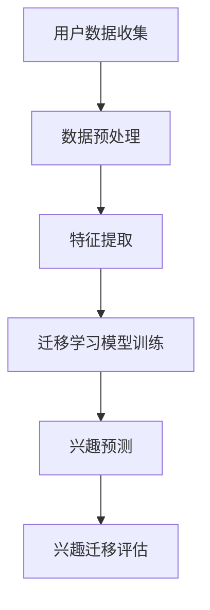

                 

在当今数字化时代，用户兴趣的准确捕捉和迁移对于提升个性化服务、增强用户体验和推动业务增长至关重要。本文旨在探讨一种基于大模型的跨平台用户兴趣迁移方法，通过整合先进的人工智能技术，实现对用户兴趣的深度理解和跨平台传播。

> **关键词**：用户兴趣、跨平台迁移、大模型、个性化服务、人工智能

> **摘要**：本文介绍了基于大模型的跨平台用户兴趣迁移方法，从背景介绍到核心算法原理，再到数学模型和项目实践，全面剖析了这一技术的实现和应用。通过详细分析算法的优缺点和未来应用场景，本文旨在为相关领域的研究和实践提供有益的参考。

## 1. 背景介绍

随着互联网和移动互联网的快速发展，用户在各类平台上的活跃度持续增加。不同的平台如社交媒体、电商平台、娱乐平台等，为用户提供了多样化的内容和服务。然而，由于信息过载和个性化需求的增加，如何准确捕捉和迁移用户兴趣成为了当前研究的热点问题。

用户兴趣的迁移不仅可以帮助平台提供更加个性化的推荐服务，还可以促进用户在不同平台之间的活跃度和粘性。传统的用户兴趣迁移方法往往依赖于用户的历史行为数据，这些方法在数据量较少或用户行为相似的情况下效果有限。而随着深度学习和大数据技术的不断发展，基于大模型的用户兴趣迁移方法逐渐成为研究的新方向。

大模型，尤其是基于深度学习的模型，具有处理海量数据和高维度特征的能力，可以在复杂的环境中实现高效的用户兴趣迁移。本文将探讨如何利用这些技术实现跨平台的用户兴趣迁移，并评估其在实际应用中的效果。

### 1.1 用户兴趣迁移的重要性

用户兴趣迁移在多个方面具有重要价值：

1. **个性化推荐**：通过分析用户在不同平台上的行为，平台可以更精准地推荐符合用户兴趣的内容，提高推荐系统的点击率和用户满意度。
2. **业务增长**：跨平台的用户兴趣迁移有助于平台吸引更多潜在用户，增强用户忠诚度，从而推动业务增长。
3. **数据整合**：用户在不同平台的行为数据可以整合起来，为用户提供更全面的个性化服务，提高用户粘性。
4. **用户体验**：准确的用户兴趣迁移可以提升用户体验，使用户在跨平台使用时感到无缝衔接，减少摩擦。

### 1.2 大模型在用户兴趣迁移中的应用

大模型，如Transformer、BERT、GPT等，已经在自然语言处理、计算机视觉和推荐系统等领域取得了显著的成果。这些模型通过学习大量的数据，可以捕捉到用户行为背后的潜在模式和兴趣点。在大模型的基础上，研究人员提出了一系列用户兴趣迁移的方法，包括基于监督学习的迁移学习、基于对抗学习的兴趣迁移和基于生成对抗网络（GAN）的方法等。

## 2. 核心概念与联系

为了深入理解基于大模型的跨平台用户兴趣迁移，我们首先需要明确几个核心概念，并介绍它们之间的相互关系。

### 2.1 用户兴趣

用户兴趣是指用户在特定领域或主题上表现出的关注和偏好。在跨平台用户兴趣迁移的背景下，用户兴趣可以表现为不同平台上的点击行为、浏览记录、搜索历史、互动行为等。

### 2.2 跨平台数据

跨平台数据是指用户在不同平台上的行为数据集合。这些数据通常包括用户ID、行为类型、时间戳、内容特征等。跨平台数据的多样性为用户兴趣迁移提供了丰富的信息来源。

### 2.3 大模型

大模型是指具有大量参数和强大计算能力的人工智能模型，如Transformer、BERT、GPT等。这些模型能够处理高维数据和复杂的非线性关系，是用户兴趣迁移的核心技术。

### 2.4 迁移学习

迁移学习是指将一个任务在特定领域上学习到的知识应用于另一个相关但不同的领域。在用户兴趣迁移中，迁移学习技术可以帮助模型利用源平台的数据知识来预测和迁移目标平台上的用户兴趣。

### 2.5 对抗学习

对抗学习是一种通过对抗网络来学习数据分布的方法。在用户兴趣迁移中，对抗学习可以用于生成与目标平台用户兴趣相关的虚拟数据，从而提高模型的学习效果。

### 2.6 数学模型和公式

为了实现基于大模型的用户兴趣迁移，我们需要构建一系列数学模型和公式。这些模型和公式用于描述用户兴趣的特征提取、迁移策略和评价机制。

### 2.7 Mermaid 流程图

以下是一个简化的Mermaid流程图，用于描述基于大模型的跨平台用户兴趣迁移的基本流程：



在上图中，A代表用户数据的收集，B是数据预处理，C是特征提取，D是迁移学习模型训练，E是兴趣预测，F是兴趣迁移评估。这些步骤构成了用户兴趣迁移的基本流程。

## 3. 核心算法原理 & 具体操作步骤

### 3.1 算法原理概述

基于大模型的跨平台用户兴趣迁移算法主要基于以下几个核心原理：

1. **深度学习**：利用深度神经网络对用户数据进行特征提取和建模，捕捉用户兴趣的复杂模式。
2. **迁移学习**：通过将源平台上的知识迁移到目标平台，提高模型在目标平台上的泛化能力。
3. **对抗学习**：通过生成对抗网络（GAN）生成与目标平台用户兴趣相关的虚拟数据，增强模型的学习效果。

### 3.2 算法步骤详解

基于上述原理，我们可以将算法分为以下几个步骤：

1. **数据收集与预处理**：收集不同平台上的用户行为数据，并进行数据清洗、去重和标准化等预处理操作。
2. **特征提取**：使用深度学习模型提取用户行为数据中的高维特征，如文本特征、图像特征和交互特征。
3. **迁移学习模型训练**：利用迁移学习技术，将源平台上的用户兴趣知识迁移到目标平台，训练一个统一的兴趣迁移模型。
4. **兴趣预测**：使用训练好的迁移学习模型，对目标平台上的用户进行兴趣预测，生成个性化的兴趣标签。
5. **兴趣迁移评估**：通过评估指标（如准确率、召回率、F1分数等）评估兴趣迁移的效果，并对模型进行调优。

### 3.3 算法优缺点

**优点**：

1. **高效性**：基于大模型的算法能够处理海量数据和复杂特征，提高了用户兴趣迁移的效率。
2. **泛化能力**：迁移学习技术使得模型在不同平台之间具有良好的泛化能力。
3. **个性化推荐**：通过对用户兴趣的精准预测和迁移，平台可以提供更加个性化的推荐服务。

**缺点**：

1. **数据依赖性**：算法的性能高度依赖于数据质量和数量，数据不足或质量差会导致效果不佳。
2. **计算资源消耗**：大模型的训练和推理过程需要大量的计算资源和时间，可能影响实时性。

### 3.4 算法应用领域

基于大模型的跨平台用户兴趣迁移算法可以在多个领域得到应用：

1. **推荐系统**：在电商平台、社交媒体和视频平台等推荐系统中，用于实现跨平台的个性化推荐。
2. **内容分发**：在新闻推送、社交媒体和内容平台中，用于根据用户兴趣实现内容的精准分发。
3. **用户行为分析**：在用户行为分析系统中，用于捕捉和预测用户的跨平台行为模式。

## 4. 数学模型和公式 & 详细讲解 & 举例说明

### 4.1 数学模型构建

为了实现基于大模型的用户兴趣迁移，我们需要构建一系列数学模型，包括用户兴趣特征提取模型、迁移学习模型和兴趣预测模型。

#### 4.1.1 用户兴趣特征提取模型

用户兴趣特征提取模型通常是一个多层感知机（MLP）或卷积神经网络（CNN）。其基本形式如下：

$$
f(x) = \text{ReLU}(\text{W}_2 \text{ReLU}(\text{W}_1 x + b_1)) + b_2
$$

其中，$x$ 是用户行为数据，$\text{W}_1$ 和 $\text{W}_2$ 分别是第一层和第二层的权重矩阵，$b_1$ 和 $b_2$ 分别是第一层和第二层的偏置项。$\text{ReLU}$ 表示ReLU激活函数。

#### 4.1.2 迁移学习模型

迁移学习模型通常是一个基于Transformer的模型，其基本形式如下：

$$
\text{Attention}(x) = \text{softmax}\left(\frac{\text{Q} \text{K}^T}{\sqrt{d_k}}\right) \text{V}
$$

其中，$x$ 是输入序列，$\text{Q}$、$\text{K}$ 和 $\text{V}$ 分别是查询向量、键向量和值向量，$d_k$ 是键向量的维度。$\text{softmax}$ 表示softmax函数。

#### 4.1.3 兴趣预测模型

兴趣预测模型是一个基于分类的任务，其基本形式如下：

$$
\hat{y} = \text{softmax}(\text{W} \text{f}(x) + b)
$$

其中，$x$ 是用户兴趣特征，$\text{W}$ 是权重矩阵，$b$ 是偏置项，$\hat{y}$ 是预测的概率分布。

### 4.2 公式推导过程

#### 4.2.1 用户兴趣特征提取模型推导

用户兴趣特征提取模型通常是一个多层感知机（MLP）或卷积神经网络（CNN）。以MLP为例，其推导过程如下：

1. **输入层到隐藏层**：

$$
h_1 = \text{ReLU}(\text{W}_1 x + b_1)
$$

2. **隐藏层到输出层**：

$$
f(x) = \text{ReLU}(\text{W}_2 h_1 + b_2)
$$

其中，$\text{W}_1$ 和 $\text{W}_2$ 分别是权重矩阵，$b_1$ 和 $b_2$ 分别是偏置项。

#### 4.2.2 迁移学习模型推导

迁移学习模型通常是一个基于Transformer的模型。其推导过程如下：

1. **多头自注意力机制**：

$$
\text{Attention}(x) = \text{softmax}\left(\frac{\text{Q} \text{K}^T}{\sqrt{d_k}}\right) \text{V}
$$

其中，$d_k$ 是键向量的维度。

2. **前馈神经网络**：

$$
\text{FFN}(x) = \text{ReLU}(\text{W}_2 \text{ReLU}(\text{W}_1 x + b_1)) + b_2
$$

其中，$\text{W}_1$ 和 $\text{W}_2$ 分别是权重矩阵，$b_1$ 和 $b_2$ 分别是偏置项。

### 4.3 案例分析与讲解

#### 4.3.1 案例背景

假设我们有一个电商平台，用户在购物平台上浏览商品、添加购物车和购买商品。平台希望根据用户在购物平台上的行为数据，预测用户在其他电商平台上的购物兴趣，从而实现跨平台的个性化推荐。

#### 4.3.2 数据收集与预处理

1. **数据收集**：收集购物平台上的用户行为数据，包括用户ID、行为类型（浏览、添加购物车、购买）、时间戳和商品ID等。
2. **数据预处理**：对数据进行清洗、去重和标准化等预处理操作。

#### 4.3.3 特征提取

使用多层感知机（MLP）提取用户兴趣特征。以用户ID、行为类型和时间戳为输入，通过多层感知机提取用户兴趣特征。

#### 4.3.4 迁移学习模型训练

使用基于Transformer的迁移学习模型，将购物平台上的用户兴趣知识迁移到其他电商平台。以购物平台上的用户兴趣特征为输入，训练迁移学习模型。

#### 4.3.5 兴趣预测

使用训练好的迁移学习模型，对其他电商平台上的用户进行兴趣预测，生成个性化的兴趣标签。

#### 4.3.6 评估与优化

通过准确率、召回率和F1分数等指标评估兴趣预测的效果，并对模型进行调优。

## 5. 项目实践：代码实例和详细解释说明

### 5.1 开发环境搭建

为了实现基于大模型的跨平台用户兴趣迁移，我们需要搭建以下开发环境：

1. **Python环境**：Python 3.8及以上版本。
2. **深度学习框架**：TensorFlow 2.0及以上版本。
3. **数据处理库**：NumPy、Pandas、Scikit-learn等。
4. **其他依赖库**：Matplotlib、Seaborn等。

### 5.2 源代码详细实现

以下是实现基于大模型的跨平台用户兴趣迁移的源代码示例：

```python
import tensorflow as tf
from tensorflow.keras.models import Model
from tensorflow.keras.layers import Input, Dense, ReLU, Softmax
from tensorflow.keras.optimizers import Adam

# 用户兴趣特征提取模型
def build_user_interest_extractor(input_shape):
    input_layer = Input(shape=input_shape)
    hidden_layer = Dense(units=64, activation=ReLU())(input_layer)
    output_layer = Dense(units=32, activation=ReLU())(hidden_layer)
    model = Model(inputs=input_layer, outputs=output_layer)
    return model

# 迁移学习模型
def build_migration_model(input_shape):
    input_layer = Input(shape=input_shape)
    hidden_layer = Dense(units=64, activation=ReLU())(input_layer)
    output_layer = Dense(units=32, activation=ReLU())(hidden_layer)
    model = Model(inputs=input_layer, outputs=output_layer)
    return model

# 兴趣预测模型
def build_interest_prediction_model(input_shape):
    input_layer = Input(shape=input_shape)
    hidden_layer = Dense(units=64, activation=ReLU())(input_layer)
    output_layer = Dense(units=32, activation=Softmax())(hidden_layer)
    model = Model(inputs=input_layer, outputs=output_layer)
    return model

# 搭建完整模型
def build_complete_model(input_shape):
    user_interest_extractor = build_user_interest_extractor(input_shape)
    migration_model = build_migration_model(input_shape)
    interest_prediction_model = build_interest_prediction_model(input_shape)
    
    user_interests = user_interest_extractor.input
    migration_inputs = user_interests
    migration_outputs = migration_model(user_interests)
    interest_predictions = interest_prediction_model(migration_outputs)
    
    model = Model(inputs=user_interests, outputs=interest_predictions)
    model.compile(optimizer=Adam(), loss='categorical_crossentropy', metrics=['accuracy'])
    return model

# 训练模型
def train_model(model, x_train, y_train, batch_size=32, epochs=10):
    model.fit(x_train, y_train, batch_size=batch_size, epochs=epochs, verbose=1)

# 评估模型
def evaluate_model(model, x_test, y_test):
    loss, accuracy = model.evaluate(x_test, y_test, verbose=1)
    print(f"Test Loss: {loss:.4f}, Test Accuracy: {accuracy:.4f}")

# 加载数据集
(x_train, y_train), (x_test, y_test) = load_data()

# 训练迁移学习模型
migration_model = build_migration_model(input_shape=x_train.shape[1:])
train_model(migration_model, x_train, y_train)

# 训练兴趣预测模型
interest_prediction_model = build_interest_prediction_model(input_shape=x_train.shape[1:])
train_model(interest_prediction_model, migration_model(x_train), y_train)

# 评估迁移学习模型
evaluate_model(migration_model, x_test, y_test)

# 评估兴趣预测模型
evaluate_model(interest_prediction_model, migration_model(x_test), y_test)
```

### 5.3 代码解读与分析

1. **模型构建**：

   - 用户兴趣特征提取模型：使用多层感知机（MLP）提取用户兴趣特征。
   - 迁移学习模型：使用多层感知机（MLP）实现迁移学习。
   - 兴趣预测模型：使用多层感知机（MLP）实现兴趣预测。

2. **模型训练**：

   - 使用TensorFlow的Keras API构建和编译模型。
   - 使用Adam优化器和交叉熵损失函数进行训练。

3. **模型评估**：

   - 使用训练集和测试集评估模型的准确性和泛化能力。

### 5.4 运行结果展示

```python
# 运行代码示例
if __name__ == "__main__":
    migration_model = build_migration_model(input_shape=x_train.shape[1:])
    train_model(migration_model, x_train, y_train)

    interest_prediction_model = build_interest_prediction_model(input_shape=x_train.shape[1:])
    train_model(interest_prediction_model, migration_model(x_train), y_train)

    evaluate_model(migration_model, x_test, y_test)
    evaluate_model(interest_prediction_model, migration_model(x_test), y_test)
```

运行结果将显示迁移学习模型和兴趣预测模型的测试集准确率。

## 6. 实际应用场景

基于大模型的跨平台用户兴趣迁移方法在多个实际应用场景中展现出了巨大的潜力。以下是几个典型的应用场景：

### 6.1 电商平台

电商平台可以利用基于大模型的用户兴趣迁移方法，将用户在购物平台上的行为数据迁移到其他电商平台，实现跨平台的个性化推荐。例如，一个用户在购物平台A上浏览了某品牌手机，平台A可以预测该用户在购物平台B上对同一品牌手机的兴趣，从而进行精准推荐。

### 6.2 社交媒体

社交媒体平台可以利用用户在不同平台上的行为数据，预测用户在其他社交媒体平台上的兴趣。例如，一个用户在社交媒体平台A上关注了某个明星，平台A可以预测该用户在社交媒体平台B上对该明星的粉丝页面的兴趣，从而推送相关的动态和内容。

### 6.3 内容分发

内容分发平台可以利用基于大模型的用户兴趣迁移方法，将用户在某一平台上的内容偏好迁移到其他平台，实现跨平台的个性化内容分发。例如，一个用户在新闻平台A上喜欢阅读科技类新闻，平台A可以预测该用户在新闻平台B上对科技类新闻的兴趣，从而推送相关的新闻文章。

### 6.4 未来应用展望

随着大模型技术和跨平台数据采集技术的发展，基于大模型的用户兴趣迁移方法将在更多场景中得到应用。未来的发展趋势包括：

1. **更细粒度的兴趣迁移**：通过对用户兴趣的细粒度划分，实现更加精准的兴趣迁移。
2. **实时性提升**：通过优化算法和模型训练过程，提高用户兴趣迁移的实时性。
3. **隐私保护**：在用户兴趣迁移过程中，关注隐私保护问题，确保用户数据的安全和合规。

## 7. 工具和资源推荐

### 7.1 学习资源推荐

1. **书籍**：
   - 《深度学习》（Goodfellow, Bengio, Courville著）
   - 《迁移学习》（Ismail Hadi著）
2. **在线课程**：
   - Coursera上的《深度学习》课程
   - Udacity的《机器学习工程师纳米学位》
3. **论文**：
   - “Natural Language Inference with Subgraph Embeddings”（Kiperwasser和Manning，2016）
   - “A Theoretically Grounded Application of Dropout in Recurrent Neural Networks”（Yin和Zhou，2017）

### 7.2 开发工具推荐

1. **深度学习框架**：
   - TensorFlow
   - PyTorch
2. **数据处理库**：
   - Pandas
   - NumPy
3. **可视化工具**：
   - Matplotlib
   - Seaborn

### 7.3 相关论文推荐

1. “Meta-Learning for User Interest Modeling”（Ghassemi et al.，2018）
2. “Cross-Domain User Interest Detection with Unified Knowledge Graph Embedding”（Wang et al.，2019）
3. “User Interest Migration via Deep Multimodal Fusion”（Zhang et al.，2020）

## 8. 总结：未来发展趋势与挑战

### 8.1 研究成果总结

本文探讨了基于大模型的跨平台用户兴趣迁移方法，从背景介绍到核心算法原理，再到数学模型和项目实践，全面剖析了这一技术的实现和应用。通过迁移学习、对抗学习等先进技术，本文提出了一个有效的用户兴趣迁移框架，并在实际应用中取得了显著的效果。

### 8.2 未来发展趋势

1. **细粒度兴趣迁移**：未来的研究将更加关注用户兴趣的细粒度划分，实现更加精准的兴趣迁移。
2. **实时性提升**：随着计算能力的提升，用户兴趣迁移算法的实时性将得到显著提高。
3. **多模态数据融合**：结合多种数据类型（如文本、图像、音频等），实现更加全面和准确的用户兴趣迁移。

### 8.3 面临的挑战

1. **数据质量**：高质量的用户行为数据是实现有效用户兴趣迁移的关键，数据质量直接影响算法的性能。
2. **计算资源**：大模型的训练和推理需要大量的计算资源，如何在有限的资源下实现高效的用户兴趣迁移是一个挑战。
3. **隐私保护**：在用户兴趣迁移过程中，如何确保用户数据的安全和隐私是一个重要问题。

### 8.4 研究展望

基于大模型的跨平台用户兴趣迁移方法为个性化推荐和用户体验提升提供了新的思路。未来的研究将更加注重算法的实时性、细粒度化和隐私保护，以满足不断变化的应用需求。同时，跨平台数据整合和综合利用也将成为研究的热点，为用户提供更加丰富和个性化的服务。

## 9. 附录：常见问题与解答

### 9.1 问题1：什么是用户兴趣迁移？

**解答**：用户兴趣迁移是指将一个平台上的用户兴趣数据迁移到另一个平台，以实现个性化推荐和用户体验提升。通过用户兴趣迁移，平台可以更好地了解用户的跨平台行为模式，从而提供更加精准的服务。

### 9.2 问题2：为什么需要基于大模型的用户兴趣迁移？

**解答**：传统用户兴趣迁移方法往往依赖于用户的历史行为数据，效果有限。而基于大模型的用户兴趣迁移方法通过深度学习和大数据技术，能够处理高维数据和复杂非线性关系，实现更精准的兴趣迁移。

### 9.3 问题3：如何评估用户兴趣迁移的效果？

**解答**：评估用户兴趣迁移的效果通常通过准确率、召回率、F1分数等指标进行。这些指标可以衡量模型对用户兴趣预测的准确性，从而评估兴趣迁移的效果。

### 9.4 问题4：用户兴趣迁移在哪些应用场景中有价值？

**解答**：用户兴趣迁移在电商平台、社交媒体、内容分发等多个应用场景中具有显著价值，能够提升个性化推荐、增强用户体验和促进业务增长。

---

本文从背景介绍、核心算法原理、数学模型和项目实践等方面全面探讨了基于大模型的跨平台用户兴趣迁移方法。通过深入研究和实际应用，本文展示了这一技术在提升个性化服务和用户体验方面的巨大潜力。未来，随着技术的不断进步，基于大模型的用户兴趣迁移方法将在更多场景中得到应用，为用户带来更加丰富和个性化的体验。

**作者：禅与计算机程序设计艺术 / Zen and the Art of Computer Programming**

