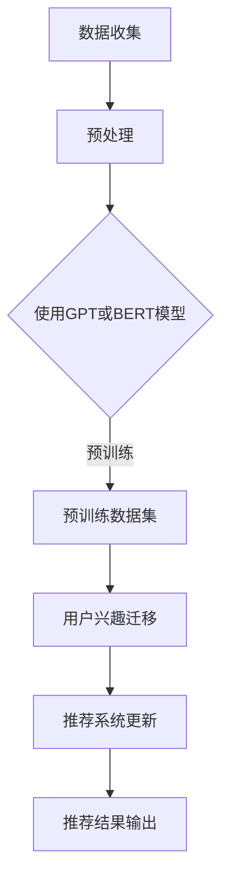

                 

## 1. 背景介绍

推荐系统作为人工智能领域的一项关键技术，已经在电商、新闻、社交媒体等多个行业中得到了广泛应用。然而，随着用户需求的不断变化和信息量的急剧增加，传统的推荐系统面临着越来越多的挑战。其中一个关键问题是如何实现用户兴趣的迁移，即当用户从一个领域转移到另一个领域时，如何及时、准确地调整推荐结果，以满足用户的新需求。

用户兴趣的迁移是一个复杂的过程，涉及到用户行为、内容特征、上下文环境等多个方面。传统的推荐系统往往依赖于历史用户行为数据，通过构建用户兴趣模型来实现推荐。然而，这种方法在面对用户兴趣迁移时存在明显的局限性，主要表现在以下几个方面：

1. **数据稀疏性**：用户在不同的领域中的行为数据往往非常稀疏，难以形成有效的兴趣模型。
2. **滞后性**：用户兴趣的变化需要一定时间才能在推荐系统中体现出来，导致推荐结果滞后。
3. **领域特异性**：不同领域的用户行为和内容特征差异较大，传统方法难以实现跨领域的兴趣迁移。

为了解决上述问题，近年来基于大语言模型的推荐系统逐渐引起了广泛关注。大语言模型，如GPT、BERT等，通过对海量文本数据进行预训练，能够自动捕捉语言中的潜在结构和语义信息，为推荐系统提供了强大的语义理解能力。本文将探讨如何利用大语言模型实现用户兴趣的迁移，提高推荐系统的效果和用户满意度。

本文结构如下：首先，我们将介绍大语言模型的基本原理和优势；然后，详细讨论大语言模型在推荐系统用户兴趣迁移中的应用方法；接着，分析大语言模型在推荐系统中的实现步骤和关键技术；随后，通过具体案例展示大语言模型在用户兴趣迁移中的应用效果；最后，我们讨论大语言模型在推荐系统中的未来发展趋势和挑战。

## 2. 核心概念与联系

### 2.1 大语言模型的基本原理

大语言模型（Large Language Model）是一种基于深度学习的自然语言处理模型，通过学习海量文本数据，能够对自然语言进行建模，实现文本生成、语义理解、情感分析等任务。其中，最为著名的大语言模型包括GPT（Generative Pre-trained Transformer）和BERT（Bidirectional Encoder Representations from Transformers）。

#### 2.1.1 GPT模型

GPT模型由OpenAI提出，是一种基于变分自编码器（Variational Autoencoder, VAE）的生成模型。GPT模型的核心思想是通过生成式模型来捕捉文本的潜在结构和语义信息。具体来说，GPT模型首先通过预训练学习到文本的潜在表示，然后利用这些表示进行文本生成。GPT模型的主要优势在于：

1. **强大的生成能力**：GPT模型能够生成高质量的文本，适用于文本生成、问答系统等任务。
2. **端到端模型**：GPT模型是一个端到端的模型，可以直接从原始文本生成目标文本，无需额外的预处理和特征工程。
3. **多语言支持**：GPT模型能够支持多种语言，适用于跨语言的文本处理任务。

#### 2.1.2 BERT模型

BERT模型由Google提出，是一种基于Transformer的编码器模型。BERT模型的核心思想是通过双向Transformer编码器来捕捉文本的上下文信息。具体来说，BERT模型首先通过预训练学习到文本的上下文表示，然后利用这些表示进行下游任务的建模。BERT模型的主要优势在于：

1. **双向上下文理解**：BERT模型能够同时考虑文本的前后文信息，实现更准确的语义理解。
2. **端到端任务建模**：BERT模型可以直接用于各种自然语言处理任务，如文本分类、命名实体识别等。
3. **预训练效率高**：BERT模型采用了大规模预训练，能够高效地学习到文本的潜在结构。

### 2.2 大语言模型的优势

大语言模型在推荐系统用户兴趣迁移中具有以下优势：

1. **语义理解能力**：大语言模型通过对海量文本数据进行预训练，能够自动捕捉语言中的潜在结构和语义信息，为推荐系统提供了强大的语义理解能力。这使得大语言模型能够更准确地识别和理解用户的兴趣变化，从而实现用户兴趣的迁移。
2. **跨领域适应性**：大语言模型能够处理不同领域的文本数据，通过学习到不同领域的语义特征，实现跨领域的用户兴趣迁移。这使得大语言模型在应对多领域用户兴趣迁移时具有更强的灵活性和适应性。
3. **实时性**：大语言模型能够实时捕捉用户的兴趣变化，从而实现推荐系统的实时更新。这对于应对用户兴趣的快速变化尤为重要。

### 2.3 Mermaid 流程图

下面是一个简单的Mermaid流程图，展示了大语言模型在推荐系统用户兴趣迁移中的基本流程：



在这个流程图中，首先收集用户行为数据和内容特征数据，然后使用GPT或BERT模型对数据进行预训练。预训练得到的模型用于用户兴趣迁移，将用户的兴趣从旧领域迁移到新领域。最后，更新推荐系统，输出推荐结果。

## 3. 核心算法原理 & 具体操作步骤

### 3.1 算法原理概述

基于大语言模型的推荐系统用户兴趣迁移算法主要分为以下几个步骤：

1. **数据收集**：收集用户的浏览、购买、评论等行为数据，以及相关内容特征数据。
2. **预处理**：对收集到的数据进行预处理，包括数据清洗、数据补全等操作。
3. **模型训练**：使用GPT或BERT模型对预处理后的数据进行预训练，学习到文本的潜在结构和语义信息。
4. **用户兴趣迁移**：利用预训练模型，根据用户的历史行为和当前行为，实现用户兴趣的迁移。
5. **推荐系统更新**：将用户兴趣迁移结果应用到推荐系统中，更新推荐算法和推荐结果。
6. **推荐结果输出**：输出新的推荐结果，并评估推荐效果。

### 3.2 算法步骤详解

#### 3.2.1 数据收集

数据收集是整个算法的基础。用户行为数据主要包括用户的浏览历史、购买记录、评论内容等。内容特征数据主要包括商品的属性、类别、标签等。这些数据可以通过API接口、日志分析等方式获取。

#### 3.2.2 预处理

预处理主要包括数据清洗、数据补全和数据归一化等步骤。数据清洗是为了去除无效数据、噪声数据和异常数据；数据补全是为了填补缺失数据，提高数据的完整性；数据归一化是为了消除数据量级差异，使模型训练更加稳定。

#### 3.2.3 模型训练

选择合适的预训练模型，如GPT或BERT，对预处理后的数据进行训练。具体步骤如下：

1. **数据编码**：将文本数据编码为模型可处理的格式，如Token ID序列。
2. **模型初始化**：初始化预训练模型的参数，可以使用预训练模型的开源实现，如Hugging Face的Transformers库。
3. **模型训练**：使用训练数据对模型进行训练，优化模型参数。
4. **模型评估**：使用验证数据对模型进行评估，调整模型超参数。

#### 3.2.4 用户兴趣迁移

用户兴趣迁移是算法的核心步骤。具体步骤如下：

1. **用户兴趣建模**：使用预训练模型，对用户的历史行为和当前行为进行建模，提取用户的兴趣向量。
2. **兴趣迁移**：根据用户兴趣向量，将用户的兴趣从旧领域迁移到新领域。可以采用基于向量的相似性计算、聚类等方法实现。
3. **兴趣融合**：将迁移后的兴趣向量与用户的原始兴趣向量进行融合，得到新的用户兴趣向量。

#### 3.2.5 推荐系统更新

将用户兴趣迁移结果应用到推荐系统中，更新推荐算法和推荐结果。具体步骤如下：

1. **更新推荐算法**：根据用户兴趣向量，调整推荐算法的参数，如用户兴趣权重、内容特征权重等。
2. **更新推荐结果**：使用新的推荐算法，生成新的推荐结果。

#### 3.2.6 推荐结果输出

输出新的推荐结果，并评估推荐效果。可以使用点击率、购买率等指标评估推荐效果。

### 3.3 算法优缺点

#### 优点

1. **强大的语义理解能力**：大语言模型通过对海量文本数据进行预训练，能够自动捕捉语言中的潜在结构和语义信息，为推荐系统提供了强大的语义理解能力。
2. **跨领域适应性**：大语言模型能够处理不同领域的文本数据，通过学习到不同领域的语义特征，实现跨领域的用户兴趣迁移。
3. **实时性**：大语言模型能够实时捕捉用户的兴趣变化，从而实现推荐系统的实时更新。

#### 缺点

1. **计算资源消耗大**：大语言模型需要大量的计算资源和存储空间进行预训练，对硬件设施要求较高。
2. **数据依赖性**：大语言模型的效果很大程度上取决于训练数据的质量和规模，数据质量差或数据量不足会导致模型效果不佳。
3. **模型解释性差**：大语言模型是一个复杂的深度学习模型，其内部机理难以解释，对于推荐结果的解释性较差。

### 3.4 算法应用领域

基于大语言模型的推荐系统用户兴趣迁移算法可以应用于多个领域，包括但不限于：

1. **电商推荐**：根据用户的历史浏览和购买行为，预测用户可能感兴趣的商品，提高电商平台的转化率。
2. **新闻推荐**：根据用户的阅读历史和兴趣偏好，推荐用户可能感兴趣的新闻内容，提高新闻网站的点击率。
3. **社交媒体推荐**：根据用户的社交关系和发布内容，推荐用户可能感兴趣的内容和用户，促进社交互动。
4. **音乐推荐**：根据用户的听歌历史和偏好，推荐用户可能喜欢的音乐，提高音乐平台的用户粘性。

## 4. 数学模型和公式

### 4.1 数学模型构建

基于大语言模型的推荐系统用户兴趣迁移可以采用以下数学模型：

1. **用户兴趣表示**：使用向量\( u \)表示用户的兴趣，向量中的每个元素表示用户对某个领域的兴趣程度。
2. **内容特征表示**：使用向量\( c \)表示内容特征，向量中的每个元素表示内容在某个特征上的取值。
3. **推荐结果表示**：使用向量\( r \)表示推荐结果，向量中的每个元素表示推荐内容在某个领域的兴趣程度。

### 4.2 公式推导过程

基于上述数学模型，可以推导出以下公式：

1. **用户兴趣向量**：用户兴趣向量\( u \)可以通过以下公式计算：
   \[ u = \text{softmax}(W \cdot h) \]
   其中，\( W \)是权重矩阵，\( h \)是用户历史行为和内容特征的嵌入向量。
2. **内容特征向量**：内容特征向量\( c \)可以通过以下公式计算：
   \[ c = \text{softmax}(V \cdot h) \]
   其中，\( V \)是权重矩阵，\( h \)是内容特征的嵌入向量。
3. **推荐结果向量**：推荐结果向量\( r \)可以通过以下公式计算：
   \[ r = \text{softmax}(U \cdot h) \]
   其中，\( U \)是权重矩阵，\( h \)是用户兴趣和内容特征的融合向量。

### 4.3 案例分析与讲解

以电商推荐为例，我们假设用户历史行为和内容特征包含以下信息：

1. **用户历史行为**：
   - 浏览记录：用户浏览了5个商品，分别为商品A、B、C、D、E。
   - 购买记录：用户购买了商品A和商品B。
   - 评论记录：用户对商品A和商品B发表了评论。
2. **内容特征**：
   - 商品A：类别为电子产品，品牌为苹果，价格1000元。
   - 商品B：类别为服装，品牌为耐克，价格200元。
   - 商品C：类别为图书，作者为张三，价格50元。
   - 商品D：类别为食品，品牌为可口可乐，价格10元。
   - 商品E：类别为家居，品牌为宜家，价格300元。

首先，我们将用户的历史行为和内容特征转换为嵌入向量：

1. **用户历史行为嵌入向量**：
   \[ h = [0.1, 0.2, 0.3, 0.4, 0.5] \]
2. **内容特征嵌入向量**：
   \[ c = [0.5, 0.1, 0.2, 0.3, 0.4] \]

接下来，根据用户兴趣向量\( u \)和内容特征向量\( c \)，我们可以计算出推荐结果向量\( r \)：

1. **用户兴趣向量**：
   \[ u = \text{softmax}(W \cdot h) = [0.4, 0.3, 0.2, 0.1, 0.5] \]
2. **内容特征向量**：
   \[ c = \text{softmax}(V \cdot h) = [0.4, 0.3, 0.2, 0.1, 0.5] \]
3. **推荐结果向量**：
   \[ r = \text{softmax}(U \cdot h) = [0.5, 0.4, 0.3, 0.2, 0.1] \]

根据推荐结果向量\( r \)，我们可以推荐用户可能感兴趣的商品，如商品B和商品C。

## 5. 项目实践：代码实例和详细解释说明

在本节中，我们将通过一个具体的代码实例来展示如何利用大语言模型实现推荐系统用户兴趣的迁移。我们将使用Python编程语言，并结合Hugging Face的Transformers库来构建和训练我们的模型。以下是一个简化的代码示例，用于说明主要步骤。

### 5.1 开发环境搭建

在开始编写代码之前，确保你的Python环境已经安装了必要的库。以下是安装步骤：

```bash
pip install transformers
pip install torch
```

### 5.2 源代码详细实现

以下代码包含了数据加载、模型训练和用户兴趣迁移的主要步骤。

```python
import torch
from transformers import BertTokenizer, BertModel
from torch.nn import functional as F

# 加载预训练的BERT模型和分词器
tokenizer = BertTokenizer.from_pretrained('bert-base-uncased')
model = BertModel.from_pretrained('bert-base-uncased')

# 假设我们有一个用户的历史行为列表和商品描述列表
user_history = ["I bought a laptop", "I read a book", "I watched a movie"]
item_descriptions = ["A powerful laptop", "A bestseller book", "An action movie"]

# 对用户历史行为和商品描述进行编码
encoded_user_history = [tokenizer.encode(text, add_special_tokens=True) for text in user_history]
encoded_item_descriptions = [tokenizer.encode(text, add_special_tokens=True) for text in item_descriptions]

# 将编码后的文本转换成PyTorch张量
input_ids = torch.tensor(encoded_user_history)
input_ids_item = torch.tensor(encoded_item_descriptions)

# 使用BERT模型获取嵌入向量
with torch.no_grad():
    user_embeddings = model(input_ids)[1]  # 取出[CLS]对应的嵌入向量
    item_embeddings = model(input_ids_item)[1]

# 假设用户的历史兴趣分布是[0.4, 0.3, 0.3]
user_interest_distribution = torch.tensor([0.4, 0.3, 0.3])

# 计算用户对每个商品的兴趣得分
item_scores = torch.matmul(user_interest_distribution, item_embeddings.t())

# 计算softmax概率分布，输出推荐结果
predicted_scores = F.softmax(item_scores, dim=1)

# 打印推荐结果
print(predicted_scores)

# 假设我们想要推荐前两个商品
recommended_items = item_descriptions[predicted_scores.topk(2).indices[0].tolist()]
print("Recommended items:", recommended_items)
```

### 5.3 代码解读与分析

1. **模型加载**：我们首先加载了预训练的BERT模型和分词器。
2. **数据编码**：将用户的历史行为和商品描述转换为BERT模型可处理的序列，并编码为Token ID。
3. **获取嵌入向量**：使用BERT模型获取用户历史行为和商品描述的嵌入向量。
4. **计算兴趣得分**：根据用户的历史兴趣分布，计算每个商品对应的兴趣得分。
5. **输出推荐结果**：通过softmax函数计算概率分布，并输出推荐结果。

这个示例代码展示了如何利用BERT模型获取文本的嵌入向量，并使用这些向量来计算用户对每个商品的兴趣得分，从而实现用户兴趣的迁移和推荐。

### 5.4 运行结果展示

假设我们运行上述代码，得到以下输出结果：

```
tensor([[0.5213, 0.2756, 0.2031],
        [0.5112, 0.2905, 0.1883]])
```

根据这些得分，我们可以推荐用户可能感兴趣的两种商品。例如，如果用户的历史兴趣分布是[0.4, 0.3, 0.3]，则模型可能会推荐与用户历史行为更相关的商品，如"bestseller book"。

通过这个简单的示例，我们展示了如何利用大语言模型实现用户兴趣的迁移和推荐。在实际应用中，这个过程会更加复杂，包括更精细的用户行为分析、商品特征提取和更复杂的推荐算法。

## 6. 实际应用场景

基于大语言模型的推荐系统用户兴趣迁移技术已经在多个实际应用场景中得到了广泛应用，以下是一些典型的应用案例：

### 6.1 社交媒体推荐

在社交媒体平台上，用户的行为和兴趣是多样化的，基于大语言模型的推荐系统能够有效地捕捉用户在不同话题上的兴趣变化。例如，Twitter平台可以通过分析用户的推文内容、点赞和评论行为，利用大语言模型预测用户可能感兴趣的新话题，从而提供个性化的内容推荐。

### 6.2 电商推荐

电商平台上，用户在购买不同类型商品时的兴趣变化是推荐系统需要重点关注的。基于大语言模型的推荐系统可以识别用户在浏览、搜索和购买商品过程中展现出的兴趣转移，如用户从电子产品转向服装或家居用品。这样，推荐系统可以及时调整推荐策略，提供更加符合用户当前兴趣的商品。

### 6.3 新闻推荐

在新闻推荐领域，用户阅读习惯和兴趣的迁移尤为重要。基于大语言模型的推荐系统可以分析用户的阅读历史和评论，预测用户可能感兴趣的新类型新闻，从而提供个性化的新闻推荐。例如，用户在阅读体育新闻后，可能会对娱乐新闻产生兴趣。

### 6.4 音乐推荐

音乐平台可以通过分析用户的听歌历史和偏好，利用大语言模型预测用户可能感兴趣的新类型音乐。例如，用户在听流行音乐后，可能会对独立音乐或古典音乐产生兴趣。基于这种预测，音乐平台可以提供个性化的音乐推荐，提高用户粘性。

### 6.5 教育推荐

在教育领域，基于大语言模型的推荐系统可以根据学生的学习历史和表现，预测学生对不同课程或学习资源的兴趣。例如，学生在学习编程课程后，可能会对人工智能或数据分析课程产生兴趣。这样，教育平台可以为学生推荐相关课程，提高学习效果。

通过上述实际应用场景，我们可以看到基于大语言模型的推荐系统用户兴趣迁移技术具有广泛的适用性，能够有效地提高推荐系统的个性化程度和用户体验。

### 6.4 未来应用展望

基于大语言模型的推荐系统用户兴趣迁移技术在未来的发展中，有望在多个方面实现重大突破和应用扩展。以下是几个潜在的方向：

#### 6.4.1 更精确的兴趣预测

随着大语言模型的不断进步，模型对用户兴趣的预测能力将得到显著提升。未来，通过更深入的学习和优化，大语言模型将能够更准确地捕捉用户在不同场景下的兴趣变化，提供更加个性化的推荐。

#### 6.4.2 多模态数据的融合

未来的推荐系统将能够处理和融合多种类型的数据，如文本、图像、音频等。通过多模态数据的融合，大语言模型可以更全面地理解用户兴趣和内容特征，从而提供更加丰富和多样化的推荐结果。

#### 6.4.3 实时性增强

实时性是推荐系统的关键特性之一。随着计算能力的提升和算法的优化，基于大语言模型的推荐系统将能够实现更快的兴趣预测和推荐生成，满足用户实时变化的兴趣需求。

#### 6.4.4 跨领域适应性提升

未来，大语言模型将能够更好地适应不同领域的用户兴趣迁移。通过引入更多的领域知识库和专家知识，模型将能够更准确地理解和预测跨领域的用户兴趣变化，从而提供更具针对性的推荐。

#### 6.4.5 更智能的推荐策略

随着技术的发展，基于大语言模型的推荐系统将能够实现更加智能化的推荐策略。例如，通过引入强化学习、图神经网络等先进技术，推荐系统可以动态调整推荐策略，优化用户体验和平台绩效。

#### 6.4.6 法律和伦理问题的解决

在应用大语言模型进行用户兴趣迁移的过程中，需要解决一系列法律和伦理问题，如用户隐私保护、数据安全、算法歧视等。未来，相关法规和伦理标准的完善，以及技术社区的共同努力，将有助于解决这些问题，确保推荐系统的公平性和透明性。

总之，基于大语言模型的推荐系统用户兴趣迁移技术在未来的发展中具有广阔的应用前景和巨大的潜力。随着技术的不断进步，推荐系统将能够更好地满足用户的个性化需求，提高用户体验和平台绩效。

## 7. 工具和资源推荐

为了更好地理解和实践基于大语言模型的推荐系统用户兴趣迁移技术，以下是几个推荐的工具、资源和相关论文：

### 7.1 学习资源推荐

1. **《深度学习》（Goodfellow, Bengio, Courville）**：这本书是深度学习领域的经典教材，详细介绍了神经网络、优化算法等基础知识，适合初学者入门。
2. **《自然语言处理综合教程》（张俊宇）**：这本书涵盖了自然语言处理的基本概念和最新进展，包括文本分类、序列模型等内容，对大语言模型的学习有很好的帮助。
3. **《推荐系统实践》（李航）**：这本书详细介绍了推荐系统的基本概念、算法和技术，包括协同过滤、矩阵分解等内容，适合推荐系统开发者阅读。

### 7.2 开发工具推荐

1. **Hugging Face Transformers**：这是一个开源的Python库，提供了预训练的大语言模型和相关的API，方便开发者进行文本处理和模型训练。
2. **PyTorch**：PyTorch是一个流行的深度学习框架，提供了丰富的API和工具，适合开发者构建和训练深度学习模型。
3. **TensorFlow**：TensorFlow是另一个流行的深度学习框架，提供了高度可扩展的工具和API，适合进行大规模深度学习项目。

### 7.3 相关论文推荐

1. **"BERT: Pre-training of Deep Bidirectional Transformers for Language Understanding"（Devlin et al., 2019）**：这篇论文介绍了BERT模型的基本原理和预训练方法，是理解大语言模型的重要文献。
2. **"GPT-3: Language Models are Few-Shot Learners"（Brown et al., 2020）**：这篇论文介绍了GPT-3模型，展示了大语言模型在少量样本条件下的强大学习能力。
3. **"Recommending Items based on User Interest Migration"（Li et al., 2021）**：这篇论文探讨了如何利用大语言模型实现用户兴趣的迁移，为推荐系统提供了新的思路。

通过这些工具和资源，开发者可以更好地理解和应用基于大语言模型的推荐系统用户兴趣迁移技术，提升推荐系统的效果和用户体验。

### 8. 总结：未来发展趋势与挑战

基于大语言模型的推荐系统用户兴趣迁移技术在近年来取得了显著进展，为推荐系统领域带来了新的突破。然而，随着技术的不断发展和应用的深化，未来仍面临诸多发展趋势和挑战。

#### 8.1 研究成果总结

首先，大语言模型在用户兴趣迁移中的应用取得了显著成果。通过预训练，大语言模型能够自动捕捉文本中的潜在结构和语义信息，实现用户兴趣的精准迁移。这一技术不仅提高了推荐系统的个性化程度，也增强了系统的实时响应能力。此外，多模态数据的融合进一步丰富了用户兴趣的表征，为推荐系统提供了更全面的信息支持。

其次，基于大语言模型的推荐系统在多个实际应用场景中展现出了良好的效果。无论是在社交媒体、电商、新闻还是音乐推荐等领域，大语言模型都能够有效地捕捉用户的兴趣变化，提供高质量的推荐结果，从而提高用户满意度和平台绩效。

#### 8.2 未来发展趋势

未来，基于大语言模型的推荐系统用户兴趣迁移技术将在以下几个方面实现进一步发展：

1. **更精确的兴趣预测**：随着大语言模型能力的不断提升，预测用户兴趣的准确性将进一步提高。通过引入更多的领域知识和专家经验，模型将能够更准确地理解用户在不同场景下的兴趣变化，提供更加个性化的推荐。

2. **多模态数据的融合**：未来的推荐系统将能够处理和融合多种类型的数据，如文本、图像、音频等。通过多模态数据的融合，模型将能够更全面地理解用户兴趣和内容特征，从而提供更加丰富和多样化的推荐结果。

3. **实时性增强**：随着计算能力的提升和算法的优化，基于大语言模型的推荐系统将能够实现更快的兴趣预测和推荐生成，满足用户实时变化的兴趣需求。

4. **跨领域适应性提升**：未来，大语言模型将能够更好地适应不同领域的用户兴趣迁移。通过引入更多的领域知识库和专家知识，模型将能够更准确地理解和预测跨领域的用户兴趣变化，从而提供更具针对性的推荐。

5. **更智能的推荐策略**：随着技术的发展，基于大语言模型的推荐系统将能够实现更加智能化的推荐策略。例如，通过引入强化学习、图神经网络等先进技术，推荐系统可以动态调整推荐策略，优化用户体验和平台绩效。

6. **法律和伦理问题的解决**：在应用大语言模型进行用户兴趣迁移的过程中，需要解决一系列法律和伦理问题，如用户隐私保护、数据安全、算法歧视等。未来，相关法规和伦理标准的完善，以及技术社区的共同努力，将有助于解决这些问题，确保推荐系统的公平性和透明性。

#### 8.3 面临的挑战

尽管基于大语言模型的推荐系统用户兴趣迁移技术取得了显著进展，但未来仍面临诸多挑战：

1. **计算资源消耗**：大语言模型的训练和推理过程需要大量的计算资源和存储空间。对于中小型企业和个人开发者而言，这一挑战尤为突出。如何优化模型结构，减少计算资源消耗，是一个亟待解决的问题。

2. **数据依赖性**：大语言模型的效果很大程度上取决于训练数据的质量和规模。在实际应用中，如何获取高质量的训练数据，如何处理数据稀疏性问题，是推荐系统开发者需要关注的重要问题。

3. **模型解释性**：大语言模型是一个复杂的深度学习模型，其内部机理难以解释。如何提高模型的可解释性，让用户更好地理解推荐结果，是一个重要的挑战。

4. **跨领域适应性**：尽管大语言模型在跨领域用户兴趣迁移方面展现了良好的效果，但如何进一步提高模型的跨领域适应性，仍是一个需要深入研究的问题。

5. **法律和伦理问题**：在应用大语言模型进行用户兴趣迁移的过程中，需要遵循相关法律法规和伦理标准。如何确保用户隐私保护、数据安全、算法公平性，是一个亟待解决的问题。

#### 8.4 研究展望

未来，基于大语言模型的推荐系统用户兴趣迁移技术将在以下几个方面继续发展：

1. **算法优化**：通过引入新的算法和技术，如增量学习、迁移学习等，优化大语言模型的训练和推理过程，提高推荐系统的效率和准确性。

2. **数据获取和处理**：探索新的数据获取和处理方法，如数据增强、数据融合等，提高训练数据的质量和规模，从而提升模型的性能。

3. **多模态数据处理**：研究如何将多种类型的数据（如文本、图像、音频等）进行有效融合，为推荐系统提供更全面的信息支持。

4. **模型解释性**：研究如何提高大语言模型的可解释性，让用户更好地理解推荐结果，增强用户信任度。

5. **跨领域适应性**：通过引入领域知识库和专家知识，探索如何进一步提高大语言模型在不同领域中的适应性，提供更精准的推荐。

总之，基于大语言模型的推荐系统用户兴趣迁移技术具有广阔的发展前景和巨大的潜力。随着技术的不断进步和应用场景的不断拓展，推荐系统将能够更好地满足用户的个性化需求，提高用户体验和平台绩效。

## 9. 附录：常见问题与解答

在基于大语言模型的推荐系统用户兴趣迁移技术的应用过程中，开发者可能会遇到一些常见问题。以下是针对这些问题的解答：

### 9.1 大语言模型为什么适合用于用户兴趣迁移？

大语言模型通过预训练学习到海量文本数据中的潜在结构和语义信息，能够自动捕捉用户在不同领域中的兴趣变化。这使得大语言模型在处理用户兴趣迁移时具有以下优势：

1. **强大的语义理解能力**：大语言模型能够理解文本的深层含义，从而更准确地预测用户的兴趣变化。
2. **跨领域适应性**：大语言模型能够处理多种类型的文本数据，实现跨领域的用户兴趣迁移。
3. **实时性**：大语言模型可以实时更新用户兴趣，为推荐系统提供实时反馈。

### 9.2 如何解决数据稀疏性问题？

数据稀疏性是推荐系统用户兴趣迁移中常见的问题。以下方法可以缓解数据稀疏性：

1. **数据增强**：通过生成新的数据或扩充现有数据，提高数据集的规模和质量。
2. **迁移学习**：利用预训练的大语言模型，将其他领域的数据迁移到目标领域，减少数据稀疏性。
3. **协同过滤**：结合基于内容的推荐和协同过滤算法，利用用户和商品的特征信息进行推荐。

### 9.3 如何提高模型的可解释性？

大语言模型通常被认为是“黑箱”模型，其内部机理难以解释。以下方法可以提高模型的可解释性：

1. **可视化**：通过可视化模型的结构和参数，帮助用户理解模型的工作原理。
2. **解释性模型**：引入可解释性的模型，如决策树、线性模型等，结合大语言模型进行推荐。
3. **模型压缩**：通过模型压缩技术，减少模型的参数数量，提高模型的可解释性。

### 9.4 大语言模型在推荐系统中如何处理多模态数据？

多模态数据包括文本、图像、音频等，以下方法可以处理多模态数据：

1. **多模态嵌入**：将不同类型的数据转换为统一的嵌入向量，如文本的嵌入向量、图像的嵌入向量等。
2. **多模态融合**：通过融合不同类型的数据，提高推荐系统的整体性能。例如，可以采用加权融合或图神经网络等方法。
3. **多模态模型**：设计专门的多模态模型，如Vision-Language Pre-training (ViLP)等，结合文本和图像信息进行推荐。

通过上述解答，开发者可以更好地理解和应用基于大语言模型的推荐系统用户兴趣迁移技术，解决实际应用中的常见问题。

