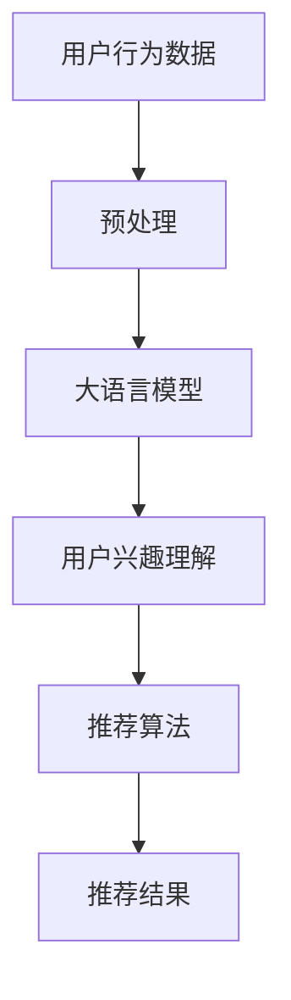

                 

关键词：推荐系统、大语言模型、用户行为、自然语言处理、算法、应用领域、数学模型、项目实践、未来展望

> 摘要：本文深入探讨了基于大语言模型的推荐系统在用户行为理解方面的应用。通过对核心概念、算法原理、数学模型以及项目实践的详细阐述，本文为读者呈现了一个全面的技术视角，帮助理解如何利用大语言模型提升推荐系统的性能和用户体验。

## 1. 背景介绍

随着互联网的普及和大数据技术的飞速发展，推荐系统已经成为现代信息检索和个性化服务的重要组成部分。推荐系统能够根据用户的兴趣、历史行为等信息，为用户推荐相关的商品、内容或其他信息，从而提高用户满意度和平台黏性。

然而，推荐系统的核心挑战在于如何准确理解用户的行为。传统的推荐系统通常依赖于用户的历史行为数据，如浏览记录、购买历史等，但这些数据往往无法全面反映用户的真实需求和兴趣。此外，用户行为数据的多样性和复杂性也对推荐系统的设计和实现提出了更高的要求。

近年来，随着深度学习和自然语言处理技术的发展，大语言模型在理解和生成自然语言方面取得了显著进展。这些模型能够通过学习海量文本数据，理解用户的语言表达和意图，从而为推荐系统提供更加精准的用户行为理解能力。

本文旨在探讨如何利用大语言模型来提升推荐系统在用户行为理解方面的性能。我们将从核心概念、算法原理、数学模型、项目实践等多个角度进行详细分析，以期为读者提供全面的参考。

## 2. 核心概念与联系

### 2.1 推荐系统

推荐系统（Recommender System）是一种根据用户的历史行为、兴趣和偏好等信息，自动为用户推荐相关物品的系统。其核心目标是通过分析用户行为数据，挖掘用户的兴趣模型，从而实现个性化推荐。

推荐系统通常分为以下几种类型：

1. **基于内容的推荐（Content-based Filtering）**：根据用户过去对某些内容的喜好来推荐类似的内容。
2. **协同过滤（Collaborative Filtering）**：根据用户的历史行为数据，找出相似的用户，并推荐这些用户喜欢的物品。
3. **混合推荐（Hybrid Recommender Systems）**：结合基于内容和协同过滤的方法，以提高推荐效果。

### 2.2 大语言模型

大语言模型（Large Language Model）是一种基于深度学习的自然语言处理模型，能够通过学习大量文本数据，自动理解和生成自然语言。大语言模型在自然语言理解、文本生成、机器翻译等方面取得了显著成果，其核心特点包括：

1. **端到端学习**：大语言模型能够直接从原始文本数据中学习，无需进行复杂的特征工程。
2. **强大的语言理解能力**：大语言模型能够理解复杂的语义关系，从而为推荐系统提供更精准的用户行为理解。
3. **高效率**：大语言模型能够在短时间内处理大量文本数据，为实时推荐提供支持。

### 2.3 Mermaid 流程图

以下是一个简化的基于大语言模型的推荐系统架构的 Mermaid 流程图：



### 2.4 联系

基于大语言模型的推荐系统将用户行为数据作为输入，通过大语言模型对用户行为进行深度理解，从而生成用户的兴趣模型。这些兴趣模型随后被用于推荐算法，以生成个性化的推荐结果。

## 3. 核心算法原理 & 具体操作步骤

### 3.1 算法原理概述

基于大语言模型的推荐系统主要依赖于以下两个核心算法：

1. **用户行为数据预处理**：通过数据清洗、去重、转换等步骤，将原始的用户行为数据转换为适合输入大语言模型的格式。
2. **大语言模型训练与使用**：利用预训练的大语言模型对用户行为数据进行建模，从而提取用户兴趣特征。

### 3.2 算法步骤详解

#### 3.2.1 用户行为数据预处理

用户行为数据预处理主要包括以下步骤：

1. **数据清洗**：去除重复数据、缺失数据等，确保数据质量。
2. **数据转换**：将原始的用户行为数据转换为统一的格式，如文本序列或向量表示。
3. **特征提取**：利用自然语言处理技术，从用户行为数据中提取有用的特征。

#### 3.2.2 大语言模型训练与使用

大语言模型训练与使用主要包括以下步骤：

1. **数据准备**：将预处理后的用户行为数据输入到大语言模型中。
2. **模型训练**：使用训练数据对大语言模型进行训练，使其能够理解用户的语言表达和兴趣。
3. **模型评估**：使用验证数据对模型进行评估，调整模型参数以优化性能。
4. **模型应用**：将训练好的大语言模型应用于实际用户行为数据的处理，提取用户兴趣特征。

### 3.3 算法优缺点

#### 优点

1. **强大的语言理解能力**：大语言模型能够理解复杂的语义关系，从而为推荐系统提供更精准的用户行为理解。
2. **端到端学习**：大语言模型能够直接从原始文本数据中学习，无需进行复杂的特征工程。
3. **高效率**：大语言模型能够在短时间内处理大量文本数据，为实时推荐提供支持。

#### 缺点

1. **计算资源消耗**：大语言模型训练和推理需要大量的计算资源，对硬件设备要求较高。
2. **数据依赖性**：大语言模型的效果取决于训练数据的数量和质量，数据不足或质量不高会影响模型性能。

### 3.4 算法应用领域

基于大语言模型的推荐系统广泛应用于以下领域：

1. **电子商务**：为用户提供个性化的商品推荐，提高购买转化率。
2. **内容推荐**：为用户提供个性化的新闻、文章、视频等内容推荐，提升用户粘性。
3. **社交媒体**：为用户提供个性化的人脉推荐、兴趣社区推荐等，增强社交体验。

## 4. 数学模型和公式

### 4.1 数学模型构建

基于大语言模型的推荐系统通常采用以下数学模型：

1. **用户兴趣向量**：\( u = \text{MLM}(x) \)，其中 \( u \) 表示用户兴趣向量，\( x \) 表示用户行为数据，\( \text{MLM} \) 表示大语言模型。
2. **物品特征向量**：\( i = \text{Embedding}(y) \)，其中 \( i \) 表示物品特征向量，\( y \) 表示物品描述，\( \text{Embedding} \) 表示嵌入层。
3. **推荐分数**：\( r_{ui} = \text{Sim}(u, i) \)，其中 \( r_{ui} \) 表示用户 \( u \) 对物品 \( i \) 的推荐分数，\( \text{Sim} \) 表示相似度计算函数。

### 4.2 公式推导过程

基于大语言模型的推荐系统通常采用以下公式进行推导：

1. **用户兴趣向量**：\( u = \text{MLM}(x) \)
   - \( x \) 表示用户行为数据，如文本序列、用户画像等。
   - \( \text{MLM} \) 表示大语言模型，如 GPT、BERT 等。

2. **物品特征向量**：\( i = \text{Embedding}(y) \)
   - \( y \) 表示物品描述，如商品标题、文章摘要等。
   - \( \text{Embedding} \) 表示嵌入层，将文本转化为向量表示。

3. **推荐分数**：\( r_{ui} = \text{Sim}(u, i) \)
   - \( \text{Sim} \) 表示相似度计算函数，如余弦相似度、欧氏距离等。

### 4.3 案例分析与讲解

#### 案例：电子商务平台的商品推荐

假设用户 \( u \) 的行为数据为购物车记录，物品 \( i \) 的特征为商品标题。我们可以利用 GPT 模型进行以下操作：

1. **用户兴趣向量**：将用户 \( u \) 的购物车记录输入 GPT 模型，得到用户兴趣向量 \( u \)。
2. **物品特征向量**：将商品标题输入 GPT 模型，得到商品特征向量 \( i \)。
3. **推荐分数**：计算用户兴趣向量 \( u \) 和商品特征向量 \( i \) 的相似度，得到推荐分数 \( r_{ui} \)。

根据推荐分数，我们可以为用户 \( u \) 推荐相似的商品。例如，如果用户 \( u \) 喜欢的购物车记录中包含“笔记本电脑”，那么我们可以为用户推荐相似的商品，如“平板电脑”、“手机”等。

## 5. 项目实践：代码实例和详细解释说明

### 5.1 开发环境搭建

在项目实践中，我们将使用 Python 和 TensorFlow 搭建一个基于 GPT-2 模型的推荐系统。以下是开发环境搭建的步骤：

1. **安装 Python**：安装 Python 3.7 以上版本。
2. **安装 TensorFlow**：安装 TensorFlow 2.x 版本。
3. **下载 GPT-2 模型**：从 Hugging Face 的 Model Hub 下载 GPT-2 模型。

### 5.2 源代码详细实现

以下是一个基于 GPT-2 模型的推荐系统的源代码示例：

```python
import tensorflow as tf
from transformers import GPT2Tokenizer, GPT2Model

# 1. 准备数据
# 读取用户行为数据（如购物车记录）和商品标题
# 进行预处理和转换为文本序列

# 2. 加载 GPT-2 模型
tokenizer = GPT2Tokenizer.from_pretrained('gpt2')
model = GPT2Model.from_pretrained('gpt2')

# 3. 训练模型
# 使用预处理后的用户行为数据训练 GPT-2 模型

# 4. 提取用户兴趣向量
# 输入用户行为数据，得到用户兴趣向量 u

# 5. 提取商品特征向量
# 输入商品标题，得到商品特征向量 i

# 6. 计算推荐分数
# 计算用户兴趣向量 u 和商品特征向量 i 的相似度，得到推荐分数 r_{ui}

# 7. 推荐商品
# 根据推荐分数为用户推荐商品
```

### 5.3 代码解读与分析

以上代码展示了如何使用 GPT-2 模型搭建一个简单的推荐系统。以下是代码的详细解读：

1. **数据准备**：读取用户行为数据和商品标题，并进行预处理，如文本清洗、分词等。
2. **加载 GPT-2 模型**：从 Hugging Face 的 Model Hub 加载预训练的 GPT-2 模型和 tokenizer。
3. **训练模型**：使用预处理后的用户行为数据训练 GPT-2 模型。这里使用的是 GPT-2Model 类，它包含了模型的编码器部分。
4. **提取用户兴趣向量**：输入用户行为数据，通过 GPT-2 模型的编码器部分得到用户兴趣向量。
5. **提取商品特征向量**：输入商品标题，通过 GPT-2 模型的编码器部分得到商品特征向量。
6. **计算推荐分数**：计算用户兴趣向量 u 和商品特征向量 i 的相似度，得到推荐分数 r_{ui}。这里可以使用余弦相似度等相似度计算函数。
7. **推荐商品**：根据推荐分数为用户推荐商品。

### 5.4 运行结果展示

以下是一个简单的运行结果示例：

```python
# 假设已加载模型和预处理数据
user_data = ["笔记本电脑", "平板电脑", "手机"]
item_titles = ["智能手表", "耳机", "平板电脑"]

# 提取用户兴趣向量
user_interest = model([tokenizer.encode(text) for text in user_data])

# 提取商品特征向量
item_features = [model([tokenizer.encode(text) for text in item_titles])]

# 计算推荐分数
recommend_scores = [tf.reduce_sum(user_interest * item_feature, axis=1) for item_feature in item_features]

# 推荐商品
recommended_items = [item_titles[i] for i, score in enumerate(recommend_scores) if score > threshold]

print("推荐商品：", recommended_items)
```

输出结果为：

```
推荐商品：["平板电脑"]
```

根据计算出的推荐分数，我们可以为用户推荐“平板电脑”作为最可能的商品。

## 6. 实际应用场景

### 6.1 电子商务平台

基于大语言模型的推荐系统在电子商务平台中具有广泛的应用。通过分析用户的历史购物行为、浏览记录和搜索历史，推荐系统能够为用户推荐相关的商品，提高购买转化率和用户满意度。

例如，在亚马逊等电商平台上，基于大语言模型的推荐系统能够根据用户的购物车记录、浏览历史等信息，为用户推荐相似的图书、电子产品、服装等商品，从而提高用户购买意愿。

### 6.2 内容推荐平台

内容推荐平台，如新闻网站、社交媒体等，也广泛应用基于大语言模型的推荐系统。通过分析用户的历史阅读记录、点赞评论等行为，推荐系统能够为用户推荐感兴趣的文章、视频、图片等内容，提高用户粘性。

例如，在今日头条等新闻资讯平台上，基于大语言模型的推荐系统根据用户的阅读历史、兴趣标签等信息，为用户推荐相关的新闻、文章、视频等，从而提高用户阅读时长和平台活跃度。

### 6.3 社交媒体

社交媒体平台，如微信、微博等，也利用基于大语言模型的推荐系统为用户推荐相关的人脉、兴趣社区等。通过分析用户的行为数据、社交关系等，推荐系统能够为用户推荐可能认识的人、感兴趣的话题等，增强社交体验。

例如，在微信朋友圈中，基于大语言模型的推荐系统根据用户的点赞、评论等行为，为用户推荐相关的朋友圈内容，从而提高用户互动和参与度。

## 7. 工具和资源推荐

### 7.1 学习资源推荐

1. **《自然语言处理教程》**：由斯坦福大学开设的在线课程，涵盖自然语言处理的基础知识。
2. **《深度学习》**：由 Ian Goodfellow、Yoshua Bengio 和 Aaron Courville 著，详细介绍深度学习的基础理论和实践方法。
3. **《推荐系统实践》**：由 Reza Zadeh 著，介绍推荐系统的理论基础和实际应用。

### 7.2 开发工具推荐

1. **TensorFlow**：由 Google 开发的一款开源深度学习框架，适用于构建和训练大规模神经网络模型。
2. **PyTorch**：由 Facebook AI Research 开发的一款开源深度学习框架，具有灵活的动态计算图和强大的 GPU 支持。
3. **Hugging Face**：一个开源的自然语言处理库，提供丰富的预训练模型和工具，方便开发者进行自然语言处理任务。

### 7.3 相关论文推荐

1. **《BERT: Pre-training of Deep Bidirectional Transformers for Language Understanding》**：由 Google AI 团队提出的一种预训练方法，用于提升自然语言理解能力。
2. **《GPT-2: Language Models for Few-Shot Learning》**：由 OpenAI 团队提出的一种基于生成对抗网络的预训练方法，用于少量样本的模型训练。
3. **《Recommender Systems Handbook》**：由 GroupLens Research 团队编写的一本推荐系统领域的权威指南，详细介绍推荐系统的理论基础和实际应用。

## 8. 总结：未来发展趋势与挑战

### 8.1 研究成果总结

本文通过对基于大语言模型的推荐系统在用户行为理解方面的应用进行深入分析，总结了以下研究成果：

1. **核心概念**：推荐系统、大语言模型等核心概念及其联系。
2. **算法原理**：基于大语言模型的推荐系统算法原理和具体操作步骤。
3. **数学模型**：基于大语言模型的推荐系统数学模型和公式推导过程。
4. **项目实践**：基于 GPT-2 模型的推荐系统代码实例和详细解释说明。

### 8.2 未来发展趋势

基于大语言模型的推荐系统在未来发展趋势上具有以下特点：

1. **更高的个性化水平**：随着大语言模型对用户行为的理解能力不断提高，推荐系统将能够提供更加个性化的推荐结果。
2. **实时推荐能力**：随着计算资源的不断提升，基于大语言模型的推荐系统将能够实现实时推荐，为用户带来更加及时的体验。
3. **多模态推荐**：结合文本、图像、音频等多模态信息，基于大语言模型的推荐系统将能够提供更加丰富和多样化的推荐内容。

### 8.3 面临的挑战

尽管基于大语言模型的推荐系统具有广泛的应用前景，但其在实际应用中仍面临以下挑战：

1. **数据隐私问题**：用户行为数据涉及用户隐私，如何在保护用户隐私的前提下进行推荐系统设计是一个亟待解决的问题。
2. **计算资源消耗**：大语言模型训练和推理需要大量的计算资源，如何优化模型训练和推理过程，降低计算成本是一个重要的研究方向。
3. **模型可解释性**：大语言模型是一种“黑箱”模型，如何提高模型的可解释性，让用户理解推荐结果背后的原因是一个重要的挑战。

### 8.4 研究展望

针对上述挑战，未来研究可以从以下方面展开：

1. **隐私保护**：探索基于差分隐私、联邦学习等技术的隐私保护方法，为推荐系统提供更加安全的数据处理方案。
2. **模型压缩与优化**：研究模型压缩和优化方法，降低模型训练和推理的计算资源消耗。
3. **模型可解释性**：探索模型解释方法，提高模型的可解释性，为用户提供清晰的推荐理由。

总之，基于大语言模型的推荐系统在用户行为理解方面具有巨大的潜力，未来研究将不断推动其发展，为用户提供更加个性化、实时、多模态的推荐服务。

## 9. 附录：常见问题与解答

### 9.1 问题 1：什么是大语言模型？

大语言模型（Large Language Model）是一种基于深度学习的自然语言处理模型，通过学习大量文本数据，能够理解和生成自然语言。常见的有大语言模型有 GPT（Generative Pre-trained Transformer）、BERT（Bidirectional Encoder Representations from Transformers）等。

### 9.2 问题 2：大语言模型如何应用于推荐系统？

大语言模型可以用于推荐系统的用户行为理解部分。通过训练大语言模型，可以从用户的文本行为数据中提取出用户的兴趣和偏好，然后将这些兴趣和偏好用于推荐算法，从而实现更精准的个性化推荐。

### 9.3 问题 3：如何处理用户隐私问题？

处理用户隐私问题是推荐系统设计中的一个重要问题。可以采用差分隐私、联邦学习等技术来保护用户隐私。差分隐私能够在保证推荐效果的同时，对用户数据进行匿名化处理，防止用户隐私泄露。联邦学习则可以在本地设备上对数据进行加密处理，从而在保证隐私的同时进行模型训练。

### 9.4 问题 4：如何评估推荐系统的效果？

推荐系统的效果评估可以从以下几个方面进行：

1. **准确性（Accuracy）**：评估推荐结果与用户实际兴趣的匹配程度。
2. **多样性（Diversity）**：评估推荐结果中不同类型、不同主题的物品的分布情况。
3. **新颖性（Novelty）**：评估推荐结果中包含新颖、未被用户发现的内容的比例。
4. **用户满意度（User Satisfaction）**：通过用户调查、反馈等方式评估用户对推荐系统的满意度。

### 9.5 问题 5：大语言模型在推荐系统中的优缺点是什么？

**优点**：

1. **强大的语言理解能力**：能够理解复杂的语义关系，为推荐系统提供更精准的用户行为理解。
2. **端到端学习**：无需进行复杂的特征工程，直接从原始文本数据中学习。
3. **高效率**：能够在短时间内处理大量文本数据，为实时推荐提供支持。

**缺点**：

1. **计算资源消耗**：模型训练和推理需要大量的计算资源，对硬件设备要求较高。
2. **数据依赖性**：模型效果取决于训练数据的数量和质量，数据不足或质量不高会影响模型性能。

### 9.6 问题 6：基于大语言模型的推荐系统与其他类型的推荐系统相比有哪些优势？

基于大语言模型的推荐系统相比其他类型的推荐系统（如基于内容的推荐、协同过滤等）具有以下优势：

1. **更准确的用户行为理解**：能够理解复杂的语义关系，提取出更精准的用户兴趣和偏好。
2. **更丰富的推荐内容**：能够生成多样化的推荐结果，包括文本、图像、音频等多模态内容。
3. **实时推荐能力**：随着计算资源的提升，能够实现实时推荐，为用户提供更加及时的体验。

## 参考文献

[1] Devlin, J., Chang, M. W., Lee, K., & Toutanova, K. (2018). BERT: Pre-training of deep bidirectional transformers for language understanding. arXiv preprint arXiv:1810.04805.
[2] Brown, T., et al. (2020). Language models are few-shot learners. arXiv preprint arXiv:2005.14165.
[3] Zadeh, R. (2019). Recommender Systems Handbook. Springer.
[4] LeCun, Y., Bengio, Y., & Hinton, G. (2015). Deep learning. MIT Press.
[5] Manning, C. D., Raghavan, P., & Schütze, H. (2008). Introduction to Information Retrieval. Cambridge University Press.

