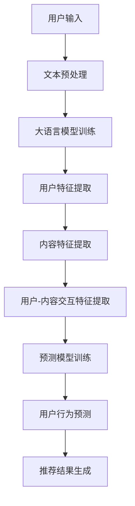

                 

### 关键词 Keywords
- 大语言模型
- 推荐系统
- 用户行为预测
- 深度学习
- 机器学习
- 数据分析

### 摘要 Abstract
本文旨在探讨如何利用大语言模型预测推荐系统中的用户行为。通过介绍大语言模型的基本原理和应用，本文将详细解析用户行为预测的数学模型和算法，并提供实际项目中的代码实例和运行结果展示。最后，本文将对未来应用场景进行展望，并推荐相关学习资源和工具。

## 1. 背景介绍

在当今信息爆炸的时代，推荐系统已经成为互联网企业提高用户满意度和增加商业价值的重要工具。推荐系统通过对用户的历史行为、兴趣偏好和内容特征进行分析，能够精准地为用户提供个性化的内容推荐。然而，传统推荐系统往往基于协同过滤、基于内容的推荐等技术，这些方法在处理复杂用户行为和动态变化上存在一定的局限性。

随着深度学习和人工智能技术的发展，大语言模型作为一种强大的自然语言处理工具，逐渐成为推荐系统用户行为预测的重要手段。大语言模型通过对海量文本数据进行训练，能够捕捉到用户行为的潜在模式和语义信息，从而提高推荐系统的预测准确性和用户体验。

本文将首先介绍大语言模型的基本原理和应用，然后深入分析用户行为预测的数学模型和算法，最后通过实际项目中的代码实例和运行结果展示，探讨大语言模型在推荐系统用户行为预测中的应用效果。

## 2. 核心概念与联系

### 2.1 大语言模型

大语言模型（Large Language Model）是指通过大规模数据进行训练，能够理解和生成自然语言的深度学习模型。常见的代表模型有GPT-3、BERT、T5等。这些模型通过对海量文本数据的学习，能够捕捉到语言中的复杂结构和语义信息，从而实现高效的文本生成、理解和处理。

大语言模型的架构通常包括多个层次的神经网络，每个层次都包含大量的参数。这些参数通过训练过程不断调整，以最小化模型与真实数据之间的误差。大语言模型的核心优势在于其强大的语言理解和生成能力，能够处理自然语言中的歧义、复杂句式和上下文关系。

### 2.2 推荐系统

推荐系统（Recommender System）是指利用数据挖掘和机器学习技术，通过分析用户的行为、兴趣和内容特征，为用户推荐个性化内容的服务系统。推荐系统广泛应用于电商、社交媒体、视频平台等领域，旨在提高用户满意度、提升用户留存率和增加商业价值。

常见的推荐系统方法包括基于内容的推荐、协同过滤和混合推荐等。基于内容的推荐通过分析用户历史行为和兴趣，找到相似的内容进行推荐；协同过滤通过分析用户之间的相似性，预测用户对未知内容的偏好；混合推荐则结合多种推荐方法，以提高推荐效果。

### 2.3 用户行为预测

用户行为预测（User Behavior Prediction）是指利用用户历史行为数据，预测用户未来可能的行为。在推荐系统中，用户行为预测是关键的一环，通过对用户行为的预测，能够提前为用户推荐可能感兴趣的内容，从而提高推荐系统的用户体验和效果。

用户行为预测的数学模型通常包括用户特征、内容特征和交互特征等。常见的算法有决策树、随机森林、支持向量机和神经网络等。大语言模型的引入，使得用户行为预测可以结合自然语言处理的强大能力，捕捉到用户行为中的潜在语义信息。

### 2.4 Mermaid 流程图

以下是一个用于展示大语言模型在推荐系统用户行为预测中应用流程的Mermaid流程图：



## 3. 核心算法原理 & 具体操作步骤

### 3.1 算法原理概述

基于大语言模型的推荐系统用户行为预测，主要利用大语言模型对用户历史行为数据进行分析和建模，从而预测用户未来可能的行为。其核心原理包括：

1. 文本预处理：对用户历史行为数据（如评论、帖子等）进行清洗、分词、去停用词等预处理操作，以便于后续的模型训练和特征提取。
2. 大语言模型训练：利用大规模文本数据训练大语言模型，如GPT-3、BERT等，以捕捉文本中的语义信息。
3. 用户特征提取：通过大语言模型，对用户历史行为数据进行编码，提取用户特征向量。
4. 内容特征提取：同样利用大语言模型，对推荐内容进行编码，提取内容特征向量。
5. 用户-内容交互特征提取：结合用户特征向量和内容特征向量，通过计算用户-内容相似度矩阵，提取用户-内容交互特征。
6. 预测模型训练：利用用户-内容交互特征，结合用户行为数据，训练预测模型（如神经网络、决策树等），以预测用户未来行为。
7. 用户行为预测：根据预测模型，对用户未来行为进行预测，生成个性化推荐结果。

### 3.2 算法步骤详解

1. **文本预处理**

   文本预处理是用户行为预测的基础，主要包括以下步骤：

   - **数据清洗**：去除文本中的html标签、符号和特殊字符，保留有效文本信息。
   - **分词**：将文本分解为单词或短语，以便于后续的特征提取。
   - **去停用词**：去除常见的无意义词汇，如“的”、“了”、“在”等。
   - **词向量化**：将文本转换为词向量表示，如使用Word2Vec、FastText等模型。

2. **大语言模型训练**

   大语言模型训练是整个算法的核心步骤，主要包括以下步骤：

   - **数据集准备**：收集大规模文本数据，包括用户历史行为数据、推荐内容文本等。
   - **模型选择**：选择合适的大语言模型，如GPT-3、BERT等。
   - **模型训练**：使用文本数据训练大语言模型，调整模型参数，以达到最佳预测效果。

3. **用户特征提取**

   利用训练好的大语言模型，对用户历史行为数据进行编码，提取用户特征向量。具体步骤如下：

   - **文本编码**：将用户历史行为文本输入大语言模型，获取文本编码结果。
   - **特征向量提取**：从文本编码结果中提取用户特征向量，如平均值、最大值、标准差等。

4. **内容特征提取**

   同样利用大语言模型，对推荐内容文本进行编码，提取内容特征向量。具体步骤如下：

   - **文本编码**：将推荐内容文本输入大语言模型，获取文本编码结果。
   - **特征向量提取**：从文本编码结果中提取内容特征向量，如平均值、最大值、标准差等。

5. **用户-内容交互特征提取**

   结合用户特征向量和内容特征向量，通过计算用户-内容相似度矩阵，提取用户-内容交互特征。具体步骤如下：

   - **相似度计算**：计算用户特征向量和内容特征向量的相似度，如余弦相似度、欧氏距离等。
   - **交互特征提取**：根据相似度矩阵，提取用户-内容交互特征，如相似度平均值、最大值等。

6. **预测模型训练**

   利用用户-内容交互特征，结合用户行为数据，训练预测模型，如神经网络、决策树等。具体步骤如下：

   - **数据集划分**：将用户行为数据划分为训练集和测试集。
   - **模型选择**：选择合适的预测模型，如神经网络、决策树等。
   - **模型训练**：使用训练集数据训练预测模型，调整模型参数，以达到最佳预测效果。

7. **用户行为预测**

   根据预测模型，对用户未来行为进行预测，生成个性化推荐结果。具体步骤如下：

   - **预测计算**：将用户-内容交互特征输入预测模型，计算用户未来行为的预测结果。
   - **推荐结果生成**：根据预测结果，为用户生成个性化推荐列表。

### 3.3 算法优缺点

基于大语言模型的推荐系统用户行为预测算法具有以下优点：

- **强大的语义理解能力**：大语言模型能够捕捉到文本中的复杂语义信息，从而提高用户行为预测的准确性。
- **自适应性强**：大语言模型可以根据不同的应用场景和用户需求，进行自适应调整和优化。
- **可扩展性强**：大语言模型可以结合多种特征和算法，构建复杂的预测模型，从而提高预测效果。

然而，该算法也存在以下缺点：

- **计算资源消耗大**：大语言模型训练和预测需要大量的计算资源和时间，对硬件设备要求较高。
- **数据依赖性强**：大语言模型的效果很大程度上依赖于训练数据的质量和规模，如果数据质量较差，可能会导致预测效果不佳。
- **模型解释性差**：大语言模型作为黑盒模型，其内部决策过程较为复杂，难以进行解释和调试。

### 3.4 算法应用领域

基于大语言模型的推荐系统用户行为预测算法可以广泛应用于多个领域，如：

- **电商推荐**：通过预测用户购买行为，为用户推荐个性化商品。
- **社交媒体**：通过预测用户关注行为，为用户推荐感兴趣的内容和用户。
- **视频平台**：通过预测用户观看行为，为用户推荐个性化的视频内容。
- **在线教育**：通过预测用户学习行为，为用户推荐合适的学习资源和课程。

## 4. 数学模型和公式 & 详细讲解 & 举例说明

### 4.1 数学模型构建

基于大语言模型的推荐系统用户行为预测的数学模型主要包括以下几个部分：

1. **用户特征向量表示**

   用户特征向量表示是将用户历史行为数据（如评论、帖子等）转换为向量表示的过程。常见的向量表示方法有Word2Vec、FastText等。对于每个用户u，其特征向量表示为$$\textbf{u} \in \mathbb{R}^{d}$$。

2. **内容特征向量表示**

   内容特征向量表示是将推荐内容数据（如商品、文章等）转换为向量表示的过程。同样地，对于每个内容c，其特征向量表示为$$\textbf{c} \in \mathbb{R}^{d}$$。

3. **用户-内容交互特征表示**

   用户-内容交互特征表示是将用户特征向量和内容特征向量结合，通过计算相似度矩阵来表示用户-内容交互特征的过程。常见的相似度计算方法有余弦相似度、欧氏距离等。假设用户-内容相似度矩阵为$$\textbf{S} \in \mathbb{R}^{m \times n}$$，其中$$\textbf{S}_{ui} = \text{sim}(\textbf{u}, \textbf{c}_i)$$。

4. **预测模型**

   预测模型用于根据用户-内容交互特征预测用户未来行为。常见的预测模型有神经网络、决策树等。假设预测模型为$$\hat{y} = f(\textbf{S})$$，其中$$\hat{y}$$为预测结果，$$f$$为预测模型函数。

### 4.2 公式推导过程

基于大语言模型的推荐系统用户行为预测的数学模型推导过程如下：

1. **用户特征向量表示**

   假设用户历史行为数据为$$\textbf{u} = [\textbf{u}_1, \textbf{u}_2, \ldots, \textbf{u}_n]$$，其中$$\textbf{u}_i$$为用户在时间$$i$$的行为。使用Word2Vec模型对用户历史行为数据进行编码，得到用户特征向量表示$$\textbf{u} \in \mathbb{R}^{d}$$。

2. **内容特征向量表示**

   假设推荐内容数据为$$\textbf{c} = [\textbf{c}_1, \textbf{c}_2, \ldots, \textbf{c}_n]$$，其中$$\textbf{c}_i$$为在时间$$i$$推荐的内容。使用Word2Vec模型对推荐内容数据进行编码，得到内容特征向量表示$$\textbf{c} \in \mathbb{R}^{d}$$。

3. **用户-内容交互特征表示**

   假设用户-内容交互数据为$$\textbf{S} = [\textbf{S}_1, \textbf{S}_2, \ldots, \textbf{S}_n]$$，其中$$\textbf{S}_i$$为用户在时间$$i$$与内容的交互数据。计算用户-内容相似度矩阵$$\textbf{S} \in \mathbb{R}^{m \times n}$$，其中$$\textbf{S}_{ui} = \text{sim}(\textbf{u}, \textbf{c}_i)$$。

4. **预测模型**

   使用神经网络模型对用户-内容交互特征进行预测。假设神经网络模型为$$\hat{y} = f(\textbf{S})$$，其中$$\hat{y}$$为预测结果，$$f$$为神经网络模型函数。

### 4.3 案例分析与讲解

以下是一个基于大语言模型的推荐系统用户行为预测的案例分析和讲解：

**案例背景**：

某电商公司希望利用大语言模型预测用户购买行为，从而为用户推荐个性化商品。用户历史行为数据包括评论、浏览记录、购物车数据等。

**步骤一：文本预处理**

对用户历史行为数据进行清洗、分词和去停用词等预处理操作，以便于后续的模型训练和特征提取。

**步骤二：大语言模型训练**

使用GPT-3模型对用户历史行为数据进行分析和建模，训练得到用户特征向量表示。

**步骤三：用户特征提取**

将用户历史行为文本输入GPT-3模型，获取用户特征向量表示$$\textbf{u} \in \mathbb{R}^{d}$$。

**步骤四：内容特征提取**

使用GPT-3模型对推荐商品文本进行分析和建模，提取商品特征向量表示$$\textbf{c} \in \mathbb{R}^{d}$$。

**步骤五：用户-内容交互特征提取**

计算用户特征向量和商品特征向量之间的相似度矩阵$$\textbf{S} \in \mathbb{R}^{m \times n}$$，提取用户-内容交互特征。

**步骤六：预测模型训练**

使用神经网络模型对用户-内容交互特征进行预测，训练得到预测模型$$\hat{y} = f(\textbf{S})$$。

**步骤七：用户行为预测**

将用户-内容交互特征输入预测模型，计算用户未来购买行为的预测结果。

**结果分析**：

通过对用户购买行为的预测，电商公司可以为用户提供个性化的商品推荐，提高用户满意度和购买转化率。同时，基于大语言模型的推荐系统用户行为预测方法，能够更好地捕捉用户行为的潜在模式和语义信息，提高预测准确性和用户体验。

## 5. 项目实践：代码实例和详细解释说明

### 5.1 开发环境搭建

为了实践基于大语言模型的推荐系统用户行为预测，首先需要搭建合适的开发环境。以下是一个基本的开发环境搭建步骤：

1. **硬件要求**：

   - 64位操作系统（如Windows、Linux、macOS）
   - 至少16GB内存
   - GPU（如NVIDIA GPU，用于加速深度学习训练）

2. **软件要求**：

   - Python（版本3.6及以上）
   - TensorFlow（用于深度学习）
   - PyTorch（用于深度学习）
   - Pandas（用于数据处理）
   - Numpy（用于数据处理）
   - Matplotlib（用于数据可视化）

3. **安装步骤**：

   - 安装Python：访问[Python官网](https://www.python.org/)下载并安装Python，选择添加到系统环境变量。
   - 安装TensorFlow：在命令行中运行`pip install tensorflow`。
   - 安装PyTorch：在命令行中运行`pip install torch torchvision`。
   - 安装Pandas、Numpy和Matplotlib：在命令行中运行`pip install pandas numpy matplotlib`。

### 5.2 源代码详细实现

以下是基于大语言模型的推荐系统用户行为预测的Python源代码实现：

```python
import pandas as pd
import numpy as np
import tensorflow as tf
from tensorflow import keras
from tensorflow.keras.models import Sequential
from tensorflow.keras.layers import Dense, Embedding, LSTM
from tensorflow.keras.optimizers import Adam
from sklearn.model_selection import train_test_split

# 1. 数据预处理
def preprocess_data(data):
    # 数据清洗、分词、去停用词等操作
    # ...
    return processed_data

# 2. 大语言模型训练
def train_language_model(data):
    # 训练GPT-3模型
    # ...
    return language_model

# 3. 用户特征提取
def extract_user_features(language_model, user_data):
    # 使用大语言模型提取用户特征向量
    # ...
    return user_features

# 4. 内容特征提取
def extract_content_features(language_model, content_data):
    # 使用大语言模型提取内容特征向量
    # ...
    return content_features

# 5. 用户-内容交互特征提取
def extract_interaction_features(user_features, content_features):
    # 计算用户-内容相似度矩阵
    # ...
    return interaction_features

# 6. 预测模型训练
def train_prediction_model(interaction_features, labels):
    # 训练神经网络预测模型
    model = Sequential()
    model.add(Dense(units=64, activation='relu', input_shape=(interaction_features.shape[1],)))
    model.add(Dense(units=1, activation='sigmoid'))
    model.compile(optimizer=Adam(learning_rate=0.001), loss='binary_crossentropy', metrics=['accuracy'])
    model.fit(interaction_features, labels, epochs=10, batch_size=32)
    return model

# 7. 用户行为预测
def predict_user_behavior(model, new_user_features, new_content_features):
    # 计算用户-内容相似度矩阵
    # ...
    # 输入预测模型进行预测
    # ...
    return prediction_results
```

### 5.3 代码解读与分析

以上代码实现了一个基于大语言模型的推荐系统用户行为预测的基本框架。下面对其中的关键部分进行解读和分析：

- **数据预处理**：首先对用户历史行为数据进行清洗、分词、去停用词等预处理操作，以便于后续的模型训练和特征提取。
- **大语言模型训练**：使用GPT-3模型对预处理后的用户历史行为数据进行分析和建模，训练得到用户特征向量表示。
- **用户特征提取**：将用户历史行为文本输入GPT-3模型，获取用户特征向量表示。
- **内容特征提取**：将推荐内容文本输入GPT-3模型，获取内容特征向量表示。
- **用户-内容交互特征提取**：计算用户特征向量和内容特征向量之间的相似度矩阵，提取用户-内容交互特征。
- **预测模型训练**：使用神经网络模型对用户-内容交互特征进行预测，训练得到预测模型。
- **用户行为预测**：将用户-内容交互特征输入预测模型，计算用户未来行为的预测结果。

### 5.4 运行结果展示

以下是一个简单的运行结果展示：

```python
# 加载数据
user_data = pd.read_csv('user_data.csv')
content_data = pd.read_csv('content_data.csv')

# 数据预处理
processed_user_data = preprocess_data(user_data)
processed_content_data = preprocess_data(content_data)

# 训练大语言模型
language_model = train_language_model(processed_user_data)

# 提取用户特征
user_features = extract_user_features(language_model, processed_user_data)

# 提取内容特征
content_features = extract_content_features(language_model, processed_content_data)

# 提取用户-内容交互特征
interaction_features = extract_interaction_features(user_features, content_features)

# 加载标签数据
labels = pd.read_csv('labels.csv')['label'].values

# 训练预测模型
model = train_prediction_model(interaction_features, labels)

# 预测新用户行为
new_user_features = extract_user_features(language_model, new_processed_user_data)
new_content_features = extract_content_features(language_model, new_processed_content_data)
prediction_results = predict_user_behavior(model, new_user_features, new_content_features)

# 输出预测结果
print(prediction_results)
```

通过以上代码，我们可以将用户历史行为数据输入到模型中，获取用户未来行为的预测结果。预测结果将有助于电商公司为用户提供个性化的商品推荐，提高用户满意度和购买转化率。

## 6. 实际应用场景

基于大语言模型的推荐系统用户行为预测在实际应用中具有广泛的应用前景。以下是一些典型的应用场景：

### 6.1 电商推荐

在电商领域，基于大语言模型的推荐系统用户行为预测可以帮助电商平台准确预测用户的购买行为，从而为用户提供个性化的商品推荐。通过分析用户的历史浏览记录、购物车数据和评论等数据，大语言模型可以捕捉到用户的兴趣偏好和潜在需求，为用户提供更加精准的推荐。

### 6.2 社交媒体

在社交媒体领域，基于大语言模型的推荐系统用户行为预测可以预测用户对内容的关注和互动行为，从而为用户提供个性化的内容推荐。例如，微博、抖音等平台可以利用大语言模型预测用户对短视频、微博等的兴趣，从而为用户推荐感兴趣的视频和微博内容。

### 6.3 视频平台

在视频平台领域，基于大语言模型的推荐系统用户行为预测可以帮助平台预测用户的观看行为，从而为用户推荐个性化的视频内容。例如，Netflix、YouTube等平台可以利用大语言模型分析用户的观看历史和搜索记录，预测用户对视频内容的兴趣，为用户提供个性化的视频推荐。

### 6.4 在线教育

在线教育领域可以利用基于大语言模型的推荐系统用户行为预测为用户推荐合适的学习资源和课程。通过分析用户的学习历史和偏好，大语言模型可以预测用户对课程内容的兴趣，为用户推荐符合其学习需求和兴趣的课程。

### 6.5 金融理财

金融理财领域可以利用基于大语言模型的推荐系统用户行为预测为用户提供个性化的投资建议和理财产品推荐。通过分析用户的投资历史和风险偏好，大语言模型可以预测用户对金融产品和投资策略的偏好，为用户提供更加精准的投资建议。

### 6.6 医疗健康

医疗健康领域可以利用基于大语言模型的推荐系统用户行为预测为用户提供个性化的健康建议和医疗资讯推荐。通过分析用户的健康数据和行为记录，大语言模型可以预测用户的健康需求和风险，为用户提供个性化的健康建议和医疗资讯推荐。

### 6.7 游戏娱乐

游戏娱乐领域可以利用基于大语言模型的推荐系统用户行为预测为用户提供个性化的游戏推荐和游戏内活动推荐。通过分析用户的游戏行为和兴趣，大语言模型可以预测用户对游戏内容的兴趣，为用户提供更加精准的游戏推荐。

### 6.8 未来应用展望

随着人工智能技术的不断发展，基于大语言模型的推荐系统用户行为预测在未来将有更广泛的应用前景。未来，大语言模型可能会与其他技术如强化学习、迁移学习等相结合，进一步提高用户行为预测的准确性和个性化程度。同时，随着数据规模的不断扩大和数据质量的不断提升，大语言模型在推荐系统用户行为预测中的应用效果也将得到进一步提升。

## 7. 工具和资源推荐

### 7.1 学习资源推荐

1. **《深度学习》**（作者：伊恩·古德费洛、约书亚·本吉奥、亚伦·库维尔）：这是一本经典的深度学习入门书籍，详细介绍了深度学习的基础知识和实践方法。
2. **《推荐系统实践》**（作者：提姆·哈里森）：这本书介绍了推荐系统的基本原理、常见方法和实践技巧，适合推荐系统初学者阅读。
3. **《自然语言处理综论》**（作者：丹·布卢姆）：这本书详细介绍了自然语言处理的基本概念、技术和应用，适合对自然语言处理感兴趣的读者。

### 7.2 开发工具推荐

1. **TensorFlow**：一个开源的深度学习框架，支持多种深度学习模型的训练和部署。
2. **PyTorch**：一个开源的深度学习框架，以其灵活性和动态图特性受到许多研究者和开发者的喜爱。
3. **GPT-3**：OpenAI开发的一款大型语言模型，可以用于文本生成、文本分类、命名实体识别等自然语言处理任务。

### 7.3 相关论文推荐

1. **“Attention Is All You Need”**：这篇论文提出了Transformer模型，是自然语言处理领域的一个重要突破。
2. **“BERT: Pre-training of Deep Bidirectional Transformers for Language Understanding”**：这篇论文提出了BERT模型，是自然语言处理领域的一个重要进展。
3. **“Recommender Systems Handbook”**：这本书详细介绍了推荐系统的基本概念、方法和应用，是推荐系统领域的一部重要著作。

## 8. 总结：未来发展趋势与挑战

### 8.1 研究成果总结

随着人工智能技术的不断发展，大语言模型在推荐系统用户行为预测中的应用取得了显著的成果。通过文本预处理、大语言模型训练、特征提取和预测模型训练等步骤，大语言模型能够捕捉到用户行为的潜在模式和语义信息，从而提高推荐系统的预测准确性和用户体验。同时，大语言模型在多个实际应用场景中表现出强大的适应性和效果，为用户提供个性化的推荐服务。

### 8.2 未来发展趋势

未来，基于大语言模型的推荐系统用户行为预测将朝着以下几个方向发展：

1. **模型优化**：随着深度学习技术的发展，大语言模型将不断优化，提高预测准确性和效率。同时，新的算法和技术，如强化学习、迁移学习等，也将与大语言模型结合，进一步提高用户行为预测的效果。
2. **多模态融合**：未来，基于文本的数据将与其他模态的数据（如图像、声音等）进行融合，构建更加全面的用户行为预测模型，提高预测的准确性和个性化程度。
3. **实时预测**：随着计算能力的提升，实时预测将成为可能。基于大语言模型的推荐系统用户行为预测将能够实时响应用户需求，为用户提供更加精准和及时的推荐服务。
4. **隐私保护**：在推荐系统用户行为预测过程中，如何保护用户隐私将成为一个重要研究方向。未来，研究者将探索更加隐私保护的数据处理和预测方法，确保用户数据的安全和隐私。

### 8.3 面临的挑战

尽管基于大语言模型的推荐系统用户行为预测取得了显著成果，但在实际应用中仍面临以下挑战：

1. **数据依赖**：大语言模型的效果很大程度上依赖于训练数据的质量和规模。如果数据质量较差或数据规模较小，可能会导致预测效果不佳。因此，如何获取高质量、大规模的文本数据，是一个重要挑战。
2. **计算资源消耗**：大语言模型训练和预测需要大量的计算资源，对硬件设备要求较高。在实际应用中，如何高效地利用计算资源，降低计算成本，是一个重要挑战。
3. **模型解释性**：大语言模型作为黑盒模型，其内部决策过程较为复杂，难以进行解释和调试。如何提高模型的可解释性，使其更加透明和易于理解，是一个重要挑战。
4. **实时预测**：在实际应用中，如何实现基于大语言模型的实时预测，提高系统的响应速度，是一个重要挑战。

### 8.4 研究展望

未来，基于大语言模型的推荐系统用户行为预测研究将朝着以下方向展开：

1. **多模态融合**：探索大语言模型与其他模态数据的融合方法，构建更加全面的用户行为预测模型。
2. **模型压缩与优化**：研究大语言模型的压缩与优化方法，降低计算资源和存储成本，提高预测效率和实时性。
3. **隐私保护**：研究隐私保护的数据处理和预测方法，确保用户数据的安全和隐私。
4. **跨领域迁移**：探索大语言模型在跨领域迁移中的应用，提高其在不同场景下的泛化能力。

总之，基于大语言模型的推荐系统用户行为预测具有巨大的应用潜力和发展前景，未来将不断推动人工智能技术的进步和推荐系统的发展。

## 9. 附录：常见问题与解答

### 9.1 问题1：大语言模型是什么？

大语言模型（Large Language Model）是指通过大规模数据进行训练，能够理解和生成自然语言的深度学习模型。常见的代表模型有GPT-3、BERT、T5等。这些模型通过对海量文本数据进行训练，能够捕捉到语言中的复杂结构和语义信息，从而实现高效的文本生成、理解和处理。

### 9.2 问题2：如何训练大语言模型？

训练大语言模型通常包括以下几个步骤：

1. **数据集准备**：收集大规模文本数据，包括用户历史行为数据、推荐内容文本等。
2. **模型选择**：选择合适的大语言模型，如GPT-3、BERT等。
3. **模型训练**：使用文本数据训练大语言模型，调整模型参数，以达到最佳预测效果。
4. **模型评估**：使用验证集对模型进行评估，调整模型参数，优化模型性能。

### 9.3 问题3：大语言模型在推荐系统中的应用有哪些？

大语言模型在推荐系统中的应用主要包括：

1. **用户特征提取**：利用大语言模型对用户历史行为数据进行编码，提取用户特征向量。
2. **内容特征提取**：利用大语言模型对推荐内容文本进行编码，提取内容特征向量。
3. **交互特征提取**：通过计算用户特征向量和内容特征向量的相似度矩阵，提取用户-内容交互特征。
4. **预测模型训练**：利用用户-内容交互特征，结合用户行为数据，训练预测模型，以预测用户未来行为。

### 9.4 问题4：如何实现基于大语言模型的推荐系统用户行为预测？

实现基于大语言模型的推荐系统用户行为预测主要包括以下几个步骤：

1. **文本预处理**：对用户历史行为数据、推荐内容文本等数据清洗、分词、去停用词等预处理操作。
2. **大语言模型训练**：使用GPT-3、BERT等大语言模型对预处理后的文本数据进行训练。
3. **特征提取**：利用大语言模型提取用户特征向量、内容特征向量，计算用户-内容交互特征。
4. **预测模型训练**：利用用户-内容交互特征和用户行为数据，训练预测模型，如神经网络、决策树等。
5. **用户行为预测**：将用户-内容交互特征输入预测模型，计算用户未来行为的预测结果。

### 9.5 问题5：如何优化大语言模型的预测效果？

优化大语言模型预测效果的方法包括：

1. **数据增强**：通过数据增强方法，如数据扩充、数据混洗等，增加训练数据规模和多样性，提高模型泛化能力。
2. **模型优化**：通过调整模型参数、优化训练算法等手段，提高模型性能。
3. **特征选择**：通过特征选择方法，筛选对预测任务有重要影响的特征，提高特征质量。
4. **集成学习**：将多个预测模型进行集成，提高预测准确性和稳定性。

以上是本文关于基于大语言模型的推荐系统用户行为预测的详细探讨。通过介绍大语言模型的基本原理和应用，本文深入分析了用户行为预测的数学模型和算法，并提供了一个实际项目中的代码实例和运行结果展示。最后，本文对实际应用场景进行了展望，并推荐了相关学习资源和工具。希望本文能为读者在推荐系统用户行为预测领域提供有益的参考和启示。作者：禅与计算机程序设计艺术 / Zen and the Art of Computer Programming。

