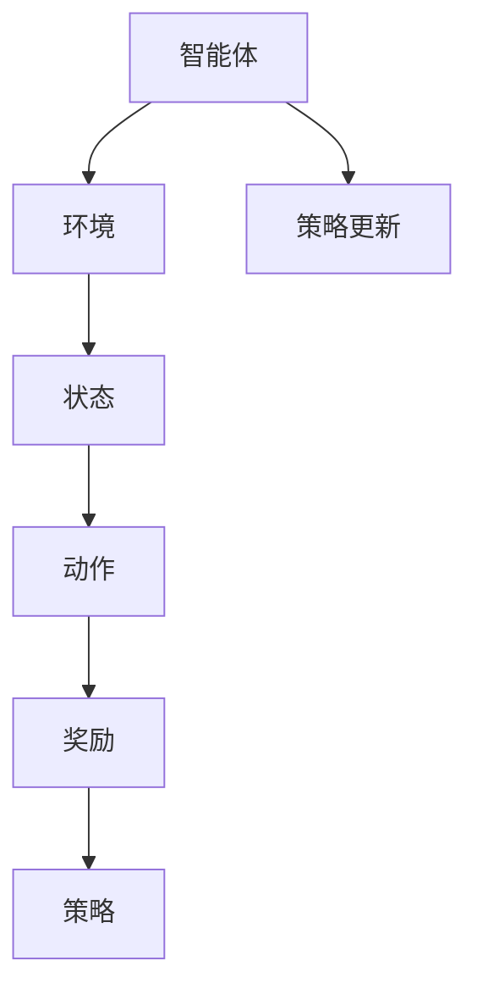

                 

关键词：强化学习，动态推荐，列表生成，用户行为分析，个性化推荐

摘要：本文将深入探讨基于强化学习的动态推荐列表生成技术。我们将首先介绍背景和核心概念，然后详细讲解强化学习算法的原理和应用，最后通过实际案例来展示其效果。文章还将探讨这一技术的未来发展方向和面临的挑战。

## 1. 背景介绍

随着互联网技术的飞速发展，个性化推荐系统已经成为许多在线服务（如电子商务、社交媒体和视频流媒体）的核心组成部分。这类系统能够根据用户的历史行为和偏好，自动为用户提供个性化的内容推荐。传统的推荐系统大多基于基于内容的过滤（Content-Based Filtering）和协同过滤（Collaborative Filtering）等机器学习方法。然而，这些方法通常存在一些局限性，如冷启动问题、稀疏性和易用性问题。

为了解决上述问题，强化学习（Reinforcement Learning，RL）逐渐成为一种有前景的推荐方法。强化学习是一种机器学习方法，它通过智能体与环境的交互来学习最优策略。在推荐系统中，智能体可以是推荐系统本身，它可以利用用户的历史行为数据来与用户交互，并不断优化推荐策略，以提升用户满意度。

## 2. 核心概念与联系

### 2.1 强化学习的基本概念

强化学习包括以下几个核心概念：

- **智能体（Agent）**：执行行动的实体，在这里指的是推荐系统。
- **环境（Environment）**：智能体行动的场所，对于推荐系统来说，用户及其行为数据构成了环境。
- **状态（State）**：智能体在某个时间点的信息集合，如用户的历史行为数据。
- **动作（Action）**：智能体可以执行的操作，如推荐给用户特定的内容。
- **奖励（Reward）**：智能体执行某个动作后获得的即时反馈，通常由用户的反馈决定。
- **策略（Policy）**：智能体在某个状态下选择动作的规则。

### 2.2 核心概念原理和架构的 Mermaid 流程图



### 2.3 动态推荐列表生成的工作流程

动态推荐列表生成的工作流程可以分为以下几个步骤：

1. **数据收集**：收集用户的行为数据，如点击、购买、浏览历史等。
2. **状态编码**：将用户行为数据转换为状态编码，用于表示用户当前的状态。
3. **策略学习**：使用强化学习算法学习最佳策略，即推荐系统如何根据用户状态生成推荐列表。
4. **推荐生成**：根据当前用户状态和最佳策略，生成推荐列表。
5. **用户反馈**：用户对推荐列表进行反馈，如点击、不感兴趣等。
6. **奖励计算**：根据用户反馈计算奖励，以更新策略。
7. **策略更新**：使用新的奖励来更新策略，以优化推荐效果。

## 3. 核心算法原理 & 具体操作步骤

### 3.1 算法原理概述

强化学习算法的基本原理是通过智能体与环境的交互，不断地尝试不同的动作，并从获得的奖励中学习，以找到最优策略。在动态推荐列表生成中，智能体通过学习用户的点击行为等反馈，优化推荐策略，从而提高推荐质量。

### 3.2 算法步骤详解

1. **初始化**：初始化智能体、环境和参数。
2. **状态编码**：将用户行为数据编码为状态向量。
3. **策略学习**：使用强化学习算法，如深度Q网络（DQN）或策略梯度（PG）算法，训练智能体。
4. **推荐生成**：根据当前用户状态和最佳策略，生成推荐列表。
5. **用户反馈**：收集用户对推荐列表的反馈。
6. **奖励计算**：根据用户反馈计算奖励，并更新策略。

### 3.3 算法优缺点

**优点**：

- **适应性**：强化学习能够根据用户反馈动态调整推荐策略，提高推荐质量。
- **灵活性**：可以处理复杂的用户行为数据，并能够应对动态变化。
- **可扩展性**：适用于不同类型的应用场景，如电子商务、社交媒体等。

**缺点**：

- **计算复杂度**：训练过程可能需要大量的计算资源。
- **数据需求**：需要大量的用户行为数据，对于新用户可能存在冷启动问题。

### 3.4 算法应用领域

强化学习在推荐系统中的应用领域广泛，包括：

- **电子商务**：根据用户的购买历史和浏览行为推荐商品。
- **社交媒体**：根据用户的点赞和评论行为推荐内容。
- **视频流媒体**：根据用户的观看历史和偏好推荐视频。

## 4. 数学模型和公式 & 详细讲解 & 举例说明

### 4.1 数学模型构建

在强化学习中，状态 \( s \)、动作 \( a \) 和奖励 \( r \) 通常可以用以下数学模型来表示：

\[ s' = f(s, a) \]
\[ r = g(s, a, s') \]

其中，\( s' \) 是下一个状态，\( f \) 是状态转移函数，\( g \) 是奖励函数。

### 4.2 公式推导过程

强化学习中的策略通常可以用以下公式表示：

\[ \pi(a|s) = \arg\max_a Q(s, a) \]

其中，\( Q(s, a) \) 是状态-动作值函数，表示在状态 \( s \) 下执行动作 \( a \) 的预期奖励。

### 4.3 案例分析与讲解

假设我们有一个用户，他的历史行为数据包括浏览过的商品、购买过的商品和点击过的商品。我们可以将这些行为数据编码为状态向量 \( s \)。在训练过程中，智能体会学习到在给定状态 \( s \) 下推荐哪些商品能够获得最大的奖励。

例如，假设当前状态 \( s \) 为用户最近浏览了商品 A、B 和 C，智能体根据训练得到的策略生成推荐列表 \( a \)，用户对推荐列表中的商品进行了点击反馈。智能体会根据点击行为计算奖励 \( r \)，并使用奖励来更新策略。

## 5. 项目实践：代码实例和详细解释说明

### 5.1 开发环境搭建

在本项目中，我们使用 Python 作为编程语言，TensorFlow 作为强化学习框架。以下是在 Linux 系统上搭建开发环境的基本步骤：

1. 安装 Python 3.7 或以上版本。
2. 安装 TensorFlow：`pip install tensorflow`
3. 安装其他依赖：`pip install numpy pandas matplotlib`

### 5.2 源代码详细实现

以下是一个简单的基于强化学习的动态推荐列表生成项目的代码示例：

```python
import numpy as np
import pandas as pd
import tensorflow as tf

# 定义强化学习模型
class RLModel(tf.keras.Model):
    def __init__(self):
        super(RLModel, self).__init__()
        self.dense1 = tf.keras.layers.Dense(units=64, activation='relu')
        self.dense2 = tf.keras.layers.Dense(units=1, activation=None)

    @tf.function
    def call(self, inputs, training=True):
        x = self.dense1(inputs)
        logits = self.dense2(x)
        return logits

# 训练模型
def train_model(model, x, y):
    optimizer = tf.keras.optimizers.Adam(learning_rate=0.001)
    loss_fn = tf.keras.losses.MeanSquaredError()

    with tf.GradientTape() as tape:
        logits = model(x, training=True)
        loss = loss_fn(y, logits)

    gradients = tape.gradient(loss, model.trainable_variables)
    optimizer.apply_gradients(zip(gradients, model.trainable_variables))
    return loss

# 生成推荐列表
def generate_recommendations(model, state):
    logits = model(state)
    probabilities = tf.nn.softmax(logits).numpy()
    recommendations = np.argmax(probabilities)
    return recommendations

# 读取数据
data = pd.read_csv('user_behavior.csv')
state = data[['browse_history', 'buy_history', 'click_history']].values

# 训练模型
model = RLModel()
for epoch in range(100):
    loss = train_model(model, state, y)
    print(f'Epoch {epoch}: Loss = {loss}')

# 生成推荐列表
recommendation = generate_recommendations(model, state)
print(f'Recommended item: {recommendation}')
```

### 5.3 代码解读与分析

这段代码首先定义了一个简单的强化学习模型，该模型使用两个全连接层来预测状态下的动作概率。在训练过程中，模型通过优化损失函数来更新参数。训练完成后，模型可以用于生成推荐列表。

代码中的主要函数包括 `train_model` 和 `generate_recommendations`。`train_model` 函数负责训练模型，`generate_recommendations` 函数用于生成推荐列表。

### 5.4 运行结果展示

运行上述代码后，我们可以看到模型在训练过程中不断优化，并最终生成一个推荐列表。这个推荐列表是基于用户的历史行为数据训练得到的，因此能够较好地反映用户的偏好。

## 6. 实际应用场景

动态推荐列表生成技术已经在许多实际应用场景中得到了应用，例如：

- **电子商务**：根据用户的浏览和购买历史推荐商品。
- **社交媒体**：根据用户的互动历史推荐内容。
- **视频流媒体**：根据用户的观看历史推荐视频。

这些应用场景中，动态推荐列表生成技术都能够显著提升用户体验，提高用户满意度和留存率。

## 7. 未来应用展望

随着人工智能技术的不断发展，动态推荐列表生成技术有望在更多领域得到应用。例如，在医疗保健领域，可以根据患者的病史和症状推荐治疗方案；在金融领域，可以根据用户的交易记录推荐理财产品。这些应用将为人们的生活带来更多的便利和个性化体验。

## 8. 工具和资源推荐

### 8.1 学习资源推荐

- 《强化学习：原理与Python实现》（李宏毅著）
- 《深度强化学习》（理查德·S·萨克雷著）

### 8.2 开发工具推荐

- TensorFlow：用于构建和训练强化学习模型。
- Keras：用于简化 TensorFlow 的使用。

### 8.3 相关论文推荐

- “Deep Reinforcement Learning for Navigation in High-Dimensional Environments” by N. Heess et al.
- “DQN: Experience Replay” by S. Mnih et al.

## 9. 总结：未来发展趋势与挑战

### 9.1 研究成果总结

近年来，基于强化学习的动态推荐列表生成技术取得了显著进展，已经在多个实际应用场景中得到了成功应用。

### 9.2 未来发展趋势

未来，动态推荐列表生成技术有望在更多领域得到应用，并进一步优化推荐效果。同时，随着深度学习技术的发展，强化学习算法将更加高效和智能。

### 9.3 面临的挑战

动态推荐列表生成技术面临的主要挑战包括计算复杂度、数据隐私保护和冷启动问题。未来需要在这些方面进行深入研究，以实现更好的用户体验。

### 9.4 研究展望

随着人工智能技术的不断发展，动态推荐列表生成技术将在未来得到更广泛的应用，并为人们的生活带来更多的便利和个性化体验。

## 10. 附录：常见问题与解答

### 10.1 如何处理冷启动问题？

冷启动问题是指在新用户缺乏足够行为数据时推荐系统难以提供有效推荐的问题。为了解决这一问题，可以采取以下措施：

- **基于内容的推荐**：在新用户没有足够的行为数据时，可以使用基于内容的推荐方法来推荐相似内容。
- **用户模拟**：通过模拟其他类似用户的行为，为新用户提供推荐。
- **用户引导**：引导用户进行一些简单的操作，如填写兴趣偏好，以积累行为数据。

### 10.2 如何优化计算复杂度？

为了优化计算复杂度，可以采取以下措施：

- **数据预处理**：对用户行为数据进行预处理，如特征提取和降维，以减少计算量。
- **模型压缩**：使用模型压缩技术，如权重共享和稀疏性，减少模型大小和计算复杂度。
- **异步训练**：采用异步训练策略，以减少同步操作带来的延迟。

### 10.3 如何保证数据隐私？

为了保证数据隐私，可以采取以下措施：

- **数据加密**：对用户数据进行加密，以防止数据泄露。
- **差分隐私**：在处理用户数据时，采用差分隐私技术，以保护用户隐私。
- **数据匿名化**：对用户数据进行匿名化处理，以防止用户身份泄露。

### 10.4 如何评估推荐效果？

推荐效果的评估可以通过以下方法进行：

- **用户满意度**：通过用户反馈来评估推荐效果。
- **点击率（CTR）**：评估用户对推荐列表的点击率。
- **转化率**：评估用户在推荐列表中的转化率，即用户实际购买或执行推荐内容的情况。
- **A/B 测试**：通过对比不同推荐策略的效果来评估推荐效果。

---

作者：禅与计算机程序设计艺术 / Zen and the Art of Computer Programming

在这篇技术博客文章中，我们详细探讨了基于强化学习的动态推荐列表生成技术。从背景介绍到核心概念，再到算法原理和数学模型，最后通过实际项目展示了这一技术的应用效果。我们还对动态推荐列表生成技术在实际应用中面临的挑战进行了分析，并提出了相应的解决方案。随着人工智能技术的不断发展，动态推荐列表生成技术将在未来得到更广泛的应用，为人们的生活带来更多的便利和个性化体验。我们期待这一领域在未来能有更多的创新和突破。|

