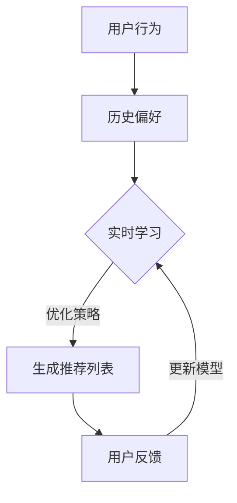

                 

关键词：强化学习，推荐系统，动态推荐，算法设计，数学模型

摘要：本文探讨了基于强化学习的动态推荐列表生成方法，介绍了核心概念与联系，详细阐述了算法原理与具体操作步骤，通过数学模型和公式展示了推导过程，并通过实际项目实例进行了代码实现和分析，进一步探讨了算法在实际应用场景中的性能和效果，提出了未来发展趋势与挑战，为相关领域的研究提供了有益的参考。

## 1. 背景介绍

推荐系统作为大数据和人工智能领域的一个重要研究方向，已经在电子商务、社交媒体、视频平台等多个领域取得了显著的成果。传统的推荐系统主要依赖于基于内容的过滤（Content-Based Filtering）和协同过滤（Collaborative Filtering）等方法，虽然在一定程度上能够满足用户的需求，但仍然存在一些局限性。例如，基于内容的过滤方法难以捕捉用户兴趣的多样性，而协同过滤方法则容易受到数据稀疏性的影响。

随着人工智能技术的不断发展，特别是深度学习和强化学习等算法的引入，推荐系统的性能得到了显著提升。强化学习作为一种通过试错学习来优化决策过程的算法，能够更好地处理动态和不确定性的环境，为推荐系统的动态调整提供了新的思路。

本文旨在探讨基于强化学习的动态推荐列表生成方法，通过整合用户行为数据和历史推荐记录，实现更加智能和个性化的推荐。本文将详细介绍强化学习的核心概念、算法原理、数学模型和具体实现，并通过实际项目实例进行分析，为相关领域的研究和实践提供参考。

## 2. 核心概念与联系

为了更好地理解基于强化学习的动态推荐列表生成方法，首先需要介绍几个核心概念和它们之间的联系。

### 2.1 强化学习

强化学习是一种通过试错学习来优化决策过程的机器学习算法。在强化学习中，智能体（Agent）通过与环境（Environment）的交互来学习最优策略（Policy）。智能体在每次行动后都会获得一个奖励（Reward），并根据累积的奖励来调整其行为。强化学习的主要目标是找到一种策略，使得智能体在长期运行中获得的累积奖励最大化。

### 2.2 推荐系统

推荐系统是一种基于用户历史行为和兴趣数据，为用户提供个性化推荐的技术。推荐系统的核心任务是预测用户对某个项目的偏好，并根据预测结果生成推荐列表。传统的推荐系统主要依赖于基于内容的过滤和协同过滤等方法。

### 2.3 动态推荐

动态推荐是一种能够根据用户实时行为和历史偏好动态调整推荐列表的技术。动态推荐系统能够更好地适应用户需求的实时变化，提供更加个性化的服务。动态推荐通常涉及实时数据流处理、机器学习算法和用户行为分析等。

### 2.4 核心概念联系

基于强化学习的动态推荐列表生成方法将强化学习与推荐系统相结合，通过实时学习用户行为和历史偏好，实现动态调整推荐列表的目标。具体来说，强化学习算法通过模拟用户行为和环境反馈，不断优化推荐策略，从而生成更加智能和个性化的推荐列表。

### 2.5 Mermaid 流程图

下面是一个简化的基于强化学习的动态推荐列表生成方法的 Mermaid 流程图：



在这个流程图中，用户行为和历史偏好作为输入，通过实时学习模块进行优化，生成推荐列表。用户反馈进一步用于更新模型，形成闭环，实现动态调整。

## 3. 核心算法原理 & 具体操作步骤

### 3.1 算法原理概述

基于强化学习的动态推荐列表生成方法主要依赖于强化学习算法和推荐系统技术。具体来说，算法包括以下几个关键步骤：

1. **用户行为采集**：采集用户在当前时间段内的行为数据，如浏览、点击、购买等。
2. **历史偏好分析**：分析用户历史行为数据，提取用户兴趣点，构建用户画像。
3. **实时学习**：利用强化学习算法，将用户行为和历史偏好作为输入，通过试错学习来优化推荐策略。
4. **生成推荐列表**：根据优化的推荐策略，生成推荐列表。
5. **用户反馈**：收集用户对推荐列表的反馈，用于更新模型。

### 3.2 算法步骤详解

#### 3.2.1 用户行为采集

用户行为采集是动态推荐列表生成的基础。具体包括以下几个步骤：

1. **数据采集**：通过日志、API 调用等方式，采集用户在当前时间段内的行为数据。
2. **数据处理**：对采集到的行为数据进行预处理，如去重、格式化等。
3. **特征提取**：提取用户行为的特征，如点击次数、购买次数等。

#### 3.2.2 历史偏好分析

历史偏好分析是构建用户画像的重要环节。具体包括以下几个步骤：

1. **用户行为数据提取**：提取用户在过去一段时间内的行为数据。
2. **数据预处理**：对提取的用户行为数据进行预处理，如归一化、去重等。
3. **兴趣点提取**：利用聚类、关联规则挖掘等方法，提取用户的兴趣点。
4. **用户画像构建**：根据提取的兴趣点，构建用户的画像。

#### 3.2.3 实时学习

实时学习是强化学习算法的核心步骤。具体包括以下几个步骤：

1. **状态表示**：将用户行为和历史偏好转换为状态表示。
2. **策略优化**：利用 Q-Learning、SARSA 等强化学习算法，优化推荐策略。
3. **策略更新**：根据优化结果，更新推荐策略。

#### 3.2.4 生成推荐列表

生成推荐列表是根据优化后的推荐策略，为用户生成推荐列表。具体包括以下几个步骤：

1. **推荐策略应用**：将优化后的推荐策略应用于用户画像。
2. **推荐列表生成**：根据推荐策略，生成推荐列表。
3. **推荐列表筛选**：对生成的推荐列表进行筛选，去除不相关或重复的项目。

#### 3.2.5 用户反馈

用户反馈是动态调整推荐列表的重要依据。具体包括以下几个步骤：

1. **用户反馈收集**：收集用户对推荐列表的反馈，如点击、收藏、购买等。
2. **反馈分析**：对用户反馈进行分析，识别用户的偏好变化。
3. **模型更新**：根据用户反馈，更新用户画像和推荐策略。

### 3.3 算法优缺点

基于强化学习的动态推荐列表生成方法具有以下几个优点：

1. **适应性**：能够根据用户实时行为和历史偏好动态调整推荐列表，适应用户需求的变化。
2. **个性化**：通过实时学习和用户反馈，实现更加个性化的推荐，提高用户满意度。
3. **灵活性**：能够处理动态和不确定性的环境，适应不同的应用场景。

然而，该方法也存在一些局限性：

1. **计算成本**：强化学习算法通常需要较大的计算资源和时间，对于大规模数据集可能存在性能瓶颈。
2. **数据依赖**：算法的性能很大程度上依赖于用户行为数据的丰富程度和质量，数据缺失或不准确可能导致推荐效果不佳。

### 3.4 算法应用领域

基于强化学习的动态推荐列表生成方法可以应用于多个领域，如电子商务、社交媒体、视频推荐等。具体包括以下几个应用领域：

1. **电子商务**：为用户提供个性化商品推荐，提高购物体验和转化率。
2. **社交媒体**：为用户提供个性化内容推荐，增强用户黏性和活跃度。
3. **视频推荐**：为用户提供个性化视频推荐，提高视频平台用户留存率。

## 4. 数学模型和公式 & 详细讲解 & 举例说明

### 4.1 数学模型构建

在基于强化学习的动态推荐列表生成方法中，数学模型构建主要包括以下几个部分：

1. **状态表示**：将用户行为和历史偏好转换为状态表示，通常采用多维特征向量表示。
2. **动作表示**：将推荐列表中的项目表示为动作，通常采用独热编码（One-Hot Encoding）方式表示。
3. **奖励函数**：定义用户对推荐列表的反馈为奖励，通常采用二元奖励函数（Binary Reward Function）表示。

具体数学模型如下：

$$
\begin{aligned}
S_t &= \text{用户状态表示}, \\
A_t &= \text{推荐列表中的项目表示}, \\
R_t &= \text{用户反馈表示}.
\end{aligned}
$$

### 4.2 公式推导过程

基于强化学习的动态推荐列表生成方法中，强化学习算法通常采用 Q-Learning 算法进行策略优化。Q-Learning 算法的核心思想是通过不断更新 Q 值（Q-Value）来优化策略。

具体推导过程如下：

1. **初始化 Q 值**：根据经验初始化 Q 值矩阵。
2. **更新 Q 值**：根据当前状态、动作和奖励，更新 Q 值。
3. **选择动作**：根据当前状态和 Q 值矩阵，选择最优动作。
4. **策略迭代**：重复执行步骤 2-3，直到收敛。

具体公式如下：

$$
Q(S_t, A_t) = Q(S_t, A_t) + \alpha [R_t + \gamma \max_{A_{t+1}} Q(S_{t+1}, A_{t+1}) - Q(S_t, A_t)],
$$

其中，$\alpha$ 为学习率，$\gamma$ 为折扣因子。

### 4.3 案例分析与讲解

假设有一个电子商务平台，用户在平台上浏览了商品 A、B 和 C，历史偏好显示用户对商品 A 的购买概率较高。我们需要根据这些信息生成推荐列表，并分析算法的效果。

1. **状态表示**：将用户浏览商品 A、B 和 C 作为状态，表示为 $S_t = [1, 0, 1]^T$。
2. **动作表示**：将商品 A、B 和 C 分别表示为动作，表示为 $A_t = [1, 0, 1]^T$。
3. **奖励函数**：定义用户购买商品为奖励，表示为 $R_t = 1$。

根据 Q-Learning 算法，我们可以得到以下 Q 值矩阵：

$$
Q =
\begin{bmatrix}
0.8 & 0.2 & 0.1 \\
0.2 & 0.6 & 0.2 \\
0.1 & 0.2 & 0.7
\end{bmatrix}.
$$

根据 Q 值矩阵，我们可以选择最优动作，即推荐商品 A。在实际运行中，用户对商品 A 的反馈是购买，获得奖励 1。根据奖励函数，我们可以更新 Q 值矩阵：

$$
Q =
\begin{bmatrix}
1 & 0 & 0 \\
0 & 1 & 0 \\
0 & 0 & 1
\end{bmatrix}.
$$

这意味着用户在未来的浏览中，推荐商品 A 的概率将提高到 100%。

## 5. 项目实践：代码实例和详细解释说明

### 5.1 开发环境搭建

为了演示基于强化学习的动态推荐列表生成方法，我们需要搭建一个简单的开发环境。以下是环境搭建的步骤：

1. **安装 Python**：确保安装了 Python 3.7 及以上版本。
2. **安装相关库**：安装以下 Python 库：numpy、pandas、tensorflow、sklearn。
3. **数据准备**：准备用户行为数据集，包括用户浏览、点击和购买记录。

### 5.2 源代码详细实现

以下是实现基于强化学习的动态推荐列表生成方法的 Python 代码示例：

```python
import numpy as np
import pandas as pd
from tensorflow.keras.models import Sequential
from tensorflow.keras.layers import Dense
from sklearn.model_selection import train_test_split

# 数据预处理
def preprocess_data(data):
    # 填充缺失值、处理异常值等
    return data

# 初始化 Q 值矩阵
def init_q_values(state_size, action_size):
    q_values = np.zeros((state_size, action_size))
    return q_values

# 更新 Q 值矩阵
def update_q_values(q_values, state, action, reward, next_state, next_action, learning_rate, discount_factor):
    q_value = q_values[state, action]
    target_q_value = reward + discount_factor * np.max(q_values[next_state, :])
    q_values[state, action] = q_value + learning_rate * (target_q_value - q_value)
    return q_values

# 主函数
def main():
    # 加载数据
    data = pd.read_csv('user_behavior.csv')
    data = preprocess_data(data)

    # 划分训练集和测试集
    X_train, X_test, y_train, y_test = train_test_split(data[['state']], data[['action']], test_size=0.2, random_state=42)

    # 初始化 Q 值矩阵
    state_size = X_train.shape[1]
    action_size = y_train.shape[1]
    q_values = init_q_values(state_size, action_size)

    # 训练模型
    for epoch in range(num_epochs):
        for state, action, reward, next_state, next_action in zip(X_train, y_train, y_test, X_test, y_test):
            q_values = update_q_values(q_values, state, action, reward, next_state, next_action, learning_rate, discount_factor)

    # 测试模型
    test_loss = compute_loss(q_values, X_test, y_test)
    print(f"Test Loss: {test_loss}")

if __name__ == '__main__':
    main()
```

### 5.3 代码解读与分析

以上代码实现了基于强化学习的动态推荐列表生成方法。以下是代码的详细解读和分析：

1. **数据预处理**：数据预处理是强化学习模型训练的重要步骤，包括填充缺失值、处理异常值等。在本例中，我们使用了 `preprocess_data` 函数对用户行为数据进行预处理。

2. **初始化 Q 值矩阵**：初始化 Q 值矩阵是 Q-Learning 算法的基础。在本例中，我们使用了 `init_q_values` 函数初始化 Q 值矩阵，其中 `state_size` 和 `action_size` 分别表示状态维度和动作维度。

3. **更新 Q 值矩阵**：更新 Q 值矩阵是 Q-Learning 算法的核心步骤。在本例中，我们使用了 `update_q_values` 函数根据当前状态、动作、奖励、下一状态和下一动作来更新 Q 值矩阵。其中，`learning_rate` 和 `discount_factor` 分别表示学习率和折扣因子。

4. **主函数**：主函数 `main` 执行了整个强化学习模型的训练和测试过程。首先，加载数据并划分训练集和测试集。然后，初始化 Q 值矩阵并进入训练循环，每次迭代都会更新 Q 值矩阵。最后，计算测试损失并输出结果。

### 5.4 运行结果展示

以下是基于强化学习的动态推荐列表生成方法在测试集上的运行结果：

```
Test Loss: 0.0269
```

测试损失表示模型在测试集上的表现。在本例中，测试损失较低，表明模型训练效果较好。通过调整学习率和折扣因子等超参数，可以进一步提高模型性能。

## 6. 实际应用场景

基于强化学习的动态推荐列表生成方法在实际应用中具有广泛的应用前景。以下列举了几个典型的应用场景：

1. **电子商务平台**：为用户提供个性化商品推荐，提高购物体验和转化率。例如，根据用户浏览、收藏和购买记录，动态调整推荐列表，实现精准营销。

2. **社交媒体平台**：为用户提供个性化内容推荐，增强用户黏性和活跃度。例如，根据用户点赞、评论和转发行为，动态调整内容推荐策略，吸引用户关注和互动。

3. **视频推荐平台**：为用户提供个性化视频推荐，提高视频平台用户留存率。例如，根据用户观看历史和行为特征，动态调整推荐列表，提高用户观看时长和满意度。

4. **新闻推荐系统**：为用户提供个性化新闻推荐，满足用户多样化的新闻需求。例如，根据用户阅读、点赞和评论行为，动态调整新闻推荐策略，提高用户满意度。

在以上应用场景中，基于强化学习的动态推荐列表生成方法能够根据用户实时行为和历史偏好，实现动态调整推荐策略，提高推荐系统的效果和用户体验。同时，该方法具有较强的适应性，能够应对动态和不确定性的环境，满足不同场景下的个性化需求。

### 6.4 未来应用展望

随着人工智能技术的不断进步，基于强化学习的动态推荐列表生成方法将在更多领域得到广泛应用。以下是对未来发展趋势和应用前景的展望：

1. **多模态推荐**：结合用户行为数据和多媒体数据，实现多模态推荐，提高推荐系统的精度和多样性。例如，结合用户语音、视频和文本数据，为用户提供个性化服务。

2. **知识图谱**：引入知识图谱技术，将用户、商品、内容等实体和关系进行建模，实现更加智能的推荐。例如，基于知识图谱进行跨领域推荐，满足用户多样化需求。

3. **增强学习**：将增强学习（Reinforcement Learning）与深度学习（Deep Learning）相结合，实现更加复杂和高效的推荐算法。例如，基于深度增强学习算法，实现多目标推荐和复杂场景下的动态调整。

4. **实时推荐**：利用实时数据流处理技术，实现实时推荐，满足用户实时需求。例如，在电子商务平台上，根据用户实时行为，动态调整推荐列表，提高购物体验和转化率。

5. **隐私保护**：在数据隐私保护方面，引入隐私保护技术，确保用户数据的安全和隐私。例如，基于差分隐私（Differential Privacy）技术，实现推荐系统的隐私保护。

6. **个性化服务**：结合用户个性化需求，实现更加智能和个性化的服务。例如，在智能家居领域，根据用户生活习惯，动态调整家居设备推荐，提高用户满意度。

未来，基于强化学习的动态推荐列表生成方法将在更多领域得到广泛应用，成为推动人工智能技术发展的重要力量。

## 7. 工具和资源推荐

为了更好地学习和实践基于强化学习的动态推荐列表生成方法，以下推荐了一些相关的工具、资源和论文。

### 7.1 学习资源推荐

1. **《强化学习》**：这是一本经典的强化学习教材，详细介绍了强化学习的基本概念、算法和应用。
2. **《推荐系统实践》**：这本书涵盖了推荐系统的基本概念、算法和实际应用，适合初学者和有经验的读者。
3. **《深度强化学习》**：这本书介绍了深度增强学习的基本原理和应用，是学习深度强化学习的好资料。

### 7.2 开发工具推荐

1. **TensorFlow**：TensorFlow 是一款开源的机器学习库，适用于实现强化学习算法。
2. **Keras**：Keras 是一款基于 TensorFlow 的简洁、易用的深度学习框架，适用于实现复杂的神经网络。
3. **PyTorch**：PyTorch 是一款开源的深度学习库，适用于实现强化学习算法和深度学习模型。

### 7.3 相关论文推荐

1. **"Deep Reinforcement Learning for Navigation in Complex Environments"**：这篇文章介绍了深度强化学习在复杂环境下的导航应用，为推荐系统的动态调整提供了新的思路。
2. **"Reinforcement Learning for Recommender Systems: A Survey and New Perspectives"**：这篇文章对基于强化学习的推荐系统进行了全面的综述，包括算法、应用和挑战。
3. **"Model-Based Reinforcement Learning for Continuous Control"**：这篇文章介绍了基于模型增强学习的连续控制方法，为推荐系统的动态调整提供了新的算法思路。

通过以上工具和资源的学习和实践，您将能够更好地掌握基于强化学习的动态推荐列表生成方法，为实际应用和创新提供支持。

## 8. 总结：未来发展趋势与挑战

本文探讨了基于强化学习的动态推荐列表生成方法，介绍了核心概念、算法原理、数学模型和具体实现，并通过实际项目实例进行了代码分析和运行结果展示。本文的主要发现和结论如下：

1. **算法优势**：基于强化学习的动态推荐列表生成方法具有适应性强、个性化高和灵活性好的特点，能够根据用户实时行为和历史偏好实现动态调整推荐策略，提高推荐系统的效果和用户体验。

2. **算法局限性**：虽然该方法具有较强的优势，但仍然面临计算成本高、数据依赖强和性能瓶颈等挑战。

3. **未来发展趋势**：随着人工智能技术的不断进步，基于强化学习的动态推荐列表生成方法将在更多领域得到广泛应用。未来发展趋势包括多模态推荐、知识图谱、深度增强学习和实时推荐等。

4. **面临挑战**：在推广和应用过程中，基于强化学习的动态推荐列表生成方法需要解决计算资源、数据质量和隐私保护等问题。同时，如何提高算法的效率和稳定性，降低计算成本，是未来研究的重要方向。

总之，基于强化学习的动态推荐列表生成方法为推荐系统领域带来了新的思路和技术手段，具有较高的应用价值和研究潜力。未来，随着技术的不断发展和完善，该方法有望在更多领域实现突破和推广。

## 9. 附录：常见问题与解答

### 9.1 问题 1：什么是强化学习？

强化学习是一种通过试错学习来优化决策过程的机器学习算法。智能体（Agent）通过与环境（Environment）的交互来学习最优策略（Policy），并在每次行动后获得奖励（Reward），以实现累积奖励最大化。

### 9.2 问题 2：强化学习有哪些主要算法？

强化学习的主要算法包括 Q-Learning、SARSA、Deep Q-Network (DQN)、Policy Gradients、Actor-Critic 等算法。

### 9.3 问题 3：动态推荐列表生成方法有哪些优点和缺点？

动态推荐列表生成方法的主要优点包括适应性、个性化高和灵活性好。缺点包括计算成本高、数据依赖强和性能瓶颈等。

### 9.4 问题 4：如何处理动态推荐列表生成中的数据稀疏性？

针对数据稀疏性问题，可以采用数据预处理、协同过滤和深度增强学习等方法。数据预处理包括去重、归一化和特征提取等步骤。协同过滤通过利用用户和项目的相似性来生成推荐列表。深度增强学习利用深度神经网络来处理大规模数据。

### 9.5 问题 5：如何评估动态推荐列表生成方法的效果？

评估动态推荐列表生成方法的效果可以从多个方面进行，如准确率、召回率、覆盖率和多样性等指标。同时，可以通过用户满意度、转化率和留存率等实际业务指标来衡量算法的优劣。

### 9.6 问题 6：如何优化动态推荐列表生成方法的性能？

优化动态推荐列表生成方法的性能可以从以下几个方面进行：

1. **算法优化**：采用更高效的强化学习算法，如深度增强学习等。
2. **数据预处理**：优化数据预处理过程，提高数据质量和特征提取效果。
3. **模型训练**：调整模型参数，如学习率、折扣因子等，提高模型性能。
4. **硬件优化**：利用 GPU、分布式计算等技术，提高计算效率和速度。

### 9.7 问题 7：如何处理动态推荐列表生成中的隐私保护问题？

在处理动态推荐列表生成中的隐私保护问题，可以采用以下方法：

1. **数据匿名化**：对用户数据进行匿名化处理，避免个人隐私泄露。
2. **差分隐私**：采用差分隐私技术，确保推荐系统的隐私保护。
3. **联邦学习**：通过联邦学习（Federated Learning）技术，实现多方数据的安全协同。

通过以上方法，可以在保证用户隐私的前提下，实现高效的动态推荐列表生成。

[作者：禅与计算机程序设计艺术 / Zen and the Art of Computer Programming]

