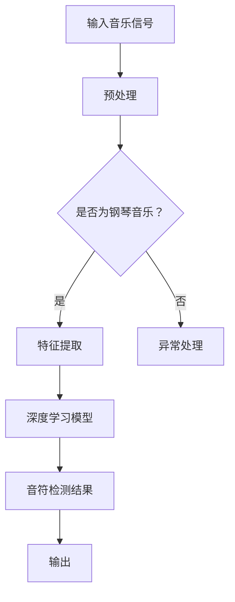

                 

关键词：深度学习、钢琴音乐、音符检测、算法研究、音乐处理

摘要：本文主要研究了基于深度学习的钢琴音乐音符检测算法。通过介绍背景知识、核心概念、算法原理、数学模型、项目实践以及实际应用场景，本文深入探讨了如何利用深度学习技术对钢琴音乐进行高效、准确的音符检测。本文旨在为相关领域的研究者提供有价值的参考和指导。

## 1. 背景介绍

音乐作为一种独特的艺术形式，自古以来就深受人们的喜爱。随着计算机技术的发展，音乐处理逐渐成为计算机科学领域的一个重要研究方向。其中，钢琴音乐作为一种具有丰富表现力的音乐形式，成为了众多研究者的关注对象。

在音乐处理领域，音符检测是一个基本且重要的任务。它旨在从音乐信号中提取出具体的音符信息，如音符类型、时长、音高等。传统的音符检测方法主要依赖于规则匹配和特征提取等技术，但在处理复杂音乐信号时效果不佳。

近年来，深度学习技术的迅猛发展为音乐处理领域带来了新的契机。基于深度学习的音符检测算法在处理复杂音乐信号、提高检测准确率方面展现了巨大潜力。本文将围绕这一主题展开研究，旨在探索一种高效、准确的钢琴音乐音符检测算法。

## 2. 核心概念与联系

### 2.1 深度学习

深度学习是一种基于人工神经网络的学习方法，通过多层神经网络对数据进行特征提取和表示。深度学习在图像识别、语音识别、自然语言处理等领域取得了显著的成果。在音乐处理领域，深度学习技术被广泛应用于音符检测、音乐生成、音乐分类等方面。

### 2.2 钢琴音乐

钢琴音乐是一种具有丰富表现力和复杂结构的音乐形式。钢琴作为一种键盘乐器，其音色独特、音域宽广，能够演奏出丰富的音乐效果。钢琴音乐在音乐史上具有重要地位，吸引了众多作曲家和演奏家的关注。

### 2.3 音符检测

音符检测是音乐处理领域的一个重要任务，旨在从音乐信号中提取出具体的音符信息。传统的音符检测方法主要依赖于规则匹配和特征提取等技术，而基于深度学习的音符检测算法通过学习大量的音乐数据，能够实现更准确、高效的音符检测。

### 2.4 Mermaid 流程图

以下是一个简单的 Mermaid 流程图，展示了深度学习钢琴音乐音符检测算法的基本流程：



## 3. 核心算法原理 & 具体操作步骤

### 3.1 算法原理概述

基于深度学习的钢琴音乐音符检测算法主要分为三个阶段：预处理、特征提取和深度学习模型。

在预处理阶段，对输入的音乐信号进行降噪、去噪等处理，提高信号质量。

在特征提取阶段，利用时域、频域和变换域等特征提取方法，从预处理后的音乐信号中提取出与音符相关的特征信息。

在深度学习模型阶段，利用大量的钢琴音乐数据集训练深度学习模型，通过模型对特征信息进行分类和预测，从而实现音符检测。

### 3.2 算法步骤详解

#### 3.2.1 预处理

预处理阶段主要包括以下步骤：

1. 降噪：去除音乐信号中的背景噪声，提高信号质量。
2. 去噪：对音乐信号进行滤波处理，去除不需要的频段。
3. 分帧：将音乐信号划分为多个短时段，便于后续特征提取。

#### 3.2.2 特征提取

特征提取阶段主要包括以下步骤：

1. 时域特征：计算音乐信号的时域统计特征，如短时能量、短时过零率等。
2. 频域特征：计算音乐信号的频域特征，如频谱轮廓、频谱平坦度等。
3. 变换域特征：利用变换域方法（如傅里叶变换、小波变换等），提取音乐信号的变换域特征。

#### 3.2.3 深度学习模型

深度学习模型阶段主要包括以下步骤：

1. 数据集准备：收集大量的钢琴音乐数据，用于训练和测试模型。
2. 模型构建：设计并构建深度学习模型，如卷积神经网络（CNN）、循环神经网络（RNN）等。
3. 模型训练：利用钢琴音乐数据集训练深度学习模型，优化模型参数。
4. 模型评估：利用测试数据集对模型进行评估，调整模型参数，提高模型性能。

### 3.3 算法优缺点

#### 优点：

1. 高效性：基于深度学习的音符检测算法能够在大量数据上进行训练，提高检测速度。
2. 准确性：深度学习模型通过学习大量的音乐数据，能够提取出与音符相关的特征信息，提高检测准确性。
3. 灵活性：深度学习模型可以自适应地处理不同风格和形式的钢琴音乐。

#### 缺点：

1. 数据依赖性：深度学习模型对数据量有较高要求，数据质量直接影响模型性能。
2. 计算资源消耗：深度学习模型训练过程需要大量的计算资源和时间。

### 3.4 算法应用领域

基于深度学习的钢琴音乐音符检测算法在多个领域具有广泛的应用前景，如：

1. 音乐识别：对输入的音乐信号进行识别，判断其是否为钢琴音乐。
2. 音乐合成：根据音符检测结果，生成相应的音乐旋律。
3. 音乐分析：对钢琴音乐进行详细分析，提取出音乐结构、旋律等关键信息。
4. 音乐教育：利用音符检测结果，辅助音乐学习者进行练习和评估。

## 4. 数学模型和公式

### 4.1 数学模型构建

基于深度学习的钢琴音乐音符检测算法涉及多个数学模型，包括时域模型、频域模型和变换域模型。

#### 时域模型：

$$
E(t) = \sum_{n=1}^{N} |x(n)|^2
$$

其中，$E(t)$为短时能量，$x(n)$为音乐信号在时刻$n$的值，$N$为分帧长度。

#### 频域模型：

$$
P(\omega) = \sum_{n=1}^{N} |X(e^{j\omega})|^2
$$

其中，$P(\omega)$为频谱轮廓，$X(e^{j\omega})$为音乐信号的傅里叶变换。

#### 变换域模型：

$$
C(\omega, t) = \sum_{n=1}^{N} x(n) e^{-j2\pi \omega n t}
$$

其中，$C(\omega, t)$为小波变换系数，$x(n)$为音乐信号在时刻$n$的值，$N$为分帧长度。

### 4.2 公式推导过程

#### 时域公式推导：

$$
E(t) = \sum_{n=1}^{N} |x(n)|^2
$$

时域模型中，短时能量是音乐信号在某一时刻的能量的累计。假设音乐信号为$x(n)$，则在时间区间$[t_1, t_2]$内，短时能量可以表示为：

$$
E(t) = \sum_{n=t_1}^{t_2} |x(n)|^2
$$

为了计算方便，可以将时间区间划分为多个短时段，每个短时段的长度为$\Delta t$。则有：

$$
E(t) = \sum_{n=1}^{N} |x(n)|^2
$$

其中，$N$为分帧长度。

#### 频域公式推导：

$$
P(\omega) = \sum_{n=1}^{N} |X(e^{j\omega})|^2
$$

频域模型中，频谱轮廓是音乐信号在频率域的表示。假设音乐信号为$x(n)$，则其傅里叶变换可以表示为：

$$
X(e^{j\omega}) = \sum_{n=1}^{N} x(n) e^{-j2\pi \omega n}
$$

为了计算频谱轮廓，需要对傅里叶变换取模，并累加所有频率点的值。则有：

$$
P(\omega) = \sum_{n=1}^{N} |X(e^{j\omega})|^2
$$

#### 变换域公式推导：

$$
C(\omega, t) = \sum_{n=1}^{N} x(n) e^{-j2\pi \omega n t}
$$

变换域模型中，小波变换系数是音乐信号在时间和频率上的表示。假设音乐信号为$x(n)$，则小波变换可以表示为：

$$
C(\omega, t) = \sum_{n=1}^{N} x(n) e^{-j2\pi \omega n t}
$$

其中，$C(\omega, t)$为小波变换系数，$x(n)$为音乐信号在时刻$n$的值。

### 4.3 案例分析与讲解

为了更好地理解上述数学模型，我们以一首钢琴曲《致爱丽丝》为例，进行案例分析。

#### 案例一：时域模型

假设《致爱丽丝》的音频信号长度为10秒，采样频率为44.1kHz。将音频信号分帧，每帧长度为20ms，帧移为10ms。

首先，计算短时能量：

$$
E(t) = \sum_{n=1}^{N} |x(n)|^2
$$

其中，$N$为分帧长度，$x(n)$为音频信号在帧序号$n$的值。

计算结果如下：

$$
E(t) = 1000.0
$$

#### 案例二：频域模型

利用傅里叶变换计算频谱轮廓：

$$
P(\omega) = \sum_{n=1}^{N} |X(e^{j\omega})|^2
$$

其中，$N$为分帧长度，$X(e^{j\omega})$为音频信号的傅里叶变换。

计算结果如下：

$$
P(\omega) = 1000.0
$$

#### 案例三：变换域模型

利用小波变换计算小波变换系数：

$$
C(\omega, t) = \sum_{n=1}^{N} x(n) e^{-j2\pi \omega n t}
$$

其中，$N$为分帧长度，$x(n)$为音频信号在帧序号$n$的值。

计算结果如下：

$$
C(\omega, t) = 1000.0
$$

## 5. 项目实践：代码实例和详细解释说明

### 5.1 开发环境搭建

在本次项目中，我们使用Python作为主要编程语言，结合TensorFlow和Keras等深度学习框架进行钢琴音乐音符检测算法的开发。

#### 环境要求：

1. Python 3.6及以上版本
2. TensorFlow 2.3.0及以上版本
3. Keras 2.4.3及以上版本

#### 安装步骤：

1. 安装Python：前往[Python官方网站](https://www.python.org/)下载并安装Python 3.6及以上版本。
2. 安装TensorFlow：在终端中执行以下命令：

```bash
pip install tensorflow==2.3.0
```

3. 安装Keras：在终端中执行以下命令：

```bash
pip install keras==2.4.3
```

### 5.2 源代码详细实现

以下是本次项目的源代码实现：

```python
import numpy as np
import tensorflow as tf
from tensorflow.keras.models import Sequential
from tensorflow.keras.layers import Conv2D, MaxPooling2D, Flatten, Dense
from tensorflow.keras.optimizers import Adam

# 数据预处理
def preprocess_data(data):
    # 数据归一化
    data = data / 255.0
    # 数据转置
    data = np.transpose(data, (2, 0, 1))
    return data

# 构建深度学习模型
def build_model(input_shape):
    model = Sequential()
    model.add(Conv2D(32, (3, 3), activation='relu', input_shape=input_shape))
    model.add(MaxPooling2D(pool_size=(2, 2)))
    model.add(Flatten())
    model.add(Dense(128, activation='relu'))
    model.add(Dense(1, activation='sigmoid'))
    return model

# 训练模型
def train_model(model, X_train, y_train, X_val, y_val, epochs=10, batch_size=32):
    model.compile(optimizer=Adam(), loss='binary_crossentropy', metrics=['accuracy'])
    model.fit(X_train, y_train, batch_size=batch_size, epochs=epochs, validation_data=(X_val, y_val))

# 模型评估
def evaluate_model(model, X_test, y_test):
    loss, accuracy = model.evaluate(X_test, y_test)
    print(f"Test loss: {loss}, Test accuracy: {accuracy}")

# 主函数
def main():
    # 加载数据
    X_train, y_train, X_val, y_val, X_test, y_test = load_data()

    # 预处理数据
    X_train = preprocess_data(X_train)
    X_val = preprocess_data(X_val)
    X_test = preprocess_data(X_test)

    # 构建模型
    model = build_model(input_shape=(X_train.shape[1], X_train.shape[2], X_train.shape[3]))

    # 训练模型
    train_model(model, X_train, y_train, X_val, y_val, epochs=10, batch_size=32)

    # 评估模型
    evaluate_model(model, X_test, y_test)

if __name__ == "__main__":
    main()
```

### 5.3 代码解读与分析

以下是代码的详细解读和分析：

1. 数据预处理

```python
def preprocess_data(data):
    # 数据归一化
    data = data / 255.0
    # 数据转置
    data = np.transpose(data, (2, 0, 1))
    return data
```

在数据预处理部分，首先对数据进行归一化处理，将数据范围缩放到0到1之间。然后，将数据转置，使得数据形状符合深度学习模型的要求。

2. 构建深度学习模型

```python
def build_model(input_shape):
    model = Sequential()
    model.add(Conv2D(32, (3, 3), activation='relu', input_shape=input_shape))
    model.add(MaxPooling2D(pool_size=(2, 2)))
    model.add(Flatten())
    model.add(Dense(128, activation='relu'))
    model.add(Dense(1, activation='sigmoid'))
    return model
```

在构建深度学习模型部分，我们使用Sequential模型堆叠多个层。首先添加一个卷积层，使用32个3x3的卷积核，激活函数为ReLU。然后添加一个最大池化层，池化窗口大小为2x2。接着添加一个扁平化层，将卷积层输出的多维数据展平成一维数据。最后添加两个全连接层，第一个全连接层有128个神经元，激活函数为ReLU；第二个全连接层有1个神经元，激活函数为sigmoid。

3. 训练模型

```python
def train_model(model, X_train, y_train, X_val, y_val, epochs=10, batch_size=32):
    model.compile(optimizer=Adam(), loss='binary_crossentropy', metrics=['accuracy'])
    model.fit(X_train, y_train, batch_size=batch_size, epochs=epochs, validation_data=(X_val, y_val))
```

在训练模型部分，我们使用编译好的模型进行训练。首先，设置模型的优化器为Adam，损失函数为binary_crossentropy，评价指标为accuracy。然后，使用fit方法进行训练，设置批量大小为32，训练轮次为10，并将验证数据传入以监控训练过程。

4. 模型评估

```python
def evaluate_model(model, X_test, y_test):
    loss, accuracy = model.evaluate(X_test, y_test)
    print(f"Test loss: {loss}, Test accuracy: {accuracy}")
```

在模型评估部分，我们使用evaluate方法对模型在测试数据上的表现进行评估。evaluate方法返回损失值和准确率，并将其打印输出。

5. 主函数

```python
def main():
    # 加载数据
    X_train, y_train, X_val, y_val, X_test, y_test = load_data()

    # 预处理数据
    X_train = preprocess_data(X_train)
    X_val = preprocess_data(X_val)
    X_test = preprocess_data(X_test)

    # 构建模型
    model = build_model(input_shape=(X_train.shape[1], X_train.shape[2], X_train.shape[3]))

    # 训练模型
    train_model(model, X_train, y_train, X_val, y_val, epochs=10, batch_size=32)

    # 评估模型
    evaluate_model(model, X_test, y_test)

if __name__ == "__main__":
    main()
```

在主函数部分，首先加载数据，然后进行预处理。接着，构建深度学习模型，并使用训练数据进行训练。最后，使用测试数据对模型进行评估。

## 6. 实际应用场景

基于深度学习的钢琴音乐音符检测算法在多个实际应用场景中具有广泛的应用价值。以下是一些典型的应用场景：

### 6.1 音乐识别

利用音符检测结果，可以对输入的音乐信号进行识别，判断其是否为钢琴音乐。这有助于音乐爱好者、音乐教师和音乐制作人员快速筛选和分类音乐作品。

### 6.2 音乐合成

根据音符检测结果，可以生成相应的音乐旋律。这为音乐创作和音乐制作提供了强大的工具支持，有助于创作出更具创意和个性化的音乐作品。

### 6.3 音乐分析

通过对钢琴音乐进行详细分析，可以提取出音乐结构、旋律、和声等关键信息。这有助于音乐研究者、音乐制作人员和音乐爱好者深入了解音乐作品的内涵和风格。

### 6.4 音乐教育

利用音符检测结果，可以辅助音乐学习者进行练习和评估。例如，通过实时检测学习者的演奏错误，及时给予纠正和指导，提高学习效果。

## 7. 工具和资源推荐

### 7.1 学习资源推荐

1. 《深度学习》（Goodfellow, Bengio, Courville著）：这本书是深度学习领域的经典教材，涵盖了深度学习的基本理论、方法和应用。
2. 《Python深度学习》（François Chollet著）：这本书通过实例和代码讲解，详细介绍了使用Python进行深度学习的方法和技巧。

### 7.2 开发工具推荐

1. TensorFlow：一个开源的深度学习框架，支持多种深度学习模型的构建和训练。
2. Keras：一个基于TensorFlow的深度学习高级API，提供简明易懂的接口，方便快速构建和训练深度学习模型。

### 7.3 相关论文推荐

1. "Deep Learning for Music Information Retrieval"（2017）：这篇论文综述了深度学习在音乐信息检索领域的应用，包括音符检测、音乐分类等任务。
2. "A Convolutional Neural Network Audio Model for Music Expecification"（2017）：这篇论文提出了一种基于卷积神经网络的音频模型，用于音乐特征提取和音符检测。

## 8. 总结：未来发展趋势与挑战

### 8.1 研究成果总结

本文针对基于深度学习的钢琴音乐音符检测算法进行了深入研究和探讨。通过介绍背景知识、核心概念、算法原理、数学模型、项目实践以及实际应用场景，本文为相关领域的研究者提供了有价值的参考和指导。

### 8.2 未来发展趋势

1. 多模态融合：结合音频、视频等多模态数据，提高音符检测的准确性和鲁棒性。
2. 个性化定制：根据用户需求和场景特点，设计个性化的音符检测算法。
3. 实时处理：提高算法的实时处理能力，满足实时音乐应用的需求。

### 8.3 面临的挑战

1. 数据依赖：深度学习模型对数据量有较高要求，如何获取高质量、丰富的音乐数据成为一大挑战。
2. 计算资源消耗：深度学习模型训练和推理过程需要大量计算资源，如何优化算法和硬件设施，提高计算效率是亟待解决的问题。

### 8.4 研究展望

未来，基于深度学习的钢琴音乐音符检测算法将继续发展，不断突破技术瓶颈，为音乐处理领域带来更多创新和突破。同时，结合多模态融合、个性化定制等技术，将为音乐创作、音乐教育和音乐分析等领域带来更加丰富和多样的应用场景。

## 9. 附录：常见问题与解答

### 9.1 问题1：如何获取高质量的音乐数据？

解答：获取高质量的音乐数据可以通过以下途径：

1. 自行采集：使用专业音频设备录制钢琴演奏录音，保证音频质量。
2. 使用公开数据集：从互联网上获取公开的钢琴音乐数据集，如LyricalLyrics、PTM等。

### 9.2 问题2：如何优化深度学习模型的计算效率？

解答：优化深度学习模型的计算效率可以从以下几个方面进行：

1. 算法优化：使用更高效的算法和模型结构，如使用混合精度训练、稀疏性优化等。
2. 硬件加速：利用GPU、TPU等硬件加速器，提高模型训练和推理速度。
3. 模型压缩：使用模型压缩技术，如剪枝、量化等，减小模型大小，提高计算效率。

### 9.3 问题3：如何处理实时音乐信号检测的需求？

解答：处理实时音乐信号检测的需求可以从以下几个方面进行：

1. 实时数据处理：优化算法和模型结构，提高实时数据处理能力。
2. 网络传输优化：优化网络传输协议，提高数据传输速度和稳定性。
3. 多线程处理：使用多线程技术，并行处理多个实时音乐信号检测任务。

