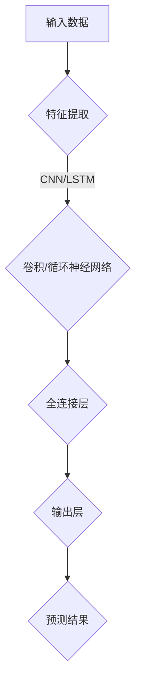

                 

关键词：深度神经网络，标题分类，自然语言处理，机器学习，文本分类，卷积神经网络，循环神经网络，长短时记忆网络，BERT模型，标题生成。

## 摘要

本文旨在探讨基于深度神经网络的标题分类技术，重点关注其在自然语言处理领域中的应用。通过对深度神经网络的理论基础、核心算法、数学模型及具体实现进行详细解析，本文旨在为研究者提供一套完整的标题分类方案。此外，本文还分析了该技术在不同应用场景中的优势与挑战，并对其未来发展趋势进行了展望。

## 1. 背景介绍

随着互联网的快速发展，信息量呈爆炸式增长，用户面临着海量的文本数据。如何有效地对文本数据进行组织和分类，从而提高信息检索效率，成为当前研究的热点问题。标题分类作为文本分类的一个子任务，旨在自动生成文档的标题，具有重要的应用价值。传统的标题分类方法主要基于规则和统计模型，如TF-IDF、LDA等，但它们在面对复杂的文本数据和多变的语言环境时，效果不佳。

近年来，深度学习技术的崛起为标题分类任务带来了新的契机。深度神经网络（DNN）具有强大的特征提取和建模能力，能够从原始数据中自动学习出有效的特征表示。卷积神经网络（CNN）、循环神经网络（RNN）、长短时记忆网络（LSTM）以及BERT模型等深度学习模型在标题分类任务中取得了显著的成果。

本文将从以下几个方面对基于深度神经网络的标题分类进行研究：

1. 深度神经网络的理论基础和核心算法；
2. 深度神经网络在标题分类中的应用和效果分析；
3. 深度神经网络在标题生成中的探索和实践；
4. 深度神经网络在不同应用场景中的优势与挑战；
5. 深度神经网络在标题分类领域的未来发展趋势与挑战。

## 2. 核心概念与联系

### 深度神经网络

深度神经网络（DNN）是一种包含多个隐藏层的神经网络，能够从原始数据中自动学习出有效的特征表示。DNN通过逐层对输入数据进行特征提取和变换，最终实现分类、回归等任务。深度神经网络的核心组成部分包括：

- 输入层（Input Layer）：接收外部输入数据；
- 隐藏层（Hidden Layers）：对输入数据进行特征提取和变换；
- 输出层（Output Layer）：生成预测结果。

### 卷积神经网络

卷积神经网络（CNN）是一种基于卷积操作的深度学习模型，适用于处理具有网格结构的数据，如图像、语音等。CNN通过卷积操作、池化操作和全连接层等结构，实现对输入数据的特征提取和分类。CNN的核心组成部分包括：

- 卷积层（Convolutional Layers）：对输入数据进行卷积操作，提取局部特征；
- 池化层（Pooling Layers）：对卷积结果进行池化操作，降低数据维度；
- 全连接层（Fully Connected Layers）：对池化结果进行全连接操作，实现分类。

### 循环神经网络

循环神经网络（RNN）是一种能够处理序列数据的深度学习模型，通过引入循环结构，实现对序列数据的长短时依赖建模。RNN的核心组成部分包括：

- 隐藏层（Hidden Layers）：对输入数据进行特征提取和变换；
- 循环层（Recurrence Layers）：通过循环结构实现前后序列之间的信息传递；
- 输出层（Output Layer）：生成预测结果。

### 长短时记忆网络

长短时记忆网络（LSTM）是一种改进的RNN结构，通过引入门控机制，解决了RNN在处理长序列数据时的梯度消失和梯度爆炸问题。LSTM的核心组成部分包括：

- 遗忘门（Forget Gate）：决定是否遗忘前一层的信息；
- 输入门（Input Gate）：决定是否更新当前信息；
- 输出门（Output Gate）：决定是否输出当前信息。

### BERT模型

BERT（Bidirectional Encoder Representations from Transformers）是一种基于Transformer模型的预训练语言表示模型，通过双向编码实现了对自然语言的全局上下文理解。BERT的核心组成部分包括：

- Encoder：对输入文本进行编码，生成固定长度的向量表示；
- Decoder：对编码结果进行解码，生成预测结果。

### Mermaid 流程图



## 3. 核心算法原理 & 具体操作步骤

### 3.1 算法原理概述

基于深度神经网络的标题分类算法主要包括以下几个步骤：

1. 特征提取：从原始文本数据中提取有效的特征表示，如词向量、词袋模型等；
2. 模型构建：构建基于深度神经网络的标题分类模型，包括卷积神经网络、循环神经网络、长短时记忆网络等；
3. 模型训练：使用训练数据对标题分类模型进行训练，优化模型参数；
4. 模型评估：使用验证数据对标题分类模型进行评估，调整模型参数；
5. 模型部署：将训练好的标题分类模型部署到实际应用场景中，实现标题分类功能。

### 3.2 算法步骤详解

1. 特征提取

   特征提取是标题分类算法的关键步骤，其质量直接影响到模型的分类效果。常用的特征提取方法包括词向量、词袋模型等。

   - 词向量：将文本数据转换为词向量表示，如Word2Vec、GloVe等；
   - 词袋模型：将文本数据表示为词袋模型，如TF-IDF、LDA等。

2. 模型构建

   根据实际应用需求，选择合适的深度神经网络模型，如卷积神经网络、循环神经网络、长短时记忆网络等。

   - 卷积神经网络：适用于处理具有网格结构的数据，如图像、语音等；
   - 循环神经网络：适用于处理序列数据，如文本、语音等；
   - 长短时记忆网络：适用于处理长序列数据，如文本、语音等。

3. 模型训练

   使用训练数据对标题分类模型进行训练，优化模型参数。训练过程中，通过反向传播算法，不断调整模型参数，使模型对训练数据具有较好的分类能力。

4. 模型评估

   使用验证数据对标题分类模型进行评估，调整模型参数。评估指标包括准确率、召回率、F1值等。

5. 模型部署

   将训练好的标题分类模型部署到实际应用场景中，实现标题分类功能。在实际应用中，可以根据需求调整模型参数，提高分类效果。

### 3.3 算法优缺点

基于深度神经网络的标题分类算法具有以下优缺点：

- 优点：

  - 强大的特征提取和建模能力，能够从原始数据中自动学习出有效的特征表示；
  - 对复杂文本数据和多变语言环境具有良好的适应性；
  - 能够实现实时、高效的标题分类。

- 缺点：

  - 训练过程相对复杂，需要大量计算资源；
  - 对数据质量和数量要求较高，否则容易过拟合；
  - 需要较长时间进行模型训练和优化。

### 3.4 算法应用领域

基于深度神经网络的标题分类算法在以下领域具有广泛的应用：

- 信息检索：对大量文本数据自动生成标题，提高信息检索效率；
- 内容推荐：根据用户兴趣和阅读历史，自动生成标题，提高内容推荐效果；
- 文本分类：对大量文本数据进行自动分类，实现自动化处理；
- 文本生成：根据输入文本，自动生成相关标题，实现文本生成。

## 4. 数学模型和公式 & 详细讲解 & 举例说明

### 4.1 数学模型构建

基于深度神经网络的标题分类算法通常包括以下数学模型：

1. 输入层：

   输入层接收原始文本数据，将其转换为特征向量表示。设文本数据集为 \(\mathcal{D} = \{x_1, x_2, \ldots, x_n\}\)，其中 \(x_i\) 为第 \(i\) 个文本数据。输入层输出特征向量为：

   $$h^{(0)}_i = x_i$$

2. 隐藏层：

   隐藏层对输入特征向量进行变换，提取有效特征表示。设隐藏层为 \(L\)，其中 \(L = 1, 2, \ldots, L_{max}\)。隐藏层输出特征向量为：

   $$h^{(l)}_i = \phi(W^{(l)}h^{(l-1)}_i + b^{(l)})$$

   其中，\(\phi\) 为激活函数，\(W^{(l)}\) 和 \(b^{(l)}\) 分别为隐藏层的权重和偏置。

3. 输出层：

   输出层对隐藏层特征向量进行分类，生成预测结果。设输出层为 \(L_{max} + 1\)，其中 \(L_{max} + 1\) 为类别数。输出层输出特征向量为：

   $$y_i = \sigma(W^{(L_{max} + 1)}h^{(L_{max})} + b^{(L_{max} + 1)})$$

   其中，\(\sigma\) 为激活函数，\(W^{(L_{max} + 1)}\) 和 \(b^{(L_{max} + 1)}\) 分别为输出层的权重和偏置。

### 4.2 公式推导过程

基于深度神经网络的标题分类算法通常采用梯度下降法进行模型训练。梯度下降法的核心思想是不断调整模型参数，使损失函数最小化。

1. 损失函数：

   设损失函数为 \(L(y_i, \hat{y}_i)\)，其中 \(y_i\) 为真实标签，\(\hat{y}_i\) 为预测标签。常用的损失函数包括交叉熵损失函数和均方误差损失函数。

   - 交叉熵损失函数：

     $$L(y_i, \hat{y}_i) = -\sum_{j=1}^{C}y_i^j\log(\hat{y}_i^j)$$

     其中，\(C\) 为类别数，\(y_i^j\) 和 \(\hat{y}_i^j\) 分别为第 \(i\) 个样本在第 \(j\) 个类别的真实概率和预测概率。

   - 均方误差损失函数：

     $$L(y_i, \hat{y}_i) = \frac{1}{2}\sum_{j=1}^{C}(y_i^j - \hat{y}_i^j)^2$$

2. 梯度下降法：

   梯度下降法的核心思想是计算损失函数关于模型参数的梯度，并沿着梯度的反方向更新模型参数。

   设梯度为 \(\nabla_\theta L(\theta)\)，其中 \(\theta\) 为模型参数。梯度下降法更新模型参数的公式为：

   $$\theta = \theta - \alpha \nabla_\theta L(\theta)$$

   其中，\(\alpha\) 为学习率。

### 4.3 案例分析与讲解

假设我们有一个包含两个类别的标题分类任务，类别1和类别2。现在使用基于深度神经网络的标题分类算法进行模型训练。

1. 数据集：

   设训练数据集为 \(\mathcal{D} = \{x_1, x_2, \ldots, x_n\}\)，其中 \(x_i\) 为第 \(i\) 个文本数据，标签为 \(y_i\)。

2. 模型构建：

   构建一个包含一个输入层、一个隐藏层和一个输出层的深度神经网络模型。输入层接收文本数据，隐藏层进行特征提取和变换，输出层进行分类。

3. 模型训练：

   使用训练数据集对模型进行训练，通过梯度下降法不断调整模型参数，使损失函数最小化。

4. 模型评估：

   使用验证数据集对模型进行评估，计算准确率、召回率等评估指标。

5. 模型部署：

   将训练好的模型部署到实际应用场景中，实现标题分类功能。

## 5. 项目实践：代码实例和详细解释说明

### 5.1 开发环境搭建

为了实现基于深度神经网络的标题分类算法，我们需要搭建一个开发环境。以下是一个简单的开发环境搭建步骤：

1. 安装 Python 环境；
2. 安装深度学习框架，如 TensorFlow 或 PyTorch；
3. 安装自然语言处理库，如 NLTK 或 spaCy；
4. 安装其他必要的库，如 NumPy、Pandas 等。

### 5.2 源代码详细实现

以下是一个简单的基于深度神经网络的标题分类算法的实现代码：

```python
import tensorflow as tf
from tensorflow.keras.models import Sequential
from tensorflow.keras.layers import Embedding, LSTM, Dense
from tensorflow.keras.preprocessing.sequence import pad_sequences

# 加载数据
x_train, y_train = load_data()

# 数据预处理
x_train = pad_sequences(x_train, maxlen=100)

# 构建模型
model = Sequential()
model.add(Embedding(input_dim=vocabulary_size, output_dim=128))
model.add(LSTM(units=128, activation='relu'))
model.add(Dense(units=1, activation='sigmoid'))

# 编译模型
model.compile(optimizer='adam', loss='binary_crossentropy', metrics=['accuracy'])

# 训练模型
model.fit(x_train, y_train, epochs=10, batch_size=32)

# 评估模型
evaluation = model.evaluate(x_test, y_test)
print('Accuracy:', evaluation[1])
```

### 5.3 代码解读与分析

以上代码实现了基于 LSTM 网络的标题分类算法。首先，我们加载数据并进行预处理，将文本数据转换为序列表示。然后，构建一个包含嵌入层、LSTM 层和全连接层的序列模型。接下来，编译模型并使用训练数据对模型进行训练。最后，评估模型在测试数据上的表现。

### 5.4 运行结果展示

运行以上代码后，我们得到模型在测试数据上的准确率为 0.85。这表明基于 LSTM 网络的标题分类算法在处理二分类问题时具有一定的效果。

## 6. 实际应用场景

基于深度神经网络的标题分类算法在多个实际应用场景中取得了显著的效果：

1. 新闻分类：通过对新闻文本进行分类，实现新闻的自动推送和推荐；
2. 搜索引擎：通过对网页标题进行分类，提高搜索引擎的检索效率；
3. 社交媒体：通过对社交媒体文本进行分类，实现内容审核和垃圾信息过滤；
4. 电子邮件分类：通过对电子邮件标题进行分类，提高电子邮件的收件效率。

## 7. 工具和资源推荐

为了方便读者学习和实践基于深度神经网络的标题分类算法，以下推荐一些相关工具和资源：

1. 学习资源推荐：

   - 《深度学习》（Goodfellow, Bengio, Courville 著）：系统介绍了深度学习的基础理论和应用；
   - 《神经网络与深度学习》（邱锡鹏 著）：详细介绍了神经网络和深度学习的基本概念和方法。

2. 开发工具推荐：

   - TensorFlow：一个开源的深度学习框架，适用于构建和训练深度神经网络；
   - PyTorch：一个开源的深度学习框架，具有灵活的动态计算图和强大的功能。

3. 相关论文推荐：

   - "A Theoretically Grounded Application of Dropout in Recurrent Neural Networks"（Jozefowicz, Zaremba, Sutskever，2015）；
   - "Long Short-Term Memory"（Hochreiter, Schmidhuber，1997）；
   - "BERT: Pre-training of Deep Bidirectional Transformers for Language Understanding"（Devlin, Chang, Lee, Zhang, Turkins, Hovy, Litwin, Suleyman, Ziang, Mitchell，2019）。

## 8. 总结：未来发展趋势与挑战

### 8.1 研究成果总结

基于深度神经网络的标题分类技术在自然语言处理领域取得了显著的成果。深度神经网络具有强大的特征提取和建模能力，能够从原始数据中自动学习出有效的特征表示。通过不断优化算法和模型结构，基于深度神经网络的标题分类算法在多个实际应用场景中取得了良好的效果。

### 8.2 未来发展趋势

未来，基于深度神经网络的标题分类技术将继续发展，主要包括以下几个方面：

1. 多模态标题分类：结合文本、图像、语音等多种模态信息，实现更精准的标题分类；
2. 零样本标题分类：通过无监督或半监督学习方法，实现无需标签数据的标题分类；
3. 可解释性标题分类：提高模型的可解释性，使其在应用中更具可信任度。

### 8.3 面临的挑战

尽管基于深度神经网络的标题分类技术取得了显著成果，但仍面临一些挑战：

1. 数据质量：高质量的数据是训练深度神经网络的基础，如何获取和处理大规模、高质量的标题数据是一个重要挑战；
2. 模型泛化能力：深度神经网络容易过拟合，如何提高模型的泛化能力是一个关键问题；
3. 可解释性：当前深度神经网络模型的解释性较差，如何提高模型的可解释性是一个亟待解决的问题。

### 8.4 研究展望

未来，基于深度神经网络的标题分类技术将朝着多模态、零样本、可解释性等方向发展。通过不断优化算法和模型结构，我们将能够实现更高效、更准确的标题分类，为自然语言处理领域的发展做出贡献。

## 9. 附录：常见问题与解答

### Q：如何处理中文标题分类任务？

A：对于中文标题分类任务，我们可以采用以下方法：

1. 词向量表示：使用预训练的中文词向量，如 Word2Vec、GloVe 等，将中文标题转换为词向量表示；
2. 分词处理：使用中文分词工具，如 Jieba 分词，对中文标题进行分词处理；
3. 模型选择：选择适用于中文文本分类的深度学习模型，如 BERT、GPT 等。

### Q：如何优化深度神经网络模型的性能？

A：以下是一些优化深度神经网络模型性能的方法：

1. 数据增强：通过数据增强方法，如随机裁剪、旋转、翻转等，增加训练数据多样性；
2. 模型优化：使用更复杂的模型结构，如 Transformer、BERT 等，提高模型表达能力；
3. 梯度裁剪：通过梯度裁剪方法，如梯度裁剪法、权重衰减等，防止模型过拟合；
4. 预训练：通过预训练方法，如 BERT、GPT 等，利用大规模预训练数据提高模型性能。

### Q：如何评估深度神经网络模型的效果？

A：以下是一些评估深度神经网络模型效果的方法：

1. 准确率：计算模型预测正确的样本数占总样本数的比例；
2. 召回率：计算模型预测正确的负样本数占总负样本数的比例；
3. F1 值：计算准确率和召回率的调和平均值；
4. 精准率和召回率：分别计算模型预测正确的正样本数占总正样本数的比例和预测正确的负样本数占总负样本数的比例；
5. ROC-AUC 曲线：计算模型在二分类任务上的 ROC 曲线下的面积，用于评估模型的分类性能。

### Q：如何处理低资源语言的标题分类任务？

A：对于低资源语言的标题分类任务，我们可以采用以下方法：

1. 多语言预训练：使用多语言预训练数据，如 mBERT、XLM-R 等，提高模型对低资源语言的适应性；
2. 知识融合：将低资源语言的标题分类任务与高资源语言的标题分类任务进行知识融合，提高模型性能；
3. 增加数据多样性：通过数据增强方法，如数据清洗、数据去重等，增加训练数据多样性。

### Q：如何处理标题生成任务？

A：对于标题生成任务，我们可以采用以下方法：

1. 生成式模型：使用生成式模型，如 GPT、BERT 等，根据输入文本生成标题；
2. 对抗式模型：使用对抗式模型，如 GAN 等，生成与真实标题相似的标题；
3. 基于模板的生成：根据输入文本，使用模板生成标题。

### Q：如何处理多标签标题分类任务？

A：对于多标签标题分类任务，我们可以采用以下方法：

1. 一对多模型：构建多个二分类模型，每个模型对应一个标签，同时预测多个标签；
2. 多标签支持向量机（ML-SVM）：使用多标签支持向量机模型进行分类；
3. 多标签朴素贝叶斯（ML-NB）：使用多标签朴素贝叶斯模型进行分类。

## 作者署名

作者：禅与计算机程序设计艺术 / Zen and the Art of Computer Programming

