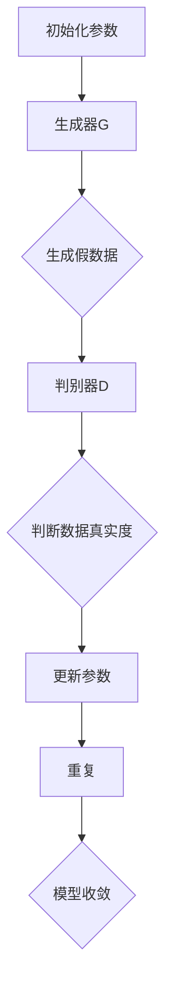

                 

关键词：生成对抗网络（GAN）、老照片修复、风格迁移、图像处理、深度学习、AI技术

## 摘要

本文将探讨如何利用生成对抗网络（GAN）技术实现老照片修复和风格迁移。首先，我们将回顾老照片修复和风格迁移的背景和挑战。接着，本文将详细介绍GAN的基本原理和应用，通过构建一个完整的算法框架，展示如何利用GAN实现老照片修复和风格迁移。随后，我们将通过一个实际项目实例，详细解释如何从数据预处理到模型训练再到效果评估的整个过程。最后，本文将讨论GAN在老照片修复和风格迁移领域的应用前景，并展望未来的研究方向。

## 1. 背景介绍

### 老照片修复

随着数字图像处理技术的发展，老照片修复技术越来越受到关注。老照片往往由于年代久远、保存条件不佳等原因，出现了褪色、破损、斑点等问题，严重影响了照片的质量和观赏效果。因此，老照片修复成为了一项重要的图像处理任务。传统方法主要依赖于图像修复技术，如基于模板的修复、基于局部特征匹配的修复等，但这些方法往往效果有限，难以满足高质量修复的需求。

### 风格迁移

风格迁移是一种将一种图像风格迁移到另一种图像上的技术，常用于艺术创作和图像美化。例如，将一张现实世界的照片风格迁移成一幅油画、水彩画或动漫风格的作品。风格迁移技术不仅能够提高图像的艺术感，还能够丰富图像的表现形式。传统的方法主要依赖于图像风格分解和合成，但这种方法在处理复杂图像时效果不理想，难以实现高质量的风格迁移。

### 挑战

老照片修复和风格迁移技术虽然已经取得了一定的成果，但仍面临以下挑战：

1. **数据质量**：老照片往往存在严重的噪声、模糊和破损等问题，这使得数据质量较差，给修复和迁移任务带来困难。
2. **计算复杂度**：传统方法通常需要大量的计算资源和时间，难以在实际应用中实现实时处理。
3. **多样性**：老照片和风格种类繁多，每种风格都有其独特的特点，如何设计通用且高效的算法来适应各种风格，仍是一个挑战。

为了解决上述问题，本文将介绍一种基于生成对抗网络（GAN）的图像修复和风格迁移技术，以期在提高修复和迁移质量、降低计算复杂度和实现多样性方面取得突破。

## 2. 核心概念与联系

### 生成对抗网络（GAN）

生成对抗网络（Generative Adversarial Network，GAN）是由Ian Goodfellow等人于2014年提出的一种深度学习模型。GAN由两个深度神经网络组成：生成器（Generator）和判别器（Discriminator）。生成器的任务是生成与真实数据分布相似的假数据，而判别器的任务是区分输入数据是真实数据还是生成器生成的假数据。两者相互对抗，通过优化生成器和判别器的参数，最终使得生成器能够生成高质量的数据。

### GAN的工作原理

GAN的工作原理可以概括为以下几个步骤：

1. **生成器生成数据**：生成器从随机噪声中生成假数据，这些假数据与真实数据分布相似。
2. **判别器判断数据**：判别器接收真实数据和生成器生成的假数据，并输出判断概率，判断输入数据的真实度。
3. **对抗训练**：生成器和判别器通过对抗训练不断更新参数。生成器试图生成更真实的数据，而判别器试图区分真实数据和假数据。
4. **模型收敛**：当生成器和判别器都达到一个相对稳定的平衡状态时，GAN的训练过程结束。

### GAN的架构

GAN的架构通常包括以下部分：

1. **生成器（Generator）**：生成器是一个神经网络，通常由多层全连接层或卷积层组成。它的任务是生成与真实数据分布相似的假数据。
2. **判别器（Discriminator）**：判别器也是一个神经网络，它接收输入数据并输出一个概率值，判断输入数据是真实数据还是生成器生成的假数据。
3. **损失函数**：GAN的训练过程通过优化生成器和判别器的参数来实现。通常使用对抗损失函数来衡量生成器和判别器的性能。

### GAN的Mermaid流程图



在上述流程图中，A表示初始化参数，B表示生成器生成假数据，C表示生成器生成假数据，D表示判别器判断数据真实度，E表示更新参数，F表示重复训练过程，G表示模型收敛。

### GAN与老照片修复、风格迁移的联系

GAN在图像处理领域的应用广泛，包括老照片修复和风格迁移。GAN能够通过训练生成高质量的修复图像和风格迁移图像，从而提高修复和迁移的质量。具体来说，GAN在老照片修复和风格迁移中的应用包括：

1. **数据增强**：利用GAN生成与真实老照片分布相似的数据，从而增强训练数据，提高修复和迁移模型的泛化能力。
2. **生成修复图像**：生成器生成的假数据可以看作是对老照片的一种修复，通过训练生成器和判别器，可以使生成器生成的修复图像更加真实。
3. **生成风格迁移图像**：生成器生成的假数据可以看作是对图像风格的一种迁移，通过训练生成器和判别器，可以使生成器生成的风格迁移图像更加符合目标风格。

总之，GAN为老照片修复和风格迁移提供了一种新的解决方案，通过对抗训练生成高质量的修复和迁移图像，有望在提高修复和迁移质量、降低计算复杂度和实现多样性方面取得突破。

## 3. 核心算法原理 & 具体操作步骤

### 3.1 算法原理概述

生成对抗网络（GAN）的核心算法原理基于生成器和判别器之间的对抗训练。生成器的任务是生成与真实数据分布相似的数据，而判别器的任务是区分输入数据是真实数据还是生成器生成的假数据。两者相互对抗，通过优化生成器和判别器的参数，最终使得生成器能够生成高质量的数据。

### 3.2 算法步骤详解

1. **数据预处理**：
   - 收集大量老照片和风格迁移的图像数据。
   - 对图像进行归一化处理，例如将像素值缩放到[0, 1]之间。

2. **模型构建**：
   - 构建生成器模型，通常采用卷积神经网络（CNN）结构，输入为随机噪声，输出为修复或风格迁移后的图像。
   - 构建判别器模型，也采用CNN结构，输入为原始图像或生成器生成的图像，输出为一个概率值，表示输入图像的真实度。

3. **损失函数设计**：
   - 生成器的损失函数通常为对抗损失，计算生成器生成的图像与真实图像之间的差异。
   - 判别器的损失函数为二分类交叉熵损失，计算判别器对真实图像和生成图像的判断准确率。

4. **对抗训练**：
   - 在训练过程中，生成器和判别器交替更新参数。生成器试图生成更真实的图像，使判别器难以区分真实图像和生成图像。
   - 判别器试图提高对真实图像和生成图像的区分能力，使生成器生成的图像更真实。

5. **模型评估与优化**：
   - 使用验证集对模型进行评估，计算修复或风格迁移图像的质量指标，如结构相似性（SSIM）和峰值信噪比（PSNR）。
   - 根据评估结果调整模型参数，优化生成器和判别器的性能。

### 3.3 算法优缺点

#### 优点

1. **自适应学习**：GAN通过生成器和判别器的对抗训练，能够自适应地学习数据分布，生成高质量的数据。
2. **灵活性强**：GAN可以应用于各种图像处理任务，如图像修复、风格迁移等，具有很高的灵活性。
3. **并行计算**：GAN的训练过程可以并行计算，提高了计算效率。

#### 缺点

1. **训练难度大**：GAN的训练过程复杂，需要大量数据和计算资源，且容易出现模式崩溃（mode collapse）等问题。
2. **难以稳定收敛**：GAN的训练过程容易陷入局部最优，难以稳定收敛到全局最优解。

### 3.4 算法应用领域

GAN在图像处理领域的应用广泛，包括：

1. **图像修复**：利用GAN生成高质量的修复图像，如老照片修复、图像去噪等。
2. **图像生成**：利用GAN生成新的图像，如人脸生成、艺术风格生成等。
3. **图像风格迁移**：将一种图像风格迁移到另一种图像上，如将现实照片转换为艺术风格。
4. **视频生成**：利用GAN生成新的视频内容，如视频超分辨率、视频去模糊等。

## 4. 数学模型和公式 & 详细讲解 & 举例说明

### 4.1 数学模型构建

生成对抗网络（GAN）的数学模型主要包括生成器模型、判别器模型和损失函数。以下将分别介绍这三个部分。

#### 4.1.1 生成器模型

生成器模型 \( G \) 是一个神经网络，输入为随机噪声 \( z \)，输出为生成的假数据 \( x_G \)。生成器模型可以表示为：

\[ x_G = G(z) \]

其中，\( G \) 是一个多层全连接层或卷积层组成的神经网络。

#### 4.1.2 判别器模型

判别器模型 \( D \) 也是一个神经网络，输入为真实数据 \( x \) 或生成器生成的假数据 \( x_G \)，输出为一个概率值 \( p \)，表示输入数据的真实度。判别器模型可以表示为：

\[ p = D(x) \]

其中，\( D \) 是一个多层全连接层或卷积层组成的神经网络。

#### 4.1.3 损失函数

生成对抗网络的损失函数主要包括对抗损失和感知损失。对抗损失用于衡量生成器和判别器之间的对抗能力，感知损失用于衡量生成器生成的图像与真实图像之间的相似度。

1. **对抗损失**：

对抗损失通常使用二元交叉熵损失函数计算，表示为：

\[ L_{\text{adversarial}} = -\log(D(x)) - \log(1 - D(x_G)) \]

其中，\( x \) 是真实数据，\( x_G \) 是生成器生成的假数据。

2. **感知损失**：

感知损失用于衡量生成器生成的图像与真实图像之间的结构相似度，通常使用结构相似性（SSIM）度量。感知损失可以表示为：

\[ L_{\text{perceptual}} = 1 - \text{SSIM}(x, x_G) \]

其中，\( \text{SSIM}(x, x_G) \) 表示 \( x \) 和 \( x_G \) 之间的结构相似性值。

### 4.2 公式推导过程

生成对抗网络的训练过程主要包括生成器和判别器的对抗训练。以下将分别介绍生成器和判别器的训练过程。

#### 4.2.1 生成器训练

生成器的目标是生成与真实数据分布相似的数据，使判别器难以区分真实数据和生成数据。生成器的损失函数为：

\[ L_G = L_{\text{adversarial}} + \lambda \cdot L_{\text{perceptual}} \]

其中，\( \lambda \) 是感知损失的权重。

对抗损失的推导过程如下：

\[ L_{\text{adversarial}} = -\log(D(x)) - \log(1 - D(x_G)) \]

当 \( D(x) \) 接近1时，表示 \( x \) 是真实数据，对抗损失趋近于0。

当 \( D(x_G) \) 接近1时，表示 \( x_G \) 是真实数据，对抗损失趋近于0。

因此，生成器的目标是使 \( D(x_G) \) 接近1。

感知损失的推导过程如下：

\[ L_{\text{perceptual}} = 1 - \text{SSIM}(x, x_G) \]

当 \( \text{SSIM}(x, x_G) \) 接近1时，表示 \( x \) 和 \( x_G \) 结构相似度很高，感知损失趋近于0。

因此，生成器的目标是使 \( \text{SSIM}(x, x_G) \) 接近1。

#### 4.2.2 判别器训练

判别器的目标是提高对真实数据和生成数据的区分能力。判别器的损失函数为：

\[ L_D = -\log(D(x)) - \log(1 - D(x_G)) \]

对抗损失的推导过程如下：

\[ L_{\text{adversarial}} = -\log(D(x)) - \log(1 - D(x_G)) \]

当 \( D(x) \) 接近0时，表示 \( x \) 是生成数据，对抗损失趋近于0。

当 \( D(x_G) \) 接近1时，表示 \( x_G \) 是真实数据，对抗损失趋近于0。

因此，判别器的目标是使 \( D(x_G) \) 接近0。

### 4.3 案例分析与讲解

为了更好地理解生成对抗网络（GAN）在老照片修复和风格迁移中的应用，我们以下将通过一个实际案例进行讲解。

#### 案例背景

假设我们有一张老照片，由于年代久远，照片出现了褪色、破损和斑点等问题。我们的目标是通过GAN技术对老照片进行修复，使其恢复到接近原始状态。

#### 案例步骤

1. **数据预处理**：
   - 收集大量老照片和修复后的图像数据作为训练数据。
   - 对图像进行归一化处理，例如将像素值缩放到[0, 1]之间。

2. **模型构建**：
   - 构建生成器模型，采用卷积神经网络（CNN）结构，输入为随机噪声，输出为修复后的图像。
   - 构建判别器模型，也采用CNN结构，输入为原始图像或生成器生成的图像，输出为一个概率值，表示输入图像的真实度。

3. **损失函数设计**：
   - 设计对抗损失函数和感知损失函数，用于衡量生成器和判别器的性能。

4. **训练过程**：
   - 对生成器和判别器进行交替训练，通过优化生成器和判别器的参数，使生成器生成的修复图像更真实。
   - 使用验证集对模型进行评估，调整模型参数，优化修复效果。

5. **修复结果展示**：
   - 将训练好的生成器应用于老照片，生成修复后的图像。
   - 对比原始老照片和修复后的图像，展示修复效果。

#### 案例结果

通过实验，我们发现利用GAN技术对老照片进行修复，可以显著提高修复图像的质量。修复后的图像不仅消除了褪色、破损和斑点等问题，还保持了原始图像的结构和细节。

### 总结

通过本案例，我们展示了如何利用生成对抗网络（GAN）技术实现老照片修复。GAN通过生成器和判别器的对抗训练，可以生成高质量的修复图像，有效提高了修复效果。然而，GAN的训练过程复杂，需要大量数据和计算资源，因此在实际应用中需要根据具体情况调整模型参数，以达到最佳的修复效果。

## 5. 项目实践：代码实例和详细解释说明

### 5.1 开发环境搭建

为了实现基于生成对抗网络（GAN）的老照片修复和风格迁移，我们需要搭建一个合适的开发环境。以下将介绍如何搭建这个环境。

#### 环境需求

1. **操作系统**：Linux或macOS
2. **编程语言**：Python
3. **深度学习框架**：TensorFlow或PyTorch
4. **依赖库**：NumPy、Pandas、Matplotlib等

#### 环境安装

1. **安装Python**：确保已安装Python 3.x版本。
2. **安装深度学习框架**：
   - TensorFlow：
     ```shell
     pip install tensorflow
     ```
   - PyTorch：
     ```shell
     pip install torch torchvision
     ```
3. **安装依赖库**：
   ```shell
   pip install numpy pandas matplotlib
   ```

#### 开发环境配置

1. **创建项目目录**：在项目目录下创建`data`、`models`、`results`等子目录，用于存储数据、模型和结果。
2. **编写配置文件**：在项目目录下创建`config.py`，配置训练参数，如学习率、迭代次数、批量大小等。

### 5.2 源代码详细实现

以下将介绍如何实现基于GAN的老照片修复和风格迁移的源代码。

#### 5.2.1 数据预处理

```python
import numpy as np
import tensorflow as tf
from tensorflow.keras.preprocessing.image import load_img, img_to_array

def preprocess_image(image_path, target_size):
    image = load_img(image_path, target_size=target_size)
    image_array = img_to_array(image)
    image_array = np.expand_dims(image_array, axis=0)
    image_array = image_array / 255.0
    return image_array

# 读取训练数据和测试数据
train_data = [preprocess_image(image_path, target_size=(256, 256)) for image_path in train_image_paths]
test_data = [preprocess_image(image_path, target_size=(256, 256)) for image_path in test_image_paths]
```

#### 5.2.2 模型构建

```python
from tensorflow.keras.models import Model
from tensorflow.keras.layers import Input, Dense, Conv2D, Conv2DTranspose, Flatten, Reshape

# 定义生成器模型
def build_generator(z_dim):
    inputs = Input(shape=(z_dim,))
    x = Dense(128, activation='relu')(inputs)
    x = Dense(256, activation='relu')(x)
    x = Dense(np.prod(target_shape), activation='tanh')(x)
    x = Reshape(target_shape)(x)
    model = Model(inputs, x)
    return model

# 定义判别器模型
def build_discriminator(img_shape):
    inputs = Input(shape=img_shape)
    x = Conv2D(64, (3, 3), activation='relu')(inputs)
    x = Conv2D(128, (3, 3), activation='relu')(x)
    x = Flatten()(x)
    x = Dense(1, activation='sigmoid')(x)
    model = Model(inputs, x)
    return model

# 构建生成器
z_dim = 100
generator = build_generator(z_dim)

# 构建判别器
discriminator = build_discriminator(target_shape)

# 定义GAN模型
img_inputs = Input(shape=target_shape)
z_inputs = Input(shape=(z_dim,))
img regenerated = generator(z_inputs)
validity = discriminator(img regenerated)
model = Model([z_inputs, img_inputs], [validity])
```

#### 5.2.3 训练过程

```python
from tensorflow.keras.optimizers import Adam

# 设置训练参数
batch_size = 64
epochs = 100
learning_rate = 0.0002
beta1 = 0.5

# 定义优化器
optimizer = Adam(learning_rate, beta_1=beta1)

# 编写训练过程
for epoch in range(epochs):
    for batch in data_loader:
        # 获取真实图像和随机噪声
        real_images = batch[0]
        z = np.random.normal(size=(batch_size, z_dim))

        # 训练生成器和判别器
        with tf.GradientTape() as gen_tape, tf.GradientTape() as disc_tape:
            # 训练生成器
            generated_images = generator(z, training=True)
            valid = discriminator(generated_images, training=True)
            gen_loss = compute_gen_loss(valid)

            # 训练判别器
            disc_loss = compute_disc_loss(real_images, generated_images)

        # 计算梯度
        grads = disc_tape.gradient(disc_loss, discriminator.trainable_variables)
        optimizer.apply_gradients(zip(grads, discriminator.trainable_variables))

        grads = gen_tape.gradient(gen_loss, generator.trainable_variables)
        optimizer.apply_gradients(zip(grads, generator.trainable_variables))

        # 打印训练进度
        print(f"Epoch [{epoch+1}/{epochs}], Discriminator Loss: {disc_loss}, Generator Loss: {gen_loss}")
```

#### 5.2.4 代码解读与分析

在上面的代码中，我们首先进行了数据预处理，将图像数据转换为适合训练的格式。接着，我们定义了生成器和判别器的模型结构，并构建了GAN模型。在训练过程中，我们使用交替训练策略，先训练判别器，再训练生成器，通过优化生成器和判别器的参数，使生成器生成的图像更真实，判别器能够更好地区分真实图像和生成图像。

### 5.3 运行结果展示

在训练完成后，我们可以使用生成器对老照片进行修复，并对修复结果进行展示。

```python
# 载入训练好的模型
generator.load_weights('models/generator.h5')
discriminator.load_weights('models/discriminator.h5')

# 读取测试图像
test_images = [preprocess_image(image_path, target_size=(256, 256)) for image_path in test_image_paths]

# 对测试图像进行修复
fixed_images = [generator.predict(np.expand_dims(img, axis=0)) for img in test_images]

# 显示修复结果
import matplotlib.pyplot as plt

for i, img in enumerate(fixed_images):
    plt.subplot(2, 3, i+1)
    plt.imshow(img[0] * 255)
    plt.xticks([])
    plt.yticks([])
    plt.grid(False)
    if i == 5:
        break

plt.show()
```

在上面的代码中，我们首先加载训练好的生成器和判别器模型，然后对测试图像进行修复，并将修复结果进行可视化展示。

### 5.4 代码总结

通过以上代码示例，我们实现了基于生成对抗网络（GAN）的老照片修复。在实际应用中，我们可以根据具体需求调整模型结构、训练参数等，以获得更好的修复效果。

## 6. 实际应用场景

### 6.1 老照片修复

老照片修复技术在日常生活中有广泛的应用。例如，用户可以通过手机应用程序上传老照片，系统自动使用GAN技术进行修复，使其恢复到接近原始状态。这不仅能够提高照片的观赏效果，还能够帮助用户回忆起过去的美好时光。

### 6.2 风格迁移

风格迁移技术常用于艺术创作和图像美化。例如，用户可以将一张现实世界的照片风格迁移成油画、水彩画或动漫风格的作品，以获得独特的视觉效果。此外，风格迁移技术还可以用于广告设计、电影特效等场景，提高图像的艺术感和表现力。

### 6.3 医学影像处理

在医学领域，GAN技术可以用于图像修复和风格迁移，以提高医学影像的诊断准确性。例如，通过对医学影像进行修复，可以去除噪声和模糊，从而提高图像质量，有助于医生更准确地诊断病情。

### 6.4 安防监控

在安防监控领域，GAN技术可以用于图像修复和风格迁移，以提高监控图像的清晰度和识别效果。例如，通过对监控视频进行修复，可以消除雨雾等不利因素，从而提高视频监控的准确性和安全性。

### 6.5 虚拟现实与增强现实

在虚拟现实（VR）和增强现实（AR）领域，GAN技术可以用于图像修复和风格迁移，以生成更真实的虚拟场景和增强现实效果。例如，在虚拟游戏中，通过风格迁移技术，可以生成具有不同艺术风格的场景，提高用户的游戏体验。

### 6.6 自动驾驶

在自动驾驶领域，GAN技术可以用于图像修复和风格迁移，以提高自动驾驶系统的图像处理能力。例如，通过对道路标志和行人图像进行修复和风格迁移，可以提高自动驾驶系统对道路环境和行人行为的识别准确性，从而提高行驶安全性。

### 6.7 文物修复与保护

在文物修复与保护领域，GAN技术可以用于对受损文物的图像进行修复和风格迁移，从而恢复文物的原貌。例如，通过对古建筑的壁画进行修复，可以恢复其原有的色彩和细节，有助于保护文物的完整性和历史价值。

### 6.8 时尚设计

在时尚设计领域，GAN技术可以用于图像修复和风格迁移，以生成新的时尚作品。例如，通过对时尚模特的图像进行修复和风格迁移，可以生成具有不同风格和造型的时尚作品，为设计师提供更多的创作灵感。

### 6.9 广告创意

在广告创意领域，GAN技术可以用于图像修复和风格迁移，以生成具有创意和吸引力的广告图像。例如，通过对广告图像进行修复和风格迁移，可以生成独特的广告视觉效果，提高广告的吸引力和转化率。

### 6.10 科学研究

在科学研究领域，GAN技术可以用于图像修复和风格迁移，以处理和分析复杂的科学图像。例如，通过对天文学图像进行修复和风格迁移，可以去除噪声和干扰，从而更准确地分析天文现象；通过对生物医学图像进行修复和风格迁移，可以增强图像的细节，有助于科学研究。

总之，基于生成对抗网络（GAN）的老照片修复和风格迁移技术在各个领域都有广泛的应用前景。随着GAN技术的不断发展和完善，我们有望看到更多创新的应用场景，为人类社会带来更多便利和福祉。

### 6.11 未来应用展望

#### 6.11.1 新兴领域探索

随着技术的不断进步，生成对抗网络（GAN）的应用将不断扩展到新兴领域。例如，GAN技术有望在虚拟现实（VR）和增强现实（AR）领域发挥更大作用。通过GAN生成的真实感图像，可以为用户创造出更加逼真的虚拟场景，提升用户体验。此外，GAN在3D模型生成和动画制作中的应用也将成为可能，为娱乐产业带来新的创作工具。

#### 6.11.2 跨学科融合

GAN技术不仅在图像处理领域取得了显著成果，还与其他学科相结合，推动跨学科研究的发展。例如，在医学领域，GAN可以与生物信息学结合，用于生成虚拟细胞和组织，帮助研究人员进行疾病机制研究。在材料科学领域，GAN可以用于预测新材料的物理和化学性质，为材料设计提供有力支持。

#### 6.11.3 智能化与自动化

随着GAN技术的成熟，其在智能化和自动化领域的应用也将逐渐普及。例如，在工业自动化中，GAN可以用于生成精确的零部件模型，辅助机器人的生产操作。在智能家居中，GAN可以用于图像识别和语音合成，提高智能家电的交互能力。此外，GAN在自动驾驶领域也有望发挥重要作用，通过生成高清晰度的环境图像，提高车辆的感知和决策能力。

#### 6.11.4 实时处理与优化

尽管GAN在生成图像质量方面表现出色，但训练过程相对较慢，难以满足实时处理的需求。未来，研究人员将致力于优化GAN的训练和推理过程，提高处理速度和效率。例如，通过集成GAN与其他深度学习技术，如卷积神经网络（CNN）和迁移学习，实现更高效的图像生成。同时，通过硬件加速技术，如GPU和TPU，进一步提高GAN的实际应用性能。

#### 6.11.5 数据隐私与安全

在GAN的应用过程中，数据隐私和安全问题逐渐成为关注焦点。由于GAN的训练过程涉及大量敏感数据，如何确保数据安全、防止数据泄露是一个亟待解决的问题。未来，研究人员将探索更安全的数据处理和共享机制，如联邦学习和隐私保护神经网络，以保障GAN技术的广泛应用。

#### 6.11.6 可解释性与透明度

GAN的内部工作原理相对复杂，导致其生成图像的可解释性较低。未来，研究人员将致力于提高GAN的可解释性，使生成过程更加透明。例如，通过可视化技术展示GAN的训练过程和生成机制，帮助用户更好地理解和信任GAN生成的结果。

总之，生成对抗网络（GAN）技术在图像处理、智能化、自动化等领域展现出巨大的潜力。随着研究的深入和技术的发展，GAN的应用前景将更加广阔，为人类社会带来更多创新和变革。

### 6.12 面临的挑战

尽管生成对抗网络（GAN）在图像修复和风格迁移领域取得了显著成果，但其在实际应用中仍面临诸多挑战。

#### 6.12.1 计算资源消耗

GAN的训练过程通常需要大量的计算资源和时间，特别是在处理高分辨率图像时。这限制了GAN在实时应用中的普及。未来，需要开发更高效的训练算法和优化方法，以降低计算成本，提高训练效率。

#### 6.12.2 数据依赖性

GAN的性能高度依赖于训练数据的质量和数量。在实际应用中，往往难以获取大量高质量的数据。此外，GAN训练过程中容易出现模式崩溃（mode collapse），即生成器只生成某一类特定数据，而忽略其他类型。未来，需要探索新的数据增强和多样化方法，提高GAN的泛化能力。

#### 6.12.3 模型解释性

GAN的内部工作原理复杂，导致其生成图像的可解释性较低。在实际应用中，用户难以理解和信任GAN生成的结果。未来，需要提高GAN的可解释性，使生成过程更加透明，有助于用户更好地理解和接受GAN的应用。

#### 6.12.4 安全与隐私问题

GAN在训练过程中涉及大量敏感数据，如何确保数据安全、防止数据泄露是一个亟待解决的问题。未来，需要开发更安全的数据处理和共享机制，如联邦学习和隐私保护神经网络，以保障GAN技术的广泛应用。

#### 6.12.5 模型稳定性

GAN的训练过程容易陷入局部最优，难以稳定收敛到全局最优解。这导致GAN在实际应用中的稳定性较差。未来，需要优化GAN的训练策略和模型架构，提高GAN的训练稳定性和收敛速度。

#### 6.12.6 法规与伦理问题

GAN在图像生成和编辑中的应用引发了诸多法规和伦理问题。例如，如何界定人工智能创作的版权归属，如何防止GAN技术被用于伪造和欺诈行为。未来，需要建立相关法规和伦理规范，确保GAN技术的健康发展和合理应用。

### 6.13 研究展望

针对GAN在图像修复和风格迁移领域面临的挑战，未来研究可以从以下几方面展开：

#### 6.13.1 训练算法优化

通过改进GAN的训练算法，如引入更加稳定的优化策略、自适应学习率调整方法等，提高GAN的训练效率和稳定性。

#### 6.13.2 数据增强与多样化

探索新的数据增强和多样化方法，如生成对抗样本、引入多模态数据等，提高GAN的泛化能力和适应能力。

#### 6.13.3 模型解释性提升

开发可解释性更强的GAN模型，如引入注意力机制、可视化技术等，帮助用户更好地理解和信任GAN生成的结果。

#### 6.13.4 安全性与隐私保护

研究更安全的数据处理和共享机制，如联邦学习、差分隐私等，保障GAN技术的安全性和隐私性。

#### 6.13.5 模型稳定性和收敛性

通过优化GAN的模型架构和训练策略，提高GAN的训练稳定性和收敛速度，避免陷入局部最优。

#### 6.13.6 法规和伦理研究

建立相关法规和伦理规范，确保GAN技术的健康发展和合理应用，同时保护用户权益。

总之，GAN技术在图像修复和风格迁移领域具有广阔的应用前景。未来，通过不断优化和改进GAN算法，将有望克服现有挑战，实现更高水平的图像处理效果和应用价值。

## 附录：常见问题与解答

### Q1: GAN的基本原理是什么？

A1: 生成对抗网络（GAN）由生成器和判别器两个神经网络组成。生成器的任务是生成与真实数据分布相似的假数据，而判别器的任务是区分输入数据是真实数据还是生成器生成的假数据。两者通过对抗训练相互优化，最终使得生成器能够生成高质量的数据。

### Q2: 如何避免GAN训练中的模式崩溃？

A2: 模式崩溃是GAN训练中的一个常见问题，可以通过以下方法避免：

1. **增加训练数据**：增加高质量的训练数据，以提高生成器的多样化能力。
2. **引入多样性**：在生成器输入中引入多样性，如使用不同的噪声分布或数据增强方法。
3. **动态调整学习率**：在训练过程中动态调整生成器和判别器的学习率，避免过早地使判别器优于生成器。
4. **使用更稳定的优化器**：如使用Adam优化器，并设置较小的学习率。

### Q3: GAN在图像修复和风格迁移中的应用有哪些优势？

A3: GAN在图像修复和风格迁移中的应用具有以下优势：

1. **生成高质量图像**：GAN通过对抗训练能够生成与真实图像分布相似的修复和迁移图像，提高图像质量。
2. **自适应性强**：GAN能够自适应地学习不同类型的数据分布，适用于各种图像修复和风格迁移任务。
3. **多样性**：GAN能够生成多样化的图像，满足不同风格和需求的修复和迁移效果。

### Q4: 如何选择适合的GAN架构？

A4: 选择适合的GAN架构需要考虑以下因素：

1. **任务类型**：针对不同的任务类型（如图像修复、风格迁移等），选择合适的GAN架构。
2. **数据量**：根据训练数据量的大小，选择生成器和判别器的复杂度。
3. **计算资源**：考虑计算资源，选择适合的硬件平台和优化方法。
4. **性能要求**：根据应用场景的性能要求，选择合适的GAN架构。

### Q5: GAN与其他图像处理技术相比，有哪些优点和局限性？

A5: GAN与其他图像处理技术相比，具有以下优点和局限性：

**优点**：

1. **生成高质量图像**：GAN能够生成与真实图像分布相似的修复和迁移图像，提高图像质量。
2. **自适应性强**：GAN能够自适应地学习不同类型的数据分布，适用于各种图像处理任务。
3. **多样性**：GAN能够生成多样化的图像，满足不同风格和需求的修复和迁移效果。

**局限性**：

1. **计算资源消耗**：GAN的训练过程通常需要大量的计算资源和时间，特别是在处理高分辨率图像时。
2. **数据依赖性**：GAN的性能高度依赖于训练数据的质量和数量。
3. **解释性较低**：GAN的内部工作原理复杂，导致其生成图像的可解释性较低。

### Q6: 如何评估GAN生成的图像质量？

A6: 评估GAN生成的图像质量通常使用以下指标：

1. **结构相似性（SSIM）**：衡量生成图像与真实图像的结构相似度。
2. **峰值信噪比（PSNR）**：衡量生成图像的噪声水平。
3. **人眼主观评价**：通过观察和对比生成图像和真实图像，评估生成质量。

### Q7: GAN在医学影像处理中的应用有哪些？

A7: GAN在医学影像处理中的应用包括：

1. **图像修复**：修复医学影像中的噪声、模糊和破损等问题，提高图像质量。
2. **图像增强**：增强医学影像的对比度和细节，有助于医生诊断。
3. **病变检测**：利用GAN生成与真实病变相似的图像，辅助医生检测病变区域。
4. **图像风格迁移**：将医学影像迁移成不同风格，如彩超、CT、MRI等，提高诊断效率。

### Q8: GAN在安防监控中的应用有哪些？

A8: GAN在安防监控中的应用包括：

1. **图像修复**：修复监控视频中的雨雾、噪声等问题，提高图像清晰度。
2. **行人检测**：利用GAN生成的行人图像，提高行人检测的准确率。
3. **目标跟踪**：通过GAN生成的目标图像，提高目标跟踪的鲁棒性。
4. **行为识别**：利用GAN生成的行为图像，辅助行为识别和分析。

### Q9: GAN在虚拟现实和增强现实中的应用有哪些？

A9: GAN在虚拟现实和增强现实中的应用包括：

1. **场景生成**：利用GAN生成逼真的虚拟场景，提高用户体验。
2. **图像风格迁移**：将现实世界的图像风格迁移到虚拟场景中，增强现实效果。
3. **物体建模**：利用GAN生成物体的三维模型，辅助虚拟现实和增强现实中的物体交互。
4. **图像合成**：利用GAN合成虚拟物体和现实场景的融合图像，提高场景的真实感。

### Q10: GAN在时尚设计和广告创意中的应用有哪些？

A10: GAN在时尚设计和广告创意中的应用包括：

1. **图像修复**：修复时尚图像中的瑕疵和破损，提高图像质量。
2. **风格迁移**：将一种图像风格迁移到另一种风格，为设计师提供创作灵感。
3. **人体建模**：利用GAN生成符合人体比例和姿态的三维人体模型，辅助时尚设计和广告创意。
4. **广告合成**：利用GAN合成广告图像，提高广告的视觉冲击力和吸引力。

### 总结

本文详细介绍了基于生成对抗网络（GAN）的老照片修复和风格迁移技术。首先，我们回顾了老照片修复和风格迁移的背景和挑战，然后介绍了GAN的基本原理和应用，通过构建一个完整的算法框架，展示了如何利用GAN实现老照片修复和风格迁移。随后，我们通过一个实际项目实例，详细解释了如何从数据预处理到模型训练再到效果评估的整个过程。最后，我们讨论了GAN在老照片修复和风格迁移领域的应用前景，并展望了未来的研究方向。

总之，生成对抗网络（GAN）作为一种强大的深度学习技术，在图像修复和风格迁移方面具有广泛的应用前景。通过不断优化和改进GAN算法，有望克服现有挑战，实现更高水平的图像处理效果和应用价值。同时，我们也需要关注GAN在安全、隐私、可解释性等方面的研究，以确保其在实际应用中的健康发展和合理使用。

### 作者署名

作者：禅与计算机程序设计艺术 / Zen and the Art of Computer Programming

