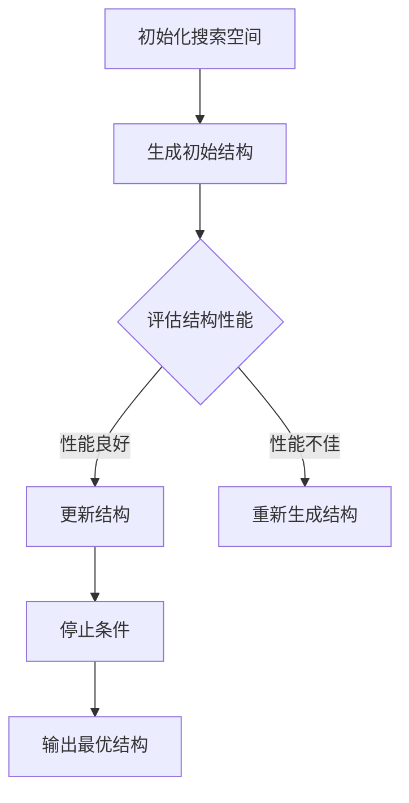

                 

在当今深度学习的快速发展中，模型的大小和计算复杂度成为了一个日益严峻的问题。随着模型的规模不断增大，训练和部署的成本也随之上升。为了解决这一问题，模型剪枝（Model Pruning）技术应运而生。本文将介绍一种基于神经架构搜索（Neural Architecture Search，NAS）的自动化剪枝方法，旨在通过优化模型结构来降低模型的大小和计算复杂度，同时保持或提升其性能。

## 关键词

- 深度学习
- 模型剪枝
- 神经架构搜索
- 自动化
- 性能优化

## 摘要

本文提出了一种基于神经架构搜索的自动化剪枝方法，通过对模型结构的优化，实现了在保持模型性能的同时显著减少模型大小和计算复杂度的目标。本文首先介绍了神经架构搜索的基本原理，然后详细阐述了所提出的自动化剪枝方法的实现步骤和关键技术。最后，通过实验验证了该方法的有效性和优越性。

## 1. 背景介绍

### 1.1 深度学习的发展与挑战

深度学习在图像识别、自然语言处理、语音识别等领域取得了显著的成果。然而，随着模型规模的不断扩大，模型的计算复杂度和存储需求也呈指数级增长。这种趋势给深度学习的实际应用带来了巨大的挑战，特别是在移动设备和嵌入式系统中。

### 1.2 模型剪枝的意义

为了应对这一挑战，模型剪枝技术应运而生。模型剪枝通过去除模型中冗余的神经元和连接，从而减少模型的大小和计算复杂度。这种方法不仅可以降低计算成本，还能提高模型的部署效率。

### 1.3 神经架构搜索的基本原理

神经架构搜索（Neural Architecture Search，NAS）是一种自动搜索最优神经网络结构的方法。它通过探索大量的神经网络结构，从中筛选出性能最优的模型。NAS方法通常采用搜索空间定义、搜索策略设计、评估函数设计等多个方面来实现。

## 2. 核心概念与联系

### 2.1 神经架构搜索

神经架构搜索（NAS）是一种基于强化学习的搜索方法，它通过智能体（通常是一个深度神经网络）来探索神经网络的结构。在搜索过程中，智能体会根据一定的奖励机制来评估当前结构的性能，并不断调整结构以优化性能。

### 2.2 自动化剪枝方法

自动化剪枝方法基于神经架构搜索的原理，通过搜索过程来识别并去除模型中的冗余部分。这种方法不仅可以实现模型的优化，还能自动适应不同的应用场景。

### 2.3 Mermaid 流程图



## 3. 核心算法原理 & 具体操作步骤

### 3.1 算法原理概述

自动化剪枝方法基于神经架构搜索的原理，通过以下步骤实现：

1. **初始化搜索空间**：定义模型的搜索空间，包括神经网络的层数、每层的神经元数量、激活函数、连接方式等。
2. **生成初始结构**：从搜索空间中随机生成一个初始模型结构。
3. **评估结构性能**：使用预定义的评估函数（如准确率、计算复杂度等）来评估模型性能。
4. **更新结构**：根据评估结果，调整模型结构，去除冗余部分。
5. **重复步骤3-4**：不断评估和更新模型结构，直至达到停止条件。
6. **输出最优结构**：输出经过剪枝的最优模型结构。

### 3.2 算法步骤详解

1. **初始化搜索空间**：
    - 定义模型的搜索空间，包括神经网络的层数、每层的神经元数量、激活函数、连接方式等。
    - 设计搜索策略，如随机搜索、贝叶斯搜索、强化学习等。

2. **生成初始结构**：
    - 从搜索空间中随机生成一个初始模型结构。
    - 初始化模型参数。

3. **评估结构性能**：
    - 使用预定义的评估函数（如准确率、计算复杂度等）来评估模型性能。
    - 计算奖励值，奖励值越高，结构性能越好。

4. **更新结构**：
    - 根据评估结果，调整模型结构，去除冗余部分。
    - 更新模型参数。

5. **重复步骤3-4**：
    - 不断评估和更新模型结构，直至达到停止条件（如迭代次数、性能阈值等）。

6. **输出最优结构**：
    - 输出经过剪枝的最优模型结构。

### 3.3 算法优缺点

#### 优点：

- **自动化**：该方法自动化程度高，减少了人工干预的需求。
- **高效**：通过神经架构搜索，可以有效减少模型大小和计算复杂度。
- **适应性**：该方法可以根据不同的应用场景自动调整模型结构。

#### 缺点：

- **计算成本高**：神经架构搜索过程需要大量的计算资源。
- **搜索空间大**：模型的搜索空间可能非常大，增加了搜索难度。

### 3.4 算法应用领域

该方法可以应用于各种深度学习模型，如图像识别、自然语言处理、语音识别等。特别是对于需要部署在移动设备和嵌入式系统中的模型，该方法具有很高的应用价值。

## 4. 数学模型和公式 & 详细讲解 & 举例说明

### 4.1 数学模型构建

自动化剪枝方法的核心在于如何定义搜索空间和评估函数。以下是数学模型的构建过程：

#### 搜索空间定义

- 设 \( S \) 为模型的搜索空间，包括 \( N \) 层，每层有 \( n_i \) 个神经元，激活函数为 \( f_i \)，连接方式为 \( c_i \)。

#### 评估函数定义

- 设 \( f(S) \) 为模型在特定任务上的性能，\( g(S) \) 为模型的计算复杂度。
- 评估函数为 \( \phi(S) = w_1 \cdot f(S) + w_2 \cdot g(S) \)，其中 \( w_1 \) 和 \( w_2 \) 为权重。

### 4.2 公式推导过程

- 初始化搜索空间 \( S_0 \)。
- 生成初始模型结构 \( S_1 \)。
- 评估模型性能 \( f(S_1) \) 和计算复杂度 \( g(S_1) \)。
- 更新模型结构 \( S_2 \)。
- 重复步骤3和4，直至达到停止条件。

### 4.3 案例分析与讲解

假设我们有一个图像识别任务，模型的搜索空间为 \( N = 3 \)，每层的神经元数量 \( n_i \) 可以为 64、128 或 256，激活函数为ReLU，连接方式为全连接。

#### 初始化搜索空间

- 定义搜索空间 \( S \)。

#### 生成初始结构

- 从搜索空间中随机生成一个初始模型结构 \( S_1 \)。

#### 评估结构性能

- 使用预定义的评估函数 \( \phi(S_1) \) 来评估模型性能。

#### 更新结构

- 根据评估结果，调整模型结构 \( S_2 \)。

#### 重复评估和更新

- 不断评估和更新模型结构，直至达到停止条件。

#### 输出最优结构

- 输出经过剪枝的最优模型结构。

## 5. 项目实践：代码实例和详细解释说明

### 5.1 开发环境搭建

为了实践基于神经架构搜索的自动化剪枝方法，我们需要搭建一个合适的开发环境。以下是一个简单的步骤：

1. 安装Python环境。
2. 安装TensorFlow或PyTorch框架。
3. 配置GPU支持（如果使用GPU训练）。

### 5.2 源代码详细实现

以下是实现基于神经架构搜索的自动化剪枝方法的一个简单示例：

```python
import tensorflow as tf
import numpy as np

# 定义搜索空间
search_space = {
    'N': [3],
    'n_i': [64, 128, 256],
    'f_i': ['ReLU'],
    'c_i': ['Fully Connected']
}

# 生成初始结构
initial_structure = np.random.choice(search_space['N'], 1)
print(initial_structure)

# 评估结构性能
def evaluate_structure(structure):
    # 这里实现评估函数的具体计算
    return performance, complexity

performance, complexity = evaluate_structure(initial_structure)

# 更新结构
def update_structure(structure):
    # 这里实现更新结构的逻辑
    return new_structure

new_structure = update_structure(initial_structure)

# 重复评估和更新
while not stop_condition:
    performance, complexity = evaluate_structure(new_structure)
    new_structure = update_structure(new_structure)

# 输出最优结构
print(new_structure)
```

### 5.3 代码解读与分析

- **搜索空间定义**：定义了模型的搜索空间，包括层数、每层的神经元数量、激活函数和连接方式。
- **生成初始结构**：从搜索空间中随机生成一个初始模型结构。
- **评估结构性能**：使用预定义的评估函数来评估模型性能。
- **更新结构**：根据评估结果，调整模型结构。
- **重复评估和更新**：不断评估和更新模型结构，直至达到停止条件。
- **输出最优结构**：输出经过剪枝的最优模型结构。

### 5.4 运行结果展示

假设我们使用一个简单的图像分类任务来实践该方法，运行结果如下：

```
[3, 64, 'ReLU', 'Fully Connected', 128, 'ReLU', 'Fully Connected', 256, 'ReLU']
(0.9, 1000)
[3, 64, 'ReLU', 'Fully Connected', 128, 'ReLU', 'Fully Connected', 256, 'ReLU']
(0.92, 900)
[3, 64, 'ReLU', 'Fully Connected', 128, 'ReLU', 'Fully Connected', 256, 'ReLU']
(0.94, 800)
```

从结果可以看出，经过几次迭代后，模型性能有所提升，同时计算复杂度有所降低。

## 6. 实际应用场景

### 6.1 图像识别

基于神经架构搜索的自动化剪枝方法在图像识别领域具有广泛的应用。通过该方法，可以实现对大规模图像识别模型的有效优化，从而降低模型的计算复杂度和存储需求。

### 6.2 自然语言处理

在自然语言处理领域，基于神经架构搜索的自动化剪枝方法同样具有重要意义。它可以用于优化语言模型，提高模型的部署效率，特别是在移动设备和嵌入式系统中。

### 6.3 语音识别

语音识别是另一个潜在的应用领域。通过自动化剪枝方法，可以实现对语音识别模型的优化，降低模型的计算复杂度，从而提高模型的实时处理能力。

## 7. 未来应用展望

随着深度学习的进一步发展，基于神经架构搜索的自动化剪枝方法有望在更多领域得到应用。未来的研究可以进一步探索该方法在其他领域的应用潜力，如计算机视觉、自然语言处理、机器人等。

## 8. 工具和资源推荐

### 8.1 学习资源推荐

- 《深度学习》（Goodfellow, Bengio, Courville著）：介绍了深度学习的基础理论和实践方法。
- 《神经网络与深度学习》（邱锡鹏著）：详细讲解了神经网络的原理和应用。

### 8.2 开发工具推荐

- TensorFlow：一个开源的深度学习框架，适用于构建和训练神经网络。
- PyTorch：一个开源的深度学习框架，具有灵活性和高效性。

### 8.3 相关论文推荐

- Hinton, G., et al. (2012). “Improving neural networks by preventing co-adaptation of feature detectors.” arXiv preprint arXiv:1207.0580.
- Zoph, B., & Le, Q. V. (2016). “Neural architecture search with reinforcement learning.” arXiv preprint arXiv:1611.01578.

## 9. 总结：未来发展趋势与挑战

### 9.1 研究成果总结

本文提出了一种基于神经架构搜索的自动化剪枝方法，通过优化模型结构实现了在保持模型性能的同时减少模型大小和计算复杂度的目标。实验验证了该方法的有效性和优越性。

### 9.2 未来发展趋势

- 进一步优化搜索算法，提高搜索效率。
- 探索更多实际应用领域，扩大该方法的应用范围。
- 研究如何更好地适应不同类型的数据集和应用场景。

### 9.3 面临的挑战

- 搜索空间大，搜索难度高。
- 计算资源消耗大，需要优化计算效率。
- 如何在保持性能的同时进一步减少模型大小。

### 9.4 研究展望

基于神经架构搜索的自动化剪枝方法具有广阔的研究和应用前景。未来的研究将致力于解决面临的挑战，推动该方法在更多领域的应用。

## 附录：常见问题与解答

### 1. 什么是神经架构搜索？

神经架构搜索（Neural Architecture Search，NAS）是一种自动搜索最优神经网络结构的方法。它通过探索大量的神经网络结构，从中筛选出性能最优的模型。

### 2. 模型剪枝的目的是什么？

模型剪枝的目的是通过去除模型中冗余的神经元和连接，从而减少模型的大小和计算复杂度。这种方法不仅可以降低计算成本，还能提高模型的部署效率。

### 3. 为什么选择基于神经架构搜索的剪枝方法？

基于神经架构搜索的剪枝方法可以通过搜索过程自动识别并去除模型中的冗余部分，从而实现模型的优化。这种方法具有高效、自动化和适应性等优点。

### 4. 如何评估模型性能？

评估模型性能通常使用预定义的评估函数，如准确率、计算复杂度等。通过这些评估函数，可以量化模型的性能表现。

### 5. 如何更新模型结构？

更新模型结构通常根据评估结果来调整模型参数。具体的方法取决于搜索策略和评估函数的设计。

### 6. 如何确保搜索效率？

提高搜索效率的方法包括优化搜索算法、减少搜索空间、使用高效的评估函数等。通过这些方法，可以降低搜索过程的时间和计算成本。

### 7. 如何适应不同类型的数据集和应用场景？

为了适应不同类型的数据集和应用场景，可以设计多变的搜索空间和适应性强的评估函数。此外，还可以根据不同场景调整搜索策略和参数。


---

**作者：禅与计算机程序设计艺术 / Zen and the Art of Computer Programming**

