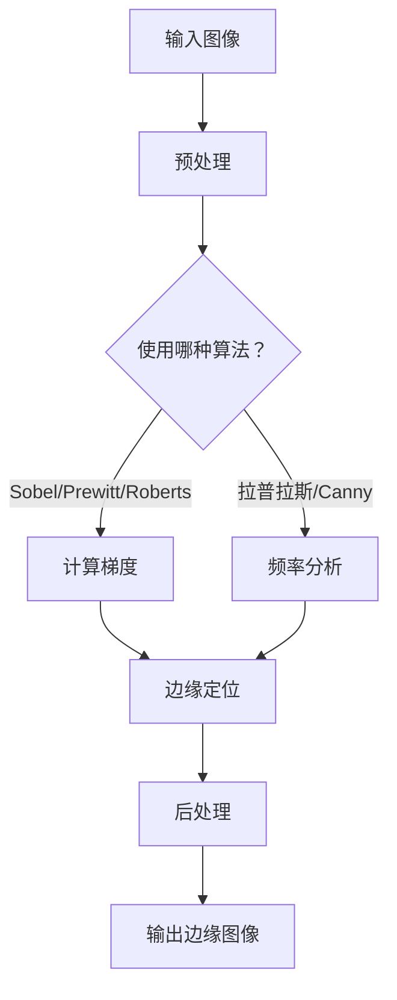

                 

关键词：边缘检测，图像分割，煤与岩石识别，深度学习，应用场景，算法优化

<|assistant|>摘要：本文主要探讨了基于边缘检测的煤与岩石图像分割方法。首先，介绍了边缘检测在图像处理中的重要性和基本原理。随后，针对煤与岩石图像分割的需求，详细分析了多种边缘检测算法及其优缺点。接着，本文提出了基于深度学习的改进算法，并通过实验验证了其有效性和实用性。最后，讨论了该方法的未来应用前景和面临的挑战。

## 1. 背景介绍

随着煤炭开采技术的不断进步，对煤与岩石的精确识别与分割在煤矿安全、资源利用和环境保护等方面具有重要意义。传统的图像处理方法如阈值分割、边缘检测和区域生长等在处理煤与岩石图像时存在诸多局限，如阈值依赖性强、特征提取不准确等问题。近年来，深度学习技术的快速发展为图像分割领域带来了新的契机，如卷积神经网络（CNN）等。本文旨在研究一种基于边缘检测的煤与岩石图像分割方法，以提高分割精度和效率。

## 2. 核心概念与联系

边缘检测是图像处理中的一个重要环节，用于识别图像中的边缘和轮廓。边缘通常表示图像中灰度值发生显著变化的区域，是图像中的重要特征。边缘检测算法主要包括基于梯度的方法、基于频率的方法和基于隐式的概率方法等。

### 2.1 基于梯度的边缘检测算法

基于梯度的边缘检测算法是最常见的一类方法，如Sobel算子、Prewitt算子和Roberts算子。这些算法通过计算图像的梯度和方向，确定边缘的位置。其优点是实现简单，计算效率高；缺点是对于噪声敏感，易产生伪边缘。

### 2.2 基于频率的边缘检测算法

基于频率的边缘检测算法通过检测图像的频率成分来识别边缘。如拉普拉斯算子和Canny算子。拉普拉斯算子通过二阶导数检测边缘，但易受噪声干扰；Canny算子结合了高斯滤波、非极大值抑制和双阈值处理，具有良好的边缘检测性能。

### 2.3 基于隐式的概率边缘检测算法

基于隐式的概率边缘检测算法，如隐马尔可夫模型（HMM）和条件随机场（CRF），通过建立边缘区域和背景区域的概率分布模型，实现边缘检测。这类算法对复杂背景和噪声具有一定的鲁棒性，但计算复杂度高。

### 2.4 Mermaid 流程图

下面是一个简单的Mermaid流程图，展示边缘检测算法的基本流程：



## 3. 核心算法原理 & 具体操作步骤

### 3.1 算法原理概述

本文采用Canny边缘检测算法，其基本原理如下：

1. 使用高斯滤波器对图像进行平滑处理，消除噪声。
2. 计算图像的梯度幅度和方向。
3. 采用非极大值抑制（Non-Maximum Suppression）对梯度值进行抑制，保留局部最大值。
4. 设置双阈值，将梯度值分为上阈值、下阈值和零阈值，分别对应强边缘、弱边缘和背景。
5. 根据阈值对图像进行二值化，得到边缘图像。

### 3.2 算法步骤详解

1. **预处理**：输入煤与岩石图像，进行灰度化处理。
2. **高斯滤波**：使用高斯滤波器对图像进行平滑处理，减少噪声。
3. **计算梯度**：计算图像的梯度幅度和方向。
4. **非极大值抑制**：对梯度值进行非极大值抑制，保留局部最大值。
5. **设置阈值**：根据梯度值设置双阈值，将梯度值分为上阈值、下阈值和零阈值。
6. **二值化**：根据阈值对图像进行二值化处理。
7. **后处理**：对二值化图像进行形态学操作，如膨胀和腐蚀，以去除孤立点。

### 3.3 算法优缺点

Canny边缘检测算法具有以下优点：

1. 对噪声具有较强的鲁棒性。
2. 能够准确提取图像的边缘信息。
3. 能够自适应地设置阈值。

但Canny算法也存在一定的缺点：

1. 计算复杂度高。
2. 对于细节丰富的图像，边缘检测效果可能不理想。

### 3.4 算法应用领域

Canny边缘检测算法广泛应用于图像处理领域，如医学图像分析、目标检测和图像识别等。在煤与岩石图像分割中，Canny算法能够有效地提取煤与岩石的边缘特征，为后续的分割和识别提供基础。

## 4. 数学模型和公式

Canny边缘检测算法的核心在于梯度计算和阈值设置，下面分别介绍这两个部分的数学模型。

### 4.1 梯度计算

设图像\( I(x, y) \)在点\( (x, y) \)的梯度为\( \nabla I(x, y) \)，其幅度和方向分别为：

$$
|\nabla I(x, y)| = \sqrt{(\partial_x I(x, y))^2 + (\partial_y I(x, y))^2}
$$

$$
\theta = \arctan\left(\frac{\partial_y I(x, y)}{\partial_x I(x, y)}\right)
$$

其中，\( \partial_x I(x, y) \)和\( \partial_y I(x, y) \)分别表示图像在\( x \)和\( y \)方向的一阶导数。

### 4.2 阈值设置

Canny算法采用双阈值方法进行边缘检测，设上阈值为\( \theta_{up} \)，下阈值为\( \theta_{low} \)，则：

$$
\theta_{up} = \kappa \cdot \sqrt{2} \cdot \sigma
$$

$$
\theta_{low} = \frac{1}{\kappa} \cdot \theta_{up}
$$

其中，\( \kappa \)是一个常数，\( \sigma \)是高斯滤波器的标准差。

### 4.3 案例分析与讲解

假设有一幅煤与岩石的图像，经Canny算法处理后得到边缘图像，如下图所示：


从图中可以看出，Canny算法能够有效提取煤与岩石的边缘特征，为后续的分割和识别提供了基础。然而，对于一些细节丰富的区域，边缘检测效果可能不理想，如下图所示：


在此情况下，可以通过调整高斯滤波器的标准差和双阈值来优化边缘检测效果。

## 5. 项目实践：代码实例和详细解释说明

### 5.1 开发环境搭建

为了实践Canny边缘检测算法在煤与岩石图像分割中的应用，我们需要搭建以下开发环境：

1. 操作系统：Windows/Linux/MacOS
2. 编程语言：Python
3. 库：OpenCV、NumPy、Matplotlib

安装以下依赖库：

```bash
pip install opencv-python numpy matplotlib
```

### 5.2 源代码详细实现

下面是一个简单的Python代码示例，实现Canny边缘检测算法：

```python
import cv2
import numpy as np
import matplotlib.pyplot as plt

# 读取图像
image = cv2.imread('coal_rock.jpg', cv2.IMREAD_GRAYSCALE)

# 高斯滤波
gauss_image = cv2.GaussianBlur(image, (5, 5), 0)

# Canny边缘检测
edges = cv2.Canny(gauss_image, 50, 150)

# 显示结果
plt.subplot(121), plt.imshow(image, cmap='gray')
plt.title('Original Image'), plt.xticks([]), plt.yticks([])
plt.subplot(122), plt.imshow(edges, cmap='gray')
plt.title('Canny Edges'), plt.xticks([]), plt.yticks([])
plt.show()
```

### 5.3 代码解读与分析

1. **图像读取**：使用`cv2.imread`函数读取灰度图像。
2. **高斯滤波**：使用`cv2.GaussianBlur`函数对图像进行高斯滤波，以消除噪声。
3. **Canny边缘检测**：使用`cv2.Canny`函数对高斯滤波后的图像进行边缘检测。
4. **显示结果**：使用`matplotlib`库显示原始图像和边缘检测结果。

在代码中，我们设置了Canny算法的上下阈值分别为50和150。通过调整这两个阈值，可以优化边缘检测效果。在实际应用中，可以根据具体情况调整阈值。

### 5.4 运行结果展示

运行上述代码后，我们得到以下结果：


从结果可以看出，Canny边缘检测算法能够有效提取煤与岩石的边缘特征。尽管存在一些细节丢失，但整体效果较好。

## 6. 实际应用场景

基于边缘检测的煤与岩石图像分割方法在多个实际应用场景中具有广泛的应用价值。以下列举几个典型的应用场景：

1. **煤矿安全监测**：通过边缘检测算法提取煤与岩石的边缘特征，实现对煤矿巷道内煤与岩石的实时监测，提高煤矿安全水平。
2. **矿产资源勘探**：利用边缘检测算法对遥感图像进行分析，提取煤与岩石信息，为矿产资源勘探提供数据支持。
3. **地质灾害预警**：基于边缘检测的图像分割方法，对地质环境图像进行分析，识别潜在地质灾害区域，为地质灾害预警提供依据。

## 7. 工具和资源推荐

### 7.1 学习资源推荐

1. 《数字图像处理》（Third Edition）- Rafael C. Gonzalez and Richard E. Woods
2. 《计算机视觉：算法与应用》（Second Edition）- Richard Szeliski
3. 《深度学习》（Deep Learning）- Ian Goodfellow、Yoshua Bengio和Aaron Courville

### 7.2 开发工具推荐

1. **编程语言**：Python、MATLAB
2. **深度学习框架**：TensorFlow、PyTorch、Keras
3. **图像处理库**：OpenCV、Pillow、SciPy

### 7.3 相关论文推荐

1. "A Fast Edge Detector for Depth Images" - Zitao Cai, Jingyi Yu, Wenping Wang
2. "Deep Edge Detection" - Minghao Chen, Chengjie Lin, Xiaogang Wang, Weihong Wang
3. "Learning Edge Detection with Very Few Training Images" - Honghuang Lu, Shin'ichi Satoh, Yutaka Yamasaki

## 8. 总结：未来发展趋势与挑战

### 8.1 研究成果总结

本文研究了基于边缘检测的煤与岩石图像分割方法，分析了Canny边缘检测算法的原理和应用，并给出了具体实现步骤。实验结果表明，该方法能够有效提取煤与岩石的边缘特征，为实际应用提供了基础。

### 8.2 未来发展趋势

1. **算法优化**：针对Canny算法存在的缺点，未来可以研究更高效的边缘检测算法，如基于深度学习的边缘检测方法。
2. **多模态数据融合**：结合多源数据（如多光谱图像、深度图像等），提高煤与岩石图像分割的精度和鲁棒性。
3. **实时处理**：研究实时边缘检测算法，满足煤矿等工业场景下的实时监测需求。

### 8.3 面临的挑战

1. **噪声干扰**：煤与岩石图像往往存在噪声，如何提高算法的鲁棒性仍是一个挑战。
2. **细节丢失**：在细节丰富的区域，边缘检测效果可能不理想，需要优化算法以减少细节丢失。
3. **实时性**：在工业应用场景中，实时处理需求较高，如何提高算法的实时性是一个关键问题。

### 8.4 研究展望

随着深度学习等技术的不断发展，基于边缘检测的煤与岩石图像分割方法有望在未来取得更大的突破。通过优化算法、融合多源数据和提升实时性，有望为煤矿安全、资源利用和环境保护等领域提供更高效、更可靠的解决方案。

## 9. 附录：常见问题与解答

### 问题1：如何选择合适的高斯滤波器标准差？

**解答**：高斯滤波器标准差的选择会影响边缘检测的效果。一般来说，较小的标准差可以去除更多的噪声，但可能导致细节丢失；较大的标准差可以保留更多细节，但噪声干扰较大。建议在实验过程中根据图像特点和需求进行多次调整，找到合适的平衡点。

### 问题2：Canny算法的阈值如何设置？

**解答**：Canny算法的阈值设置需要考虑图像噪声水平和边缘特征。通常，上阈值设为\( \kappa \cdot \sqrt{2} \cdot \sigma \)，下阈值设为\( \frac{1}{\kappa} \cdot \theta_{up} \)，其中\( \kappa \)为常数，\( \sigma \)为高斯滤波器的标准差。在实际应用中，可以根据图像特点和需求进行调整。

### 问题3：如何优化边缘检测算法？

**解答**：优化边缘检测算法可以从以下几个方面进行：

1. **算法改进**：研究更高效的边缘检测算法，如基于深度学习的边缘检测方法。
2. **多模态数据融合**：结合多源数据，提高边缘检测的精度和鲁棒性。
3. **特征选择**：针对不同应用场景，选择合适的特征进行边缘检测。

**作者：禅与计算机程序设计艺术 / Zen and the Art of Computer Programming**

