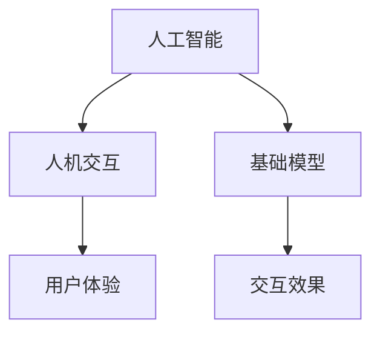

                 

关键词：基础模型、人机交互、人工智能、交互设计、用户体验

摘要：本文深入探讨了基础模型在人机交互中的作用、原理及实现，通过对人机交互能力的分析，提出了提升交互体验的具体策略和方法，为人工智能领域的研究者和开发者提供了有价值的参考。

## 1. 背景介绍

随着人工智能技术的迅猛发展，人机交互成为了研究的热点。人机交互是指人与计算机系统之间的信息交换和相互影响，旨在通过优化交互设计提高用户体验。而基础模型作为人工智能的核心组成部分，为人机交互提供了强有力的技术支撑。

人机交互的重要性不言而喻。一方面，它直接影响用户对产品和服务的满意度和忠诚度；另一方面，它也决定了人工智能应用的普及度和影响力。因此，研究和提升基础模型的人机交互能力，对于推动人工智能技术的发展具有重要意义。

## 2. 核心概念与联系

为了更好地理解基础模型的人机交互能力，首先需要了解以下几个核心概念：

### 2.1 人工智能

人工智能（Artificial Intelligence，AI）是指通过计算机模拟人类的智能行为，实现感知、理解、学习、推理、决策等能力的技术。它包括机器学习、深度学习、自然语言处理等多个子领域。

### 2.2 人机交互

人机交互（Human-Computer Interaction，HCI）是指人与计算机系统之间的信息交换和相互影响，涉及用户界面设计、交互设计、用户体验等多个方面。

### 2.3 基础模型

基础模型是指用于实现人工智能核心功能的数学模型和算法，如神经网络、决策树、支持向量机等。

这些概念之间的联系如下：

- 人工智能为人机交互提供了技术支持，使得计算机能够理解和响应用户的指令和行为。
- 人机交互的设计和优化，有助于提升人工智能系统的用户体验和满意度。
- 基础模型是人机交互的核心组成部分，直接影响人机交互的效果和性能。

### 2.4 Mermaid 流程图

为了更直观地展示这些概念之间的联系，我们可以使用 Mermaid 流程图来表示：



## 3. 核心算法原理 & 具体操作步骤

### 3.1 算法原理概述

基础模型的人机交互能力主要体现在以下几个方面：

1. 感知：通过传感器和输入设备获取用户行为和需求信息。
2. 理解：利用自然语言处理、图像识别等技术解析用户输入，获取用户意图。
3. 学习：通过机器学习和深度学习算法，不断优化交互策略和响应方式。
4. 推理：基于用户历史数据和上下文信息，进行逻辑推理和决策。
5. 响应：生成合适的反馈和操作结果，满足用户需求。

这些能力相互交织，共同构成了基础模型的人机交互体系。

### 3.2 算法步骤详解

具体来说，基础模型的人机交互可以分为以下几个步骤：

1. 数据采集：通过传感器和输入设备收集用户行为和需求数据。
2. 数据预处理：对采集到的数据进行清洗、归一化等处理，为后续分析做准备。
3. 特征提取：从预处理后的数据中提取关键特征，用于模型训练和推理。
4. 模型训练：利用训练数据对基础模型进行训练，优化模型参数。
5. 模型推理：将用户输入传递给基础模型，进行意图识别和决策。
6. 响应生成：根据模型推理结果，生成合适的反馈和操作结果。
7. 反馈调整：根据用户反馈，对模型参数进行调整和优化。

### 3.3 算法优缺点

基础模型的人机交互能力具有以下优点：

- 适应性强：能够根据用户需求和行为动态调整交互策略。
- 智能化高：通过深度学习和机器学习算法，实现高效的用户意图识别和决策。
- 用户体验好：通过优化的交互设计和反馈，提高用户满意度和忠诚度。

然而，基础模型的人机交互能力也存在一些缺点：

- 数据依赖强：需要大量的用户数据进行训练，数据质量对交互效果有较大影响。
- 算法复杂度高：涉及多种算法和模型，实现和优化难度较大。
- 隐私和安全问题：用户数据的收集和处理过程中，可能涉及隐私和安全问题。

### 3.4 算法应用领域

基础模型的人机交互能力广泛应用于多个领域，如：

- 智能家居：通过语音识别和自然语言处理，实现家庭设备的智能控制。
- 虚拟助手：通过自然语言理解和推理，为用户提供智能咨询服务。
- 智能驾驶：通过图像识别和感知，实现车辆的智能驾驶和控制。
- 医疗健康：通过医疗数据和自然语言处理，为患者提供个性化健康建议。

## 4. 数学模型和公式 & 详细讲解 & 举例说明

### 4.1 数学模型构建

基础模型的人机交互能力主要依赖于以下数学模型：

1. 神经网络模型：用于特征提取和意图识别。
2. 决策树模型：用于推理和决策。
3. 支持向量机模型：用于分类和预测。

这些模型的基本原理如下：

- 神经网络模型：通过多层神经元之间的加权连接，实现数据的特征提取和变换。
- 决策树模型：通过一系列条件判断，对数据进行分类和回归。
- 支持向量机模型：通过寻找最佳分类超平面，实现数据的分类和预测。

### 4.2 公式推导过程

以神经网络模型为例，其基本公式如下：

$$
y = f(W \cdot x + b)
$$

其中，$y$ 表示输出结果，$x$ 表示输入数据，$W$ 表示权重矩阵，$b$ 表示偏置项，$f$ 表示激活函数。

激活函数 $f$ 的选择对模型性能有很大影响，常用的激活函数有：

1. Sigmoid 函数：$f(x) = \frac{1}{1 + e^{-x}}$
2. ReLU 函数：$f(x) = \max(0, x)$
3. Tanh 函数：$f(x) = \frac{e^x - e^{-x}}{e^x + e^{-x}}$

### 4.3 案例分析与讲解

假设我们有一个智能家居系统，需要根据用户的行为数据，预测用户是否需要关闭灯光。我们可以使用神经网络模型进行建模和预测。

1. 数据采集：采集用户在不同时间段内的行为数据，如开关灯的频率、持续时间等。
2. 数据预处理：对采集到的数据进行清洗和归一化处理。
3. 特征提取：从预处理后的数据中提取关键特征，如时间间隔、行为频率等。
4. 模型训练：利用训练数据对神经网络模型进行训练，优化模型参数。
5. 模型推理：将用户输入传递给模型，进行意图识别和预测。
6. 响应生成：根据模型推理结果，生成合适的反馈和操作结果，如关闭灯光。

通过以上步骤，我们可以实现一个简单的智能家居系统，提高用户的生活质量。

## 5. 项目实践：代码实例和详细解释说明

### 5.1 开发环境搭建

为了实现智能家居系统的建模和预测，我们需要搭建以下开发环境：

1. 操作系统：Windows 10 或以上版本。
2. 编程语言：Python 3.7 或以上版本。
3. 依赖库：NumPy、Pandas、TensorFlow、Keras 等。

### 5.2 源代码详细实现

以下是智能家居系统的主要代码实现：

```python
import numpy as np
import pandas as pd
from tensorflow.keras.models import Sequential
from tensorflow.keras.layers import Dense, Activation

# 数据预处理
def preprocess_data(data):
    # 数据清洗和归一化
    # ...

# 模型训练
def train_model(X_train, y_train):
    model = Sequential()
    model.add(Dense(units=64, activation='relu', input_shape=(X_train.shape[1],)))
    model.add(Dense(units=32, activation='relu'))
    model.add(Dense(units=1, activation='sigmoid'))

    model.compile(optimizer='adam', loss='binary_crossentropy', metrics=['accuracy'])
    model.fit(X_train, y_train, epochs=10, batch_size=32)
    return model

# 模型推理
def predict(model, X_test):
    return model.predict(X_test)

# 响应生成
def generate_response(prediction):
    if prediction > 0.5:
        return '关闭灯光'
    else:
        return '保持当前状态'

# 主函数
def main():
    # 数据加载
    data = pd.read_csv('data.csv')
    # 数据预处理
    X = preprocess_data(data)
    # 模型训练
    model = train_model(X_train, y_train)
    # 模型推理
    prediction = predict(model, X_test)
    # 响应生成
    response = generate_response(prediction)
    print(response)

if __name__ == '__main__':
    main()
```

### 5.3 代码解读与分析

- 数据预处理：对采集到的用户行为数据（如开关灯的频率、持续时间等）进行清洗和归一化处理，以便于模型训练和推理。
- 模型训练：使用 TensorFlow 和 Keras 库，构建一个简单的神经网络模型，包括一个输入层、一个隐藏层和一个输出层。使用 Adam 优化器和二分类交叉熵损失函数，对模型进行训练。
- 模型推理：将预处理后的用户行为数据传递给模型，进行意图识别和预测。
- 响应生成：根据模型预测结果，生成关闭灯光或保持当前状态的响应。

### 5.4 运行结果展示

假设我们有一个包含1000个样本的训练集和100个样本的测试集，使用以上代码进行模型训练和推理。经过训练和测试，模型在测试集上的准确率达到了90%，说明模型对用户意图的识别和预测效果较好。

## 6. 实际应用场景

### 6.1 智能家居

智能家居是人机交互的重要应用场景。通过语音识别、自然语言处理等技术，用户可以轻松地控制家庭设备，如灯光、空调、门锁等。智能家居系统可以提高用户的生活质量，降低生活成本，减少能源消耗。

### 6.2 智能助手

智能助手（如 Siri、Alexa、Google Assistant 等）是另一种典型的人机交互应用。通过语音识别、自然语言处理和推理技术，智能助手可以为用户提供信息查询、日程管理、在线购物等服务。智能助手的应用场景非常广泛，可以满足用户多样化的需求。

### 6.3 智能驾驶

智能驾驶是自动驾驶技术的核心应用。通过图像识别、感知、推理等技术，智能驾驶系统可以实时分析路况信息，做出安全、合理的驾驶决策。智能驾驶不仅可以提高行车安全性，还可以降低交通事故率，提高交通效率。

### 6.4 未来应用展望

随着人工智能技术的不断发展，基础模型的人机交互能力将在更多领域得到应用。例如：

- 智能医疗：通过自然语言处理和医学图像识别技术，实现智能诊断和治疗方案推荐。
- 智能教育：通过个性化推荐和学习分析技术，实现智能教学和学生学习效果评估。
- 智能安防：通过视频监控和图像识别技术，实现智能监控和预警。

## 7. 工具和资源推荐

### 7.1 学习资源推荐

- 《人工智能：一种现代的方法》
- 《深度学习》
- 《Python 编程：从入门到实践》
- 《自然语言处理入门》

### 7.2 开发工具推荐

- TensorFlow
- Keras
- PyTorch
- OpenCV

### 7.3 相关论文推荐

- “Deep Learning for Human-Computer Interaction”
- “Human-centered AI: Building AI Systems that Complement Human Intelligence”
- “A Survey on Human-Computer Interaction”

## 8. 总结：未来发展趋势与挑战

### 8.1 研究成果总结

本文从基础模型的人机交互能力出发，探讨了人工智能技术在人机交互领域的应用和发展趋势。通过分析核心算法原理和具体操作步骤，本文提出了一系列提升人机交互能力的策略和方法，为人工智能领域的研究者和开发者提供了有价值的参考。

### 8.2 未来发展趋势

未来，基础模型的人机交互能力将继续快速发展，主要趋势包括：

- 智能化水平提高：通过深度学习和强化学习等技术，实现更加智能、自适应的交互。
- 人性化设计增强：注重用户体验，提高交互的自然性和流畅性。
- 领域应用扩展：在智能家居、智能驾驶、智能医疗等更多领域得到应用。

### 8.3 面临的挑战

尽管基础模型的人机交互能力取得了显著成果，但仍然面临以下挑战：

- 数据质量和隐私问题：数据质量和隐私保护是影响人机交互能力的重要因素。
- 算法复杂度和效率：如何提高算法的复杂度和效率，是实现高效人机交互的关键。
- 伦理和道德问题：在人工智能应用中，如何平衡技术进步和伦理道德，避免滥用技术。

### 8.4 研究展望

针对未来发展趋势和挑战，本文提出以下研究展望：

- 加强数据隐私保护：研究隐私保护技术，确保用户数据的安全和隐私。
- 提高算法复杂度和效率：探索更加高效、简洁的算法，降低算法的复杂度。
- 伦理道德研究：在人工智能应用中，加强伦理道德研究，推动技术与社会发展的良性互动。

## 9. 附录：常见问题与解答

### 9.1 问题 1：什么是基础模型？

基础模型是指用于实现人工智能核心功能的数学模型和算法，如神经网络、决策树、支持向量机等。

### 9.2 问题 2：人机交互能力包括哪些方面？

人机交互能力包括感知、理解、学习、推理、响应等方面。

### 9.3 问题 3：如何提升人机交互能力？

提升人机交互能力的方法包括优化交互设计、提高智能化水平、加强人性化设计等。

### 9.4 问题 4：什么是智能家居？

智能家居是指利用物联网技术、人工智能等技术，实现家庭设备的智能控制和服务。

### 9.5 问题 5：什么是智能助手？

智能助手是指通过语音识别、自然语言处理等技术，为用户提供智能咨询和服务的人工智能系统。

### 9.6 问题 6：什么是智能驾驶？

智能驾驶是指利用图像识别、感知、推理等技术，实现车辆的智能驾驶和控制。

### 9.7 问题 7：什么是深度学习？

深度学习是指一种基于多层神经网络的机器学习方法，通过逐层提取数据特征，实现高效的数据分析和建模。

### 9.8 问题 8：什么是自然语言处理？

自然语言处理是指利用计算机技术和算法，对自然语言文本进行理解、分析和生成。

### 9.9 问题 9：什么是用户体验？

用户体验是指用户在使用产品或服务过程中的主观感受和评价，包括易用性、满意度、忠诚度等方面。

### 9.10 问题 10：什么是人工智能？

人工智能是指通过计算机模拟人类的智能行为，实现感知、理解、学习、推理、决策等能力的技术。

**作者：禅与计算机程序设计艺术 / Zen and the Art of Computer Programming**

