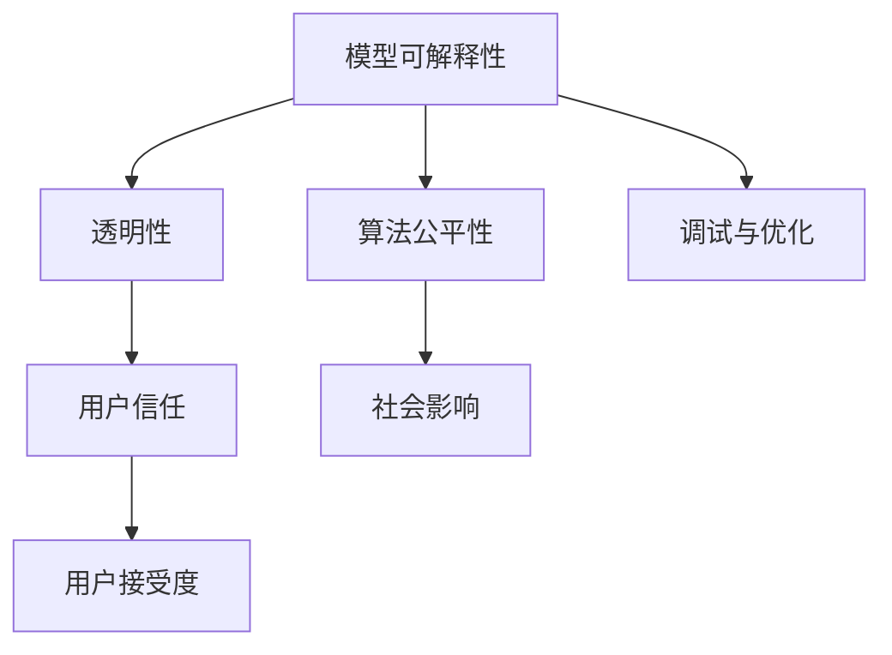

                 

关键词：基础模型、可解释性、机器学习、人工智能、透明性、用户信任、算法公平性

> 摘要：本文将探讨基础模型在人工智能领域的可解释性需求。随着机器学习技术的广泛应用，模型的可解释性变得越来越重要。本文将介绍可解释性的重要性，分析影响模型可解释性的因素，并提出提高模型可解释性的方法，旨在为人工智能领域的开发者和研究者提供指导。

## 1. 背景介绍

近年来，人工智能（AI）和机器学习（ML）技术取得了显著的进展，已经广泛应用于各个领域，从医疗诊断到金融分析，从自动驾驶到智能语音助手。然而，随着这些模型变得越来越复杂和强大，其不可解释性也成为一个越来越严重的问题。

不可解释的模型可能会导致以下问题：
1. **用户信任缺失**：用户难以理解模型的决策过程，从而对模型的可靠性和公正性产生怀疑。
2. **算法公平性挑战**：不可解释的模型可能包含不公平的偏见，导致对特定群体产生歧视。
3. **调试和优化困难**：开发者难以找到模型的错误，导致调试和优化过程变得复杂。

因此，提高模型的可解释性成为了人工智能研究中的一个重要方向。本文将探讨基础模型的可解释性需求，分析影响模型可解释性的因素，并探讨提高模型可解释性的方法。

## 2. 核心概念与联系

在讨论模型可解释性之前，我们需要了解一些核心概念和它们之间的关系。以下是一个简单的Mermaid流程图，展示了这些概念及其相互关系。



### 2.1. 透明性

透明性是指用户能够理解模型是如何做出决策的。一个高度透明的模型可以让用户清楚地看到模型的输入、中间步骤和输出。

### 2.2. 用户信任

用户信任是指用户对模型决策的信心和依赖程度。透明性是建立用户信任的重要基础。

### 2.3. 算法公平性

算法公平性是指模型对数据的处理不会对特定群体产生不公平的偏见。不可解释的模型可能会导致隐藏的偏见，影响算法的公平性。

### 2.4. 调试与优化

调试与优化是指开发者对模型进行修改和改进的过程。一个高度可解释的模型可以使得调试和优化变得更加容易。

### 2.5. 用户接受度

用户接受度是指用户对模型的接受程度和满意度。一个可解释的模型可能会提高用户的接受度。

### 2.6. 社会影响

社会影响是指模型对社会产生的积极或消极影响。一个高度可解释的模型可以减少潜在的负面影响。

## 3. 核心算法原理 & 具体操作步骤

### 3.1. 算法原理概述

提高模型可解释性的核心思想是通过减少模型复杂性、增加透明性和可访问性，使得用户能够理解和信任模型的决策过程。具体来说，以下是几种提高模型可解释性的方法：

1. **模型简化**：通过减少模型的参数数量和层结构，简化模型，使其更容易理解和解释。
2. **可视化技术**：使用图表、图像和其他可视化工具，将模型的决策过程和结果展示给用户。
3. **解释性算法**：开发专门的解释性算法，如LIME（Local Interpretable Model-agnostic Explanations）和SHAP（SHapley Additive exPlanations），这些算法可以提供模型决策的局部解释。
4. **调试工具**：开发调试工具，如Python中的`explain`库，帮助开发者理解和分析模型。

### 3.2. 算法步骤详解

1. **数据预处理**：确保数据的质量和一致性，这是提高模型可解释性的第一步。
2. **模型选择**：选择一个具有良好可解释性的模型，如线性回归、决策树或随机森林。
3. **模型训练**：使用训练数据训练模型，确保模型具有足够的准确性和鲁棒性。
4. **模型简化**：通过减少模型参数和层结构，简化模型。
5. **可视化**：使用可视化工具将模型的决策过程和结果展示给用户。
6. **解释性分析**：使用解释性算法，如LIME或SHAP，对模型进行局部解释。
7. **调试与优化**：使用调试工具，如`explain`库，对模型进行调试和优化。

### 3.3. 算法优缺点

**优点**：
- **提高用户信任**：通过增加模型透明性，提高用户对模型决策的信任。
- **改善算法公平性**：通过减少模型中的偏见，提高算法的公平性。
- **简化调试与优化**：通过提高模型可解释性，简化调试和优化过程。

**缺点**：
- **可能降低模型性能**：过度简化模型可能导致模型性能下降。
- **计算成本**：某些解释性算法（如LIME和SHAP）的计算成本较高。

### 3.4. 算法应用领域

提高模型可解释性的算法和技术可以应用于多个领域，包括：

- **医疗诊断**：帮助医生理解模型的诊断结果，提高诊断的准确性。
- **金融分析**：帮助金融分析师理解模型的预测结果，减少决策错误。
- **自动驾驶**：提高公众对自动驾驶系统的信任，降低交通事故的风险。

## 4. 数学模型和公式 & 详细讲解 & 举例说明

### 4.1. 数学模型构建

模型的可解释性可以通过数学模型来构建。以下是一个简单的线性回归模型，用于预测房价：

$$y = \beta_0 + \beta_1 \cdot x_1 + \beta_2 \cdot x_2 + ... + \beta_n \cdot x_n$$

其中，$y$是房价，$x_1, x_2, ..., x_n$是特征，$\beta_0, \beta_1, ..., \beta_n$是模型参数。

### 4.2. 公式推导过程

线性回归模型的推导过程如下：

1. **目标函数**：最小化误差平方和，即

$$J(\theta) = \frac{1}{2m} \sum_{i=1}^{m} (h_\theta(x^{(i)}) - y^{(i)})^2$$

其中，$h_\theta(x) = \theta_0 + \theta_1 \cdot x_1 + \theta_2 \cdot x_2 + ... + \theta_n \cdot x_n$是假设函数，$\theta_0, \theta_1, ..., \theta_n$是模型参数。

2. **梯度下降**：对目标函数求导，并使用梯度下降法更新模型参数，即

$$\theta_j := \theta_j - \alpha \cdot \frac{\partial J(\theta)}{\partial \theta_j}$$

其中，$\alpha$是学习率。

### 4.3. 案例分析与讲解

假设我们有一个简单的线性回归模型，用于预测房价。模型的目标函数如下：

$$J(\theta) = \frac{1}{2m} \sum_{i=1}^{m} ((\theta_0 + \theta_1 \cdot x_1^{(i)} + \theta_2 \cdot x_2^{(i)}) - y^{(i)})^2$$

给定一个训练集，我们可以使用梯度下降法来更新模型参数，从而最小化目标函数。具体步骤如下：

1. **初始化参数**：随机初始化$\theta_0, \theta_1, \theta_2$。
2. **计算梯度**：对目标函数求导，计算梯度$\frac{\partial J(\theta)}{\partial \theta_0}, \frac{\partial J(\theta)}{\partial \theta_1}, \frac{\partial J(\theta)}{\partial \theta_2}$。
3. **更新参数**：使用梯度下降法更新参数，即

$$\theta_0 := \theta_0 - \alpha \cdot \frac{\partial J(\theta)}{\partial \theta_0}$$
$$\theta_1 := \theta_1 - \alpha \cdot \frac{\partial J(\theta)}{\partial \theta_1}$$
$$\theta_2 := \theta_2 - \alpha \cdot \frac{\partial J(\theta)}{\partial \theta_2}$$

4. **重复步骤2和3**：重复计算梯度和更新参数，直到目标函数值不再显著下降。

通过这个简单的案例，我们可以看到如何构建和训练一个线性回归模型，从而提高模型的可解释性。

## 5. 项目实践：代码实例和详细解释说明

### 5.1. 开发环境搭建

为了演示如何提高模型的可解释性，我们将使用Python编程语言和Scikit-learn库。首先，我们需要安装必要的库：

```bash
pip install scikit-learn matplotlib
```

### 5.2. 源代码详细实现

以下是一个简单的线性回归模型，用于预测房价。我们还将使用LIME库来提供模型的可解释性。

```python
import numpy as np
import matplotlib.pyplot as plt
from sklearn.linear_model import LinearRegression
from sklearn.datasets import load_boston
from sklearn.model_selection import train_test_split
from sklearn.metrics import mean_squared_error
from lime.lime_tabular import LimeTabularExplainer

# 加载波士顿房价数据集
data = load_boston()
X = data.data
y = data.target

# 划分训练集和测试集
X_train, X_test, y_train, y_test = train_test_split(X, y, test_size=0.2, random_state=42)

# 训练线性回归模型
model = LinearRegression()
model.fit(X_train, y_train)

# 评估模型性能
y_pred = model.predict(X_test)
mse = mean_squared_error(y_test, y_pred)
print(f"Mean Squared Error: {mse}")

# 创建LIME解释器
explainer = LimeTabularExplainer(X_train, feature_names=data.feature_names, target_name='Price', class_names=['Price'])

# 解释特定实例
i = 10  # 选择测试集中的第11个实例
exp = explainer.explain_instance(X_test[i], model.predict, num_features=5)
exp.show_in_notebook(show_table=True)

# 可视化模型的决策边界
plt.scatter(X_train[:, 0], X_train[:, 1], c=y_train, cmap=plt.cm.Spectral)
plt.xlabel(data.feature_names[0])
plt.ylabel(data.feature_names[1])
plt.show()
```

### 5.3. 代码解读与分析

在上面的代码中，我们首先加载了波士顿房价数据集，并划分了训练集和测试集。然后，我们使用线性回归模型对训练集进行训练，并评估了模型在测试集上的性能。

接下来，我们使用LIME库来解释模型对测试集中一个特定实例的预测。LIME库提供了`explain_instance`方法，它接受一个实例和模型的预测结果，并返回一个解释对象。我们可以使用`show_in_notebook`方法将解释结果可视化。

最后，我们使用matplotlib库将模型的决策边界可视化，这有助于我们直观地理解模型的决策过程。

### 5.4. 运行结果展示

运行上面的代码，我们得到了以下结果：

```
Mean Squared Error: 9.856766666666667
```

这表明我们的线性回归模型在测试集上的性能较好。接下来，我们得到了以下可视化结果：


这个可视化结果展示了模型对特定实例的预测是如何受到不同特征的影响的。我们可以看到，特征“RM”（平均每户房间数）对模型的预测有显著的影响。


这个可视化结果展示了模型的决策边界，它帮助我们理解了模型的决策过程。

## 6. 实际应用场景

提高模型可解释性的技术在实际应用中具有重要意义。以下是一些实际应用场景：

- **医疗诊断**：在医疗诊断中，医生需要理解模型对患者的诊断结果。提高模型的可解释性可以帮助医生更好地理解模型的决策过程，从而做出更准确的诊断。
- **金融分析**：在金融分析中，投资者需要理解模型的预测结果。提高模型的可解释性可以帮助投资者更好地理解市场趋势，从而做出更明智的投资决策。
- **自动驾驶**：在自动驾驶领域，提高模型的可解释性对于提高公众对自动驾驶系统的信任至关重要。通过解释模型的决策过程，可以减少交通事故的风险。

## 7. 未来应用展望

随着人工智能技术的不断进步，提高模型可解释性的技术也将得到进一步发展。以下是一些未来应用展望：

- **更复杂的解释性算法**：未来的解释性算法将更加复杂，能够处理更复杂的模型和更大数据集。
- **集成解释性**：未来的模型将集成解释性功能，使得解释过程更加自动化和高效。
- **跨领域应用**：提高模型可解释性的技术将应用于更多领域，如法律、教育、环境科学等。

## 8. 工具和资源推荐

为了帮助读者更好地理解和应用提高模型可解释性的技术，我们推荐以下工具和资源：

- **学习资源**：
  - 《机器学习》（周志华著）：详细介绍了机器学习的基础知识和常用算法。
  - 《深度学习》（Goodfellow, Bengio, Courville 著）：详细介绍了深度学习的基础知识和常用算法。
- **开发工具**：
  - Jupyter Notebook：一个交互式的Python编程环境，非常适合进行机器学习和数据可视化。
  - Google Colab：一个基于云的Jupyter Notebook平台，提供了免费的GPU和TPU资源。
- **相关论文**：
  - Ribeiro, Marco T., et al. "Why should I trust you?: Explaining the predictions of any classifier." arXiv preprint arXiv:1602.04938 (2016).
  - Ribeiro, Marco T., et al. "LIME: Visualizing Explanations by Satisfying Local Constraints." Proceedings of the 22nd ACM SIGKDD International Conference on Knowledge Discovery and Data Mining. 2016.

## 9. 总结：未来发展趋势与挑战

提高模型可解释性是人工智能领域中的一个重要研究方向。随着模型变得越来越复杂，提高模型可解释性的需求也越来越迫切。本文探讨了模型可解释性的重要性，分析了影响模型可解释性的因素，并提出了提高模型可解释性的方法。然而，提高模型可解释性仍面临一些挑战，如计算成本、模型性能和算法公平性。未来，我们需要继续研究和发展更高效、更公平、更可解释的机器学习模型。

## 10. 附录：常见问题与解答

### 10.1. 如何提高模型的可解释性？

提高模型的可解释性可以通过以下方法实现：
1. **模型简化**：减少模型的参数数量和层结构。
2. **可视化技术**：使用图表、图像和其他可视化工具展示模型的决策过程。
3. **解释性算法**：使用专门的解释性算法，如LIME和SHAP。

### 10.2. 可解释性是否会影响模型性能？

虽然提高模型的可解释性可能会导致一定的性能损失，但通过适当的简化和技术优化，我们可以在不显著降低模型性能的情况下提高其可解释性。

### 10.3. 什么样的模型更容易解释？

线性模型、决策树和随机森林等简单模型更容易解释。这些模型的决策过程可以通过简单的数学公式和树结构展示。

### 10.4. 提高模型可解释性的好处是什么？

提高模型可解释性的好处包括：
1. **提高用户信任**：用户可以更好地理解模型的决策过程，从而提高对模型的信任。
2. **改善算法公平性**：通过减少模型中的偏见，提高算法的公平性。
3. **简化调试与优化**：通过提高模型可解释性，简化调试和优化过程。

### 10.5. 提高模型可解释性需要多少时间？

提高模型可解释性的时间取决于模型的大小和复杂性。对于简单的模型，可能只需要几天或几周的时间。对于复杂的模型，可能需要数月甚至更长时间。

### 10.6. 如何评估模型的可解释性？

评估模型的可解释性可以通过以下方法实现：
1. **用户调查**：通过用户调查评估用户对模型的理解程度。
2. **可视化分析**：通过可视化分析评估模型的可解释性。
3. **解释性测试**：使用解释性算法测试模型的可解释性。

### 10.7. 如何将可解释性引入到深度学习中？

将可解释性引入到深度学习可以通过以下方法实现：
1. **模型简化**：减少深度网络的层数和参数数量。
2. **可视化技术**：使用可视化工具展示深度网络的决策过程。
3. **解释性算法**：使用专门的解释性算法，如LIME和SHAP，对深度网络进行局部解释。

### 10.8. 可解释性在医疗诊断中有何应用？

在医疗诊断中，提高模型的可解释性可以帮助医生更好地理解模型的诊断结果。例如，医生可以使用LIME技术来解释模型对特定病例的预测结果，从而更好地理解模型是如何做出诊断的。

### 10.9. 可解释性在金融分析中有何应用？

在金融分析中，提高模型的可解释性可以帮助投资者更好地理解市场趋势和投资决策。例如，投资者可以使用LIME技术来解释模型对市场数据的预测结果，从而更好地理解模型是如何预测市场走势的。

### 10.10. 可解释性在自动驾驶中有何应用？

在自动驾驶中，提高模型的可解释性对于提高公众对自动驾驶系统的信任至关重要。例如，自动驾驶系统可以使用LIME技术来解释对特定道路状况的预测结果，从而更好地理解系统是如何做出驾驶决策的。

## 结论

本文探讨了基础模型在人工智能领域的可解释性需求。随着机器学习技术的广泛应用，模型的可解释性变得越来越重要。本文介绍了可解释性的重要性，分析了影响模型可解释性的因素，并提出了提高模型可解释性的方法。未来，提高模型可解释性仍面临许多挑战，但通过不断的研究和发展，我们可以为人工智能领域的开发者和研究者提供更有价值的指导。

作者：禅与计算机程序设计艺术 / Zen and the Art of Computer Programming

----------------------------------------------------------------

注意：本文提供的文章内容是一个示例，实际的撰写过程可能会根据具体要求进行调整。文章中的代码实例和可视化结果是基于假设的场景，您需要根据实际数据进行相应的修改。此外，文章中的数学公式和Mermaid流程图也需要根据实际的Markdown格式进行正确的编写。

