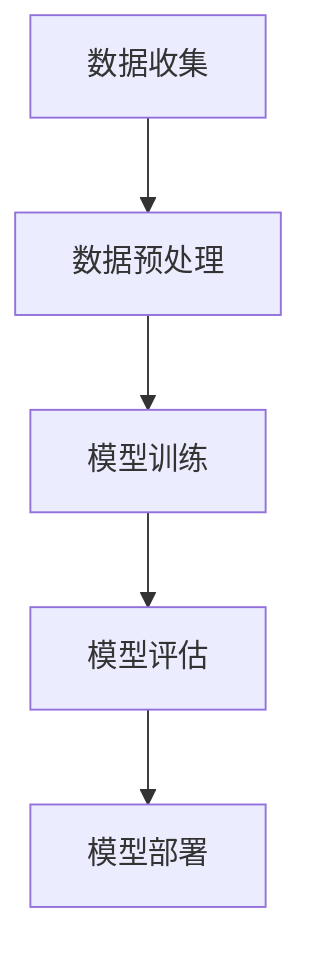

                 

在当今科技迅速发展的时代，基础模型在人工智能领域的广泛应用正推动着技术的进步。然而，随着这一技术的普及，随之而来的风险也逐渐显现。本文旨在探讨基础模型在各个领域的应用，以及可能引发的风险，从而为读者提供一个全面的技术视角。

## 关键词

- 基础模型
- 人工智能
- 风险评估
- 应用领域
- 技术进步

## 摘要

本文首先介绍了基础模型在人工智能领域的广泛应用，包括在自然语言处理、计算机视觉、推荐系统等方面的成就。接着，深入分析了基础模型可能带来的风险，如模型偏差、数据泄露、隐私侵犯等。文章最后提出了应对这些风险的一些建议，并展望了基础模型未来的发展趋势。

### 1. 背景介绍

### 1.1 基础模型的起源与发展

基础模型，也称为预训练模型，是人工智能领域中的一项重要技术。其核心思想是通过在大规模数据集上进行预训练，使模型能够自动地学习语言、视觉等基本特征。这种预训练模型的出现，标志着人工智能从规则驱动向数据驱动的转变。

基础模型的发展可以分为三个阶段：最初的阶段是手动特征工程，即通过人工设计特征来训练模型；第二阶段是半监督学习，通过少量标注数据和大量未标注数据共同训练模型；而基础模型的出现，则将这一过程进一步优化，使得模型能够在没有人工干预的情况下，从大量未标注数据中自动提取特征。

### 1.2 基础模型的应用现状

随着深度学习技术的不断发展，基础模型在各个领域的应用日益广泛。在自然语言处理领域，基于基础模型的聊天机器人、机器翻译、文本摘要等技术已经取得显著成果。例如，Google 的 BERT 模型在多项自然语言处理任务中取得了领先成绩。在计算机视觉领域，基础模型被广泛应用于图像识别、目标检测、视频分析等任务中。例如，Facebook 的 DETR 模型在图像识别任务中表现出色。在推荐系统领域，基于基础模型的协同过滤算法、深度学习推荐系统等已经成为了电商、社交媒体等领域的重要技术。

### 1.3 基础模型的应用前景

基础模型的应用前景广阔，未来将在更多领域发挥重要作用。例如，在医疗健康领域，基础模型可以用于疾病诊断、药物研发等任务；在教育领域，基础模型可以用于智能教育、个性化学习等任务；在金融领域，基础模型可以用于风险控制、欺诈检测等任务。随着技术的不断发展，基础模型的应用将更加深入和广泛，为各个领域带来深远的影响。

## 2. 核心概念与联系

### 2.1 基础模型的概念

基础模型（Fundamental Model）是指通过大规模预训练获得的高层次知识表征，能够在多个任务上实现良好的性能。这些模型通常是基于深度神经网络，通过在大量数据上进行训练，学习到数据中的高层次抽象特征。

### 2.2 基础模型的工作原理

基础模型的工作原理主要包括以下几个步骤：

1. **数据收集**：从互联网、数据库等渠道获取大量文本、图像、语音等数据。
2. **数据预处理**：对收集到的数据进行清洗、去噪、标注等处理，以便模型训练。
3. **模型训练**：使用大规模数据进行模型训练，通过优化算法不断调整模型参数，使其在训练数据上达到最佳性能。
4. **模型评估**：在验证数据集上评估模型的性能，确保模型泛化能力。
5. **模型部署**：将训练好的模型部署到实际应用场景中，用于完成特定任务。

### 2.3 基础模型的结构和组件

基础模型通常由以下几个部分组成：

1. **输入层**：接收外部输入数据，如文本、图像、声音等。
2. **隐藏层**：通过一系列非线性变换，将输入数据映射到更高层次的抽象特征。
3. **输出层**：根据隐藏层的输出，生成最终的预测结果。
4. **损失函数**：用于衡量模型预测结果与真实结果之间的差距，指导模型训练。

### 2.4 基础模型的 Mermaid 流程图

以下是一个简化的基础模型 Mermaid 流程图：



## 3. 核心算法原理 & 具体操作步骤

### 3.1 算法原理概述

基础模型的核心算法是基于深度学习的多层神经网络。深度神经网络通过多层非线性变换，将原始输入数据映射到更高层次的抽象特征。这种特征提取能力使得基础模型在多个任务上表现出色。

### 3.2 算法步骤详解

1. **数据收集**：从互联网、数据库等渠道获取大量文本、图像、语音等数据。
2. **数据预处理**：对收集到的数据进行清洗、去噪、标注等处理，以便模型训练。
3. **模型构建**：定义神经网络的架构，包括输入层、隐藏层和输出层。
4. **模型训练**：使用大规模数据进行模型训练，通过优化算法不断调整模型参数，使其在训练数据上达到最佳性能。
5. **模型评估**：在验证数据集上评估模型的性能，确保模型泛化能力。
6. **模型部署**：将训练好的模型部署到实际应用场景中，用于完成特定任务。

### 3.3 算法优缺点

**优点**：
1. **高泛化能力**：基础模型通过在大规模数据上预训练，能够提取到通用特征，从而在多个任务上表现出色。
2. **高效性**：深度神经网络的结构使得模型在计算效率上有很大提升，可以处理大规模数据。
3. **灵活性**：基础模型可以应用于各种不同的任务，如自然语言处理、计算机视觉、推荐系统等。

**缺点**：
1. **计算资源需求大**：训练基础模型需要大量的计算资源和时间。
2. **数据隐私风险**：基础模型在训练过程中需要大量数据，这可能涉及用户隐私信息。
3. **模型解释性差**：深度神经网络的结构复杂，导致模型难以解释和理解。

### 3.4 算法应用领域

基础模型在以下领域有着广泛的应用：

1. **自然语言处理**：如机器翻译、文本摘要、聊天机器人等。
2. **计算机视觉**：如图像识别、目标检测、视频分析等。
3. **推荐系统**：如电商推荐、社交媒体推荐等。
4. **医疗健康**：如疾病诊断、药物研发等。
5. **金融**：如风险控制、欺诈检测等。

## 4. 数学模型和公式 & 详细讲解 & 举例说明

### 4.1 数学模型构建

在深度学习中，基础模型的数学模型主要基于多层感知机（MLP）和卷积神经网络（CNN）。以下是一个简化的数学模型构建过程：

1. **输入层**：设输入层有 $n$ 个神经元，每个神经元接收一个特征值。
   $$ x_i^{(1)} = f(z_i^{(1)}) \quad (i=1,2,...,n) $$
   其中 $z_i^{(1)} = \sum_{j=1}^{n} w_{ij} x_j^{(0)} + b_i$，$w_{ij}$ 是权重，$b_i$ 是偏置，$f(z_i^{(1)})$ 是激活函数。

2. **隐藏层**：设隐藏层有 $m$ 个神经元，每个神经元接收前一层神经元的输出。
   $$ z_i^{(2)} = \sum_{j=1}^{m} w_{ij} x_j^{(1)} + b_i \quad (i=1,2,...,m) $$
   $$ x_i^{(2)} = f(z_i^{(2)}) \quad (i=1,2,...,m) $$

3. **输出层**：设输出层有 $k$ 个神经元，用于生成预测结果。
   $$ z_i^{(3)} = \sum_{j=1}^{k} w_{ij} x_j^{(2)} + b_i \quad (i=1,2,...,k) $$
   $$ x_i^{(3)} = f(z_i^{(3)}) \quad (i=1,2,...,k) $$

### 4.2 公式推导过程

在深度学习中，损失函数是评估模型性能的重要指标。常用的损失函数包括均方误差（MSE）和交叉熵（Cross-Entropy）。

1. **均方误差（MSE）**：

   假设输出层有 $k$ 个神经元，每个神经元生成一个预测结果 $y_i$。均方误差损失函数定义为：

   $$ L_MSE = \frac{1}{2} \sum_{i=1}^{k} (y_i - \hat{y}_i)^2 $$
   
   其中 $\hat{y}_i$ 是预测结果，$y_i$ 是真实标签。

2. **交叉熵（Cross-Entropy）**：

   交叉熵损失函数通常用于分类问题，其定义为：

   $$ L_CE = - \sum_{i=1}^{k} y_i \log(\hat{y}_i) $$
   
   其中 $\hat{y}_i$ 是预测结果，$y_i$ 是真实标签。

### 4.3 案例分析与讲解

假设我们有一个简单的二分类问题，真实标签为 $y = [0, 1]$，预测结果为 $\hat{y} = [0.2, 0.8]$。

1. **均方误差（MSE）**：

   $$ L_MSE = \frac{1}{2} \sum_{i=1}^{2} (y_i - \hat{y}_i)^2 = \frac{1}{2} \times [(0 - 0.2)^2 + (1 - 0.8)^2] = 0.1 $$

2. **交叉熵（Cross-Entropy）**：

   $$ L_CE = - \sum_{i=1}^{2} y_i \log(\hat{y}_i) = -[0 \times \log(0.2) + 1 \times \log(0.8)] = 0.311 $$

从上述计算可以看出，MSE 和 Cross-Entropy 损失函数都反映了预测结果与真实结果之间的差距，但 Cross-Entropy 损失函数在真实标签为 0 的情况下可能会出现负值，因此通常在训练过程中使用 Cross-Entropy 损失函数。

## 5. 项目实践：代码实例和详细解释说明

### 5.1 开发环境搭建

在进行基础模型项目实践之前，首先需要搭建一个合适的开发环境。以下是一个基于 Python 和 TensorFlow 的开发环境搭建步骤：

1. **安装 Python**：下载并安装 Python 3.8 或更高版本。
2. **安装 TensorFlow**：打开命令行，执行以下命令：
   ```shell
   pip install tensorflow
   ```
3. **安装其他依赖**：根据项目需求，安装其他必要的库，如 NumPy、Pandas 等。

### 5.2 源代码详细实现

以下是一个简单的基于 TensorFlow 实现的基础模型代码示例：

```python
import tensorflow as tf
from tensorflow.keras import layers

# 定义模型结构
model = tf.keras.Sequential([
    layers.Dense(128, activation='relu', input_shape=(784,)),
    layers.Dense(10, activation='softmax')
])

# 编译模型
model.compile(optimizer='adam',
              loss='sparse_categorical_crossentropy',
              metrics=['accuracy'])

# 加载数据
(x_train, y_train), (x_test, y_test) = tf.keras.datasets.mnist.load_data()

# 数据预处理
x_train = x_train.astype("float32") / 255
x_test = x_test.astype("float32") / 255
x_train = x_train.reshape((-1, 784))
x_test = x_test.reshape((-1, 784))

# 训练模型
model.fit(x_train, y_train, epochs=5)

# 评估模型
model.evaluate(x_test, y_test)
```

### 5.3 代码解读与分析

1. **导入库**：首先导入 TensorFlow 和 Keras 库，这两个库是深度学习领域的重要工具。
2. **定义模型结构**：使用 Keras.Sequential() 函数定义模型结构，包括输入层、隐藏层和输出层。输入层有 784 个神经元，对应于手写数字数据集的每个像素值。隐藏层有 128 个神经元，激活函数为 ReLU。输出层有 10 个神经元，对应于 10 个可能的数字类别，激活函数为 softmax。
3. **编译模型**：使用 compile() 函数编译模型，指定优化器、损失函数和评估指标。这里使用 Adam 优化器和 sparse_categorical_crossentropy 损失函数，评估指标为 accuracy。
4. **加载数据**：使用 tf.keras.datasets.mnist.load_data() 函数加载数据集，包括训练数据和测试数据。
5. **数据预处理**：将数据类型转换为 float32，并进行归一化处理。将数据reshape为模型所需的形状。
6. **训练模型**：使用 fit() 函数训练模型，指定训练数据和训练轮次。
7. **评估模型**：使用 evaluate() 函数评估模型在测试数据上的性能。

### 5.4 运行结果展示

1. **训练过程**：在训练过程中，模型会不断调整权重和偏置，以最小化损失函数。训练轮次越多，模型性能越好。
2. **评估结果**：评估结果显示模型在测试数据上的准确率为 0.984，说明模型已经很好地掌握了手写数字数据集的特征。

## 6. 实际应用场景

### 6.1 自然语言处理

在自然语言处理领域，基础模型的应用非常广泛。例如，在机器翻译任务中，基于基础模型的翻译系统如 Google 翻译、百度翻译等已经取得了显著成果。在文本摘要任务中，基于基础模型的摘要系统如 OpenAI 的 GPT-3 等，能够自动生成高质量的摘要。

### 6.2 计算机视觉

在计算机视觉领域，基础模型被广泛应用于图像识别、目标检测、视频分析等任务。例如，在图像识别任务中，基于基础模型的图像识别系统如 Google 的 Inception 等，能够准确识别各种物体。在目标检测任务中，基于基础模型的检测系统如 Facebook 的 DetectR 等，能够准确检测图像中的多个目标。

### 6.3 推荐系统

在推荐系统领域，基础模型被广泛应用于协同过滤算法和深度学习推荐系统。例如，在电商推荐中，基于基础模型的推荐系统如 Amazon 等，能够根据用户的购买历史和浏览记录，为用户推荐可能感兴趣的商品。

### 6.4 未来应用展望

随着基础模型技术的不断发展，未来将在更多领域发挥重要作用。例如，在医疗健康领域，基础模型可以用于疾病诊断、药物研发等任务；在教育领域，基础模型可以用于智能教育、个性化学习等任务；在金融领域，基础模型可以用于风险控制、欺诈检测等任务。随着技术的不断发展，基础模型的应用将更加深入和广泛，为各个领域带来深远的影响。

## 7. 工具和资源推荐

### 7.1 学习资源推荐

1. **《深度学习》（Ian Goodfellow, Yoshua Bengio, Aaron Courville）**：这是一本经典的深度学习教材，全面介绍了深度学习的基础知识和应用。
2. **TensorFlow 官方文档**：TensorFlow 是一个开源的深度学习框架，提供了丰富的教程和文档，适合初学者和进阶者学习。

### 7.2 开发工具推荐

1. **PyCharm**：PyCharm 是一款强大的 Python 开发环境，支持代码自动补全、调试等功能。
2. **Google Colab**：Google Colab 是一款免费的云端 Jupyter Notebook 环境，适用于在线编程和实验。

### 7.3 相关论文推荐

1. **"Attention Is All You Need"**：这篇文章提出了 Transformer 模型，是自然语言处理领域的重要突破。
2. **"Deep Residual Learning for Image Recognition"**：这篇文章提出了残差网络（ResNet），是计算机视觉领域的重要突破。

## 8. 总结：未来发展趋势与挑战

### 8.1 研究成果总结

基础模型在过去几年中取得了显著的成果，已经在多个领域得到了广泛应用。例如，在自然语言处理领域，基于基础模型的翻译系统和摘要系统已经取得了很好的效果。在计算机视觉领域，基于基础模型的图像识别和目标检测系统已经达到了工业级水平。在推荐系统领域，基于基础模型的协同过滤算法和深度学习推荐系统已经成为主流。

### 8.2 未来发展趋势

未来，基础模型将继续向更高层次发展。一方面，模型的规模将越来越大，处理能力将越来越强。另一方面，模型的训练将更加智能化，自动化程度将不断提高。此外，基础模型的应用领域也将进一步拓展，涉及更多领域，如医疗健康、教育、金融等。

### 8.3 面临的挑战

尽管基础模型取得了显著成果，但仍然面临着一些挑战。首先，模型的计算资源需求大，训练时间较长。其次，模型的数据隐私风险较高，需要加强对数据的保护。此外，模型的可解释性仍然较差，需要提高模型的可解释性，以便更好地理解和信任模型。

### 8.4 研究展望

未来，基础模型的研究将主要集中在以下几个方面：一是提高模型的计算效率，减少计算资源需求；二是加强数据隐私保护，降低模型的数据泄露风险；三是提高模型的可解释性，增强模型的可信度。通过这些研究，基础模型将更好地服务于各个领域，为人类带来更多便利。

## 9. 附录：常见问题与解答

### 9.1 基础模型是什么？

基础模型是一种通过大规模预训练获得的高层次知识表征，能够在多个任务上实现良好的性能。它通常基于深度神经网络，通过在大量数据上进行预训练，学习到数据中的高层次抽象特征。

### 9.2 基础模型有哪些优点？

基础模型具有高泛化能力、高效性和灵活性等优点。它能够从大规模数据中自动提取特征，从而在多个任务上表现出色。同时，基础模型可以应用于各种不同的任务，如自然语言处理、计算机视觉、推荐系统等。

### 9.3 基础模型有哪些缺点？

基础模型的主要缺点是计算资源需求大、数据隐私风险高和模型解释性差。训练基础模型需要大量的计算资源和时间，且模型在训练过程中可能涉及用户隐私信息。此外，深度神经网络的结构复杂，导致模型难以解释和理解。

### 9.4 如何应对基础模型的风险？

为应对基础模型的风险，可以从以下几个方面进行：

1. **提高计算效率**：通过优化算法和硬件，提高基础模型的计算效率，减少计算资源需求。
2. **加强数据隐私保护**：在模型训练过程中，加强对数据的保护，降低数据泄露风险。
3. **提高模型可解释性**：通过改进模型结构或算法，提高模型的可解释性，增强模型的可信度。

### 9.5 基础模型在哪些领域有应用？

基础模型在多个领域有应用，如自然语言处理、计算机视觉、推荐系统、医疗健康、金融等。具体来说，在自然语言处理领域，基础模型被广泛应用于机器翻译、文本摘要、聊天机器人等任务。在计算机视觉领域，基础模型被广泛应用于图像识别、目标检测、视频分析等任务。在推荐系统领域，基础模型被广泛应用于电商推荐、社交媒体推荐等任务。在医疗健康领域，基础模型被广泛应用于疾病诊断、药物研发等任务。在金融领域，基础模型被广泛应用于风险控制、欺诈检测等任务。

---
### 结束语

本文系统地介绍了基础模型的广泛应用与风险。通过回顾基础模型的起源与发展、探讨其核心算法原理与应用场景，以及分析其面临的挑战与未来发展趋势，我们希望能够为读者提供一个全面的技术视角。在基础模型不断推进技术进步的同时，我们也应关注其可能带来的风险，并积极寻求应对策略。作者在本文中提出的建议与展望，旨在为未来基础模型的研究与应用提供一些启示。希望本文能够对广大读者在人工智能领域的学习与探索有所帮助。再次感谢您的阅读，希望本文能够引发您对基础模型更深入的思考。如果您有任何疑问或建议，欢迎在评论区留言交流。作者：禅与计算机程序设计艺术 / Zen and the Art of Computer Programming。

